# 1：导学与课程大纲概述 📚

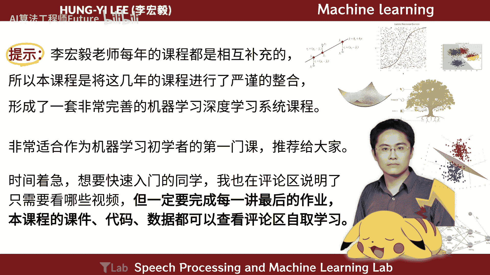


在本节课中，我们将对李宏毅老师的机器学习课程进行一个全面的概述。你将了解到课程的整体结构、核心学习目标以及贯穿整个学期的关键概念。我们将从机器学习的本质定义开始，逐步深入到深度学习、监督学习、自监督学习等具体技术，并预览后续课程将涵盖的进阶主题。

## 什么是机器学习？🤖

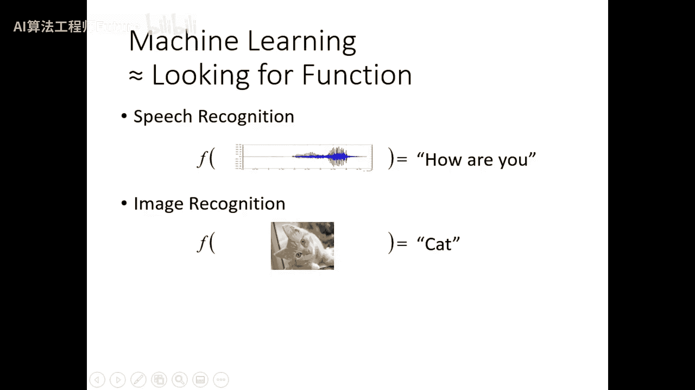


上一节我们介绍了课程的整体框架，本节中我们来看看机器学习的核心定义。

机器学习，简单来说，就是让机器自动为我们寻找一个函数。这个函数 `f` 可以将输入 `x` 映射到我们期望的输出 `y`。

**公式：** `y = f(x)`

这个函数 `f` 通常非常复杂，超出了人类手工编写的范畴。机器学习的任务就是通过数据和算法，自动地将这个函数找出来。

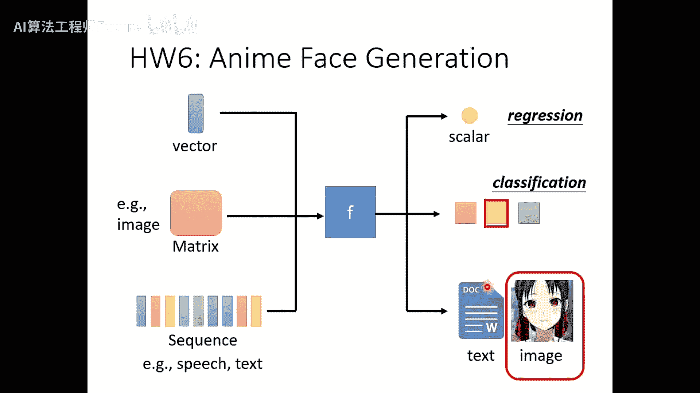

以下是几个具体的例子：

- **语音识别**：函数 `f` 的输入是一段声音信号，输出是这段声音对应的文字。
- **图像识别**：函数 `f` 的输入是一张图片，输出是图片中包含的物体类别（例如：猫、狗）。
- **围棋程序（如AlphaGo）**：函数 `f` 的输入是棋盘上所有棋子的位置，输出是下一步最佳的落子位置。

因此，机器学习就是寻找人类难以直接编写的复杂函数的技术。

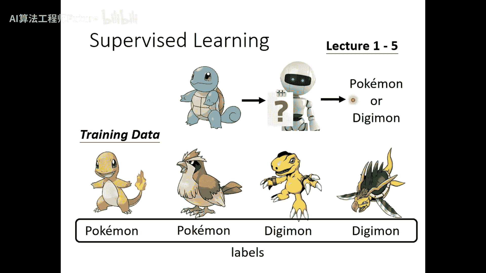

## 本课程的核心：深度学习 🧠

在明确了机器学习的目标后，我们来看看本课程将重点讲解的实现方法——深度学习。

当我们谈论深度学习时，我们特指使用**类神经网络**来构建和寻找上述函数 `f`。类神经网络是一种由多层“神经元”连接而成的数学模型，它能够通过调整内部参数来逼近复杂的函数关系。

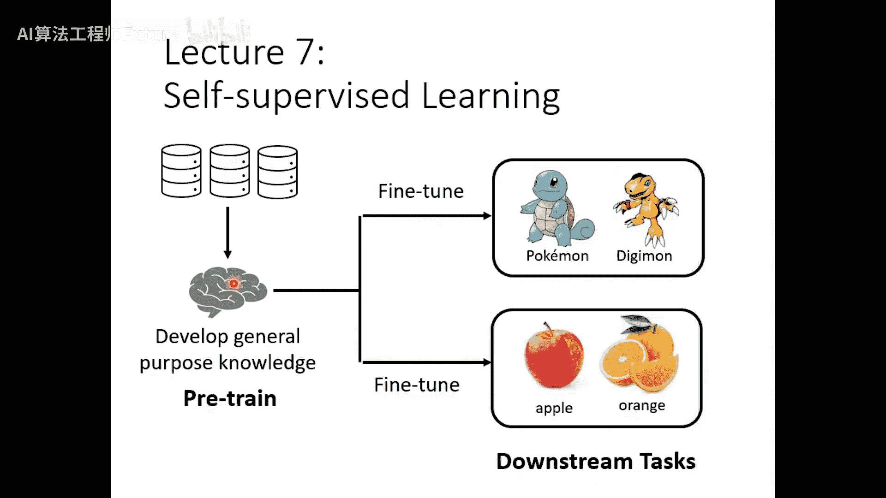

**代码示意（概念）：**

```python
# 一个简单的神经网络模型概念
model = NeuralNetwork()
model.add(Layer(input_dim, output_dim, activation='relu'))
# ... 更多层
model.compile(optimizer='adam', loss='mse')
model.fit(training_data, training_labels)
```

这个函数 `f`（即神经网络）可以处理各种类型的输入和输出，本课程将通过一系列作业带你实践：

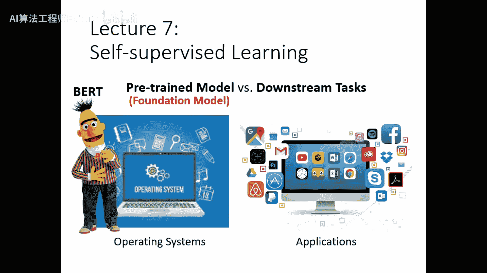

以下是本课程前六讲对应的实践作业：

1. **第一讲作业**：COVID-19确诊率预测。输入是向量，输出是数值（回归问题）。
2. **第二讲作业**：语音分类（语音识别的简化版）。输入是向量，输出是类别（分类问题）。
3. **第三讲作业**：图像识别。输入是图像（矩阵），输出是类别。
4. **第四讲作业**：说话人辨认。输入是声音序列，输出是类别。
5. **第五讲作业**：机器翻译。输入是一个句子（序列），输出是另一个句子（序列）。
6. **第六讲作业**：动漫人物人脸生成。输入是随机向量，输出是图像。

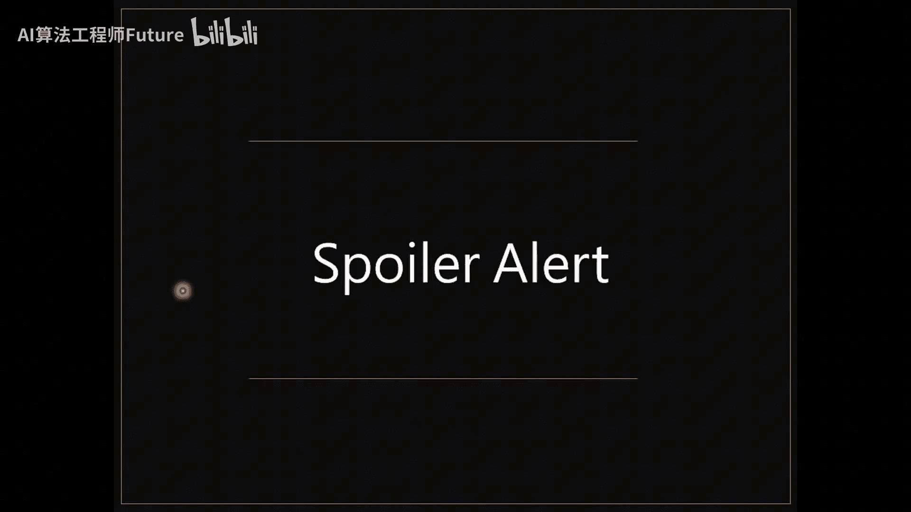

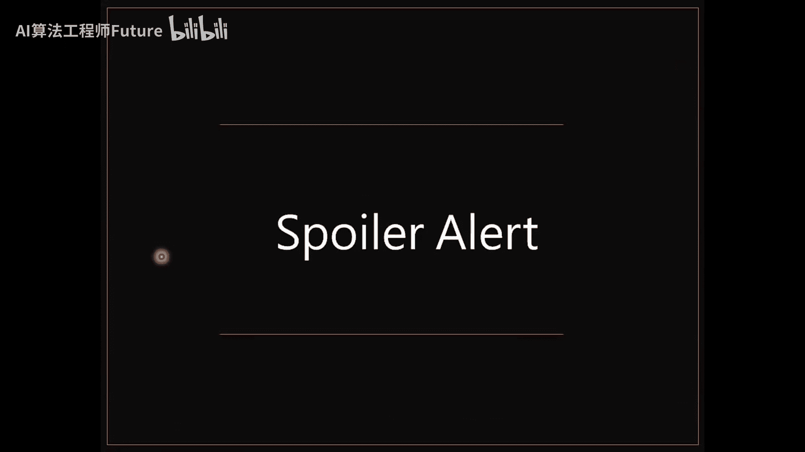

## 如何寻找函数：监督学习 📖

了解了我们要找什么样的函数后，接下来看看最经典的学习范式——监督学习是如何运作的。

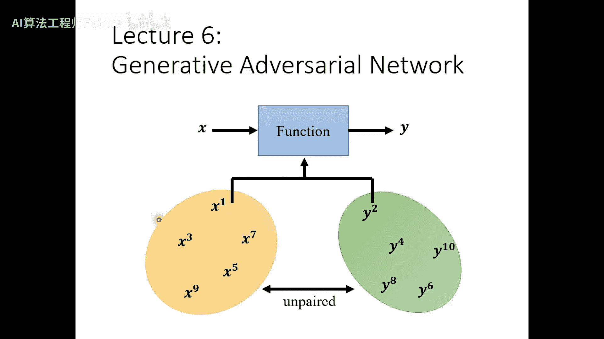

在第一讲到第五讲中，我们将主要使用**监督学习**的方法。其核心思想是，我们需要为机器提供大量“有标准答案”的训练数据。

假设我们要训练一个区分“宝可梦”和“数码宝贝”的分类器。在监督学习中，我们需要做的是：

1. 收集大量动物图片。
2. 为每一张图片人工标注它是“宝可梦”还是“数码宝贝”（这个标签称为 **label**）。
3. 将这批带有标签 `(x, y)` 的数据输入给机器学习算法。
4. 算法会自动寻找一个函数 `f`，使得对于训练数据，`f(x)` 尽可能接近真实的标签 `y`。


## 超越监督学习：自监督学习与基础模型 🚀

然而，监督学习需要大量人工标注数据，成本高昂。本节我们将介绍一种更高效的学习范式——自监督学习。

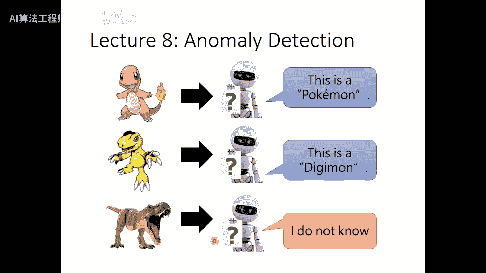

**自监督学习** 的目标是让模型在接触具体任务前，先通过无标注数据“预习”或“练好基本功”，这个过程称为 **预训练**。这好比学习各种武术呼吸法前，先练习吹爆葫芦来提升肺活量。

模型如何从无标签数据中学习呢？例如，我们可以将一张图片旋转、裁剪或变色，然后让模型判断两张处理后的图片是否源自同一张原图。通过完成大量这类“自创”的任务，模型能学到数据中有用的通用特征。

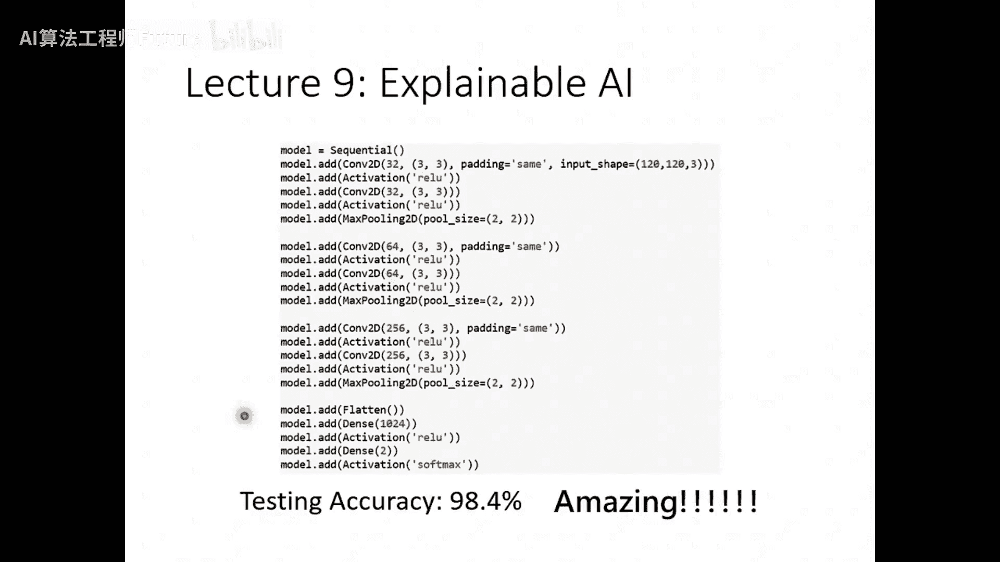

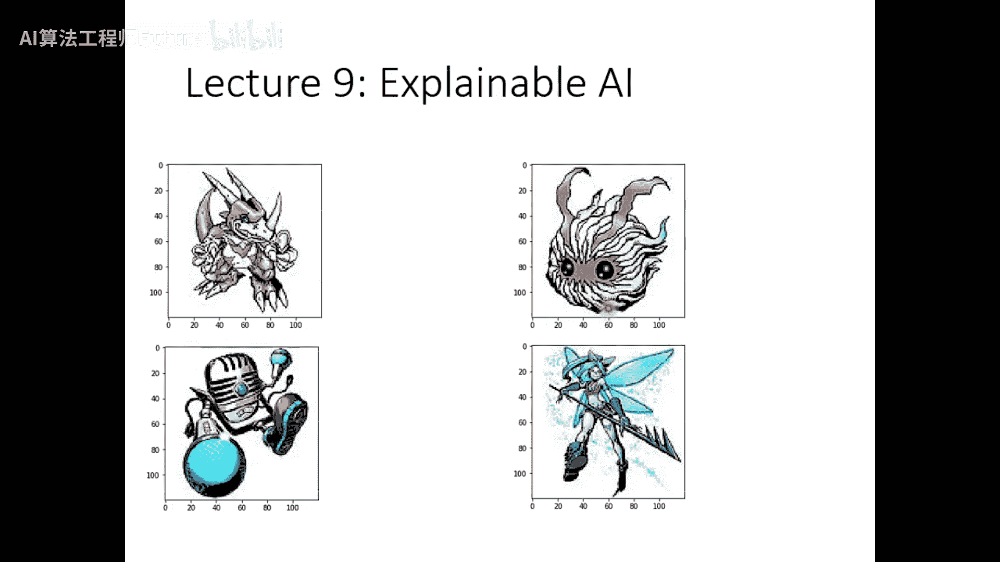

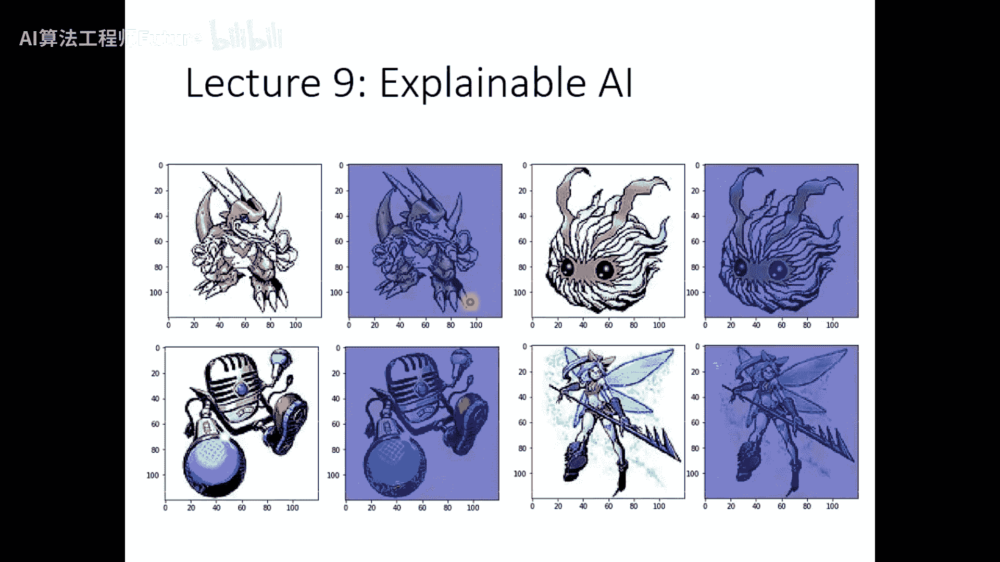

当模型在预训练中打好基础后，我们再将其用于具体的**下游任务**（如分类猫狗），往往只需要少量标注数据就能取得很好效果。预训练模型与下游任务的关系，类似于操作系统与应用程序：操作系统处理了复杂的底层工作，使得开发新应用变得简单。

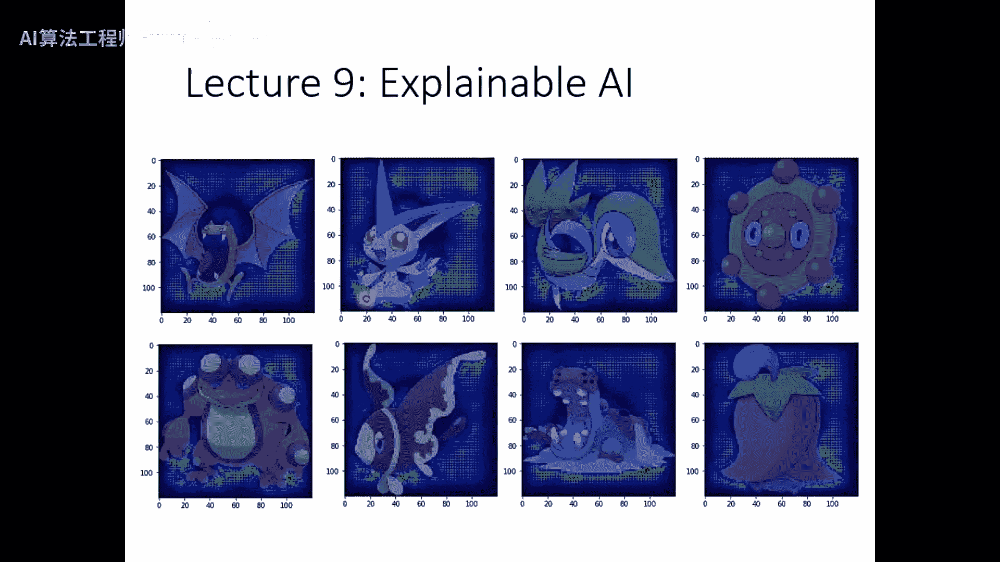

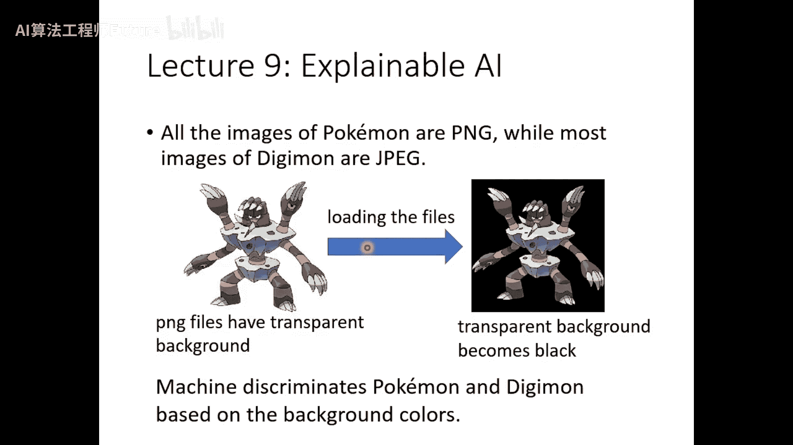

这种强大的预训练模型如今常被称为 **基础模型**。一个著名的例子是 **BERT** 模型，它通过在海量文本上进行自监督学习，成为了处理自然语言任务的强大“基础”。

## 其他关键技术预览 🔮

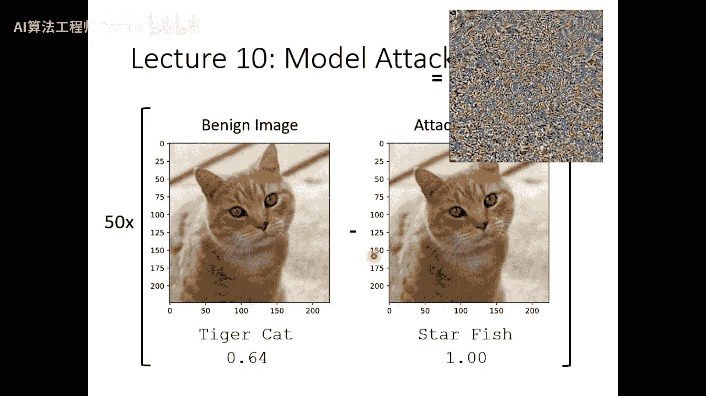

除了上述核心内容，本课程还将涵盖机器学习领域的多个重要进阶主题：

以下是课程后半部分将探讨的关键技术：

- **生成对抗网络**：只需分别收集大量X和Y，无需它们成对出现，模型也能学习X到Y的映射（如无配对语音与文本的语音识别）。
- **强化学习**：在无法提供明确标签（如下围棋时不知道绝对最优的一手），但能定义最终结果好坏（输赢）时使用。
- **异常检测**：让模型具备判断“我不知道”的能力，识别出训练时未见过的异常输入。
- **可解释人工智能**：不仅让模型做出预测，还要理解它为何做出这样的决策，避免模型学到无关的虚假特征。
- **对抗攻击**：研究如何通过微小的、人眼难以察觉的扰动，使高性能模型做出错误判断，并探讨防御方法。
- **领域自适应**：解决训练数据与测试数据分布不一致（如训练是黑白图片，测试是彩色图片）时，模型性能下降的问题。
- **模型压缩**：将庞大的模型（如BERT）精简，以便部署在手机、手表等资源受限的设备上。
- **终身学习**：探讨如何让模型像人类一样持续学习新任务而不遗忘旧知识，这是实现通用人工智能的关键挑战之一。
- **元学习**：让模型学会“如何学习”。通过从大量任务中学习，模型能够自己发明出更高效的学习算法，从而在仅有少量样本的情况下快速掌握新任务。

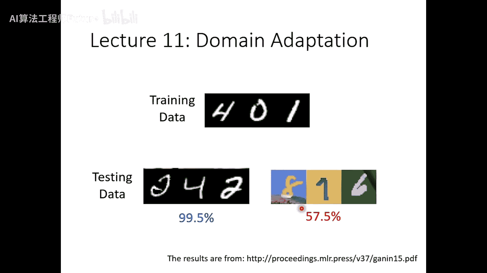

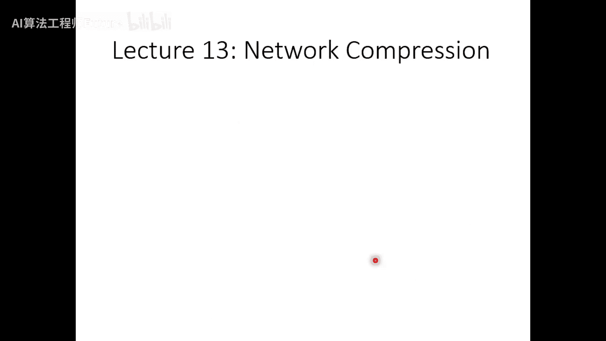

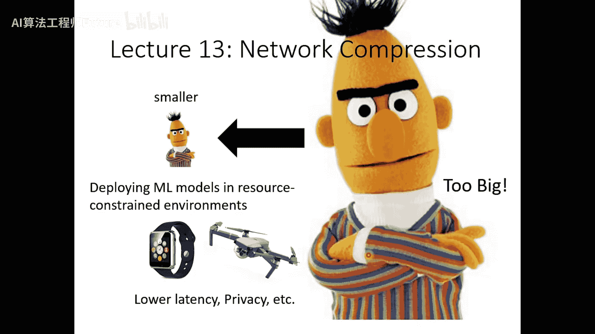

## 总结与学习建议 📝

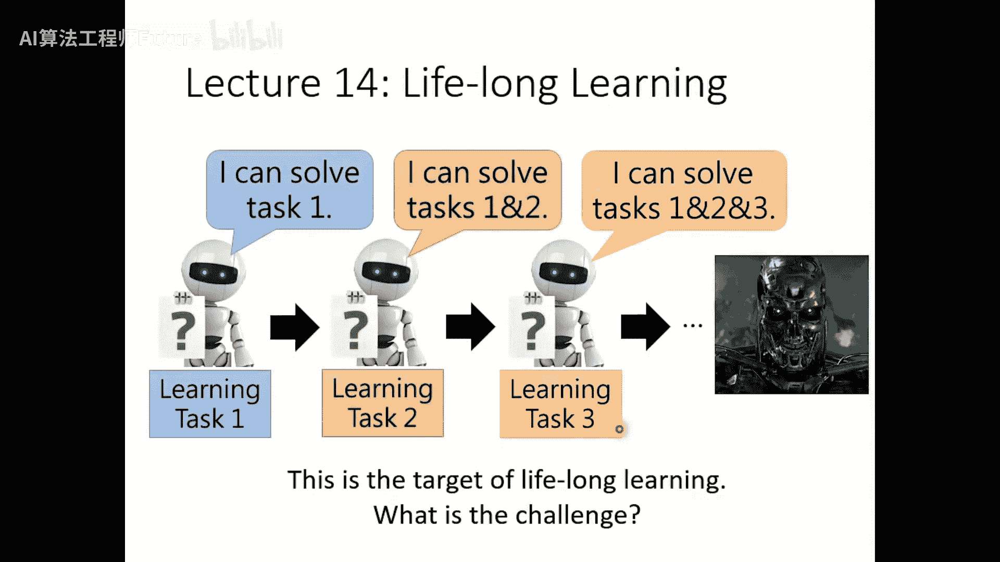

本节课中我们一起学习了机器学习的基本定义——寻找函数 `f`，并了解了本课程将以**深度学习**（类神经网络）为主要工具。我们概述了从**监督学习**到**自监督学习**的核心学习范式，并预览了生成对抗网络、强化学习、可解释AI等一系列激动人心的进阶主题。

**学习建议**：课程所有录像均已上线，你可以按周学习，也可以自主安排进度。**务必完成每一讲对应的作业**，这是将理论知识转化为实践能力的关键。课程直播将讲解作业和补充新内容，但作业讲解也会录制，方便所有同学学习。

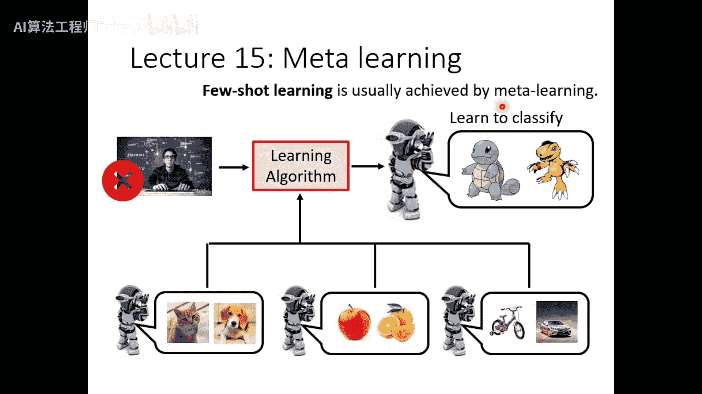

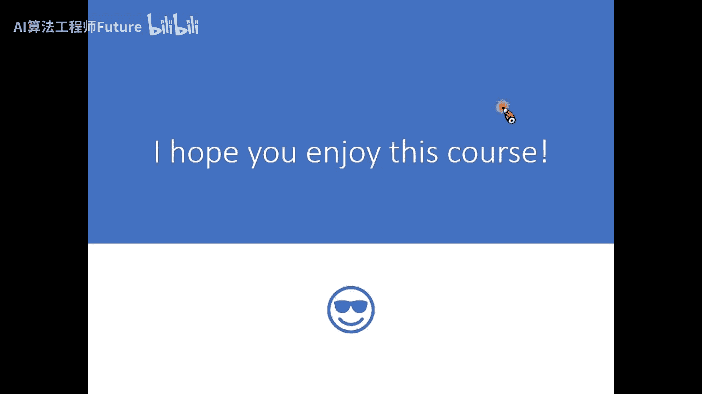

现在，你已经准备好开启机器学习的学习之旅了。下一讲，我们将深入探讨第一个核心概念。
