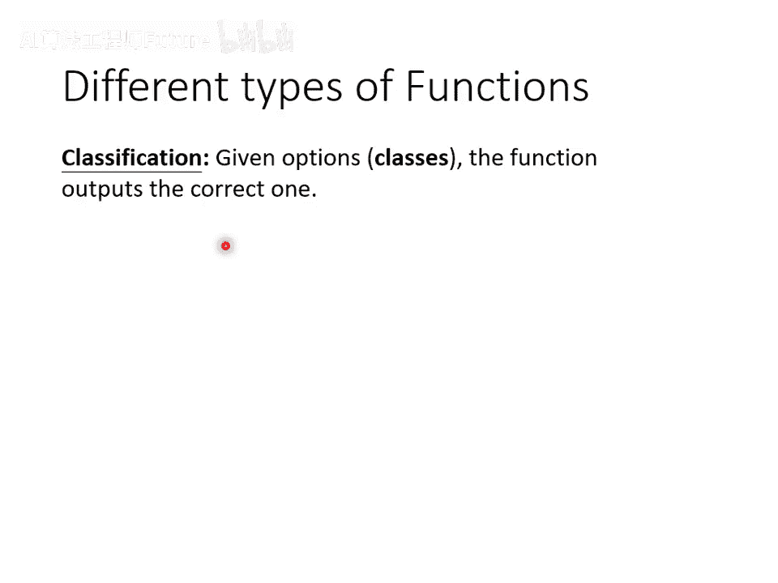
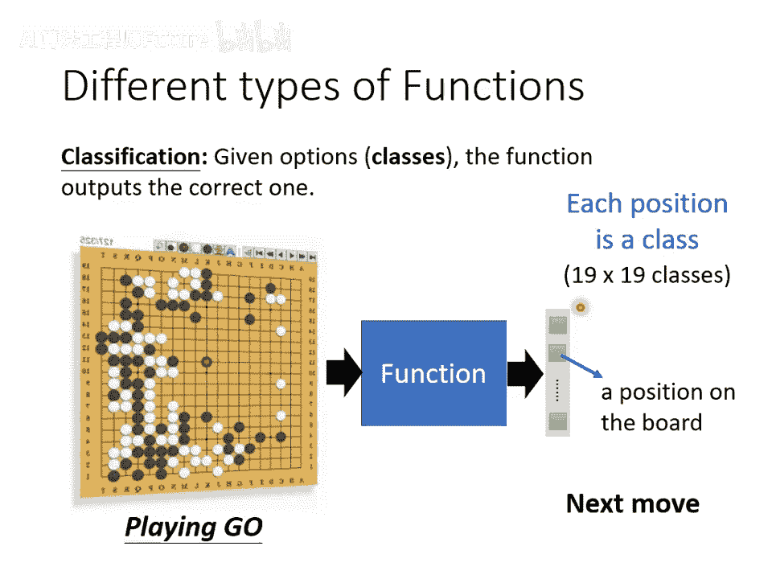
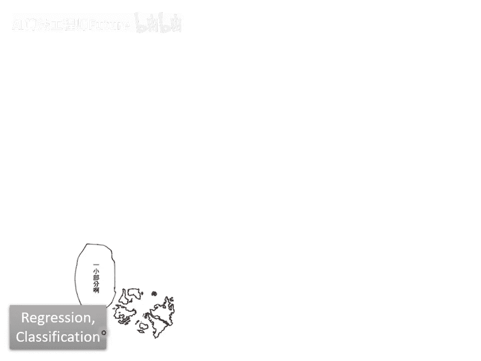
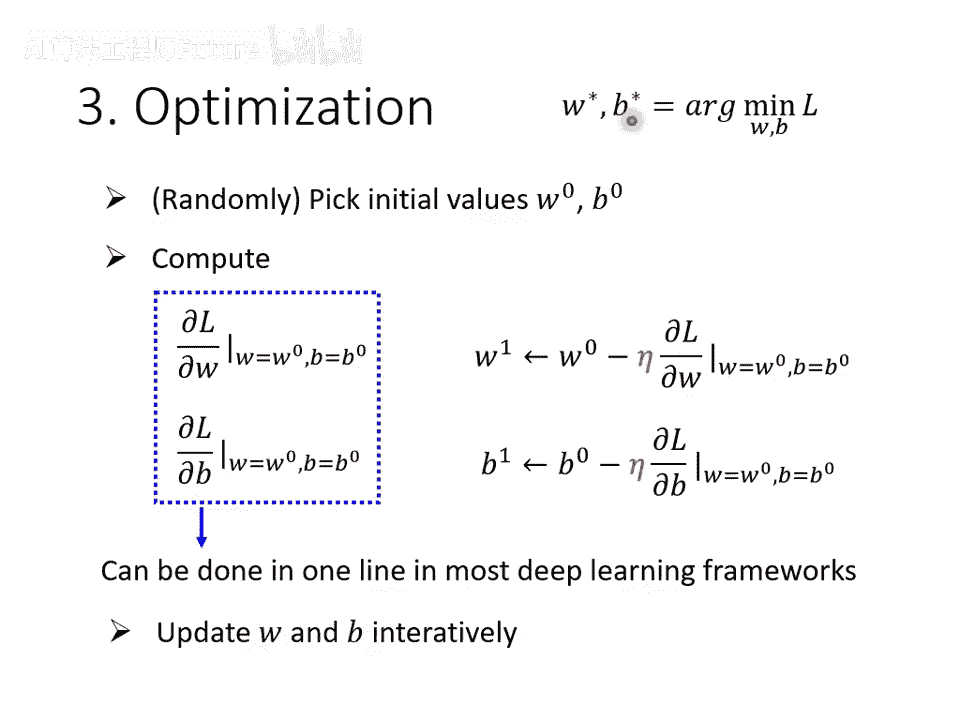
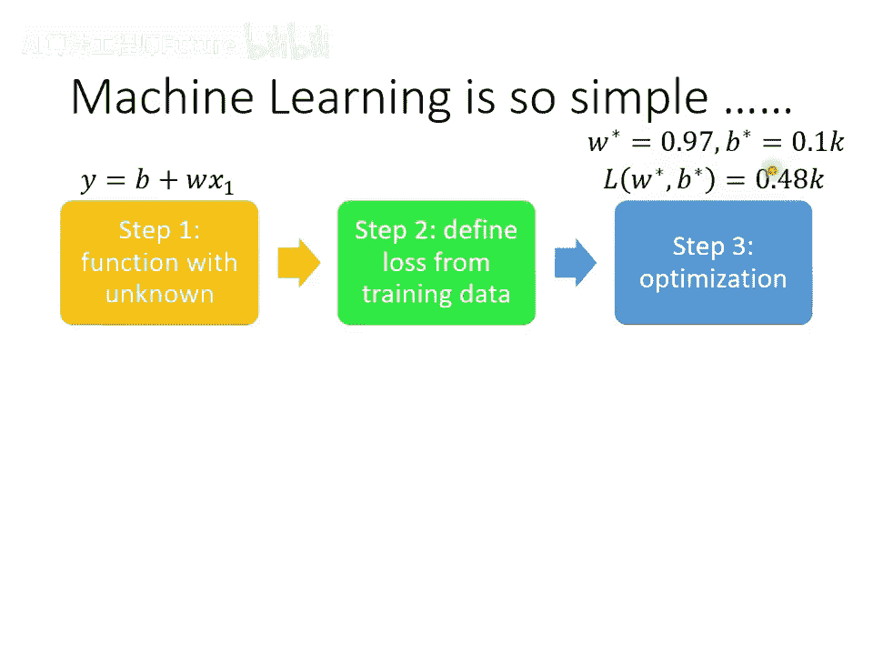
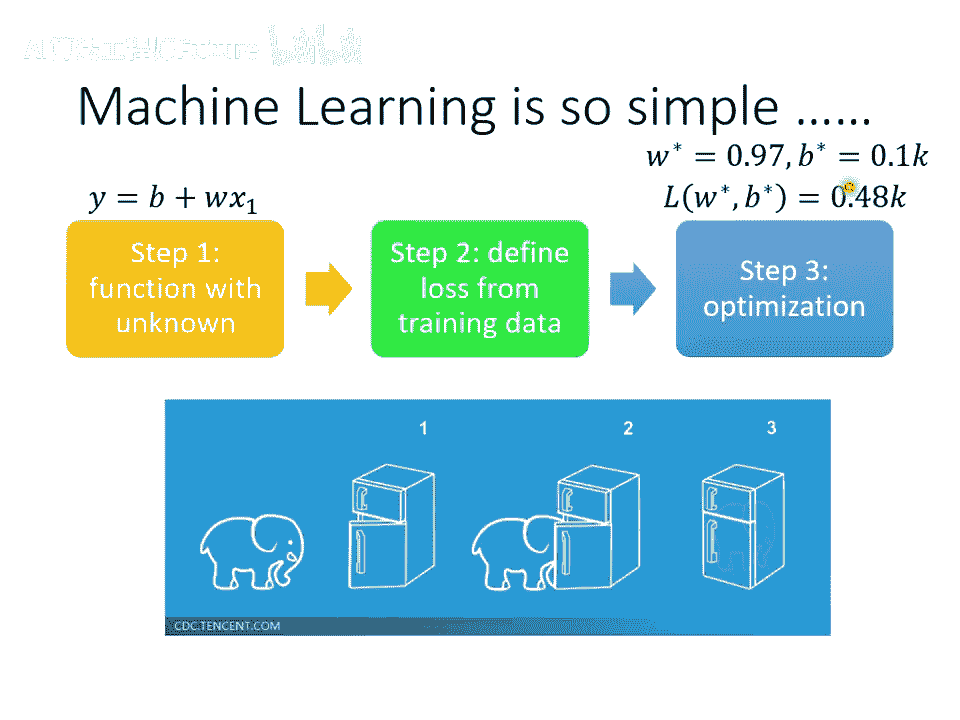
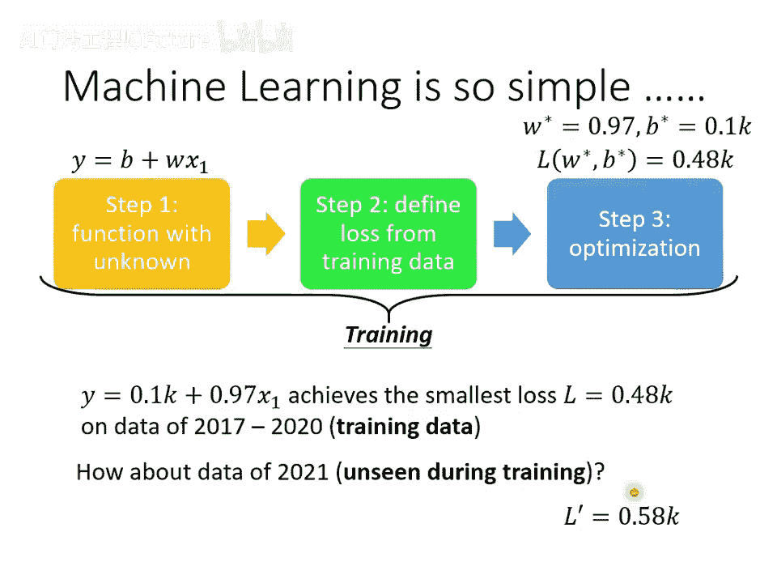
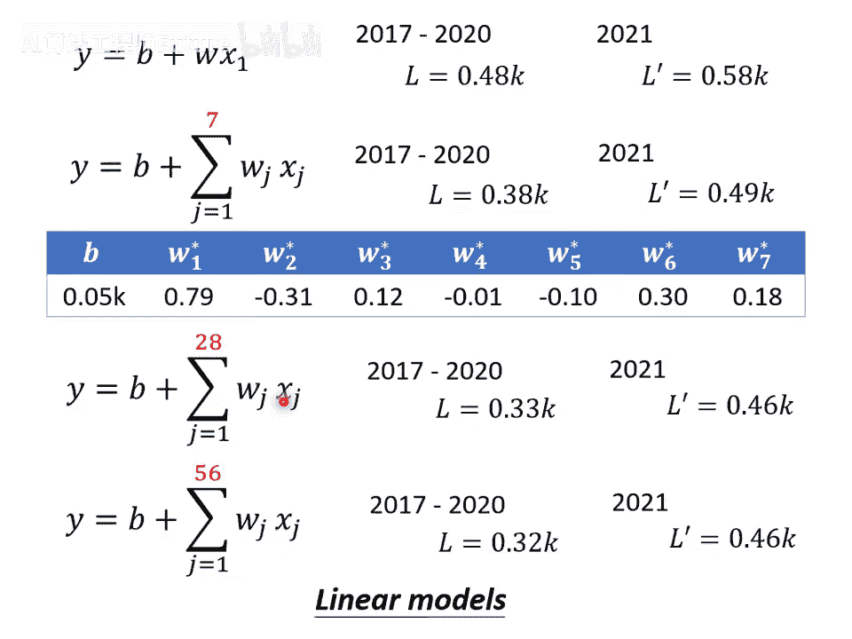

# 2：机器学习基本概念（上） 🧠

在本节课中，我们将要学习机器学习的基本概念。我们将从一个简单的定义开始，逐步了解机器学习的核心任务、基本流程以及一个具体的预测案例。通过本节课，你将理解机器学习如何通过寻找一个函数来解决实际问题。

---

## 什么是机器学习？

机器学习就是让机器具备**寻找一个函数**的能力。

这个函数可以非常复杂，人类无法手动编写其具体形式。机器学习的目的是让机器自动从数据中找出这个函数。

### 机器学习的应用场景

以下是几个需要寻找复杂函数的任务示例：

- **语音识别**：需要一个函数，输入是声音信号，输出是对应的文字。
- **图像识别**：需要一个函数，输入是一张图片，输出是图片中的内容描述。
- **下围棋（如AlphaGo）**：需要一个函数，输入是棋盘上所有棋子的位置，输出是下一步最佳的落子位置。

---

## 机器学习的任务类型

随着我们要寻找的函数输出形式不同，机器学习任务主要分为三类。

### 回归任务

如果我们要找的函数的输出是一个**具体的数值**，这类任务称为**回归**。

**公式示例**：`y = f(x1, x2, ...)`，其中 `y` 是一个数值。

**例子**：预测明天中午的PM2.5数值。函数的输入可能是今天的PM2.5值、平均温度、臭氧浓度等，输出是一个具体的PM2.5数值。

### 分类任务

如果我们要找的函数的输出是从一组预设的**类别**中选择一个，这类任务称为**分类**。

**代码示例**：`class = f(input_data)`，其中 `class` 属于 `{选项1, 选项2, ...}`。

**例子**：

1. **垃圾邮件检测**：输入是一封邮件，输出是“是垃圾邮件”或“不是垃圾邮件”。
2. **下围棋**：输入是棋盘状态，输出是从19x19个可能位置中选择一个落子点。这是一个拥有361个选项的分类问题。

### 结构化学习任务

如果机器需要生成一个**有结构的对象**，而不仅仅是数字或单一类别，这类任务称为**结构化学习**。

**例子**：让机器创作一幅画、写一篇文章或谱一首曲子。这可以理解为让机器学会“创造”。

---

## 机器如何寻找函数？一个具体案例

上一节我们介绍了机器学习的三大任务类型，本节中我们来看看机器是如何具体寻找一个函数的。我们将通过一个“预测YouTube频道次日观看人数”的案例，详细拆解机器学习的三个核心步骤。

### 案例背景

假设我们想预测一个YouTube频道明天的总观看次数。我们可以利用该频道后台的历史数据（如昨天的观看次数、订阅数等）来寻找一个预测函数。

**目标**：找到一个函数 `y = f(x)`，其中：

- `x`：频道后台的历史数据（特征）。
- `y`：预测的次日观看总人数。

### 第一步：建立模型（定义带有未知参数的函数）

首先，我们需要根据对问题的理解，猜测函数 `f` 可能的形式。这需要一些**领域知识**。

**初步猜测**：我们假设“今天的观看人数”与“昨天的观看人数”有关。因此，我们建立一个简单的线性模型：

**公式**：`y = b + w * x1`

- `y`：要预测的今天（未知）的观看人数。
- `x1`：已知的昨天观看人数（这是一个**特征**）。
- `b` 和 `w`：未知的**参数**（`b` 称为**偏差**，`w` 称为**权重**）。

这个带有未知参数的函数就称为**模型**。我们的猜测不一定正确，后续可以修正。

### 第二步：定义损失函数（评估模型好坏）

我们需要一个标准来评估一组特定的参数 `(w, b)` 的好坏。这个标准就是**损失函数**。

**定义**：损失函数 `L` 是一个以模型参数为输入的函数，其输出值代表了这组参数的好坏。输出值越小，说明模型预测得越准。

**计算方法**：

1. 给定一组参数值（例如 `w=1, b=500`），用模型 `y = 500 + 1 * x1` 对历史数据做预测。
2. 对于历史数据中的每一天，计算预测值 `y` 与真实值 `y_hat`（即**标签**）之间的误差 `e`。例如，计算绝对误差：`e = |y - y_hat|`。
3. 将所有天的误差 `e` 加起来取平均，就得到了损失 `L`。

**公式（平均绝对误差，MAE）**：`L = (1/N) * Σ |y_i - y_hat_i|`

通过计算不同 `(w, b)` 组合下的损失 `L`，我们可以绘制出**误差曲面**。曲面上越偏蓝色的区域，损失越小，对应的参数越好。

### 第三步：优化（寻找最佳参数）

我们的目标是找到一组参数 `(w*, b*)`，使得损失函数 `L` 的值最小。这是一个**优化问题**。

本课程将使用**梯度下降**法来解决这个优化问题。其核心思想是“沿着最陡的下坡方向更新参数”。

**操作步骤（以单个参数 `w` 为例）**：

1. **随机初始化**：随机选择一个起始点 `w0`。
2. **计算梯度**：计算在 `w=w0` 处，损失 `L` 对 `w` 的**微分**（即斜率）。微分告诉我们是该增大还是减小 `w` 来降低损失。
3. **更新参数**：按照公式更新参数：`w1 = w0 - η * (dL/dw)`。
  
  `η` 称为**学习率**，是一个需要手动设定的**超参数**，它控制每次更新的步长。
  微分 `dL/dw` 决定了更新的方向。
4. **迭代**：重复步骤2和3，不断更新 `w` 为 `w2, w3, ...`。

**何时停止**：

- 达到预设的更新次数（另一个超参数）。
- 梯度（微分值）变为0，参数不再更新（可能找到局部最低点）。

**对于两个参数 `(w, b)`**：原理完全相同。分别计算 `L` 对 `w` 和 `b` 的偏微分，然后同时更新它们。  

**更新公式**：  

`w1 = w0 - η * (∂L/∂w)`  

`b1 = b0 - η * (∂L/∂b)`

在实际的深度学习框架（如PyTorch）中，微分计算是自动完成的。

---

## 案例结果与模型改进

通过梯度下降优化，我们的简单线性模型 `y = b + w * x1` 在历史数据上得到的平均误差约为480次观看。然而，模型在预测未来数据时误差更大（约580次），这说明模型有改进空间。

### 分析结果与洞察

观察真实数据，我们发现观看人数存在明显的**周期性**：每七天一个循环，周五和周六的观看人数显著降低。

**领域知识的应用**：基于这个洞察，我们应该让模型参考更多天的数据，而不仅仅是前一天。

### 改进模型

我们建立一个新的模型，考虑前七天的数据：

**公式**：`y = b + Σ (w_j * x_j)`，其中 `j = 1 到 7`，`x_j` 代表 `j` 天前的观看人数。

**结果**：

- 在训练数据上，损失从0.48K降至0.38K。
- 在未见的未来数据上，误差从0.58K降至0.49K，预测性能得到提升。

我们还可以尝试考虑更多天（如28天、56天），但性能提升会逐渐达到瓶颈。

### 线性模型

以上这些将**特征** `x` 乘上**权重** `w` 再加**偏差** `b` 的模型，有一个共同的名字——**线性模型**。

---

## 总结

本节课中我们一起学习了机器学习的基本概念：

1. **机器学习的核心**是让机器自动寻找一个函数。
2. **三大任务类型**：回归（输出数值）、分类（输出类别）、结构化学习（输出结构化对象）。
3. **机器学习的三个步骤**：
  
  **建立模型**：定义一个带有未知参数的函数。
  **定义损失函数**：评估参数好坏的标准。
  **优化**：使用梯度下降等方法，寻找使损失最小的最佳参数。
4. 通过“预测观看人数”的案例，我们实践了这三个步骤，并看到了如何利用**领域知识**（如数据的周期性）来改进模型，从简单的单日模型进化到考虑多日信息的线性模型。
