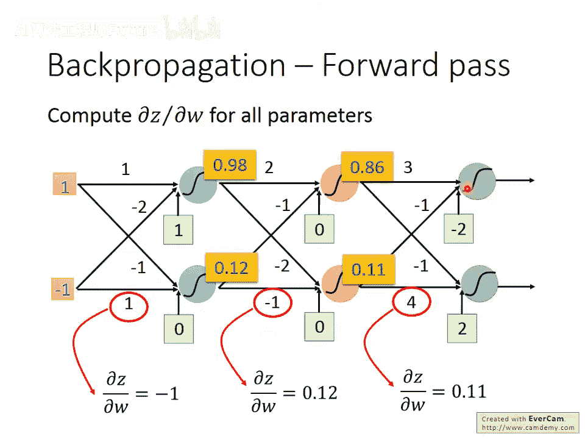
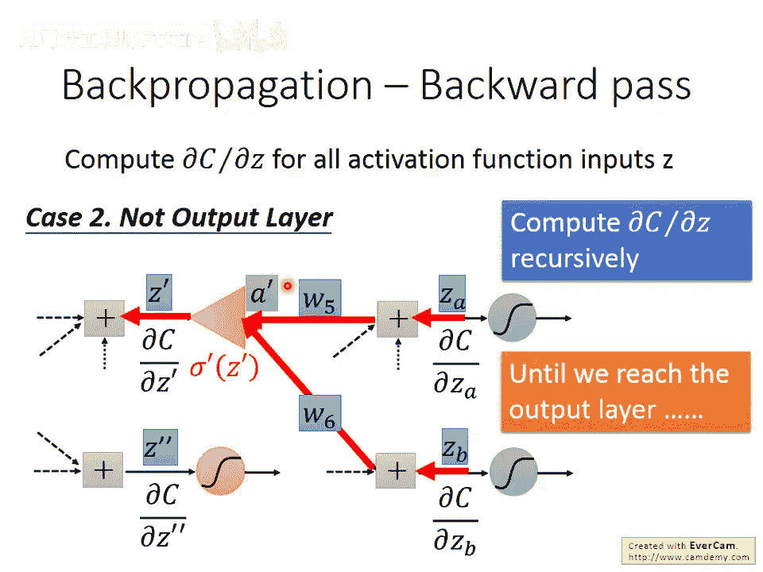
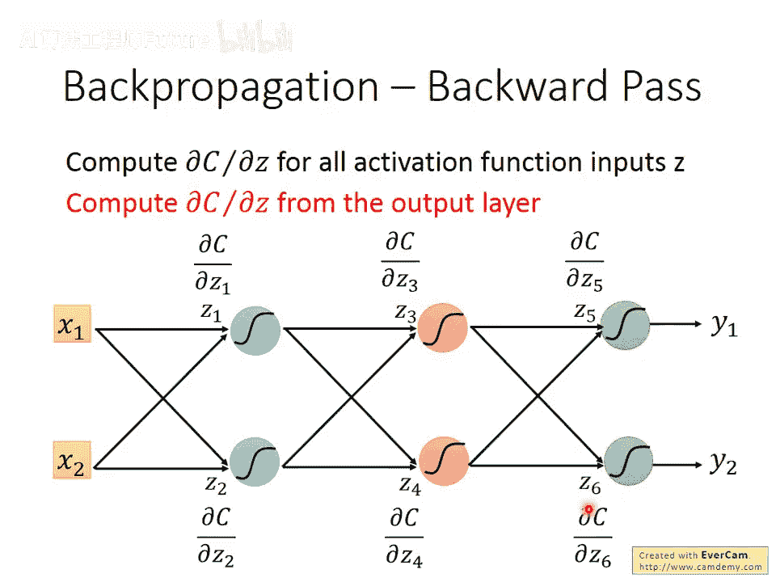
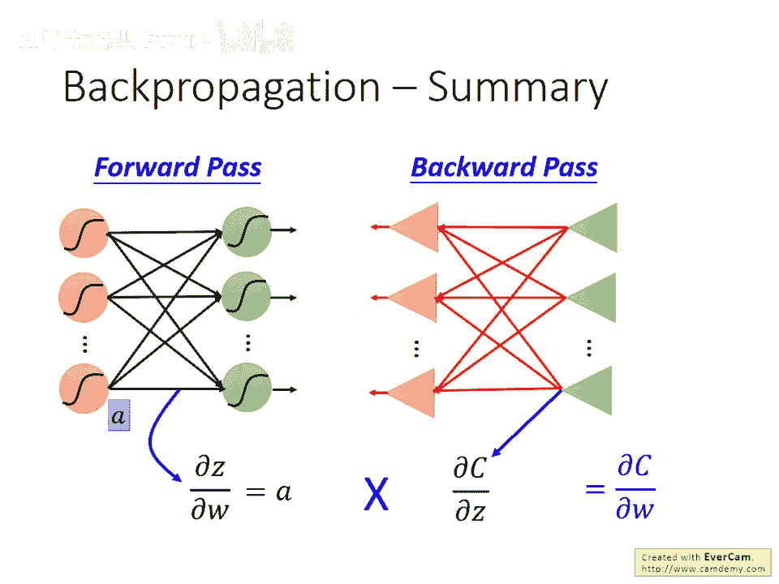

# 8：反向传播算法详解 🧠

在本节课中，我们将学习神经网络训练中的核心算法——反向传播。我们将了解它如何高效地计算梯度，从而使用梯度下降法优化数百万个参数。

## 概述

反向传播并非一种新的训练方法，它本质上是梯度下降法。其核心价值在于，它为计算神经网络中损失函数对每个参数的梯度，提供了一种极其高效的算法。当网络拥有上百万个参数时，这种效率至关重要。

## 核心数学工具：链式法则

在深入反向传播之前，我们需要回顾一个关键的数学工具——链式法则。它是理解整个算法的基础。

**情况一：单路径链式**  

假设有两个函数：`y = g(x)` 和 `z = h(y)`。那么 `x` 对 `z` 的导数可以通过链式法则计算：  

`dz/dx = (dz/dy) * (dy/dx)`

**情况二：多路径链式**  

假设有三个函数：`x = g(s)`, `y = h(s)`, `z = k(x, y)`。那么 `s` 对 `z` 的导数，需要汇总所有影响路径：  

`dz/ds = (dz/dx)*(dx/ds) + (dz/dy)*(dy/ds)`

## 神经网络中的梯度计算

神经网络的总体损失 `L` 是所有训练样本损失 `C^n` 的和。根据求导的线性性质，总损失对某个参数 `w` 的梯度，等于每个样本损失对该参数梯度的和。

**公式表示：**  

`∂L/∂w = Σ ∂C^n/∂w`

因此，我们只需聚焦于如何计算**单个样本**的损失 `C` 对某个参数 `w` 的梯度 `∂C/∂w`。计算出这个后，对所有样本求和即可。

## 分解梯度计算：前向传播与反向传播

考虑网络中的一个神经元，其输入为 `x1, x2`，权重为 `w1, w2`，偏置为 `b`，加权和为 `z`，激活后输出为 `a`，最终产生损失 `C`。

对于参数 `w`（以 `w1` 为例），根据链式法则，梯度可以分解为两项：  

`∂C/∂w1 = (∂z/∂w1) * (∂C/∂z)`

- **第一项 `∂z/∂w1`**：这被称为**前向传播**部分。计算非常简单，因为 `z = w1*x1 + w2*x2 + b`，所以 `∂z/∂w1 = x1`。规律是：**权重对 `z` 的偏微分，等于它前面连接的那个输入的值**。
- **第二项 `∂C/∂z`**：这被称为**反向传播**部分。计算较为复杂，因为 `z` 需要经过激活函数，并影响后续所有层，最终才影响到损失 `C`。

接下来，我们将分别深入这两个部分。

### 前向传播路径

前向传播的计算非常直观高效。它的规律是：计算某个权重 `w` 对其所在神经元输入 `z` 的偏微分 `∂z/∂w`，结果就是**这个权重所连接的前一层的输出值**。

**计算过程示例：**

1. 将输入数据送入网络。
2. 逐层计算每个神经元的输出。
3. 对于任意权重 `w`，`∂z/∂w` 的值就是它前端连接的那个神经元的输出值。

这个过程与网络正常的前向推理完全一致，因此得名“前向传播”。计算完前向传播后，我们就得到了梯度公式中第一项的值。

### 反向传播路径

反向传播路径的目标是计算 `∂C/∂z`，即神经元加权和 `z` 对最终损失 `C` 的影响。这是算法的核心难点。

我们继续使用链式法则对其进行分解。假设该神经元的激活函数为 `σ`，输出 `a = σ(z)`。则：  

`∂C/∂z = (∂a/∂z) * (∂C/∂a)`

- `∂a/∂z` 是激活函数的导数，例如 Sigmoid 函数的导数 `σ‘(z)`，这是一个已知且容易计算的值。
- `∂C/∂a` 是当前神经元输出 `a` 对损失 `C` 的影响。

`∂C/∂a` 的计算需要继续追溯。假设 `a` 连接到下一层的两个神经元，其输入分别为 `z‘` 和 `z‘‘`。根据多路径链式法则：  

`∂C/∂a = (∂z‘/∂a)*(∂C/∂z‘) + (∂z‘‘/∂a)*(∂C/∂z‘‘)`

- `∂z‘/∂a` 和 `∂z‘‘/∂a` 就是连接 `a` 到下一层神经元的权重 `w3` 和 `w4`，这很容易计算。
- 剩下的 `∂C/∂z‘` 和 `∂C/∂z‘‘` 又变成了和之前 `∂C/∂z` 形式一样的项。

我们发现了一个递归结构：要计算当前层的 `∂C/∂z`，需要知道下一层的 `∂C/∂z‘` 和 `∂C/∂z‘‘`。

**关键突破：反向计算**  

如果从网络的最后一层（输出层）开始计算，这个递归过程就变得高效了。

1. 输出层的 `∂C/∂z` 可以直接计算（因为 `z` 经过激活函数就是网络输出，其与损失函数 `C` 的关系是定义好的）。
2. 得到输出层的梯度后，我们可以将其作为“输入”，沿着网络反向传播，利用公式计算出前一层的梯度。
3. 以此类推，从后向前，一层层地计算出所有神经元 `z` 对应的 `∂C/∂z`。

这个反向计算的过程，可以形象地理解为构建了一个与原始网络结构对称的“反向网络”。这个反向网络的“神经元”（常被画成三角形，代表线性放大操作）执行的操作就是上述的梯度组合与传递。

**反向传播公式（对于某个神经元）：**  

`∂C/∂z = σ‘(z) * Σ (w_next * ∂C/∂z_next)`  

其中，`Σ` 是对所有后续神经元求和，`w_next` 是连接到该后续神经元的权重，`∂C/∂z_next` 是后续神经元的梯度。

## 反向传播算法总结

现在，我们将整个反向传播算法步骤总结如下：

1. **前向传播**：进行网络的一次正常前向计算。输入训练数据，得到每一层神经元的输出 `a` 和激活前的加权和 `z`。同时，轻松得到梯度公式的第一部分：`∂z/∂w = 前一层输出值`。
2. **计算输出层梯度**：计算损失函数 `C` 对输出层每个神经元输入 `z` 的梯度 `∂C/∂z`。

1. **反向传播**：从输出层开始，反向逐层计算每一层神经元的 `∂C/∂z`。使用公式：  
  
  `∂C/∂z = [激活函数在z处的导数] * Σ [ (权重 w) * (下一层神经元的 ∂C/∂z_next) ]`  
  
  这个过程就像在运行一个反向的神经网络。

1. **组合得到最终梯度**：对于每个权重参数 `w`，将其对应的前向传播结果 (`∂z/∂w`) 和反向传播结果 (`∂C/∂z`) 相乘，即得到该样本下损失对这个权重的梯度 `∂C/∂w`。  
  
  `∂C/∂w = (∂z/∂w) * (∂C/∂z)`
2. **汇总所有样本**：对所有训练样本重复步骤1-4，并将得到的梯度求和，即得到总损失 `L` 对参数 `w` 的最终梯度，用于后续的梯度下降更新。

## 本节课总结

本节课我们一起学习了神经网络训练的核心——反向传播算法。我们首先回顾了链式法则这一基础数学工具。然后，我们将损失函数对权重的梯度分解为**前向传播**和**反向传播**两部分。前向传播计算简单，直接关联输入数据；反向传播通过从输出层向输入层反向递推，高效计算了误差对每个神经元的影响。最终，结合这两部分结果，我们就能高效地计算出整个网络所有参数的梯度，从而使得训练包含海量参数的深度神经网络成为可能。理解反向传播，是掌握深度学习优化过程的关键一步。
