# 9：回归模型与梯度下降法 🧠

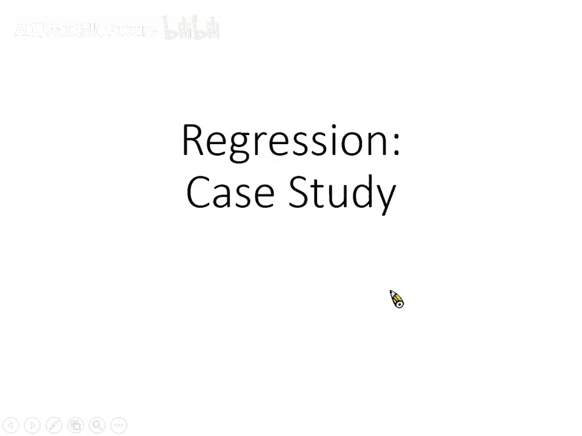

在本节课中，我们将学习机器学习中的回归问题，并以预测宝可梦进化后的CP值为例，介绍线性模型、损失函数以及梯度下降法的核心概念与操作流程。

---

## 概述 📋

本节课我们将通过一个具体的例子——预测宝可梦进化后的CP值，来学习回归问题的基本框架。我们将介绍如何建立模型、定义模型的好坏，并使用梯度下降法来寻找最优模型参数。同时，我们也会探讨模型复杂度与过拟合现象，并介绍正则化技术。

---

## 回归问题能做什么？ 🎯

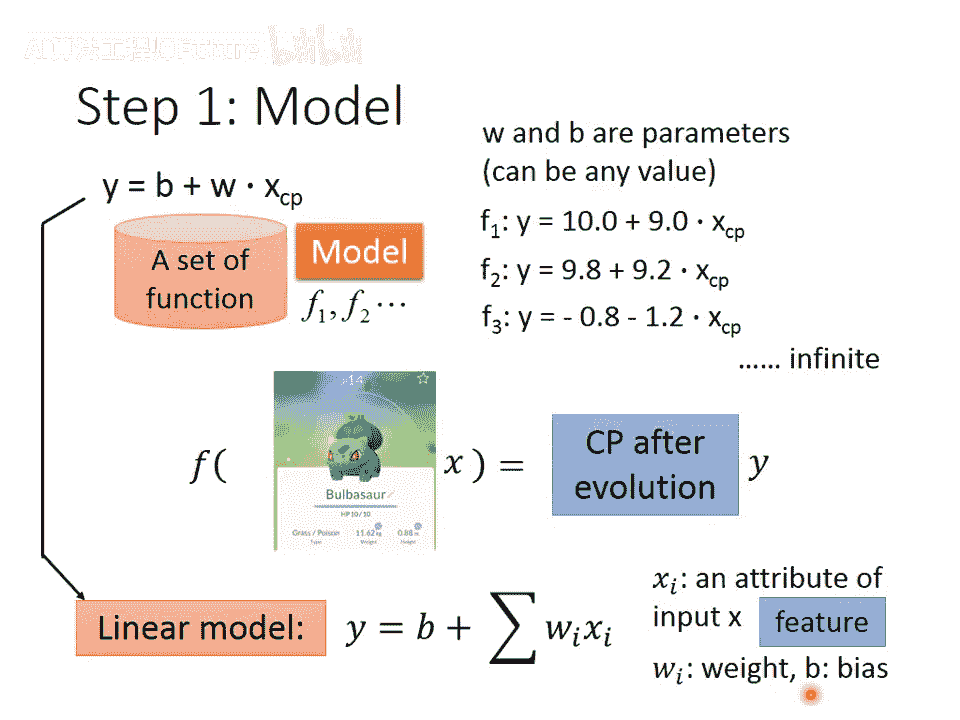

回归问题在机器学习中有广泛的应用。除了预测PM2.5浓度这类任务外，它还可以用于：

- **股票预测系统**：输入过去十年的股票起伏数据或公司并购信息，输出预测的道琼斯工业指数点数。
- **自动驾驶**：输入无人车的各种传感器数据（如摄像头、红外线），输出方向盘需要转动的角度。
- **推荐系统**：输入用户A和商品B的信息，输出用户A购买商品B的可能性。

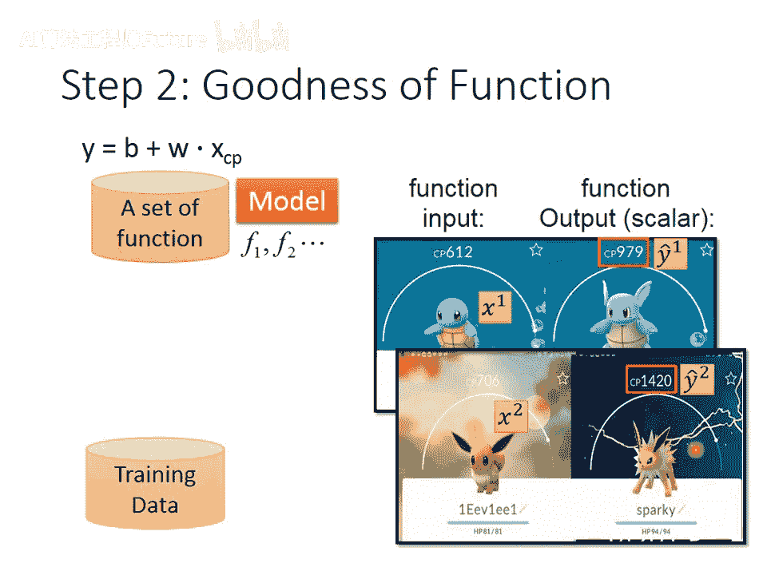

本节课我们将聚焦于一个更具体的应用：**预测宝可梦进化后的CP值**。CP值代表宝可梦的战斗力。如果我们能准确预测进化后的CP值，就能更好地决定是否要进化某只宝可梦，从而更有效地分配资源。

---

## 第一步：建立模型（Model） 🏗️

机器学习的第一步是找到一个模型，即一个函数集合。对于我们的任务，输入是一只宝可梦`x`，输出是其进化后的CP值`y`。

我们可以用一个简单的**线性模型**作为起点：  

`y = b + w * x_cp`  

其中：

- `x_cp` 是输入宝可梦进化前的CP值（一个特征）。
- `b` 是**偏置**。
- `w` 是**权重**。

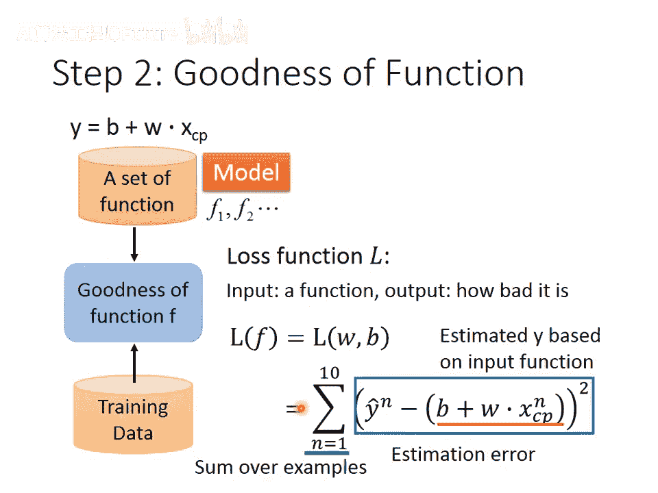

`w`和`b`是未知参数，不同的`w`和`b`值就构成了不同的函数。这个公式定义了一个函数集合。当然，这个集合里可能包含一些明显不合理的函数（例如预测CP值为负），我们需要通过训练数据来找出其中合理的函数。

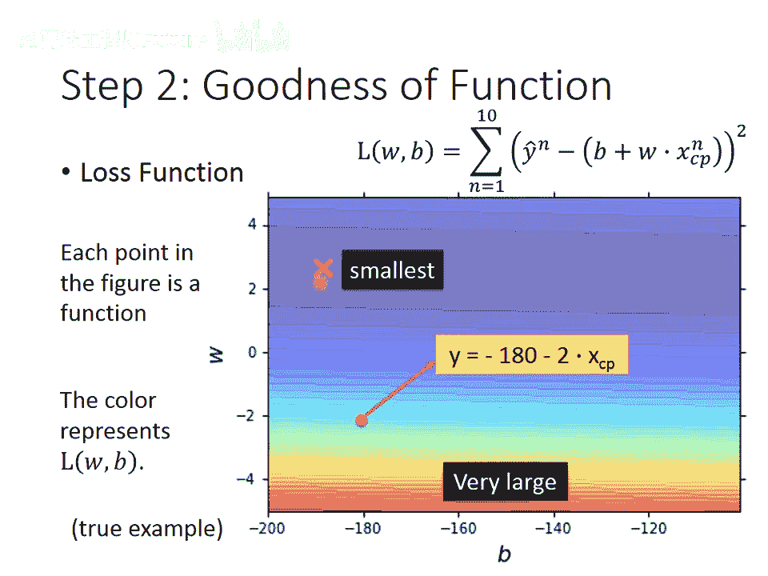

更一般地，线性模型可以写成：  

`y = b + Σ (w_i * x_i)`  

其中`x_i`是输入对象的各种**特征**（如身高、体重），`w_i`是对应的权重。

---

## 第二步：收集训练数据 📊

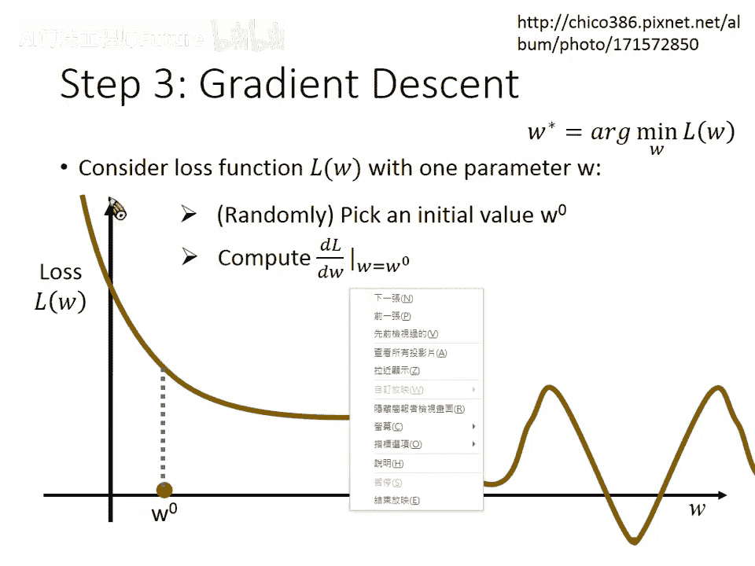

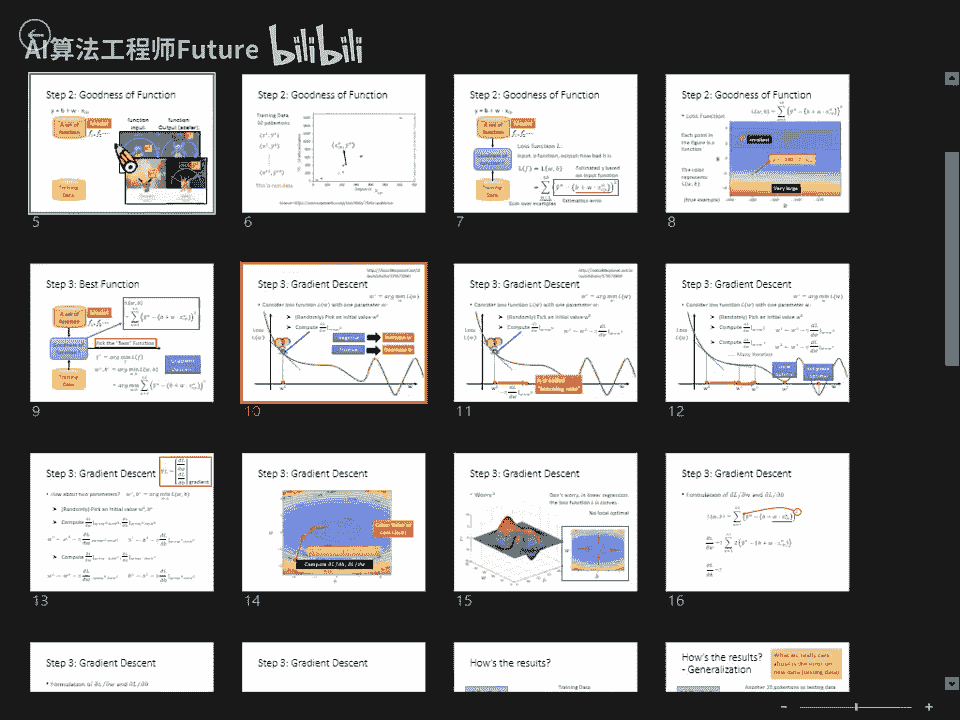

这是一个监督学习任务，因此我们需要收集函数的输入和对应的正确输出（标签）。对于回归任务，输出是一个数值。

例如，我们收集了10只宝可梦的数据。每一只宝可梦用一个对象`x^n`表示，其进化后的真实CP值用`y_hat^n`表示。上标`n`代表第n个数据样本。

我们将数据可视化：X轴代表宝可梦进化前的CP值(`x_cp^n`)，Y轴代表进化后的真实CP值(`y_hat^n`)。图上的每个点代表一只宝可梦。

---

## 第三步：定义模型好坏（损失函数） ⚖️

有了训练数据和模型集合后，我们需要一个标准来衡量集合中每个函数的好坏。这个标准就是**损失函数** `L`。

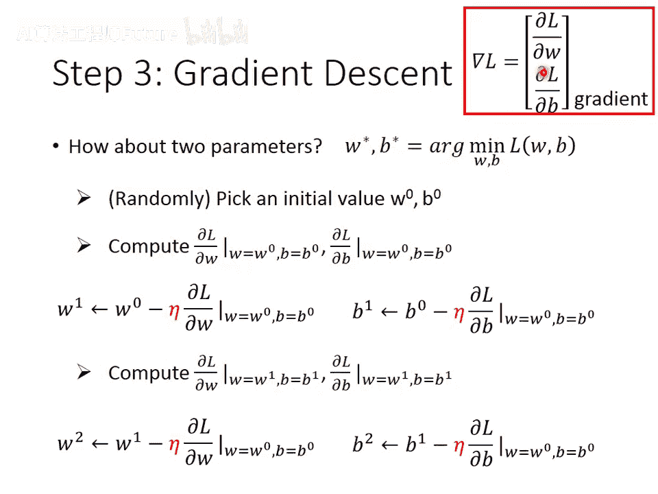

损失函数的输入是一个函数`f`（由参数`w, b`决定），输出是一个标量，代表这个函数有多“不好”。一个常见且直观的定义是**均方误差**：

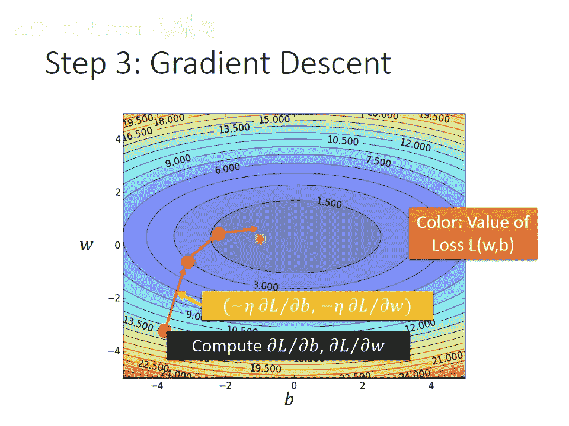

`L(f) = L(w, b) = Σ_n (y_hat^n - (b + w * x_cp^n))^2`

这个公式计算了模型预测值`(b + w * x_cp^n)`与真实值`y_hat^n`之间误差的平方和。误差越大，损失函数值越大，代表该函数越不好。

我们可以将损失函数`L(w, b)`对参数`w`和`b`作图。图上颜色越偏蓝，代表损失值越小，函数越好；越偏红，代表损失值越大，函数越差。

---

## 第四步：找出最佳函数（梯度下降法） 📉

我们的目标是找到能使损失函数`L(w, b)`最小的参数`w*`和`b*`。虽然线性回归问题有解析解，但我们介绍一种更通用的方法——**梯度下降法**。只要损失函数可微，梯度下降法就能适用。

### 梯度下降法操作步骤

我们先从单个参数`w`的情况理解。目标是找到使`L(w)`最小的`w`。

1. **随机初始化**：随机选取一个初始值`w^0`。
2. **计算梯度**：计算在`w = w^0`处，损失函数`L`对`w`的微分 `dL/dw`。这代表了`L`在`w^0`处的切线斜率，指明了`L`的下降方向。
3. **更新参数**：按照以下公式更新参数：  
  
  `w^1 = w^0 - η * (dL/dw)`  
  
  其中`η`是一个正数，称为**学习率**。它决定了参数更新的步长。
  
  如果微分为负，`w`会增加，向损失减小的方向移动。
  如果微分为正，`w`会减少，向损失减小的方向移动。
4. **迭代**：重复步骤2和3，计算`w^1`处的微分并更新得到`w^2`，如此反复。经过多次迭代后，参数会逐渐移动到损失较低的局部最小值区域。

对于两个参数`w`和`b`的情况，原理完全相同：

1. 随机初始化`w^0`和`b^0`。
2. 计算在`(w^0, b^0)`处，`L`对`w`的偏微分和对`b`的偏微分。
3. 同时更新两个参数：  
  
  `w^1 = w^0 - η * (∂L/∂w)`  
  
  `b^1 = b^0 - η * (∂L/∂b)`
4. 重复迭代。

参数`(w, b)`的更新方向由梯度 `▽L = [∂L/∂w, ∂L/∂b]` 决定，它指向损失函数上升最快的方向，因此我们取其反方向进行下降。

幸运的是，对于线性回归的均方误差损失函数，其损失面是**凸的**，没有局部最优陷阱，使用梯度下降法总能找到全局最优解。

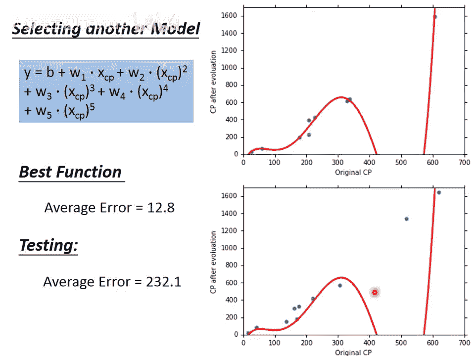

### 偏微分的计算

对于我们的损失函数 `L = Σ_n (y_hat^n - (b + w * x_cp^n))^2`，其偏导数计算如下：  

`∂L/∂w = Σ_n 2 * (y_hat^n - (b + w * x_cp^n)) * (-x_cp^n)`  

`∂L/∂b = Σ_n 2 * (y_hat^n - (b + w * x_cp^n)) * (-1)`

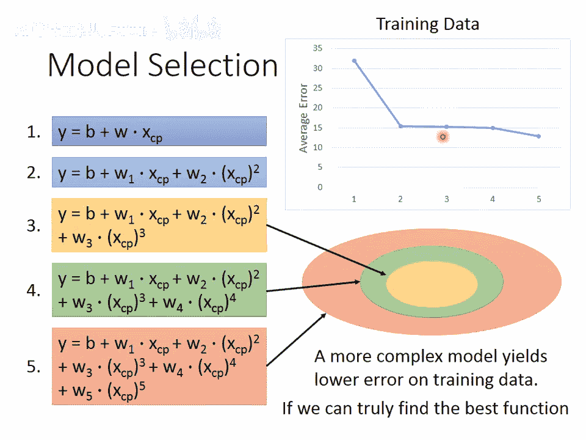

---

## 实验结果与模型选择 🔬

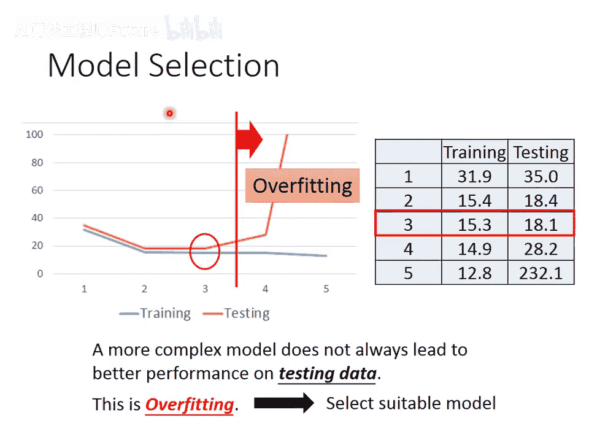

将梯度下降法应用于我们的10只宝可梦数据，得到最佳线性模型：`y = -188.4 + 2.7 * x_cp`。在训练数据上平均误差为31.9，在另外10只测试宝可梦数据上平均误差为35.0。

我们怀疑模型可能不是简单的直线。因此，我们尝试了更复杂的模型：

- **二次模型**：`y = b + w1*x_cp + w2*(x_cp)^2`
- **三次模型**：`y = b + w1*x_cp + w2*(x_cp)^2 + w3*(x_cp)^3`
- **四次、五次模型**：引入更高次项。

实验结果呈现出一个重要现象：

- 在**训练数据**上，模型越复杂，平均误差越低。
- 在**测试数据**上，模型复杂度增加到一定程度（四次、五次）后，平均误差不降反升。

这种现象称为**过拟合**：复杂的模型在训练数据上表现很好，但在未见过的新数据上表现变差。因此，模型并非越复杂越好，我们需要选择一个复杂度“刚刚好”的模型。在本例中，三次模型在测试集上表现最佳。

---

## 重新设计模型：考虑更多因素 🔍

观察更多数据（60只）后发现，进化后的CP值强烈依赖于宝可梦的**物种**。因此，我们重新设计模型，为不同物种使用不同的线性函数：  

如果宝可梦是波波，则 `y = b1 + w1 * x_cp`  

如果宝可梦是独角虫，则 `y = b2 + w2 * x_cp`  

...

这个模型可以统一写成一个线性形式：  

`y = b1*δ(x_s=波波) + w1*δ(x_s=波波)*x_cp + b2*δ(x_s=独角虫) + w2*δ(x_s=独角虫)*x_cp + ...`  

其中`δ(条件)`是指示函数，条件满足时输出1，否则为0。这样，模型的性能得到了显著提升。

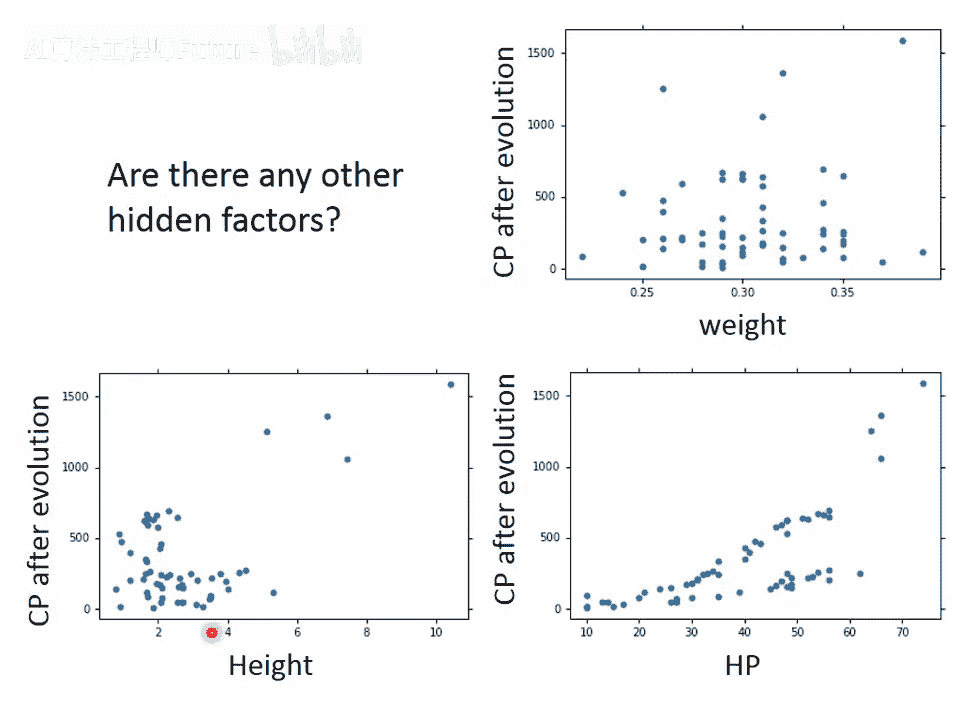

我们还可以进一步加入更多特征，如HP、身高、体重的平方项等，构建一个非常复杂的模型。虽然它在训练数据上误差极低（1.9），但在测试数据上误差暴增（102.3），再次出现了严重的过拟合。

---

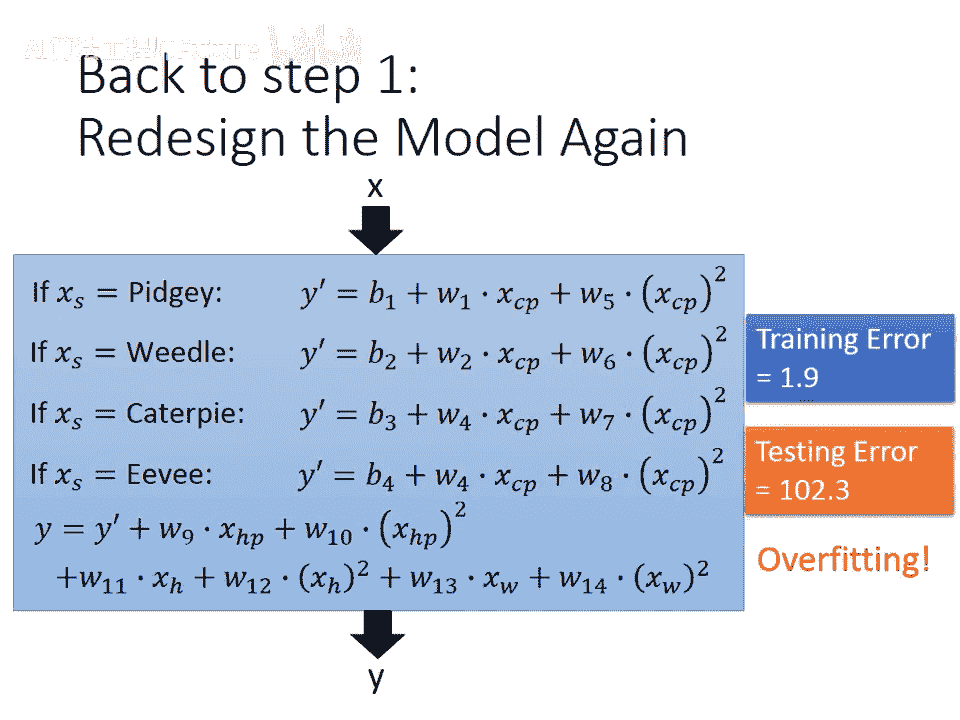

## 应对过拟合：正则化 🛡️

为了解决过拟合，我们引入**正则化**技术。具体做法是**重新设计损失函数**，在原来的均方误差项基础上，增加一个惩罚项，用于鼓励模型参数取较小的值。

新的损失函数为：  

`L = Σ_n (y_hat^n - y^n)^2 + λ * Σ_i (w_i)^2`  

其中：

- 第一项是原来的预测误差。
- 第二项是正则化项，`λ`是正则化强度系数。
- `Σ_i (w_i)^2` 是所有权重`w_i`的平方和（注意，通常不包含偏置`b`，因为调整`b`不影响函数的平滑性）。

**为什么参数小更好？** 参数小的函数更“平滑”，即输入变化时，输出变化不敏感。这样的函数对输入数据中的噪声干扰更具鲁棒性，可能在新数据上表现更好。

实验表明，调整`λ`可以控制模型的平滑程度：

- `λ`越大，模型越平滑，训练误差会增大，但测试误差可能先减小后增大。
- 存在一个最佳的`λ`值，能使测试误差最小。我们需要通过调整`λ`来选择模型的平滑程度。

---

## 总结 🎓

本节课我们一起学习了回归问题的完整流程：

1. **选择模型**：我们从一个简单的线性模型开始。
2. **定义损失函数**：使用均方误差来衡量模型预测的好坏。
3. **优化参数**：介绍了梯度下降法这一通用优化算法来寻找最小化损失函数的参数。
4. **模型评估与选择**：发现了模型复杂度与过拟合的关系，认识到需要在训练误差和泛化能力之间取得平衡。
5. **特征工程与正则化**：通过引入物种特征改进了模型，并学习了使用正则化技术来对抗过拟合，通过控制参数大小来获得更平滑、泛化能力更强的模型。

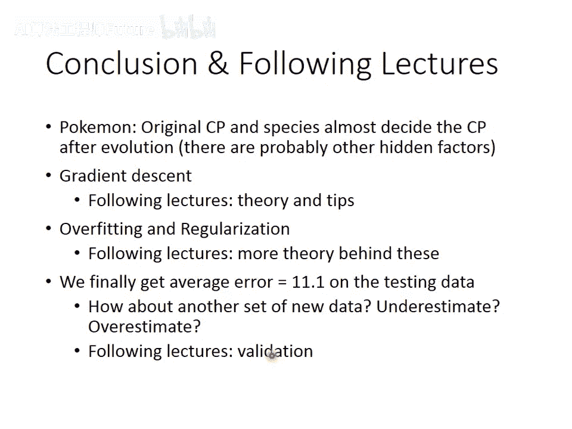

最后需要指出，我们在选择模型（如选择三次式、选择λ=100）时，实际上使用了测试集，这会导致对模型在真实线上环境表现的估计过于乐观。为了更准确地评估模型，我们需要使用**验证集**的概念，这将在后续课程中讲解。
