# 10：9-选修-神奇宝贝分类 🧠

在本节课中，我们将要学习分类问题的基本概念，并通过一个具体的例子——预测宝可梦的属性——来理解如何构建和应用分类模型。我们将从分类问题的定义开始，探讨为何不能简单地将分类问题当作回归问题处理，并最终介绍一种基于概率的生成式模型方法。

## 什么是分类问题？🎯

分类问题的目标是找到一个函数，其输入是一个对象，输出是该对象属于哪一个类别。这类问题在现实中有广泛的应用。

以下是几个常见的分类问题示例：

- 在金融领域，模型可以根据个人的收入、储蓄、工作、年龄和信用记录等信息，决定是否批准其贷款申请。这是一个二分类问题。
- 在医疗诊断中，模型可以根据病人的症状、年龄、性别和就医历史，自动诊断其患有何种疾病。
- 在手写文字识别中，模型可以识别一张手写图片属于哪个字符（例如，中文有至少8000个字符类别）。
- 在人脸识别中，模型可以识别输入的人脸图像属于哪一个人。

本节课中，我们将以宝可梦属性分类作为贯穿始终的例子。

## 宝可梦分类任务 🐢⚡

我们的任务是构建一个函数，输入是一只宝可梦，输出是它的属性（例如水、火、电等）。到第六代为止，宝可梦共有18种属性。这个任务非常重要，因为在宝可梦对战中存在属性相克关系。如果我们能预测未知宝可梦的属性，就能在对战中采取正确的策略。

### 如何用数字表示宝可梦？🔢

要将宝可梦输入函数，首先需要将其数字化。每只宝可梦可以用一个包含7个特征值的向量来描述：

- 总强度 (Total)
- 生命值 (HP)
- 攻击力 (Attack)
- 防御力 (Defense)
- 特殊攻击力 (Sp. Atk)
- 特殊防御力 (Sp. Def)
- 速度 (Speed)

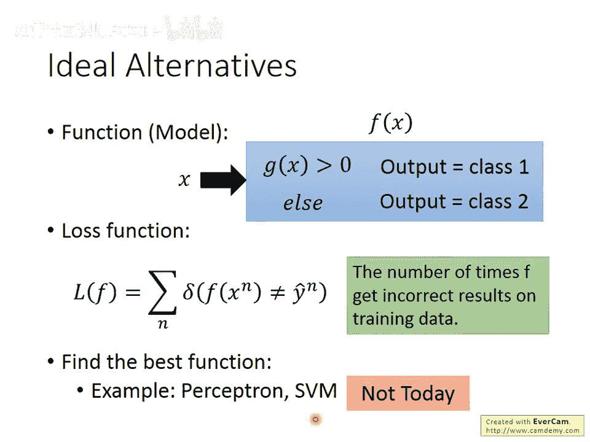

例如，皮卡丘可以表示为向量：`[320, 35, 55, 40, 50, 50, 90]`。因此，一只宝可梦就是一个7维空间中的点。

### 数据准备与错误思路 📊

我们假设编号400以下的宝可梦是训练数据，编号400以上的是测试数据，模拟发现新宝可梦并预测其属性的场景。

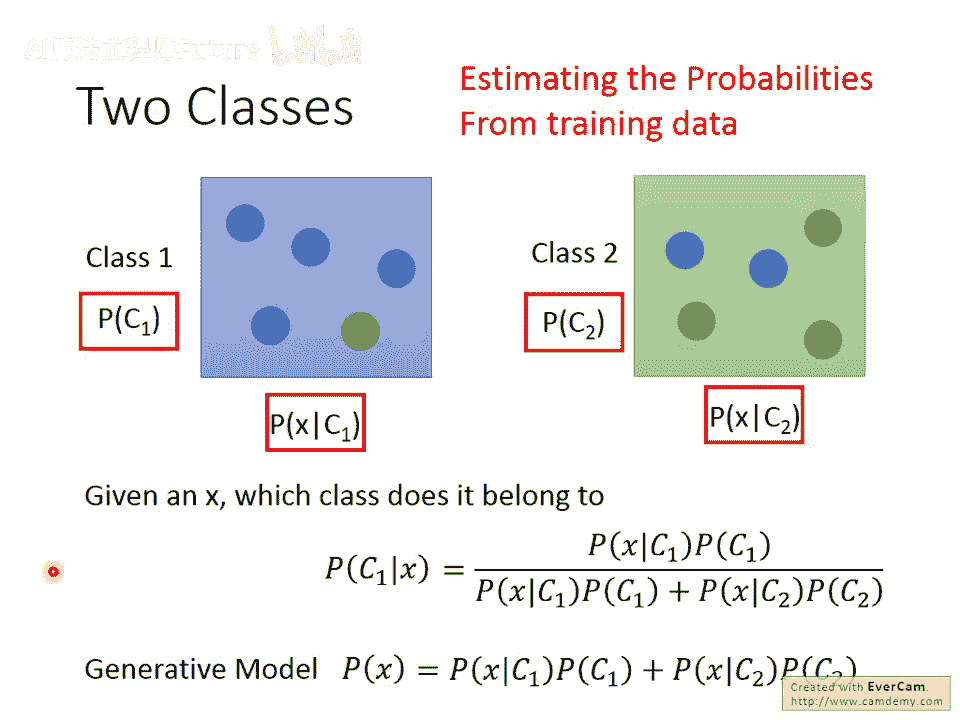

一个自然的错误想法是：将分类问题当作回归问题来解决。例如，在二分类中，将类别1的标签设为1，类别2的标签设为-1，训练一个回归模型，并以0为界进行判断。

然而，这种方法存在严重问题：

1. **回归的损失函数不适合分类**：回归模型会惩罚那些“过于正确”（输出值远大于1或远小于-1）的点，这可能导致找到的决策边界并非最优。
2. **多分类问题中的虚假关系**：如果将多个类别编码为1, 2, 3...，就隐含假定了类别之间存在数值上的顺序关系，如果这种关系不存在，模型效果会很差。

因此，我们需要为分类问题寻找更合适的方法。

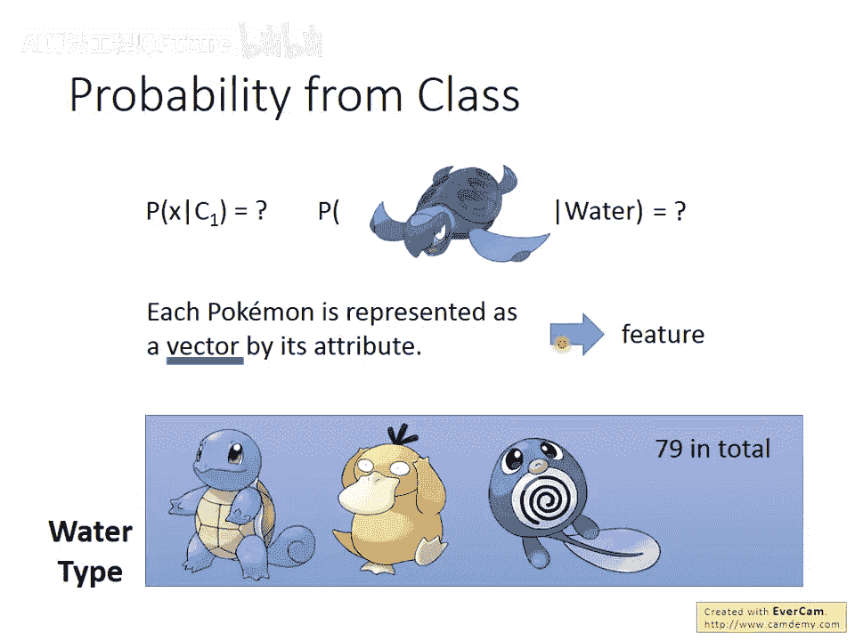

## 基于概率的生成式模型 🎲

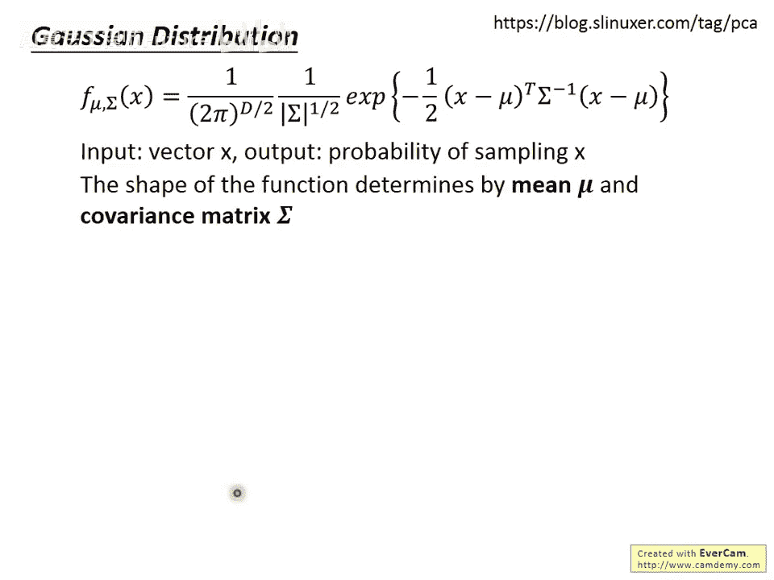

上一节我们介绍了分类问题的定义和直接使用回归方法的弊端。本节中，我们来看看一种基于概率的生成式模型方法。

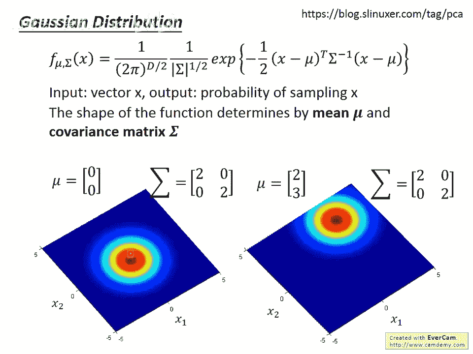

理想情况下，我们希望模型能直接输出类别。对于二分类，可以定义函数：如果 `g(x) > 0` 则输出类别1，否则输出类别2。一个直接的损失函数可以是模型在训练数据上分类错误的次数：`L(f) = Σ_n δ(f(x^n) ≠ y_hat^n)`。但此函数不可微，难以用梯度下降优化。

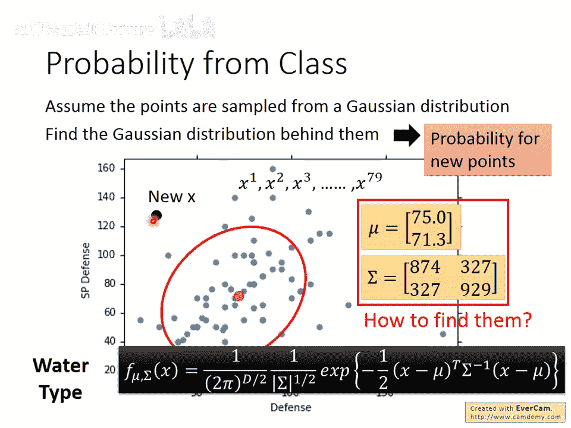

因此，我们转向概率视角。考虑一个简单的概率问题：有两个盒子，盒子1有4蓝1绿球，盒子2有2蓝3绿球。随机从一个盒子抽球得到蓝色，问球来自盒子1的概率是多少？这可以用贝叶斯公式计算：`P(盒子1|蓝) = P(蓝|盒子1)P(盒子1) / [P(蓝|盒子1)P(盒子1) + P(蓝|盒子2)P(盒子2)]`。

将盒子替换为类别，球替换为特征向量 `x`，我们就得到了分类问题的核心：计算后验概率 `P(C1|x)`。  

公式为：  

`P(C1|x) = P(x|C1)P(C1) / [P(x|C1)P(C1) + P(x|C2)P(C2)]`

如果 `P(C1|x) > 0.5`，则判定为类别1。我们需要从训练数据中估计出四个值：先验概率 `P(C1)`, `P(C2)` 和 条件概率 `P(x|C1)`, `P(x|C2)`。

这种模型称为**生成式模型**，因为有了 `P(x|C)` 和 `P(C)`，我们就能估计出整个数据的分布 `P(x)`，从而可以“生成”新的样本 `x`。

### 估计概率分布 📈

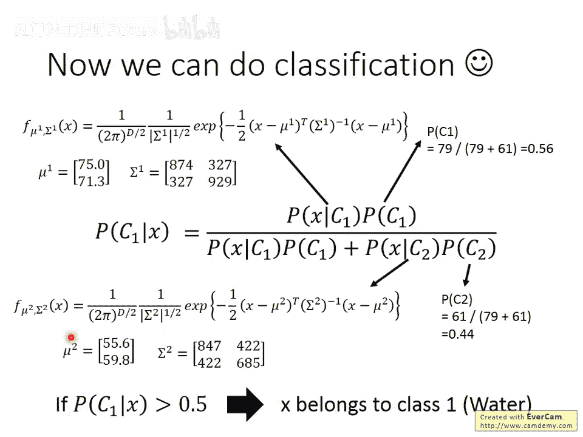

首先，先验概率 `P(C1)` 和 `P(C2)` 很容易估计，即训练数据中各类别的比例。以水系(`C1`)和一般系(`C2`)宝可梦为例，训练集中有79只水系和61只一般系，因此：  

`P(C1) = 79 / (79+61) ≈ 0.56`  

`P(C2) = 61 / (79+61) ≈ 0.44`

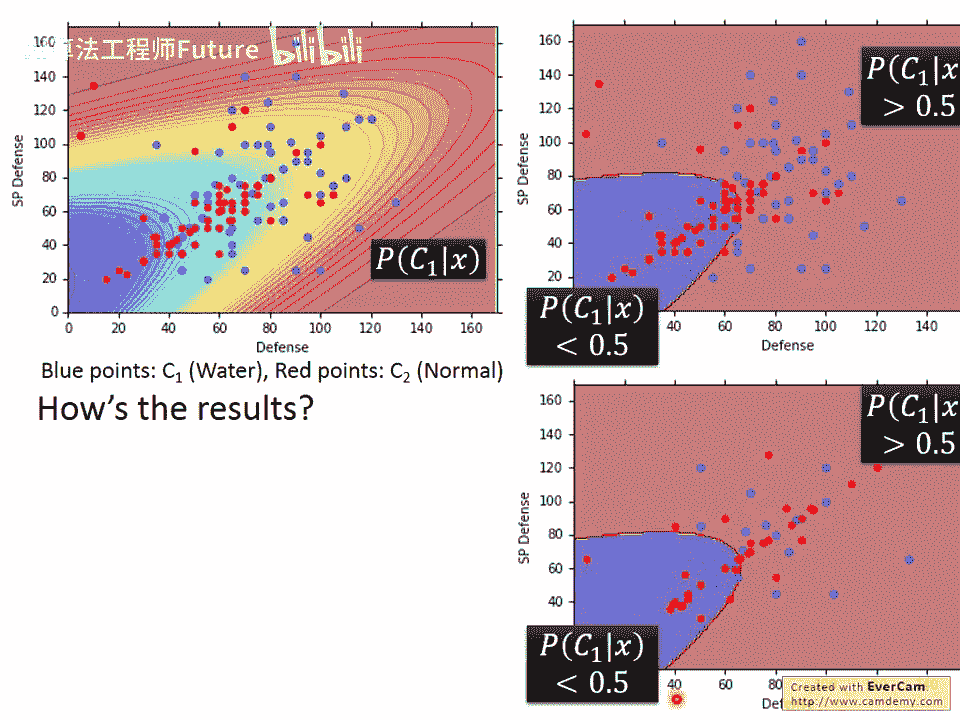

难点在于估计条件概率 `P(x|C1)`。我们只有79个水系宝可梦的样本点，但需要估计整个特征空间上的概率分布。一个合理的假设是，这79个点是从某个多维概率分布中采样出来的。我们假设这个分布是**高斯分布（正态分布）**。

高斯分布由均值向量 `μ` 和协方差矩阵 `Σ` 决定。给定 `μ` 和 `Σ`，对于任意特征向量 `x`，其概率密度为：  

`f_{μ, Σ}(x) = (1/((2π)^{D/2}|Σ|^{1/2})) exp(-1/2 (x-μ)^T Σ^{-1} (x-μ))`

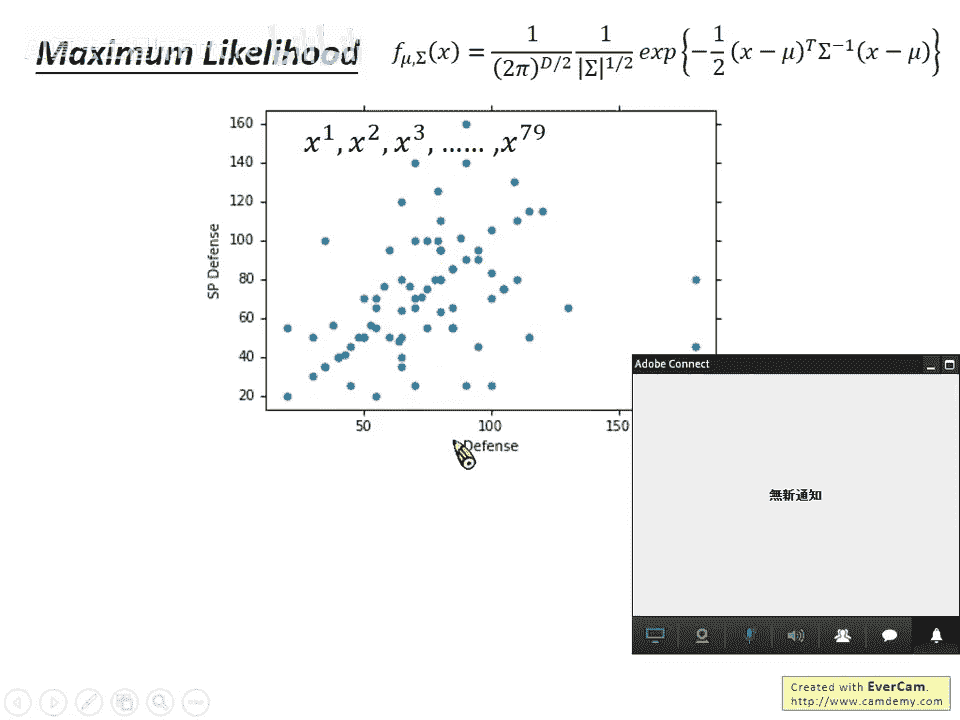

我们的目标是：找到最有可能产生这79个样本点的高斯分布，即找到使**似然函数**最大的 `μ` 和 `Σ`。  

似然函数为：`L(μ, Σ) = Π_{i=1}^{79} f_{μ, Σ}(x^i)`

通过最大似然估计，可以得到最优解：  

`μ* = (1/79) Σ_{i=1}^{79} x^i` （所有样本点的均值）  

`Σ* = (1/79) Σ_{i=1}^{79} (x^i - μ*)(x^i - μ*)^T` （样本协方差矩阵）

对一般系宝可梦 (`C2`)，我们可以用同样的方法计算出 `μ2*` 和 `Σ2*`。

### 第一次尝试与模型改进 🔄

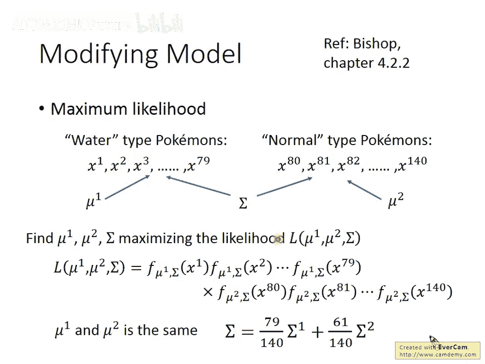

计算出所有参数后，我们可以在二维特征（如防御力、特殊防御力）上可视化分类边界。然而，第一次尝试的结果并不理想，测试集准确率只有54%。当使用全部7个特征时，准确率也仅为47%，几乎等于随机猜测。

问题可能出在模型复杂度过高。每个类别都有自己的协方差矩阵 `Σ`，当特征维度高时，参数过多容易导致过拟合。一个常见的改进是让两个类别**共享同一个协方差矩阵** `Σ`。

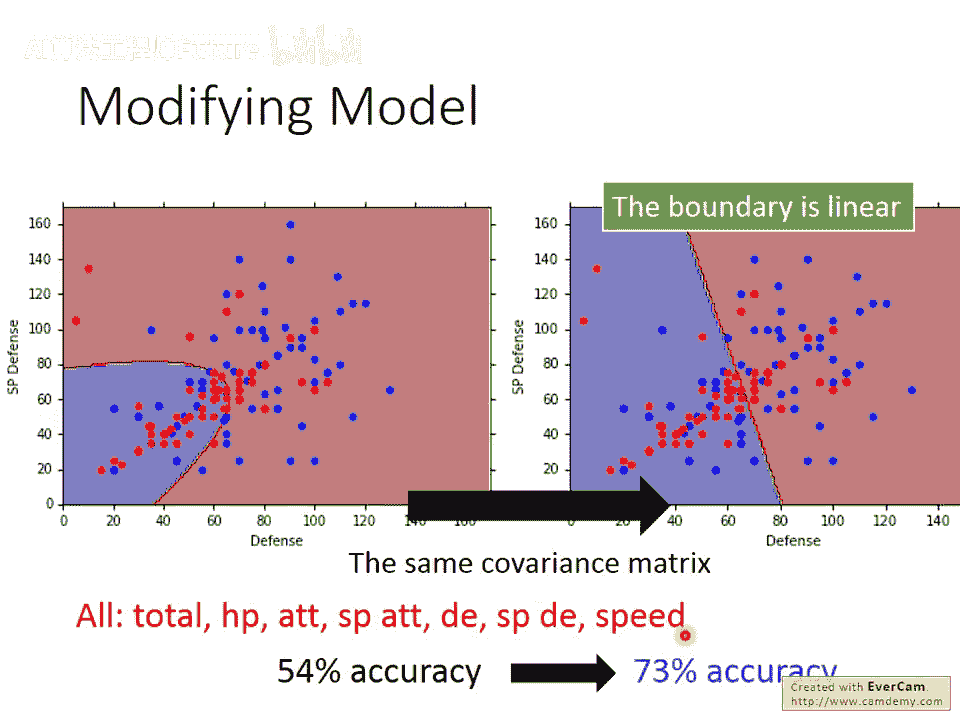

此时，`Σ` 的计算变为两个类别各自协方差矩阵的加权平均：  

`Σ = [79/(79+61)] * Σ1 + [61/(79+61)] * Σ2`

这样做的好处是减少了模型参数，降低了方差。同时，一个重要的结论是：当共享协方差矩阵时，分类的决策边界会从曲线变为一条**直线**（在高维空间中是超平面），这样的模型称为**线性模型**。

改进后，使用全部7个特征，分类准确率从47%提升到了73%，效果显著改善。

## 生成式模型的本质与另一种视角 🔍

上一节我们通过共享协方差矩阵改进了模型。本节中，我们来深入分析生成式模型的本质，并推导出它的另一种等价形式。

我们回顾一下，机器学习包含三个步骤：

1. **定义函数集（模型）**：在生成式模型中，函数形式由 `P(C)`, `P(x|C)` 决定，我们选择高斯分布来建模 `P(x|C)`，不同的 `(μ, Σ)` 对应不同的函数。
2. **定义损失函数（评估标准）**：我们使用最大似然估计，即找到能使训练数据出现概率最大化的参数。
3. **寻找最优函数**：我们得到了 `μ*` 和 `Σ*` 的解析解。

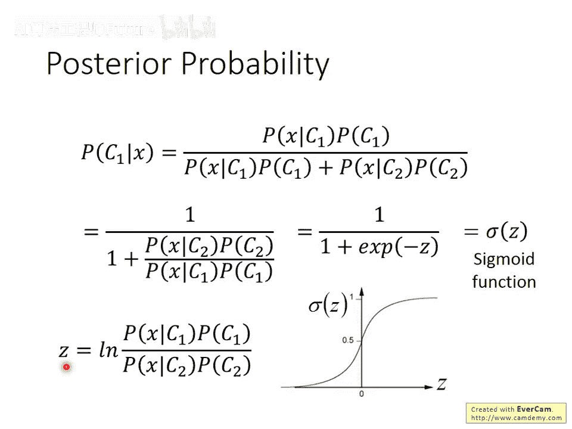

我们也可以选择其他分布，例如当特征是二元时，选择伯努利分布；或者假设所有特征维度独立（朴素贝叶斯），这对应协方差矩阵为对角阵的情况。模型的选择取决于问题本身，简单的模型偏差大、方差小，复杂的模型则相反。

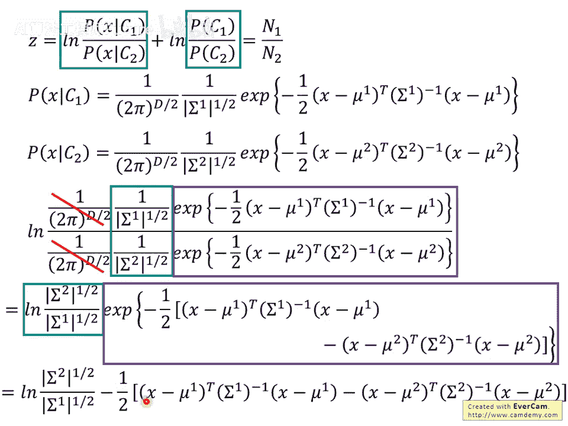

现在，让我们对后验概率 `P(C1|x)` 进行数学推导。经过一系列代数变换（详见课程视频或讲义），我们可以将其重写为一个非常简洁的形式：  

`P(C1|x) = σ(z)`  

其中，`σ(z) = 1 / (1 + e^{-z})` 是 **Sigmoid 函数**，而 `z` 可以进一步写成：  

`z = w · x + b`  

这里，`w` 是一个权重向量，`b` 是一个偏置标量。当共享协方差矩阵时，`w` 和 `b` 可以由 `μ1, μ2, Σ` 以及先验概率计算出来。

这个推导揭示了两个关键点：

1. 为什么共享协方差矩阵时决策边界是线性的？因为最终的后验概率计算等价于一个线性函数 `z = w·x + b` 再经过Sigmoid激活。
2. 这引出了一个更直接的想法：既然我们最终的目标就是找到 `w` 和 `b`，为什么还要绕远路先去估计高斯分布的参数呢？**我们能否直接寻找最优的 `w` 和 `b`？**

这个直接寻找 `w` 和 `b` 的思路，就将我们引向了机器学习中另一个强大且常用的模型——**逻辑回归**。这将是后续课程的重要内容。

## 总结 📝

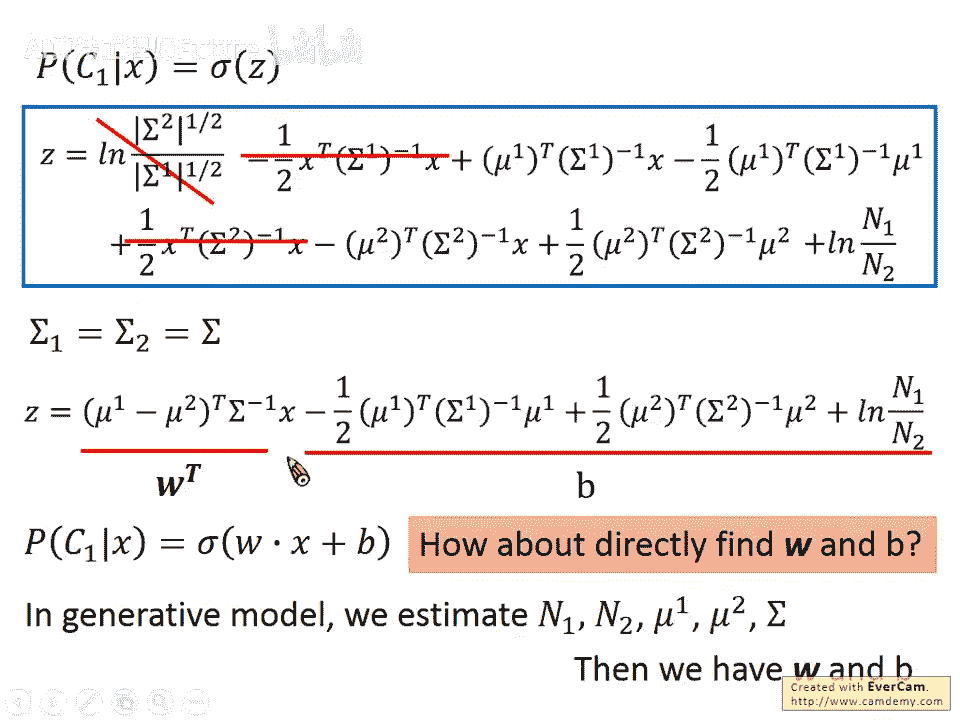

本节课中我们一起学习了分类问题的基本框架。我们首先明确了分类任务的定义，并指出了将其作为回归问题处理的缺陷。接着，我们重点介绍了一种基于概率的**生成式模型**方法，以宝可梦属性分类为例，详细讲解了如何用高斯分布对类别条件概率进行建模，并通过最大似然估计求解参数。我们还分析了模型改进的策略（共享协方差矩阵），并通过对后验概率的数学推导，发现了生成式模型与线性分类器之间的内在联系，为接下来学习逻辑回归奠定了基础。
