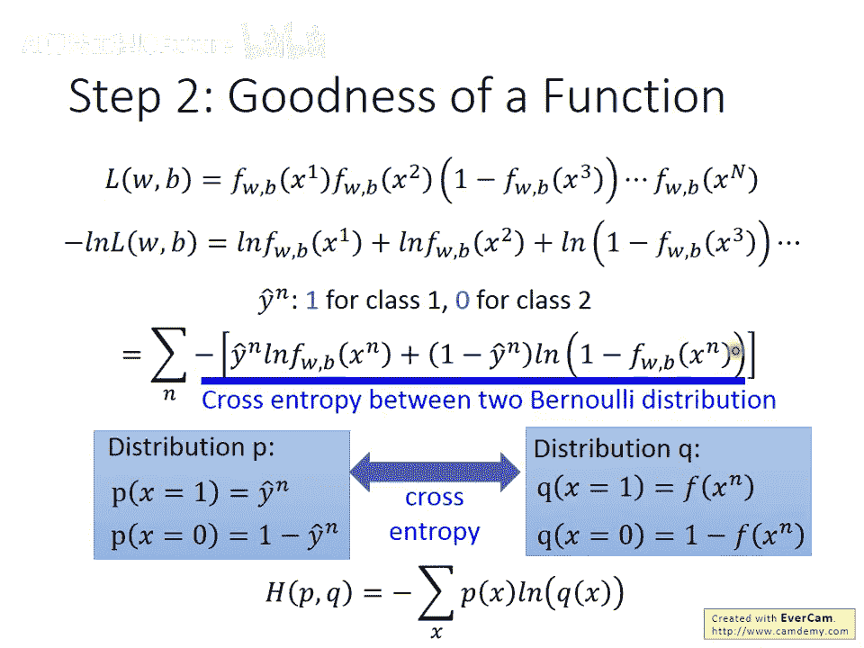
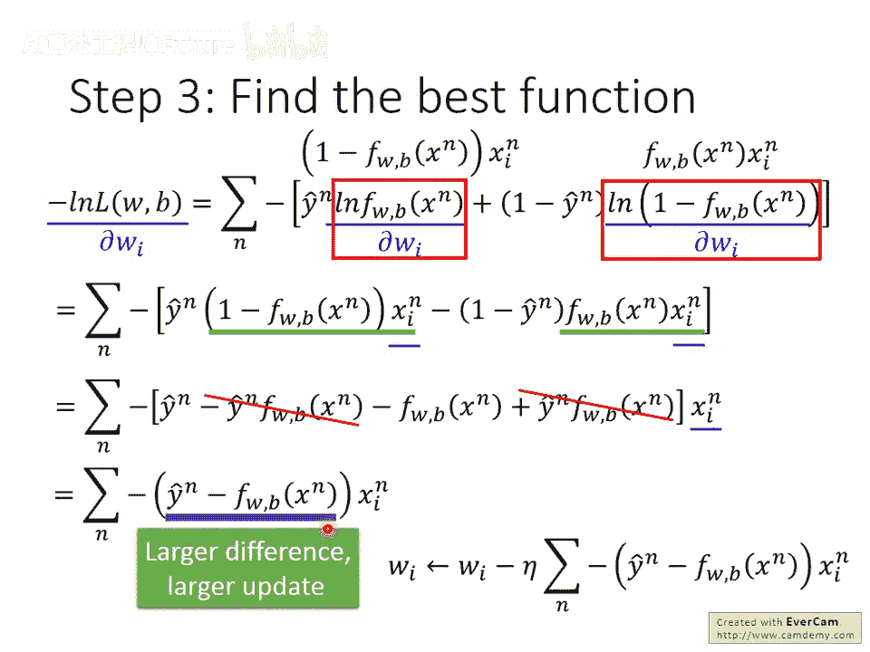
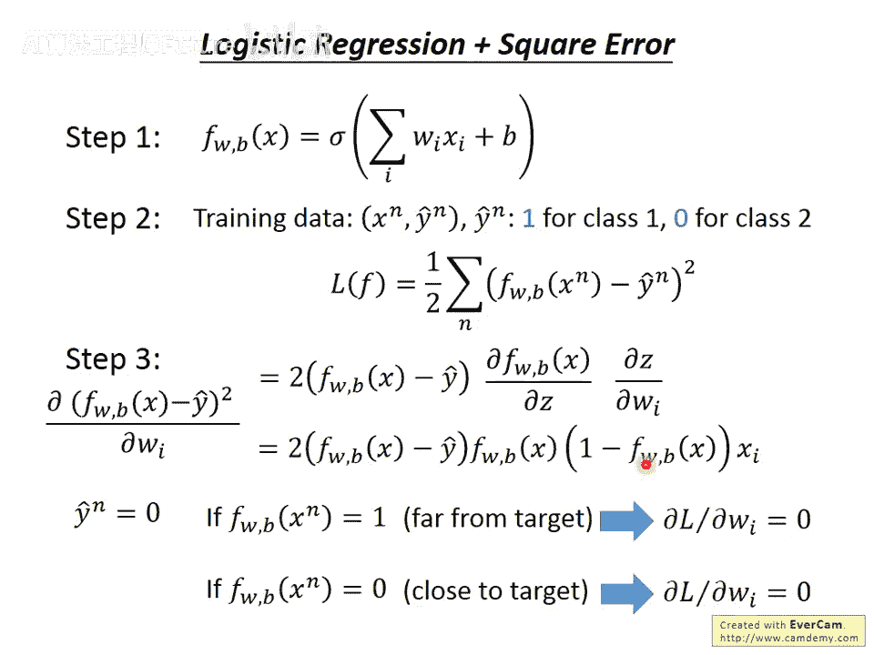
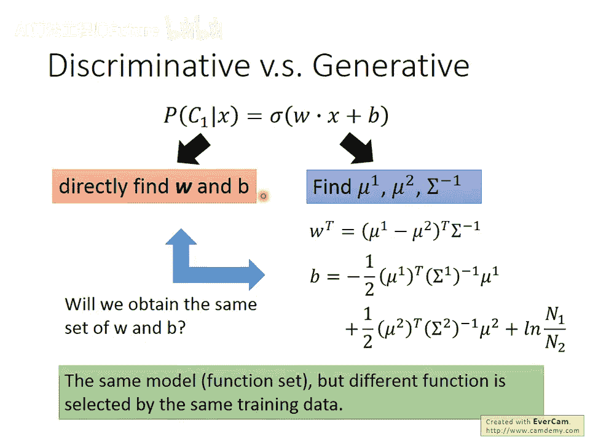
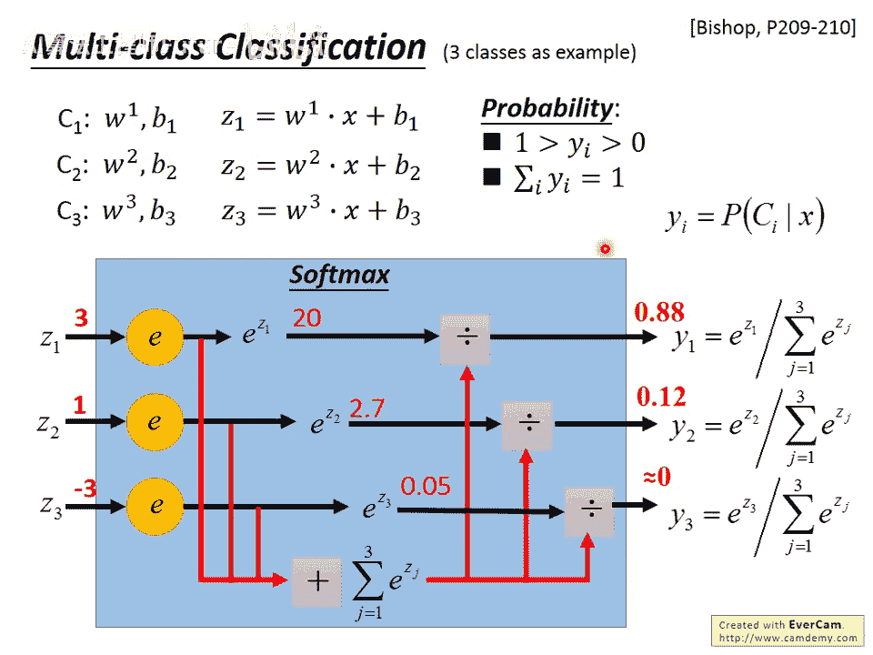
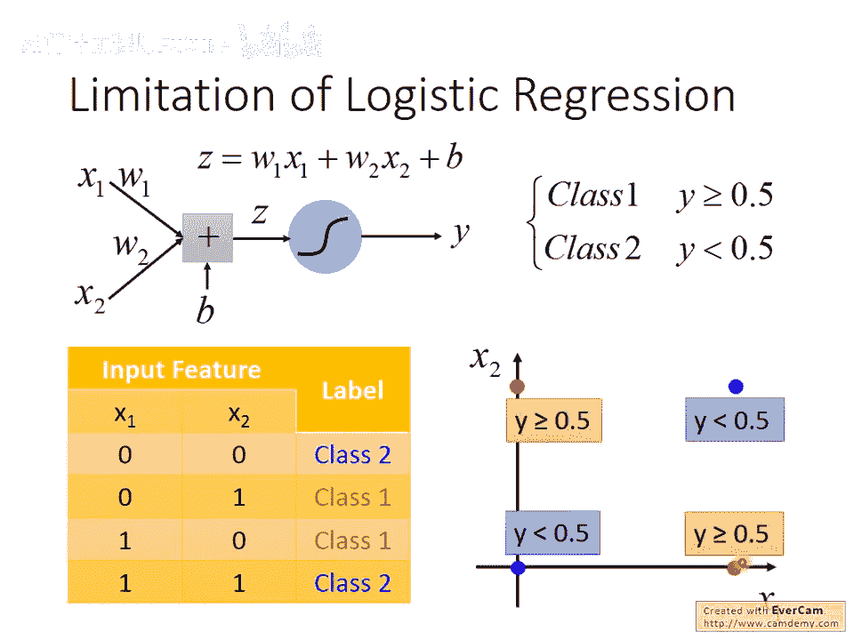
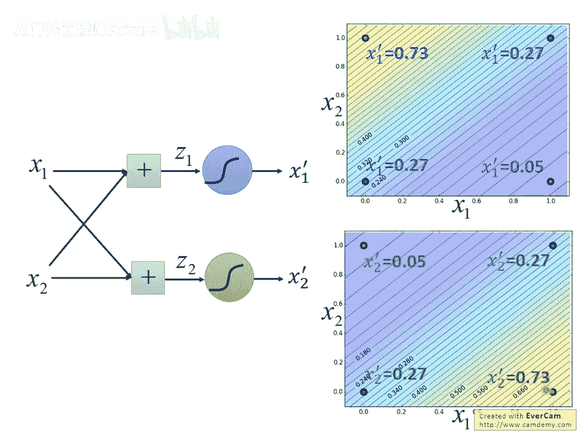
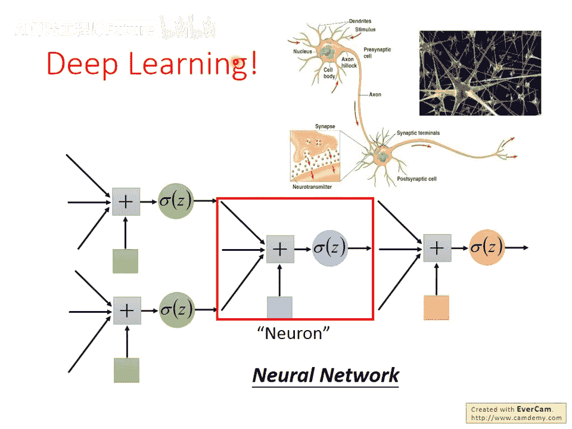

# 11：逻辑回归 (Logistic Regression)

## 📚 概述

在本节课中，我们将学习逻辑回归模型。我们将了解它与线性回归的区别，如何定义模型的优劣，以及如何使用梯度下降法来优化模型参数。最后，我们会探讨逻辑回归的局限性，并引出神经网络的概念。

---

## 🔍 逻辑回归模型介绍

在上一节中，我们介绍了后验概率的概念。在逻辑回归中，我们要找的就是一个后验概率。

如果后验概率大于0.5，则预测为类别一，否则预测为类别二。我们知道这个后验概率。

假设你想要使用高斯分布，实际上许多其他概率分布经过简化后，也可以得到相同的结果。假设你想要使用高斯分布，那么你可以说这个后验概率就是 **sigmoid(z)**。

这个函数的形状如右图所示，其中 **z = w·x + b**。所谓 **w·x** 的点积，是指 **w** 是一个向量，我们用下标 **i** 来表示它的每一个维度。**x** 的每一个维度都有一个对应的 **w_i**。你把所有的 **x_i** 和 **w_i** 相乘并求和，再加上 **b** 就得到 **z**。将 **z** 代入 **sigmoid** 函数，就得到了概率。

因此，我们的函数集 **f_{w,b}(x)** 长这样。下标 **w,b** 意味着我们的函数集是由 **w** 和 **b** 控制的。选择不同的 **w** 和 **b**，就得到不同的函数。所有可能的 **w** 和 **b** 产生的函数集合起来，就是一个函数集。

这一项的含义是后验概率 **P(C1|x)**，即给定 **x** 时，它属于类别一的概率。

如果我们用图像化的方式来表示它，它长这样。我们的模型中有两组参数：一组是 **w**（称为权重），它是一整排数值；另一个是 **b**（称为偏置）。还有一个 **sigmoid** 函数。

如果我们的输入是 **x_1** 到 **x_I**，我们就把 **x_1** 到 **x_I** 分别乘上 **w_1** 到 **w_I**，然后再加上 **b**，就得到 **z**。**z** 通过我们刚才看到的 **sigmoid** 函数，其输出值就是概率，也就是后验概率。

整个模型长这个样子，这件事就叫做逻辑回归。

---

## ↔️ 逻辑回归与线性回归的比较

我们可以把逻辑回归和我们第一堂课讲的线性回归做一下比较。

逻辑回归把每一个特征乘上一个权重，求和后加上偏置，再通过 **sigmoid** 函数作为输出。因为通过了 **sigmoid** 函数，所以它的输出一定介于0到1之间。

线性回归则把特征乘上权重，再加上偏置，它没有通过 **sigmoid** 函数，所以它的输出可以是任何值，从负无穷大到正无穷大。

等一下我们会说，机器学习就是三个步骤。接下来我们会逐个步骤比较逻辑回归和线性回归的差别。

---

## 📊 定义函数的好坏

接下来我们要决定一个函数的好坏。假设我们有 **N** 笔训练数据。

我们现在要做的是分类，所以每笔训练数据都要标注它属于哪一个类别。例如，**x^1** 属于类别一，**x^2** 属于类别一，**x^3** 属于类别二，**x^N** 属于类别一，等等。

接下来我们假设这些训练数据是从我们的函数所定义的后验概率产生的。也就是说，这组训练数据是根据这个后验概率产生的。

给我们一组 **w** 和 **b**，我们就决定了这个后验概率。然后我们就可以去计算某一组 **w** 和 **b** 产生这 **N** 笔训练数据的可能性。

某一组 **w** 和 **b** 产生这 **N** 笔训练数据的可能性怎么算呢？这很容易。假设 **x^1** 属于类别一，那么它根据某一组 **w** 和 **b** 产生的概率就是 **f(x^1)**。假设 **x^2** 属于类别一，那么它被产生的概率就是 **f(x^2)**。假设 **x^3** 属于类别二，我们知道 **x^3** 如果属于类别一的概率是 **f(x^3)**，但我们这边算的是类别一的概率。然而 **x^3** 属于类别二，所以它的概率就是 **1 - f(x^3)**。以此类推。

最有可能的参数 **w** 和 **b**，也就是我们觉得最好的参数 **w** 和 **b**，就是那一个具有最大可能性、最大几率可以产生这组训练数据的那一组。我们把它叫做 **w*** 和 **b***。**w*** 和 **b*** 就是那一个可以最大化这个几率的 **w** 和 **b**。

---

## 🔄 数学转换与交叉熵

我们在这边做一个数学式上的转换。我们原来是要找一组 **w** 和 **b** 来最大化 **L(w, b)**。但是这件事情等同于我们找一个 **w** 和 **b** 来最小化 **-log(L(w, b))**。

我们知道取对数不会改变顺序，加上一个负号，就从本来找最大的变成找最小的。所以我们就是要找一个 **w** 和 **b** 来最小化 **-log(L(w, b))**。这可以让计算变得容易一点。

左式和右式是等价的，根据左式和右式找出来的 **w*** 和 **b*** 是相同的。

负对数这一项怎么做呢？取负对数的好处是把相乘变成相加，所以可以把它展开。所以这一项就是 **-log(f(x^1)) - log(f(x^2)) - log(1 - f(x^3))**，以此类推。

写这个式子有点困难，因为你无法对所有的 **x** 写一个统一的求和式，因为对于不同的 **x**，它属于不同的类别，我们需要用不同的方法来处理它。所以你无法简单地求和。

我们做一个符号上的转换。我们说如果某一个 **x** 属于类别一，我们就说它的目标 **ŷ** 是1。如果它属于类别二，我们就说它的目标 **ŷ** 是0。

之前在做线性回归的时候，每一个 **x** 都有一个对应的 **ŷ**，那个对应的 **ŷ** 是一个实数。在这边，每一个 **x** 也都有一个对应的 **ŷ**，这个对应的 **ŷ** 就代表现在这个 **x** 属于哪个类别。如果属于类别一，就是1；如果属于类别二，就是0。

如果你做这件事的话，那你就可以把上面的每一个式子都写成这样。这看起来有点复杂，但是你可以仔细算一下，就会发现左边和右边是相等的。

每一个 **-log(f(x^n))** 都可以写成 **- [ ŷ^n log(f(x^n)) + (1 - ŷ^n) log(1 - f(x^n)) ]**。实际上算一下，比如说 **x^1** 和 **x^2** 都是属于类别一，所以它们对应的 **ŷ** 是1。**1 - ŷ^1** 和 **1 - ŷ^2** 就是0。0乘以后面那一项，你就可以不管它，把它拿掉。所以你会发现它等于原来的式子。

这边因为空间的关系，我就把 **w** 和 **b** 省略掉了。有时候放 **w** 和 **b** 只是为了强调这个 **f** 是 **w** 和 **b** 的函数。如果写不下，就把它省略掉。

**x^3** 属于类别二，是0，所以 **ŷ^3** 是0，**1 - ŷ^3** 是1。前面这个部分可以拿掉，你会发现右边这个也是等于左边这个。

有了这些以后，我们把这个似然函数取负的自然对数，然后再假设类别一就是1，类别二就是0。以后我们就可以把我们要去最小化的对象写成一个函数。

我们会把我们要去最小化的对象写成对所有 **N** 个样本求和：**- [ ŷ^n log(f(x^n)) + (1 - ŷ^n) log(1 - f(x^n)) ]**。

其实这个求和项后面的这一整项，它是两个伯努利分布之间的交叉熵。所以等一下我们就会说它是交叉熵。虽然它的来源跟信息论没有太直接的关系，我们刚才看过它的推导过程。

但是如果你假设有两个分布 **P** 和 **Q**，**P** 这个分布是说 **x=1** 的几率是 **ŷ^n**，**x=0** 的几率是 **1 - ŷ^n**。那另外一个 **Q** 这个分布，它 **x=1** 的几率是 **f(x^n)**，**x=0** 的几率是 **1 - f(x^n)** 的话，那你把这两个分布算交叉熵，如果你不知道什么是交叉熵，没关系，反正就是带个式子：对所有 **x** 求和 **- P(x) log(Q(x))**。这个就是交叉熵。

所以如果你把这两个分布算它们之间的交叉熵，这个交叉熵代表的含义是这两个分布有多接近。如果今天这两个分布一模一样的话，那它们算出来的交叉熵就是0。

所以你把这两个分布算一下交叉熵，你把 **ŷ^n log(f(x^n)) + (1 - ŷ^n) log(1 - f(x^n))**，你得到的就是这一项。所以它跟如果你修过信息论的话，这个式子写出来跟交叉熵是一样的。

---

## 📉 定义损失函数

所以在逻辑回归里面，我们怎么定义一个函数它的好坏呢？我们定义的方式是这样：有一堆训练数据，我们有 **(x^n, ŷ^n)** 这样的配对。

如果 **y** 属于类别一的话，**ŷ^n** 就等于1；如果是类别二的话，**ŷ^n** 就等于0。那我们定义的这个损失函数，我们要去最小化的对象是所有样本的交叉熵的总和。

也就是说，假设你把 **f(x)** 当做一个伯努利分布，把 **ŷ^n** 当做另外一个伯努利分布，计算它们的交叉熵。这个东西是我们要去最小化的对象。

所以就直观来讲，我们要做的事情是希望函数的输出跟它的目标，如果我们都把它们看作是伯努利分布的话，这两个伯努利分布它们越接近越好。

---

## ↔️ 与线性回归损失函数的比较

如果我们比较一下线性回归的话，线性回归这边这个你大概很困惑了。我猜如果你今天是第一次听到的话，你大概是一头雾水，这么复杂到底是怎么来的。

如果你是看线性回归的话，这个很简单。我们把 **f(x^n)** 减掉它的目标 **ŷ^n** 的平方，就是我们要去最小化的对象。这个比较单纯。

那你可能就会有一个想法说，为什么在逻辑回归里面，我们不跟那个线性回归一样，用平方误差就好了呢？这边其实也可以用平方误差啊，没有什么理由你不能用平方误差，不是吗？因为你完全可以算出这个 **f(x^n)** 和 **ŷ^n** 的平方误差，你就把这个式子，这个 **f(x^n)** 和 **ŷ** 带到右边去，你一样可以定一个损失函数。这个损失函数听起来也是合理的，为什么不这么做呢？为什么不这么做？我们等一下呢会试着给大家一点解释。

那到目前为止，这个东西反正就是很复杂，有些记者说必须要这么做好。

---

## ⬇️ 使用梯度下降

接下来我们要做的事情就是找一个最好的方式，就是要去最小化我们现在要最小化的这个对象。那怎么做呢？你就用梯度下降就好了。这个很简单。

接下来都只是一些数学式的无聊的运算而已。我们就算它对某一个权重向量 **w** 里面的某一个元素 **w_i** 的微分就好。我们就算这个式子对 **w_i** 的微分就好。剩下部分呢其实就可以交给大家自己来做。

我们要算这个东西对 **w** 的偏微分，那我们只需要能够算 **log(f(x))** 对 **w** 的偏微分，跟 **log(1 - f(x))** 对 **w** 的偏微分就行了。

**log(f(x))** 对 **w** 的偏微分怎么算呢？我们知道 **f** 受到变量 **z** 的影响，而 **z** 这个变量是从 **w**、**x** 还有 **b** 所产生的。所以你就知道说，我们可以把这个偏微分拆开。

**∂/∂w_i [ log(f(x)) ]** 拆解成 **[ ∂ log(f(x)) / ∂z ] * [ ∂z / ∂w_i ]**。

**∂z / ∂w_i** 是什么呢？**z** 的式子我们写在这边了，只有一项是跟 **w_i** 有关的，只有 **w_i** 乘以 **x_i** 那一项是跟 **w_i** 有关的。所以 **∂z / ∂w_i** 就是 **x_i**。

那这一项是什么呢？这项太简单了。我们把 **f(x)** 换成 **σ(z)**，然后做一下微分。**log(σ(z))** 对 **z** 微分就是 **1/σ(z)**，然后再算 **∂σ(z)/∂z**。

**∂σ(z)/∂z** 是什么呢？这个 **σ(z)** 是 **sigmoid** 函数。**sigmoid** 函数的微分，其实你可以直接就背起来，就是 **σ(z) * (1 - σ(z))**。如果你要看比较直观的结果的话，你就把它图画出来。**σ(z)** 是绿色这一条线，如果你对它做对 **z** 做偏微分的话，在接近头跟尾的地方，它的斜率很小，所以对 **z** 做微分的时候是接近于零的。在中间的地方斜率最大。把这一项对 **z** 做偏微分的话，你得到的结果是长得像这样。这一项其实就是 **σ(z) * (1 - σ(z))**。

可以把 **σ(z)** 消掉，你就得到说这一项就是 **(1 - σ(z)) * x_i**。**σ(z)** 其实就是 **f(x)**，所以这一项就是 **(1 - f(x)) * x_i**。

右边这一项这个也是类似的。你把 **log(1 - f(x))** 对 **w_i** 做偏微分，那就可以拆成先对 **z** 做偏微分，然后 **w_i** 再对 **z** 做偏微分。

右边这一项 **∂z / ∂w_i**，我们知道它就是 **x_i**。左边这一项你就把 **log** 里面的值放到分母，然后这边是 **-σ(z)**，所以前面有个负号。然后这边要算 **σ(z)** 的偏微分，那 **σ(z)** 做偏微分以后得到结果是这样。**(1 - σ(z))** 消掉就剩下 **σ(z)**。所以呢这一项就是 **x_i * σ(z)**。

那我们就把这一项放进来，把这一项放进来，整理一下以后，你得到的结果呢就是这样。接下来你整理一下吧，**x_i** 提到外面去，把括号的部分展开，把括号部分展开，那里面有一样的把它拿掉。最后你得到一个很直观的结果。

这个式子看起来有点复杂，有点崩溃，但是你对他做偏微分以后，得到的结果却是容易理解的。你得到的结果呢这个每一项呢都是 **-(ŷ^n - f(x^n)) * x_i^n**。

如果你用梯度下降更新它的话，那你的式子就很单纯，就是这样：**w_i** 是原来的 **w_i** 减掉学习率 **η** 乘上对所有训练样本求和：**(ŷ^n - f(x^n)) * x_i^n**。

这件事情它代表了什么意思呢？它代表什么含义呢？如果你看这个括号内的这个式子的话，现在呢你的 **w** 的更新取决于三件事：一个是学习率，这个是你自己挑的；一个是 **x_i**，这个是来自于数据；第三项呢就是这个 **ŷ^n - f(x^n)**。

**ŷ^n - f(x^n)** 是什么意思呢？**ŷ^n - f(x^n)** 代表说你现在这个 **f** 的输出，跟理想的目标，它的差距有多大。**ŷ^n** 是目标，这个 **f(x^n)** 是现在你的模型的输出。这两项之间的差距，它们的差就代表了说他们的差距有多大。

那如果今天你离目标越远，那你的更新量呢就应该要越大。所以这个结果呢看起来是颇为合理的。

---

## ↔️ 参数更新方式的比较

接下来我们就来比较一下逻辑回归跟线性回归，它们在用梯度下降的时候，参数更新的方式。

我们已经看到逻辑回归，它的更新的式子是长这个样子。那神奇的是线性回归，大家应该都做完作业一了，所以线性回归的梯度下降更新的式子你应该是很熟。它们其实是一模一样的。

你看，它们都算 **ŷ^n - f(x^n)**。唯一不一样的地方是逻辑回归你的目标一定是0或1，你的这个 **f** 一定是介于0到1之间。但是如果是线性回归的话，你的目标 **ŷ** 它可以是任何实数，而你这个输出也可以是任何值。但是它们更新的方式呢是一样的。

那作业二我们需要做逻辑回归，你甚至八成都不用改代码，秒做就可以把它做出来。

---

## ❓ 为什么不用平方误差？

在下课之前，我想要讲一下我们今天的计划是这样子啦，我们就讲完逻辑回归后，我们就会进入深度学习。然后等下第三堂呢，助教会来讲一下作业二。

那我们现在要问的问题是这样：为什么逻辑回归不能用平方误差？我为什么会用平方误差？当然可以用平方误差啊，我们如果用平方误差的话会怎样？

我们做逻辑回归的时候，式子长这样。我当然可以做平方误差啊，我把我的函数的输出减掉 **ŷ^n** 的平方，求和起来，当做我的损失函数。我一样用梯度下降最小化它，有什么不可以呢？当然没有什么不可以。

如果我们算一下它的这个微分的话，你会发现说如果我们把括号里面求和后面这个式子对 **w_i** 做偏微分的话，它得到的结果呢是这样。然后这个2呢提到前面去，所以是 **2(f(x^n) - ŷ^n)**，然后呢把 **f(x^n)** 对 **z** 做偏微分，把 **w** 呢对 **z** 做偏微分，它们都乘起来。然后这一项就是 **f(x^n) * (1 - f(x^n)) * x_i^n**。

那当然你可以就用梯度下降去更新你的参数。但是你现在的你会发现你遇到一个问题。

假设 **ŷ^n** 等于1，假设第 **n** 笔数据是类别一。当我的 **f(x^n)** 已经等于1的时候，我已经达到完美的状态，这个时候没有什么问题，因为你 **f(x^n)** 等于1，**ŷ^n** 等于1的时候，你把这个式子，你把这两个数值呢带进这个方程里面，你会发现说至少这一项 **f(x^n) - ŷ^n**
