# 14：局部最小值与鞍点 🧭

在本节课中，我们将要学习当梯度下降法优化失败时，如何排查问题。具体来说，我们会探讨为什么优化会停止，并深入理解两种导致梯度为零的关键点：局部最小值和鞍点。我们将学习如何从数学上区分它们，并讨论在实际训练中哪种情况更为常见。

---

## 优化失败的原因

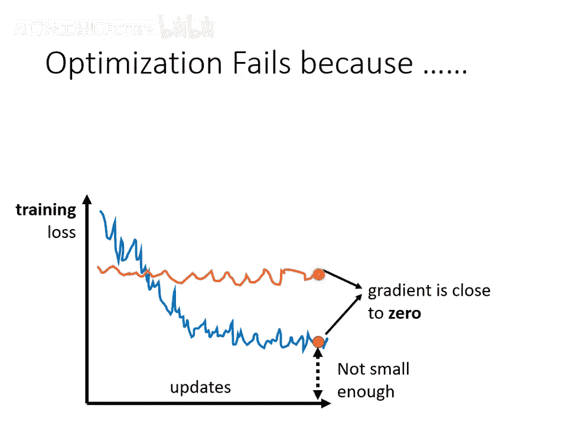

上一节我们介绍了梯度下降法的基本概念。本节中我们来看看优化过程可能失败的情况。

在进行优化时，你可能会发现，随着参数不断更新，训练损失不再下降。你对这个损失值并不满意，例如，深度网络的表现并没有比线性模型或浅层网络更好，这说明优化可能存在问题。有时，甚至从一开始模型就无法训练，无论如何更新参数，损失都无法下降。

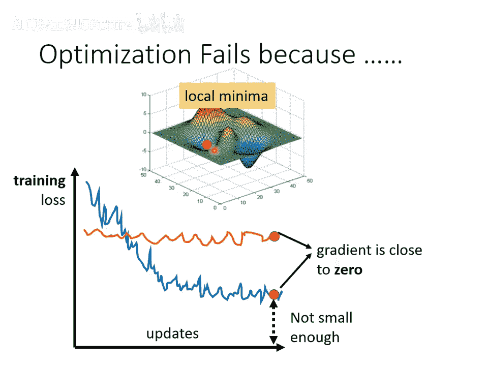

那么，到底发生了什么呢？一个常见的猜想是，我们的参数走到了一个对损失函数的微分为零的地方。当梯度为零时，梯度下降法就无法再更新参数，训练因此停止，损失自然也不再下降。

---

## 临界点：不只是局部最小值

讲到梯度为零，大家最先想到的通常是**局部最小值**。常有人说，在深度学习中用梯度下降法会“卡在局部最小值”，所以梯度下降法不work，深度学习也不过如此。

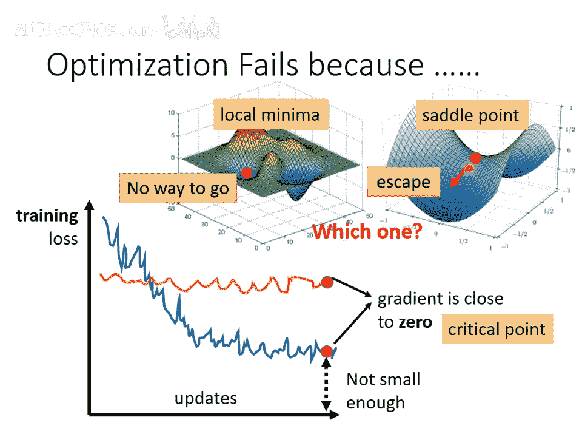

然而，如果你要撰写深度学习相关的论文，千万不要轻易下“卡在局部最小值”这样的结论，因为这会被认为缺乏专业性。原因在于，梯度为零的点并非只有局部最小值。

还有一种情况叫做**鞍点**。鞍点也是梯度为零的点，但它既不是局部最小值，也不是局部最大值。例如，在下图红点处，左右方向较高，前后方向较低，形状像马鞍，故称鞍点。

像鞍点这种梯度为零的点，与局部最小值一起，统称为**临界点**。因此，当损失无法下降时，可以说可能卡在了临界点，但不能武断地说是卡在了局部最小值，因为鞍点也是可能性之一。

区分卡在局部最小值还是鞍点非常重要。因为如果卡在局部最小值，可能就无路可走了，四周的损失都比当前点高。但如果卡在鞍点，旁边很可能存在让损失下降的路径，只要逃离鞍点，损失就有可能进一步降低。

---

## 如何区分局部最小值与鞍点

那么，如何判断一个临界点究竟是局部最小值还是鞍点呢？这需要用到一些数学工具。

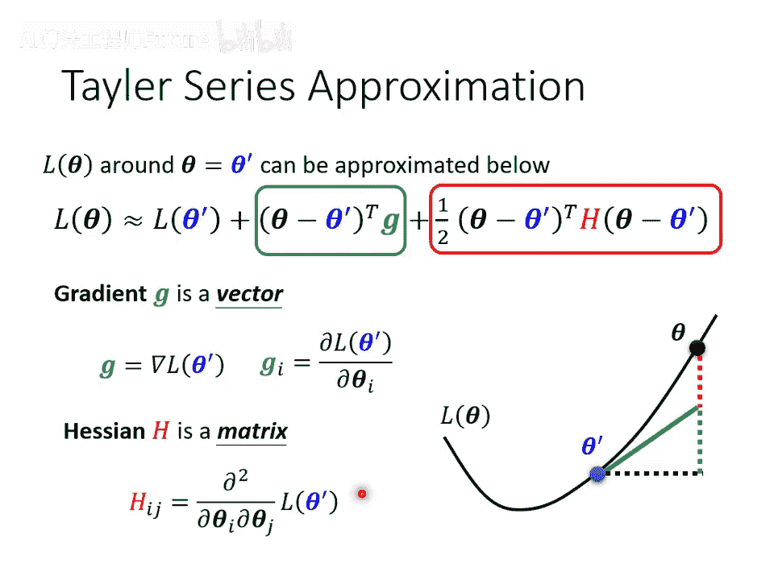

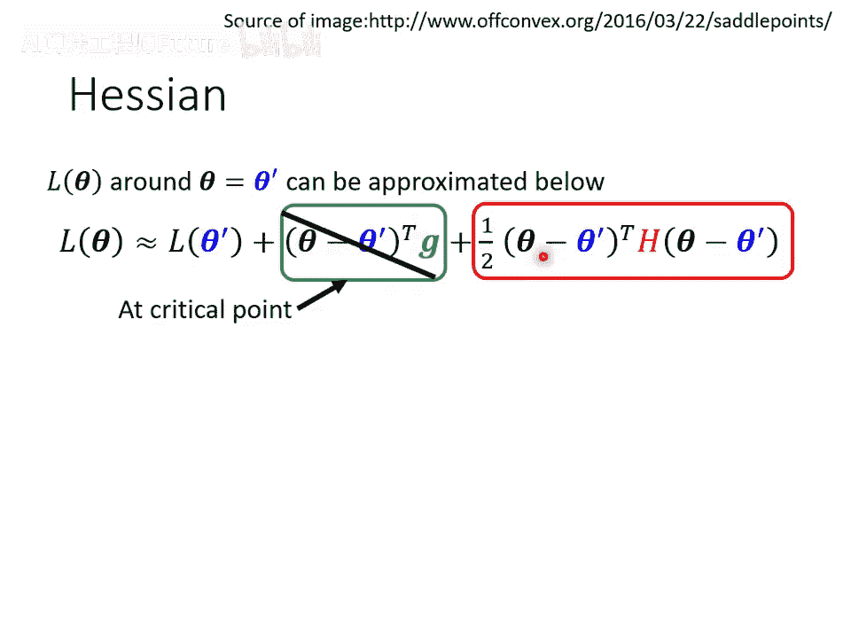

以下内容涉及微积分和线性代数，但如果你没有完全听懂，跳过这段并不影响对核心概念的理解。

### 损失函数的局部近似

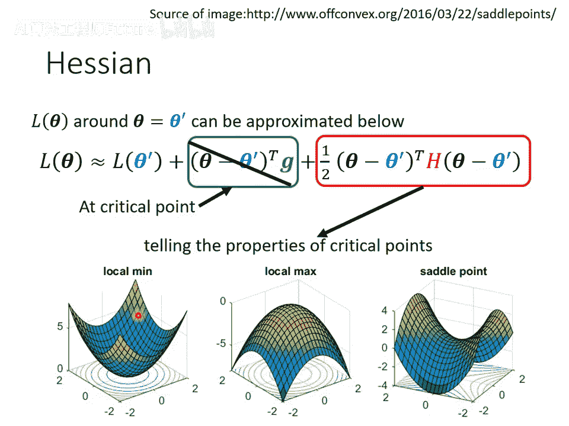

我们无法知道整个复杂损失函数的全貌，但给定一组参数 \(\theta‘\)，我们可以写出在该点附近的损失函数近似形式。这基于**泰勒级数展开**。

损失函数 \(L(\theta)\) 在 \(\theta‘\) 附近的近似可以写成：

\[L(\theta) \approx L(\theta‘) + (\theta - \theta‘)^T g + \frac{1}{2} (\theta - \theta‘)^T H (\theta - \theta‘)
\]

以下是公式中各部分的含义：

- **\(L(\theta‘)\)**：在 \(\theta‘\) 点的损失值。
- **\(g\)**：梯度向量。其第 \(i\) 个分量为 \(L\) 对 \(\theta_i\) 的偏微分，即 \(g_i = \frac{\partial L}{\partial \theta_i}\)。它衡量了 \(\theta\) 与 \(\theta‘\) 之间的一阶差异。
- **\(H\)**：海森矩阵。它是一个二阶微分矩阵，其第 \(i\) 行第 \(j\) 列的元素 \(H_{ij}\) 是损失函数 \(L\) 先对 \(\theta_j\) 再对 \(\theta_i\) 求偏导的结果，即 \(H_{ij} = \frac{\partial^2 L}{\partial \theta_i \partial \theta_j}\)。它用于补足一阶近似与真实函数之间的差距。

简单来说，损失函数在 \(\theta‘\) 附近的行为，主要由梯度（一次微分）和海森矩阵（二次微分）决定。

### 在临界点处的分析

当我们位于一个临界点时，梯度 \(g\) 为零向量，因此上述近似公式中的一阶项消失。

此时，损失函数近似为：

\[L(\theta) \approx L(\theta‘) + \frac{1}{2} (\theta - \theta‘)^T H (\theta - \theta‘)
\]

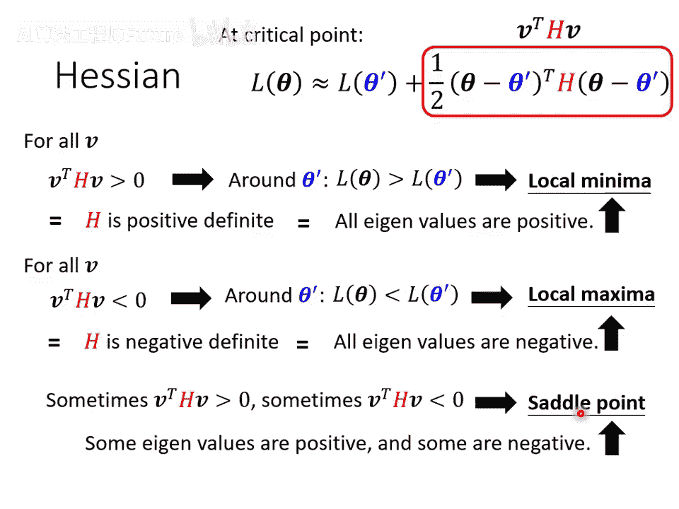

我们可以通过分析红色项 \((\theta - \theta‘)^T H (\theta - \theta‘)\) 来判断 \(\theta‘\) 附近的地貌（error surface的形状）。

为了方便，令向量 \(v = \theta - \theta‘\)。那么我们需要考察 \(v^T H v\) 的值。

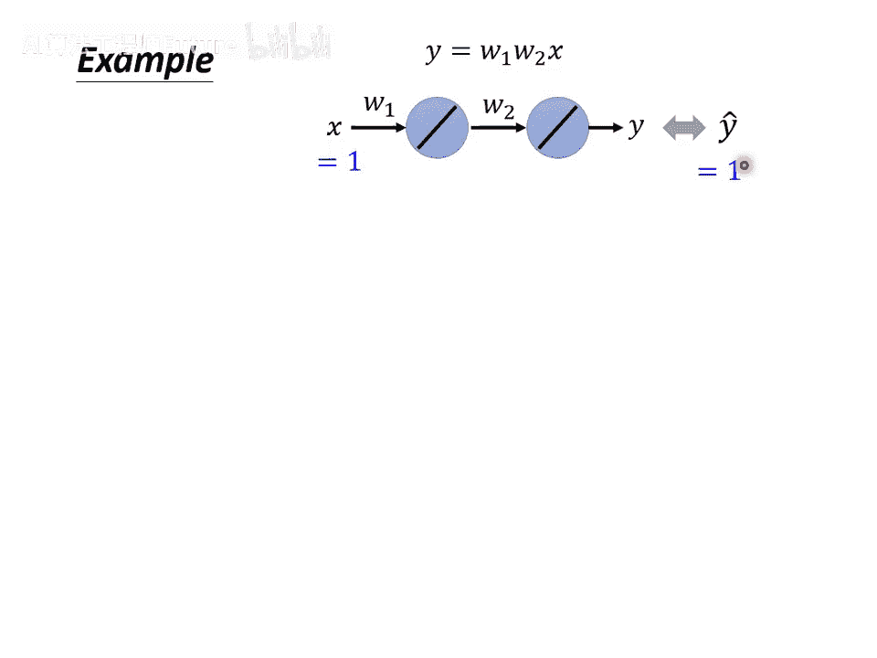

以下是判断依据：

1. 如果对于**所有**可能的 \(v\)，都有 \(v^T H v > 0\)，那么 \(L(\theta) > L(\theta‘)\)。这意味着 \(\theta‘\) 是附近的最低点，即**局部最小值**。
2. 如果对于**所有**可能的 \(v\)，都有 \(v^T H v < 0\)，那么 \(L(\theta) < L(\theta‘)\)。这意味着 \(\theta‘\) 是附近的最高点，即**局部最大值**。
3. 如果对于**不同**的 \(v\)，\(v^T H v\) 有时大于0，有时小于0，那么 \(\theta‘\) 附近有些点损失更高，有些点损失更低。这意味着这是一个**鞍点**。

### 通过特征值快速判断

我们不可能测试所有 \(v\)。线性代数告诉我们，可以通过海森矩阵 \(H\) 的**特征值**来快速判断：

- 如果 \(H\) 的所有特征值均为正，则 \(v^T H v > 0\) 恒成立，该点为**局部最小值**。
- 如果 \(H\) 的所有特征值均为负，则 \(v^T H v < 0\) 恒成立，该点为**局部最大值**。
- 如果 \(H\) 的特征值有正有负，则该点为**鞍点**。

**结论**：计算临界点处的海森矩阵 \(H\)，并检查其特征值。若全为正，则是局部最小值；若有正有负，则是鞍点。

---

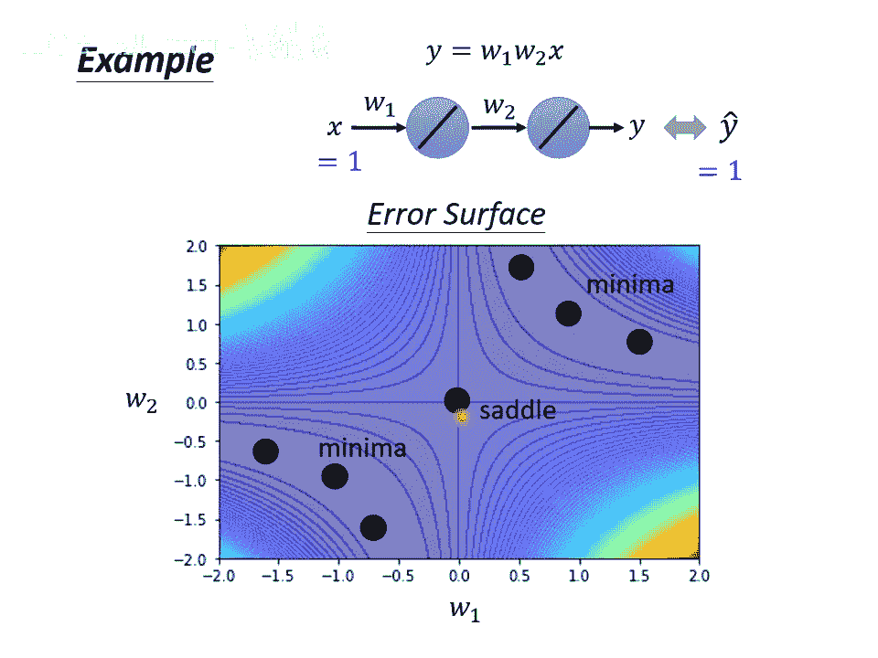

## 实例演示

为了加深理解，我们来看一个最简单的例子。

我们构造一个“史上最废”的神经网络：输入 \(x\)，只有一个神经元（无激活函数）乘以权重 \(w_1\)，再乘以权重 \(w_2\) 后输出。即 \(y = w_1 \cdot w_2 \cdot x\)。  

我们使用“史上最废”的训练数据：只有一笔数据 \((x=1, \hat{y}=1)\)。损失函数为均方误差：

\[L = (1 - w_1 w_2)^2
\]

由于只有两个参数 \(w_1\) 和 \(w_2\)，我们可以画出完整的损失曲面。图中存在多个临界点：

- 原点 \((0, 0)\) 是一个临界点。
- 两条“山沟”里各有一排临界点。

通过观察图像或计算可知，原点是**鞍点**，而两条山沟里的点都是**局部最小值**。

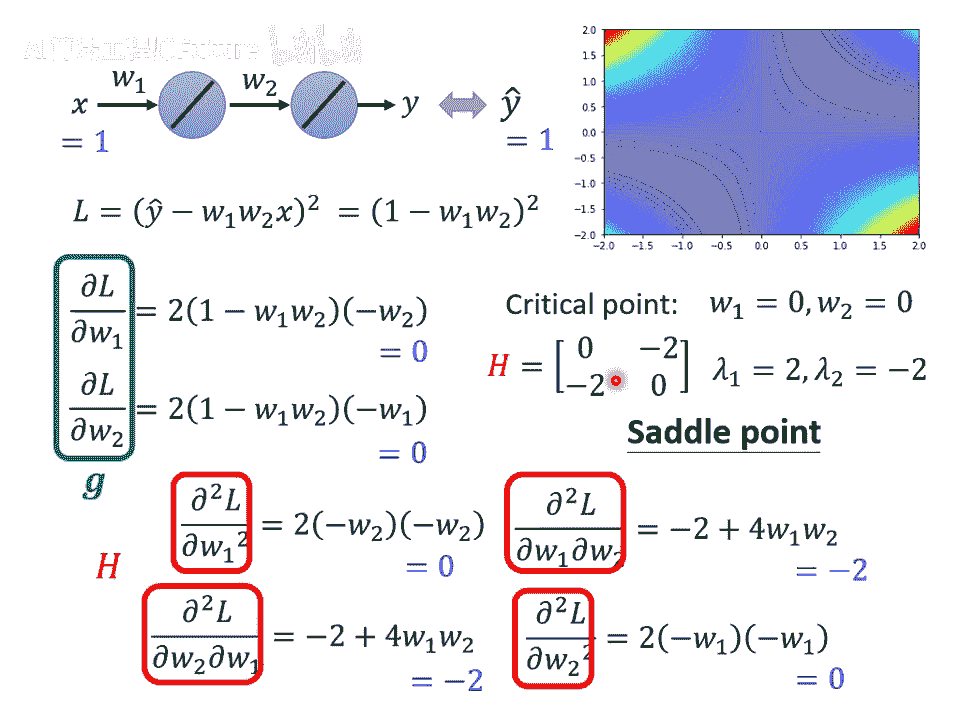

### 通过计算验证

现在，我们不依赖图像，而是通过计算海森矩阵来判断原点 \((0,0)\) 的性质。

首先，计算梯度 \(g\)：

\[\frac{\partial L}{\partial w_1} = -2w_2(1 - w_1 w_2)
\]

\[\frac{\partial L}{\partial w_2} = -2w_1(1 - w_1 w_2)
\]

在原点 \((0,0)\) 处，梯度为零，确认其为临界点。

其次，计算海森矩阵 \(H\)。\(H\) 包含 \(L\) 的所有二阶偏导：

\[H = \begin{bmatrix}
\frac{\partial^2 L}{\partial w_1^2} & \frac{\partial^2 L}{\partial w_1 \partial w_2} \\
\frac{\partial^2 L}{\partial w_2 \partial w_1} & \frac{\partial^2 L}{\partial w_2^2}
\end{bmatrix} = \begin{bmatrix}
2w_2^2 & -2+4w_1w_2 \\
-2+4w_1w_2 & 2w_1^2
\end{bmatrix}
\]

将 \(w_1=0, w_2=0\) 代入，得到原点处的海森矩阵：

\[H = \begin{bmatrix}
0 & -2 \\
-2 & 0
\end{bmatrix}
\]

最后，计算 \(H\) 的特征值。解特征方程 \(|H - \lambda I| = 0\)，得到特征值 \(\lambda_1 = 2, \lambda_2 = -2\)。特征值一正一负，根据我们的判断标准，原点 \((0,0)\) 是一个**鞍点**。这与我们观察图像得到的结论一致。

---

## 逃离鞍点

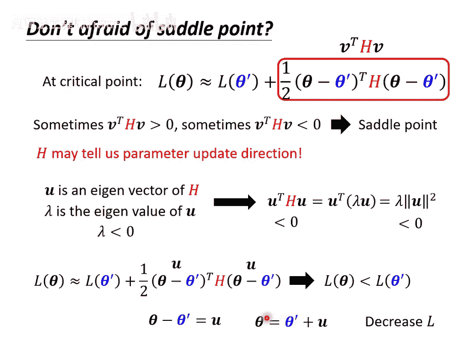

如果卡在鞍点，事情并没有那么糟糕。海森矩阵不仅能帮我们诊断鞍点，还能指出更新参数、降低损失的方向。

假设 \(u\) 是海森矩阵 \(H\) 的一个特征向量，对应的特征值为 \(\lambda\)。如果我们令更新方向 \(v = u\)，那么损失函数的二阶项变为：

\[\frac{1}{2} u^T H u = \frac{1}{2} \lambda ||u||^2
\]

- 如果 \(\lambda < 0\)（负特征值），那么这一项是负的。这意味着如果我们沿着这个特征向量 \(u\) 的方向更新参数，即 \(\theta = \theta‘ + u\)，损失 \(L(\theta)\) 将会小于 \(L(\theta‘)\)。

**结论**：在鞍点处，找到海森矩阵的**负特征值**及其对应的**特征向量**，沿着这个特征向量的方向更新参数，就可以让损失下降，从而逃离鞍点。

### 回到实例

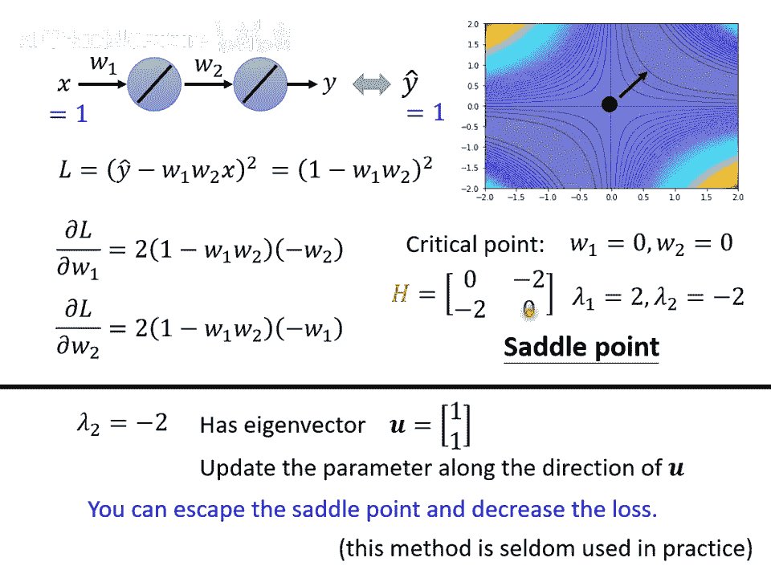

在我们的例子中，原点鞍点的海森矩阵 \(H = \begin{bmatrix} 0 & -2 \\ -2 & 0 \end{bmatrix}\)，有一个负特征值 \(\lambda = -2\)。其对应的一个特征向量可以是 \(u = [1, 1]^T\)。  

这意味着，从原点 \((0,0)\) 出发，沿着 \([1, 1]\) 的方向（即同时增加 \(w_1\) 和 \(w_2\)）更新参数，损失就会减小。这为我们逃离鞍点提供了明确的方向。

**注意**：在实际训练中，直接计算并分解海森矩阵的计算量极其巨大，因此很少有人用这种方法逃离鞍点。后续课程会介绍其他更高效的方法。这里介绍此方法是为了说明，从理论上看，鞍点并非绝境。

---

## 局部最小值与鞍点，谁更常见？

一个很自然的问题是：在深度神经网络训练中，局部最小值和鞍点，哪一个更常见呢？如果更常见的是鞍点，那对我们的优化来说是个好消息。

我们可以从一个高维空间的视角来思考这个问题。在低维空间（如一维、二维）中看起来是封闭的局部最小值，在更高维的空间中，可能只是一个鞍点。就像三维空间中封闭的石棺，在四维空间中可能有路可进（类比《三体》中的故事）。

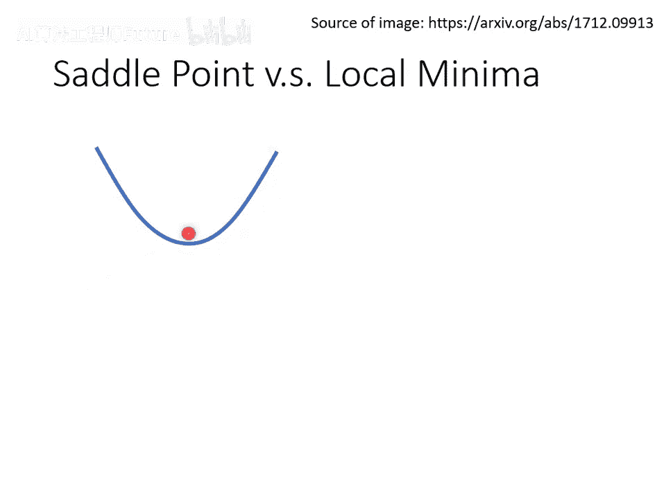

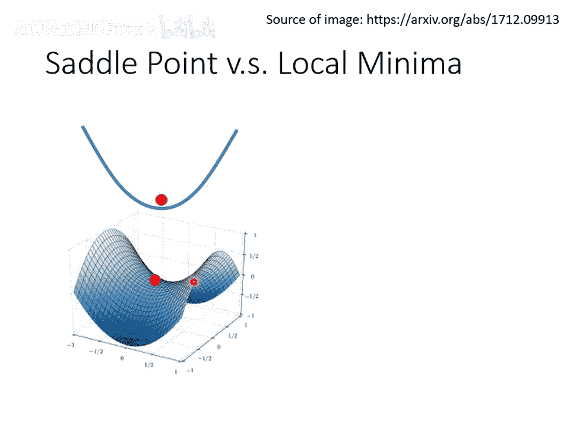

深度神经网络的参数动辄百万、千万，这意味着我们的损失曲面处于一个极高维的空间中。维度越高，可走的“路径”就可能越多，真正的局部最小值可能远比我们想象的要少。

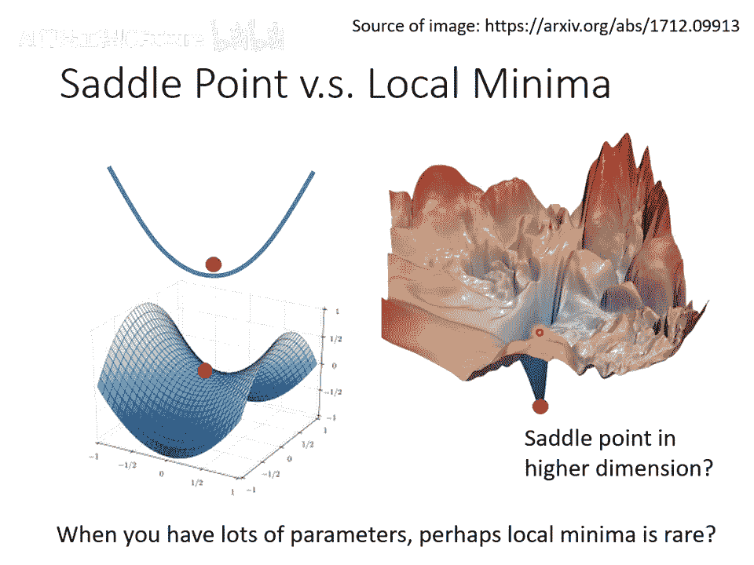

实验证据也支持这一假说。下图展示了对多个训练好的网络在其临界点处进行分析的结果：

- 横轴是 **Minimum Ratio**（最小比率），即海森矩阵正特征值的数量占总特征值数量的比例。比率为1表示所有特征值为正（像局部最小值），比率接近0.5表示正负特征值各半（像鞍点）。
- 纵轴是训练停止时的损失值。

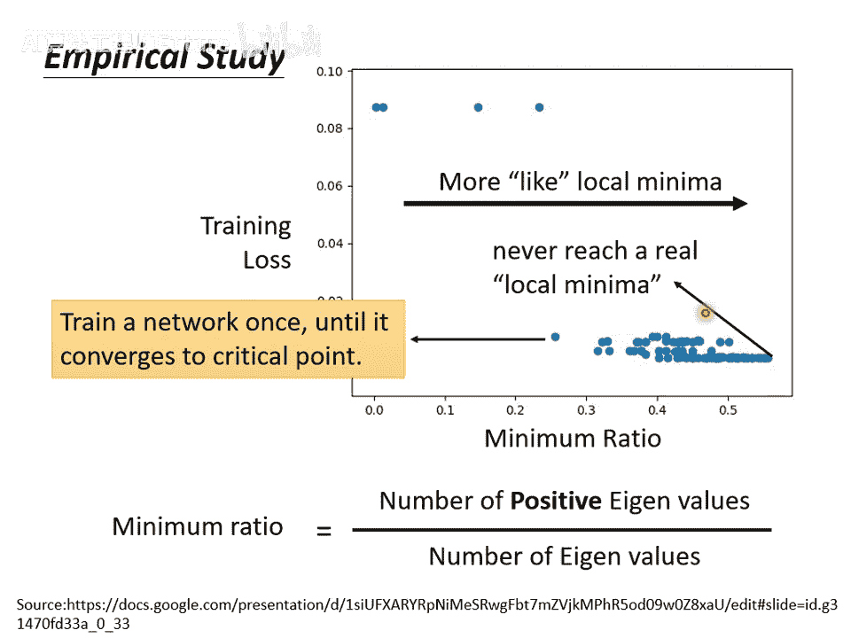

观察发现，几乎没有点的 Minimum Ratio 达到 1.0。即使在最极端的情况下，正特征值的比例也只有 0.5 到 0.6 左右。这意味着，在临界点处，总有一半左右的方向（对应负特征值）可以让损失下降。

**经验结论**：在实际的深度网络训练中，真正的局部最小值并不常见。大多数情况下，当梯度很小、优化停滞时，我们很可能是卡在了一个**鞍点**，或者损失曲面非常平坦的区域。

---

## 总结与预告

本节课中，我们一起学习了梯度下降优化失败的一个重要原因：临界点。

1. 我们明确了**临界点**包括局部最小值和鞍点。
2. 我们学习了如何通过计算**海森矩阵**及其**特征值**来从数学上区分这两者。
3. 我们了解到，即使卡在鞍点，理论上也存在逃离的方向（沿负特征向量更新）。
4. 更重要的是，根据理论和实验，在高维的神经网络优化问题中，**鞍点比局部最小值更为常见**，这在一定程度上缓解了我们对“陷入局部最优”的恐惧。

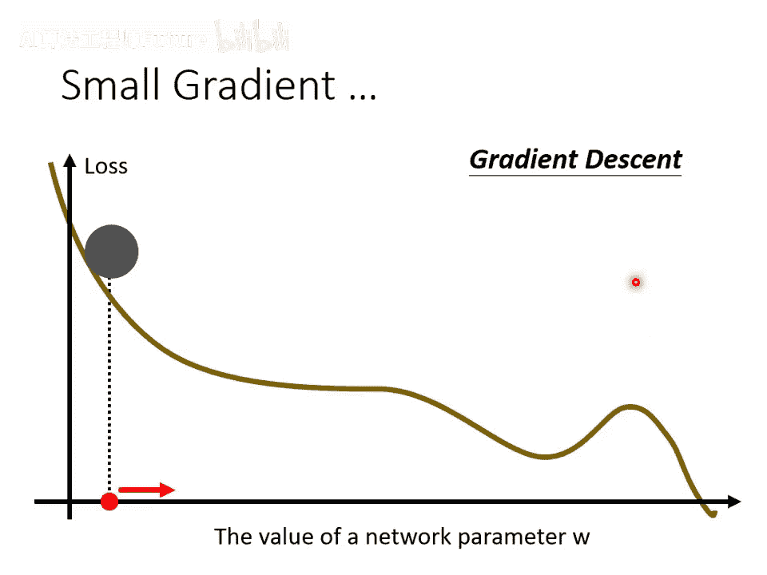

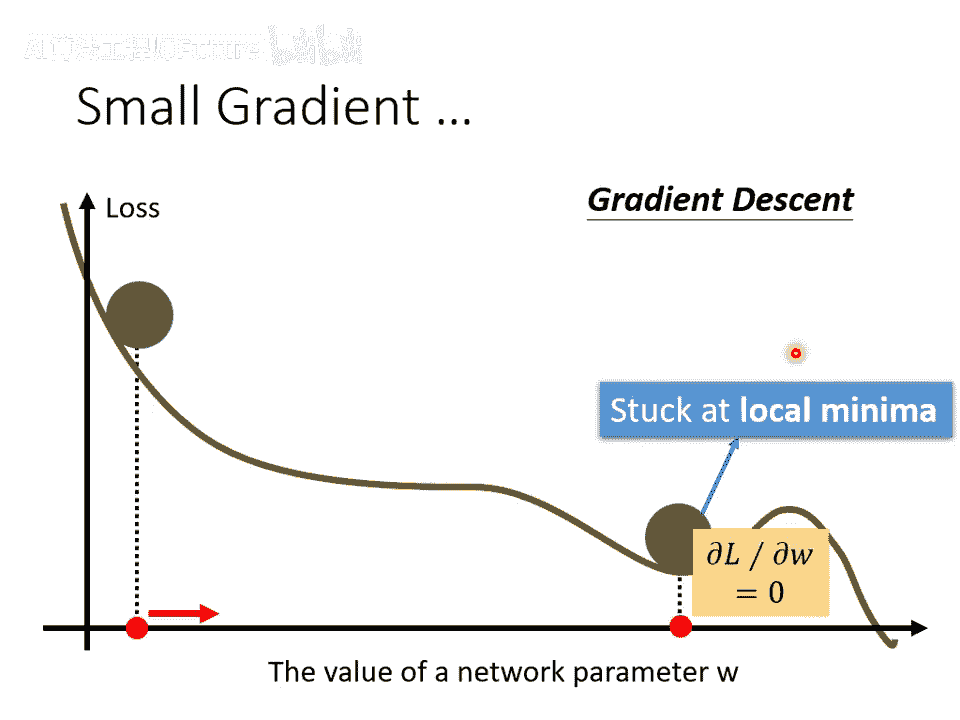

既然我们更常遇到的是鞍点或平坦区域，那么有什么实用的方法可以帮助我们逃离或加速通过这些区域呢？在接下来的课程中，我们将介绍诸如动量法、自适应学习率等更高效的优化算法。

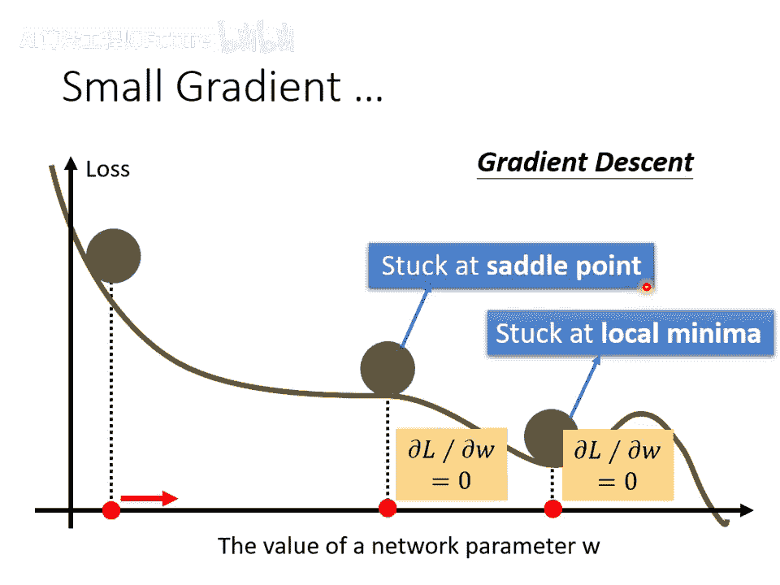

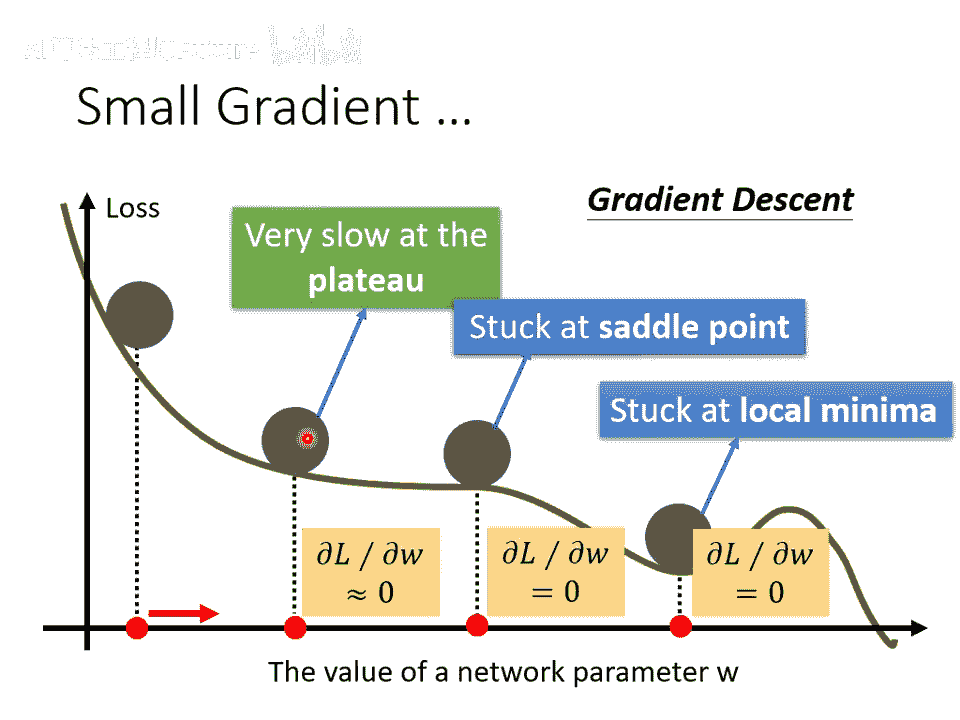

