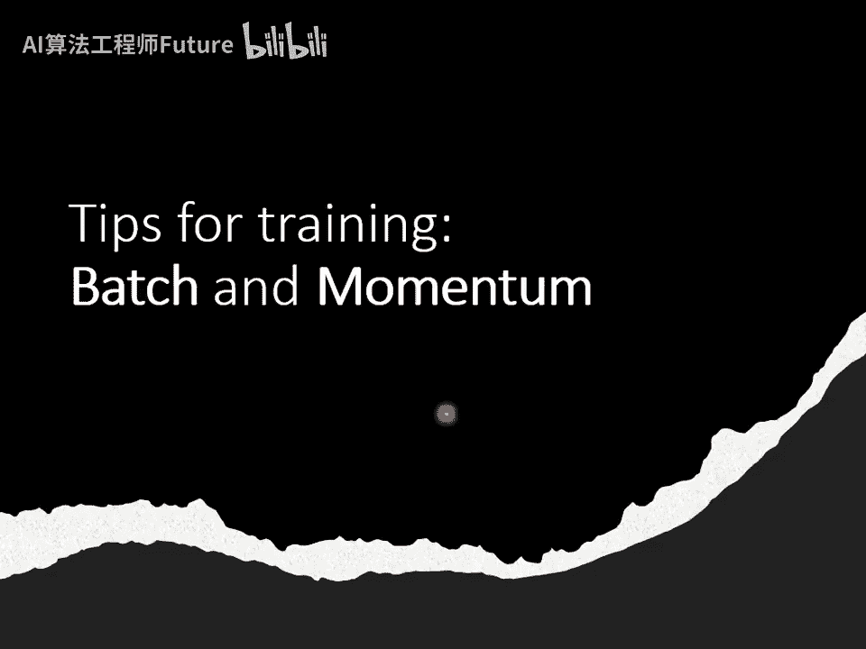
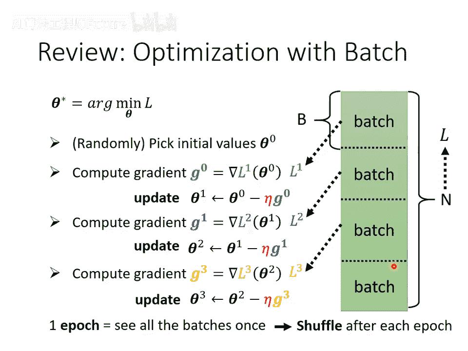
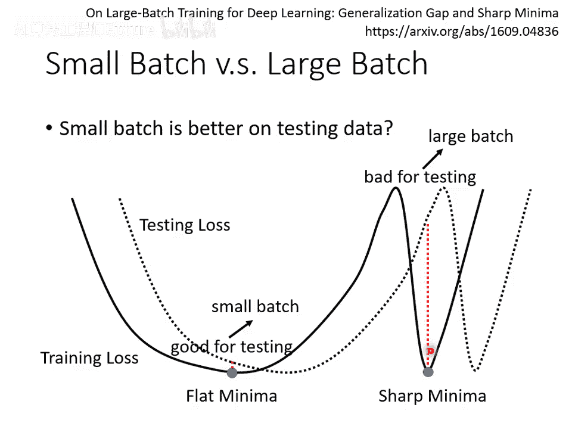
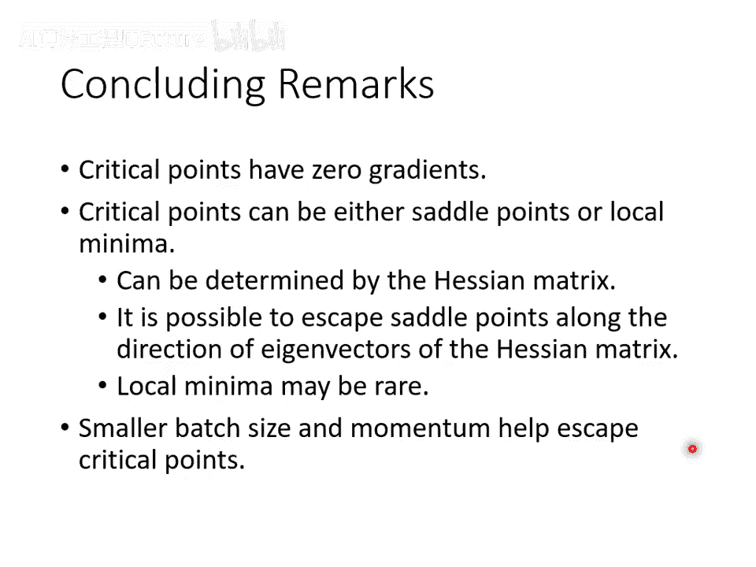

# 15：批次 (Batch) 与动量 (Momentum) 🧠⚙️

在本节课中，我们将要学习两个重要的训练技巧：批次（Batch）与动量（Momentum）。我们将探讨批次大小如何影响训练效率与模型性能，并学习动量方法如何帮助优化过程逃离局部极小值，使训练更加稳定和高效。

## 什么是批次 (Batch)？📦

上一节我们介绍了梯度下降的基本概念，本节中我们来看看实际训练中如何组织数据。在实际计算梯度时，我们通常不会一次性使用所有数据来计算损失函数。相反，我们会将所有数据分成若干个较小的组，每个组称为一个批次（Batch）或小批次（Mini-batch）。

每个批次包含一定数量的数据样本，我们用 **B** 来表示批次大小。每次更新模型参数时，我们只使用一个批次的数据来计算损失和梯度，然后进行参数更新。接着，我们使用下一个批次的数据重复这个过程。

以下是关于批次处理的关键点：

- **周期 (Epoch)**：模型完整遍历一次所有训练数据的过程，称为一个周期。
- **洗牌 (Shuffle)**：在每个周期开始之前，通常会随机打乱所有数据，然后重新划分批次。这意味着每个周期中，同一个批次内的数据组合都可能不同。这种做法有助于提升模型的泛化能力。

## 为什么使用批次？🤔

接下来，我们比较两种极端情况，以理解使用批次的原因及其影响。

假设我们有20笔训练数据：

- **情况一（无批次/全批次）**：批次大小等于总数据量（20）。模型需要看完所有20笔数据才能计算一次损失和梯度，并更新一次参数。
- **情况二（小批次）**：批次大小设为1。每看一笔数据，就能计算一次损失和梯度，并更新一次参数。在一个周期内，参数会被更新20次。

以下是两种方式的对比分析：

- **更新稳定性**：全批次方法每一步的更新方向更稳定，因为它基于所有数据的平均梯度。小批次方法每一步的更新方向噪声较大，因为它只基于单一样本或少量样本。
- **更新频率**：全批次方法“技能冷却时间长”，更新频率低。小批次方法“技能冷却时间短”，更新频率高。
- **并行计算优势**：在实际使用GPU进行并行计算时，计算一个批次梯度所需的时间并不会随批次大小线性增长。对于合理的批次大小（如1到1000），计算时间可能相差无几。因此，全批次在更新频率上的劣势可能被削弱，甚至因为更少的更新次数（完成一个周期所需的总更新次数少）而在总时间上占优。

## 批次大小的影响 📊

然而，实验结果表明，较小的批次大小在模型优化和泛化上可能具有优势。

- **优化优势**：在训练集上，较小的批次大小往往能帮助模型找到更优的解（更低的训练损失）。这是因为每次更新基于略有不同的损失函数（不同批次）。如果一个批次使梯度为零（陷入临界点），切换到下一个批次可能提供非零梯度，让优化得以继续。
- **泛化优势**：即使通过调整学习率等方法，让大批次和小批次在训练集上达到相近的性能，小批次训练出的模型在测试集上通常表现更好，即泛化能力更强。

一个可能的解释是，损失函数曲面（Error Surface）上存在许多局部极小值。小批次由于更新噪声大，可能更倾向于停留在宽阔平坦的“盆地”型极小值中；而大批次更新稳定，可能更容易陷入狭窄陡峭的“峡谷”型极小值。当训练和测试数据分布存在微小差异时，“盆地”型极小值的性能变化更小，因而更鲁棒。

因此，批次大小本身是一个需要调节的超参数，它需要在训练效率（大批次可能更快）、优化效果和泛化性能之间取得平衡。

## 动量 (Momentum) 🚀

上一节我们介绍了批次，本节中我们来看看另一个有助于优化的技巧：动量。动量方法受物理学启发，旨在解决梯度下降可能陷入局部极小值或鞍点的问题。

在物理世界中，一个球从斜坡滚下，即使到达局部最低点或平地，由于惯性（动量），它也可能继续前进甚至翻越小的坡坎。动量法将类似的概念引入参数更新中。

### 工作原理

在标准梯度下降中，参数更新完全遵循当前梯度的反方向：  

`θ_new = θ_old - η * ∇L(θ_old)`

其中 **η** 是学习率。

加入动量后，参数更新方向是**当前梯度方向**与**前一步更新方向**的加权组合。具体步骤如下：

1. 初始化参数 `θ0` 和前一步更新量 `m0 = 0`。
2. 在每一步 `t`，计算当前梯度 `g_t = ∇L(θ_t)`。
3. 计算当前动量更新量 `m_t`：  
  
  `m_t = λ * m_{t-1} - η * g_t`  
  
  其中 **λ** 是动量系数（通常接近1，如0.9），用于控制历史方向的影响程度。
4. 更新参数：  
  
  `θ_{t+1} = θ_t + m_t`

通过展开公式可以发现，`m_t` 实际上是历史所有梯度的指数加权平均。因此，动量法不仅考虑当前梯度，也考虑了过去的梯度信息。

### 动量的优势

通过一个简单例子可以直观理解动量的作用。假设优化过程即将进入一个局部极小值，标准梯度下降会因梯度为零而停止。但动量法由于保留了之前向该方向运动的“惯性”，可能会继续向前移动，从而有机会越过该极小点，找到更优的区域。即使当前梯度建议向左，如果之前的动量足够大向右，实际更新方向仍可能向右。

因此，动量法可以帮助加速收敛，并减少陷入不良局部极小值或鞍点的风险。

## 总结 🎯

本节课中我们一起学习了两个关键的机器学习训练技巧。

首先，我们深入探讨了**批次（Batch）**。我们了解到将数据分批次处理是实际训练中的标准做法。批次大小是一个重要的超参数：较大的批次可能利用并行计算加速训练周期，但较小的批次往往因其引入的梯度噪声，在模型优化和最终泛化性能上表现更佳。

其次，我们学习了**动量（Momentum）** 方法。它通过结合当前梯度和历史更新方向来决定参数更新步骤，模拟了物理中的惯性。这种方法有助于优化过程逃离局部极小值或鞍点，使训练更加稳定和高效。

理解并合理应用批次与动量，对于有效训练深度学习模型至关重要。
