# 16：自适应学习率 🎯

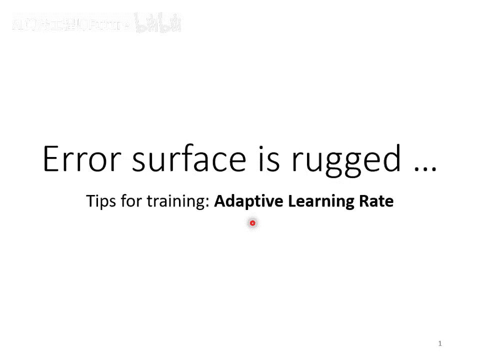

在本节课中，我们将学习如何改进梯度下降算法，通过为每个参数设置不同的学习率（即自适应学习率），来解决训练过程中损失函数不再下降但梯度并未消失的问题。我们将探讨几种关键的自适应优化算法。

## 引言：训练停滞的原因

上一节我们讨论了临界点（critical point）的问题。本节中我们来看看，训练停滞并不总是因为到达了临界点。

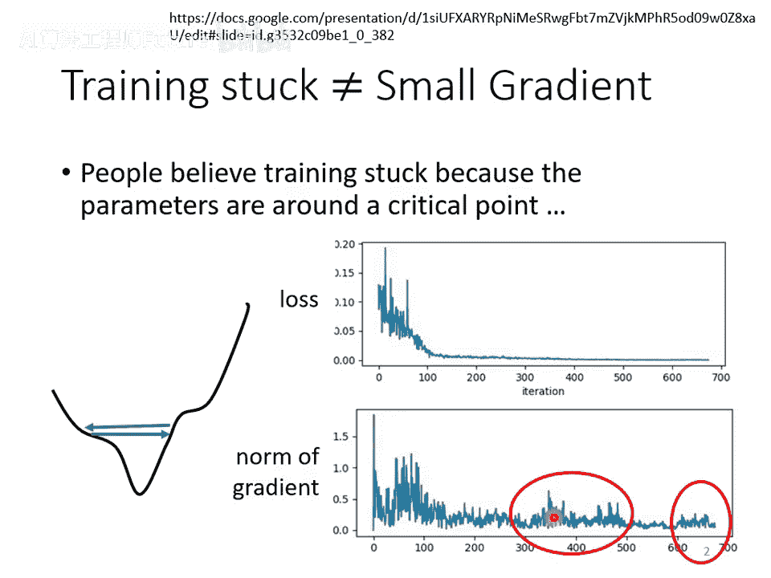

在训练网络时，我们记录损失值。随着参数更新，损失逐渐减小，但最终可能卡住不再下降。许多人会猜测是到达了临界点（梯度为零），导致参数无法更新。但事实果真如此吗？

到达临界点意味着梯度非常小。然而，当损失不再下降时，梯度真的变得很小吗？实际上，很多时候并非如此。在展示的例子中，损失停止下降时，梯度的范数（即梯度向量的大小）并没有变得很小。损失几乎不再减少，但梯度范数甚至可能上升。

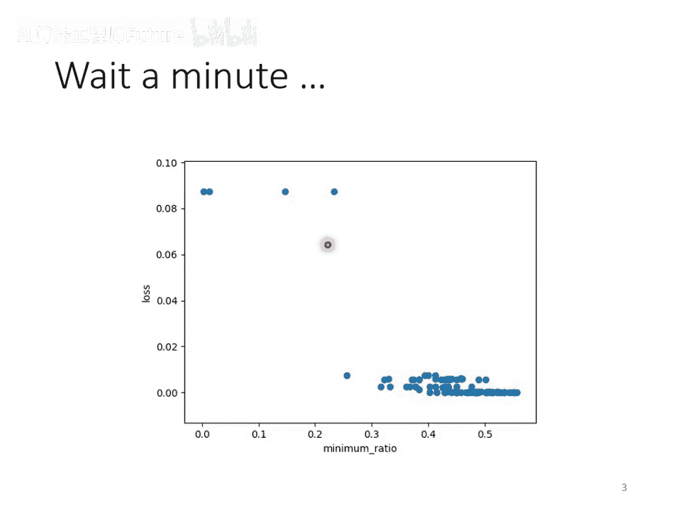

这种情况可能源于参数在误差曲面（error surface）的陡峭谷壁间来回震荡。此时损失不再下降，但梯度仍然很大。这并非卡在局部最小值或鞍点，而仅仅是损失无法继续下降。因此，当训练卡住时，需要分析具体原因，而不是简单地归咎于临界点。

实际上，使用标准梯度下降法训练时，往往在梯度仍然很大、远离临界点时，损失就已经停止下降了。真正阻碍训练进程的“魔王”往往不是临界点。

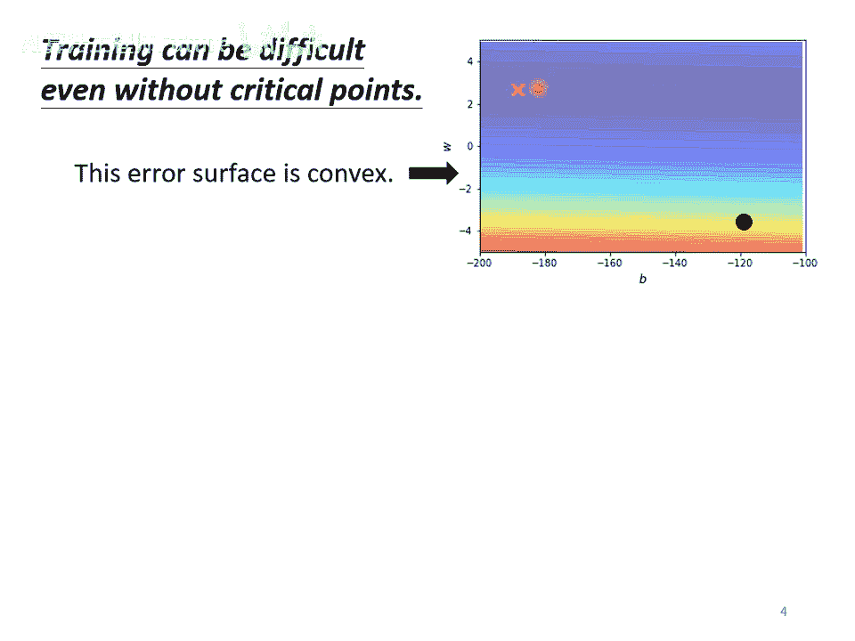

## 学习率调整的必要性

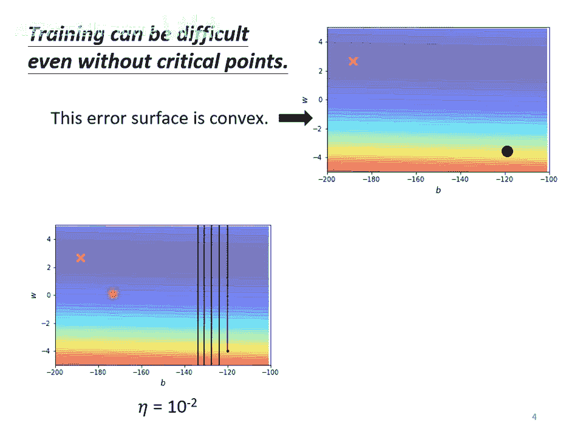

为什么训练会卡住？我们通过一个简单的例子来说明。

考虑一个只有两个参数的凸误差曲面，其等高线是椭圆形的。在横轴方向梯度变化小（平缓），在纵轴方向梯度变化大（陡峭）。最低点在中心。

即使对于这种简单的凸曲面，使用梯度下降法也可能遇到困难。例如，当学习率设为 (10^{-2}) 时，参数可能在峡谷两端震荡，损失无法下降，但梯度仍然很大。

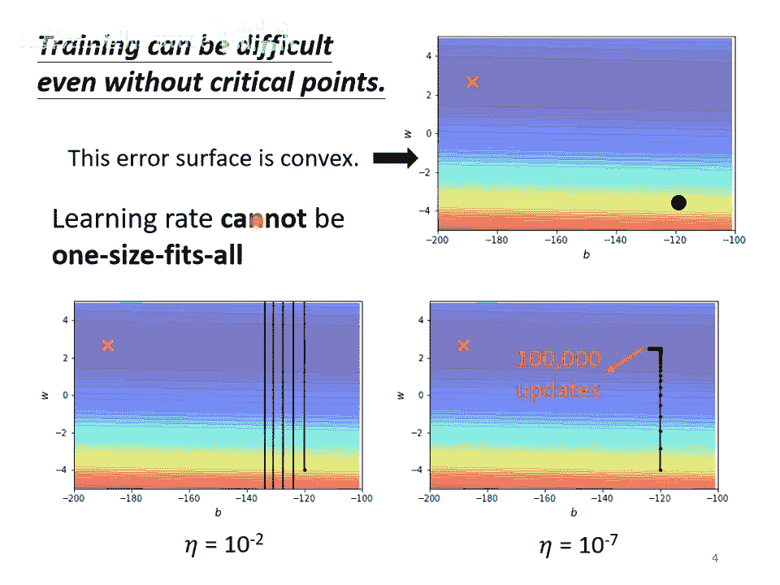

你可能会认为这是学习率设置过大导致的。然而，即使调小学习率，问题依然存在。将学习率从 (10^{-2}) 一直调到 (10^{-7})，震荡停止了，参数滑向谷底。但由于学习率过小，在坡度平缓的区域，参数更新步伐太小，训练进程极其缓慢，甚至无法接近最低点。

这个例子表明，即使是简单的凸优化问题，梯度下降法也可能表现不佳。对于更复杂的深度网络，梯度下降是主要依赖的工具。因此，我们需要改进梯度下降法。

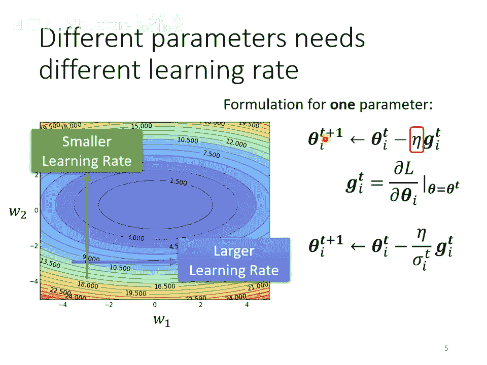

改进的核心在于：**为每个参数定制不同的学习率**。一个大原则是：在梯度值小（平坦）的方向上，我们希望学习率大一些；在梯度值大（陡峭）的方向上，我们希望学习率小一些。

## 自适应学习率算法

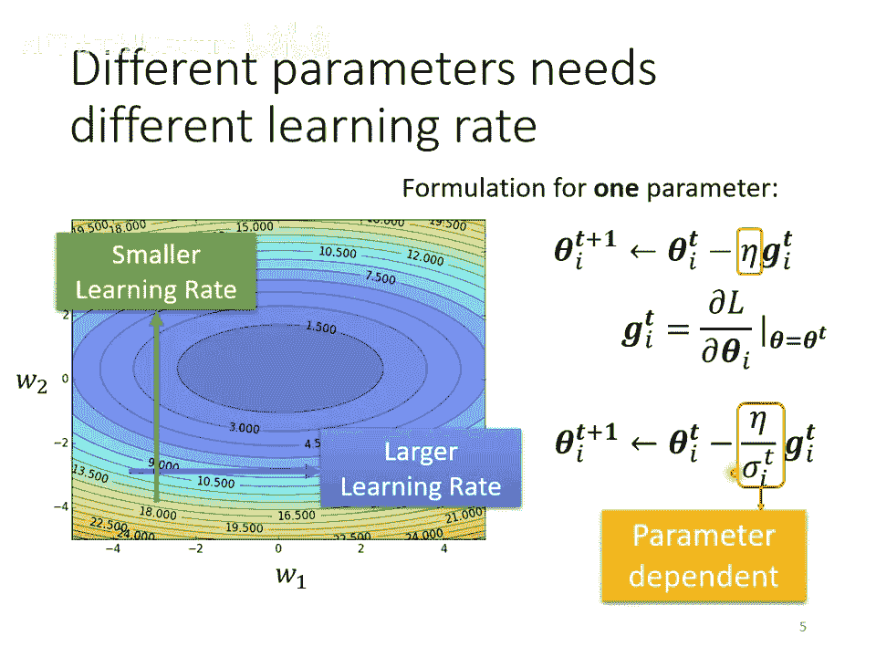

如何实现为每个参数定制学习率呢？我们需要修改梯度下降的更新公式。为了简化，我们只考虑单个参数 (\theta_i) 的更新，但方法可以推广到所有参数。

原来的更新公式为：  

[  

\theta_i^{t+1} = \theta_i^t - \eta \cdot g_i^t  

]  

其中，(\eta) 是固定的学习率，(g_i^t) 是第 (t) 次迭代时参数 (\theta_i) 的梯度。

现在我们引入一个参数依赖且迭代依赖的项 (\sigma_i^t)，将公式改为：  

[  

\theta_i^{t+1} = \theta_i^t - \frac{\eta}{\sigma_i^t} \cdot g_i^t  

]  

这样，我们就有了一个随参数和迭代次数变化的自适应学习率 (\frac{\eta}{\sigma_i^t})。

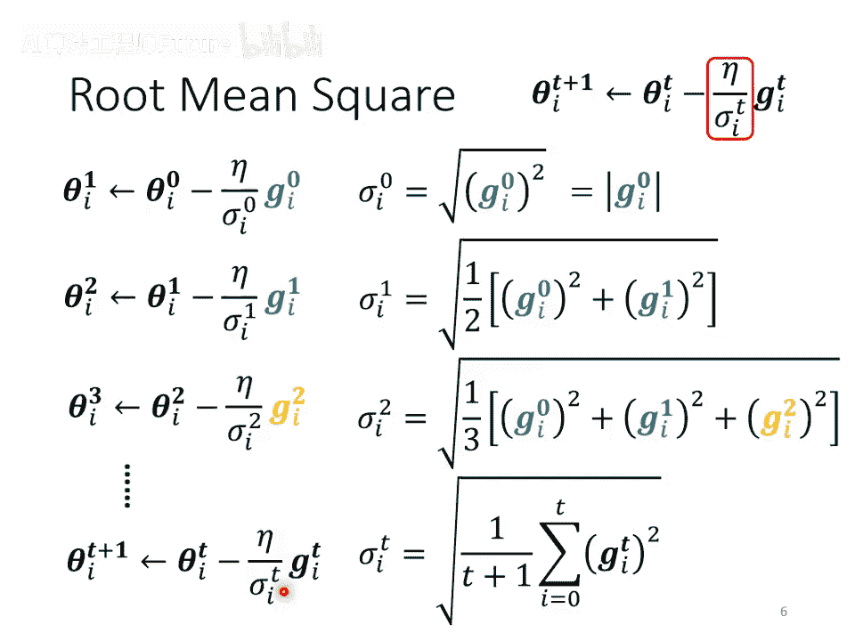

接下来，我们看看计算 (\sigma_i^t) 的常见方法。

### Adagrad 算法

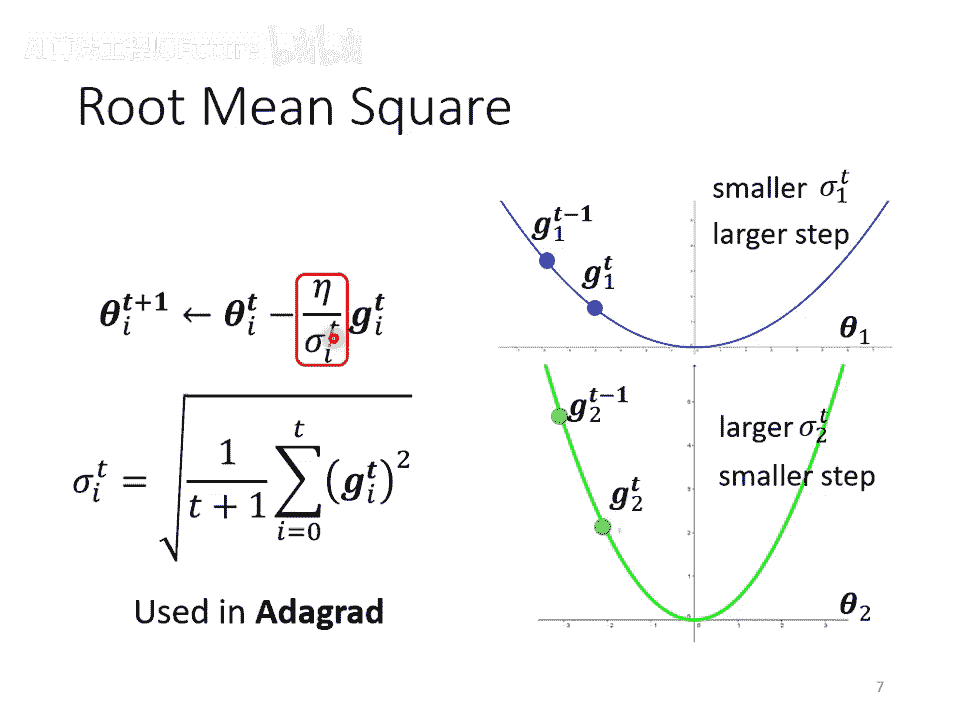

以下是 Adagrad 算法中 (\sigma_i^t) 的计算方式：

1. **初始化**：从 (\theta_i^0) 开始。
2. **第一次更新**：
  
  计算梯度 (g_i^0)。
  计算 (\sigma_i^0 = \sqrt{(g_i0)2} = |g_i^0|)。
  更新参数：(\theta_i^1 = \theta_i^0 - \frac{\eta}{\sigma_i^0} \cdot g_i^0)。这一步更新的大小只与 (\eta) 有关。
3. **第二次更新**：
  
  计算梯度 (g_i^1)。
  计算 (\sigma_i^1 = \sqrt{\frac{(g_i0)2 + (g_i1)2}{2}})。
  更新参数：(\theta_i^2 = \theta_i^1 - \frac{\eta}{\sigma_i^1} \cdot g_i^1)。
4. **第 t+1 次更新**：
  
  计算梯度 (g_i^t)。
  计算 (\sigma_i^t = \sqrt{\frac{1}{t+1} \sum_{k=0}^{t} (g_ik)2})。
  更新参数：(\theta_i^{t+1} = \theta_i^t - \frac{\eta}{\sigma_i^t} \cdot g_i^t)。

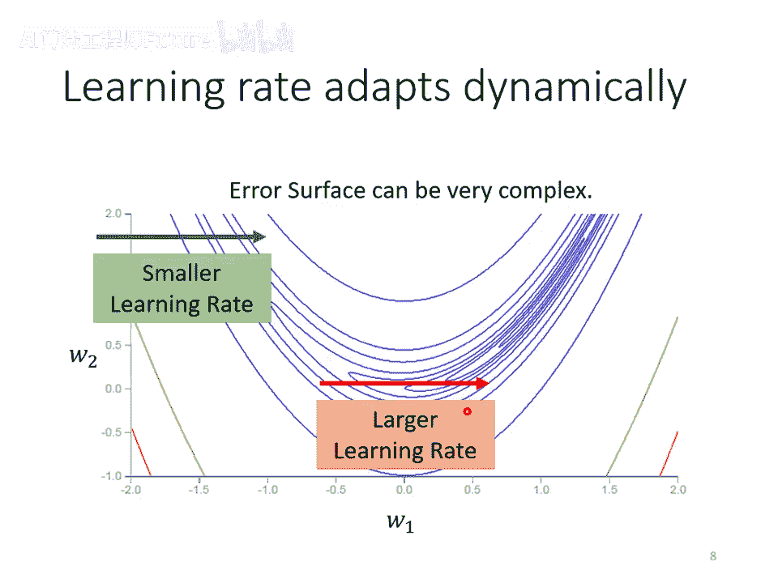

**Adagrad 的工作原理**：假设参数 (\theta_1) 方向平坦（梯度小），计算出的 (\sigma) 就小，导致学习率 (\frac{\eta}{\sigma}) 变大，更新步伐变大。反之，对于陡峭方向 (\theta_2)，梯度大，(\sigma) 大，学习率变小，更新步伐变小。这样就实现了根据梯度大小自动调整学习率。

### RMSProp 算法

Adagrad 假设同一参数的梯度大小恒定，但现实中，即使同一方向，梯度也可能随时间变化。例如，在误差曲面上，某处平坦需要大学习率，另一处陡峭需要小学习率。

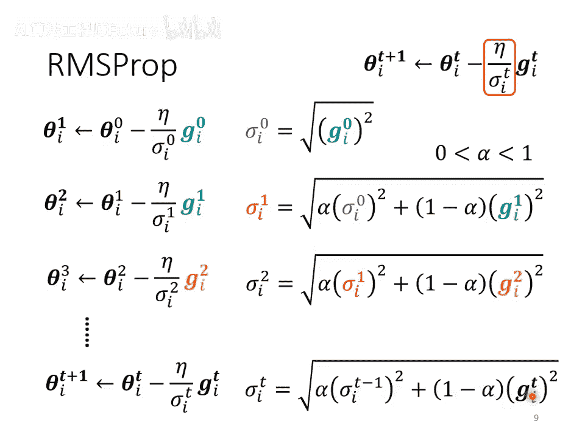

RMSProp 算法通过引入一个衰减因子 (\alpha) 来解决这个问题，使 (\sigma) 能更快地反映近期梯度的变化。

以下是 RMSProp 中 (\sigma_i^t) 的递归计算方式（以第二次更新为例）：  

[  

\sigma_i^1 = \sqrt{\alpha \cdot (\sigma_i0)2 + (1 - \alpha) \cdot (g_i1)2}  

]  

推广到第 t 次：  

[  

\sigma_i^t = \sqrt{\alpha \cdot (\sigma_i{t-1})2 + (1 - \alpha) \cdot (g_it)2}  

]  

其中，(\alpha) 是一个超参数（通常设为 0.9），用于调节历史梯度与当前梯度的重要性比例。(\alpha) 越小，当前梯度 (g_i^t) 的影响越大。

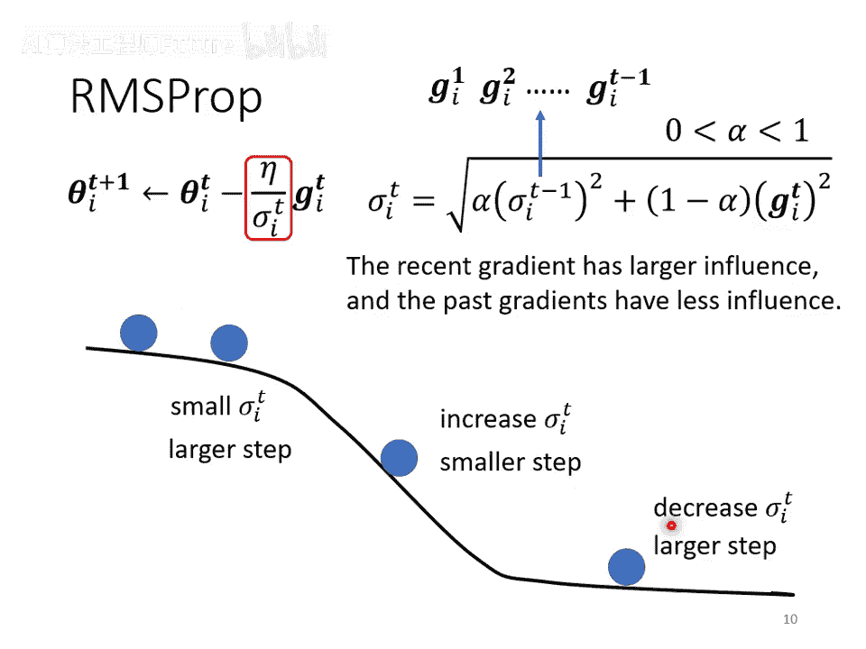

**RMSProp 的优势**：当参数从平坦区域突然进入陡峭区域时，如果使用 Adagrad，由于累积了历史上大量小梯度，(\sigma) 反应较慢，学习率仍然较大，可能导致更新步伐过大而“飞出去”。而 RMSProp 通过调整 (\alpha)，可以让 (\sigma) 迅速增大，从而快速减小学习率，“踩下刹车”。当再次进入平坦区域时，(\sigma) 也能快速减小，增大学习率。

### Adam 优化器

目前最常用的优化策略是 **Adam**，它结合了 **RMSProp** 和 **动量（Momentum）** 的思想。

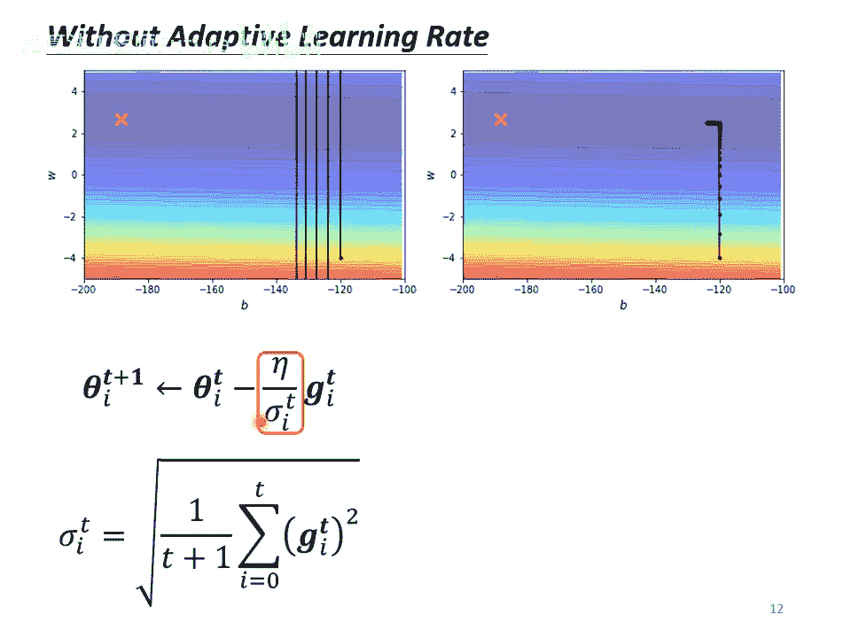

- **动量**：更新方向不是仅由当前梯度决定，而是过去所有梯度方向的加权和，有助于在相关方向加速并抑制震荡。
- **自适应学习率**：采用类似 RMSProp 的方法为每个参数计算不同的学习率。

Adam 算法的具体细节可参考原始论文。在实践中，深度学习框架（如 PyTorch）已经实现了 Adam 优化器，通常使用默认的超参数就能取得不错的效果。

## 学习率调度

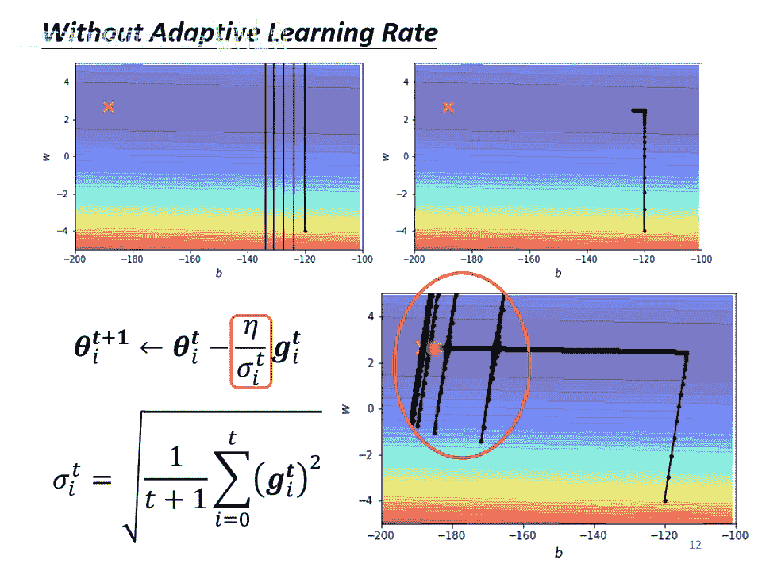

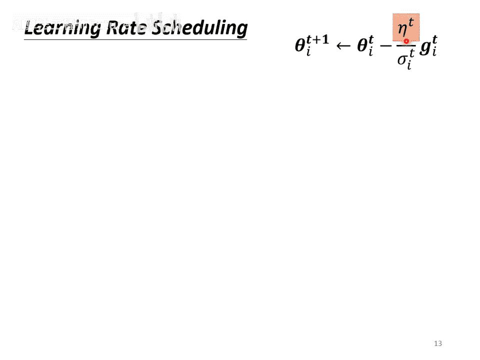

即使使用了自适应学习率，训练过程仍可能不稳定。例如，在 Adagrad 处理那个简单凸曲面的例子中，参数在纵轴方向累积了很小的 (\sigma)，导致后期学习率过大，更新步伐爆炸式增大。虽然之后梯度变大，(\sigma) 又会增大使其恢复，但会造成不必要的震荡。

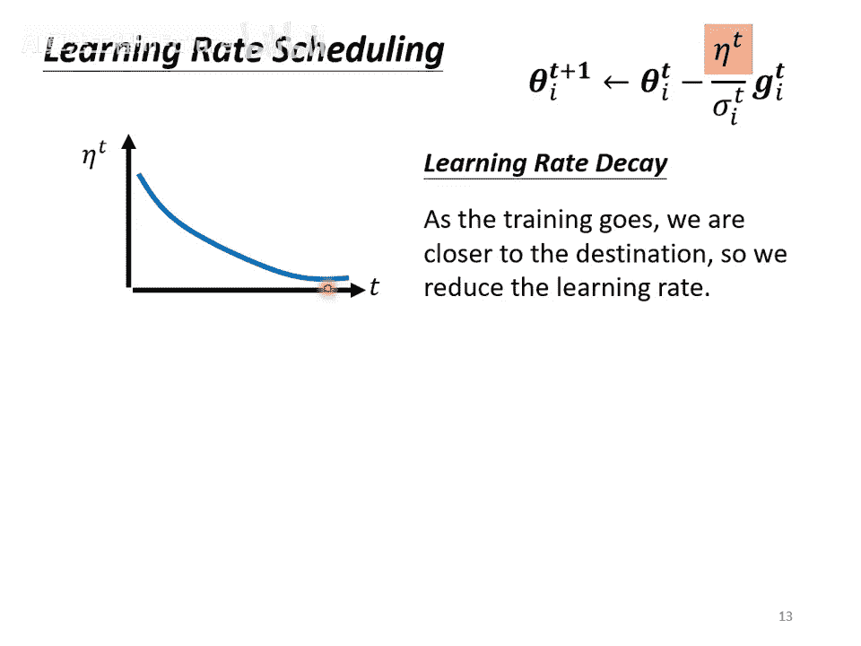

解决这个问题的方法是引入 **学习率调度（Learning Rate Scheduling）**，即让全局学习率 (\eta) 也随时间变化。

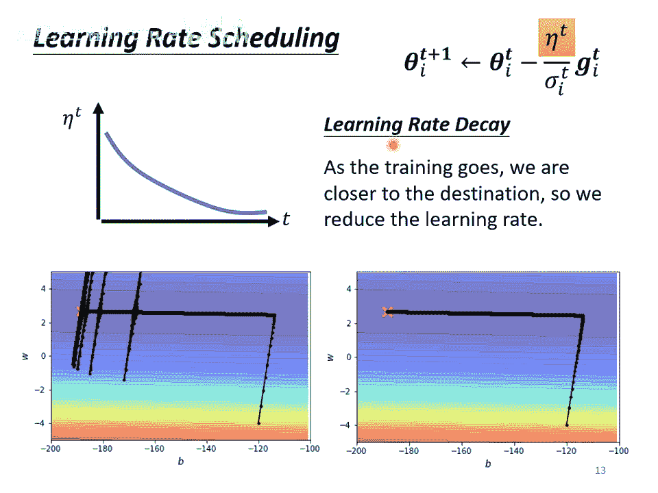

### 学习率衰减

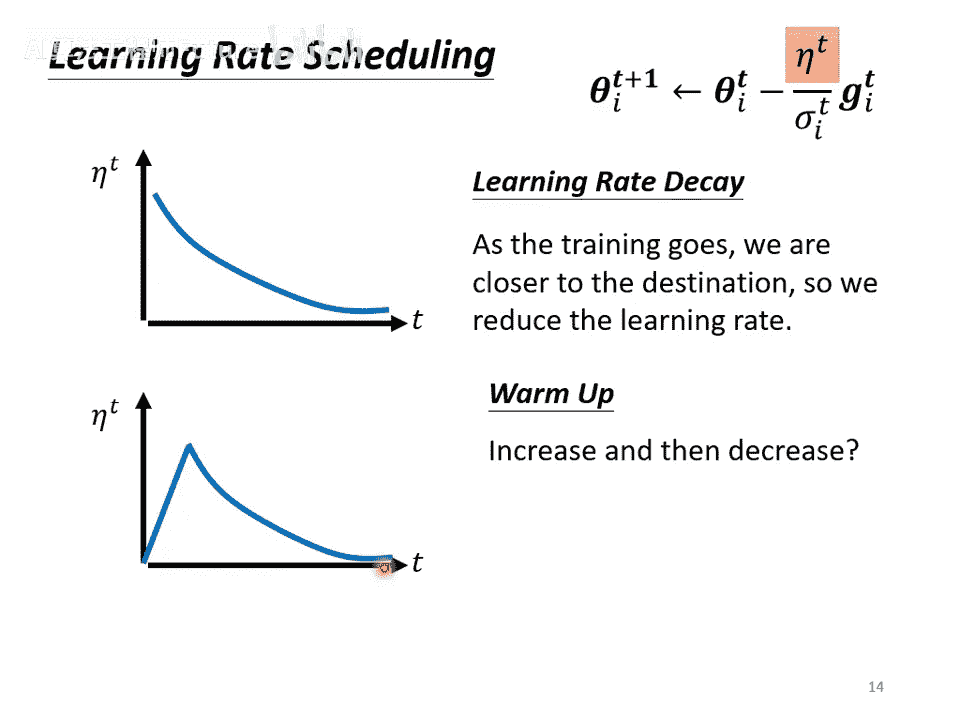

最常见的策略是 **学习率衰减**。随着训练进行，逐步减小 (\eta)。这是合理的，因为训练初期距离最优解远，需要较大步伐；后期接近最优解，需要小步伐精细调整。加入学习率衰减后，可以平顺地走到最优点，避免后期因学习率过大而产生的震荡。

### 预热

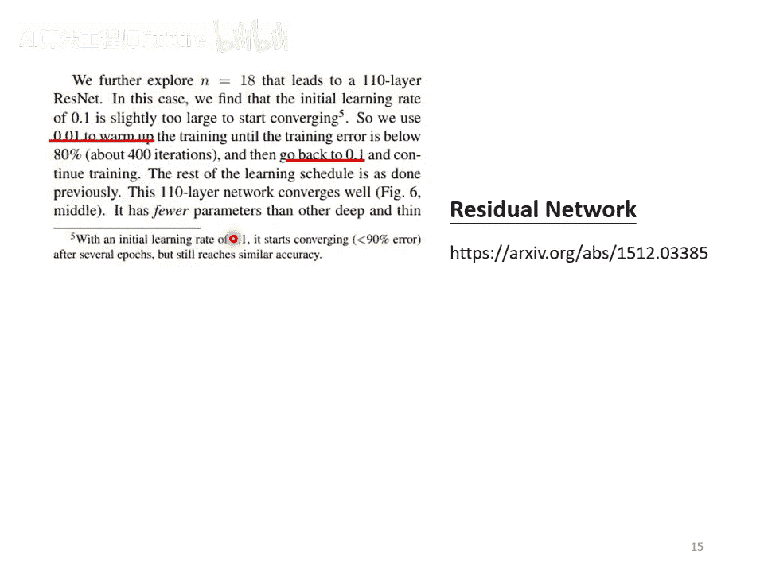

另一个重要策略是 **预热**。这种方法听起来有违直觉：**让学习率先增大，后减小**。

预热是一种经验性的黑科技，出现在许多重要模型中，例如：

- **ResNet**：论文中指出，一开始使用学习率 0.01 训练，然后切换到 0.1 效果更好，直接使用 0.1 则训练不好。
- **Transformer**：其论文中给出了一个复杂的学习率变化公式，绘制出来就是先增后减的曲线。

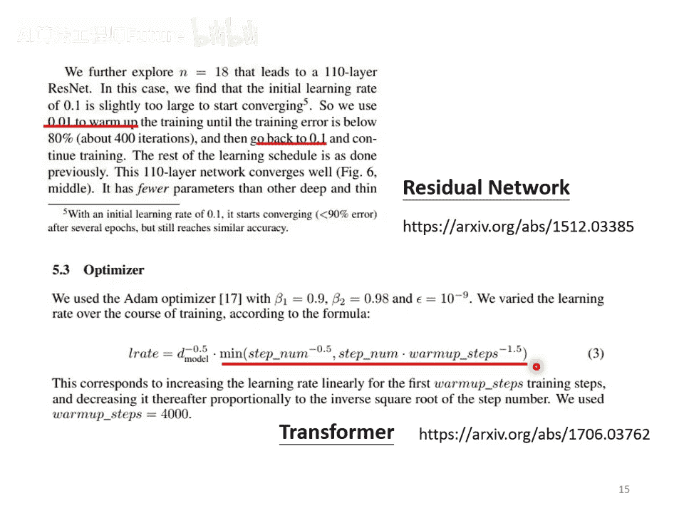

**为什么需要预热？** 一个可能的解释是：在计算自适应学习率中的 (\sigma) 时，它是一个统计量，需要足够的数据才能估计准确。训练初期，(\sigma) 的估计不准确。因此，先使用较小的学习率，让参数在初始点附近“探索”，收集误差曲面的信息，等 (\sigma) 的统计相对准确后，再提高学习率。这有助于训练的稳定性。

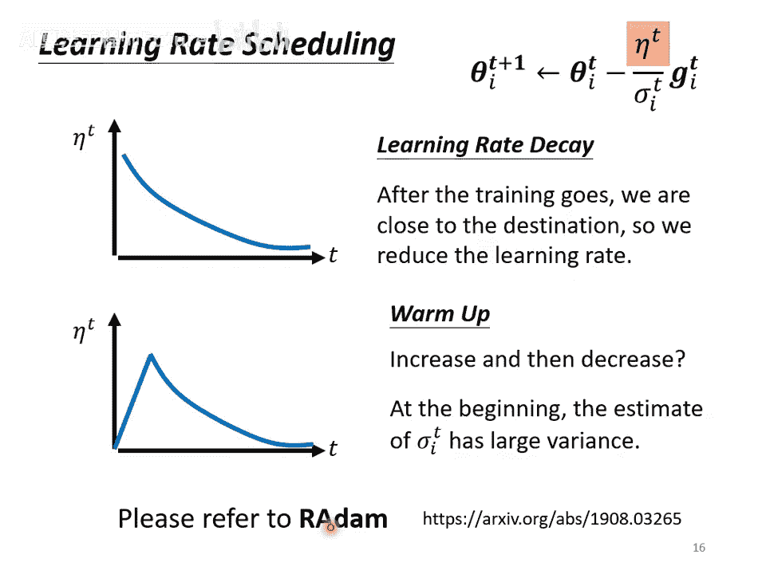

## 总结与完整优化框架

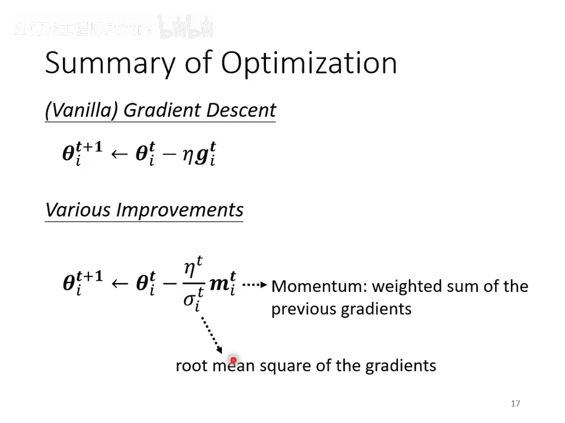

本节课我们一起学习了如何通过自适应学习率来改进梯度下降法。

完整的现代优化器通常包含以下组件：

1. **动量**：更新方向融合历史梯度信息，公式中包含历史梯度的移动平均。
2. **自适应学习率**：为每个参数除以一个与其历史梯度大小相关的项 (\sigma)（如 RMSProp 的计算方式）。
3. **学习率调度**：全局学习率 (\eta) 随时间变化，如衰减或预热。

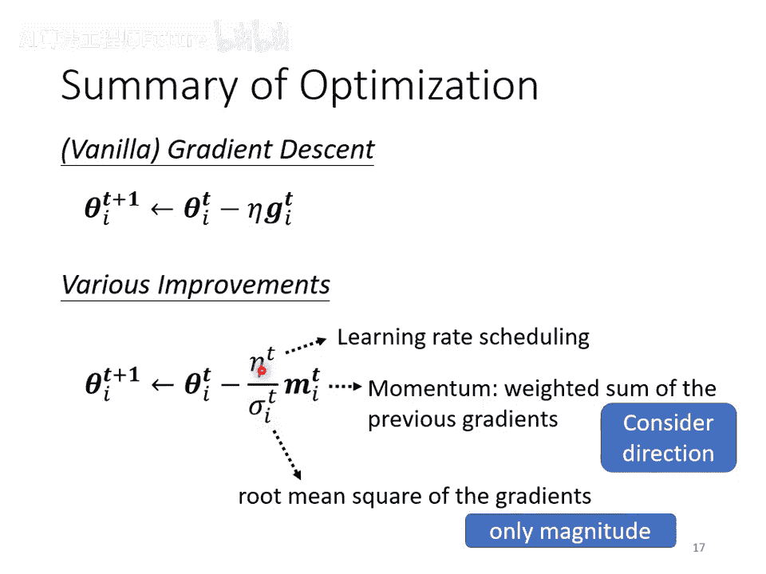

注意，动量（考虑梯度的方向）和 (\sigma)（只考虑梯度的大小）并不冲突，它们从不同角度利用历史梯度信息，不会相互抵消。

Adam 优化器是上述思想的集大成者，也是目前最常用的选择。除此之外，还有各种变形，主要区别在于计算动量、(\sigma) 或调度学习率的方式不同。

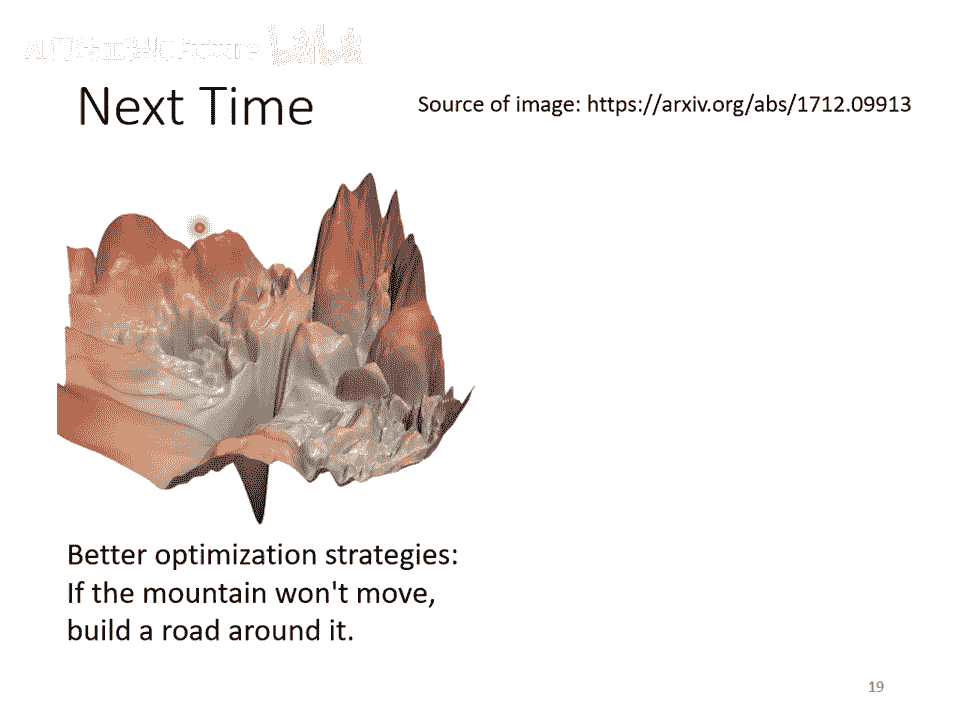

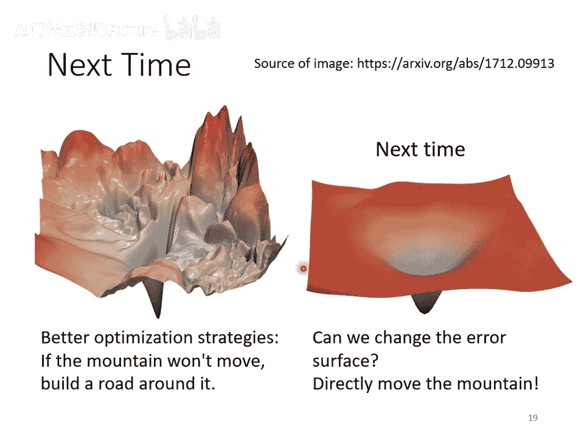

优化技术帮助我们“绕过”误差曲面上的高山。在接下来的课程中，我们将学习另一种思路：**直接“铲平”误差曲面**，即通过改进网络架构、激活函数等，使误差曲面本身更容易优化，让训练更加顺畅。
