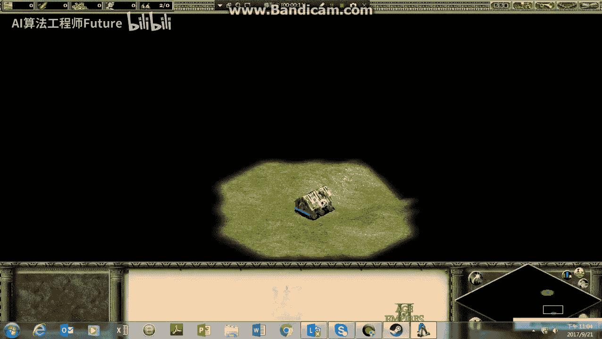
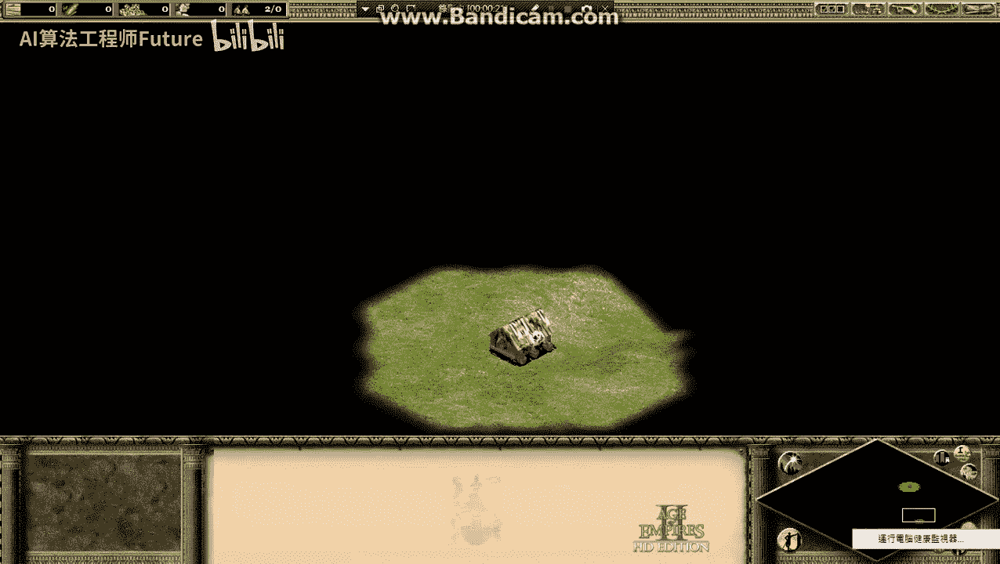
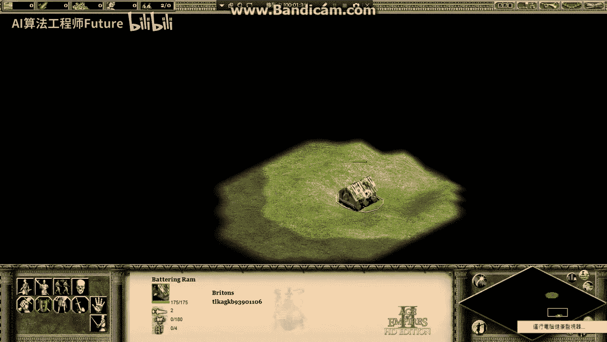
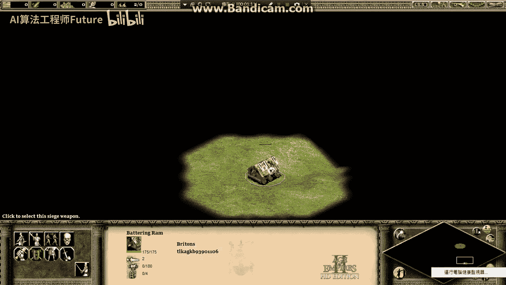
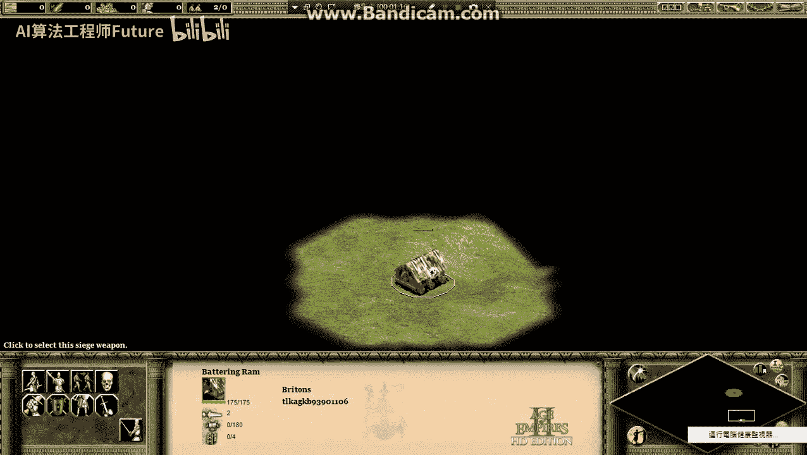
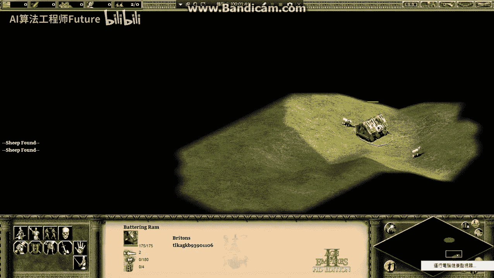
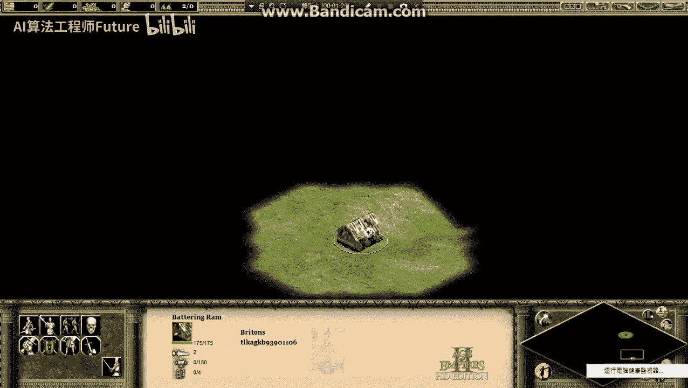
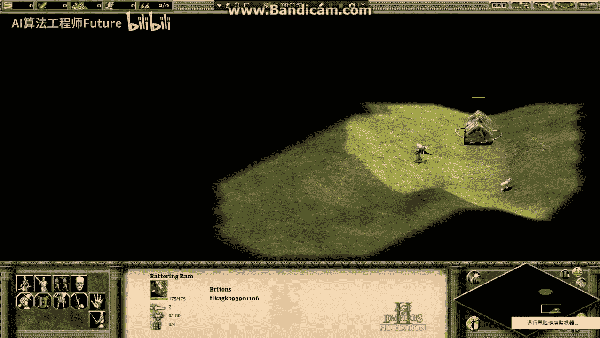
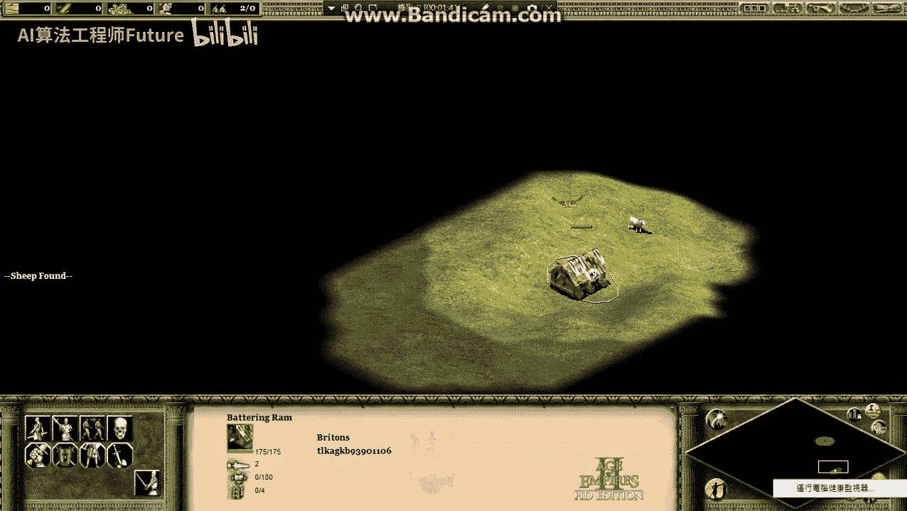

# 19：梯度下降法（Gradient Descent）核心概念与直观理解 🧭

在本节课中，我们将学习机器学习中一个至关重要的优化算法——梯度下降法。我们将通过一个生动的比喻来理解它的工作原理、步骤以及其固有的局限性。

上一节我们介绍了优化模型参数的基本目标，本节中我们来看看如何通过梯度下降法来具体实现这个目标。

## 梯度下降的直观比喻：探索未知地图 🗺️

进行梯度下降的过程，可以想象成在玩一款类似《世纪帝国》的游戏。在这个游戏中，你操控一个单位在一片被战争迷雾覆盖的地图上进行探索。地图上大多数区域都是黑暗的、不可见的，只有你的单位实际走过的地方，你才能知道那里的地形。

现在，我们将这个游戏场景与梯度下降联系起来：

- 这张地图的海拔高度，就对应着我们模型的**损失函数（Loss Function）**的值。
- 我们的目标是找到地图上**海拔最低的点**，即损失函数的最小值。
- 我们操控的这个单位（比如一辆冲撞车），它所处的位置就代表了模型的**一组参数**。

我们的任务就是使用梯度下降法，通过移动这个单位（调整参数），来找到损失最低的地方（海拔最低点）。

## 梯度下降法的执行步骤 📝

以下是使用梯度下降方法探索“地图”的具体步骤：

首先，我们需要随机选择一个起始点。这就像在游戏开始时，你的单位被随机放置在地图的某个位置。

现在，我们位于初始位置。

接着，观察单位周围一小片区域（即计算当前位置的梯度），判断哪个方向是“下坡”的，即损失函数值下降最快的方向。

我们发现某个方向的海拔更低。

然后，沿着这个“下坡”方向移动一小步。这一步的大小由一个称为**学习率（Learning Rate）** 的超参数控制。

我们移动到了新的位置。

到达新位置后，重复上述过程：再次观察周围，找到新的“下坡”方向，并继续移动。

我们持续探索，不断向更低处前进。

最终，当我们环顾四周，发现所有方向都是“上坡”时，我们就停止移动。这个点被称为**局部最小值（Local Minimum）**。

我们找到了一个局部最低点。

## 核心概念与局限性 ⚠️

我们找到的局部最小值，是否就是整个地图上最低的**全局最小值（Global Minimum）**呢？答案是：我们永远无法仅通过这种局部探索来确知。

这就好比在游戏中，除非你使用“开天眼”的秘籍（例如 `MARCO`）来消除所有战争迷雾，否则你永远无法知道你所在的局部低谷是否是全世界最深的那一个。梯度下降法是一种**局部优化**方法，它只能保证找到当前位置附近的一个低点，而不能保证找到全局最优解。

这个过程可以用以下公式来描述。假设我们的参数为 **θ**，损失函数为 **L(θ)**，学习率为 **η**，那么梯度下降的更新规则是：

**θ_new = θ_old - η * ∇L(θ_old)**

其中 **∇L(θ_old)** 代表损失函数在 **θ_old** 处的梯度（即最陡的下降方向）。

---

本节课中我们一起学习了梯度下降法的基本思想。我们通过“探索未知地图”的比喻，理解了该算法从随机初始化开始，通过反复计算梯度并向负梯度方向更新参数，最终寻找损失函数局部最小值的过程。同时，我们也认识到了梯度下降法的主要局限性：它可能收敛于局部最优解而非全局最优解。在后续课程中，我们将学习如何改进基础的梯度下降法以应对这一挑战。
