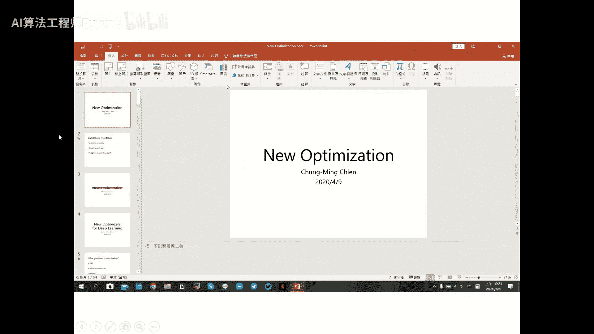
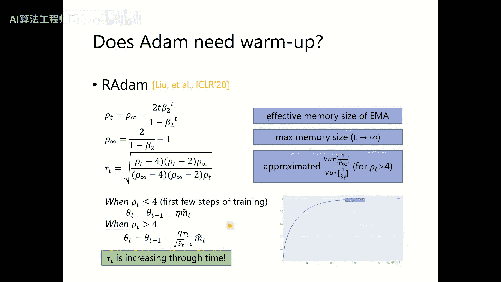
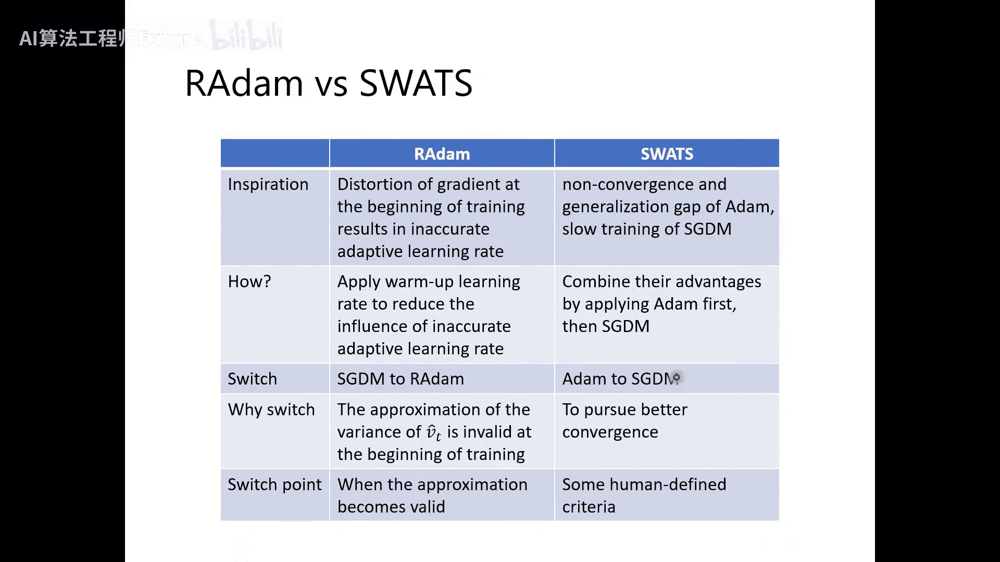
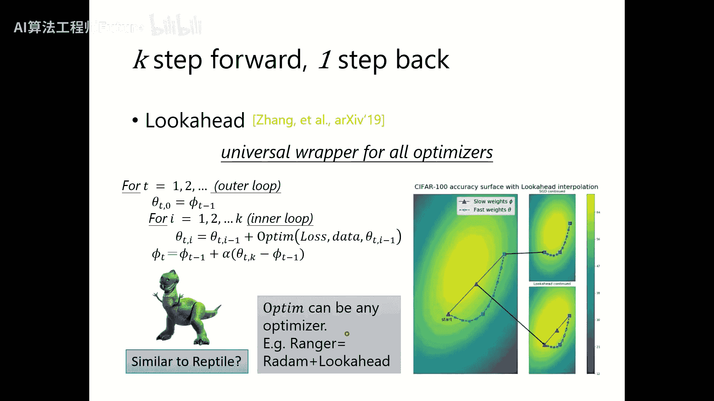
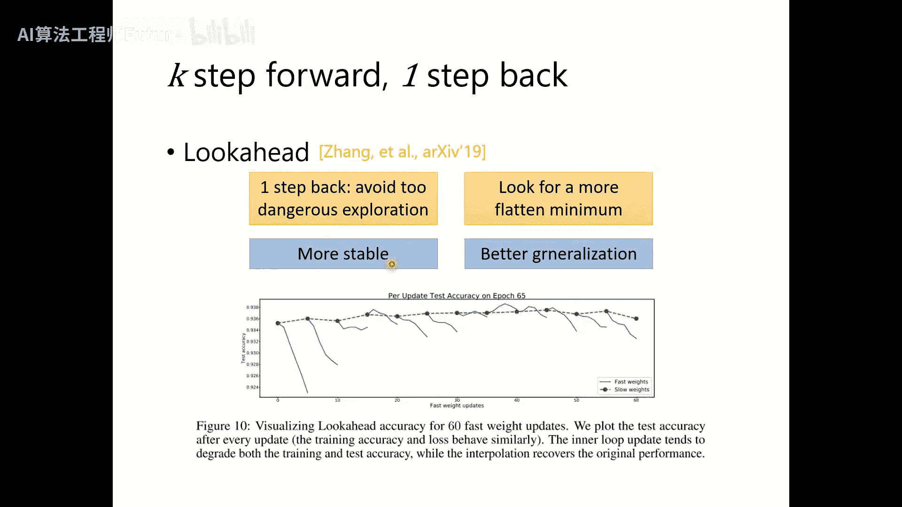
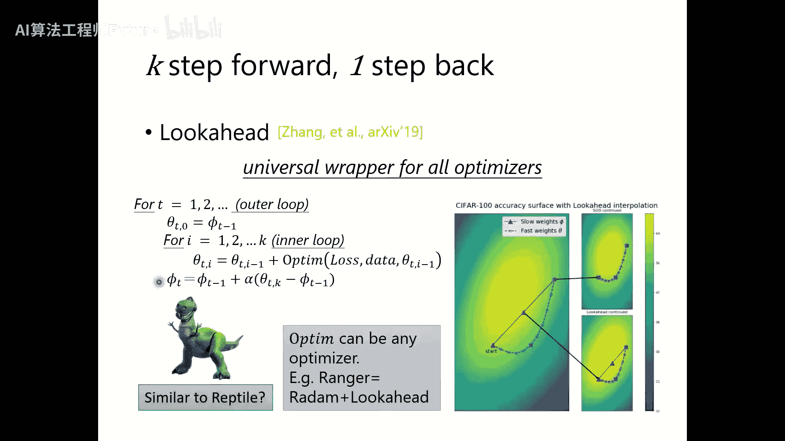
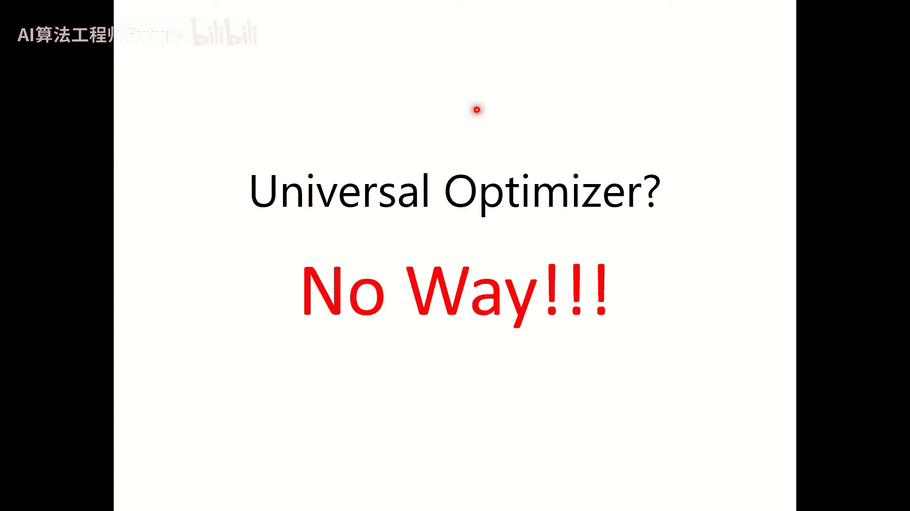
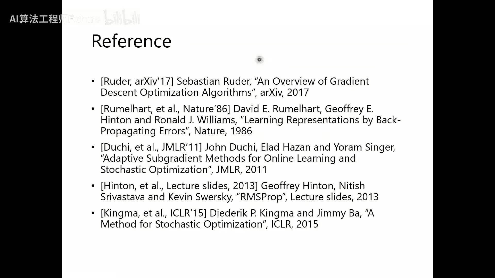
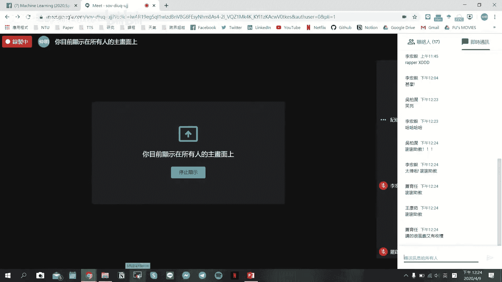
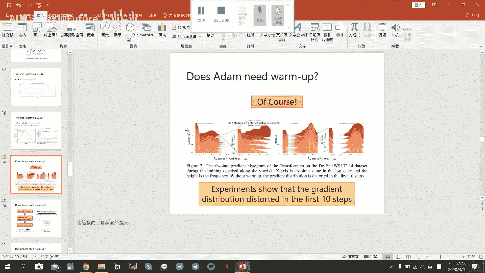

# 22：深度学习优化器进阶（二）🚀





在本节课中，我们将继续深入学习深度学习中新的优化器。我们将探讨如何改进经典的 SGD 和 Adam 算法，分析它们各自的优缺点，并介绍一些旨在结合两者优势或解决特定问题的高级优化技术。

---

## 回顾与问题引入

上一节我们介绍了 SGD with Momentum 和 Adam 这两种最常用的优化算法。SGD 通常更稳定，收敛结果较好；而 Adam 计算速度更快。本节中，我们来看看如何改进这些算法，让它们互相学习对方的优点。

针对 Adam 的改进算法，如 **AdaBound** 和 **AMSGrad**，旨在解决其自适应学习率可能过大或过小的问题，以提升训练后期的稳定性。

针对 SGD with Momentum 的改进，如 **Cyclical LR** 和 **One Cycle LR**，则希望通过人工设定的方式动态调整学习率，使其收敛更快。

---

## Adam 也需要 Warm-up 吗？🔥

One Cycle LR 策略包含三个阶段：Warm-up、主训练和 Fine-tuning。那么，Adam 优化器也需要这样的 Warm-up 阶段吗？结论是肯定的。



虽然 Adam 本身具有自适应学习率，但在训练初期，梯度的分布可能非常混乱，同时分母中对梯度平方的指数移动平均（EMA）估计也不准确。这会导致更新步长不稳定，时而过大，时而过小。

以下是 Adam 更新公式的核心部分，我们关注其自适应梯度估计 `v_t`：

```python
# Adam 更新规则（简化）
m_t = β1 * m_{t-1} + (1 - β1) * g_t
v_t = β2 * v_{t-1} + (1 - β2) * (g_t ** 2)
θ_t = θ_{t-1} - η * m_t / (sqrt(v_t) + ε)
```

在训练初期，`v_t` 的估计不准确，导致 `η / sqrt(v_t)` 不稳定。

因此，在训练初期采用较小的学习率（Warm-up），可以让梯度估计和参数更新更加稳定，避免“暴走”。工程上常见的做法是设定一个学习率曲线，例如先线性增加，再缓慢衰减。



---

## RAdam：带有理论依据的 Warm-up

有研究者提出了 **RAdam** 优化器，它为 Adam 的 Warm-up 阶段提供了更理论化的解释。

RAdam 的核心思想是：在训练初期，自适应学习率分母 `v_t` 的方差很大。我们应在其方差较大时使用较小的学习率，方差较小时使用较大的学习率。

作者定义了一个修正项 `R(t)`，用于近似 `v_t` 方差的倒数。当 `R(t)` 较小时，说明方差大，应减小学习率。具体实现时，在训练初期（当有效记忆长度 `ρ_t` 小于 4 时），RAdam 退化为使用 SGD with Momentum；当 `ρ_t` 大于 4 后，再切换到带有修正项 `R(t)` 的 Adam 更新规则。



这本质上是一种自动化的 Warm-up 策略。

---





## 对比：RAdam vs. SWATS

RAdam 和 SWATS 都涉及在 SGD 和 Adam 之间切换，但目的不同：

- **RAdam**：切换是因为在训练初期，其理论修正项 `R(t)` 无法有效计算，因此暂时使用更稳定的 SGDM。这是一个**折中方案**。
- **SWATS**：切换是因为认为 Adam 收敛快但可能不精确，而 SGD 能收敛到更好的极小值。后期切换是为了追求**更好的收敛结果**。

---

## Lookahead：前瞻性优化器包装器🔮

**Lookahead** 不是一个独立的优化器，而是一个可以包装在任何优化器（如 SGD、Adam）之上的“包装器”。

其核心思想是 **“K 步向前，1 步后退”**。它维护两组参数：

- **快速权重**：用于探索，由内层优化器（如 Adam）更新 K 步。
- **慢速权重**：模型最终参数，更稳定。

内层循环结束后，慢速权重会向快速权重取得的新位置“看齐”一步，但不是完全替换，而是在两者之间进行插值：  

`slow_weight = slow_weight + α * (fast_weight - slow_weight)`

这样做的好处是，即使快速权重探索到了某个尖锐的峡谷（可能泛化性差），慢速权重的“拉回”操作也能使其保持在更平坦的区域，有利于提升模型的泛化能力。

---

## NAG 与 Nadam：超前部署的动量

**Nesterov Accelerated Gradient** 是对 SGDM 的一个改进，它试图实现“超前部署”。

标准 SGDM 的更新是：  

`θ_t = θ_{t-1} - η * m_t`  

`m_t = β * m_{t-1} + g_t`

而 NAG 的更新可以理解为：  

`θ_t = θ_{t-1} - η * [β * m_t + g(θ_{t-1} - β * η * m_{t-1})]`

区别在于，NAG 计算梯度时，不是在当前参数 `θ_{t-1}` 处，而是在一个“前瞻”的位置 `θ_{t-1} - β * η * m_{t-1}`（即按照之前动量方向先“看”一步的地方）。这使其能对未来的梯度变化做出更快的反应。

将 NAG 的思想应用到 Adam 上，就得到了 **Nadam**。它主要修改了 Adam 中动量项 `m_t` 的计算方式，使其也具备“前瞻性”。

---

## AdamW：权重衰减的正确打开方式⚖️

在深度学习训练中，我们常使用 L2 正则化（权重衰减）来防止过拟合。传统实现将权重衰减项直接加到损失函数中，其梯度会参与优化器自适应学习率（如 Adam 的 `m_t` 和 `v_t`）的计算。

2017年的一篇论文指出，这可能导致问题。作者提出了 **AdamW**，将权重衰减与自适应学习率计算**解耦**。

具体做法是：

- 计算 `m_t` 和 `v_t` 时，**只使用原始损失函数的梯度**，不包括权重衰减项。
- 在参数更新时，**额外**减去一个权重衰减项 `λ * θ_{t-1}`。

```python
# AdamW 更新规则（概念）
m_t = β1 * m_{t-1} + (1 - β1) * g_t(θ)  # g_t 不含权重衰减梯度
v_t = β2 * v_{t-1} + (1 - β2) * (g_t(θ) ** 2)
θ_t = θ_{t-1} - η * (m_t / (sqrt(v_t) + ε) + λ * θ_{t-1}) # 额外加衰减
```

这种方式被证明在许多任务上效果更好。例如，著名的 NLP 模型 BERT 在 PyTorch 版本中就是使用 AdamW 进行训练的。

---

## 其他实用训练技巧

除了优化器本身，还有一些技巧能帮助优化过程：

- **增加随机性**：如 Data Shuffling、Dropout、为梯度添加噪声（Gradient Noise），这些都能鼓励模型进行更多探索。
- **课程学习**：先使用简单样本训练，再逐渐使用困难样本，有助于模型找到更优的泛化区域。
- **微调**：使用在大数据集上预训练好的模型作为起点，可以节省大量计算资源，并通常能获得更好的性能。

这些技巧的核心思想是：**对模型要有耐心**，循序渐进。

---

## 总结与选型建议

本节课我们一起学习了多种高级优化器及其思想：

1. **SGD 系列**：SGD、SGDM，通常更稳定，收敛性好，但可能较慢。
2. **Adam 系列**：Adam、AMSGrad、AdaBound，通常更快，但可能不稳定，泛化差距可能较大。
3. **结合与改进**：
  
  **SWATS**：后期从 Adam 切换为 SGD，以求更好收敛。
  **RAdam**：为 Adam 引入理论化的 Warm-up。
  **Nadam**：将 NAG 的前瞻思想融入 Adam。
  **AdamW**：修正了 Adam 中权重衰减的实现方式，实践中最常用。
  **Lookahead**：通用包装器，可提升稳定性与泛化性。






**实践建议**：

- **计算机视觉**：通常使用 SGDM 或 AdamW。
- **自然语言处理**：大多使用 AdamW。
- **语音生成、强化学习**：常用 Adam/AdamW。






**重要提示**：不存在“万能”优化器。如果模型训练失败，首要原因通常是数据、模型架构或训练流程问题，而非优化器选择。优化器通常是在模型能训练的基础上，进行“锦上添花”的改进。因此，理解原理并根据任务特点进行选择和调试是关键。
