# 23：作业二说明 📚

在本节课中，我们将学习作业二的具体内容、数据格式以及提交要求。本次作业的核心任务是音素分类。

## 概述

本次作业的任务是音素分类。该任务的目标是将语音音频片段标注为对应的音素。作业主要分为两部分：数据预处理和分类模型构建。数据预处理部分已由我们完成，你们需要专注于使用PyTorch构建分类模型。

## 音素分类任务详解

上一节我们介绍了作业的整体目标，本节中我们来看看任务的具体细节。

音素分类，即Phoneme Classification，其目标是为语音片段标注音标。例如，对于单词“machine”，我们可以将其声音切分为多个片段，并为每个片段识别出其对应的音素，如 /m/, /ə/, /ʃ/, /iː/, /n/。

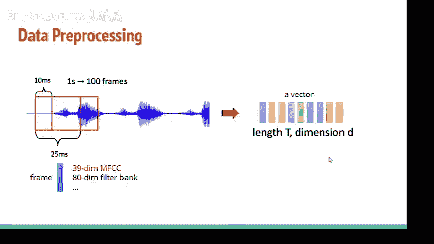

直接使用原始的波形数据进行分类非常困难，因为数据量庞大且格式不适合。因此，标准的处理流程是：

1. 将音频切分为帧。
2. 将每一帧转换为特征向量。

### 帧与特征提取

我们通常以25毫秒为一个窗口（或称为一帧）进行切分，然后每10毫秒滑动一次窗口以切分下一帧。这样相邻帧之间会有重叠，以确保不会遗漏重要的声音过渡部分。

切分后，我们需要将每一帧音频转换为更适合分类的特征。常用的特征是**MFCC**。

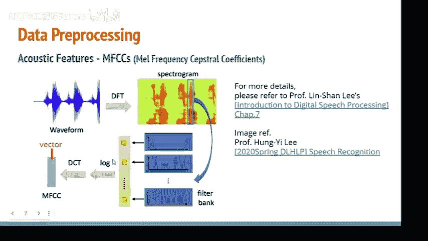

**MFCC** 是梅尔频率倒谱系数的缩写。其计算过程可以简化为以下步骤：

1. 对原始波形进行傅里叶变换，得到频谱图。
2. 通过一组梅尔滤波器组过滤频谱图，模拟人耳对不同频率的感知。
3. 对滤波后的结果进行进一步处理，最终得到39维的MFCC特征向量。

因此，最终用于分类的数据格式是：一个形状为 `(T, 39)` 的张量，其中 `T` 是帧的数量，`39` 是MFCC特征的维度。

### 上下文拼接

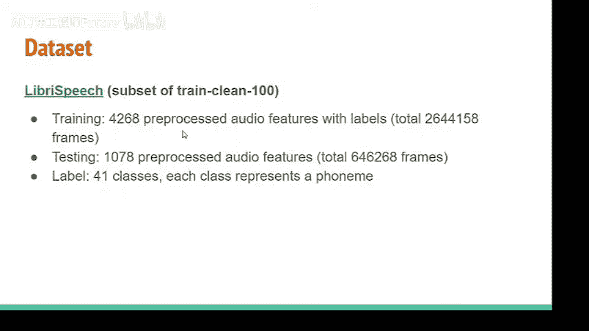

由于单个25毫秒的帧包含的信息有限，为了帮助模型更好地判断中间帧的音素，我们会使用上下文信息。具体做法是，对于目标帧，我们将其前后各5帧的特征向量拼接起来，形成一个更大的输入向量。

经过这种拼接操作后，输入模型的向量维度变为 `11 * 39 = 429` 维。模型将基于这429维的信息来判断中间帧的音素标签。

## 数据集说明

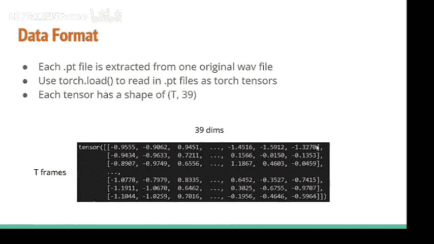


上一节我们了解了任务的处理流程，本节中我们来看看提供给你们的实际数据。

我们使用的是 **TIMIT** 数据集的一个子集。你们无需自行处理原始音频，我们已经完成了MFCC特征提取。

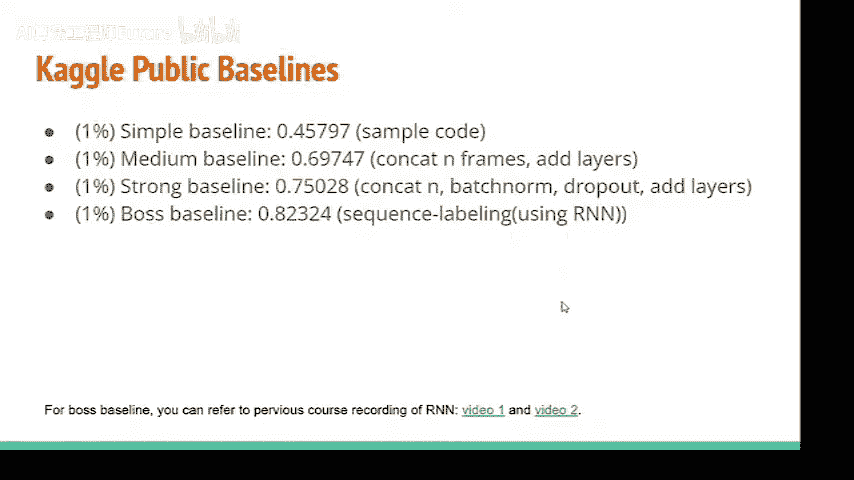

以下是数据集的目录结构：

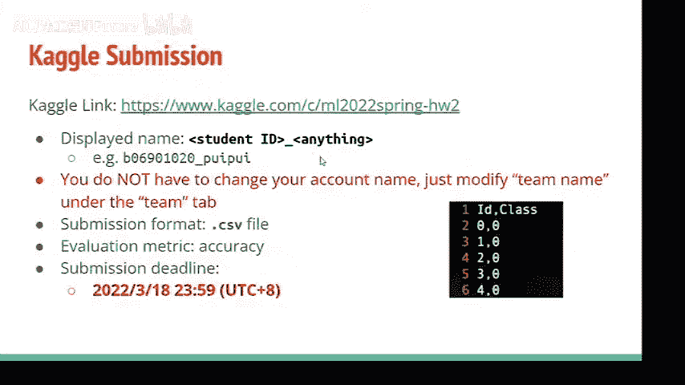

```
根目录/
├── train_split.txt    # 训练集元数据（文件名列表）
├── test_split.txt     # 测试集元数据（文件名列表）
├── train_labels.txt   # 训练集标签
└── features/          # 特征文件夹
    ├── xxx.pt
    ├── yyy.pt
    └── ...
```

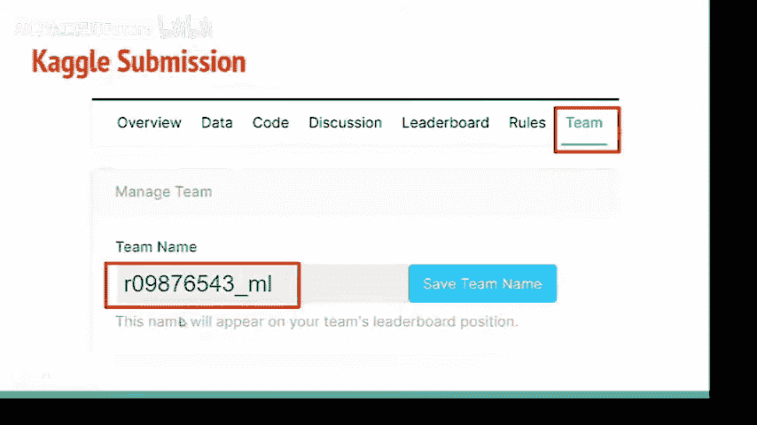

- `train_split.txt` 和 `test_split.txt` 指明了哪些文件属于训练集或测试集。
- `train_labels.txt` 包含了训练集中每个音频文件对应的所有音素标签序列。
- `features/` 文件夹中的 `.pt` 文件是使用PyTorch保存的张量。每个文件对应一个音频文件转换后的MFCC特征，形状为 `(T, 39)`。

你们可以使用以下代码轻松加载这些特征文件：

```python
import torch
feature_tensor = torch.load(‘features/xxx.pt’)
```

## 作业提交与评分

接下来，我们说明作业的提交方式和评分规则。

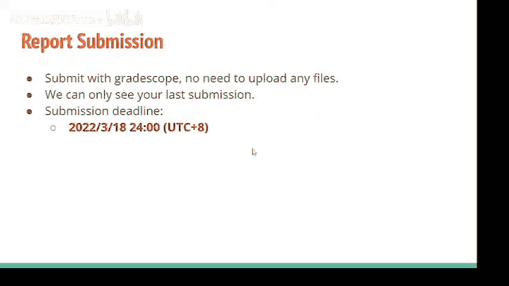

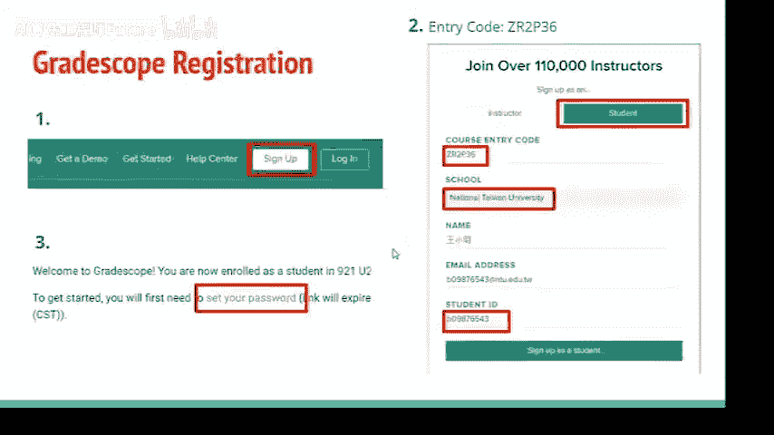

你们需要提交以下三个部分：

1. **代码与排行榜**：在CodaLab上提交代码，并参与排行榜排名。
2. **模型预测**：在NTU COOL上提交对测试集的预测结果。
3. **实验报告**：在Gradescope上提交报告，回答指定问题。

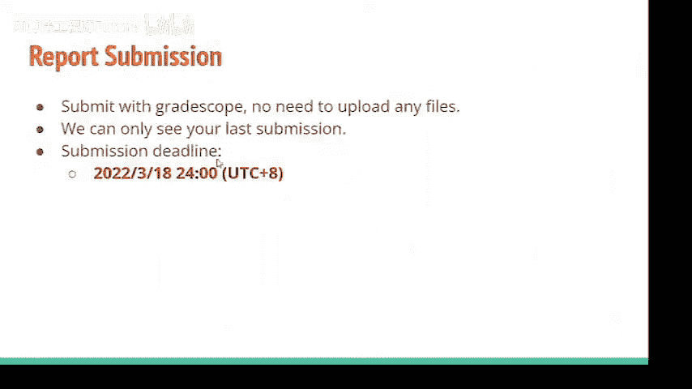

### 基线目标

我们设定了不同难度的基线目标供大家挑战：

- **简单基线**：使用提供的示例代码即可达到。
- **中等基线**：通过增加模型层数或每层的参数量来提升性能。
- **强基线**：尝试使用更高级的技巧，如更复杂的模型架构。
- **BOSS基线**：需要使用序列标注模型（如RNN）来完成任务，这超出了当前示例代码的范围。

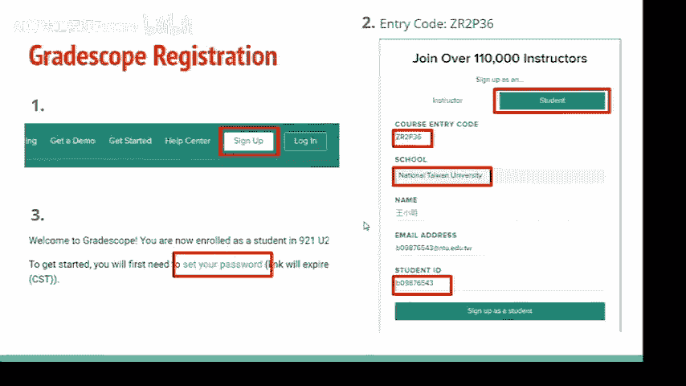

### 重要注意事项

以下是提交时需要特别注意的事项：

- **CodaLab团队名**：请在CodaLab中设置正确的团队名称，以便我们识别课程学生。
- **提交内容**：不要提交模型文件或数据集。
- **代码可复现性**：提交的代码必须能复现出提交的预测结果，否则可能被扣分。
- **截止日期**：作业截止日期为三个星期后的周五，3月18日晚上11:59。实验报告截止时间晚一分钟。

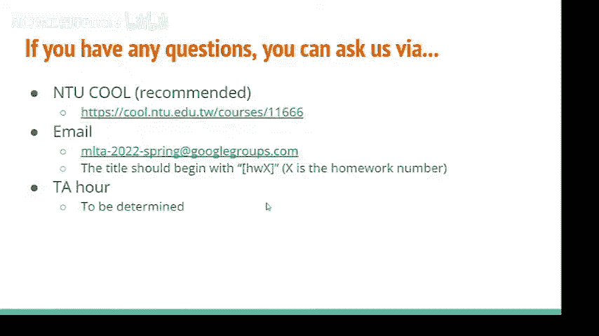

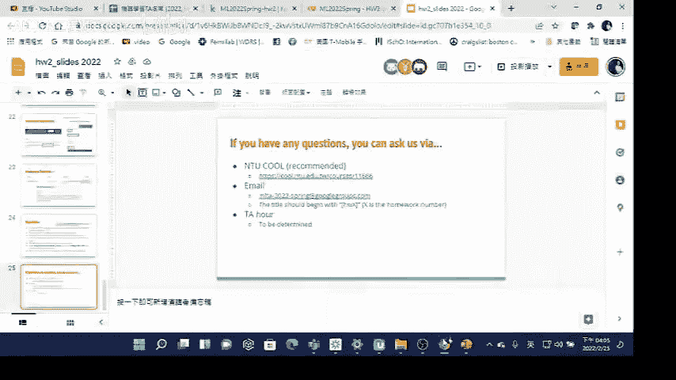

## 实验报告要求

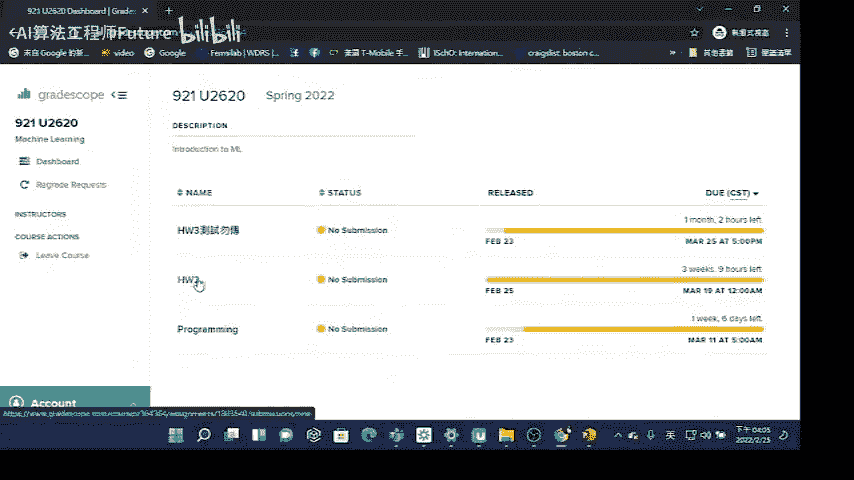

现在，我们详细说明实验报告部分的要求。报告通过Gradescope提交。

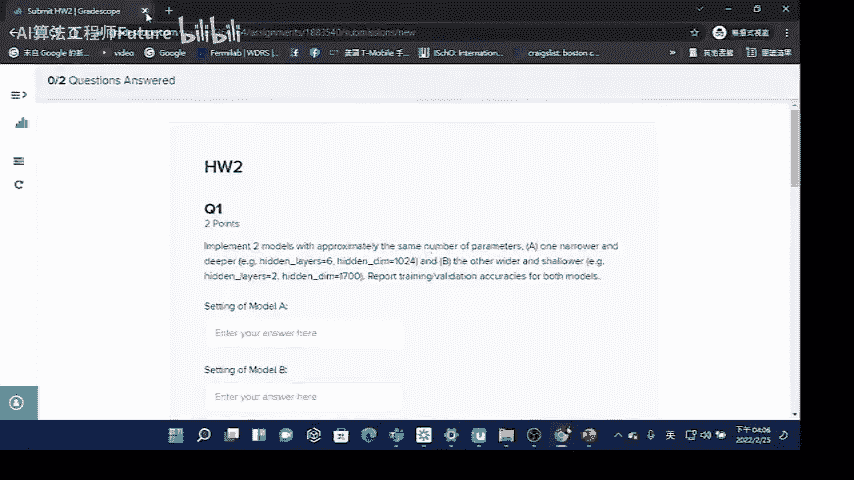

报告主要包含两个实验任务：

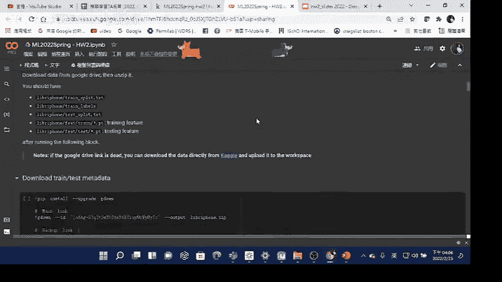

**实验一：模型深度与宽度的对比**  

我们希望你们尝试两个参数量相近但结构不同的模型：

- **较深较窄的模型**：例如6层，每层1024个神经元。
- **较浅较宽的模型**：例如2层，每层1700个神经元。  
  
  你们需要报告这两个模型在训练集和验证集上的准确率，并可以自行观察收敛速度、是否过拟合等现象。

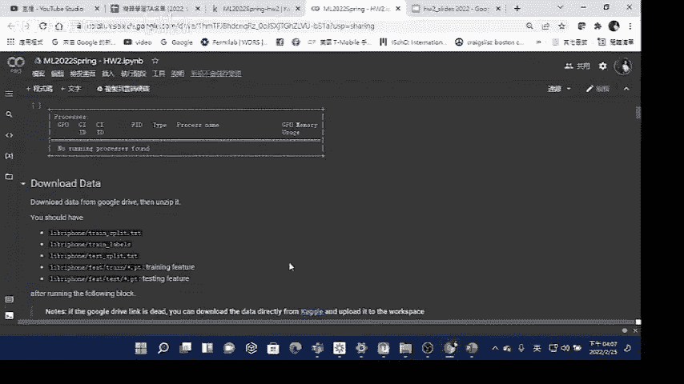

**实验二：Dropout效果探究**  

请在模型中添加Dropout层，并尝试不同的丢弃率（例如0.25， 0.5， 0.75）。  

报告不同丢弃率下模型的训练和验证准确率。

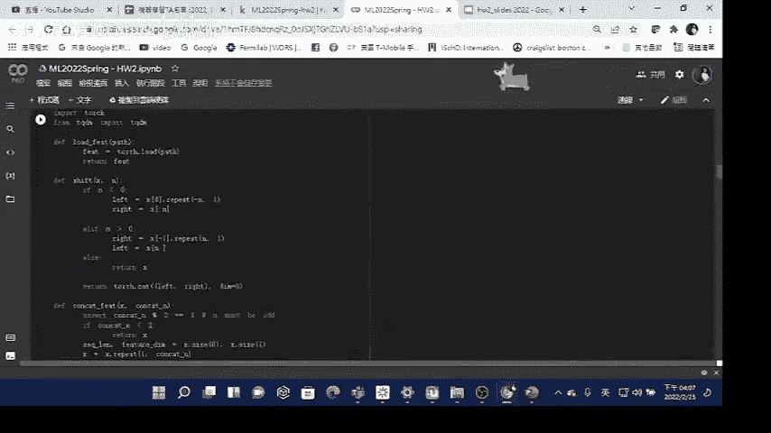

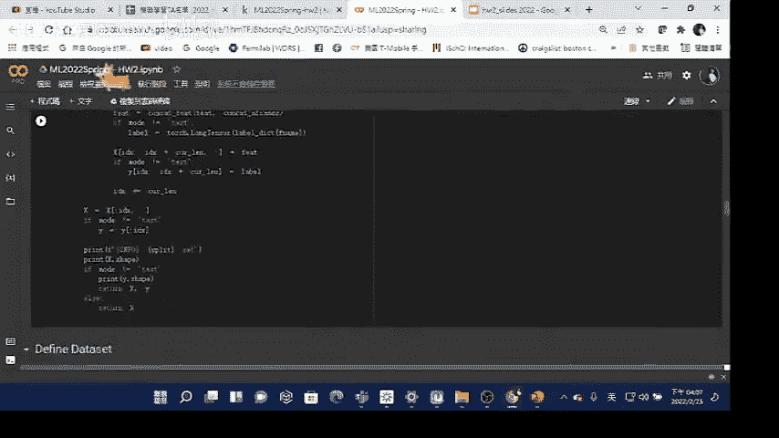

### Gradescope使用指南

以下是使用Gradescope提交报告的步骤：

1. 访问 `gradescope.com`。
2. 点击右上角“Sign in”，选择“Student”。
3. 在“Entry Code”处输入课程代码：`ZR2P36`。
4. 按要求填写学校、学号、姓名和邮箱。
5. 完成注册后，在课程列表中找到“Homework 2”并点击。
6. 在打开的页面中直接填写问题的答案，然后提交即可。无需额外生成PDF。

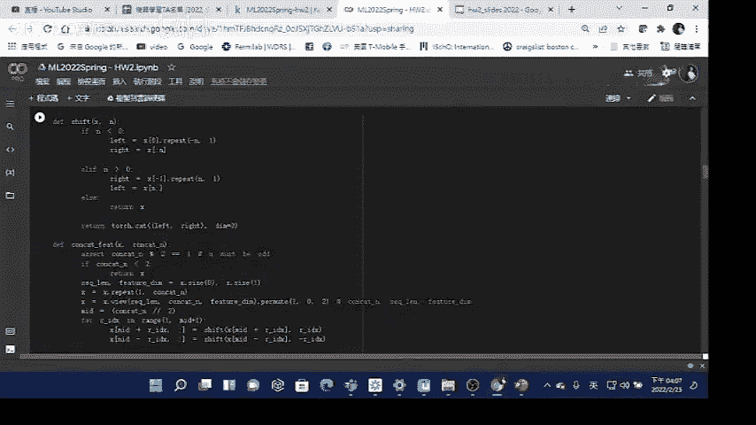

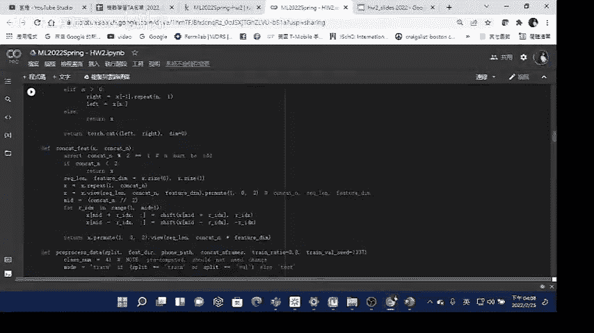

## 示例代码导读

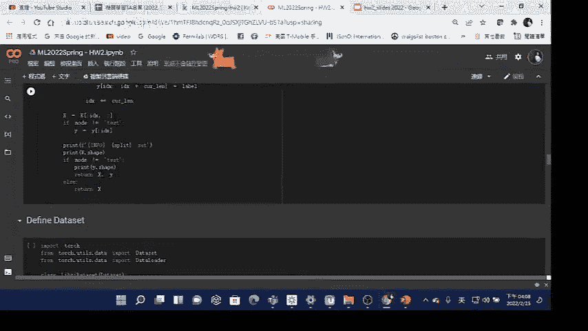

最后，我们简要浏览一下提供的示例代码，帮助大家上手。

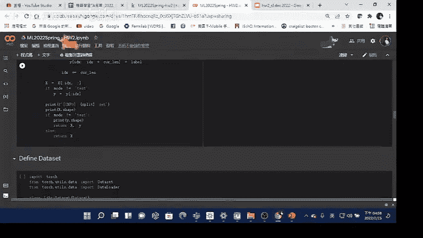

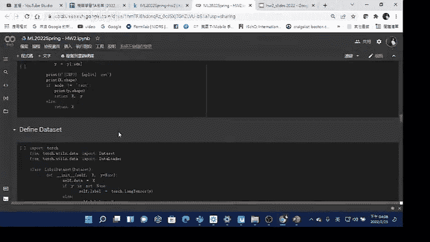

代码主要结构如下：

1. **数据加载**：读取 `train_split.txt`, `train_labels.txt` 和 `features/` 下的文件。
2. **数据预处理**：包含一个 `concat_feature` 函数，用于实现帧的上下文拼接。
  
  该函数接收一个特征张量 `(T, 39)` 和一个奇数 `N`（例如11，表示拼接前后各5帧）。
  它返回拼接后的新张量，形状为 `(T, 39*N)`。**请确保处理后帧的数量 `T` 没有错误减少。**
3. **数据集构建**：将处理后的所有帧特征和标签整合成最终的训练集 `(X, Y)`。
4. **模型定义**：一个简单的全连接神经网络。
5. **训练循环**：标准的PyTorch训练流程。

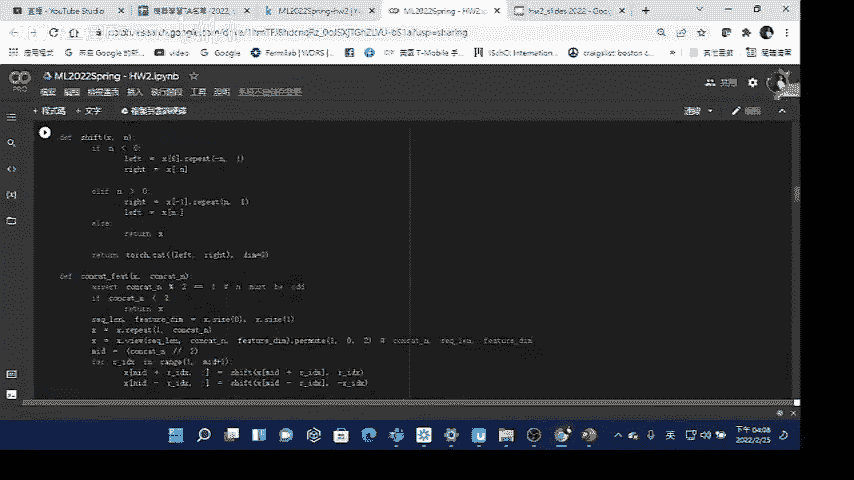

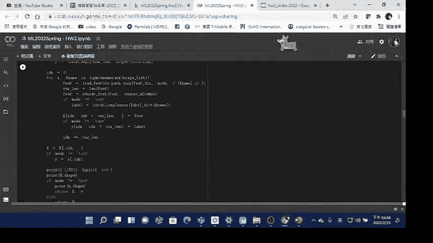

要改进模型，主要需要调整以下部分：

- `concat_feature` 函数中拼接的帧数 `N`。
- 模型架构的层数和每层的神经元数量。
- 训练超参数（学习率、迭代次数等）。

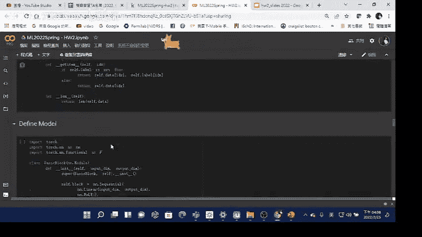

对于BOSS基线，你们需要重写数据集类和模型架构，使用RNN等序列模型进行处理。

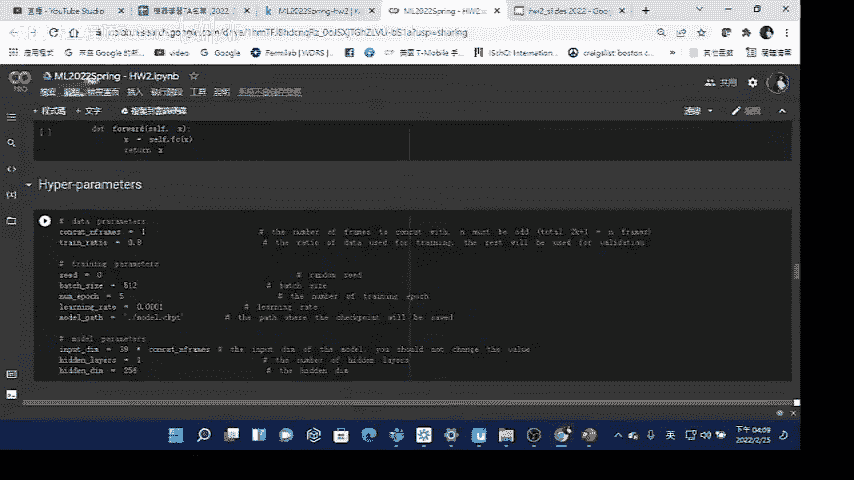

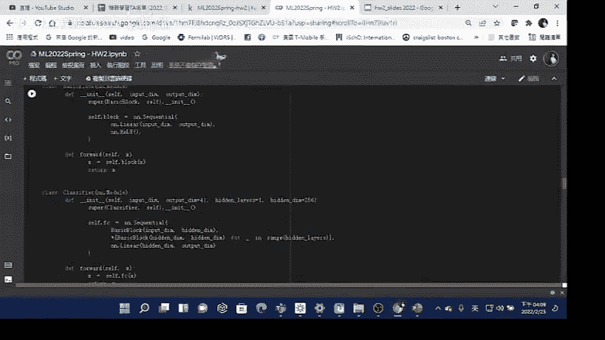

## 总结

本节课中我们一起学习了作业二：音素分类。  

我们了解了任务是将语音帧分类为音素，使用了MFCC特征和上下文拼接技术来处理数据。  

我们熟悉了TIMIT数据集子集的结构和加载方式。  

最后，我们明确了作业提交的三个部分（代码、预测、报告）、评分基线、以及通过Gradescope提交报告的具体流程和实验要求。  

请大家仔细阅读说明，并参考示例代码开始你们的实践。


