# 24：卷积神经网络（CNN）详解 🧠

在本节课中，我们将要学习卷积神经网络（CNN）的核心概念、设计原理及其在图像识别等任务中的应用。我们将从全连接网络的问题出发，逐步讲解CNN如何通过感受野和参数共享等机制进行优化，并最终理解其工作流程。

---

### 概述：从全连接网络到CNN

我们已经知道如何使用全连接网络进行分类任务。在图像分类中，输入是一张图片，输出是图片所属的类别。对于电脑而言，一张图片是一个三维的张量（Tensor），其维度分别代表宽度、高度和颜色通道数（例如RGB三通道）。为了将其输入网络，我们需要将这个三维张量拉直成一个巨大的向量。

**公式**：假设图片大小为 `100×100`，有3个颜色通道，则拉直后的向量长度为 `100 × 100 × 3 = 30000`。

如果第一层有1000个神经元，那么仅这一层就需要 `1000 × 30000 = 3×10^7` 个权重参数。参数过多会增加模型的灵活性，但也极大地提高了过拟合的风险。因此，我们需要根据图像本身的特性来设计更高效的网络架构。

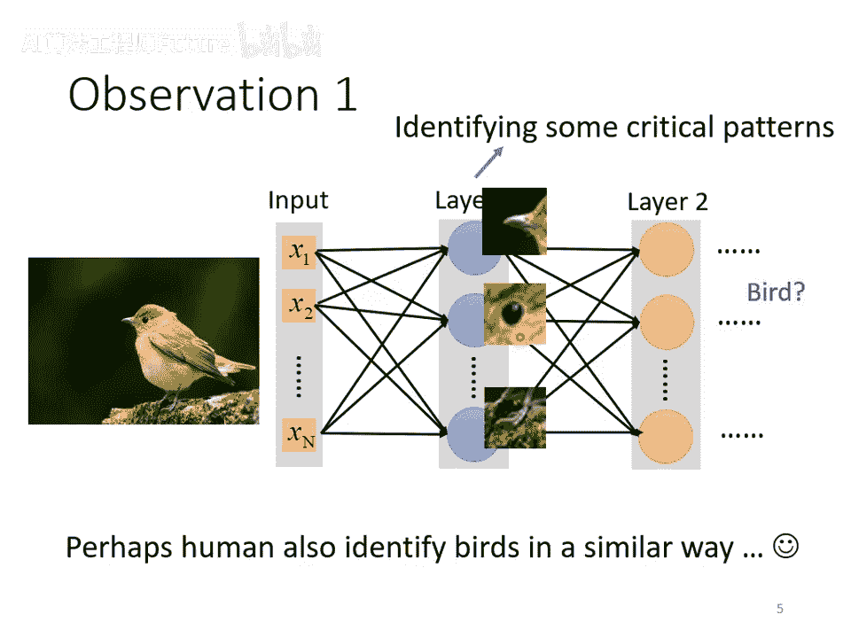

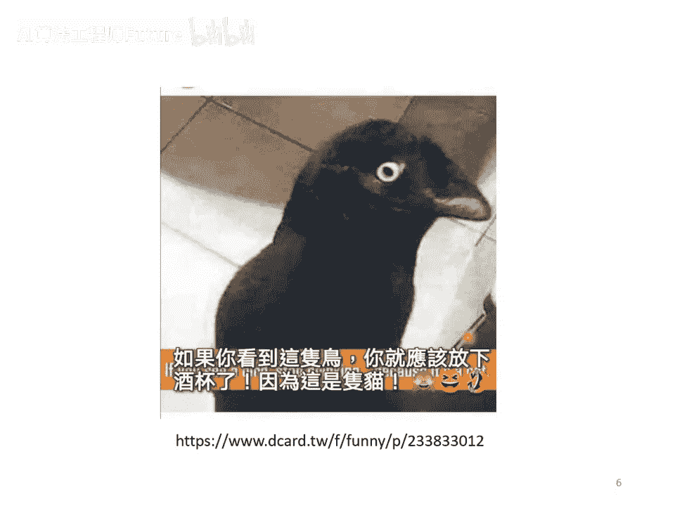

---

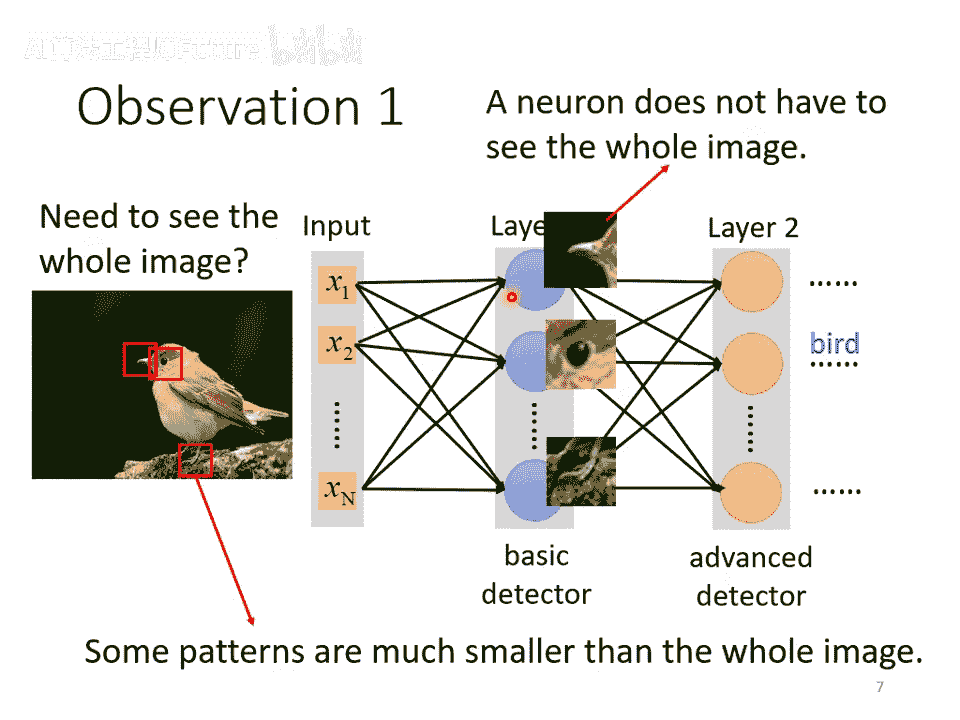

### 观察一：重要的模式通常只出现在局部区域

对于图像识别任务，神经网络需要检测图像中是否存在某些代表特定物体的关键模式。例如，判断图片中是否有鸟，可能需要检测鸟嘴、眼睛或鸟爪等模式。

关键之处在于，检测这些模式通常不需要看整张图片，只需要观察图片的一小部分区域就足够了。人类识别物体时也常常只关注局部特征。

根据这个观察，我们可以对网络进行第一个简化：**感受野**。

---

### 简化一：感受野

在CNN中，我们引入**感受野**的概念。每个神经元不再连接整个输入图像，而只关心一个小的局部区域，这个区域就是它的感受野。

- **感受野的定义**：感受野是每个神经元“查看”的输入图像上的一个小区域（例如一个 `3×3` 的方块）。神经元只处理该区域内的像素值。
- **感受野的运算**：神经元将其感受野内的所有数值（例如 `3×3×3=27` 个值）拉直成一个向量，作为自己的输入，并学习一组权重与之连接。
- **感受野的设计**：
  
  感受野可以重叠。
  同一个区域可以由多个不同的神经元负责侦测。
  感受野的大小和形状可以自定义（常见的是正方形的 `3×3` 或 `5×5`）。
  通常，感受野会覆盖所有颜色通道。

**常见的感受野设置**：

- **核尺寸**：感受野的高和宽合称为核尺寸。图像识别中常用 `3×3`。
- **步幅**：相邻感受野中心点移动的距离。通常设为1或2，以保证感受野之间有重叠，避免遗漏出现在边界上的模式。
- **填充**：当感受野移动到图像边界外时，对超出部分进行补值（常用补零）。

通过限制神经元只关注局部感受野，我们显著减少了第一层所需的参数量，同时也对网络的能力施加了约束。

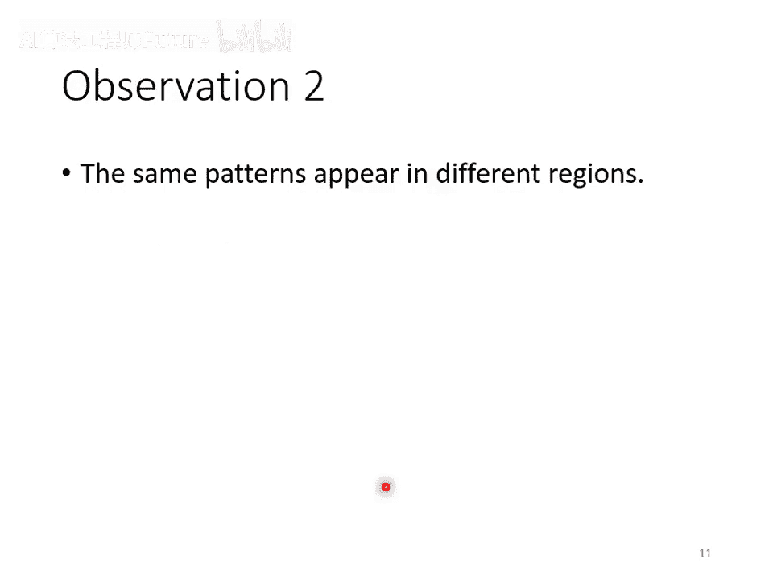

---

### 观察二：相同的模式可能出现在图像的不同位置

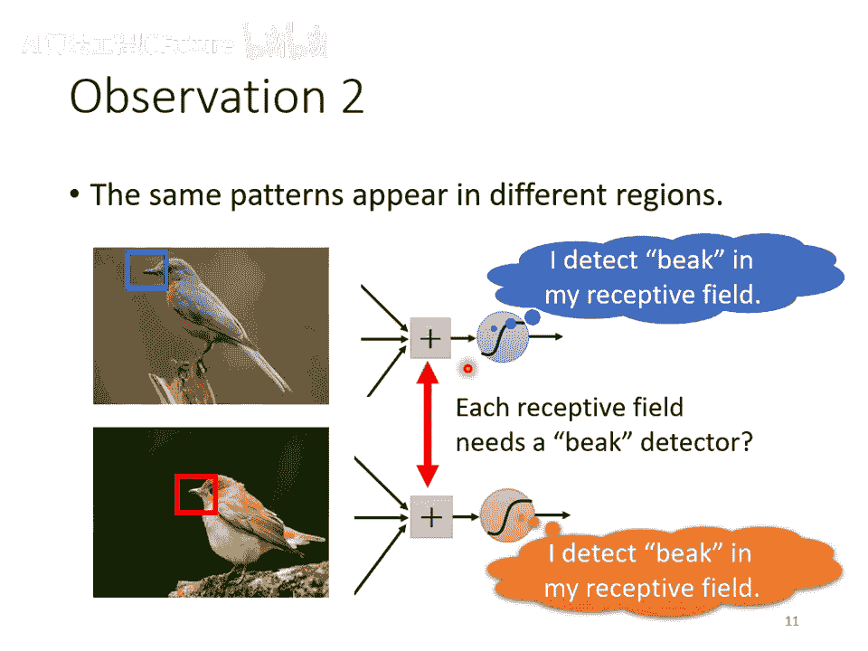

同一个模式（例如鸟嘴）可能出现在图像的左上角，也可能出现在右下角。按照感受野的设计，无论模式出现在哪里，总会有某个神经元的感受野覆盖到它。

但这里存在一个问题：侦测左上角鸟嘴的神经元和侦测右下角鸟嘴的神经元，它们的功能是完全相同的，只是负责的区域不同。如果每个位置都需要一个独立的神经元来侦测同一种模式，参数量依然很大。

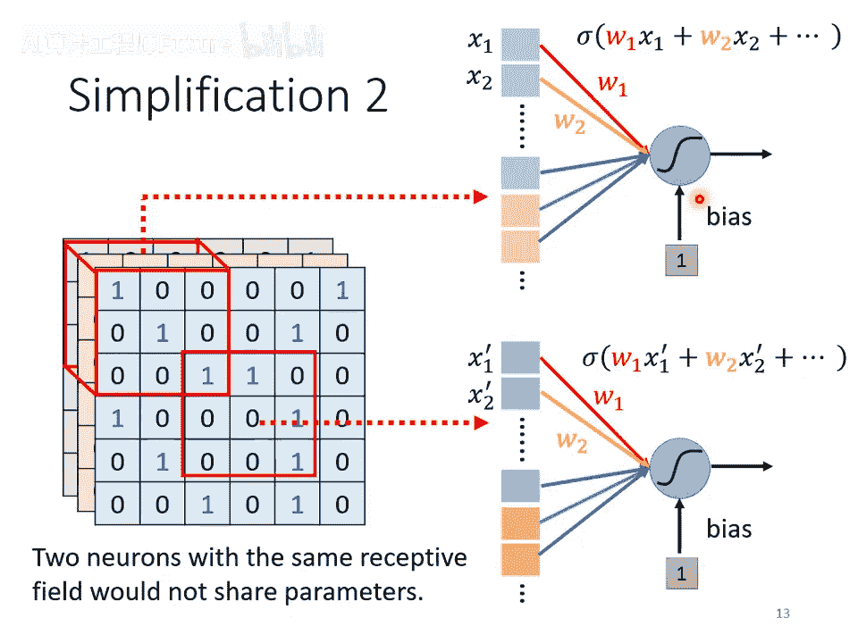

根据这个观察，我们可以进行第二个简化：**参数共享**。

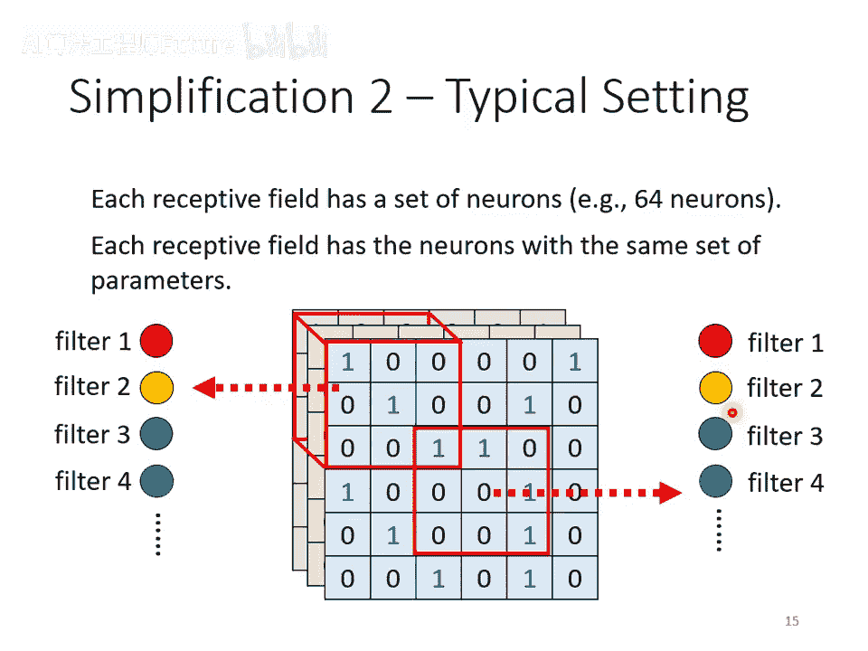

---

### 简化二：参数共享

参数共享是指，让负责侦测**同一种模式**但**感受野位置不同**的神经元，使用同一组权重参数。

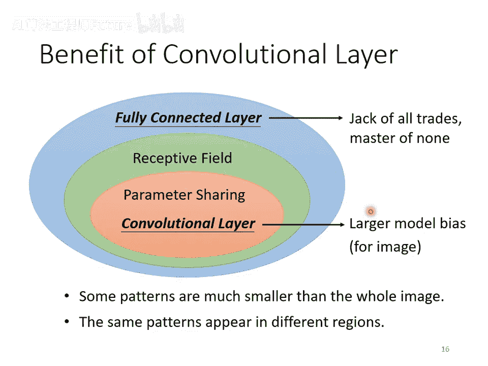

- **共享如何工作**：假设有两个神经元，一个负责左上角感受野，一个负责右下角感受野。如果它们都用于侦测“鸟嘴”，则让这两个神经元的权重 `w1, w2, ...` 完全相同。
- **输出为何不同**：尽管参数相同，但由于它们的输入（即各自感受野内的像素值）不同，因此它们的输出也不会相同。
- **共享的常见方式**：在经典CNN中，我们定义一组**滤波器**。每个滤波器就是一组共享的参数。图像上每一个感受野位置，都使用这组相同的滤波器参数进行计算。如果有64种不同的滤波器，就相当于有64组神经元在图像的每个位置上并行工作，侦测64种不同的基础模式。

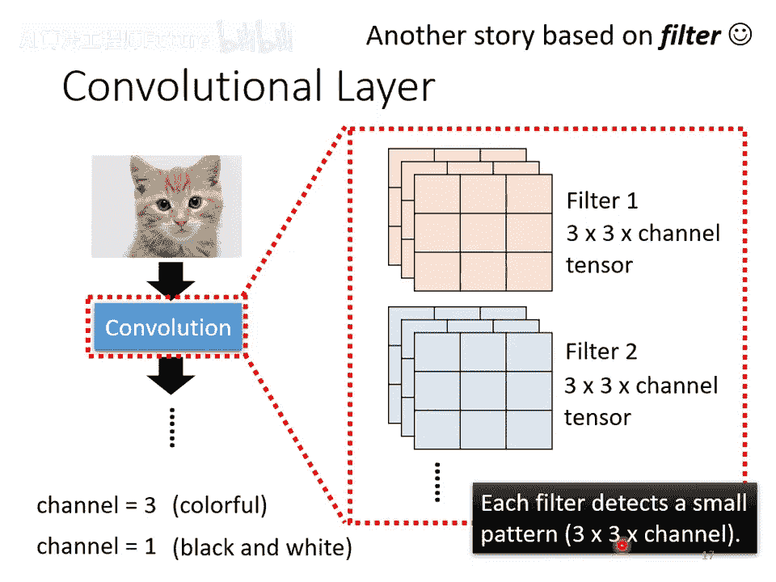

感受野加上参数共享，就构成了**卷积层**。使用卷积层的神经网络，就称为**卷积神经网络**。

**代码/公式示意（卷积运算）**：  

一个滤波器 `F`（例如 `3×3` 矩阵）在图像 `I` 上滑动，在每个位置 `(i, j)` 进行点积运算，生成特征图 `M` 的一个值：  

`M(i, j) = sum_{x,y} [ I(i+x, j+y) * F(x, y) ] + bias`

---

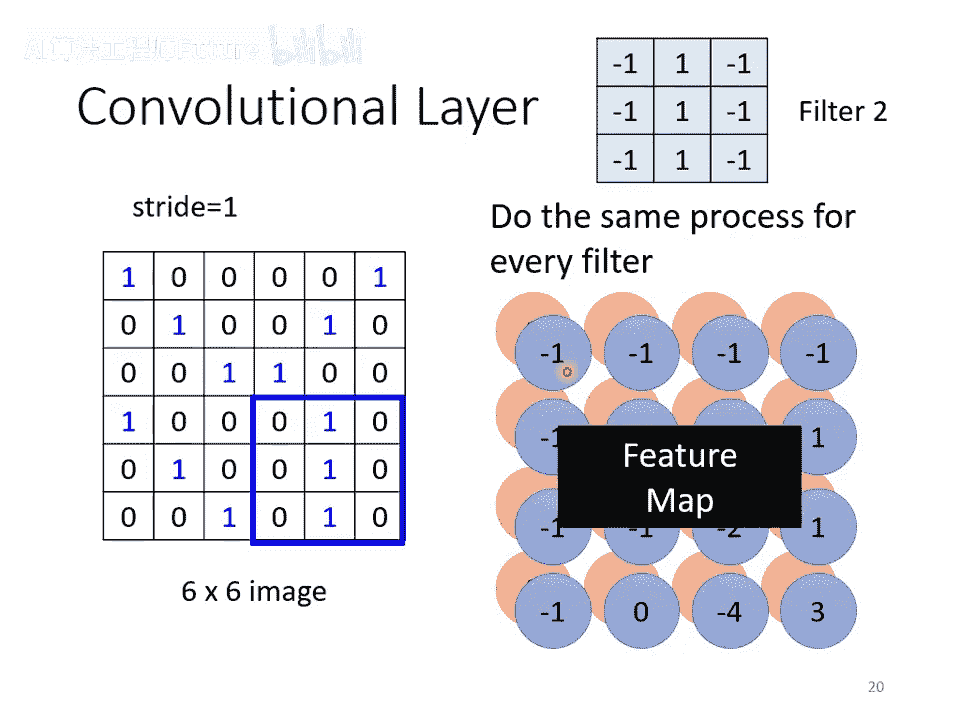

### CNN的另一种视角：滤波器与特征图

上一节我们从神经元和感受野的角度介绍了CNN。本节我们来看看另一个等价的、更常见的视角：滤波器和特征图。

在这个故事版本中：

1. **滤波器**：卷积层由许多滤波器组成。每个滤波器是一个小张量（如 `3×3×通道数`），其数值是待学习的参数。
2. **卷积操作**：每个滤波器会扫过整个输入图像。在每一个位置，滤波器与图像局部区域进行内积计算，得到一个数值。这个滑动计算的过程就是“卷积”。
3. **特征图**：一个滤波器扫完整张图片后，会生成一个二维矩阵，称为该滤波器的**特征图**。特征图中的每个值，代表原图对应位置出现该滤波器所侦测模式的“强度”。
4. **多通道输出**：如果有64个滤波器，就会得到64张特征图。这可以看作是一张新的“图片”，其“高度”和“宽度”可能变小，但“通道数”变成了64。这个结果可以作为下一层的输入。

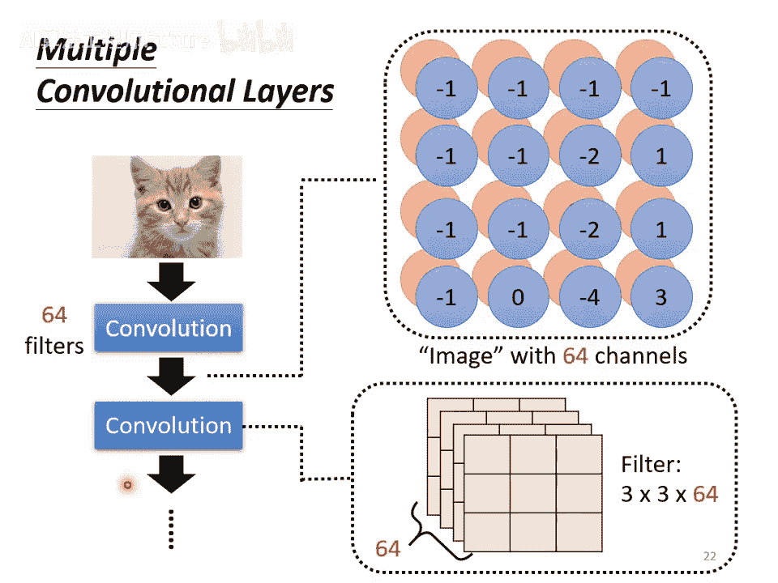

**两个视角的统一**：

- **滤波器** = **一组共享的权重参数**。
- **卷积操作** = **不同位置的神经元共享参数并进行计算**。
- **特征图** = **所有共享同一组参数的神经元的输出集合**。

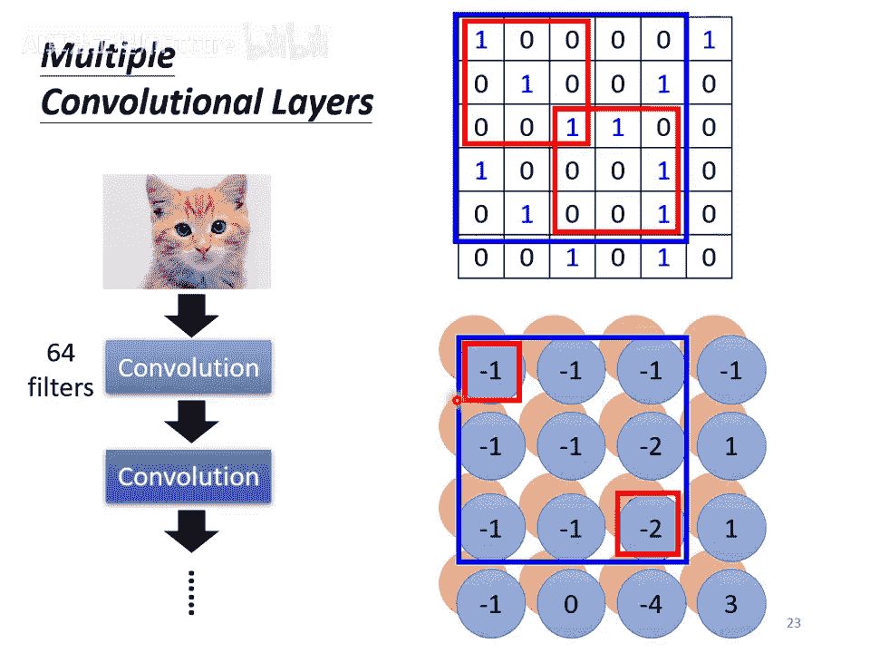

**关于大模式**：你可能会担心 `3×3` 的滤波器太小，无法侦测大范围的模式。实际上，当网络叠加多层卷积层时，**高层神经元感受野会变大**。第二层一个 `3×3` 的滤波器，对应到第一层的特征图上可能是 `5×5` 的区域，再对应回原始图像则范围更大。因此，网络越深，能看到的模式范围就越广。

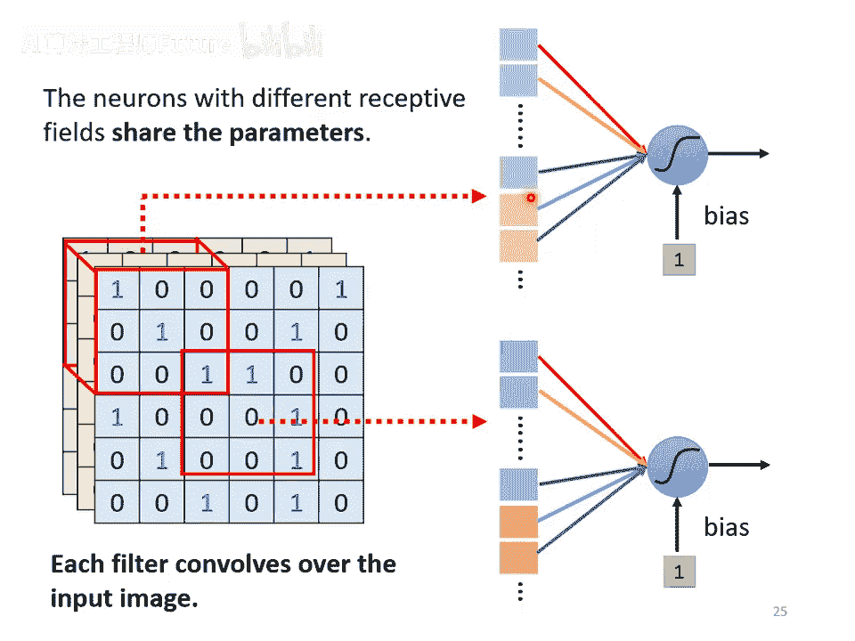

---

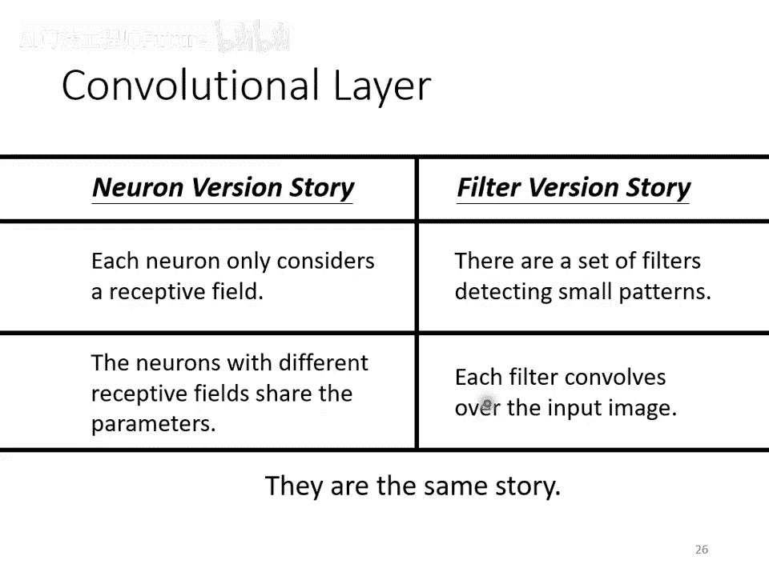

### 池化层

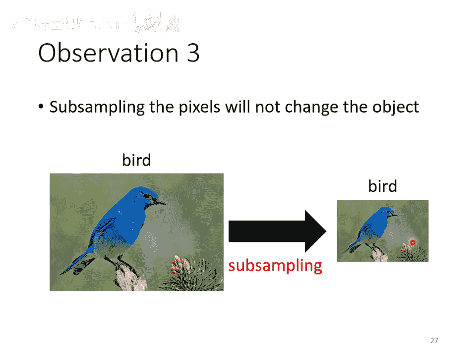

卷积神经网络通常还包含池化层，它来源于另一个观察：对图像进行下采样（缩小尺寸），不会改变我们对图像内容的认知。

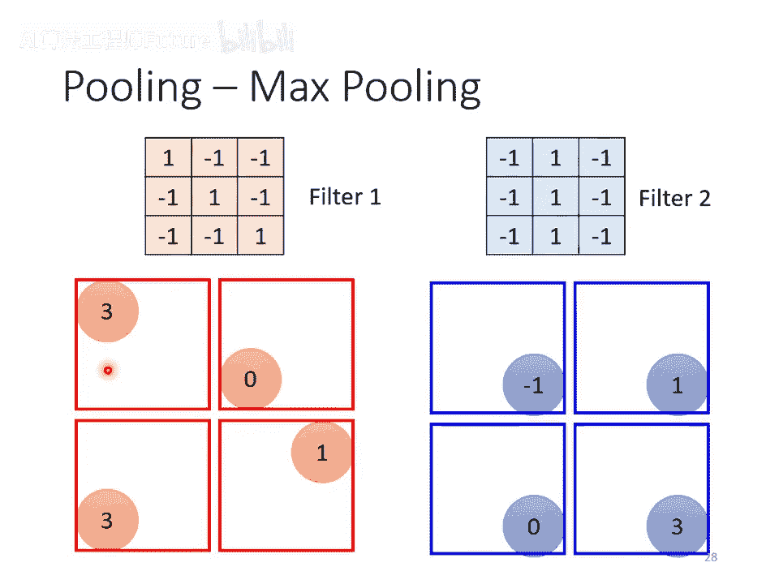

- **池化的作用**：池化层没有需要学习的参数，它是一个固定的下采样操作，主要用于减少数据量，降低计算复杂度，并提供一定程度的平移不变性。
- **最大池化**：最常见的池化方式是最大池化。它将特征图划分为不重叠的区域（如 `2×2` 的方块），每个区域只保留其最大值。
- **池化的现状**：池化层会丢失一些细节信息。随着计算能力的提升，许多现代网络架构（如AlphaGo）倾向于只使用卷积层，而不用池化层，这被称为“全卷积网络”。

---

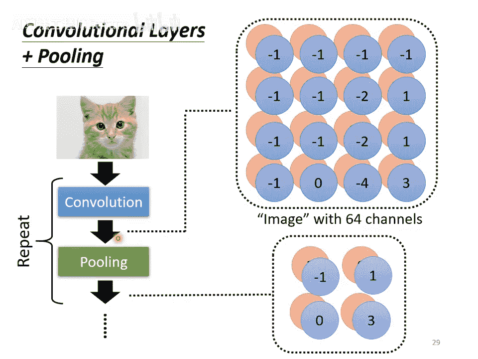

### 经典CNN架构与 flatten 操作

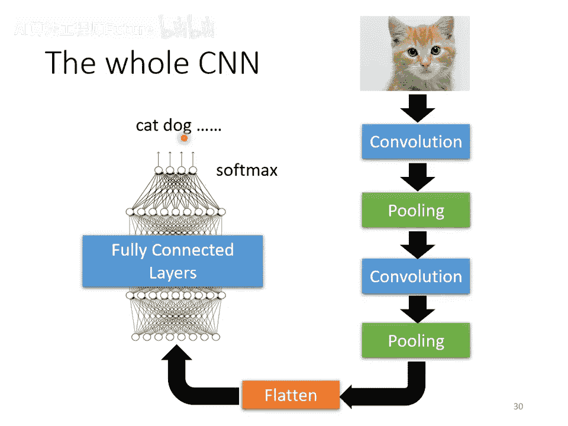

一个经典的图像识别CNN架构可能如下所示：  

`输入图片 -> [卷积层 -> 激活函数 -> 池化层] x N -> 展平层 -> 全连接层 -> Softmax -> 输出`

- **展平**：在最后的卷积/池化层之后，我们会得到一个三维的张量（`高度 × 宽度 × 通道数`）。为了输入到传统的全连接层进行分类，需要将其**展平**成一个一维向量。这个过程就是 `Flatten`。

---

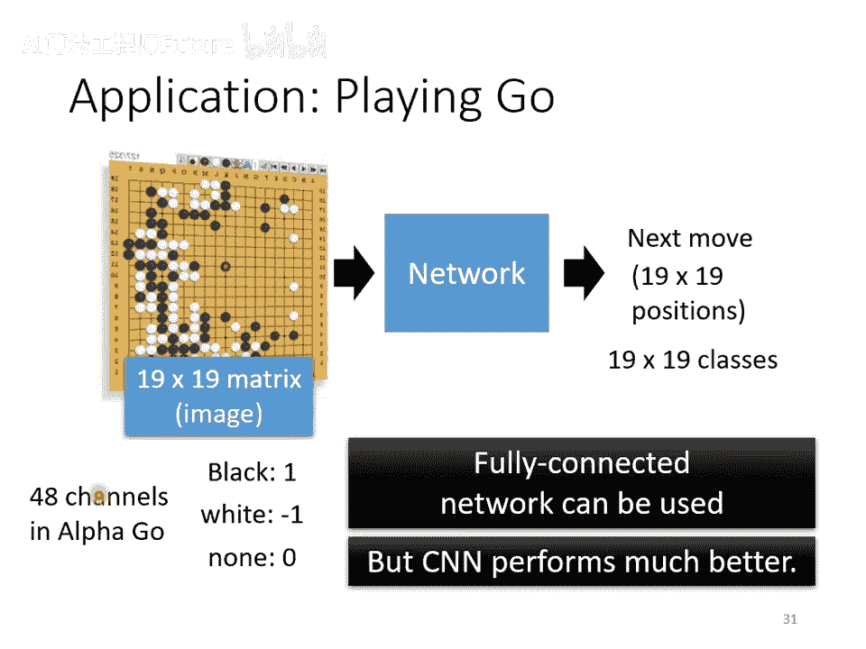

### CNN的其他应用与注意事项

CNN虽然为图像设计，但其核心思想（局部连接、参数共享）也可应用于其他具有类似特性的数据。

- **围棋（AlphaGo）**：棋盘可以视为一张 `19×19`、通道数为48的“图片”。围棋中的“模式”（如叫吃）也具有局部性和平移不变性，因此CNN非常有效。值得注意的是，**AlphaGo的网络中没有使用池化层**，因为棋盘下采样会严重改变棋局。
- **语音与文本**：CNN也可用于处理语音和文本序列，但需要根据序列数据的特性（如一维性、时间顺序）重新设计感受野和参数共享的方式，不能直接套用图像上的二维设计。
- **CNN的局限性**：CNN本身对图像的缩放和旋转并不鲁棒。一张训练好的CNN，可能无法正确识别同一物体放大或旋转后的图片。因此，在实际应用中，通常需要通过**数据增强**（如随机裁剪、旋转训练图片）来让模型学习到这些变化。

---

### 总结

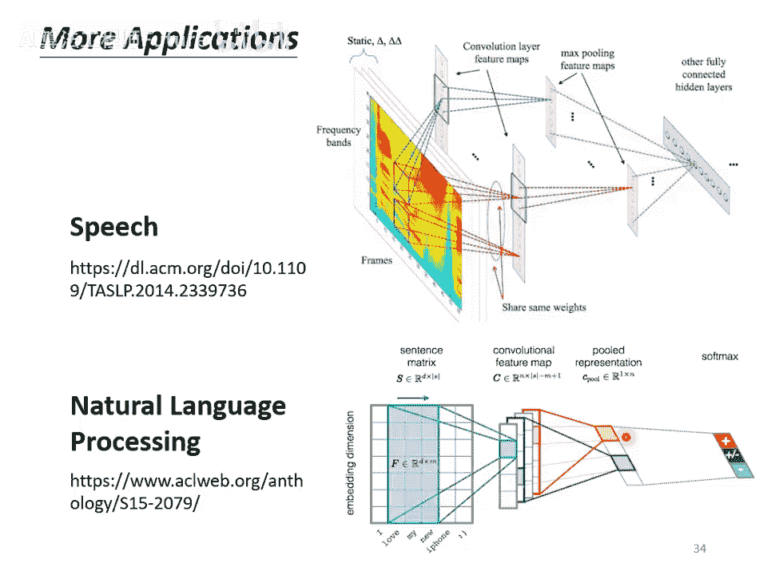

本节课我们一起学习了卷积神经网络。

1. 我们从全连接网络参数过多的问题出发，引出了两个关键观察：**模式识别只需局部信息**和**相同模式会出现在不同位置**。
2. 基于这两个观察，我们引入了**感受野**和**参数共享**两大概念，它们共同构成了**卷积层**，极大地减少了参数数量并提升了效率。
3. 我们从“神经元”和“滤波器”两个等价视角深入理解了CNN的工作原理。
4. 我们介绍了**池化层**的作用及其在现代网络中的可选性，以及网络末端的**展平**操作。
5. 最后，我们探讨了CNN在围棋等非图像任务中的应用，并指出了其对于尺度、旋转变化的局限性以及数据增强的重要性。

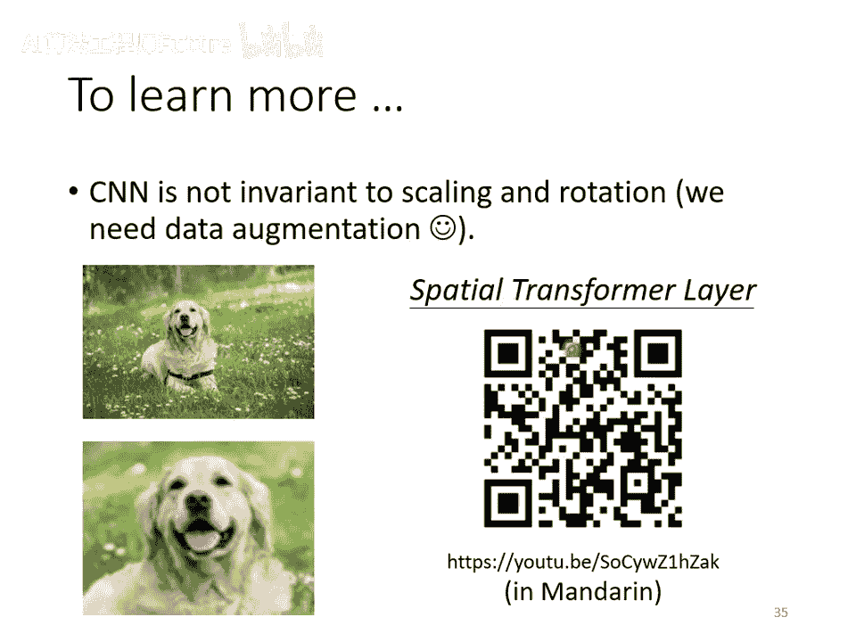

CNN通过其精巧的结构设计，成为了处理图像及相关问题的强大工具，但其应用需要紧密结合具体任务的数据特性。
