# 26：3-鱼与熊掌可以兼得的深度学习 🧠

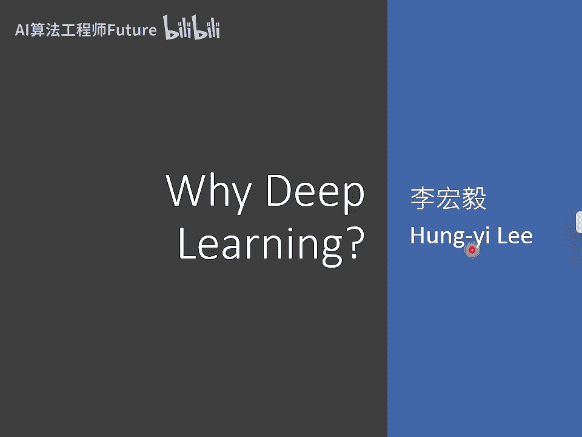

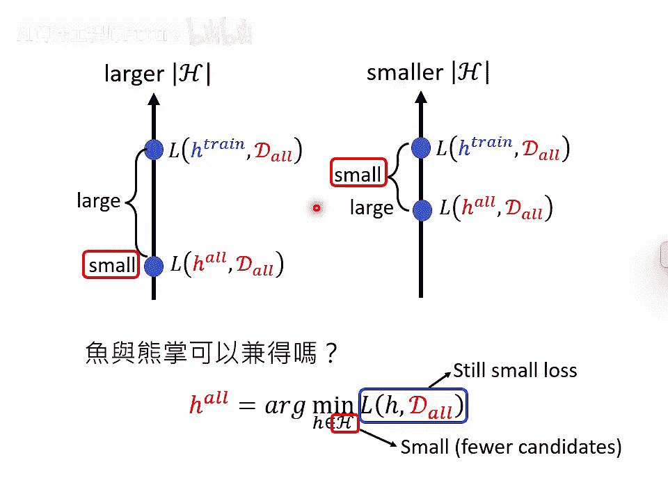

在本节课中，我们将要学习深度学习模型的核心优势。我们将探讨为何深度网络（Deep Network）在参数效率上优于浅层网络（Shallow Network），以及这如何帮助我们实现“鱼与熊掌兼得”——即同时获得较低的理想损失（Low Loss）和较小的理想与现实差距（Small Gap）。

---

## 模型选择的两难困境

上一节我们介绍了模型选择的两难困境。这个困境在于：如果选择较大的模型（即优化时可选择的函数空间较大），虽然理论上可以达到很低的损失（理想的 `L(h*)` 很小），但理想情况与现实情况之间的差距会很大。反之，如果选择较小的模型（可选择的函数较少），虽然理想与现实的差距较小，但理论上的最低损失（`L(h*)`）会比较大。

那么，鱼与熊掌能否兼得？我们能否既有一个损失很低的理想函数 `h*`，同时又让现实训练出的函数 `h^` 与这个理想非常接近？

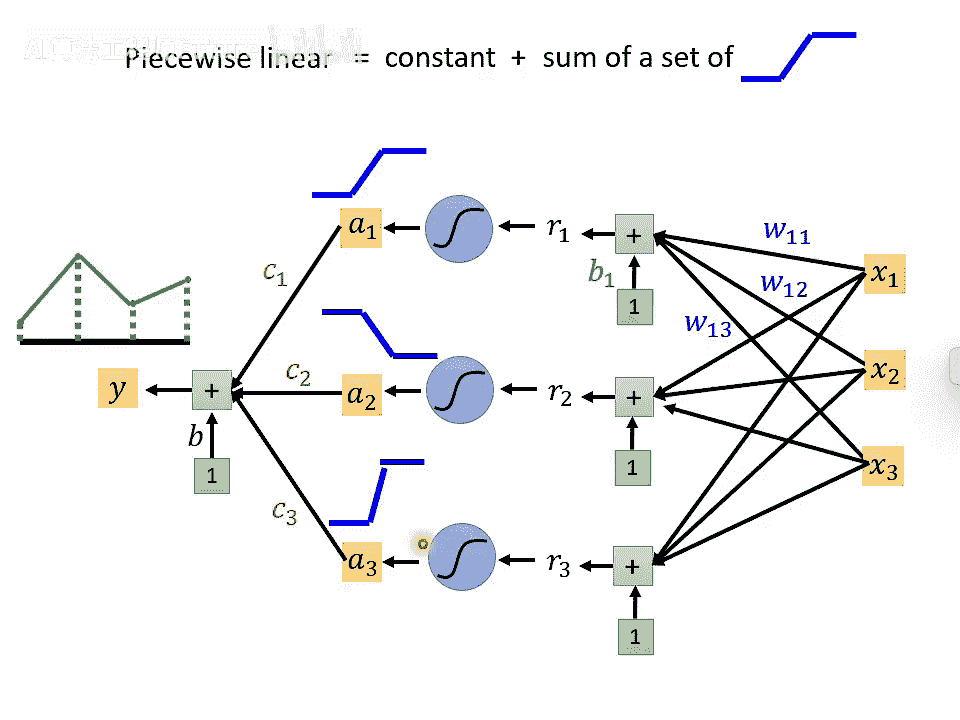

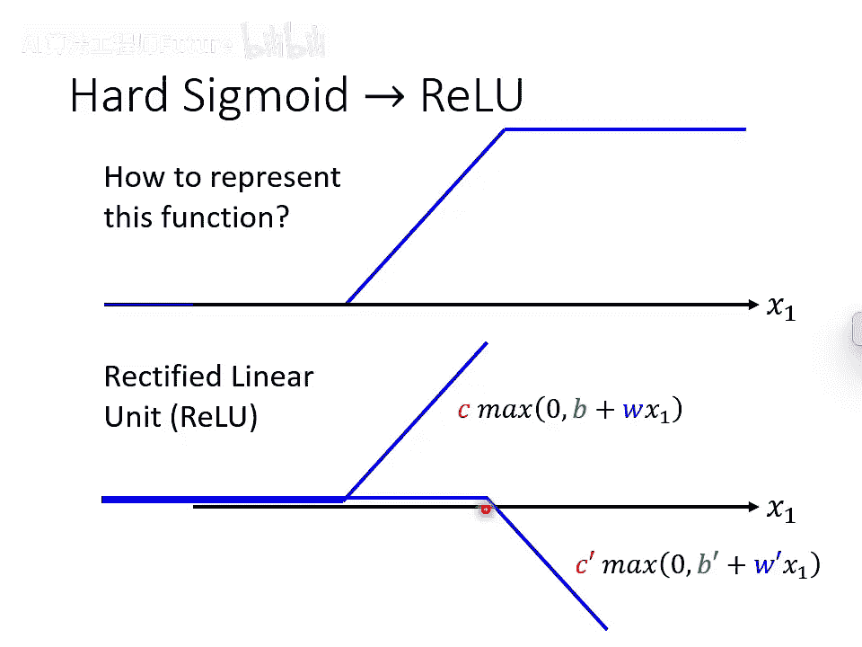

关键在于找到一个函数集合 `H`（即模型），它需要满足两个条件：

1. **成员精英化**：集合 `H` 中的函数 `h` 本身就能使损失 `L(h)` 很低。
2. **集合精简**：集合 `H` 本身包含的可选函数数量不多。

如果这两点同时成立，我们就能用较少的训练数据，找到一个接近理想精英函数的解，从而实现“低损失”和“小差距”的兼得。接下来，我们将看到深度学习如何实现这一目标。

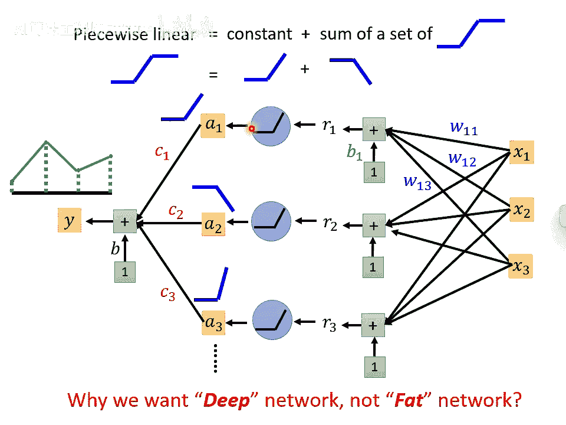

---

## 为何需要深度网络？

在开始讲解深度学习的优势前，我们先快速回顾为何需要引入隐藏层（Hidden Layer）。

一个核心结论是：**仅含一个隐藏层的神经网络，只要神经元足够多，理论上可以逼近任何连续函数**。

其原理是将目标函数近似为分段线性函数（Piecewise Linear Function）。每个分段可以用一个“阶梯形”函数（Hard Sigmoid）来构建。而神经网络中的神经元（如使用Sigmoid或ReLU激活函数）可以很好地近似这种阶梯形函数。

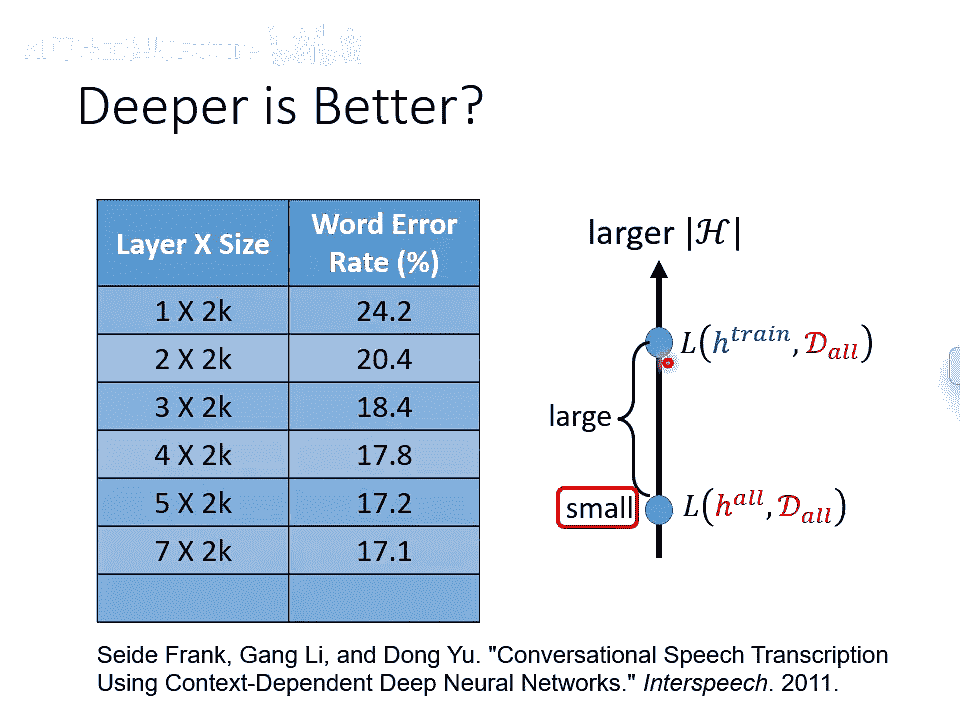

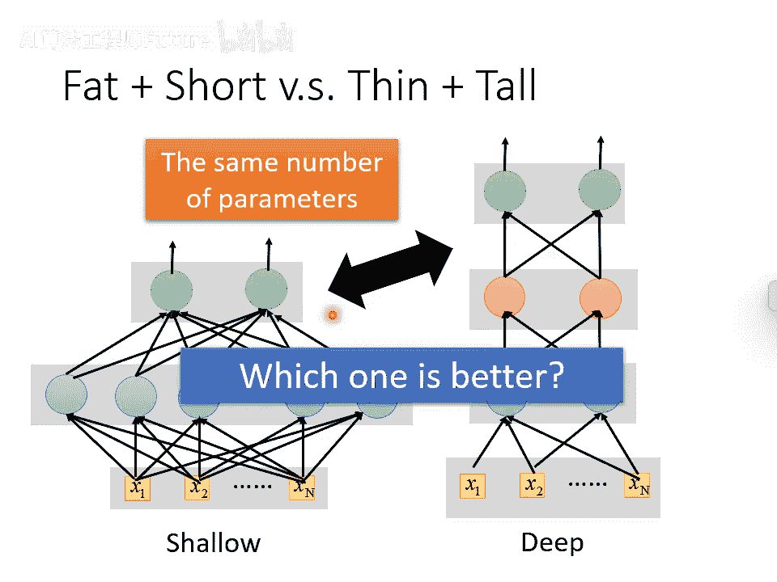

- **使用Sigmoid**：一个Sigmoid函数可以近似一个阶梯。
- **使用ReLU**：两个ReLU函数叠加可以构成一个阶梯形函数。

因此，通过将许多这样的神经元输出加权求和，再加上一个偏置项，神经网络就能构造出复杂的分段线性函数，从而逼近任意目标函数。

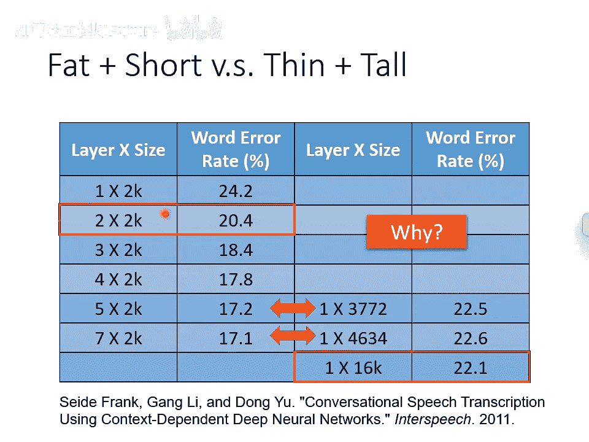

既然一个足够“宽”（神经元多）的浅层网络就能做任何事，那为什么还需要“深”的网络呢？实验表明，深度网络通常表现更好。

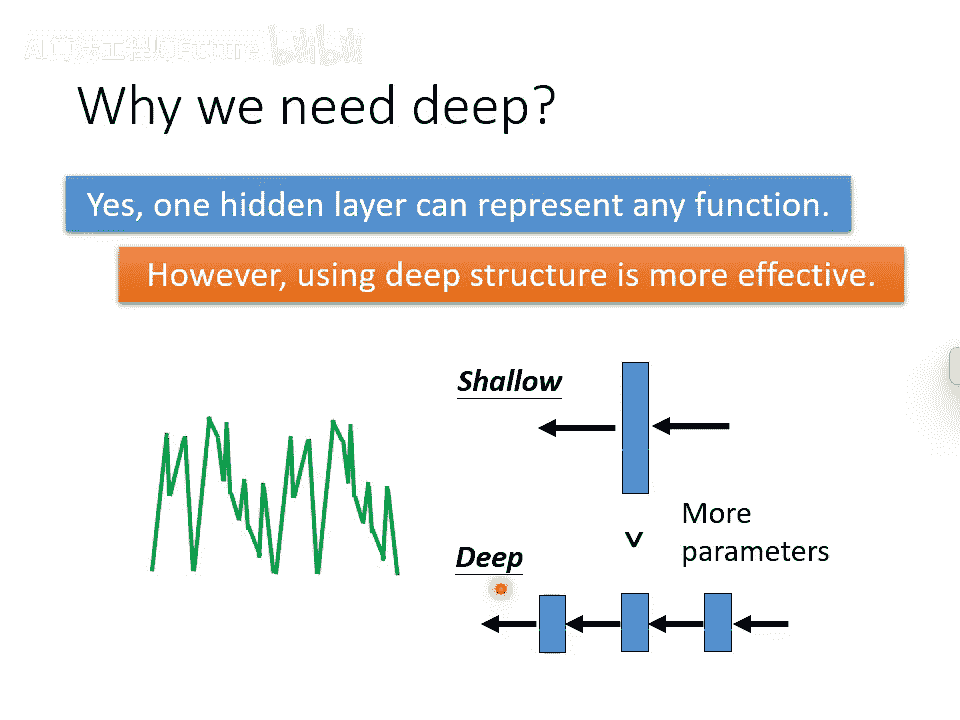

---

## 深度网络的优势：效率更高

一个常见的误解是：深度学习就是大模型+大数据，容易过拟合。但深度学习的真正优势恰恰相反：**对于实现相同的复杂函数，深度网络通常比浅层网络需要更少的参数**。参数少意味着模型更简单，更不容易过拟合，也即对数据量的需求可能更低。

以下通过几个类比来说明“深度”结构的高效性：

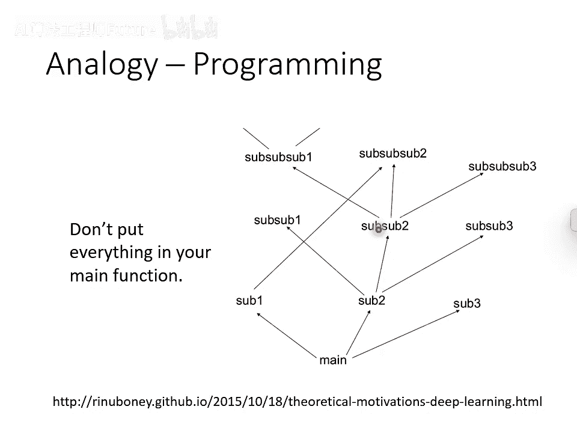

- **逻辑电路设计**：用两层逻辑门可以实现任何布尔函数，但设计一个奇偶校验电路，若只用两层，需要 `O(2^D)` 个门（D为输入位数）。而采用多层结构（如串联多个异或门），只需 `O(D)` 个门即可实现，效率呈指数级提升。
- **程序设计**：我们不会将所有代码写在主函数里，而是通过定义和调用子函数（模块）来构建程序。这种层次化结构避免了代码重复，使程序更简洁、高效。
- **剪纸艺术**：直接剪出一个复杂图案非常困难。但若先将纸多次对折，只需剪几刀，展开后就能得到复杂图案。这个“对折”的过程，就如同神经网络中的层，将问题转化得更易处理。

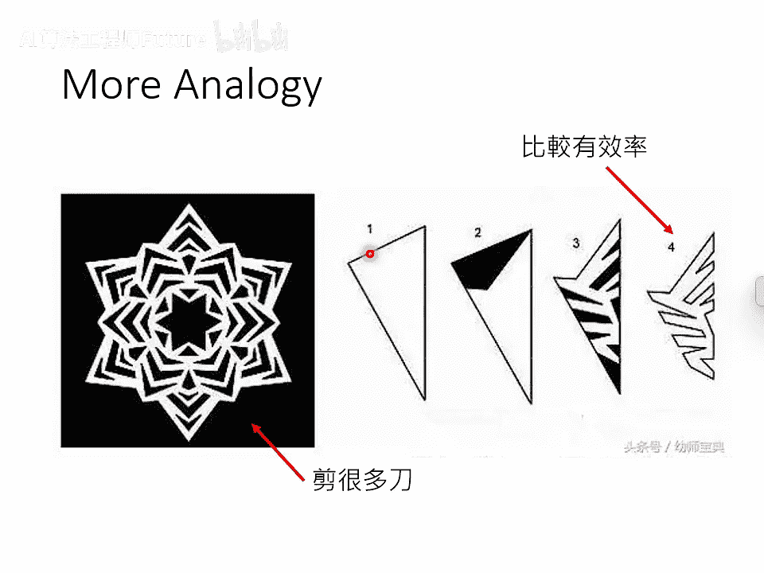

---

## 案例分析：用ReLU网络构建复杂函数

让我们具体分析一个使用ReLU激活函数的神经网络例子，直观感受深度如何带来指数级的表达能力。

考虑一个简单的单层网络：

- **输入**：`x`
- **隐藏层**：2个ReLU神经元。
- **输出**：`a1 = relu(x-0.5) + relu(-x+0.5)`
- **函数形状**：`a1` 关于 `x` 是一个简单的“V”形（或山谷形），有 `2^1 = 2` 个分段。

现在，我们以此为基础堆叠第二层：

- **输入**：`a1`
- **第二层**：2个ReLU神经元。
- **输出**：`a2 = relu(a1-0.5) + relu(-a1+0.5)`
- **函数形状**：`a2` 关于 `x` 变成一个“W”形，有 `2^2 = 4` 个分段。

如果再堆叠第三层：

- **输入**：`a2`
- **第三层**：2个ReLU神经元。
- **输出**：`a3 = relu(a2-0.5) + relu(-a2+0.5)`
- **函数形状**：`a3` 关于 `x` 将变成有 `2^3 = 8` 个分段的复杂锯齿状曲线。

**关键结论**：

- **深度网络**：要产生一个有 `2^K` 个分段的输出，只需要一个 `K` 层、每层2个神经元的网络，总参数量为 `O(K)`。
- **浅层网络**：要产生同样的 `2^K` 分段输出，需要一个单隐藏层网络，但需要大约 `2^K` 个神经元，参数量为 `O(2^K)`。

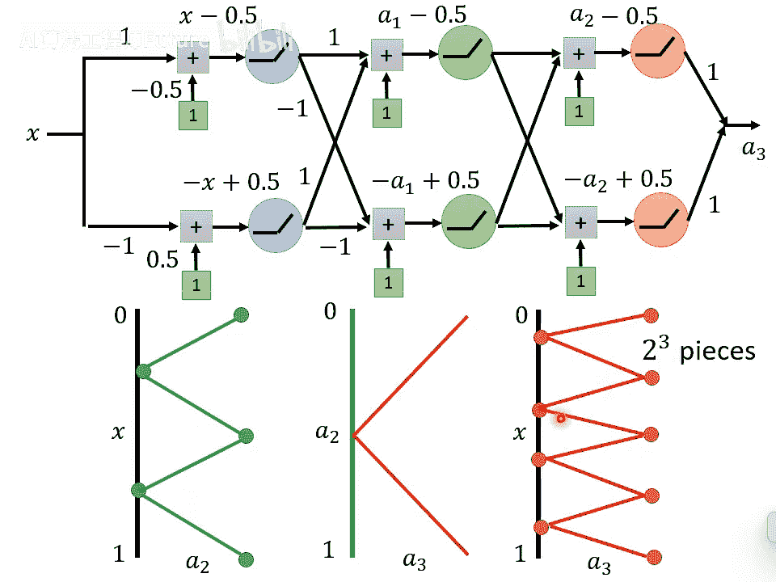

两者效率是指数级的差距。因此，对于有规律但复杂的函数，深度网络可以用少得多的参数来实现，从而降低了过拟合风险，实现了“用更简单的模型达到更低损失”的目标。

---

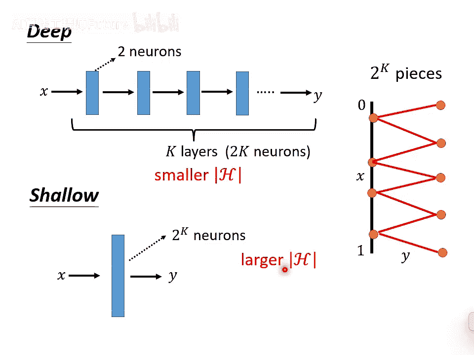

## 总结

本节课我们一起学习了深度学习的核心优势。深度学习并非简单地等同于大参数模型，其精髓在于**通过深度结构，能够用更高效（更少参数）的方式来表达复杂且有规律的函数**。

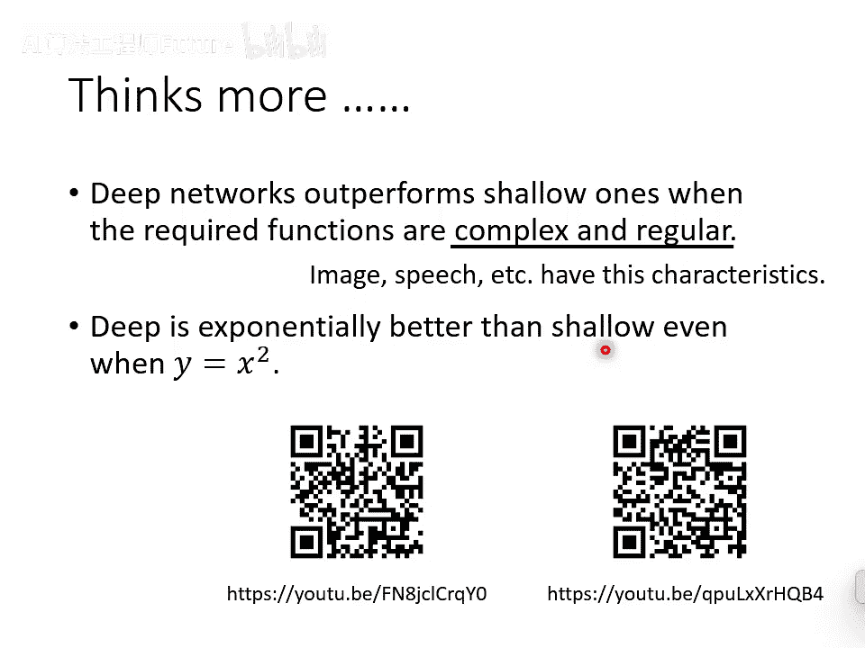

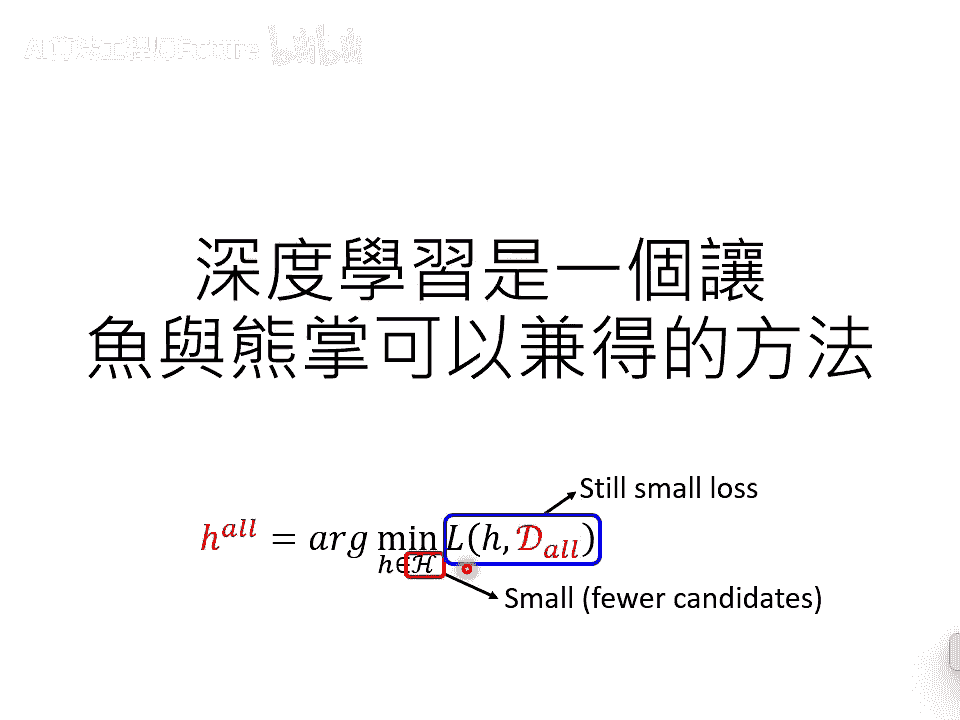

这使得我们有可能在参数数量较少（模型相对简单）的情况下，逼近那个损失很低的理想函数 `h*`。参数少意味着理想与现实之间的泛化差距更容易控制，从而破解了模型选择中的两难困境，实现了“鱼”（低理想损失）与“熊掌”（小泛化差距）的兼得。这也解释了为何深度学习在图像、语音等数据内在规律复杂的领域表现尤为出色。
