# 27：4-选修-Spatial Transformer Layer 🧠➡️🖼️

在本节课中，我们将要学习一种特殊的神经网络层——**Spatial Transformer Layer**。这个层能够主动对输入的图像或特征图进行空间变换（如平移、旋转、缩放），从而帮助后续的网络（如CNN）更稳定、更准确地识别物体，即使物体在图像中的位置、大小或角度发生了变化。

## 为什么需要Spatial Transformer？🤔

上一节我们介绍了卷积神经网络（CNN）的基本概念。本节中我们来看看CNN在处理图像时的一个常见误解：很多人认为CNN天生具有**尺度不变性**或**旋转不变性**，但事实并非完全如此。

- CNN的每个滤波器（filter）大小是固定的，它只能检测特定大小的模式。如果一个物体很小，它可能被检测为“小物体”；放大后，对CNN来说可能就是另一个不同的模式。
- 同样，将一个数字“3”旋转90度变成类似“麦当劳”的标志，对CNN而言就是完全不同的东西，它并不具备很强的旋转不变性。
- CNN通过最大池化（Max Pooling）获得了一些**平移不变性**，但仅限于小幅度的平移。如果物体从图像左上角移动到右下角，CNN很可能无法识别为同一物体。

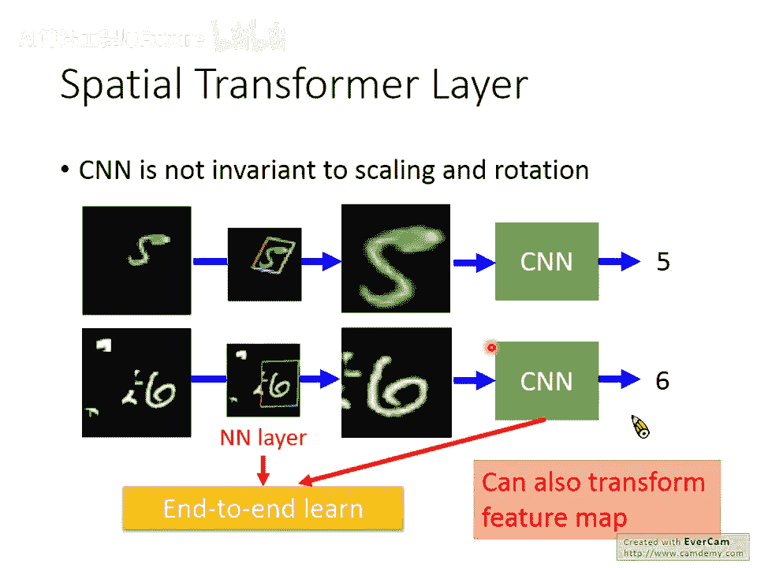

因此，如果要做手写数字识别，输入图像中的数字“5”或“6”如果大小、位置不同，CNN可能无法正确识别。Spatial Transformer Layer就是为了解决这个问题而设计的。

## Spatial Transformer Layer 是什么？🔧

Spatial Transformer Layer是一个可以集成到神经网络中的独立层。它的核心功能是：**自动学习并对输入数据（如图像或特征图）进行最有利的空间变换**。

- **它是一个神经网络层**：它本身由可学习的参数构成，可以通过反向传播（Backpropagation）与整个网络一起训练。
- **它可以变换任何层**：不仅可以放在网络最前端变换输入图像，也可以插入到CNN中间，对任何一个卷积层输出的**特征图（Feature Map）**进行变换。你可以把特征图看作一个多通道的“图像”。
- **工作原理**：该层会分析输入，并输出一组变换参数（例如，用于仿射变换的6个参数）。然后，根据这些参数，计算出输出特征图中每个点应该从输入特征图中的哪个（或哪些）点取值。

## 如何实现空间变换？📐

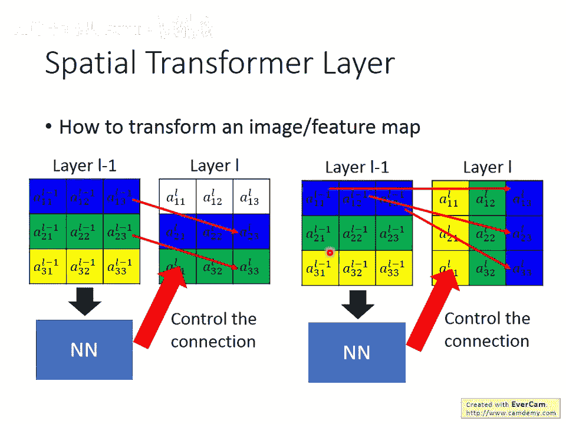

上一节我们介绍了Spatial Transformer Layer的目标，本节中我们来看看它是如何通过数学实现空间变换的。

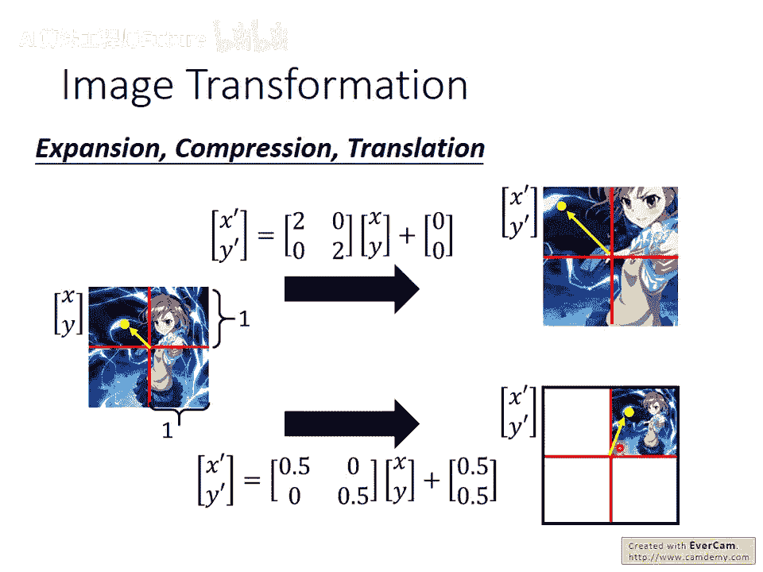

对图像进行平移、旋转、缩放等操作，在数学上可以通过**仿射变换（Affine Transformation）** 来描述。仿射变换可以用一个矩阵乘法加上一个平移向量来表示：


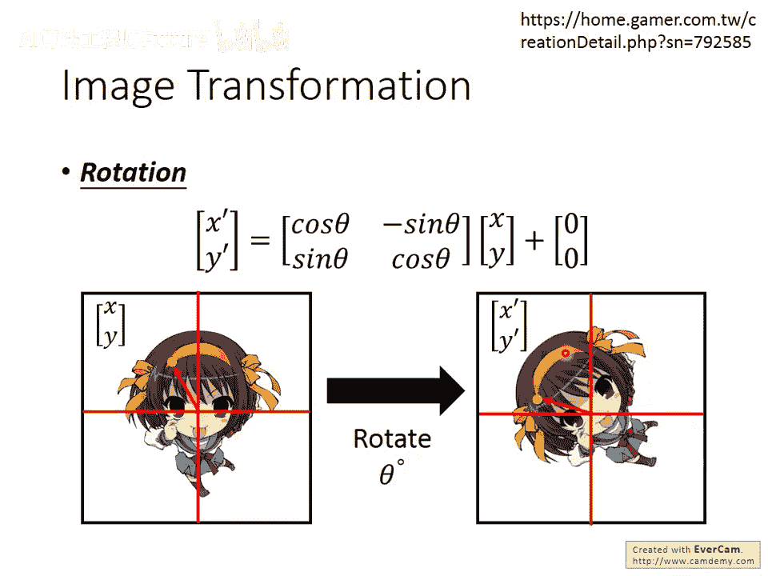

**公式：**  

`[x’; y’] = [[a, b], [c, d]] * [x; y] + [e; f]`

其中：

- `(x, y)` 是**输出**特征图上某个像素点的坐标。
- `(x’, y’)` 是计算得到的、在**输入**特征图上应该取值的对应坐标。
- 矩阵 `[[a, b], [c, d]]` 控制缩放、旋转和剪切。
- 向量 `[e; f]` 控制平移。

因此，Spatial Transformer Layer中的一个小型神经网络（称为**定位网络，Localisation Network**）的任务，就是根据输入数据，学习并输出这6个参数 `(a, b, c, d, e, f)`。

## 从参数到像素值：采样与插值 🔄

上一节我们知道了如何得到变换参数，本节中我们来看看如何用这些参数生成最终的输出像素值。

定位网络输出6个参数后，我们为输出特征图的每个位置 `(x, y)` 计算其对应的输入坐标 `(x’, y’)`。但这里会遇到一个问题：计算出的 `(x’, y’)` 通常是**浮点数**，而像素坐标是整数。

以下是两种可能的处理方法及其问题：

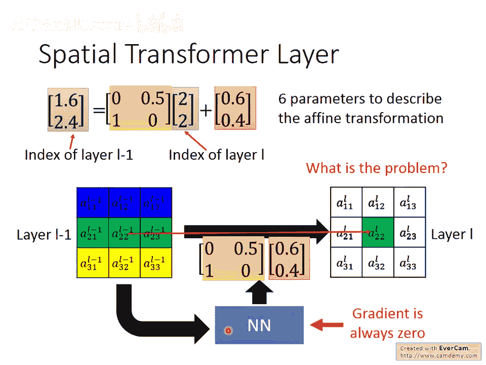

1. **最近邻取整**：将 `(x’, y’)` 四舍五入到最近的整数坐标。但这种方法会导致梯度几乎处处为零，无法使用梯度下降法训练网络。因为参数的微小变化可能不会改变取整结果，从而损失函数没有变化，梯度无法传播。
2. **双线性插值（Bilinear Interpolation）**：这是实际采用的方法。对于浮点坐标 `(x’, y’)`，我们找到输入特征图中包围它的四个最近的整数坐标点。输出像素的值由这四个点的像素值根据距离进行加权平均得到。

**代码概念描述：**

```python
# 假设 (x’, y’) = (1.6, 2.4)
# 找到四个邻近点：Q11=(1,2), Q12=(1,3), Q21=(2,2), Q22=(2,3)
# 计算权重（基于距离）
output_value = (1-0.6)*(1-0.4)*Q11 + (1-0.6)*0.4*Q12 + 0.6*(1-0.4)*Q21 + 0.6*0.4*Q22
```

这种方法**是可微分的**。当变换参数发生微小变化时，`(x’, y’)` 会微小变化，导致插值的权重也微小变化，从而最终输出值也微小变化。这使得梯度可以通过这个层反向传播，整个网络得以训练。

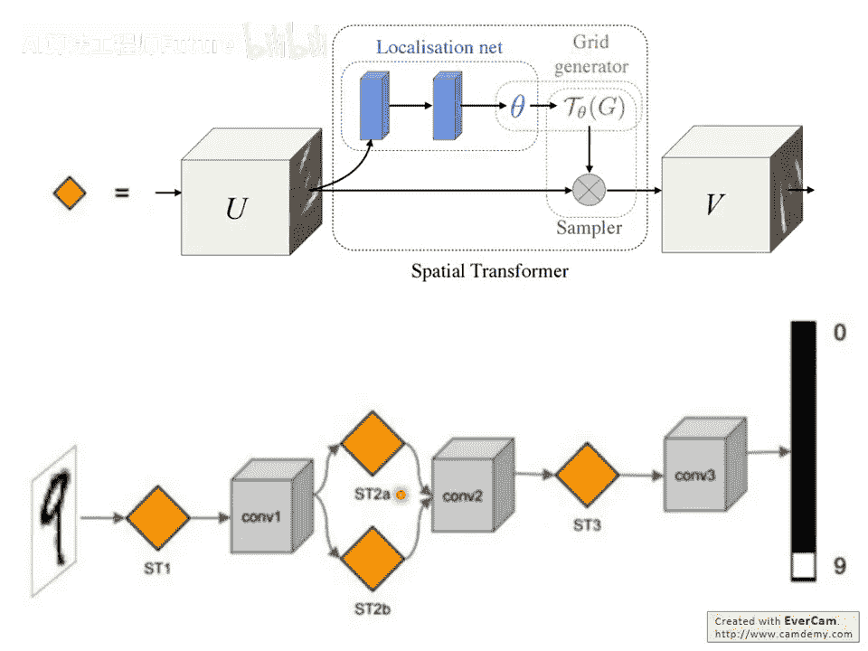

## Spatial Transformer 的网络架构与应用 🕸️

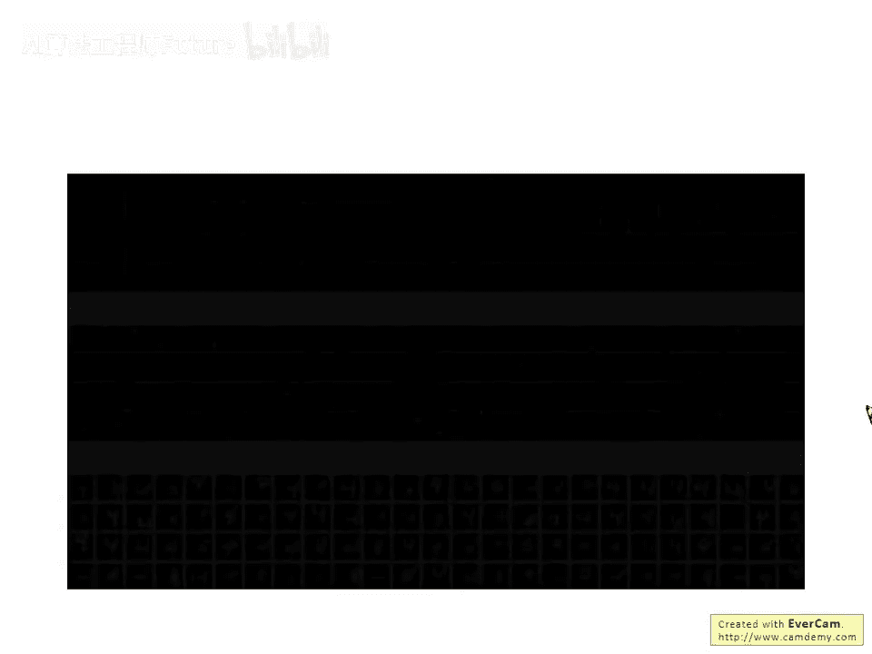

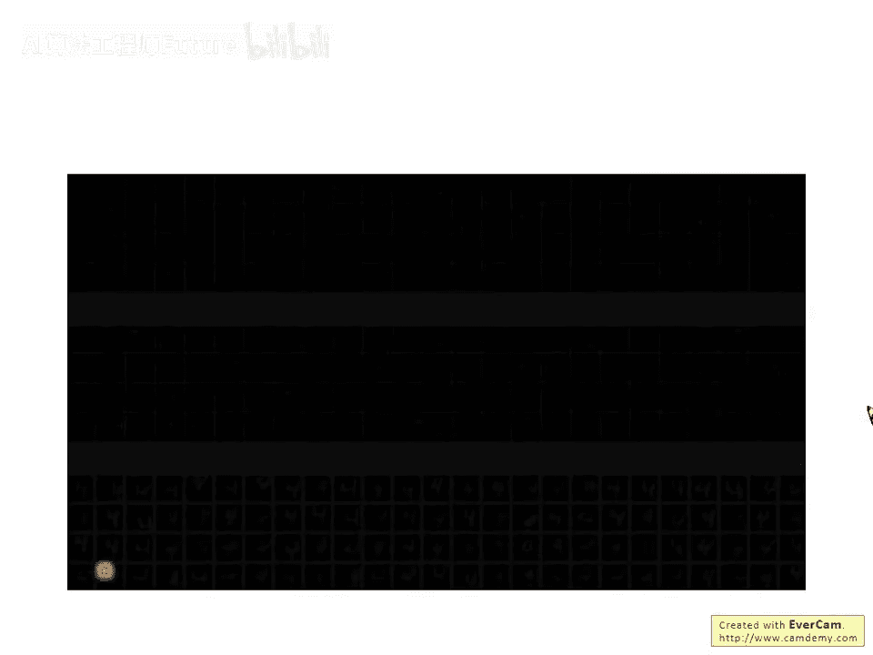

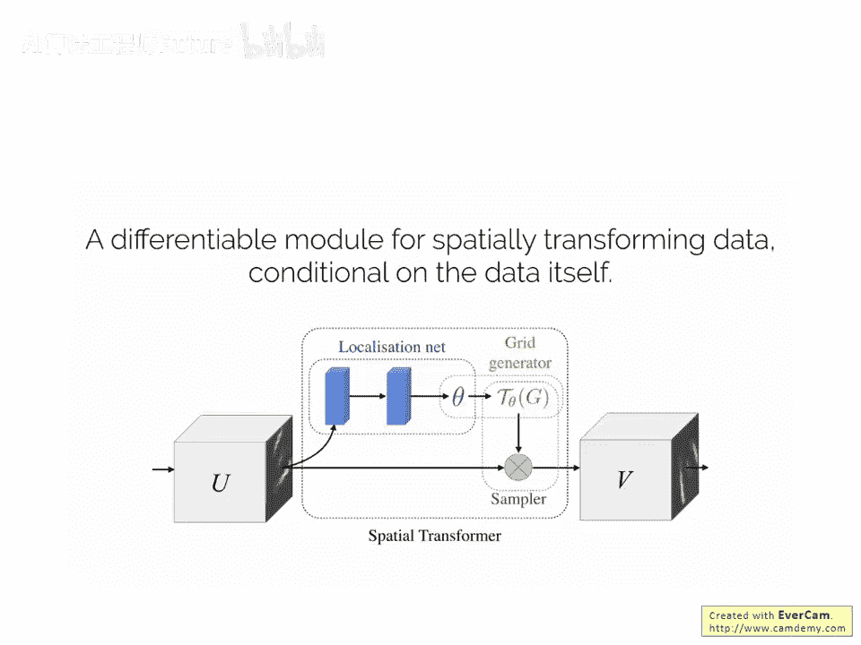

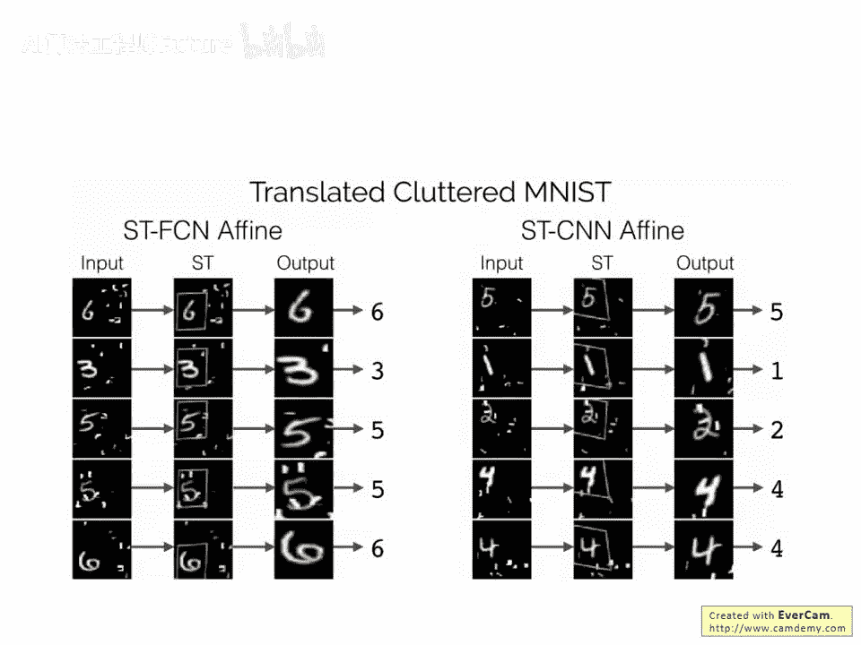

了解了核心机制后，我们来看看Spatial Transformer Layer在完整网络中是如何被组织和应用的。

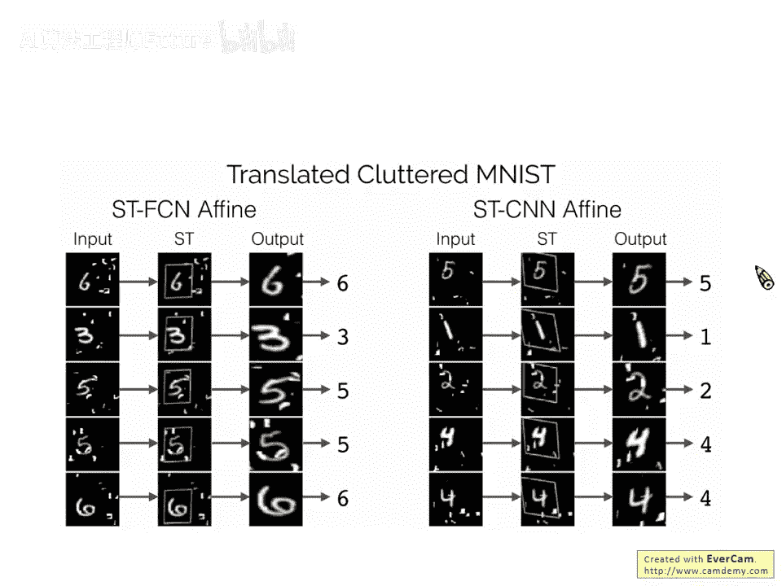


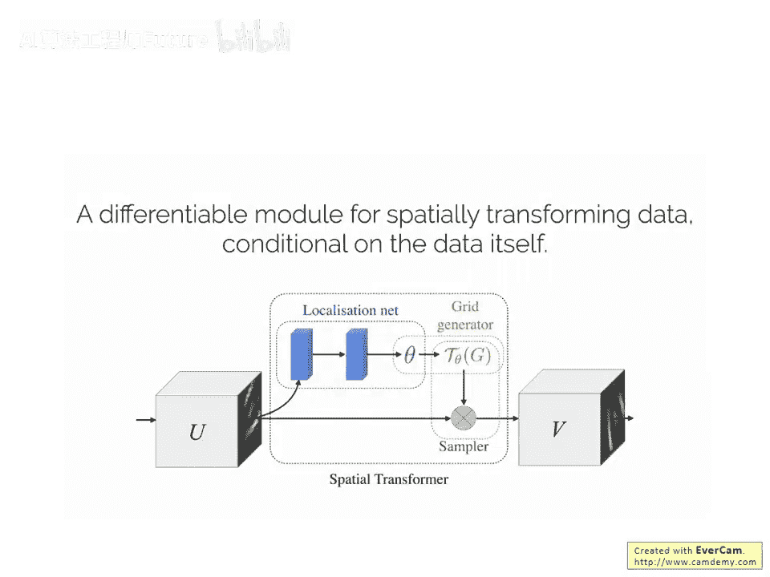

Spatial Transformer Layer可以非常灵活地嵌入到神经网络中：


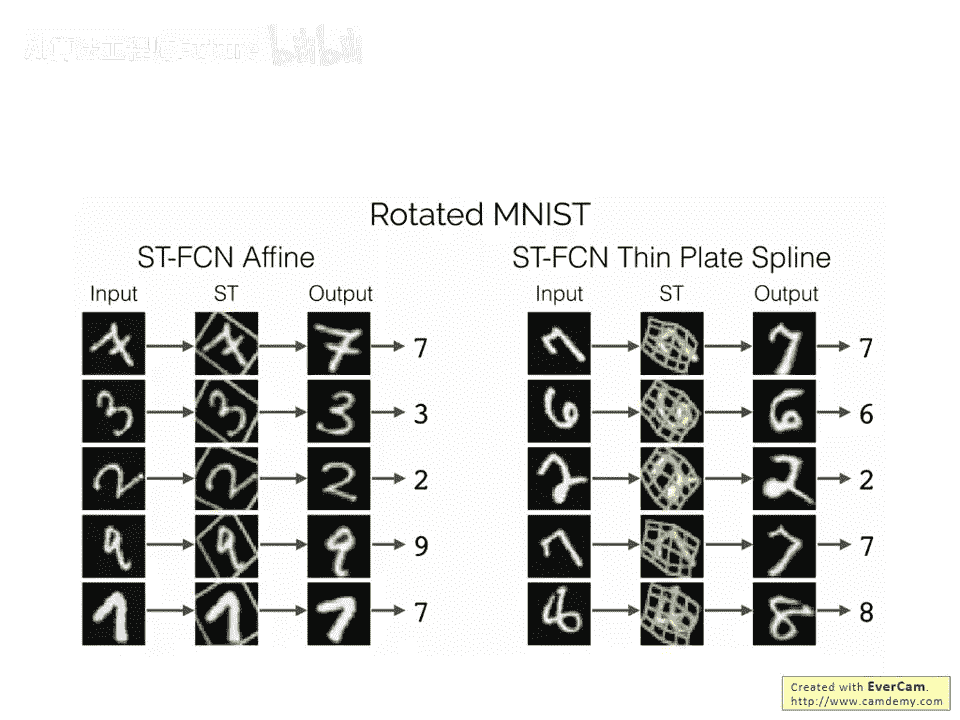


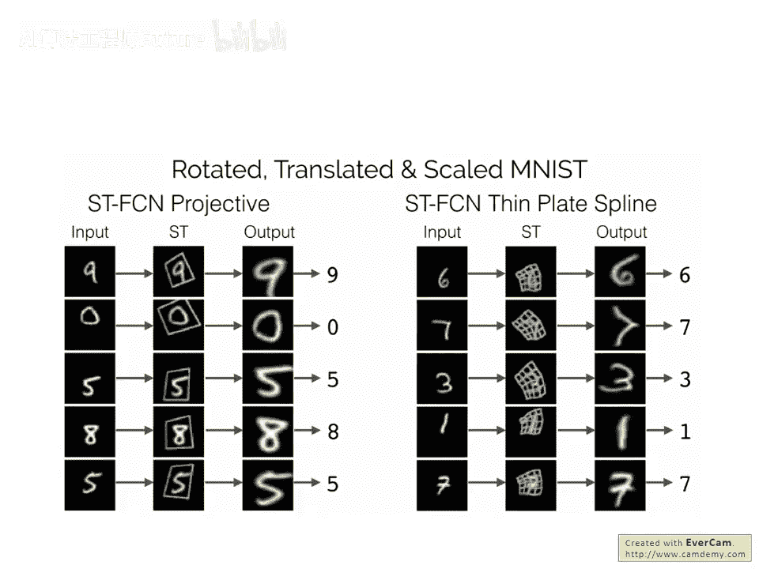

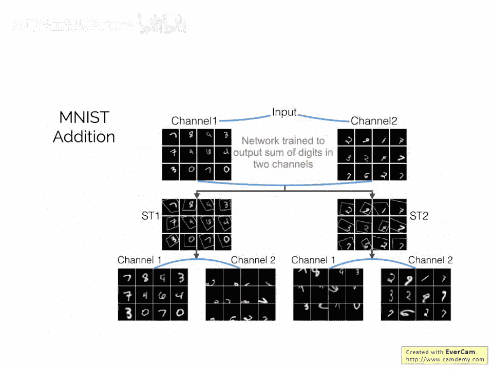

- **单次变换**：可以在输入层后加入一个Spatial Transformer，对原始图像进行校正。
- **多次变换**：可以在网络的多个深度插入Spatial Transformer Layer，对中间的特征图进行逐级优化。
- **并行变换**：甚至可以在同一层使用**多个**独立的Spatial Transformer，让网络同时关注输入的不同区域（例如，一个关注物体头部，一个关注物体身体），然后将多个变换后的结果合并，送入后续网络。

以下是它在一些任务中的应用效果：

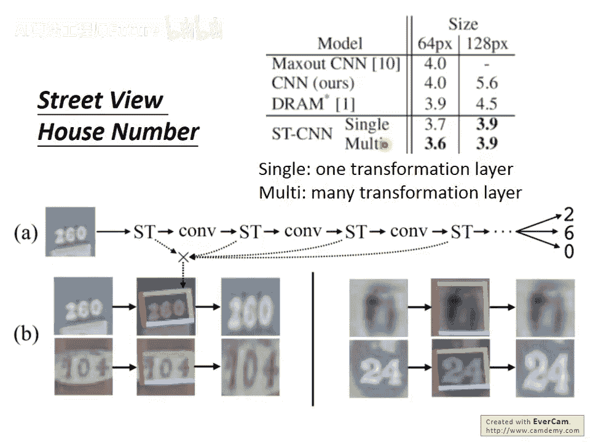

- **手写数字识别（MNIST）**：即使输入的数字被扭曲、平移或旋转，Spatial Transformer也能将其“摆正”，使得后续的CNN看到的是稳定、规范的输入，从而大幅提升识别率。
- **街景门牌号识别（SVHN）**：图像中可能包含多个数字，且大小位置不一。Spatial Transformer能够自动定位并放大每个数字区域，帮助网络进行精确识别。
- **细粒度图像分类（如鸟类识别）**：使用两个并行的Spatial Transformer，网络可以学会分别聚焦于鸟的头部（喙、眼）和身体（翅膀、羽毛）这两个关键部位，结合两者的信息做出更准确的分类。

## 总结 📝

本节课中我们一起学习了**Spatial Transformer Layer**。我们首先探讨了CNN在空间不变性上的局限性，从而引出了对该层的需求。接着，我们深入分析了其核心原理：通过一个小的定位网络学习仿射变换参数，并利用双线性插值实现可微分的空间采样。最后，我们了解了该层灵活的网络集成方式和在多种视觉任务中的有效应用。

Spatial Transformer Layer是一个强大的模块，它赋予神经网络主动“观察”和“调整”输入数据空间结构的能力，是迈向更智能、更鲁棒的计算机视觉系统的重要一步。
