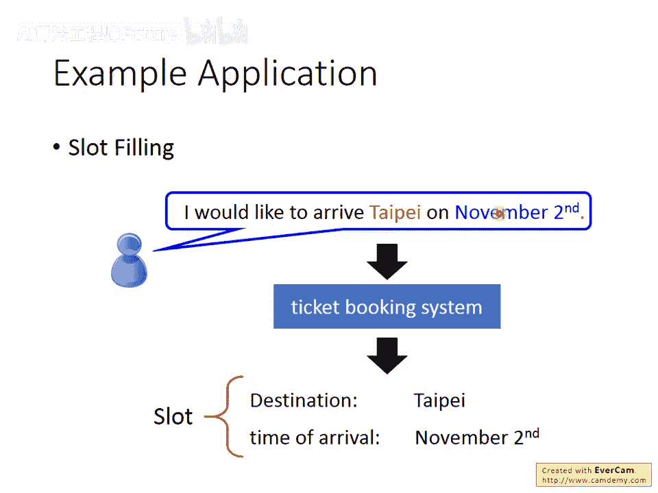
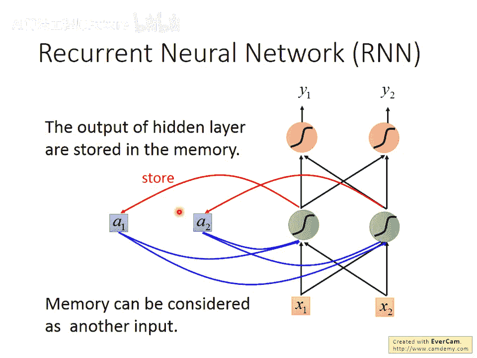
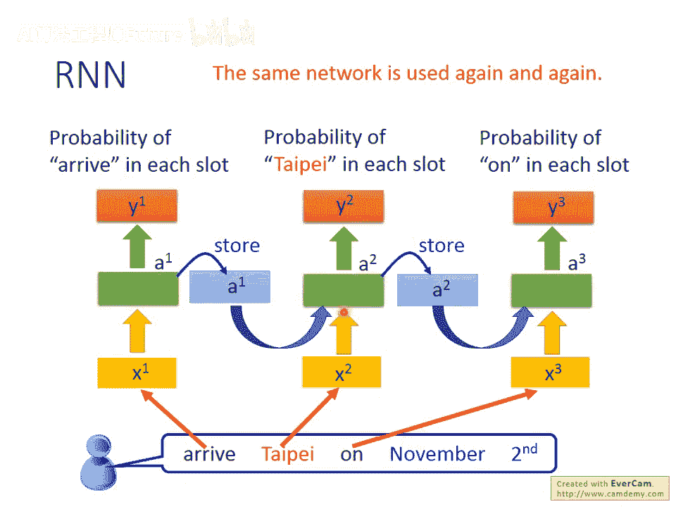
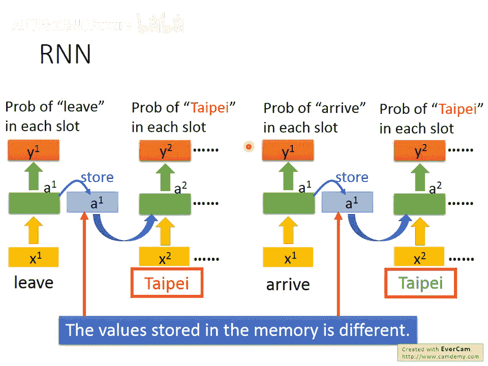
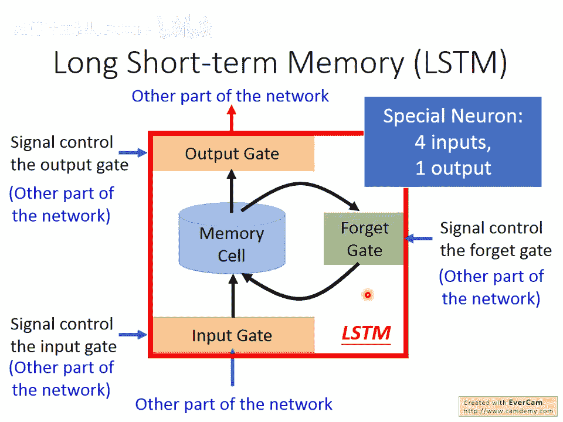
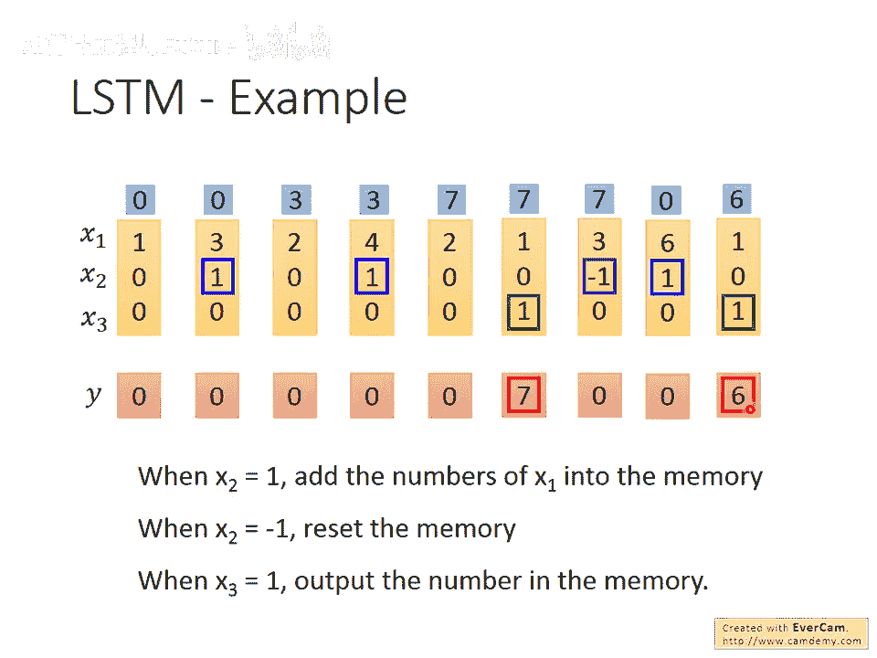
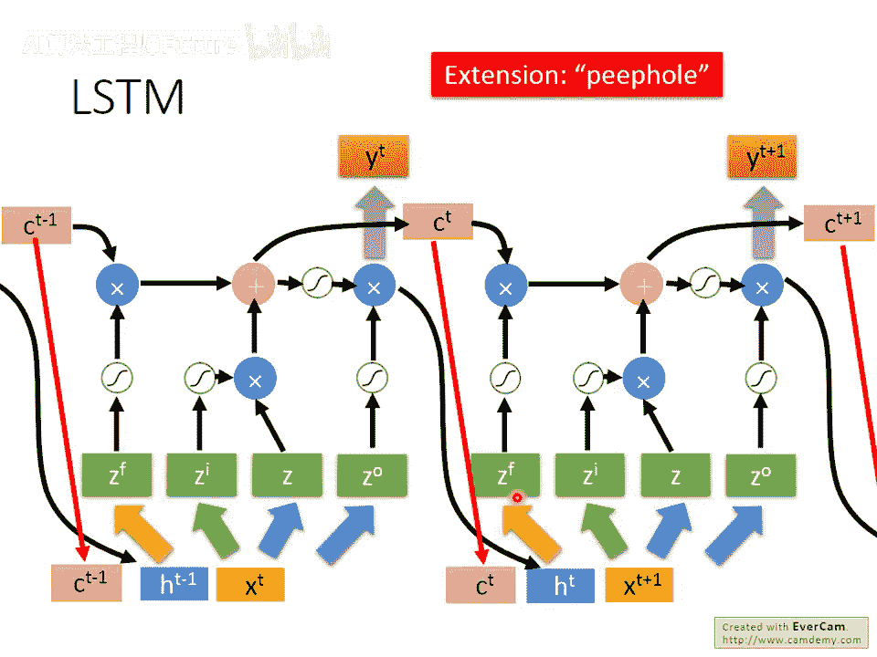
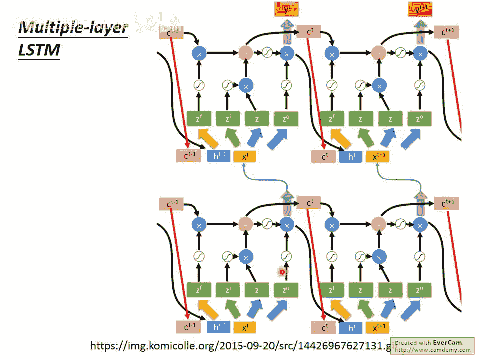
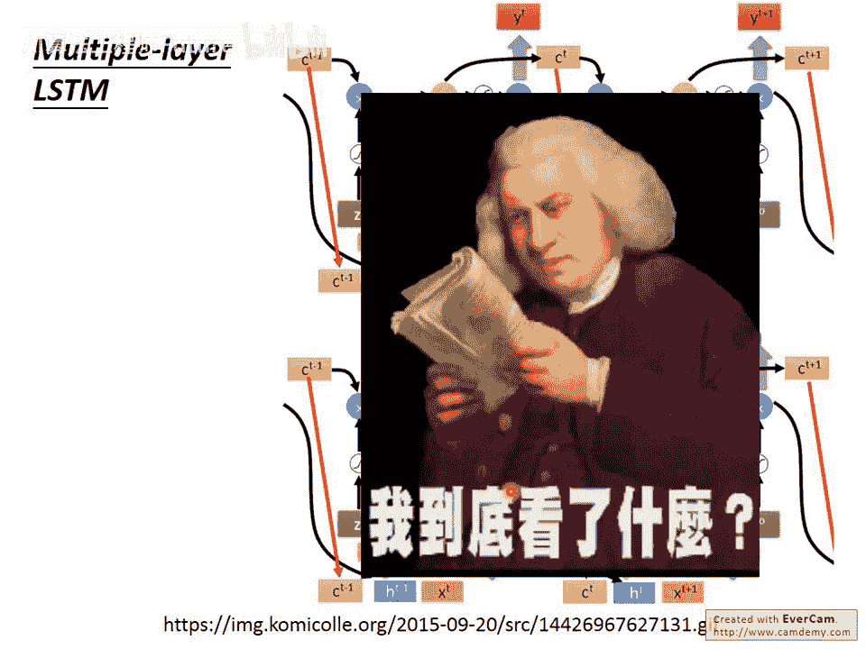
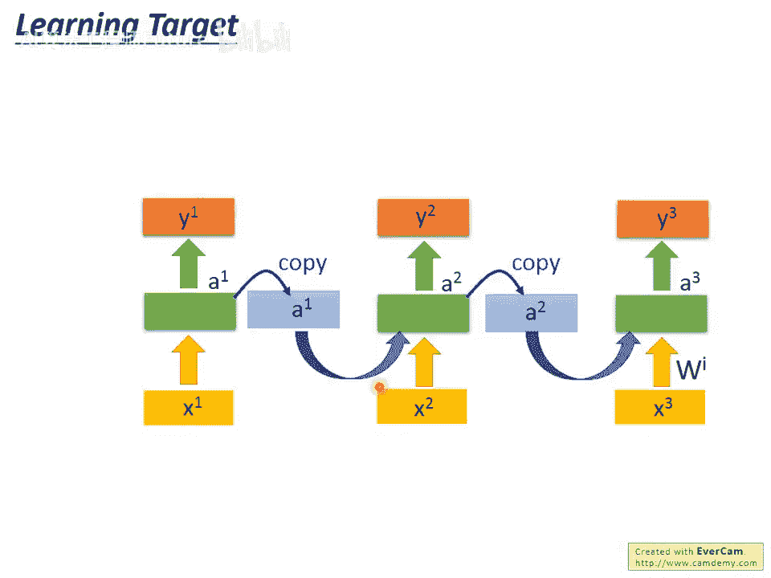

# 31：3-选修-RNN-1 🧠

在本节课中，我们将要学习循环神经网络（Recurrent Neural Network, RNN）的基本概念。我们将了解为什么在处理序列数据时，需要具有记忆能力的神经网络，并详细探讨RNN的工作原理及其在槽位填充（Slot Filling）任务中的应用。

---

## 概述：为什么需要RNN？

在上一节中，我们介绍了序列标注任务。本节中我们来看看一个具体的应用——槽位填充。例如，在一个智能订票系统中，用户说“I would like to arrive Taipei on November 2nd”，系统需要自动识别出“Taipei”属于**目的地（destination）**槽位，“November 2nd”属于**抵达时间（time of arrival）**槽位。

一个直观的想法是使用前馈神经网络（Feedforward Neural Network）。我们需要将每个单词转换为一个向量（例如通过独热编码或词向量），然后输入网络，输出是该词属于各个槽位的概率分布。

**公式：单词向量化**

- 独热编码：`vector = [0, 0, ..., 1, ..., 0]`
- 词向量：`vector = [0.1, -0.2, ..., 0.5]`

然而，前馈神经网络存在一个根本问题：**相同的输入总是产生相同的输出**。考虑以下两个句子：

1. “arrive Taipei on November 2nd” – “Taipei” 是目的地。
2. “leave Taipei on November 2nd” – “Taipei” 是出发地。

对于神经网络，输入“Taipei”的向量是相同的，因此它无法根据上下文判断其角色。要解决这个问题，我们需要网络具备**记忆力**，能够记住之前看到过的词汇。这种具有记忆力的神经网络就是**循环神经网络（RNN）**。

---

## RNN的基本原理

在RNN中，隐藏层（hidden layer）的神经元在产生输出时，这个输出会被存储到**记忆单元（memory）**中。当下一次有输入时，神经元不仅会考虑当前的输入`(x1, x2)`，还会考虑存储在记忆单元中的值`(a1, a2)`。这使得RNN的输出不仅取决于当前输入，还取决于过去的“记忆”。

为了更清晰地理解，我们来看一个具体的计算例子。

假设我们的网络所有权重都是1，没有偏置，激活函数是线性的。记忆单元的初始值为`[0, 0]`。我们输入一个序列 `[1, 1], [1, 1], [2, 2]`。

以下是计算步骤：

1. **第一次输入 `[1, 1]`**：
  
  绿色神经元输入：`1, 1, 0, 0`，输出：`1+1+0+0 = 2`。
  红色神经元输入：`2, 2`，输出：`2+2 = 4`。
  **记忆更新为 `[2, 2]`**。
2. **第二次输入 `[1, 1]`**：
  
  绿色神经元输入：`1, 1, 2, 2`，输出：`1+1+2+2 = 6`。
  红色神经元输出：`6+6 = 12`。
  **记忆更新为 `[6, 6]`**。
3. **第三次输入 `[2, 2]`**：
  
  绿色神经元输入：`2, 2, 6, 6`，输出：`2+2+6+6 = 16`。
  红色神经元输出：`16+16 = 32`。

**关键点**：

- RNN对**相同的输入**（如两次`[1,1]`）可以产生**不同的输出**（第一次输出4，第二次输出12），因为记忆单元中的值发生了变化。
- RNN会考虑输入序列的**顺序**。如果调换输入顺序，输出会完全不同。

---

## RNN处理槽位填充

现在，我们看看如何用RNN处理槽位填充任务。以句子“arrive Taipei on November 2nd”为例：

以下是处理流程：

1. 输入“arrive”的向量，隐藏层产生输出 `a1`，并根据 `a1` 生成 `y1`（`arrive`属于各槽位的概率）。`a1` 被存入记忆。
2. 输入“Taipei”的向量，隐藏层同时考虑该向量和记忆中的 `a1`，产生输出 `a2`，再生成 `y2`（`Taipei`属于各槽位的概率）。`a2` 被存入记忆。
3. 以此类推处理后续词汇。

**重要提示**：图中的三个网络实际上是**同一个网络在不同时间点被使用了三次**。图中用相同颜色标注了相同的权重。

正是由于这种记忆机制，当“Taipei”前面是“arrive”时，记忆中的值会引导网络将其分类为目的地；当“Taipei”前面是“leave”时，不同的记忆值会引导网络将其分类为出发地。

---

## RNN的架构变体

基本的RNN架构可以进行多种扩展。

### 深度RNN

我们之前看到的RNN只有一个隐藏层。RNN也可以是**深度（Deep）**的，即包含多个隐藏层。每一层隐藏层的输出都会被存入其对应的记忆单元，并在下一个时间点被同一层的神经元读取。

### Jordan Network

我们之前介绍的、将隐藏层输出存入记忆的架构称为 **Elman Network**。  

另一种变体是 **Jordan Network**，它将整个网络的**最终输出值**存入记忆，并在下一个时间点读入。据说Jordan Network有时性能更好，因为输出值有明确的目标（target），网络能更清楚地知道该记住什么。

### 双向RNN

标准的RNN是从句首读到句尾。**双向RNN（Bidirectional RNN）** 则同时训练一个正向（从首到尾）和一个逆向（从尾到首）的RNN。在产生每个时间点的输出时，会同时结合正向和逆向网络在该点的隐藏层信息。

**优势**：网络在决策时能看到更完整的上下文信息。例如在槽位填充中，网络是看了整个句子后才决定每个词的槽位，这通常比只看前半部分句子效果更好。

---

## 长短期记忆网络（LSTM）

我们之前讨论的RNN是最简单的版本，其记忆单元可以随时读写。现在更常用的是**长短期记忆网络（Long Short-Term Memory, LSTM）**，它是RNN的一种强大变体。

LSTM的记忆单元更为复杂，它有三个“门”来控制信息的流动：

1. **输入门（Input Gate）**：控制外界信息能否写入记忆单元。
2. **输出门（Output Gate）**：控制记忆单元中的信息能否被读取出来。
3. **遗忘门（Forget Gate）**：控制记忆单元中的信息是否要被保留或清除。

这些门是打开还是关闭，是由网络自己学习决定的。

一个LSTM单元有四个输入（对应想要写入的信息、操控三个门的信号）和一个输出。其内部运算可以简化为以下过程（假设当前记忆值为 `C`）：

- 计算候选值：`g(z)`
- 计算各门控信号：`f(zi)`, `f(zf)`, `f(zo)` （通常使用Sigmoid函数，值在0到1之间）
- 更新记忆：`C’ = C * f(zf) + g(z) * f(zi)`
- 计算输出：`output = h(C’) * f(zo)`

**注意**：“遗忘门”打开（值接近1）时代表**保留**记忆；关闭（值接近0）时代表**清除**记忆。这个名字可能有些反直觉。

### LSTM运作示例

为了直观理解，我们看一个简化例子。假设一个LSTM单元，其输入是三维向量 `[x1, x2, x3]`，规则如下：

- 当 `x2=1` 时，`x1` 的值被写入记忆。
- 当 `x2=-1` 时，记忆被重置（遗忘）。
- 当 `x3=1` 时，输出门打开，可以读取记忆值。

给定输入序列：`[3,1,0]`, `[4,1,0]`, `[2,0,0]`, `[1,0,1]`, `[3,-1,0]`

- 输入`[3,1,0]`：写入3，记忆=3，输出门关，输出0。
- 输入`[4,1,0]`：写入4，记忆=3+4=7，输出门关，输出0。
- 输入`[2,0,0]`：不写入，记忆保持7，输出门关，输出0。
- 输入`[1,0,1]`：不写入，记忆保持7，输出门开，输出7。
- 输入`[3,-1,0]`：遗忘，记忆重置为0，输出门关，输出0。

### LSTM与神经网络的关系

你可以将**一个LSTM单元视为一个复杂的神经元**。在构建网络时，我们只是把简单的神经元换成了LSTM单元。

对于一个LSTM层，当前时间点的输入 `Xt` 会通过四组不同的权重变换，产生四个向量（`Z, Zi, Zf, Zo`），分别作为该层所有LSTM单元的输入值、输入门、遗忘门和输出门的控制信号。

**参数量**：由于需要四组变换，在神经元数量相同的情况下，LSTM的参数数量大约是普通前馈神经网络的四倍。

真正的LSTM通常还会将前一个时间点的输出 `H` 和记忆状态 `C` 也作为输入，共同参与计算下一个时间点的门控信号和候选值。这使得LSTM的结构看起来非常复杂。

尽管结构复杂，但LSTM在实践中非常有效。如今，当人们提到使用RNN时，通常指的就是使用LSTM。此外，还有一种流行的变体叫**门控循环单元（GRU）**，它简化了LSTM（只有两个门），参数更少，性能却相近。

在Keras等深度学习框架中，你可以轻松调用`LSTM`或`GRU`层。如果你想要使用最简单的RNN，则需要指定`SimpleRNN`。

---

## 总结 🎯

本节课中我们一起学习了循环神经网络的核心知识：

1. **RNN的动机**：为了解决前馈网络无法处理序列上下文依赖的问题，RNN引入了记忆机制。
2. **RNN基本原理**：隐藏层的输出会被存入记忆，并影响下一个时间点的计算，使得网络输出依赖于历史输入。
3. **RNN的应用**：我们以槽位填充为例，展示了RNN如何利用记忆来根据上下文对相同词汇做出不同分类。
4. **RNN的变体**：包括深度RNN、Jordan Network和双向RNN，它们从不同角度增强了网络的能力。
5. **LSTM**：作为RNN的增强版本，LSTM通过输入门、遗忘门和输出门精细地控制长期记忆的读写与保留，有效缓解了简单RNN的梯度问题，成为处理序列任务的实际标准。

理解RNN和LSTM是掌握现代序列建模技术的重要基础。在接下来的课程中，我们将看到它们更强大的应用。
