# 33：图神经网络（GNN）基础：概述与空间方法 🧠

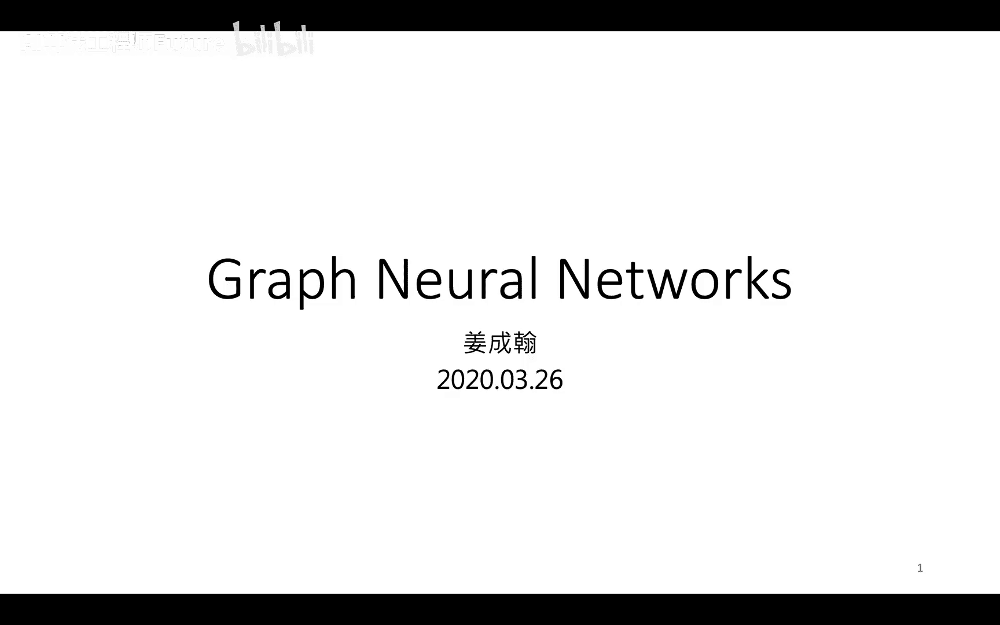

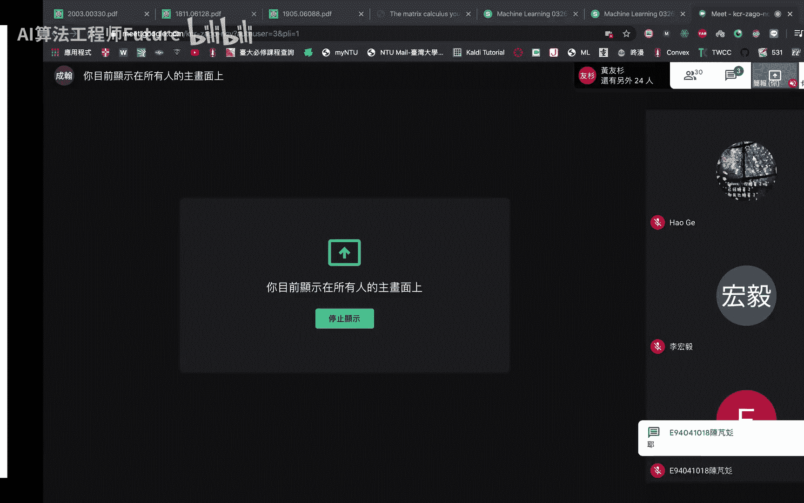

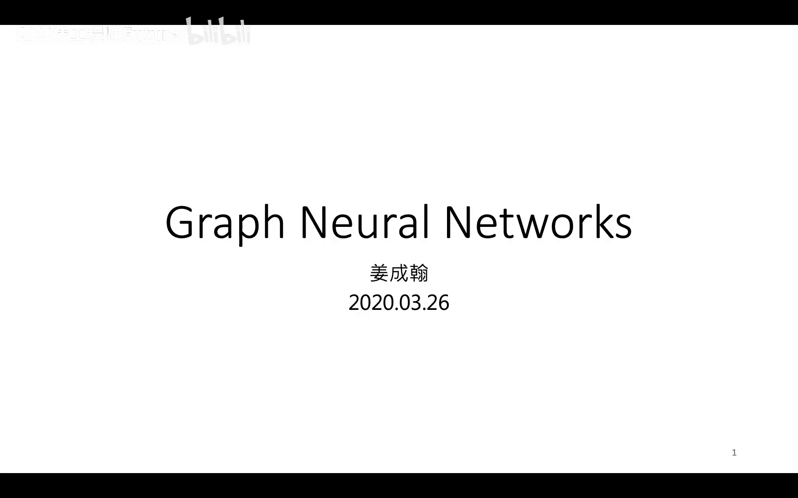

在本节课中，我们将学习图神经网络（Graph Neural Network, GNN）的基本概念，了解其为何重要，并重点介绍基于空间（Spatial-based）的GNN核心方法。我们将从图结构的基本定义开始，逐步深入到如何将神经网络应用于图数据。

---

## 什么是图神经网络？

图神经网络包含两个关键词：**图** 和 **神经网络**。

- **神经网络**：相信各位同学已经熟悉。它可以是简单的多层感知机（MLP），具有输入层、输出层和多个由权重与偏置组成的隐藏层。此外，还有卷积神经网络（CNN）、循环神经网络（RNN）乃至Transformer等更复杂的结构。
- **图**：是一种由**节点**和**边**组成的数据结构。节点和边都可以拥有各自的属性或特征。
  
  例如，在数据结构中的红黑树、化学中的分子结构、生物信息学中的蛋白质相互作用网络，乃至日常生活中的地铁线路图，都可以视为图。

图神经网络要解决的核心问题是：**如何将图结构数据（包含节点特征、边特征和连接关系）有效地输入到神经网络模型中，并让模型能够理解这种结构信息。**

---

## 为什么需要图神经网络？

图神经网络可以处理多种任务，其应用不仅限于直观的图数据。

1. **图分类**：例如，给定一系列分子结构图，预测该分子是否会导致突变。这是一个有监督的分类问题。
2. **图生成**：例如，在药物研发中，我们希望模型能生成具有特定属性（如易合成、低成本）的新分子结构，从而节省研发资源。
3. **处理隐含图结构的数据**：许多数据看似不是图，但实体间存在复杂关系，这些关系构成了隐含的图结构。例如，在推理剧中，角色（节点）之间存在家庭、同事、邻居等多种关系（边）。利用这些关系信息，可以更好地对每个角色进行分类（如判断是否为凶手）。
4. **半监督学习**：当图中只有少量节点有标签，而大部分节点无标签时，可以利用“近朱者赤”的假设，通过节点间的连接关系，借助有标签节点来学习无标签节点的良好表示。

---

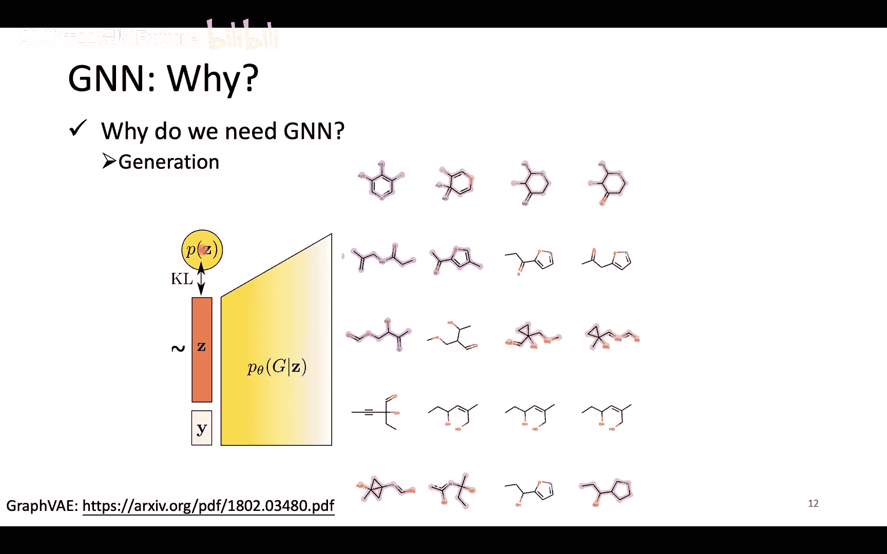

## 如何将卷积思想应用到图上？

在图像处理中，卷积神经网络（CNN）通过卷积核聚合一个像素及其邻居的信息。我们希望能将这种思想推广到图结构上。

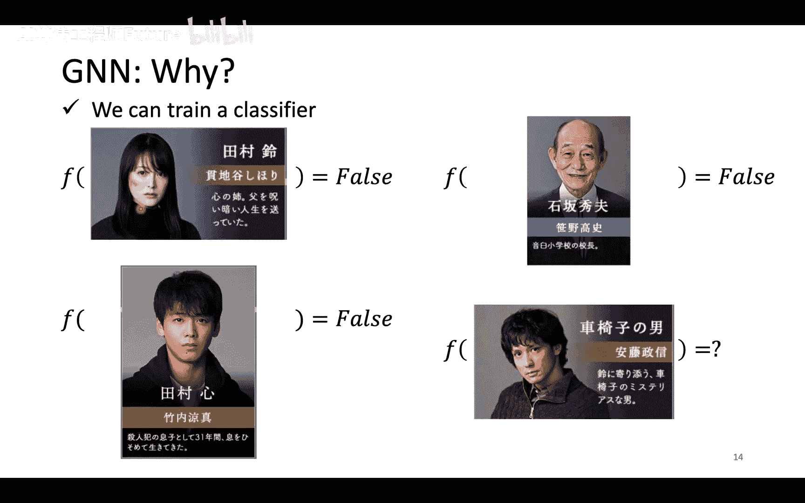

主要有两种思路：

1. **基于空间的方法**：直接在图结构上定义卷积操作，用节点的邻居信息来更新该节点的表示。这是本节课的重点。
2. **基于谱域的方法**：利用图信号处理理论，先将图信号转换到谱域进行处理，再转换回来。这将在后续课程中介绍。

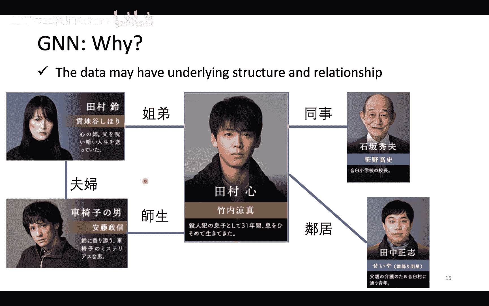

---

## 图神经网络的基本操作

无论采用哪种方法，典型的图神经网络层通常包含两个核心操作：

1. **信息聚合**：对于一个目标节点，聚合其邻居节点的特征信息。
  
  公式可表示为：`h_v^(l+1) = UPDATE( h_v^(l), AGGREGATE( {h_u^(l), ∀ u ∈ N(v)} ) )`
  其中 `h_v^(l)` 是节点 `v` 在第 `l` 层的表示，`N(v)` 是节点 `v` 的邻居集合。
2. **图读出**：在完成所有节点的更新后，若需要对整个图进行预测（如图分类），则需要将所有节点的表示聚合为一个代表整个图的向量。
  
  公式可表示为：`h_G = READOUT( {h_v^(L), ∀ v ∈ V} )`
  其中 `h_G` 是整个图的表示，`L` 是最后一层。

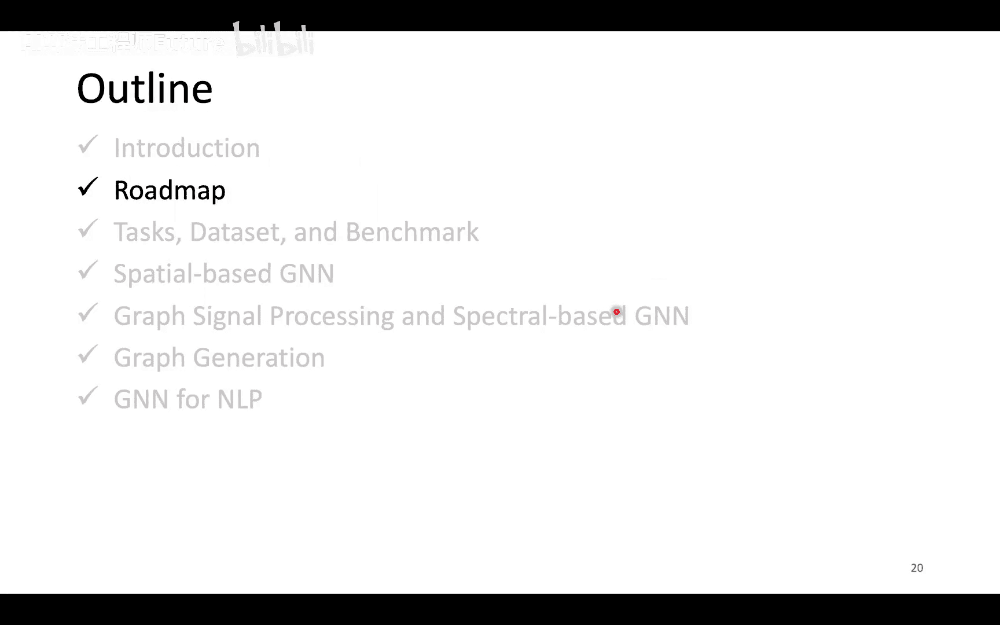

---

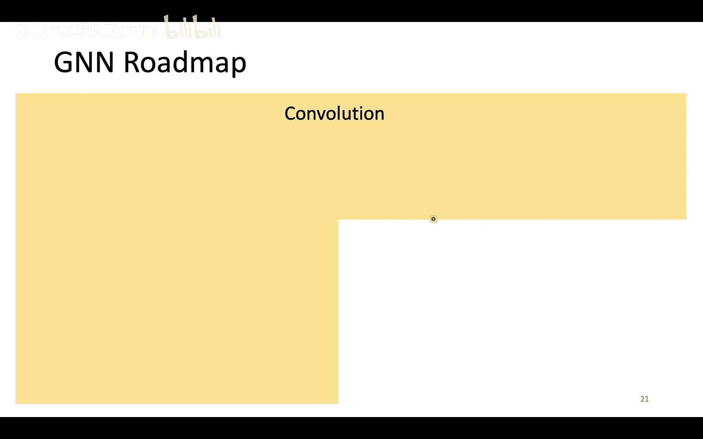

## 基于空间的图神经网络方法

本节我们将介绍几种经典的基于空间的GNN模型，它们的主要区别在于 **信息聚合** 方式的不同。

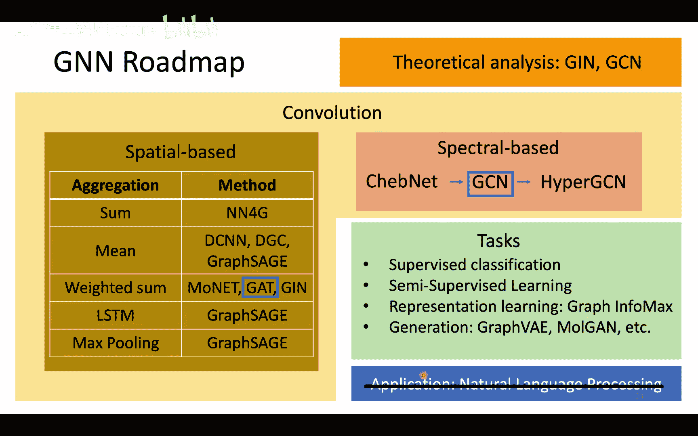

### 模型1：NN4G

NN4G采用了一种直观的聚合方式。

- **聚合方式**：将目标节点的所有邻居节点的特征**求和**，然后与目标节点自身的特征结合，再经过一个变换（如线性层加激活函数）。
- **图读出方式**：将每一层所有节点的特征分别求和，得到每一层的图级表示，然后将各层的图级表示变换后相加，得到最终的图表示。

### 模型2：扩散卷积神经网络

DCNN的聚合基于节点的**距离**。

- **聚合方式**：在第 `k` 层，节点 `v` 的表示由所有与 `v` 距离为 `k` 的节点的特征（来自输入层或第一层）**平均**得到。通过堆叠多层，模型可以聚合多跳邻居的信息。
- **节点表示**：将一个节点在所有层的表示拼接起来，经过变换后作为该节点的最终表示。

### 模型3：混合模型网络

该模型认为邻居的重要性不同，不应简单求和或平均。

- **聚合方式**：根据预定义的节点间“距离”为每个邻居分配权重，然后进行**加权求和**。这个距离可以是节点度的函数（如度的倒数）。

### 模型4：图采样与聚合

GraphSAGE提出了多种聚合器，其中一种有趣的方法是使用**LSTM**。

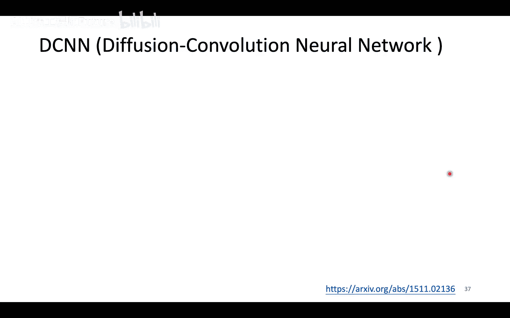

- **聚合方式**：将目标节点的邻居序列随机打乱后，输入一个LSTM，将LSTM最终的隐藏状态作为聚合结果。虽然邻居本无顺序，但通过随机采样和训练，模型可以学习忽略顺序的影响。

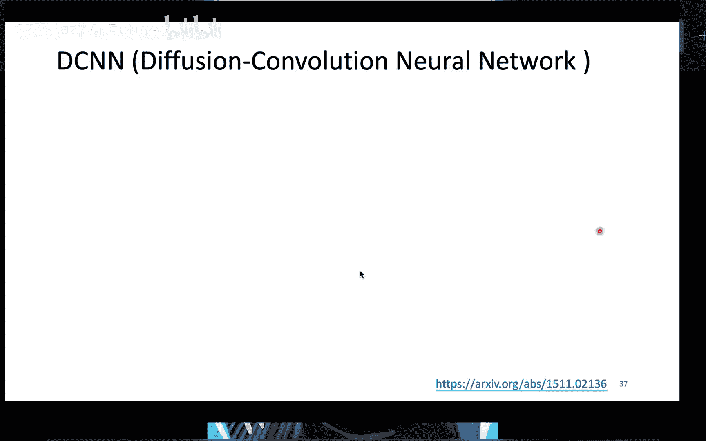

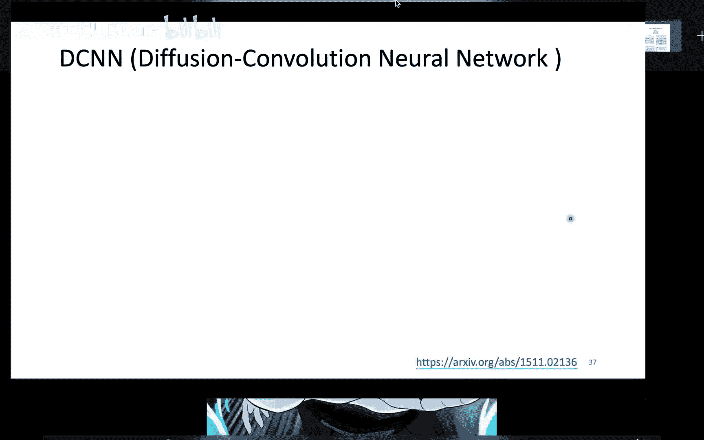

### 模型5：图注意力网络

GAT的核心思想是让模型自己学习邻居的权重，即**注意力机制**。

- **聚合方式**：计算目标节点与其每个邻居节点之间的“注意力系数”，这个系数代表了该邻居对目标节点的重要性。然后使用这些系数对邻居特征进行加权求和。
  
  注意力系数计算通常涉及一个可学习的权重向量 `a`：`e_{ij} = a^T · [Wh_i || Wh_j]`，然后通过softmax归一化得到权重 `α_{ij}`。
- GAT是目前最流行和强大的GNN模型之一。

---

## 理论洞察：图同构网络

GIN从理论层面分析了怎样的聚合函数是强大的。

- **核心结论**：一个强大的GNN层，其聚合函数应能区分不同的图结构。研究表明，使用**求和**作为聚合函数，并结合目标节点自身的表示，可以构建一个与WL图同构测试一样强大的GNN模型。
- **推荐公式**：`h_v^(l+1) = MLP^(l)( (1 + ε) · h_v^(l) + Σ_{u∈N(v)} h_u^(l) )`
  
  其中 `MLP` 是多层感知机，`ε` 是一个可学习或固定为0的参数。
- **为何不用均值或最大值**：在某些图结构下，均值池化和最大值池化会无法区分不同的图（例如，它们可能为不同的图产生相同的聚合结果），而求和池化更具区分性。

---

## 总结

本节课我们一起学习了图神经网络的基础知识。

1. 我们理解了**图**作为一种包含节点和边的数据结构，广泛存在于多种领域。
2. 我们探讨了需要GNN的多种任务，包括**图分类、图生成、关系推理和半监督学习**。
3. 我们学习了GNN的核心操作：**信息聚合**与**图读出**。
4. 我们重点介绍了多种**基于空间**的GNN模型，了解了它们如何以不同方式聚合邻居信息，从简单的求和（NN4G）、基于距离的扩散（DCNN）、加权求和（混合模型）、到使用LSTM（GraphSAGE）和注意力机制（GAT）。
5. 最后，我们通过GIN了解了理论上的最佳实践，即使用**求和**作为聚合函数的核心。

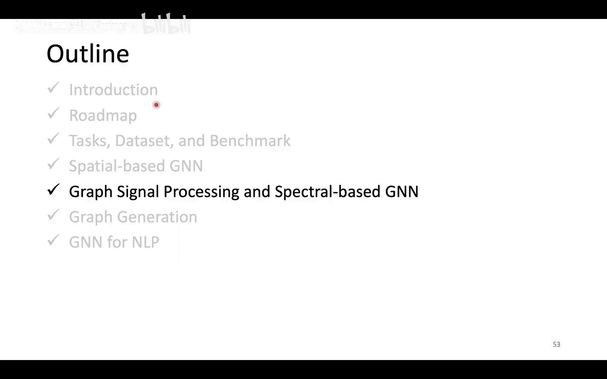

下节课中，我们将继续探索基于谱域的图神经网络方法，并深入了解GNN在各种任务上的应用与评估。
