# 34：6-选修-GNN-2 🧠

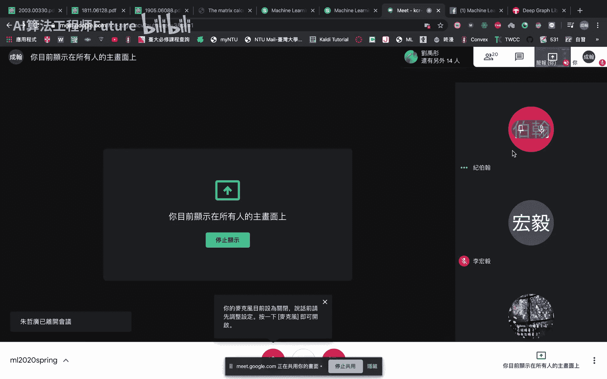

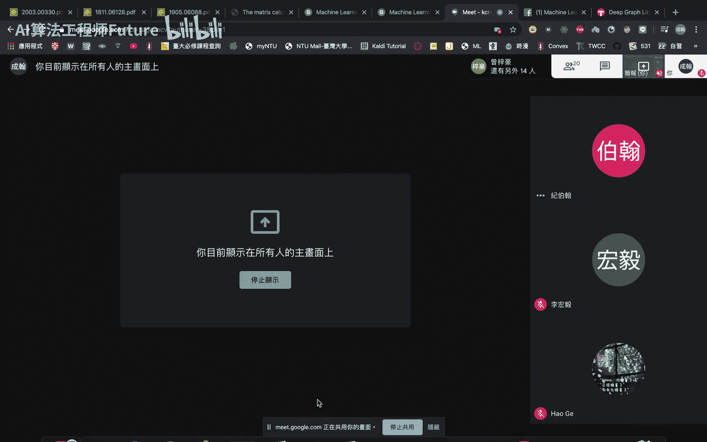

在本节课中，我们将学习图神经网络（GNN）的进阶内容，特别是基于谱域的图神经网络方法。我们将从图信号处理的基础概念开始，逐步推导出谱域图卷积的原理，并介绍两种重要的模型：ChebNet 和 GCN。课程内容旨在让初学者能够理解其背后的核心思想。

---

## 图信号处理基础

上一节我们介绍了图神经网络的基本概念。本节中，我们来看看如何将传统的信号处理概念迁移到图结构上。

在传统信号处理中，卷积操作可以通过傅里叶变换在频域中简化为乘法运算。我们的目标是：在图结构上实现类似的滤波操作。

首先，我们需要定义一些基本概念。

### 图的数学表示

给定一个图 `G = (V, E)`，其中 `V` 是顶点集合，`E` 是边集合。顶点数量 `|V| = N`。

以下是描述图的关键矩阵：

- **邻接矩阵 A**： 表示节点之间的连接关系。如果节点 `i` 和 `j` 之间有边相连，则 `A[i][j]` 为该边的权重（对于无向无权图，通常为1）。否则为0。我们目前只考虑无向图，因此 `A` 是一个对称矩阵。
- **度矩阵 D**： 一个对角矩阵。对角线上的元素 `D[i][i]` 表示节点 `i` 的度（即邻居的数量）。
- **图信号 f**： 图上的每个节点 `v` 可以携带一个标量或向量值，称为该节点上的信号。它可以表示节点的任何特征，例如城市气温、分子中原子的类型等。一个图信号可以表示为一个 `N` 维向量 `f`，其中 `f[i]` 对应节点 `i` 的信号值。

### 图拉普拉斯矩阵

图拉普拉斯矩阵是图信号处理中的核心算子，其定义为：

**L = D - A**

由于 `D` 和 `A` 都是对称矩阵，`L` 也是一个对称矩阵，并且是一个半正定矩阵。这意味着它的所有特征值都大于等于零。

我们可以对 `L` 进行特征分解：

**L = U Λ U^T**

其中：

- **Λ** 是一个对角矩阵，其对角线元素 `λ_0, λ_1, ..., λ_{N-1}` 是 `L` 的特征值。在谱图理论中，这些特征值被解释为图的**频率**。
- **U** 是一个正交矩阵，其每一列 `u_k` 是对应特征值 `λ_k` 的特征向量。这些特征向量构成了图信号的一组**基**。

频率 `λ` 的大小反映了信号变化的剧烈程度。`λ = 0` 对应常数信号（DC分量），`λ` 越大，对应的特征向量在相邻节点间的信号值变化就越剧烈。

---

## 图上的傅里叶变换与滤波

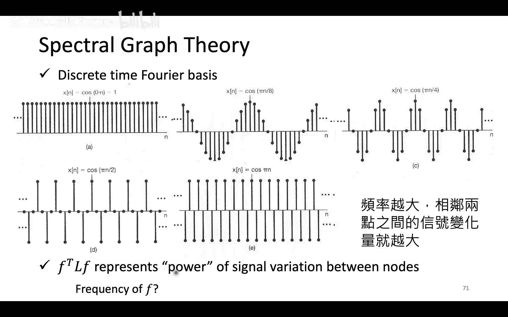

理解了图拉普拉斯矩阵和谱域概念后，我们现在可以定义图上的傅里叶变换。

### 图傅里叶变换

对于一个图信号 `x`（即顶点域的信号），其图傅里叶变换定义为：

**x̂ = U^T x**

这个操作的含义是：将信号 `x` 投影到由特征向量 `u_k` 张成的基上，从而得到信号在谱域（频率域）的表示 `x̂`。`x̂[k]` 表示信号在频率 `λ_k` 上的成分强度，计算方式就是 `x` 与基向量 `u_k` 的内积。

### 图傅里叶逆变换

反之，如果我们有一个谱域的信号 `x̂`，要将其还原回顶点域，则进行图傅里叶逆变换：

**x = U x̂**

这个操作的含义是：将每个频率成分 `λ_k` 的强度 `x̂[k]`，乘以其对应的基向量 `u_k` 在目标节点上的值，然后将所有频率的贡献叠加起来，得到该节点最终的信号值。

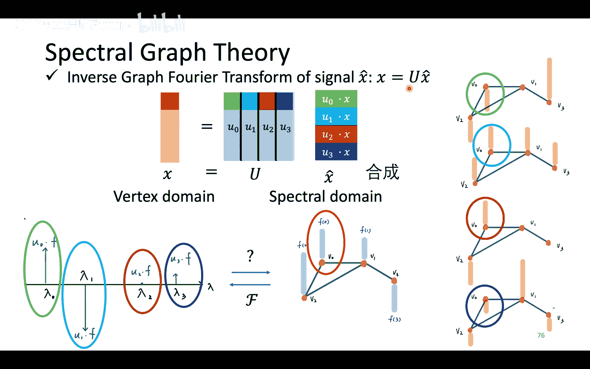

### 在谱域进行滤波

在传统信号处理中，时域卷积等于频域相乘。在图信号处理中，我们采用相同的策略：

1. 将顶点域信号 `x` 通过图傅里叶变换转换到谱域，得到 `x̂`。
2. 在谱域，将 `x̂` 与一个滤波器的频率响应函数 `g_θ(Λ)`（这是一个对角矩阵）相乘，得到滤波后的谱域信号 `ŷ = g_θ(Λ) x̂`。
3. 将 `ŷ` 通过图傅里叶逆变换转换回顶点域，得到最终输出 `y`。

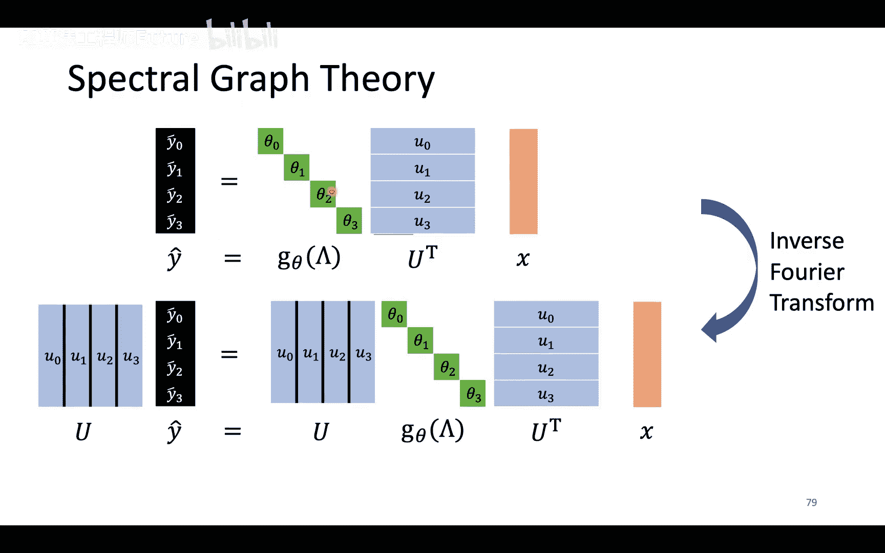

将以上步骤合并，滤波操作可以写为：

**y = U g_θ(Λ) U^T x**

由于 `L = U Λ U^T`，我们可以将滤波器 `g_θ` 视为图拉普拉斯矩阵 `L` 的一个函数：

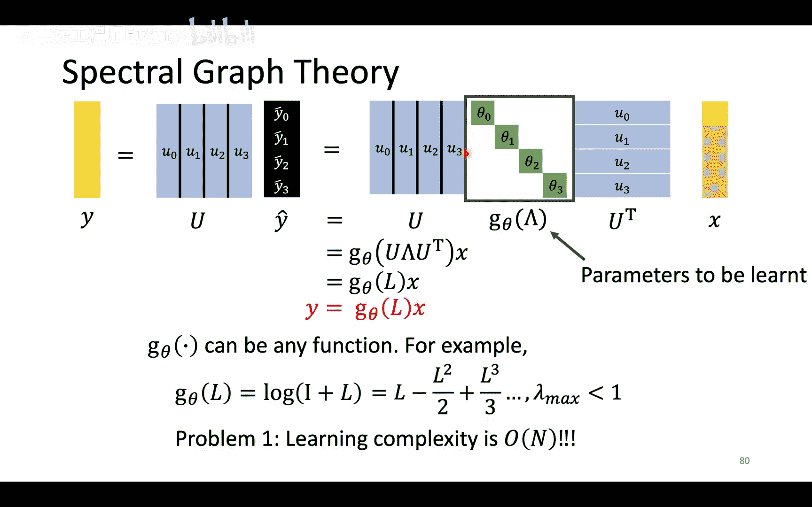

**y = g_θ(L) x**

我们的目标就是学习这个滤波器函数 `g_θ`。

---

## 谱域图卷积网络模型

直接学习一个作用于整个谱 `Λ` 的滤波器 `g_θ(Λ)` 存在两个主要问题：

1. **参数复杂度高**： 需要学习的参数数量与节点数 `N` 成正比，对于大图不现实。
2. **非局部化**： 这样的滤波器会作用在整个图上，无法像CNN的卷积核那样只关注局部邻域。

为了解决这些问题，研究者提出了以下模型。

### ChebNet：使用多项式滤波器

ChebNet 的核心思想是将滤波器 `g_θ(L)` 限制为拉普拉斯矩阵 `L` 的 `K` 阶多项式：

**g_θ(L) = Σ_{k=0}^{K} θ_k L^k**

这样做的好处是：

- **局部化**： `L^k` 的作用范围是 `k` 跳邻居。当 `K` 固定时，滤波操作是 `K`-局部化的。
- **参数共享**： 需要学习的参数只有多项式系数 `{θ_0, ..., θ_K}`，数量为 `K+1`，与图大小 `N` 无关。

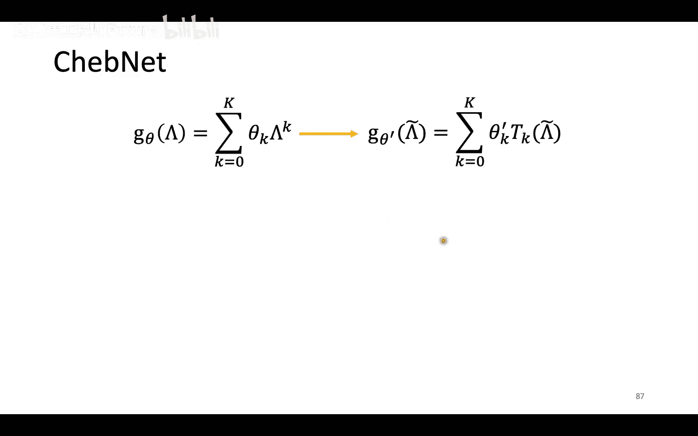

然而，直接计算 `L^k` 的复杂度是 `O(N^2)`。ChebNet 使用**切比雪夫多项式**进行参数化，以递归方式高效计算 `L^k x`，将复杂度降至 `O(K|E|)`，其中 `|E|` 是边数。

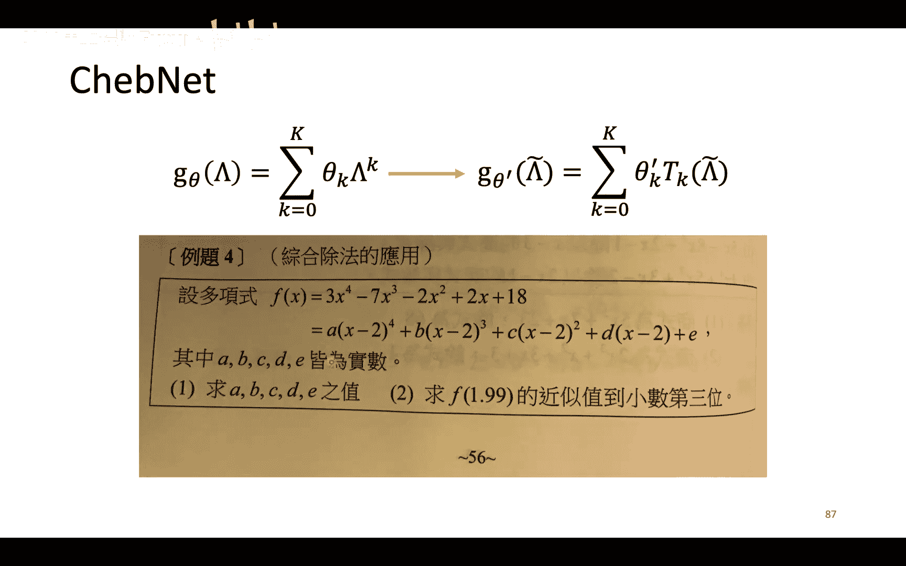

以下是 ChebNet 滤波操作的计算过程：

1. 定义缩放后的拉普拉斯矩阵 `L̃`，使其特征值范围在 `[-1, 1]` 之间。
2. 使用切比雪夫多项式递归地计算一组信号：
  
  `x̃_(0) = x`
  `x̃_(1) = L̃ x`
  `x̃_(k) = 2 L̃ x̃_(k-1) - x̃_(k-2)`，对于 `k >= 2`
3. 滤波输出为这些信号的加权和：  
  
  **y = Σ_{k=0}^{K} θ_k x̃_(k)**

通过这种方式，ChebNet 实现了高效、局部化的谱图卷积。

### GCN：一种简化的特例

图卷积网络（GCN）可以看作是 ChebNet 的一个特例和简化，它因其简单高效而非常流行。

我们从 ChebNet 出发，进行一系列近似和简化：

1. 将多项式阶数限制为 `K=1`。
2. 假设缩放后的拉普拉斯矩阵 `L̃ ≈ I - D^{-1/2} A D^{-1/2}`（对称归一化拉普拉斯矩阵）。
3. 进一步引入一个“重归一化技巧”（Renormalization Trick）：将 `A` 加上自环得到 `Ã = A + I`，相应地 `D̃` 是 `Ã` 的度矩阵。
4. 对参数进行约束和简化。

经过这些步骤，GCN 单层的传播规则可以推导为一个非常直观的形式：

**H^{(l+1)} = σ( D̃^{-1/2} Ã D̃^{-1/2} H^{(l)} W^{(l)} )**

其中：

- `H^{(l)}` 是第 `l` 层的节点特征矩阵。
- `W^{(l)}` 是该层可学习的权重矩阵。
- `σ` 是非线性激活函数。
- `D̃^{-1/2} Ã D̃^{-1/2}` 是对邻接矩阵的对称归一化。

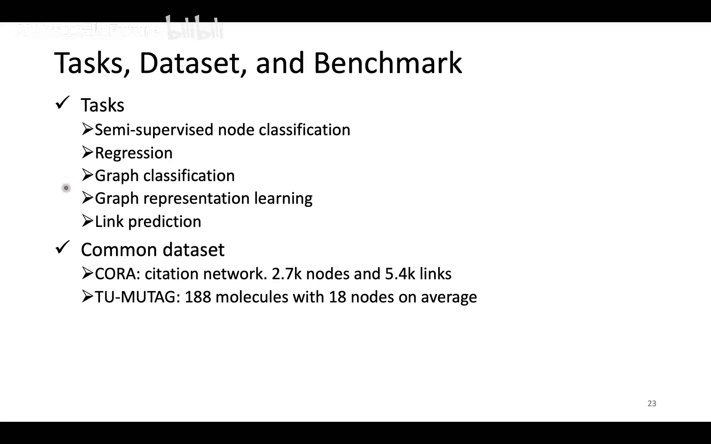

**这个公式的直观解释是**：为了更新一个节点的特征，我们将其所有邻居节点（包括自身）的当前特征聚合起来，取平均（或加权平均），然后经过一个线性变换和非线性激活。

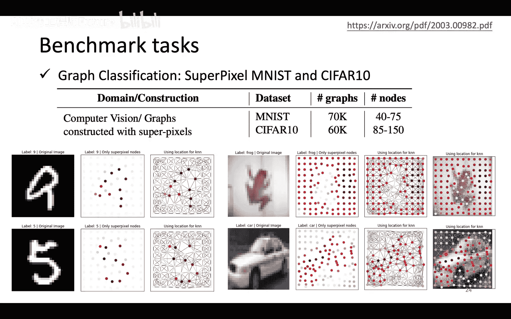

尽管 GCN 源自谱域方法，但其最终形式简单，完全可以在空间域进行理解和实现，这也是它被广泛使用的原因。

---

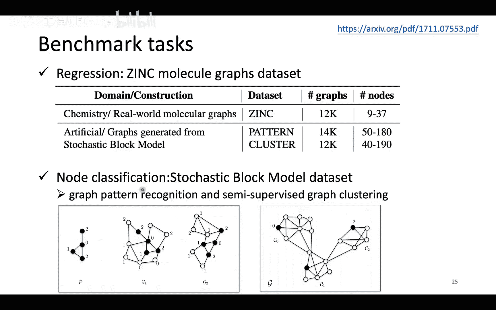

## 模型比较与挑战

我们介绍了多种 GNN 模型。在实际任务中，它们的表现如何呢？

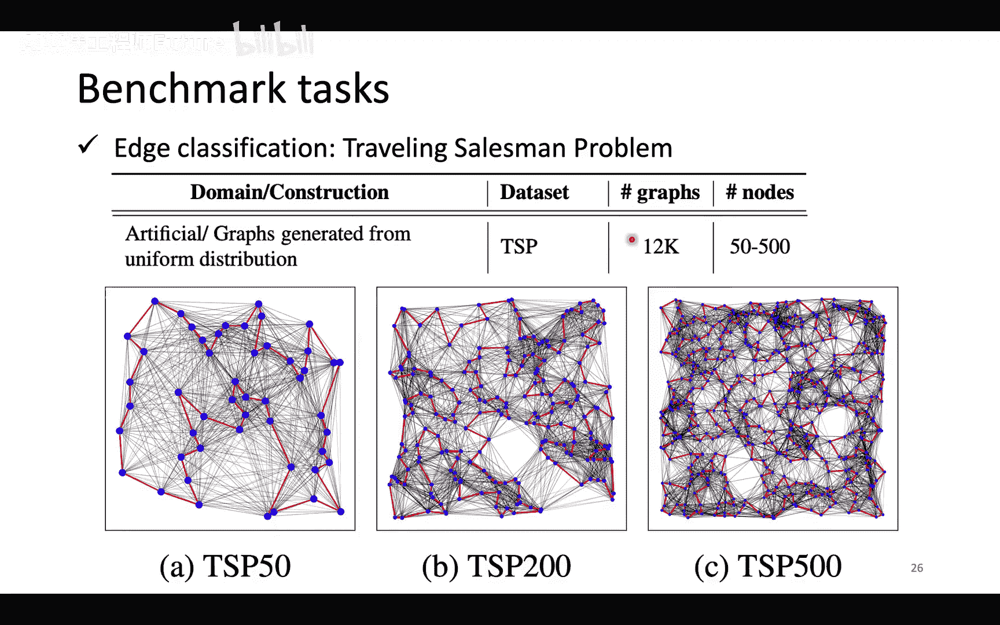

以下是几个常见的图学习基准任务：

1. **图分类**： 例如，将 MNIST 图像转化为超像素图后进行图像分类。
2. **图回归**： 例如，预测分子的化学性质（如溶解度）。
3. **节点分类**： 例如，在合成图或引文网络中预测节点类别。
4. **边分类**： 例如，在旅行商问题（TSP）中判断一条边是否在最优路径上。

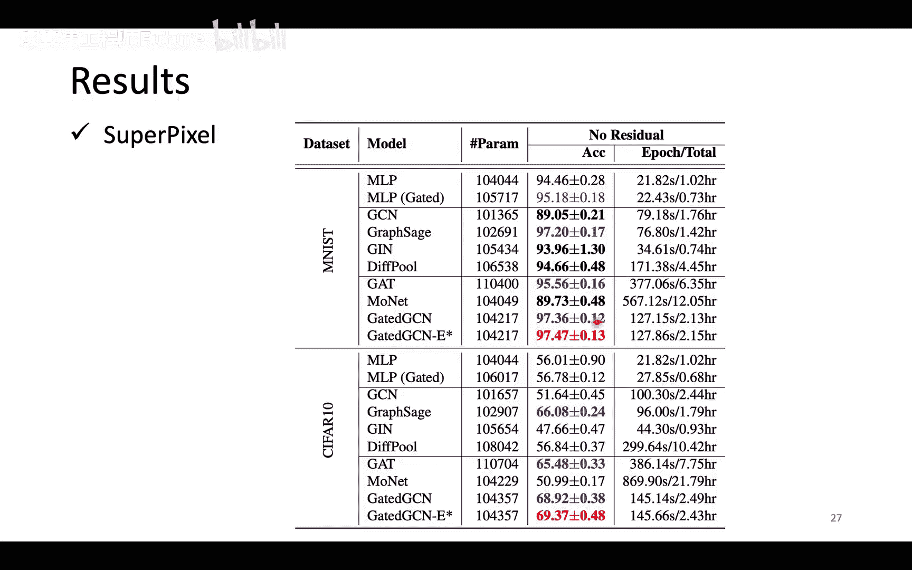

综合多个基准测试的结果表明：

- 朴素的 GCN 模型表现通常不是最优的。
- 引入了注意力机制的图注意力网络（GAT）和 Graph Isomorphism Network (GIN) 等模型往往表现更好。
- 结合了多种机制的模型（如 GatedGCN）通常在多项任务中领先。

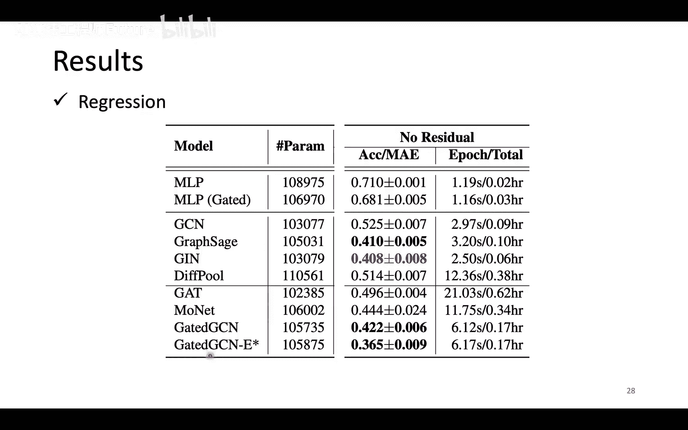

### GCN 的深度问题

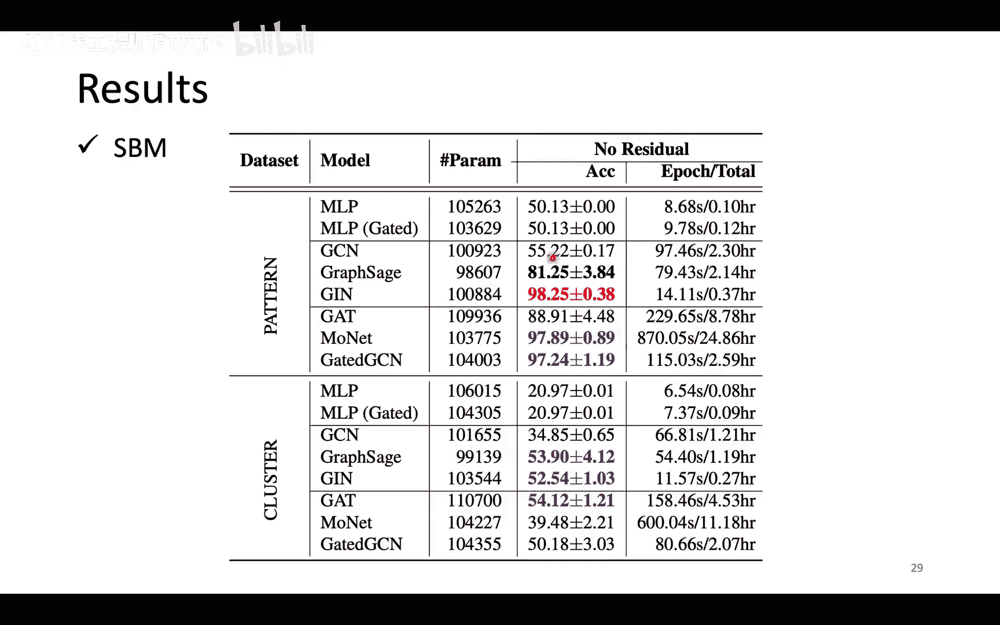

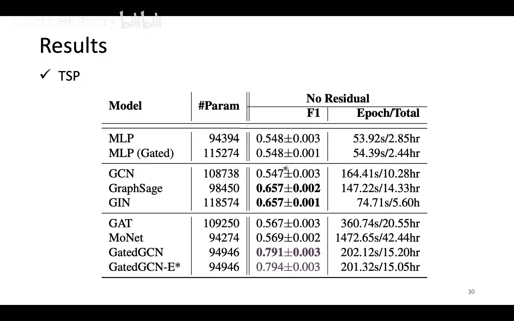

GCN 面临一个严峻挑战：**层数加深时，性能会急剧下降**。这是因为多次的邻域聚合操作会导致图中不同节点的特征趋向于一致，即出现过平滑现象。这使得深层 GCN 难以捕获远距离的依赖关系。

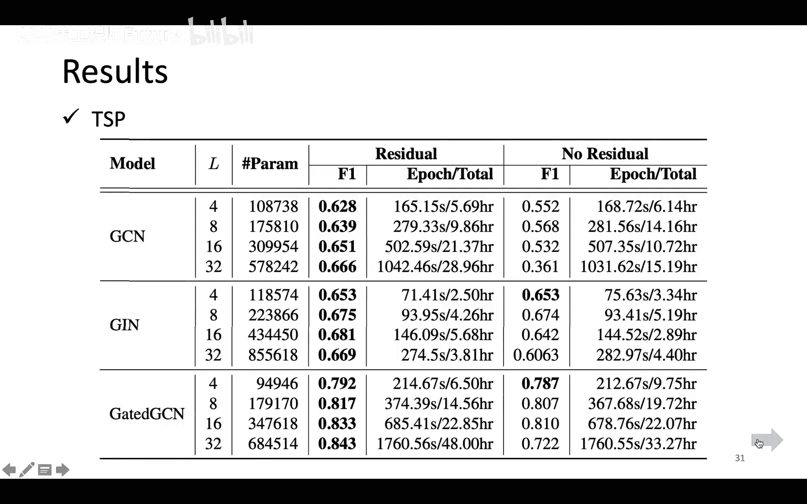

一些缓解方法包括：

- 使用残差连接。
- 随机丢弃边（DropEdge），在聚合时随机屏蔽一部分邻居，增加多样性。

---

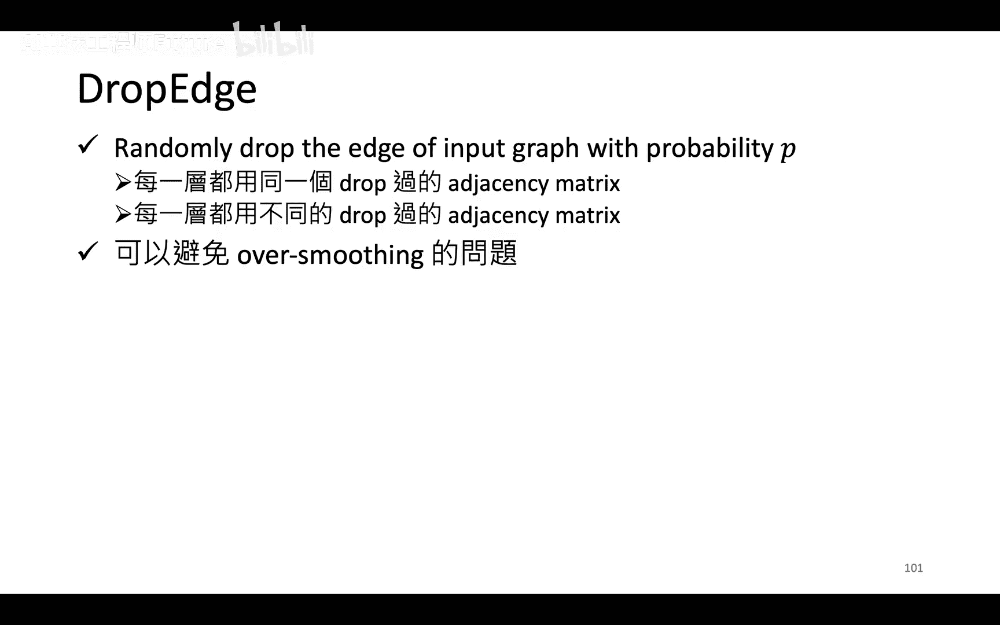

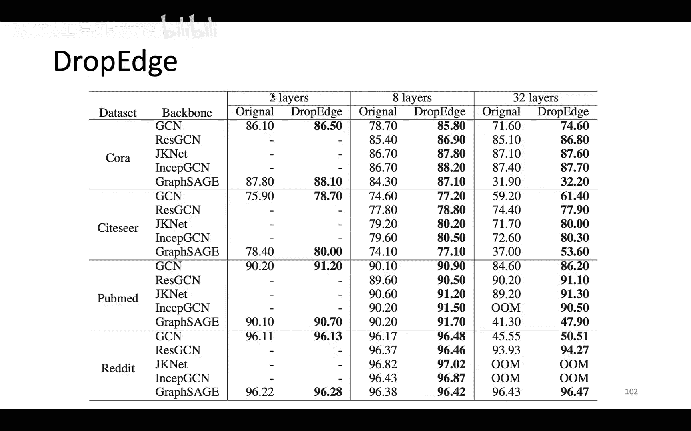

## 总结与展望

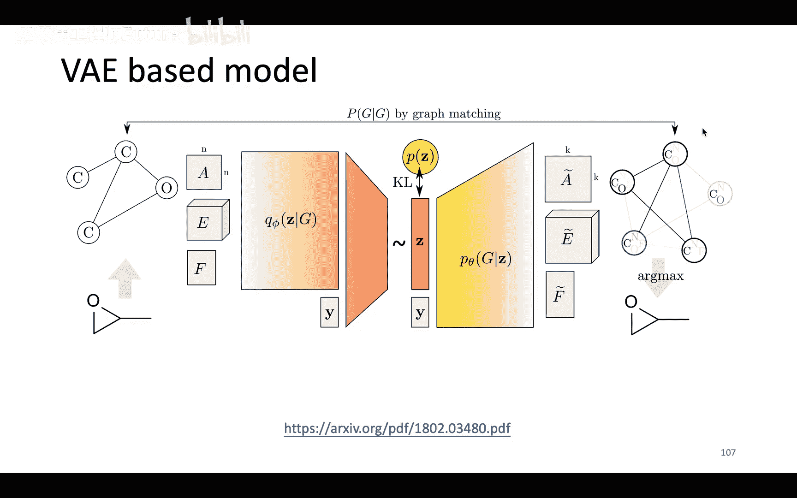

本节课中我们一起学习了图神经网络的谱域方法。

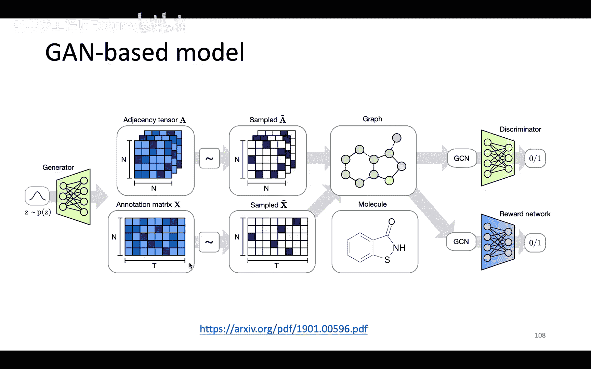

我们首先介绍了图信号处理的基础，包括图拉普拉斯矩阵、特征分解以及图上傅里叶变换的定义。这为我们理解谱域卷积奠定了数学基础。

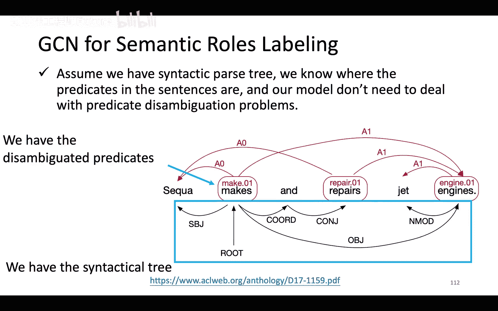

接着，我们探讨了如何在谱域定义滤波操作，并指出了直接方法的局限性。为了克服这些局限，我们学习了两种重要的谱域图卷积模型：

1. **ChebNet**： 使用切比雪夫多项式作为拉普拉斯矩阵的滤波器，实现了局部化和高效计算。
2. **GCN**： 作为 ChebNet 的简化特例，其传播规则具有直观的空间意义——聚合邻居信息，成为最流行的 GNN 模型之一。

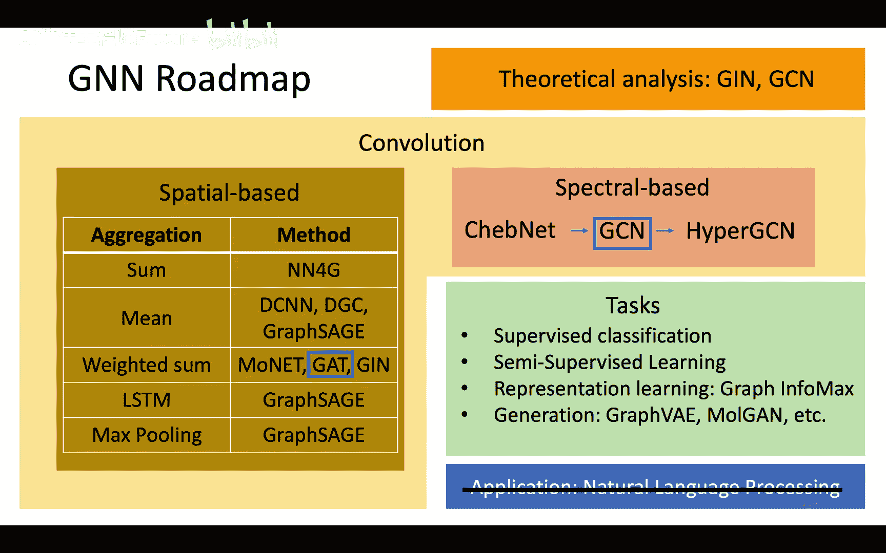

最后，我们通过基准测试了解了不同模型的性能对比，并讨论了 GCN 模型在加深时遇到的过平滑问题及其缓解思路。

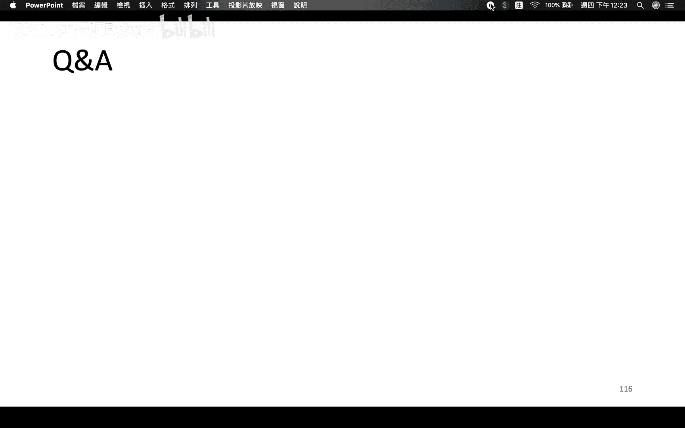

当前，图神经网络的研究非常活跃，趋势包括将其他深度学习领域的成功思想（如 Transformer、对比学习）与图结构结合，以及将 GNN 应用于更广泛的结构化数据问题。尽管 GCN 的理论基础源于谱域，但其简单强大的空间操作形式使其成为实践中不可或缺的工具。
