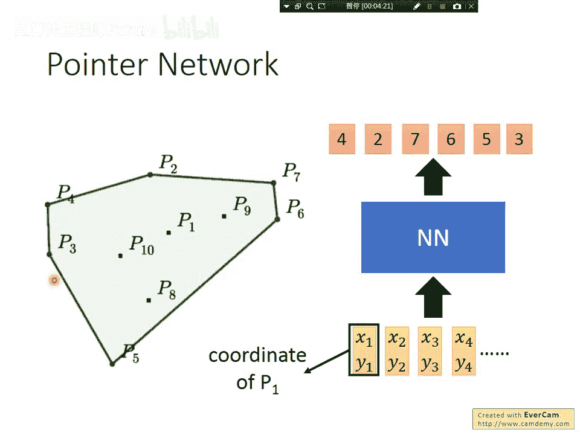
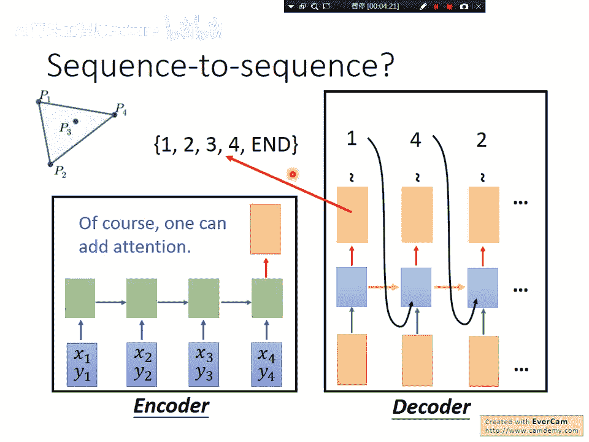
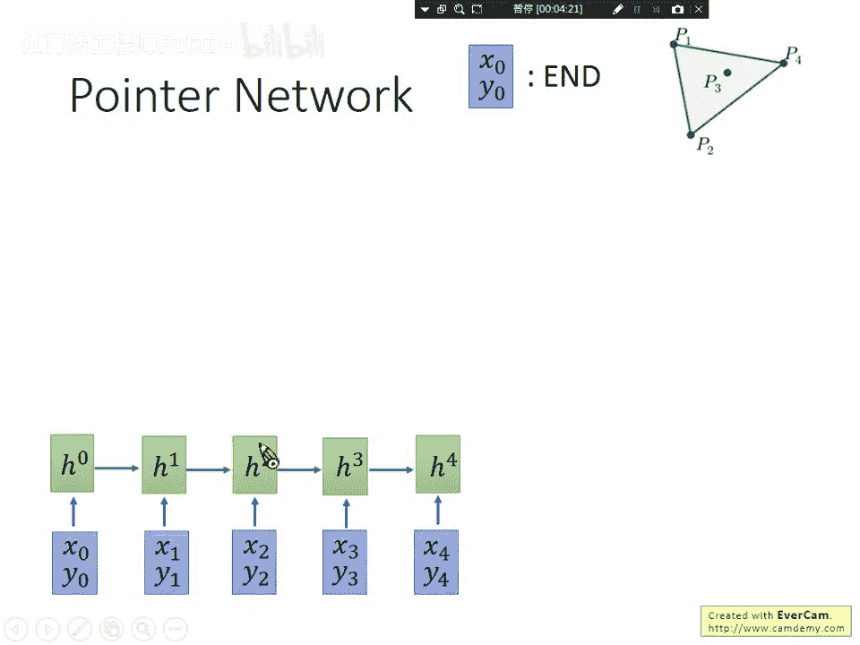
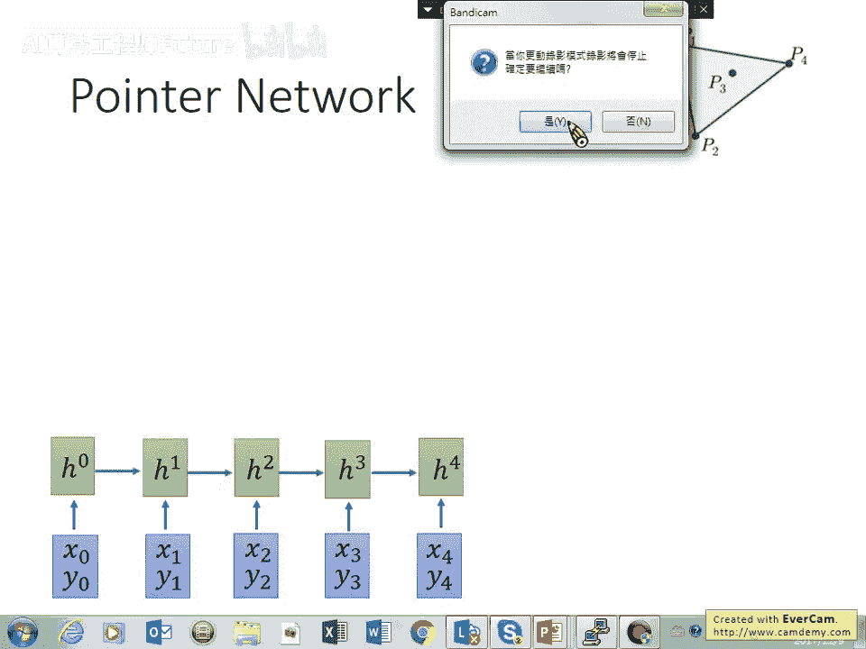
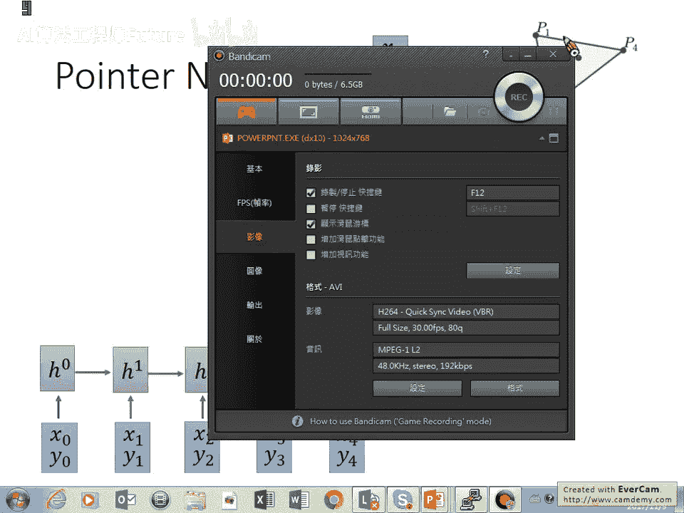
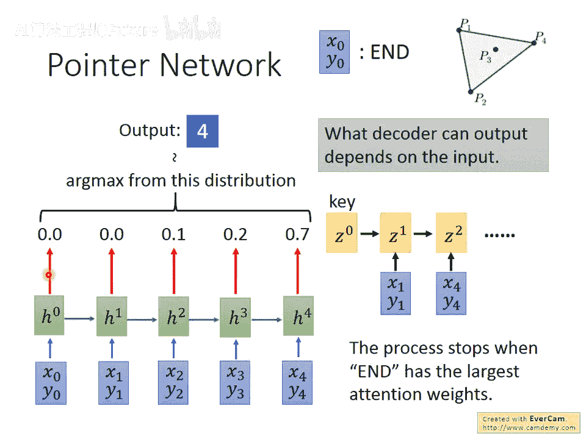
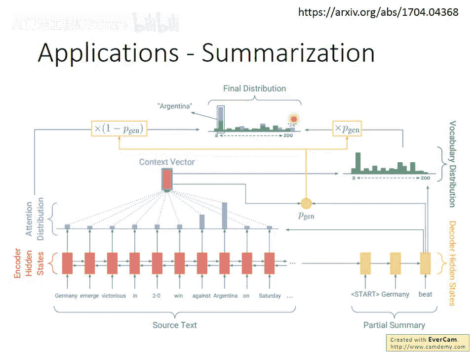
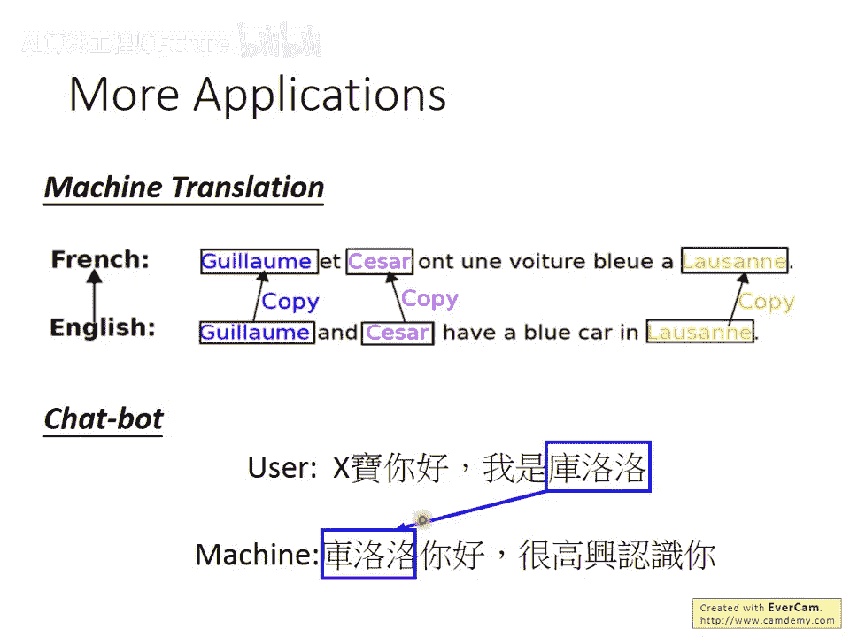

# 40：5-选修-指针网络(Pointer Network) 🧠➡️👆

## 概述

在本节课中，我们将要学习一种特殊的神经网络结构——指针网络。我们将了解它要解决的核心问题、其工作原理、以及它如何被应用于摘要生成、翻译和聊天机器人等实际任务中。

---

## 指针网络要解决的问题

指针网络最初被应用于解决一系列“硬编码一发”的算法问题。在其原始论文中，它被用来解决诸如“凸包”等问题。

凸包问题的描述是：给定一系列数据点，需要找出哪些点连接起来后，可以将所有其他点包含在内。这是一个算法问题，但指针网络试图用神经网络直接解决。

**输入**：一系列数据点的坐标（例如，10个二维向量）。  

**输出**：一个序列（例如 `4, 2, 7, 6, 5, 3`），这个序列指示了构成凸包的那些点的顺序。

训练时，需要准备大量带有正确答案（即凸包点序列）的数据，然后训练神经网络，希望它能在新的数据点上同样有效。

---

## 为何不能直接用Seq2Seq模型？

上一节我们介绍了指针网络要解决的问题。本节中我们来看看，为什么传统的序列到序列模型无法很好地解决这类问题。

理论上，我们可以将输入（数据点序列）和输出（点索引序列）视为序列到序列学习问题。编码器读取输入点，解码器逐个生成输出索引（如1, 4, 2...），直到生成结束符。

然而，这种方法行不通。原因在于解码器的输出词汇表是固定的。如果训练时输入最多50个点，那么解码器只能输出1到50的索引以及结束符。在测试时，如果输入了100个点，模型将永远无法输出编号51到100的点。

因此，我们需要一种能够根据输入动态决定输出词汇表大小的方法。

---

## 指针网络的工作原理

上一节我们分析了传统Seq2Seq的局限性。本节中，我们将看到指针网络如何通过对注意力机制进行改造来解决这个问题。

指针网络的核心思想是：**让模型的输出直接“指向”输入序列中的某个位置**，而不是从一个固定的词汇表中生成内容。

以下是其工作步骤的简要说明：

1. **编码**：使用一个编码器（如RNN）读取整个输入序列 `(x1, y1), (x2, y2), ..., (xn, yn)`，并为每个输入位置生成一个隐藏状态。同时，我们引入一个特殊的“结束”符号 `(x0, y0)`。
2. **初始解码**：解码器从一个初始状态 `z0` 开始。
3. **计算注意力权重**：用解码器当前状态 `z_i` 作为查询向量，与编码器所有位置的隐藏状态计算注意力权重。这个权重分布 `(α1, α2, ..., αn, α0)` 就代表了模型当前应该“指向”哪个输入元素的概率。
  
  公式可以表示为：`注意力权重 = softmax( 查询向量 * 键向量 )`
4. **输出选择**：我们**不**对输入向量进行加权求和，而是直接将这个注意力权重分布作为输出分布。通过取 `argmax`，我们选择概率最大的那个输入位置作为当前输出。
  
  代码逻辑示意：`output_token_index = argmax(attention_weights)`
5. **迭代解码**：将上一步选中的输入点（或对应的隐藏状态）输入到解码器，生成下一个解码状态 `z_{i+1}`，然后重复步骤3和4。
6. **终止条件**：当代表结束符 `(x0, y0)` 的注意力权重 `α0` 最大时，生成过程结束。

这种方法的好处是，输出的“词汇表”完全由输入序列决定。输入有100个点，模型就有101个（包括结束符）可能的输出选项；输入有10个点，就有11个选项。因此，它可以处理训练和测试时序列长度不同的情况。

在原始的凸包问题上，指针网络可以达到接近100%的正确率。

---

## 指针网络的应用：文本摘要

解决了算法问题后，我们来看看指针网络更实用的应用场景。本节中，我们探讨它在文本摘要任务中的优势。

用传统Seq2Seq模型做摘要时，解码器从一个固定词汇表中生成词语。这存在一个问题：摘要中常包含原文特有的人名、地名或专业术语，这些词可能不在模型的词汇表内，导致模型只能输出“未知词”标记，影响摘要质量。

事实上，摘要的本质常常是从原文中抽取关键信息并重组。指针网络非常适合这种“抽取”模式，因为它允许模型直接从输入文档中“复制”词语到输出中。

以下是结合了指针网络机制的摘要模型工作流程：

1. **传统生成路径**：解码器状态通过注意力机制对编码器输出加权求和，生成一个覆盖整个固定词汇表的概率分布 `P_vocab`。
2. **指针网络路径**：同时，解码器状态也计算一个注意力权重分布 `P_ptr`，这个分布直接“指向”输入序列的各个位置。
3. **生成概率融合**：模型引入一个“生成概率” `p_gen`（一个介于0和1之间的标量），它动态决定当前步骤是更倾向于从词汇表生成新词，还是从原文复制词语。
  
  最终的概率分布是两者的加权和：`P_final = p_gen * P_vocab + (1 - p_gen) * P_ptr`
  对于原文中的词（如“AJINA”），它的最终概率是 `P_vocab` 中该词的概率与 `P_ptr` 中指向该词所有位置的概率之和。
4. **输出**：从 `P_final` 分布中采样或取argmax，得到输出的词语。

这样，模型既能生成通用词汇，也能精确地复制原文中的关键实体。

---

## 其他应用场景

上一节我们看到了指针网络在摘要中的妙用。本节中，我们快速浏览它在其他任务中的应用。

以下是指针网络的其他应用方向：

- **机器翻译**：在翻译时，对于人名、地名、机构名等无需翻译或难以翻译的专有名词，可以让模型通过指针机制直接从源语句中复制到目标语句中，提高翻译的准确性和流畅性。
- **聊天机器人**：在对话系统中，用户可能说“我叫库洛洛”。理想的回复是“库洛洛，你好！”。如果“库洛洛”不在聊天机器人的词汇表中，传统模型无法正确回复。使用指针网络，模型可以从用户输入中提取“库洛洛”这个词，并放入回复中，实现更自然和个性化的对话。

---

## 总结

本节课中，我们一起学习了指针网络。

- 我们首先了解了它要解决的**核心问题**：处理输出词汇表依赖于输入内容的序列生成任务，如凸包问题。
- 接着，我们分析了传统Seq2Seq模型的**局限性**在于固定的输出词汇表。
- 然后，我们深入探讨了指针网络的**工作原理**：它改造了注意力机制，让解码器的输出直接成为指向输入序列位置的指针，从而动态决定输出选项。
- 最后，我们看到了指针网络在**文本摘要**、**机器翻译**和**聊天机器人**等多个实际任务中的强大应用，它通过允许模型从输入中复制内容，有效缓解了未登录词问题，提升了生成质量。

指针网络是连接经典序列模型与更灵活的内容生成方式的重要桥梁。
