# 42：生成式对抗网络 (GAN) 基础 🎭

在本节课中，我们将要学习一种名为“生成式对抗网络”的强大模型。我们将了解它的基本概念、工作原理，以及它如何被用于创造新的内容，例如生成图片。

---

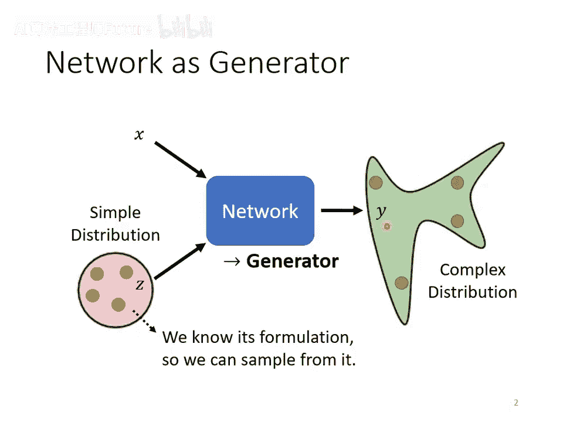

## 概述

到目前为止，我们学到的神经网络都是一个函数：输入一个X，输出一个Y。我们已经掌握了处理不同类型输入（如图片、序列）和输出（如数值、类别、序列）的各种网络架构。

本节我们将进入一个新的主题：将神经网络作为生成器使用。生成器的特别之处在于，它的输入会加入一个随机变量Z。这个Z是从某个简单的分布中采样得到的。因此，网络的输出不再是一个固定值，而变成了一个复杂的分布。这种能输出一个分布的神经网络，我们称之为生成器。

## 为什么需要生成器？🤔

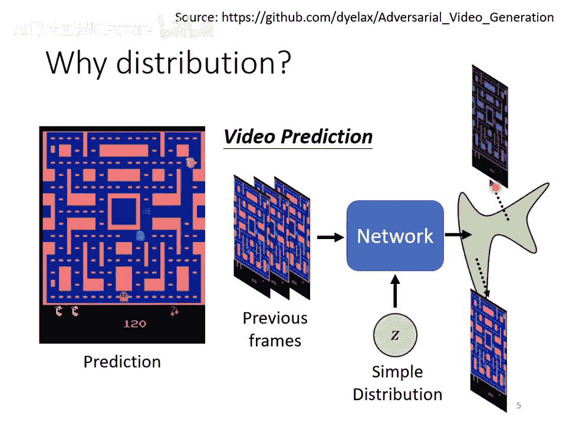

你可能会问，输入X输出Y这样固定的关系不好吗？为什么需要输出是一个分布呢？以下通过一个例子来说明。

考虑视频预测任务：给机器一段影片，让它预测接下来会发生什么。例如，预测游戏“小精灵”的下一帧画面。训练时，我们给网络输入过去的游戏画面，希望它输出下一秒的画面。

但这里有一个问题：在同样的游戏场景下（例如一个转角），小精灵有时会向左转，有时会向右转。这两种情况在训练数据中都存在。如果使用传统的监督学习训练一个输出固定值的网络，网络为了“讨好”两种不同的正确答案，可能会输出一个模糊的、同时包含向左和向右特征的错误结果（例如角色分裂）。

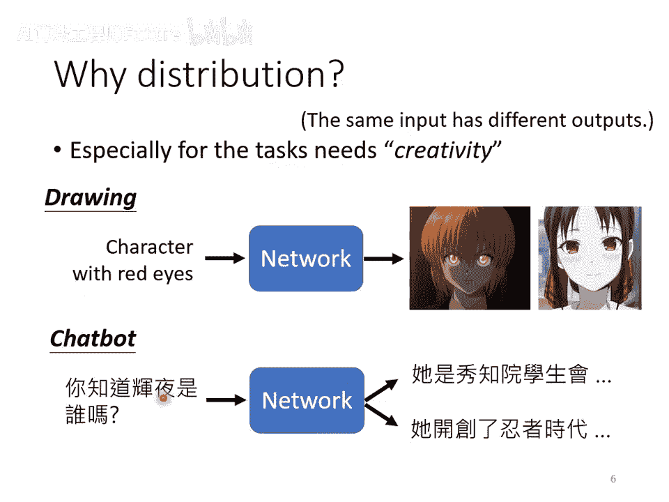

解决这个问题的一个方法是让机器的输出是有概率的，即输出一个分布。当我们给网络输入加上一个随机变量Z时，它的输出就变成了一个分布。这样，网络就能学会在Z取不同值时，输出不同的合理结果（例如向左转或向右转）。

**更广泛地说，当一项任务需要“创造力”，或者说，对于同样的输入存在多种不同但都正确的输出时，我们就需要生成式模型。** 例如：

- **画图**：要求画一个“红眼睛的角色”，每个人心中的答案都不同。
- **对话**：对于“你知道辉夜是谁吗？”这个问题，存在多种合理的回答。

## 生成式对抗网络 (GAN) 简介 ⚔️

在生成式模型中，一个非常知名的就是生成式对抗网络，其缩写为GAN。本节课主要介绍GAN。

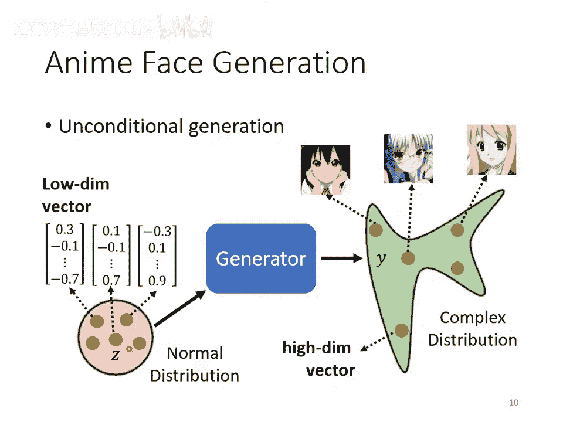

我们首先讨论**无条件生成**的例子：生成二次元人物头像。在这个任务中，我们暂时去掉条件输入X，因此生成器的输入只有随机变量Z。

- **生成器 (Generator)**：输入是一个从简单分布（如正态分布）中采样得到的向量`Z`，输出是一张图片（即一个高维向量）。我们希望对于不同的`Z`，输出都是合理的二次元人脸。
- **判别器 (Discriminator)**：输入是一张图片，输出是一个标量分数。这个分数越大，代表判别器认为这张图片越像是真实的二次元人物头像。

GAN的核心思想在于同时训练这两个网络，让它们相互竞争、共同进步。

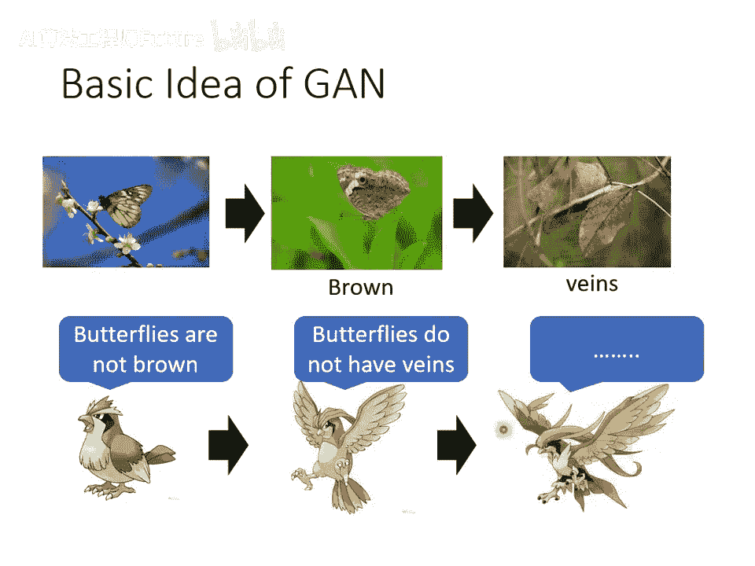

## GAN的工作原理：一个演化的故事 🦋

我们可以用一个演化的故事来比喻GAN的训练过程：

1. **第一代生成器**：参数随机初始化，生成的图片像杂乱无章的噪声。
2. **第一代判别器**：学习区分**真实的二次元头像**和**第一代生成器产生的噪声**。它可能学会一个简单的规则，例如“有眼睛的就是真图”。
3. **第二代生成器**：为了“骗过”当前的判别器，它调整参数，努力生成带有眼睛的图片。
4. **第二代判别器**：面对升级后的生成器，它也需要进化，学习更精细的区分规则，例如“有嘴巴和头发的才是真图”。
5. **第三代生成器**：继续进化，尝试生成带有嘴巴和头发的图片以骗过判别器。

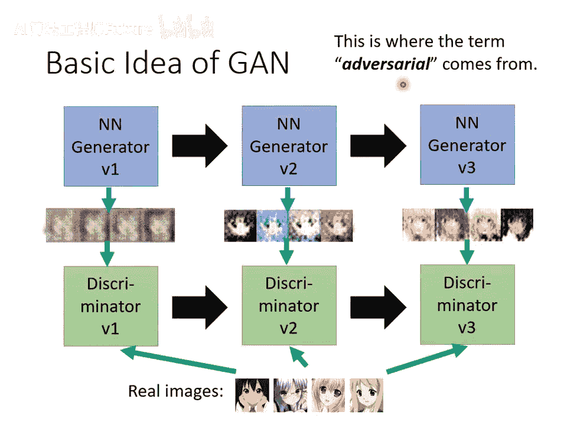

如此循环往复，判别器变得越来越严格，生成器生成的图片也越来越逼真。虽然这个过程常被描述为“对抗”，但它们实际上是一种相互促进的“合作”关系。

## GAN的训练算法 🔄

以下是GAN训练算法的具体步骤：

**步骤一：训练判别器（固定生成器）**

1. 固定生成器的参数。
2. 从简单分布中采样一批随机向量`Z`，输入生成器，得到一批**生成图片**。
3. 从真实数据集中采样一批**真实图片**。
4. 训练判别器，使其能够更好地区分真实图片和生成图片。这可以看作一个二分类问题（真图为1，生成图为0）或回归问题。

**步骤二：训练生成器（固定判别器）**

1. 固定判别器的参数。
2. 将生成器和判别器连接起来，看作一个大的网络。这个网络的输入是随机向量`Z`，输出是判别器对生成图片的打分。
3. **只调整生成器的参数**，目标是让这个“大网络”输出的分数（即判别器给生成图片的打分）**越高越好**。这相当于让生成器生成能骗过当前判别器的图片。
4. 技术上，这可以通过梯度上升来实现，或者将判别器输出的分数取负号作为损失，然后用梯度下降来最小化它。

**反复迭代**  

重复执行**步骤一**和**步骤二**，交替训练判别器和生成器。在每一轮中，当训练一方时，另一方的参数保持固定。

## GAN的生成效果展示 🖼️

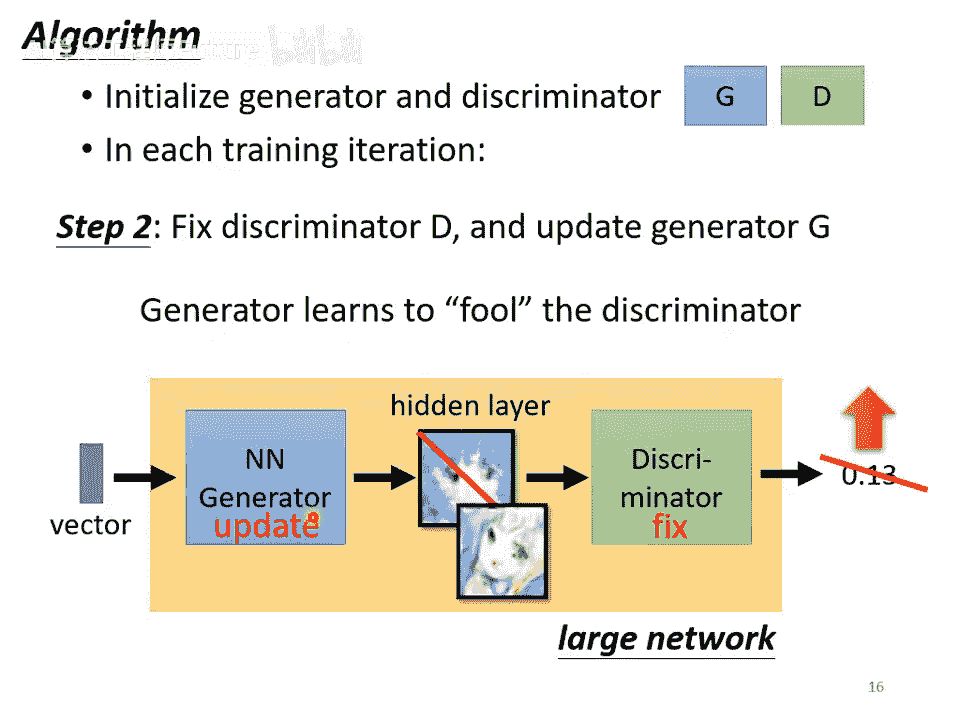

通过上述训练过程，GAN能够生成越来越逼真的图片。

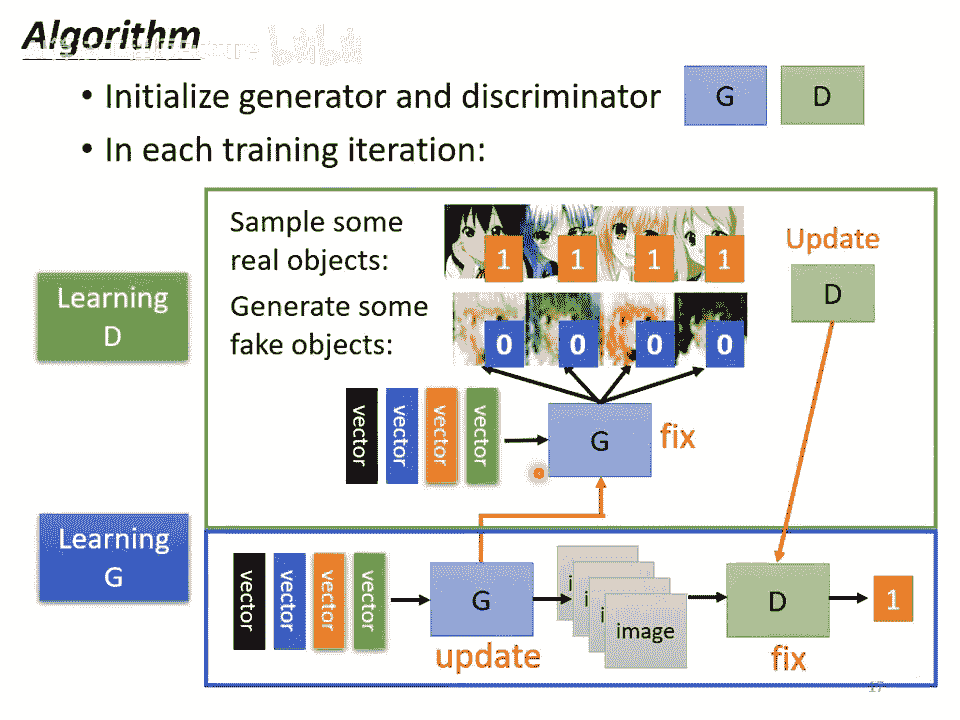

以下是训练过程中生成图片的演变示例：

- **训练100次后**：输出仍是难以辨认的噪声。
- **训练1000次后**：图片中出现了类似眼睛的结构。
- **训练5000次后**：开始出现人脸的雏形，并学会了“水汪汪的大眼睛”这一动漫特征。
- **训练数万次后**：可以生成较为清晰、多样的二次元人物头像。

更先进的GAN变体（如StyleGAN）可以生成极其逼真的人脸，甚至达到“以假乱真”的程度。此外，GAN还有一个有趣特性：**向量插值**。对两个输入向量`Z1`和`Z2`进行插值，其对应的生成图片之间会产生平滑、有意义的过渡（例如，从严肃表情变为微笑，或从左看变为右看再变为正面）。

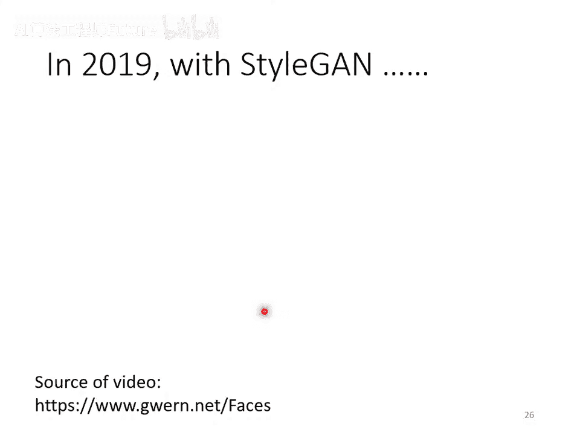

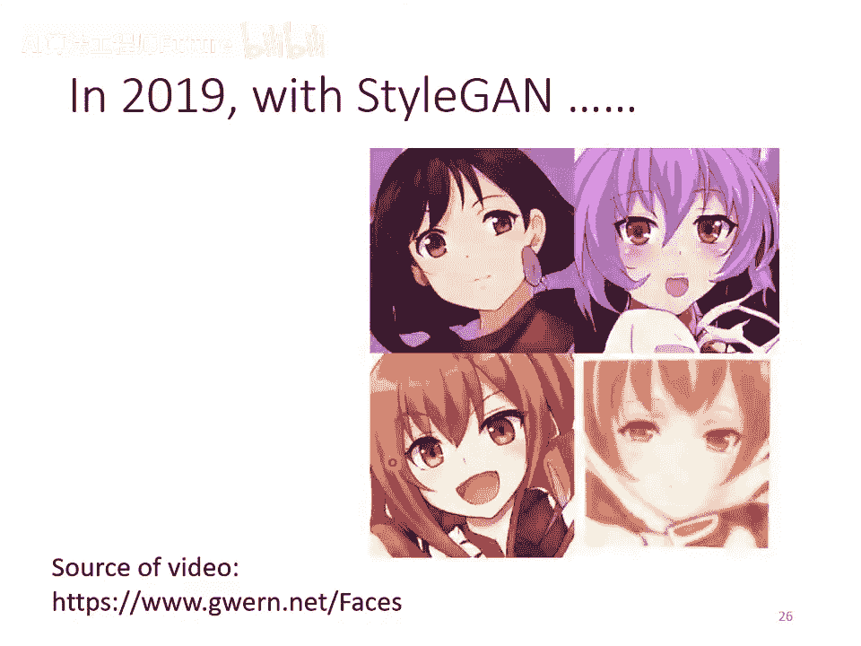

---

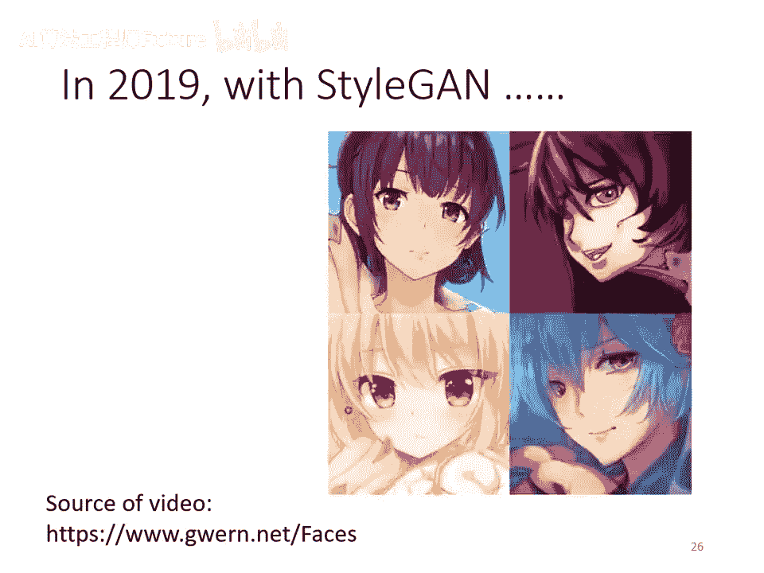

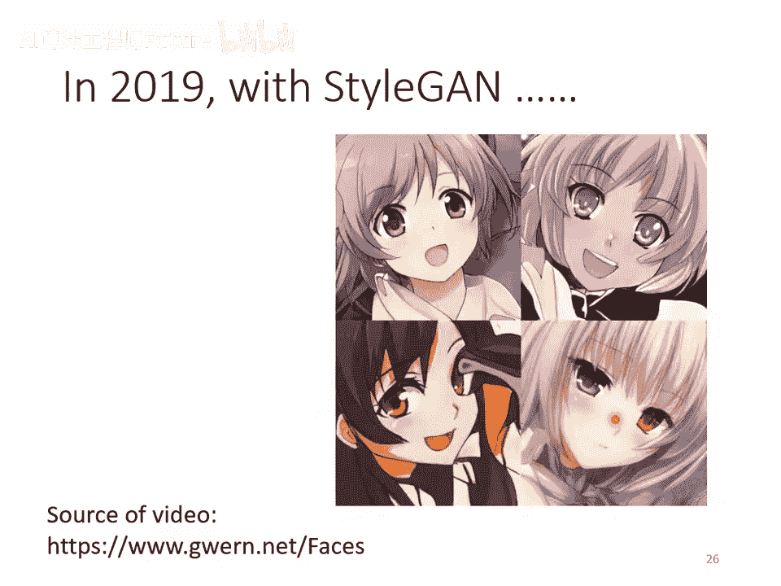

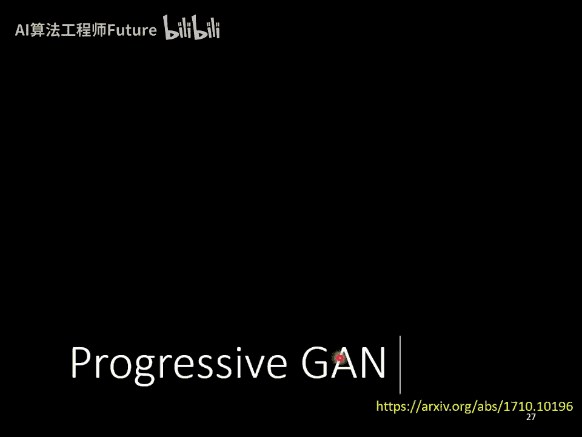

## 总结

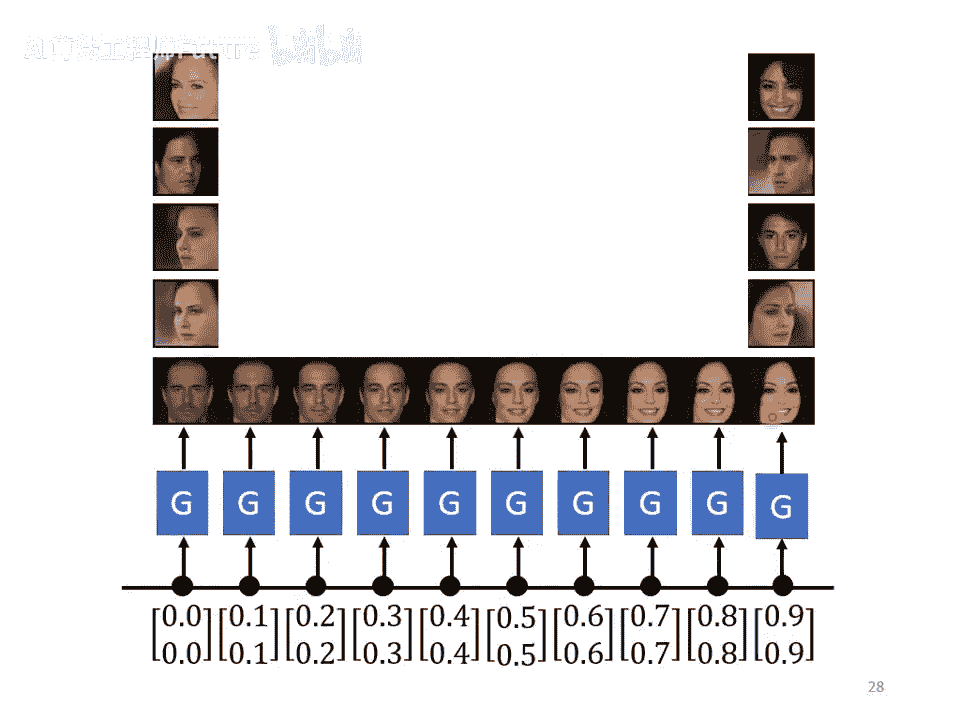

本节课中，我们一起学习了生成式对抗网络的基础知识。

1. 我们首先了解了**为什么需要生成式模型**：为了处理那些对于单一输入存在多种可能输出的任务，使机器具备一定的“创造力”。
2. 接着，我们介绍了**GAN的基本框架**，它由两个网络组成：**生成器**负责从随机噪声生成数据，**判别器**负责判断数据是真实的还是生成的。
3. 然后，我们通过一个**演化的比喻**，生动地解释了生成器和判别器如何通过相互竞争、共同进化。
4. 最后，我们详细阐述了**GAN的训练算法**，即交替固定一方、训练另一方的迭代过程，并展示了GAN在图像生成上的强大能力。

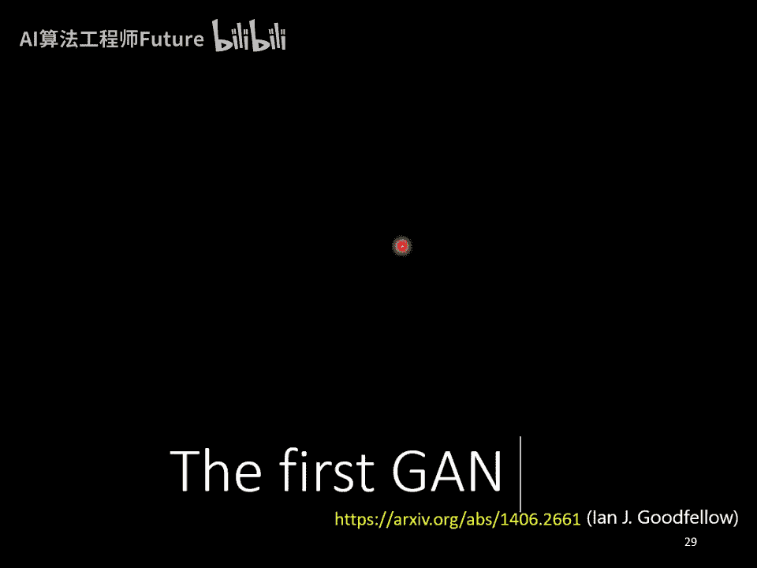

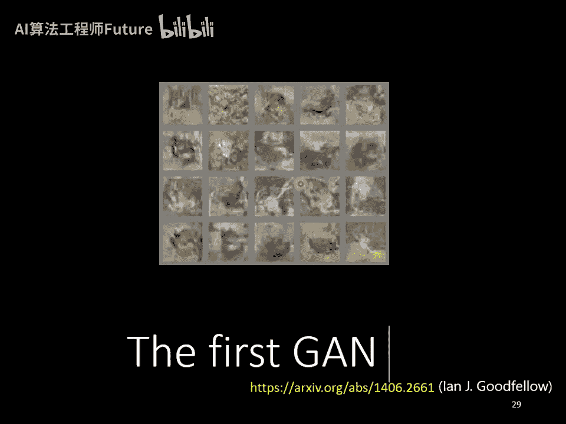

GAN是生成式模型中的一个里程碑，它为机器“创造”内容开辟了道路。在接下来的课程中，我们将进一步探讨GAN的理论细节和更多变体。
