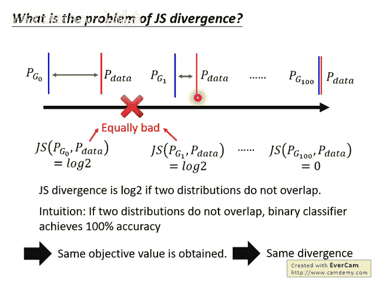
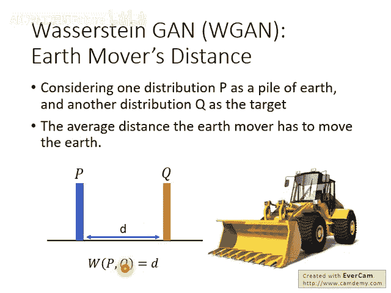
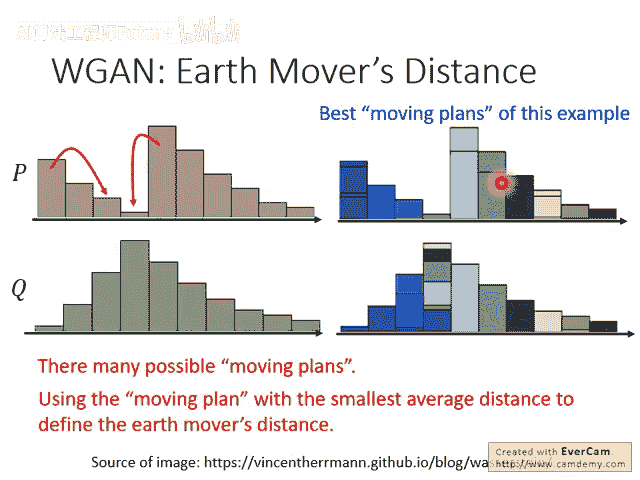
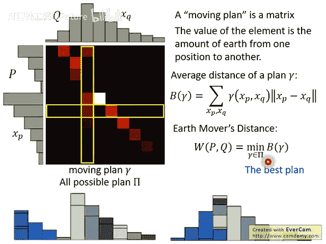
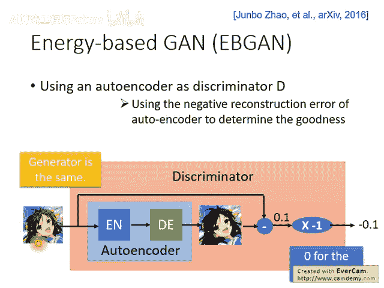
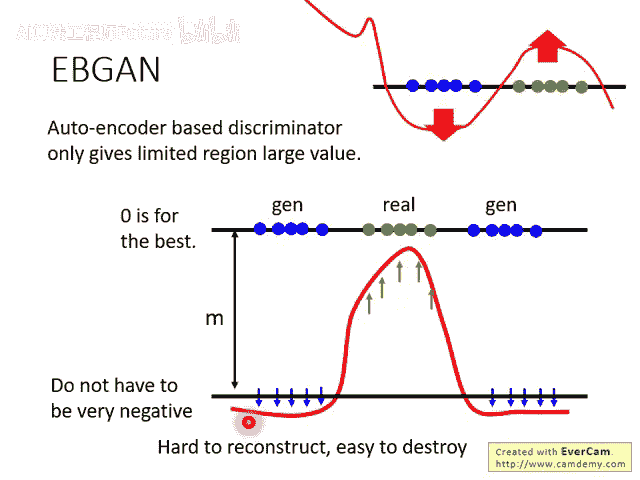
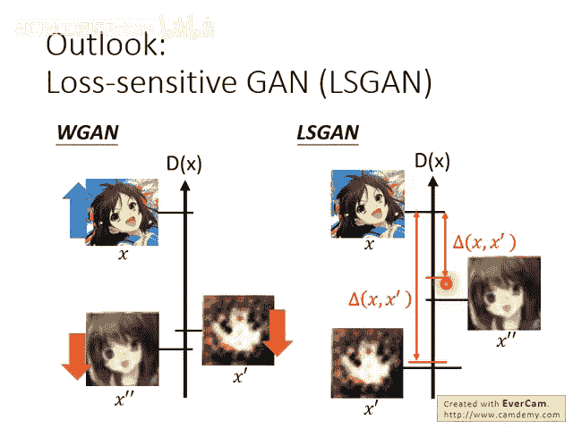
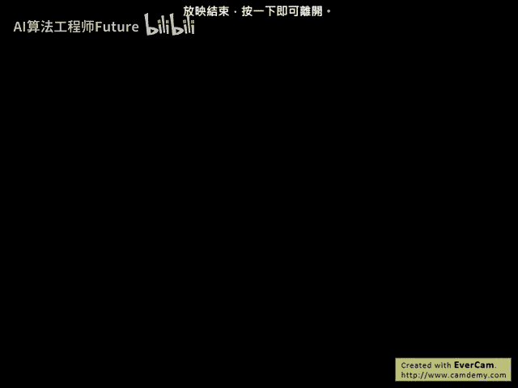

# 48：7-选修-GAN理论-3 🧠

在本节课中，我们将要学习如何改进GAN的训练，特别是Wasserstein GAN（W-GAN）的理论基础。我们将探讨原始GAN使用JS散度（Jensen-Shannon Divergence）时遇到的问题，并介绍Wasserstein距离如何提供更平滑、更有效的梯度来引导生成器的学习。

---

## 原始GAN训练的问题：JS散度的局限性

上一节我们介绍了GAN的基本框架，本节中我们来看看原始GAN训练中的一个核心问题。

假设我们在训练原始GAN时，其目标是衡量生成数据分布 (P_g) 和真实数据分布 (P_{data}) 之间的JS散度。然而，使用JS散度存在一个严重问题。

这个问题的根源在于，生成器产生的数据分布 (P_g) 与真实数据分布 (P_{data}) 往往没有任何重叠。原因主要有两点：

1. **数据本质**：图像数据通常被认为是高维空间中的低维流形。在高维空间中，两个低维流形重叠的部分几乎可以忽略不计。
2. **采样实践**：即使两个分布理论上存在重叠，在实际训练中，我们只能从每个分布中采样有限数量的点。这些有限的样本点之间很可能完全没有交集。



当 (P_g) 和 (P_{data}) 没有重叠时，JS散度会恒等于 **log2**，无论两个分布实际上是否接近。这会导致训练陷入困境。

以下是具体说明：

- 假设初始生成器 (G_0) 产生的分布 (P_{g0}) 距离真实分布很远，其JS散度为 **log2**。
- 假设一个更好的生成器 (G_1) 产生的分布 (P_{g1}) 更接近真实分布，但其JS散度仍然是 **log2**。
- 对于生成器来说，(P_{g0}) 和 (P_{g1}) 的“糟糕程度”是一样的（JS散度都是 **log2**），因此它没有动力从 (P_{g0}) 更新到 (P_{g1})。除非生成器能一步到位，使 (P_g) 与 (P_{data}) 完全重合（JS散度变为0），否则梯度会非常小甚至为零，导致训练停滞。

从判别器（一个二元分类器）的角度看，只要两堆数据没有重叠，一个能力足够的分类器就能完美区分它们，其损失（交叉熵）会达到一个相同的、很小的值。这意味着它提供给生成器的梯度信息在数据点附近会变得非常平缓（梯度消失），无法有效引导生成器更新。

过去的一种解决方法是**不要将判别器训练得太好**，以保留一些梯度。但这引入了新的问题：如何定义“太好”？这很难控制，使得早期GAN训练非常不稳定，常常需要人工监视和调整。

---

## 改进方法一：LSGAN（最小二乘GAN）

为了解决梯度消失问题，一个直观的改进是将判别器的输出层从Sigmoid函数改为线性函数。这就是LSGAN。



- 原始GAN的判别器是一个分类器，使用Sigmoid输出和交叉熵损失。
- LSGAN将判别器变成一个回归器，使用线性输出和均方误差损失。
  
  对于真实数据，我们希望判别器输出越接近1越好。
  对于生成数据，我们希望判别器输出越接近0越好。

**核心改变**：

```python
# 原始GAN判别器输出（通常）
output = torch.sigmoid(...)
loss = BCEWithLogitsLoss(...)



# LSGAN判别器输出
output = ... # 线性层，无Sigmoid
loss = MSELoss(output, target) # target为1（真实）或0（生成）
```

这样做避免了Sigmoid函数在饱和区（接近0或1）梯度平缓的问题，使得训练更加稳定。

---

## 核心改进：Wasserstein GAN (W-GAN) 🌊

LSGAN是一种工程上的改进，而W-GAN则从理论层面提出了更根本的解决方案。它使用 **Wasserstein距离**（又称Earth-Mover‘s Distance，推土机距离）来代替JS散度衡量分布间的差异。



### Wasserstein距离直观理解

想象你有两堆土，分布 (P) 和 (Q)。Wasserstein距离衡量的是将 (P) 这堆土搬运成 (Q) 这堆形状所需的最小**平均搬运距离**。

- 在简单的一维点分布情况下，如果 (P) 集中在点 (x_p)，(Q) 集中在点 (x_q)，那么Wasserstein距离就是 (|x_p - x_q|)。
- 在复杂分布下，将 (P) 变成 (Q) 的“搬运方案”（称为传输计划 (\gamma)）有很多种。Wasserstein距离定义为所有可能传输计划中，平均搬运距离最小的那个。

**公式化定义**：  

对于离散分布，Wasserstein距离可以通过求解以下最优传输问题得到：  

[  

W(P, Q) = \inf_{\gamma \in \Pi(P, Q)} \mathbb{E}_{(x, y) \sim \gamma} [|x - y|]  

]  

其中 (\Pi(P, Q)) 是所有以 (P) 和 (Q) 为边缘分布的联合分布集合。

### Wasserstein距离的优势

Wasserstein距离的关键优势在于，即使两个分布没有重叠，它也能提供一个平滑变化的距离度量。

- 回到之前的例子，(P_{g0})、(P_{g1}) 与 (P_{data}) 的JS散度可能都是 **log2**。
- 但它们的Wasserstein距离可能是 (d_0 > d_1 > 0)。这明确告诉我们 (P_{g1}) 比 (P_{g0}) 更好。
- 因此，生成器可以获得有意义的梯度，逐步从 (P_{g0}) 改进到 (P_{g1})，最终逼近 (P_{data})。这类似于生物进化中的微小有益突变累积。

### 如何用判别器衡量Wasserstein距离？

根据理论推导，要衡量 (P_{data}) 和 (P_g) 之间的Wasserstein距离，我们可以通过优化以下目标函数来实现：

[  

\max_{D \in \text{1-Lipschitz}} \left[ \mathbb{E}*{x \sim P*{data}}[D(x)] - \mathbb{E}_{z \sim p(z)}[D(G(z))] \right]  

]

**解读**：

1. 对于真实样本 (x)，希望判别器输出 (D(x)) **越大越好**。
2. 对于生成样本 (G(z))，希望判别器输出 (D(G(z))) **越小越好**。
3. **关键约束**：判别器 (D) 必须是一个 **1-Lipschitz函数**。这意味着函数需要足够“平滑”，其输出的变化速度不能超过输入的变化速度。数学上表示为：对于所有 (x_1, x_2)，有 (|D(x_1) - D(x_2)| \leq |x_1 - x_2|)。

如果没有这个约束，判别器会倾向于给真实样本输出无穷大，给生成样本输出无穷小，使得训练无法收敛。Lipschitz约束强制判别器保持平滑，从而给出有意义的梯度。

---

## 实现W-GAN：从理论到实践

在训练中，我们无法直接处理“所有函数都满足1-Lipschitz”这个约束。W-GAN的原始论文提出了两种主要的近似方法。

### 方法A：权重裁剪 (Weight Clipping)

这是原始W-GAN使用的方法。想法很简单：在每次更新判别器参数后，将所有权重强制裁剪到某个固定区间 ([-c, c]) 内。

```python
# 权重裁剪伪代码
for p in discriminator.parameters():
    p.data.clamp_(-clip_value, clip_value)
```

**优点**：实现极其简单。  

**缺点**：这是一种非常生硬的约束方式，可能限制了判别器的表达能力，并且容易导致优化困难或产生次优解。

### 方法B：梯度惩罚 (Gradient Penalty, W-GAN GP)

这是一种更优雅的方法，它直接对判别器的梯度范数施加约束。理论表明，一个函数是1-Lipschitz的**充分必要条件**是其梯度范数几乎处处小于等于1。

因此，W-GAN GP在判别器的损失函数中增加了一个**梯度惩罚项**：

[  

L_{GP} = \lambda \cdot \mathbb{E}*{\hat{x} \sim P*{\text{penalty}}} \left[ (|\nabla_{\hat{x}} D(\hat{x})|_2 - 1)^2 \right]  

]

**解读**：

- 这项惩罚会鼓励判别器在所有点 (\hat{x}) 处的梯度范数 (|\nabla D(\hat{x})|) 接近1。
- (\lambda) 是惩罚系数，一个超参数。
- (P_{\text{penalty}}) 是采样分布。理论上应对所有 (x) 采样，但这不现实。

**W-GAN GP的巧妙之处在于对 (P_{\text{penalty}}) 的选择**：它从真实数据分布 (P_{data}) 和生成数据分布 (P_g) 中各采样一个点，然后在这两个点的**连线**上随机采样作为 (\hat{x})。

**直觉解释**：生成器的更新方向正是沿着 (P_g) 指向 (P_{data}) 的区域。因此，主要约束这个区域上判别器的梯度行为是最关键的。实验证明这种方法效果很好。

---

## 其他GAN变种简介

### Energy-Based GAN (EB-GAN)

EB-GAN的核心思想是改变判别器的结构。

- **判别器**：不再是一个二元分类器，而是一个**自编码器 (Autoencoder)**。
- **评分**：判别器对一张图像的评分是该图像经过自编码器后的**重构误差的负值**。重构误差越小（图像质量越高），评分越高。
- **优点**：
  
  判别器（自编码器）可以**仅用真实数据预训练**，一开始就很强，从而能更快地引导生成器。
  训练更稳定。
- **注意事项**：训练时，对于生成样本，不是一味地最小化其评分（最大化重构误差），而是设定一个**边际 (margin)**，只要生成样本的评分低于这个边际即可，防止判别器“偷懒”学到无意义的映射。

### Loss-Sensitive GAN (LS-GAN)

LS-GAN也引入了边际的概念，但其思想不同。它认为，对于那些已经很像真实样本的生成样本，不需要过度惩罚，只需让它们的判别器输出低于一个动态调整的边际即可。这使学习目标更聚焦于改进那些质量还很差的生成样本。



---

## 总结与算法对比

本节课中我们一起学习了改进GAN训练稳定性的核心理论与方法。

**原始GAN到W-GAN的算法改动总结**：

以下是需要修改的关键点：

1. **判别器损失函数**：移除Sigmoid，将 log(D(x)) 改为 D(x)，将 log(1-D(G(z))) 改为 -D(G(z))。
2. **判别器输出层**：移除最后的Sigmoid激活函数，让输出是线性的。
3. **判别器约束**：在训练判别器时，必须施加Lipschitz约束，例如通过**权重裁剪 (W-GAN)** 或**梯度惩罚 (W-GAN GP)**。
4. **生成器损失函数**：将最小化 log(1-D(G(z))) 改为最小化 -D(G(z))（即最大化 D(G(z))）。



**核心思想演进**：

- **原始GAN**：用JS散度衡量分布差异，在分布无重叠时梯度失效。
- **LSGAN**：改用最小二乘损失，缓解梯度消失，是实用的工程技巧。
- **W-GAN**：从理论上采用Wasserstein距离，提供平滑的梯度信号。
- **W-GAN GP**：通过梯度惩罚更优雅地实现Wasserstein距离的约束。
- **EB-GAN等**：从改变判别器结构入手，增加训练稳定性和可预训练性。





这些改进使得GAN的训练变得更加可控和稳定，为其在图像生成等领域的成功应用奠定了坚实基础。
