# 49：8-选修-VAE理论介绍 🧠

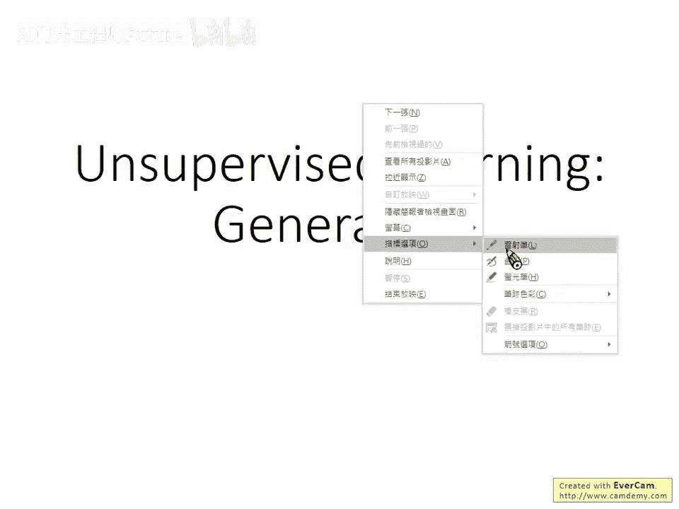

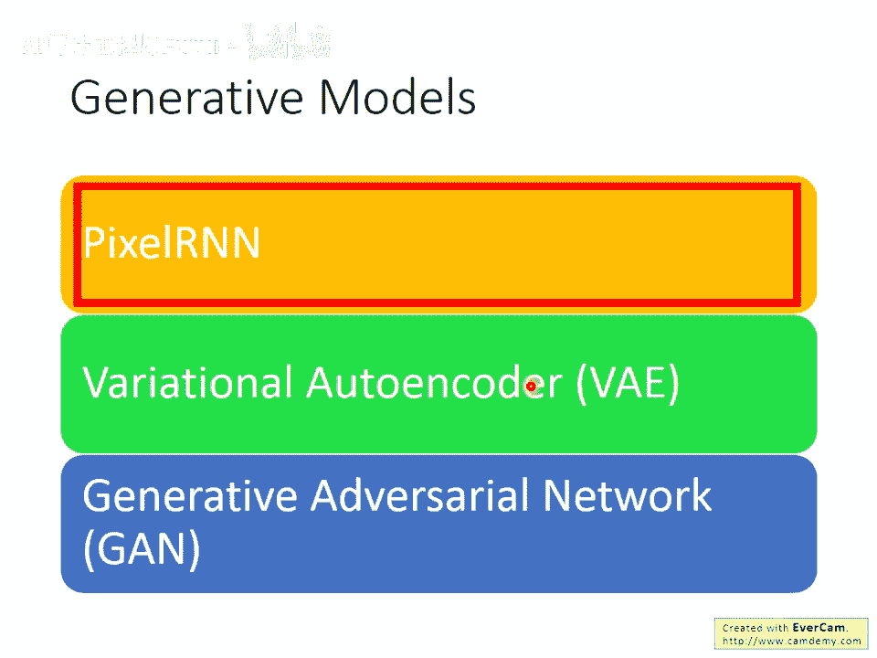

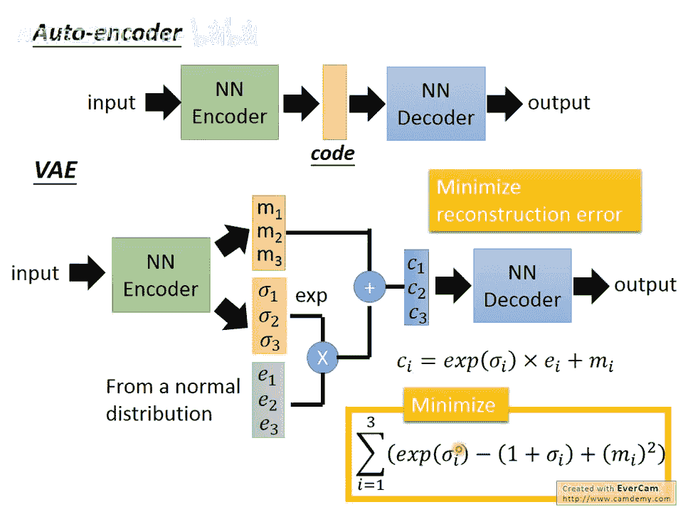

在本节课中，我们将要学习变分自编码器（VAE）的核心理论。我们将从直观理解开始，逐步深入到其背后的数学原理，并探讨VAE与生成对抗网络（GAN）之间的联系与区别。

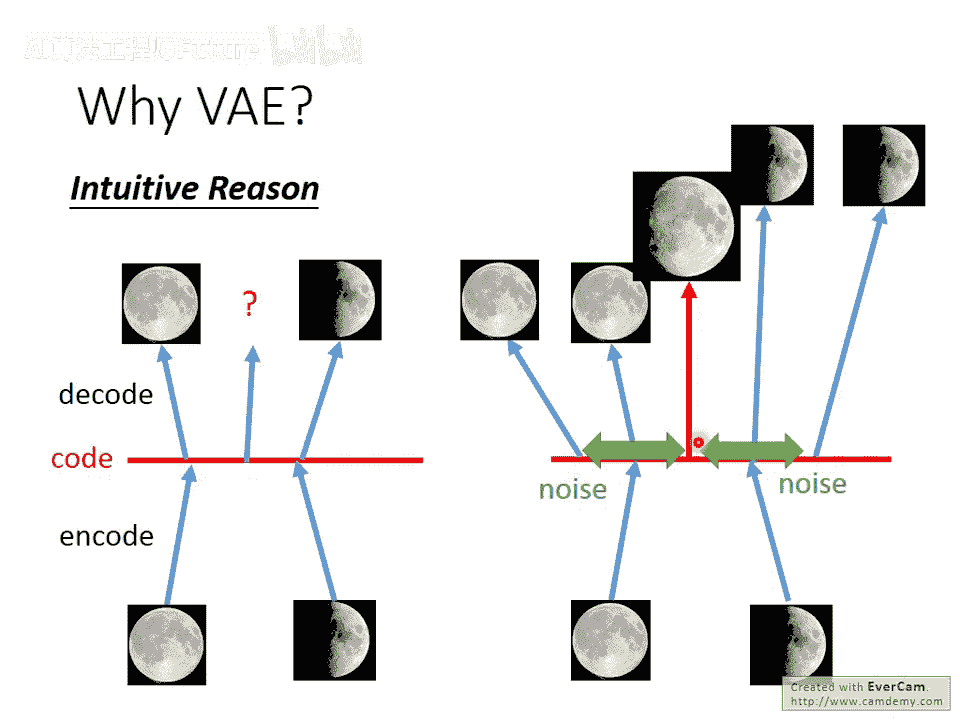

---

## VAE的直观理解 🔍

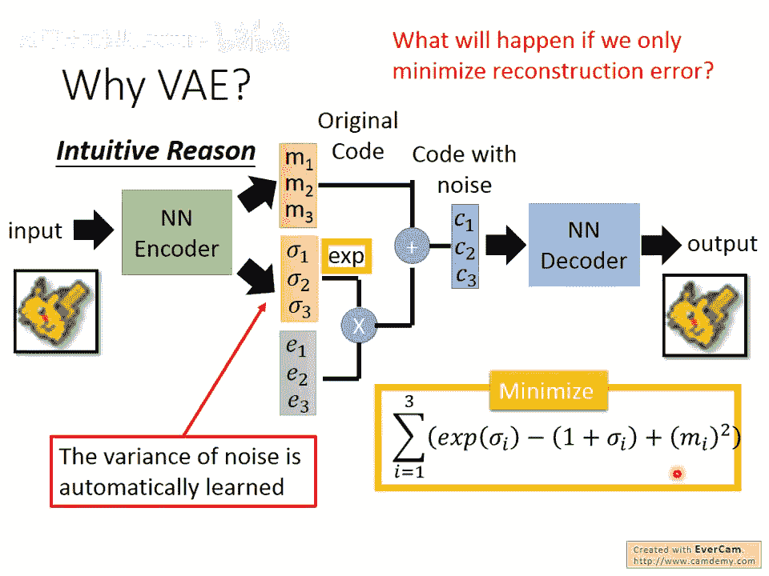

上一节我们介绍了生成模型的基本概念。本节中我们来看看VAE是如何工作的。

VAE的结构包含一个编码器和一个解码器。编码器接收输入图像，输出两组向量：均值向量 **m** 和方差向量 **σ**。随后，模型从一个标准正态分布中采样一个噪声向量 **ε**，将方差向量 **σ** 取指数后与噪声 **ε** 相乘，再与均值向量 **m** 相加，得到最终的隐变量编码 **c**。解码器则根据这个编码 **c** 来重建图像。

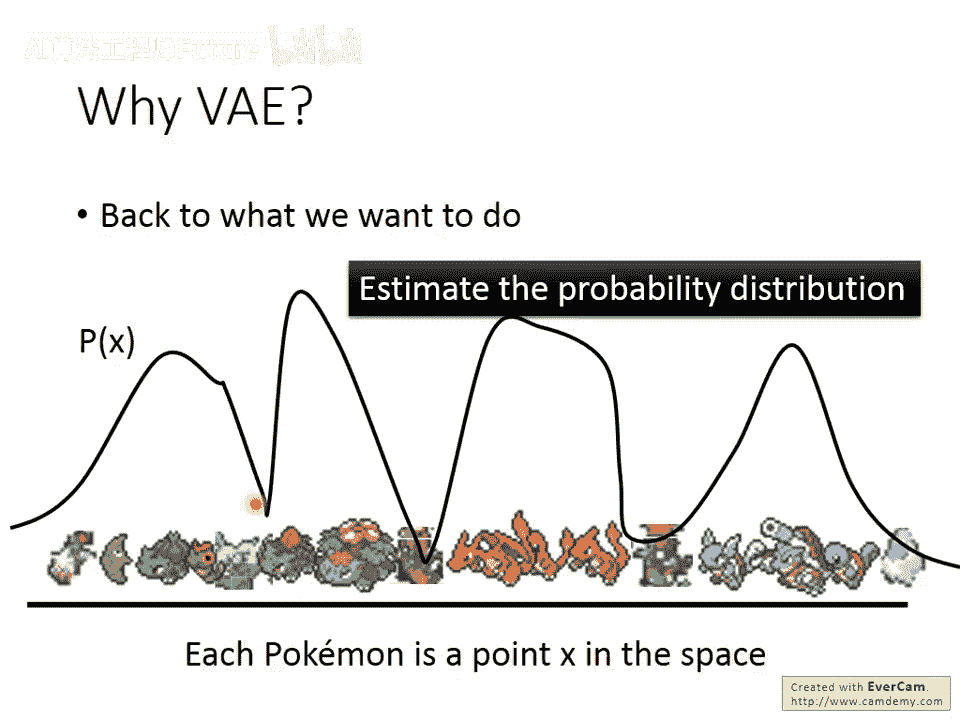

其损失函数包含两部分：

1. **重建损失**：使解码器输出尽可能接近原始输入。
2. **正则化损失**：限制编码器输出的分布，使其接近标准正态分布。

公式表示为：  

`总损失 = 重建损失 + KL散度项`  

其中，KL散度项鼓励编码分布 `q(z|x)` 接近先验分布 `p(z)`（标准正态分布）。

---

## 为何需要VAE？ 🤔

传统的自编码器直接将图像映射为隐空间中的一个确定点。如果在两个不同图像对应的隐变量点之间进行采样，解码器可能生成无意义的图像，因为神经网络在未训练过的区域行为不可预测。

VAE通过引入噪声解决了这个问题。编码器不仅输出一个点，还输出一个分布（均值和方差）。训练时，要求从该分布中采样出的**所有点**都能较好地重建原图。这使得两个不同图像对应的分布会在隐空间中产生重叠。在重叠区域，模型被迫生成介于两者之间的合理图像（例如，满月和弦月之间的月相），从而让整个隐空间的采样变得连续且有意义。

如果不加限制，模型会倾向于将方差 **σ** 设为零以最小化重建误差，这就退化成了普通自编码器。因此，损失函数中的KL散度项至关重要，它防止方差过小，确保分布的“扩散”。

---

## VAE的数学原理 📐

现在我们从概率生成模型的角度，更正式地理解VAE。

我们的根本目标是估计真实图像数据的概率分布 `P(x)`。如果我们能知道这个分布，就可以从中采样，生成新的图像。一种经典的估计复杂分布的方法是**高斯混合模型**。它假设任何复杂分布都是由多个高斯分布加权组合而成。

VAE可以看作是高斯混合模型的“分布式表示”版本。在VAE中：

- 我们从一个简单的先验分布（如标准正态分布）`P(z)` 中采样一个隐变量 **z**。**z** 的每一维代表图像的某种抽象属性。
- 存在一个由神经网络 `G` 决定的复杂函数，将每个 **z** 映射到数据空间中的一个高斯分布，即给定 **z** 时 `x` 的条件分布 `P(x|z)`。这个神经网络就是**解码器**。
- 数据分布 `P(x)` 则是所有可能的 **z** 所对应的高斯分布的加权平均（积分）：  
  
  `P(x) = ∫ P(z) P(x|z) dz`

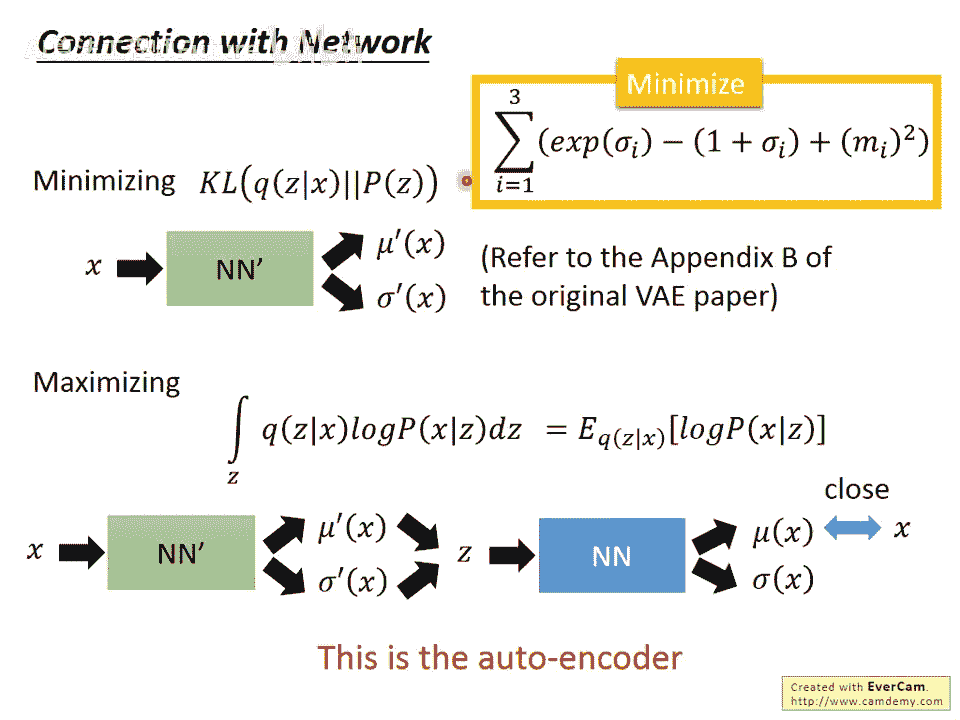

然而，直接最大化真实数据的似然 `log P(x)` 是困难的。VAE引入了一个近似分布 `Q(z|x)`（由另一个神经网络，即**编码器**实现），并推导出似然的一个下界（Evidence Lower Bound, ELBO）：  

`log P(x) ≥ ELBO = E[log P(x|z)] - KL( Q(z|x) || P(z) )`

最大化这个ELBO就等价于：

1. 最大化 `E[log P(x|z)]`：即让解码器根据 **z** 重建 **x** 的能力最强，这对应着**重建损失**。
2. 最小化 `KL( Q(z|x) || P(z) )`：即让编码器输出的分布 `Q(z|x)` 接近先验分布 `P(z)`，这对应着**正则化损失**。

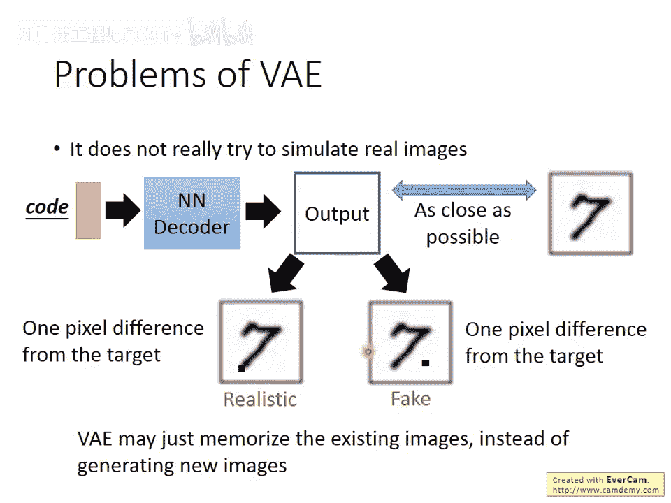

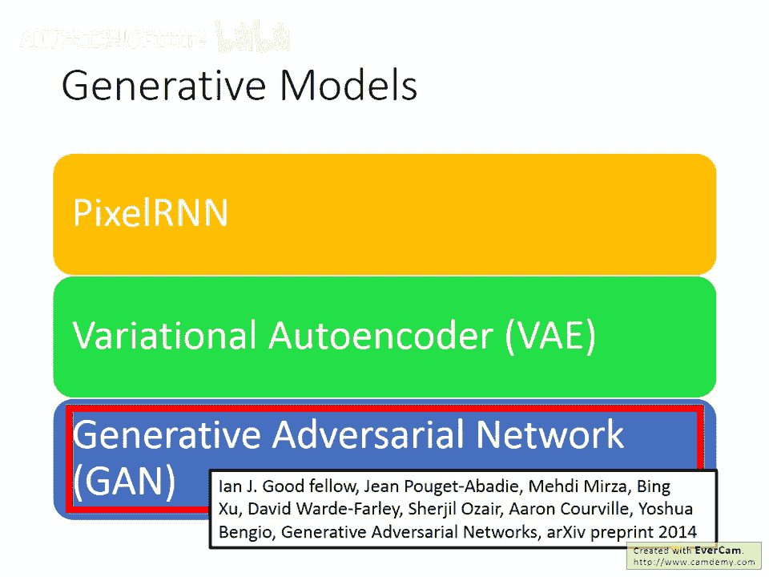

至此，我们完成了从概率图模型到VAE实际损失函数的理论闭环。

---

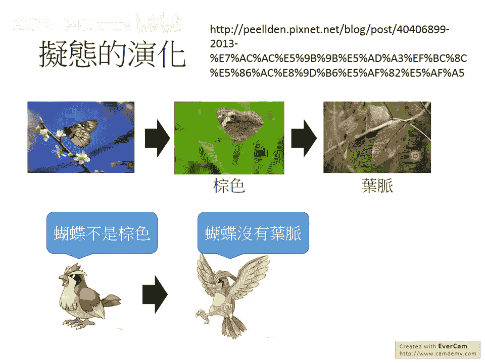

## VAE的局限与GAN的引入 🚀

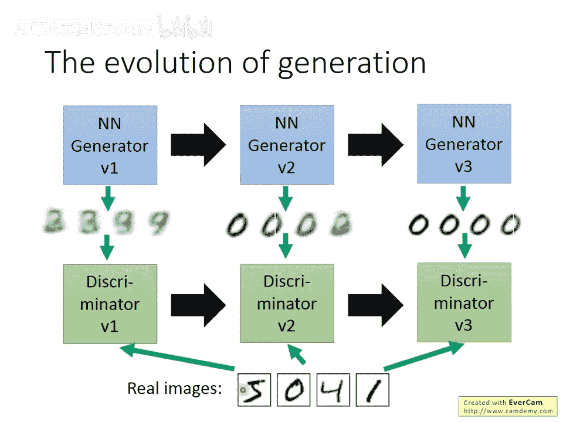

尽管VAE很强大，但它有一个核心局限：它通过像素级重建误差（如均方误差）来学习，这并非一个评价图像“真实性”的好指标。两张图可能只有一个像素不同，但若这个像素出现在关键位置（如数字的笔画），人眼会立刻觉得图像“很假”，而VAE认为两者的“不好程度”是一样的。

因此，VAE更擅长**模仿和重建**，而非创造真正新颖、逼真的图像。其生成结果往往是数据集中图像的线性组合。

为了解决这个问题，Goodfellow等人在2014年提出了**生成对抗网络**。GAN的核心思想是引入一个“判别器”网络 `D` 来与生成器网络 `G` “对抗”学习：

- **判别器 `D`**：学习区分真实图像和生成器产生的假图像。
- **生成器 `G`**：学习生成尽可能以假乱真的图像来欺骗判别器。

以下是GAN的训练过程：

1. 固定生成器 `G`，训练判别器 `D` 成为一个优秀的“鉴定师”。
2. 固定判别器 `D`，训练生成器 `G` 使其生成的图像能让 `D` 误判为真。

这个过程如同捕食者与被捕食者的协同演化，两者在对抗中不断进步，最终目标是生成器能产生判别器无法区分的逼真图像。GAN的生成能力通常比VAE更强、更富有创造性，但其训练过程非常不稳定，需要精巧的平衡。

---

## 总结 📝

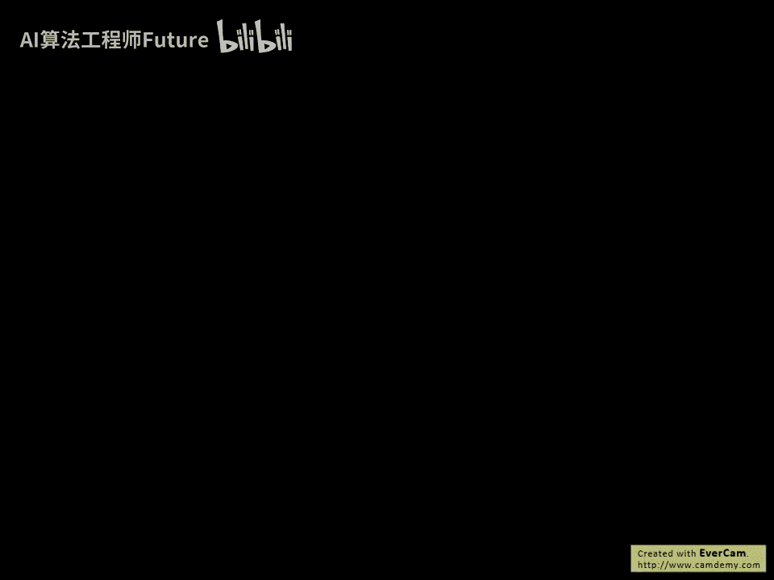

本节课中我们一起学习了：

1. **VAE的直观原理**：通过引入噪声和分布约束，使隐空间连续，能生成有意义的过渡图像。
2. **VAE的数学基础**：从最大化数据似然出发，推导出包含重建损失和KL散度损失的下界优化目标。
3. **VAE的局限性**：依赖于像素级重建损失，可能导致生成图像模糊或缺乏创新性。
4. **GAN的引入**：采用对抗训练策略，使用判别器作为学习信号，能生成更逼真、多样的图像，但训练难度更大。

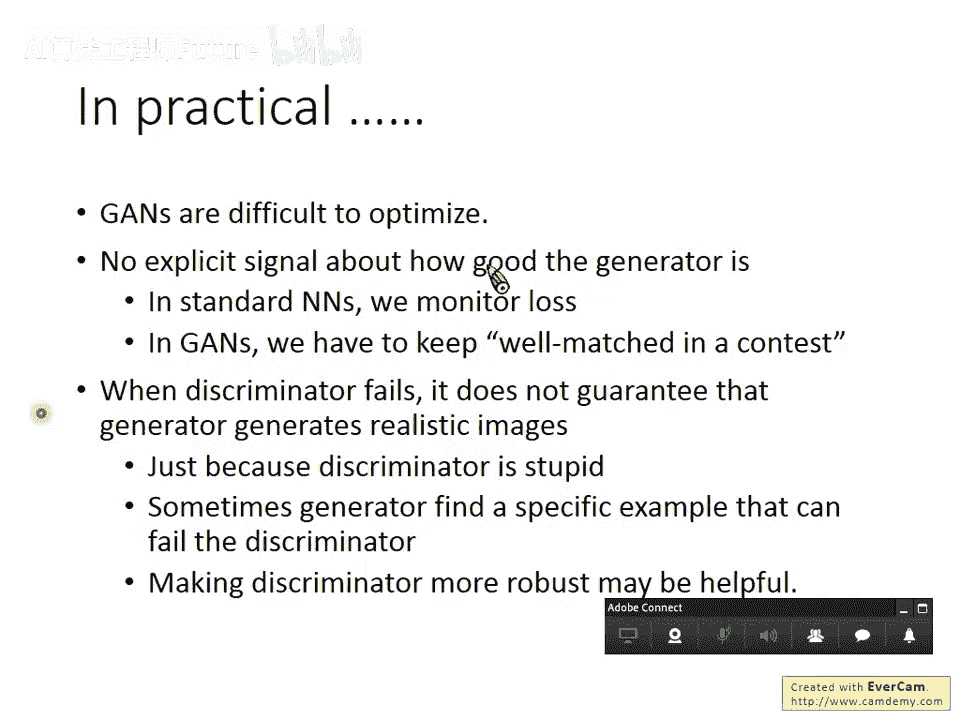

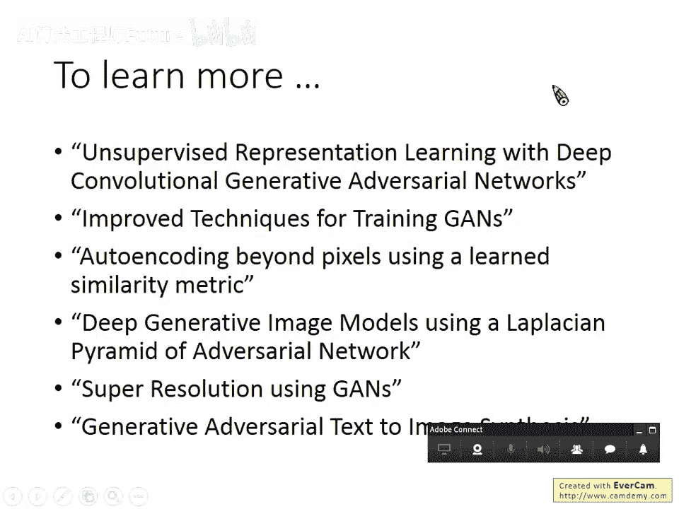

VAE和GAN是现代生成模型的两大基石，理解它们为后续探索更先进的生成技术打下了基础。
