# 50：9-选修-Flow-based生成模型 🌀

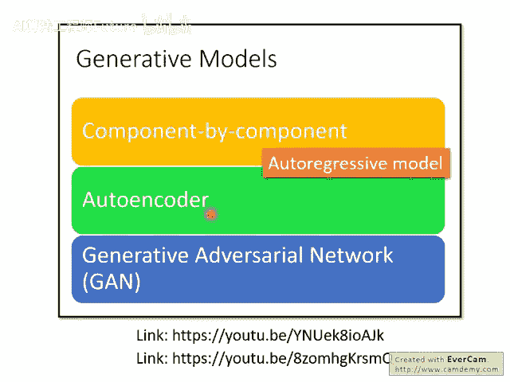

在本节课中，我们将要学习一种名为 **Flow-based** 的生成模型。这是一种不同于GAN或VAE的生成方法，它通过一系列可逆变换来直接优化数据的似然函数。

## 概述：生成模型回顾

在之前的课程中，我们已经介绍了三种生成模型。本节中，我们将看看第四种选择——Flow-based模型。

**第一种** 是 **逐分量生成模型**，也称为 **自回归模型**。这种方法逐个生成对象的组成部分，例如逐个生成图像的像素。其问题在于生成顺序难以确定，且生成速度可能非常慢。

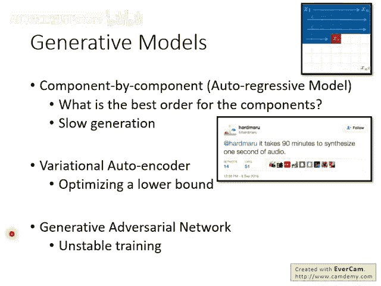

**第二种** 是 **变分自编码器**。VAE优化的是似然函数的一个下界，而非似然函数本身，我们无法得知这个下界与真实目标之间的差距。

**第三种** 是 **生成对抗网络**。GAN在生成质量上通常表现最佳，但其训练过程不稳定，生成器和判别器的目标不一致，容易导致训练失败。

**第四种** 就是我们今天要介绍的 **Flow-based模型**。它直接优化概率本身，没有使用近似下界，也没有GAN那样的对抗训练问题，但它也有自身的挑战。

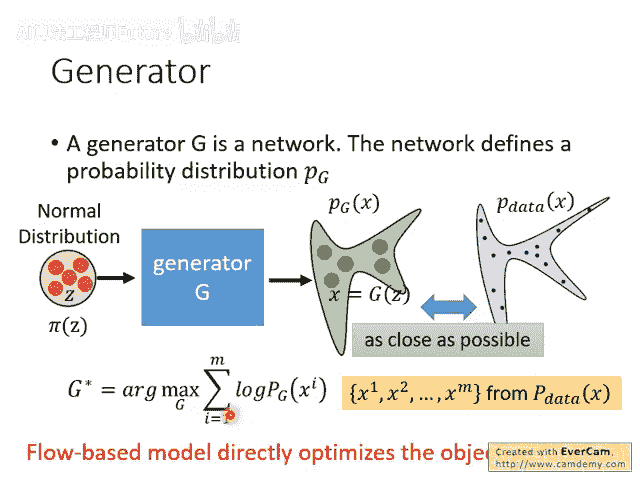

## 生成问题的数学表述


上一节我们回顾了各类生成模型，本节中我们来看看生成问题的通用数学框架。

一个生成器 **G** 是一个神经网络。它接收一个从简单分布（如正态分布）中采样的输入 **Z**，并输出一个复杂对象 **X**（例如一张人脸图像）。生成器 **G** 实际上定义了一个概率分布 **P_G**。

我们的目标是让 **P_G** 与真实数据分布 **P_data** 越接近越好。常见的做法是最大化从 **P_data** 中采样出的数据 **x_i** 在 **P_G** 下的 **对数似然**。

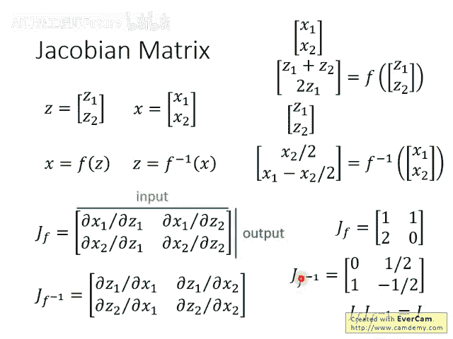

**公式表示：**

```
最大化：Σ_i log P_G(x_i)
```

这等价于最小化 **P_G** 与 **P_data** 之间的KL散度。Flow-based模型的厉害之处在于，它提供了一种方法可以直接优化这个目标函数，直接最大化似然。

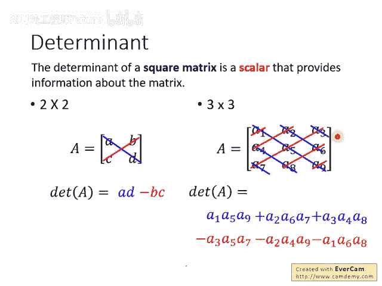

## 理解Flow模型所需的数学基础

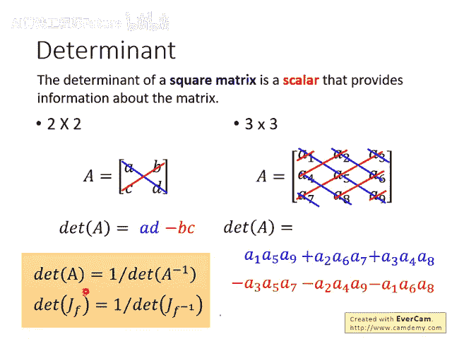

要理解Flow-based模型，需要掌握三个核心数学概念：雅可比矩阵、行列式和变量变换定理。

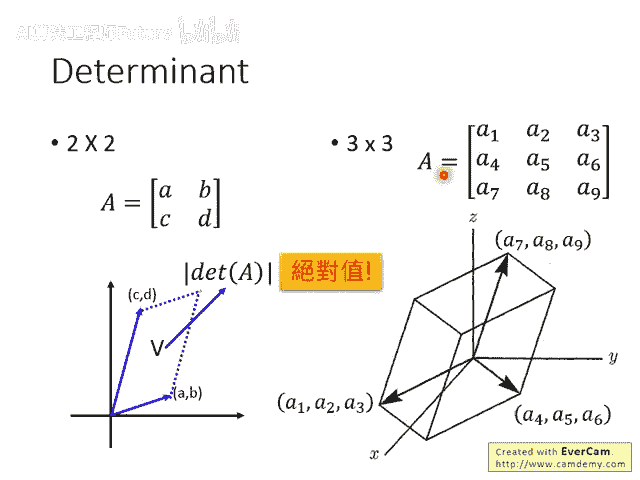

### 1. 雅可比矩阵

雅可比矩阵描述了一个多维函数输入与输出之间的偏导数关系。

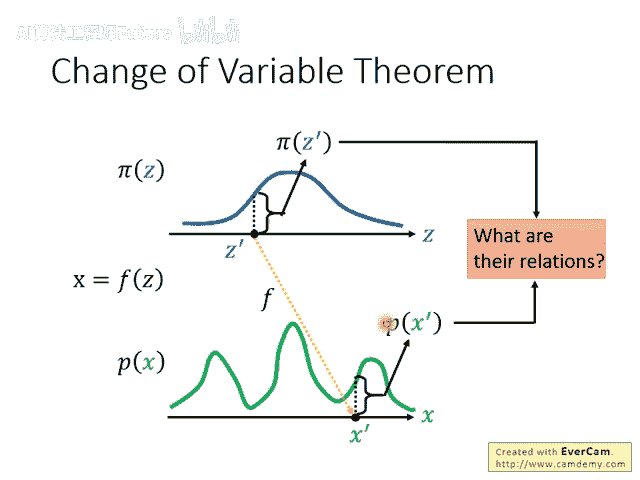

假设有一个函数 **F**，输入是二维向量 **Z**，输出是二维向量 **X**。其雅可比矩阵 **J_F** 是一个矩阵，其中第 i 行、第 j 列的元素是 **∂x_i / ∂z_j**。

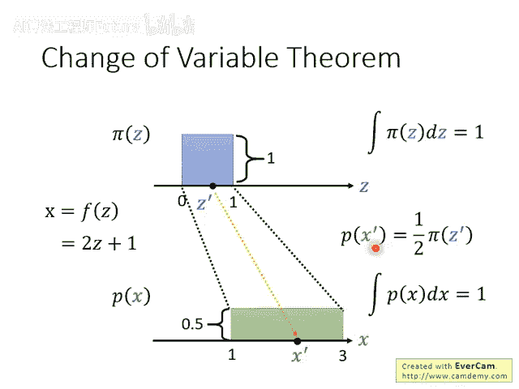

**举例：**  

若函数为：

```
x1 = z1 + z2
x2 = 2 * z1
```

则其雅可比矩阵为：

```
J_F = [ [∂x1/∂z1, ∂x1/∂z2],
        [∂x2/∂z1, ∂x2/∂z2] ]
      = [ [1, 1],
          [2, 0] ]
```

如果函数 **F** 有逆函数 **F_inverse**，那么它们的雅可比矩阵也互为逆矩阵：**J_F_inverse = (J_F)^{-1}**。

### 2. 行列式

行列式是一个将方阵映射到一个标量的操作。对于2x2矩阵 **[[a, b], [c, d]]**，其行列式为 **ad - bc**。

行列式具有几何意义：其绝对值代表了矩阵的行向量在高维空间中“张成”的“体积”。例如，2x2矩阵行列式的绝对值代表两个行向量在平面上张成的平行四边形的面积。

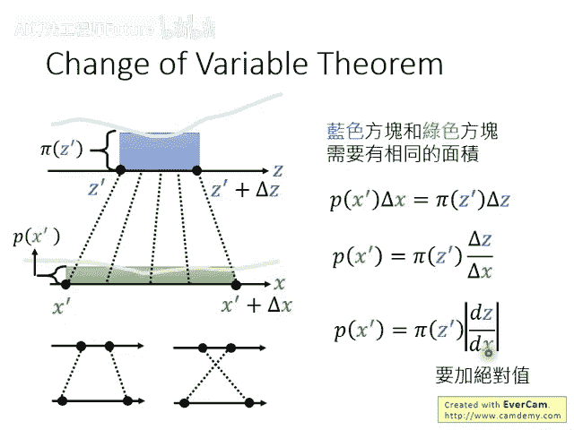

一个重要性质是：矩阵 **A** 的行列式与其逆矩阵 **A_inverse** 的行列式互为倒数：**det(A_inverse) = 1 / det(A)**。

### 3. 变量变换定理

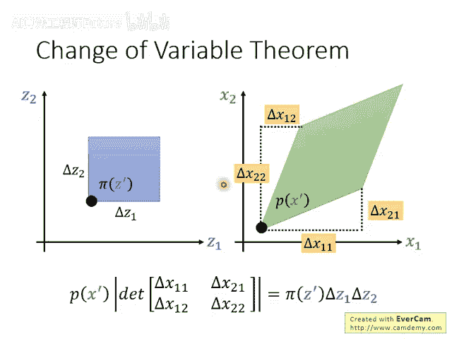

这是Flow模型的核心。它描述了当随机变量 **Z** 通过一个可逆函数 **F** 变换为 **X** 后，两者概率密度函数之间的关系。

**定理公式：**

```
P_X(x) = P_Z(z) * |det(J_F_inverse(x))|
```

其中，**z = F_inverse(x)**。也可以等价地写作：

```
P_X(x) = P_Z(z) / |det(J_F(z))|
```

这个公式意味着，输出 **x** 处的概率密度，等于输入 **z** 处的概率密度乘以变换函数 **F** 的逆函数的雅可比矩阵行列式的绝对值。

**直观理解：** 概率密度在变换过程中需要“守恒”。如果函数 **F** 将输入空间的一个小区域“拉伸”了，那么该区域的概率密度就会相应“稀释”，拉伸的程度由雅可比行列式度量。

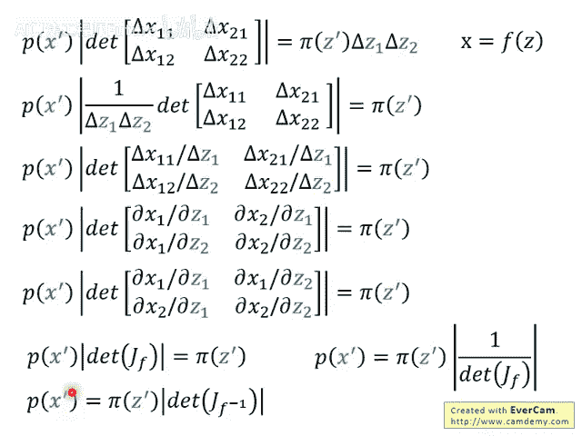

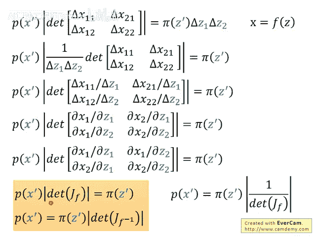

## Flow-based模型的核心思想

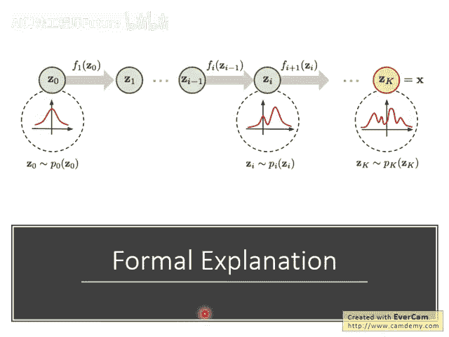

掌握了变量变换定理后，我们现在可以进入Flow模型的部分。

我们将变量变换公式写在旁边作为参考。回到生成问题，生成器 **G** 的训练目标是最大化 **log P_G(x_i)**。利用变量变换定理，我们可以将 **P_G(x_i)** 写出来：

**推导公式：**

```
log P_G(x_i) = log P_Z(z_i) + log |det(J_G_inverse(x_i))|
```

其中，**z_i = G_inverse(x_i)**。

因此，要最大化这个目标，我们需要计算两项：

1. **log P_Z(z_i)**：其中 **P_Z** 是我们预设的简单分布（如高斯分布）。
2. **log |det(J_G_inverse(x_i))|**：即生成器逆变换的雅可比矩阵行列式的对数。

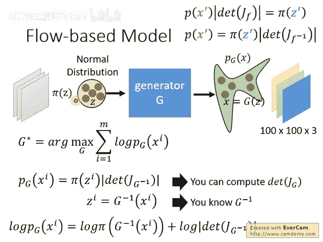

为了能高效地训练，我们的生成器 **G** 必须满足两个条件：

- **G_inverse 容易计算**：我们需要能从真实数据 **x_i** 反推出对应的 **z_i**。
- **雅可比行列式容易计算**：对于高维数据（如图像），雅可比矩阵非常大，直接计算其行列式计算量巨大。

因此，我们不能使用任意的神经网络作为 **G**，必须对其结构施加特殊限制，使其可逆且雅可比行列式易算。这导致单个 **G** 的变换能力有限。

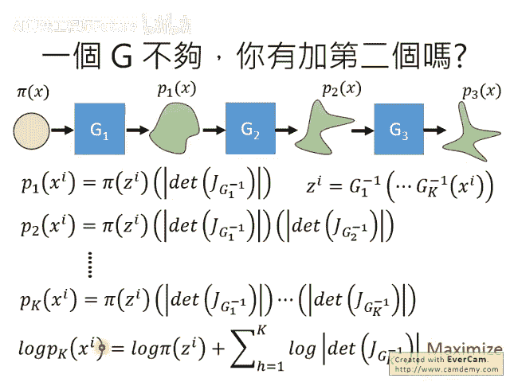

## 构建强大的Flow模型：耦合层与堆叠

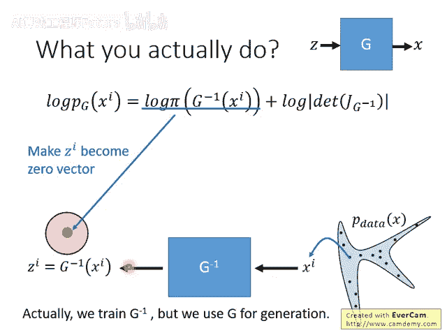

由于单个生成器的能力有限，Flow模型采用“流”的思想，将多个简单的生成器组合起来。

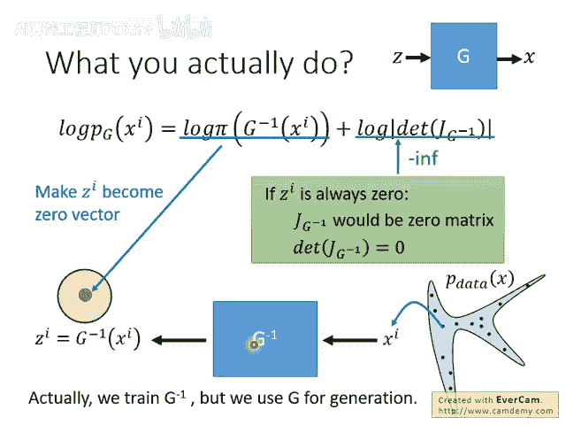

**核心策略：** 我们堆叠多个生成器：**G = G_K ◦ G_{K-1} ◦ ... ◦ G_1**。这样，虽然每个 **G_i** 能力简单，但它们的组合可以表达非常复杂的变换。

此时，最终分布的对数似然变为各个生成器贡献的求和：

```
log P_G(x_i) = log P_Z(z_i) + Σ_{k=1}^K log |det(J_G_k_inverse(·))|
```

其中，**z_i** 是通过所有生成器的逆变换依次作用于 **x_i** 得到的。

### 耦合层

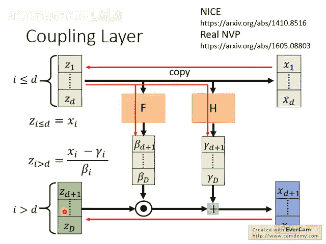

一个关键的设计是 **耦合层**，它被用于NICE和Real NVP等模型中。耦合层能保证逆变换和雅可比行列式都易于计算。

**耦合层操作（以二维为例）：**

1. 将输入向量 **Z** 分成两部分：**Z_a** (前d维) 和 **Z_b** (剩余维)。
2. 输出 **X** 的前d维直接复制 **Z_a**：**X_a = Z_a**。
3. 输出 **X** 的后半部分由 **Z_b** 变换得到：**X_b = Z_b ⊙ β + γ**。
  
  其中 **β** 和 **γ** 是由 **Z_a** 通过任意复杂函数 **F** 和 **H** 计算得到的向量（`⊙` 表示逐元素相乘）。
  **关键**：函数 **F** 和 **H** 可以是任意复杂的神经网络，不需要可逆。

**耦合层的逆变换：**

1. **Z_a** 直接从 **X_a** 复制得到。
2. 有了 **Z_a**，就可以通过相同的函数 **F** 和 **H** 算出 **β** 和 **γ**。
3. 然后计算 **Z_b = (X_b - γ) / β**。

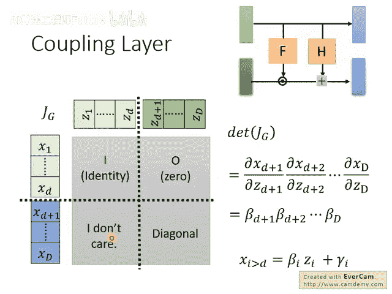

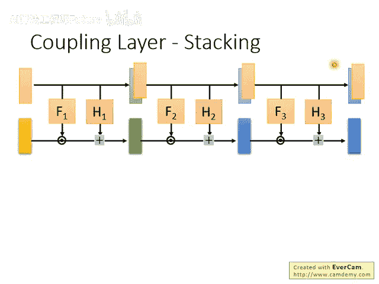

**耦合层的雅可比行列式：**  

其雅可比矩阵是一个分块三角矩阵。由于 **X_a** 是 **Z_a** 的直接复制，且 **X_b** 只依赖于 **Z_b**，该矩阵的行列式非常容易计算，它等于 **β** 向量所有元素的乘积：

```
det(J_coupling) = Π (元素 of β)
```

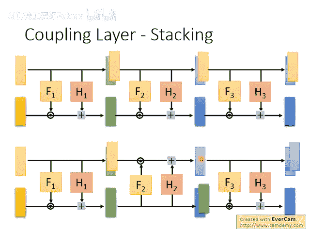

为了确保信息充分混合，在堆叠耦合层时，需要交替改变数据分割的方式（例如，一层复制前半部分，下一层复制后半部分，或按棋盘格、通道等不同方式分割）。

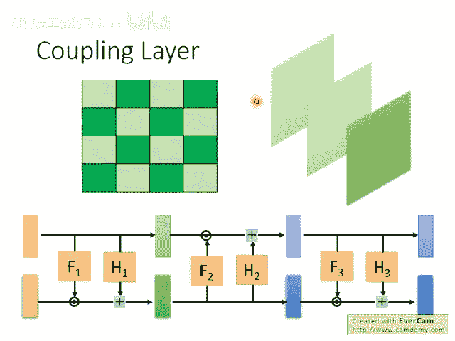

### 1x1 可逆卷积

在更先进的Flow模型如 **GLOW** 中，还引入了 **1x1 可逆卷积层**。

**操作：** 对于图像中的每个像素（一个3维的RGB向量），将其乘以一个可学习的3x3权重矩阵 **W**，得到输出像素。

**作用：** 它可以被视为对通道进行“洗牌”或重新混合，与耦合层配合使用，可以更灵活地变换特征。

**可逆性：** 只要权重矩阵 **W** 是可逆的，该变换就是可逆的。随机初始化的矩阵通常都是可逆的。

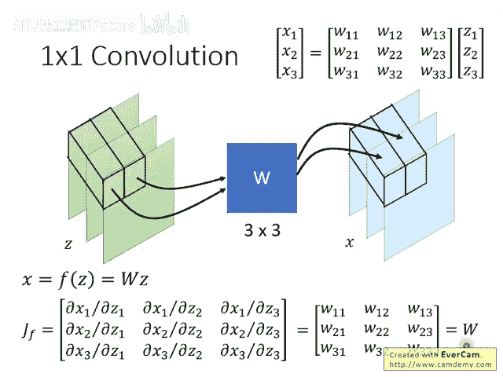

**雅可比行列式：** 对于整张图像，其雅可比行列式等于 **det(W)** 的 **(H*W)** 次方，其中H和W是图像的高和宽。由于 **W** 很小，其行列式很容易计算。

## Flow模型的应用与总结

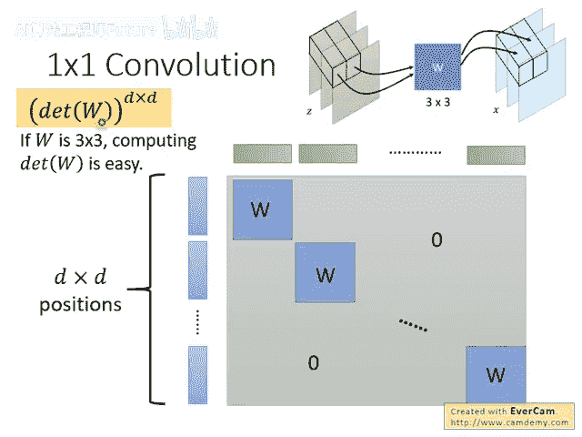

GLOW等现代Flow模型在图像生成上取得了惊艳的效果，其特点是可以进行精确的隐空间操作。

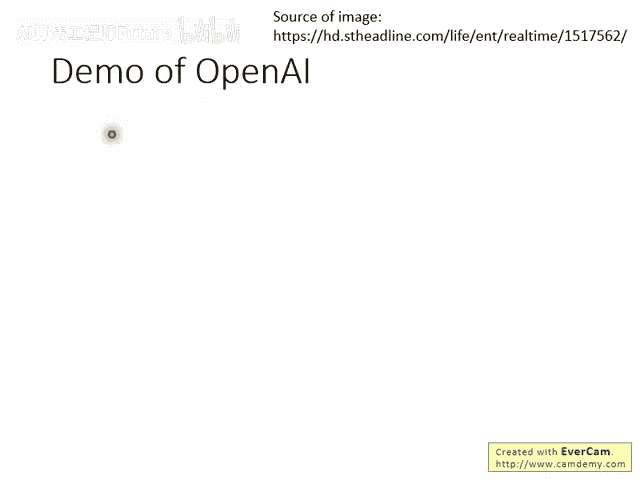

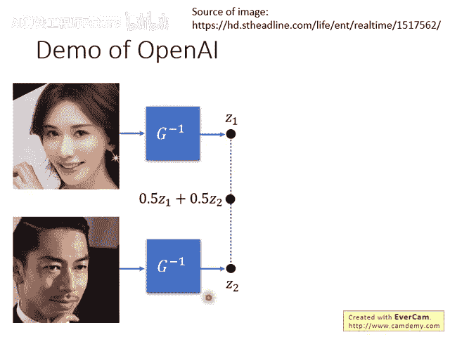

**典型应用：**

- **图像插值：** 将两张图像编码到隐空间，对其隐向量进行插值，再解码可以得到中间状态的逼真图像。
- **属性编辑：** 例如“让人脸微笑”。收集“微笑”和“不笑”的人脸图像，计算其隐向量的平均差，得到一个“微笑方向”。将任何人脸的隐向量加上这个方向，再解码，即可得到该人脸微笑的样子。

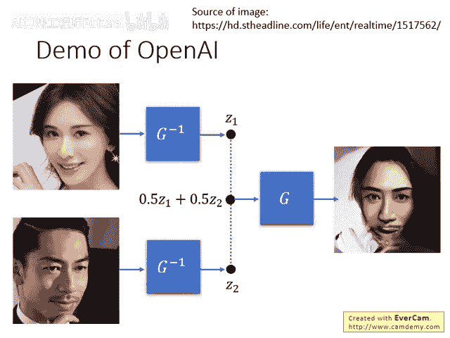

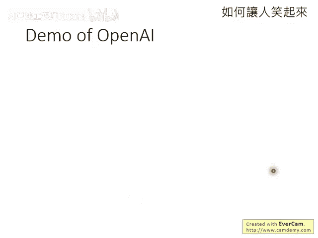

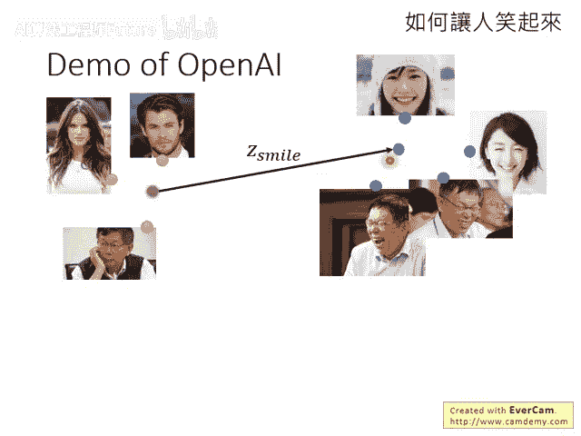

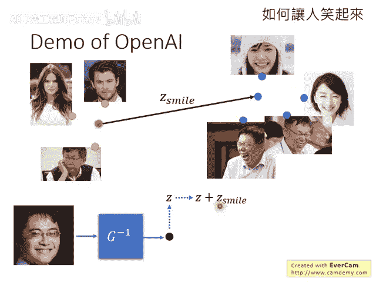

**总结：**

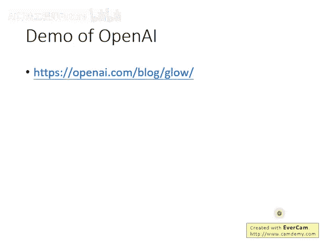

本节课我们一起学习了 **Flow-based生成模型**。我们从生成模型的回顾开始，引入了Flow模型解决直接优化似然函数的目标。通过理解 **雅可比矩阵**、**行列式** 和关键的 **变量变换定理**，我们掌握了Flow模型的数学基础。Flow模型通过设计特殊的网络层（如**耦合层**和**1x1卷积**），使得逆变换和雅可比行列式的计算变得可行，并通过堆叠多个这样的层来构建强大的生成能力。虽然其生成质量可能仍与顶尖GAN有差距，但Flow模型具有训练稳定、隐空间可解释性强等优点，在图像和语音合成等领域有着独特的应用价值。
