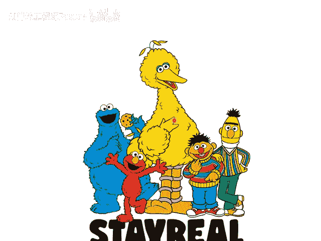
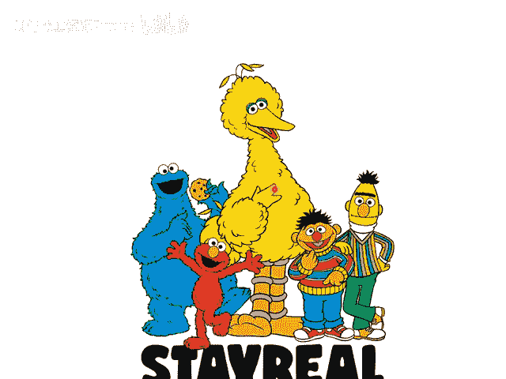
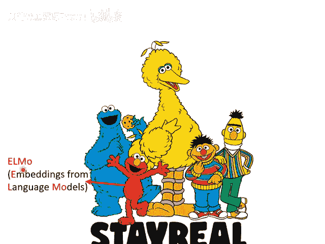
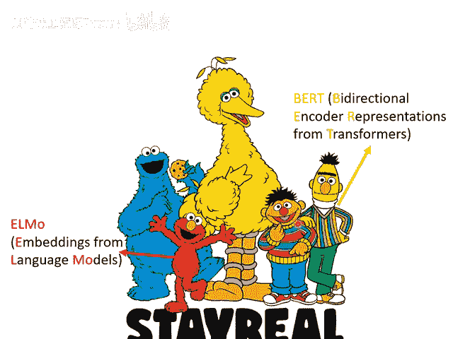
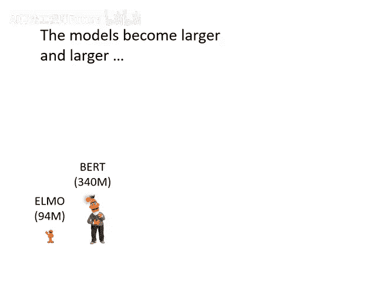
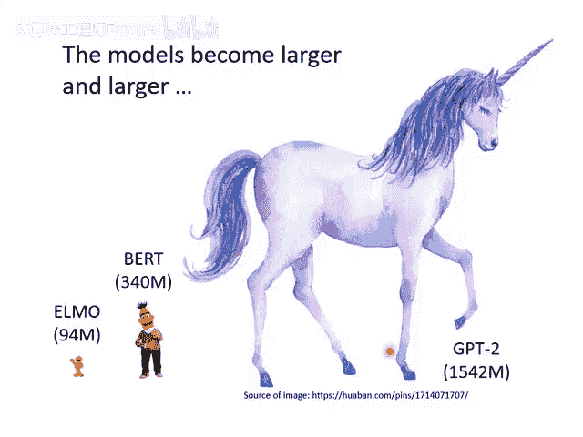
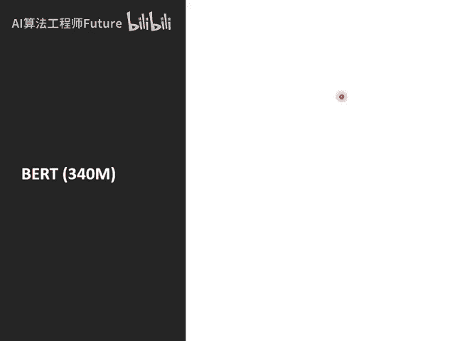
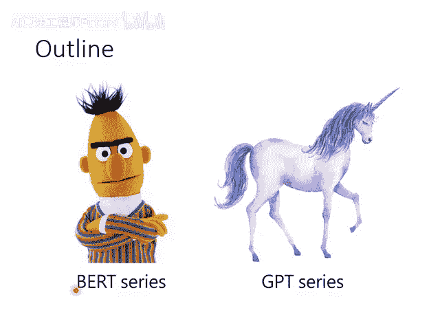

# 52：自监督学习 (Self-supervised Learning) - 1

在本节课中，我们将要学习自监督学习的基本概念，并认识一系列以芝麻街角色命名的著名模型。我们将了解这些模型的发展历程、规模大小以及它们在人工智能领域中的重要性。

---

### 🧠 自监督学习与芝麻街角色

在讲解自监督学习之前，需要先介绍一下芝麻街。因为自监督学习的许多模型都是以芝麻街的角色命名的。

以下是几个核心模型及其对应的芝麻街角色：

- **ELMo**：一个红色的怪物。在自监督学习中，有一个名为“Embedding from Language Modeling”的模型，其缩写就是ELMo。它是最早的自监督学习模型之一。
- **BERT**：一只黄色的鸟。这是最广为人知的自监督学习模型。BERT是“Bidirectional Encoder Representations from Transformers”的缩写。
- **ERNIE**：BERT最好的朋友。事实上，在BERT出现后，很快出现了两个不同的模型都叫ERNIE。其中一个模型的缩写是“Enhanced Representation through kNowledge IntEgration”，只是为了凑出ERNIE这个名字。
- **Big Bird**：一只大鸟。很快也有一个模型叫做Big Bird，全称是“Transformer for Longer Sequences”。这个名字已经不再刻意凑字母，直接采用了角色名。

目前，在自监督学习模型领域已经聚集了许多芝麻街的角色。

---

### 🏗️ 模型的规模：从ELMo到GPT-3

上一节我们介绍了这些模型的名字，本节中我们来看看它们的规模有多大。BERT是一个参数量巨大的模型，拥有3.4亿（340 million）个参数。

为了理解这个规模，我们可以做一个对比：课程作业四中的Transformer模型只有0.1 million个参数。BERT的规模是它的3400倍。因此，BERT确实是一个“巨人”般的模型。

然而，BERT还不算特别大。模型的发展就像“地鸣”发动，更多超大型模型不断涌现。

以下是几个重要模型的参数量对比，我们用身高来形象化地表示其规模（假设BERT的3.4亿参数对应1米高）：

- **ELMo**：0.94亿参数。
- **BERT**：3.4亿参数（约1米高）。
- **GPT-2**：15亿参数。
- **GPT-3**：1750亿参数。如果按比例换算，其“身高”相当于背后的台北101大楼那么高。
- **Switch Transformer**：目前已知的最大模型之一，参数量达到1.6万亿（1.6 trillion），规模又比GPT-3大了近十倍。

这些庞大的模型都在执行特定的任务。在接下来的课程中，我们将重点介绍BERT和GPT这两个模型，解释自监督学习模型具体在做什么。

---

本节课中我们一起学习了自监督学习领域中以芝麻街角色命名的一系列重要模型，并了解了从ELMo到GPT-3、Switch Transformer等模型在参数量上的巨大飞跃。下一讲我们将深入探讨这些模型的工作原理。
