# 54：自监督学习 (3) - BERT的奇闻异事 🤖

在本节课中，我们将探讨BERT模型为何有效，并深入了解其背后的一些有趣现象和实验。我们将从最常见的解释开始，逐步深入到一些挑战直觉的实验发现。

## 概述 📖

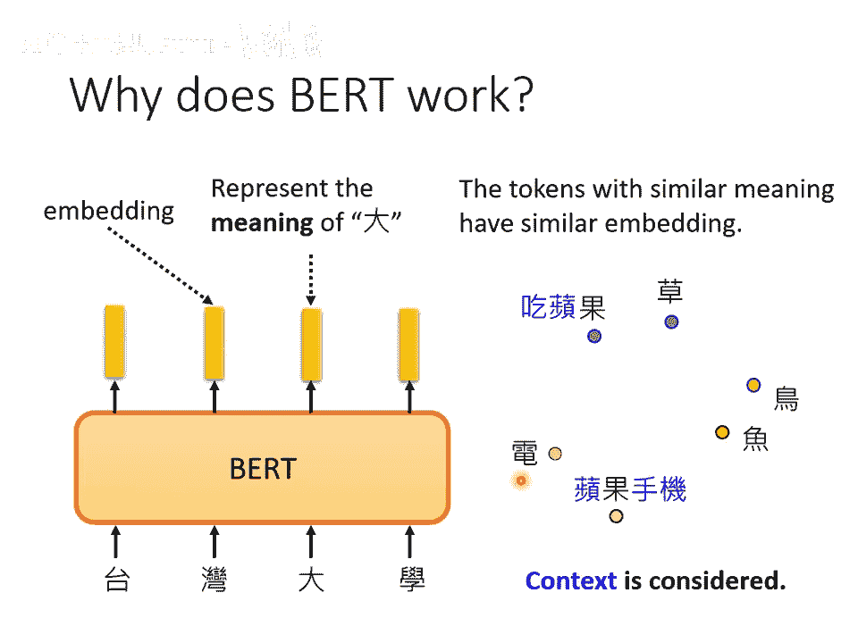

BERT（Bidirectional Encoder Representations from Transformers）是一种基于Transformer架构的预训练语言模型。它通过“填空”任务（即掩码语言建模）进行训练，学会了理解词汇在上下文中的含义。本节课将解释BERT的工作原理，并通过具体例子和实验展示其神奇的能力与未解之谜。

---

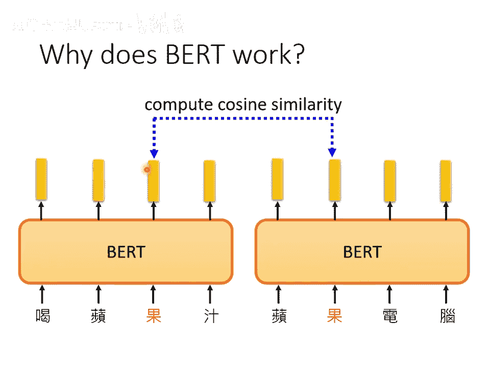

## BERT为何有效？常见的解释 🧠

上一节我们介绍了BERT的基本训练方式。本节中，我们来看看为何这种训练方式能让模型理解语言。

BERT的输入是一串文字，每个文字都会对应一个输出向量。这个向量被称为**嵌入**。这些嵌入向量的特别之处在于，它们代表了输入文字的含义。

更具体地说，如果将这些字对应的向量可视化或计算它们之间的距离，你会发现含义越相近的字，它们的向量就越接近。例如，“苹果”（水果）和“橘子”都是水果，它们的向量可能比较接近；而“苹果”（公司）和“微软”都是科技公司，它们的向量也可能比较接近。但“苹果”（水果）和“苹果”（公司）的向量则会相差较远。

你可能会问，中文存在一字多义的问题。实际上，许多语言都有这个问题。BERT可以考虑上下文，因此同一个字在不同的上下文中，其向量是不同的。例如，“吃苹果”中的“果”和“苹果手机”中的“果”，虽然都是“果”字，但根据上下文的不同，它们对应的嵌入向量会非常不一样。“苹果手机”的“果”可能更接近“科技”相关的词汇。

BERT真的能做到这一点吗？答案是肯定的。

以下是验证BERT理解一词多义的实验步骤：

1. 收集大量包含“果”字的句子（例如“喝苹果汁”、“苹果电脑”）。
2. 将这些句子输入BERT模型。
3. 提取每个句子中“果”字对应的输出嵌入向量。
4. 计算这些向量两两之间的**余弦相似度**。

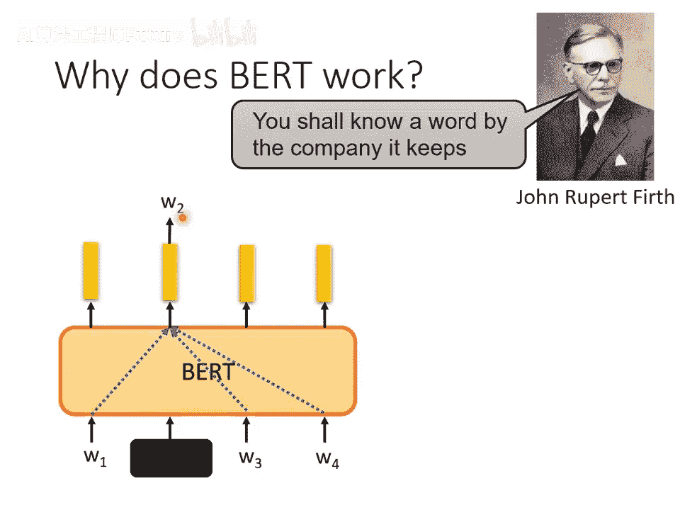

实验结果显示，代表“水果”含义的“果”字向量彼此相似度高，代表“公司”含义的“果”字向量彼此相似度也高，但这两组向量之间的相似度则较低。这表明BERT能够根据上下文区分词汇的不同含义。

因此，BERT在训练做填空题的过程中，似乎学会了每个字词的含义。对它而言，中文符号不再是毫无关联的，它理解了语义，从而能在后续任务中表现得更好。

---

## 理论基础：上下文决定词义 📚

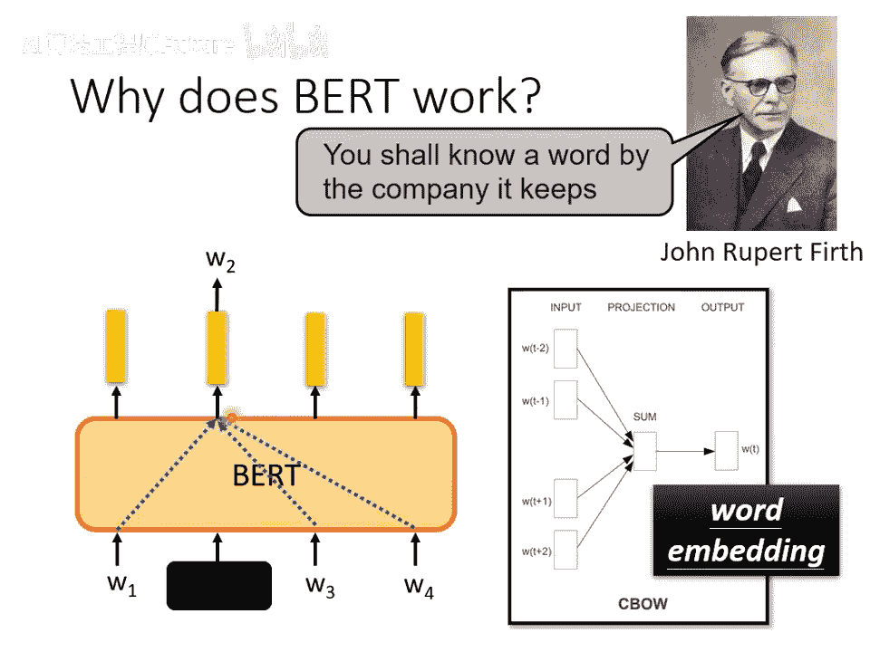

上一节我们看到了BERT区分词义的现象，本节我们来探讨其背后的语言学假设。

BERT为何拥有这种神奇的能力？其基础是一个语言学的假设，由语言学家John Rupert Firth在1960年代提出：“**一个词的含义取决于它的上下文**”（“You shall know a word by the company it keeps”）。

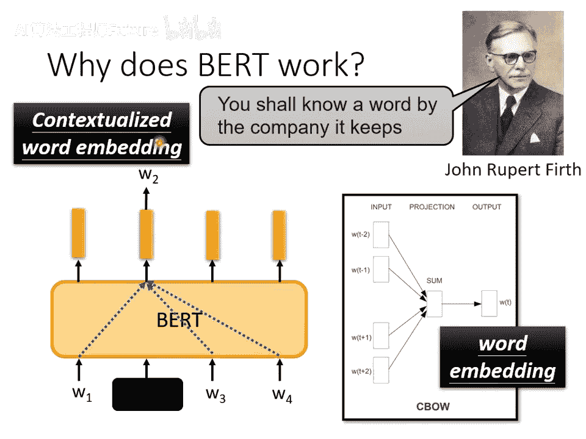

例如，可食用的“苹果”常与“吃”、“树”、“甜”等词一同出现；而作为公司的“苹果”则常与“电脑”、“专利”、“股价”等词一同出现。一个词的意思可以从其上下文中推断出来。

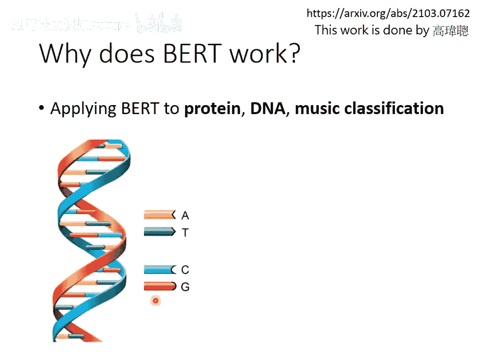

BERT在训练过程中所做的，正是学习从上下文中抽取信息。训练时，我们给模型输入 `[w1, w2, w3, w4]` 并把 `w2` 掩码，让它预测 `w2`。它如何预测？就是通过观察 `w1, w3, w4` 这些上下文。因此，模型输出的向量，本质上是上下文信息的精华浓缩，用于预测被掩码的词。

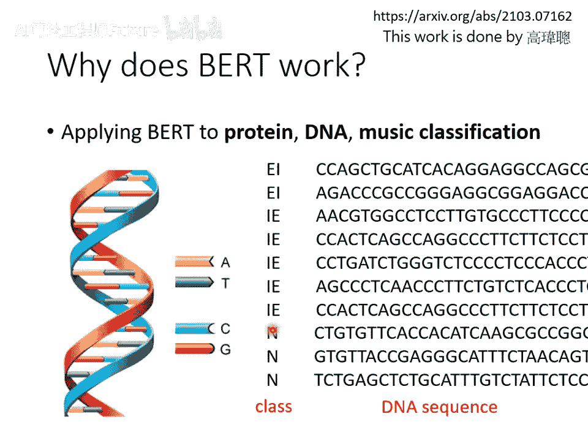

这种思想在BERT之前就已存在。例如，**Word2Vec** 技术中的 **Skip-gram** 模型做的事情就与BERT类似：给定中心词，预测周围的上下文词。这种词嵌入技术可以为每个词汇赋予一个代表其含义的向量。

有人会问，为什么Skip-gram只用简单的线性模型？能否更复杂？这主要是受当时（约2016年）计算能力的限制。如今，BERT可以看作是**深度化、上下文感知的进阶版Word2Vec**。因此，BERT产生的嵌入又被称为 **上下文相关的词嵌入**。

---

## 挑战直觉的实验：BERT在非语言任务上的表现 🔬

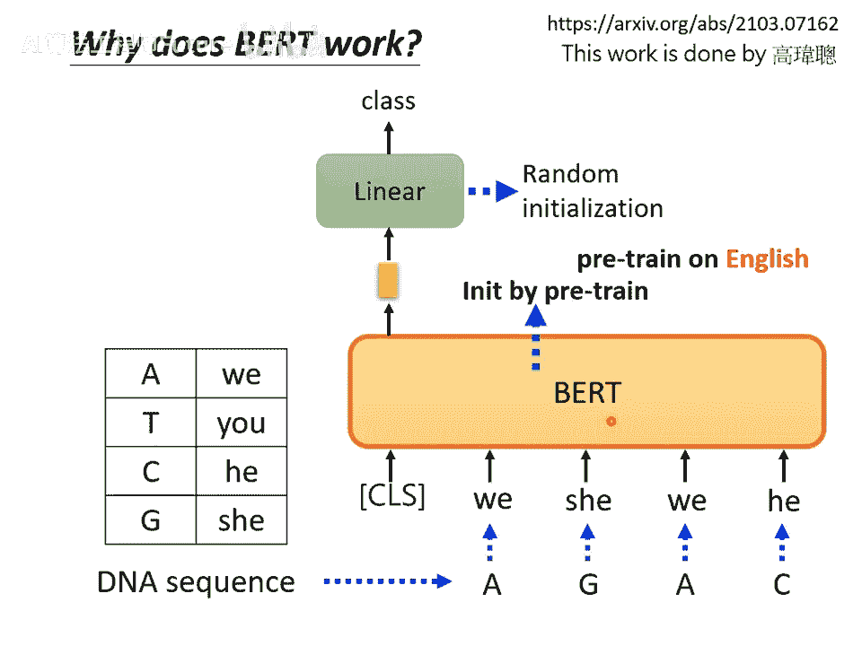

上一节我们介绍了BERT基于语义理解的常见解释，本节中我们将看到一个完全不同的、令人费解的实验。

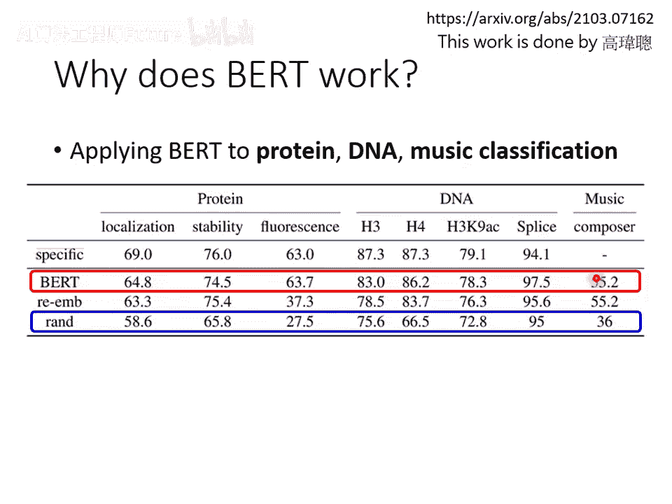

如果BERT的强大仅仅源于对语义的理解，那么下面这个实验的结果将难以解释。我们实验室的同学进行了一项实验：将**在文本上预训练的BERT**，直接用于**蛋白质分类**、**DNA分类**或**音乐分类**任务。

以DNA分类为例。DNA是由一串脱氧核糖核酸组成，共有四种碱基，用字母 **A, T, C, G** 表示。我们的任务是根据一串DNA序列（如 `ATCG...`）判断其类别。

实验的“神奇”操作如下：

1. 将A, T, C, G四个字母**随机映射**到四个英文单词（例如，A->`we`, T->`you`, C->`he`, G->`she`）。这个映射关系是随机的，且对结果影响不大。
2. 将DNA序列（如 `AGAC`）转换为对应的、毫无意义的英文单词序列（如 `we she we he`）。
3. 将这个“乱码”句子输入BERT模型（使用在英文文本上预训练好的权重）。
4. 像处理普通文本分类一样，用BERT的输出进行DNA类别分类。

这个实验看起来毫无道理：BERT擅长理解语义，但输入是一堆乱码，它理应“看不懂”。然而，实验结果却显示，使用预训练BERT（红色）的效果，显著优于不使用BERT的模型（蓝色）。

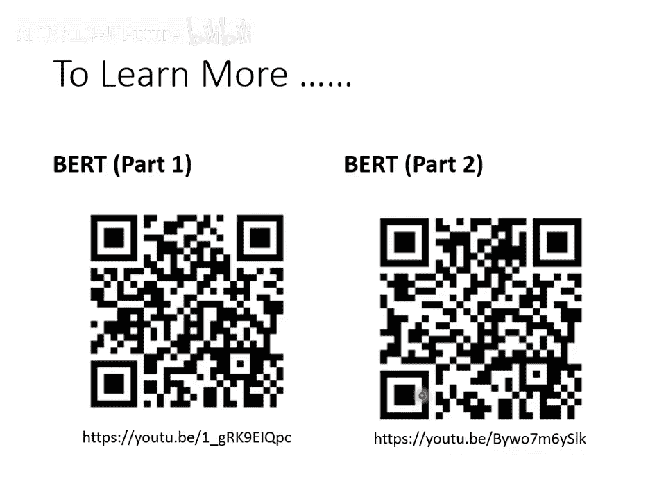

这个实验并非要否认BERT学习语义的能力（我们已从词向量中观察到这一点），而是想说明：**即使输入对BERT而言是毫无意义的句子，它依然能提升模型性能**。这表明BERT的有效性可能不完全源于语义理解，或许还有其他原因，例如：

- BERT提供了一组**特别好的模型参数初始化值**，这组初始化本身就非常适合下游任务的微调。
- 其内部结构（如Transformer）具有强大的特征提取能力。

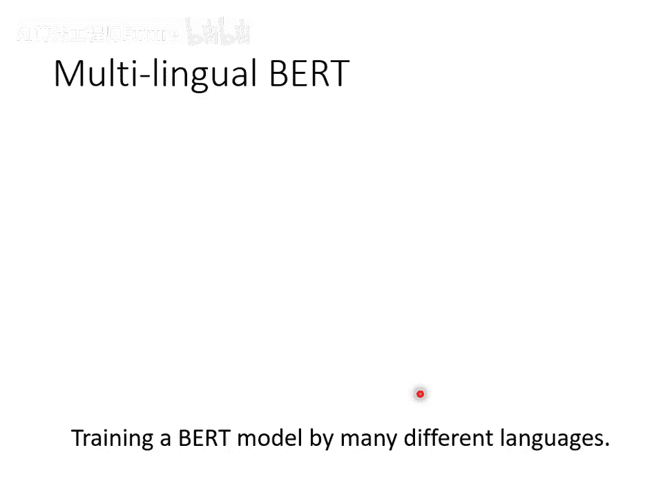

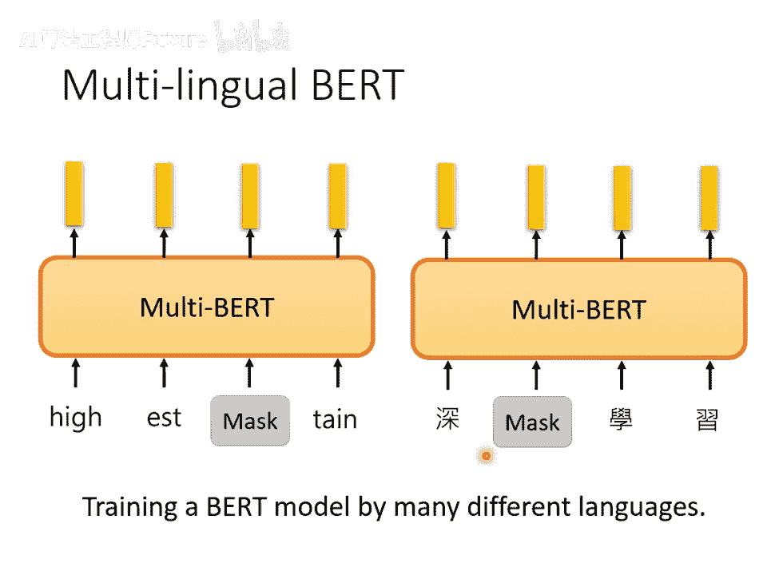

这个实验告诉我们，对于BERT乃至许多新模型为何成功，仍有巨大的研究空间。

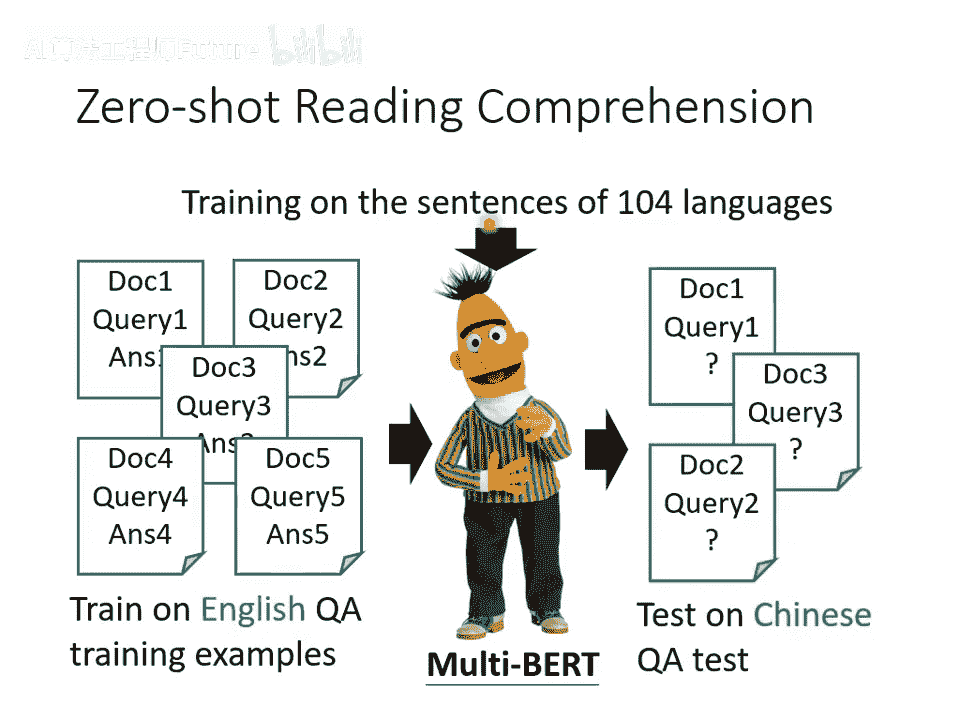

---

## 多语言BERT的奇迹 🌐

上一节我们探讨了BERT能力的边界，本节我们来看看BERT另一个令人惊叹的特性：多语言能力。

多语言BERT在预训练时，会使用**多种语言**（如中、英、德、法文）的文本进行“填空”训练。例如，Google发布的 **Multilingual BERT** 就使用了104种语言。

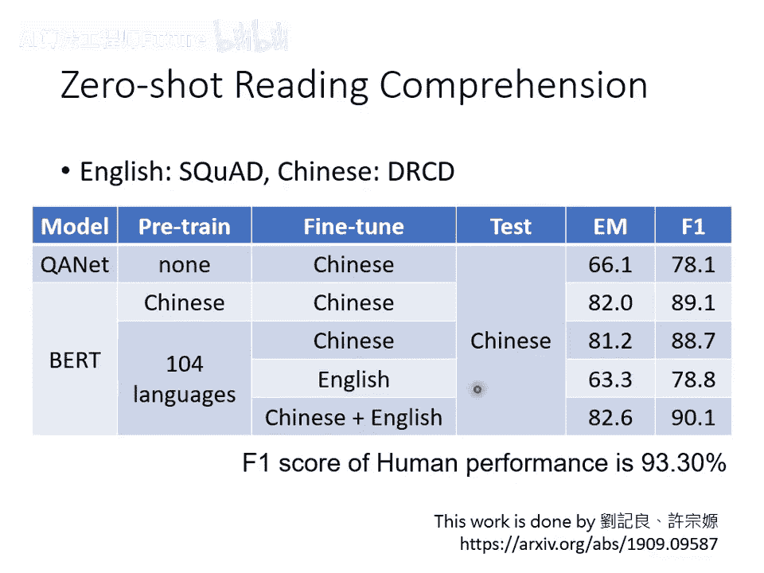

它的神奇之处在于：**用英文的问答数据集对多语言BERT进行微调后，它竟然能直接处理中文的问答任务**。

具体实验如下：

- **训练**：仅使用英文问答数据集（如SQuAD）对多语言BERT进行微调。
- **测试**：直接在中文问答数据集（如DRCD）上测试，模型从未在中文问答数据上学习过。
- **结果**：模型取得了相当不错的准确率（约78%），与之前不使用BERT的顶尖模型（QANet）性能相当。

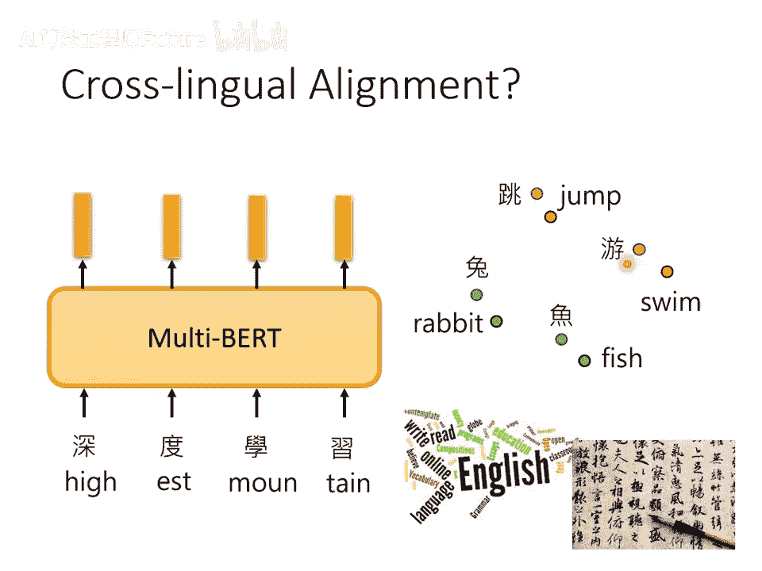

这就像一个只学过英文阅读理解的学生，第一次参加中文阅读理解考试就考出了好成绩。为什么会这样？

一个合理的推测是：在多语言预训练过程中，BERT**自动将不同语言中含义相同的词汇在向量空间中对齐了**。例如，“apple”和“苹果”的向量很接近，“jump”和“跳”的向量也很接近。因此，当模型学会了英文的“问答”模式后，这种模式可以迁移到向量含义相似的中文词汇上。

我们通过实验验证了这一猜想。使用 **Mean Reciprocal Rank (MRR)** 指标来衡量不同语言间词向量的对齐程度，MRR值越高，说明对齐越好。实验发现，大规模训练的多语言BERT确实实现了很高的跨语言对齐。

一个有趣的发现是：**数据量是实现跨语言对齐的关键**。当我们尝试用较少的数据自己训练多语言BERT时，模型无法有效对齐不同语言。只有当数据量足够大时，这种“语言无关”的表征才会出现。

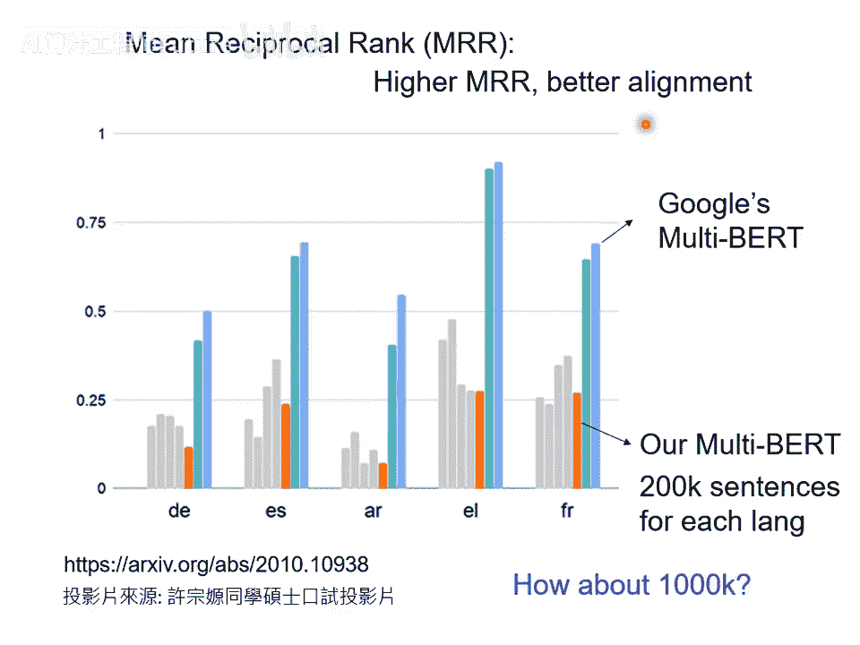

---

## 探索BERT中的语言信息 🕵️♂️

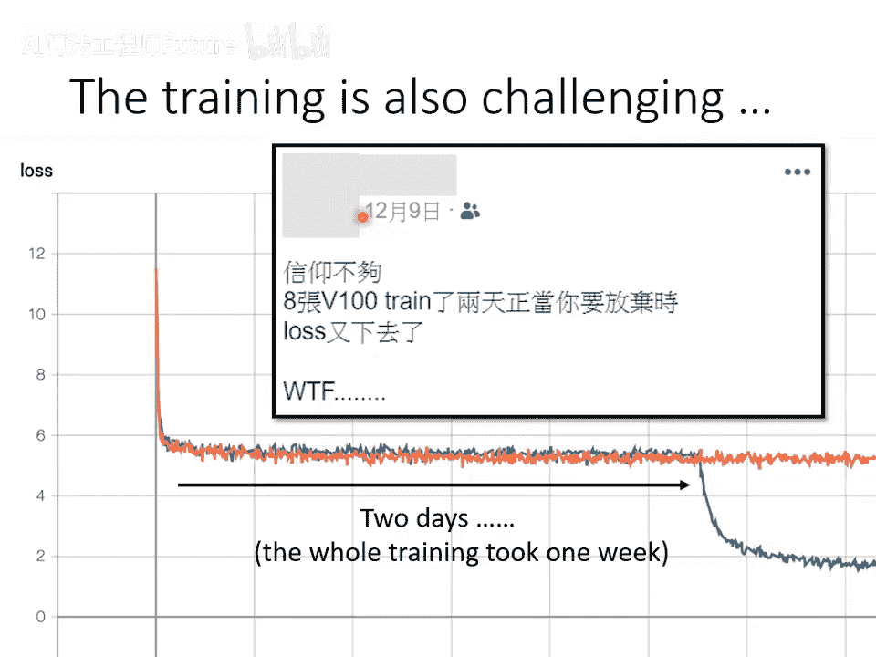

上一节我们看到多语言BERT似乎抹平了语言差异，但事实果真如此吗？本节我们来一探究竟。

如果多语言BERT完全抹去了语言信息，那么给它一个英文句子，它可能会填出中文答案，但这并没有发生。说明它仍然保留了语言线索。

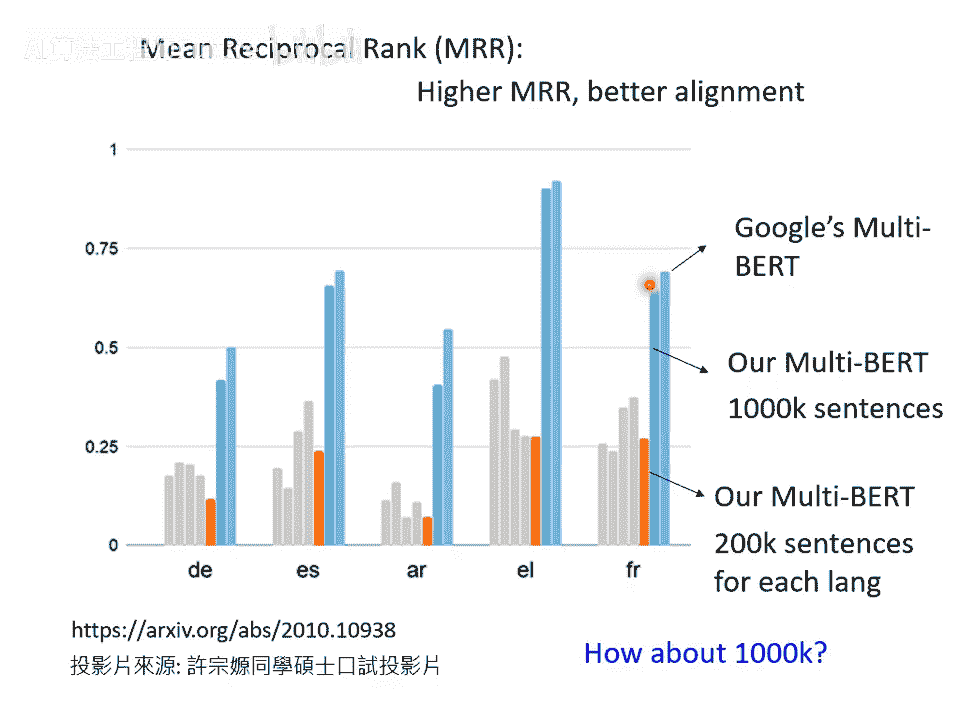

我们的研究发现，语言信息其实就藏在词向量里。具体操作如下：

1. 计算所有英文词汇嵌入向量的平均值。
2. 计算所有中文词汇嵌入向量的平均值。
3. 将这两个平均值相减，得到一个“**语言偏移向量**”（可理解为从英文空间指向中文空间的向量）。

接下来，进行一个神奇的实验：

- 给多语言BERT输入一句英文：`There is no one who can help me.`
- 获取模型内部对应的词嵌入。
- 将这些词嵌入**加上**之前计算出的“语言偏移向量”。
- 然后让BERT对这个“改造后”的嵌入做填空题。

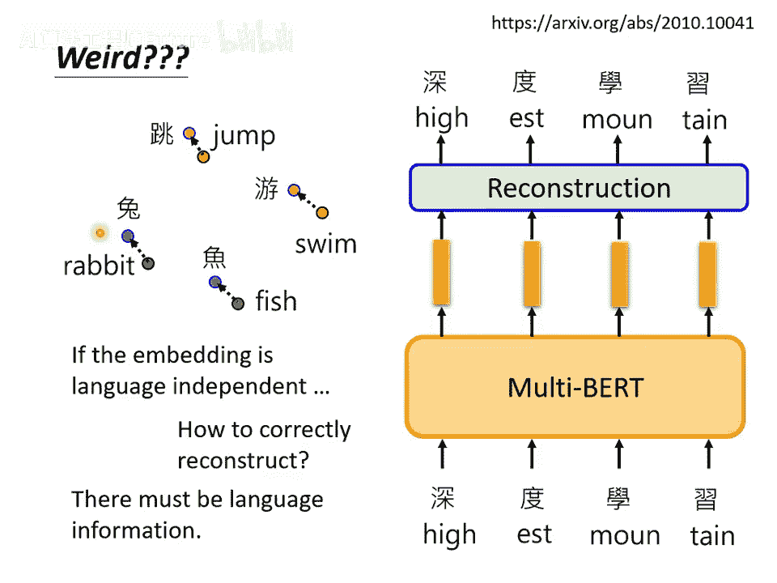

结果，BERT输出的答案变成了中英文混杂的句子：`There是无人 who can help我。`。它知道 `no one` 对应“无人”，`me` 对应“我”。

这虽然不是一个完美的翻译，但说明了两点：

1. BERT内部确实存在可分离的语言信息。
2. 通过简单的向量运算，可以在一定程度上实现**无监督的词汇级翻译**。

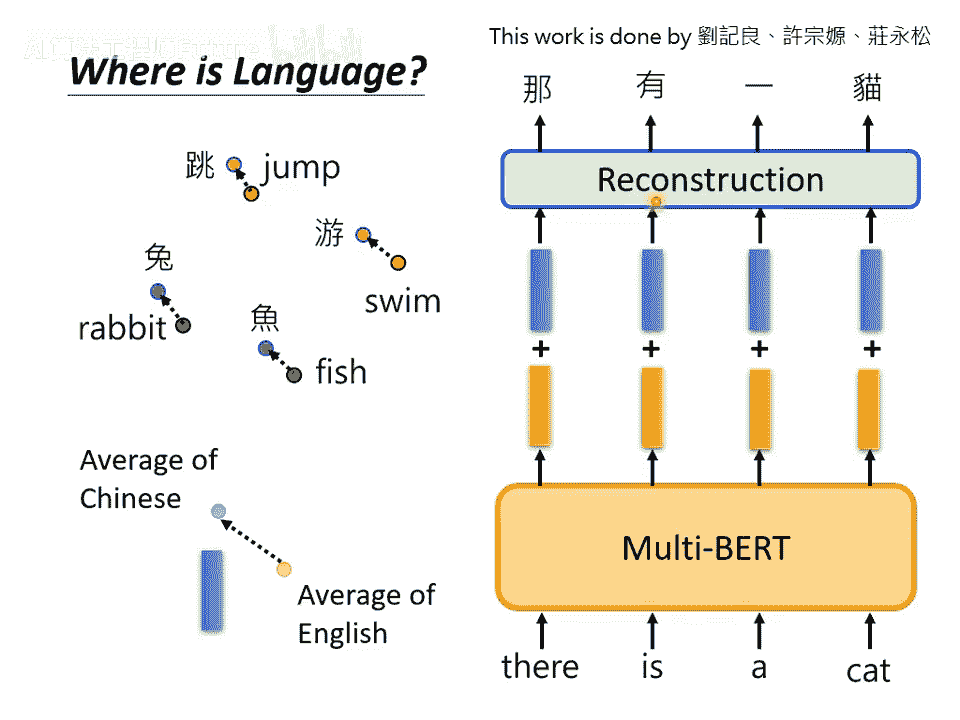

---

## 总结 🎯

本节课我们一起学习了BERT模型背后的原理与一些奇特现象：

1. **常见解释**：BERT通过上下文预训练，学会了词汇的语义表示，能区分一词多义。
2. **理论基础**：其思想源于“上下文定义词义”的语言学假设，是深度化、上下文相关的词嵌入技术。
3. **挑战与反思**：实验表明，即使输入无意义的“乱码”，BERT也能提升某些任务性能，提示其能力可能部分源于优秀的参数初始化，而不仅仅是语义理解。
4. **多语言能力**：多语言BERT能将不同语言中语义相同的词在向量空间中对齐，从而实现跨语言的任务迁移，且大规模数据是此能力的关键。
5. **语言信息探秘**：多语言BERT并未完全消除语言信息，通过向量运算可以揭示并操纵其内部的语言属性。

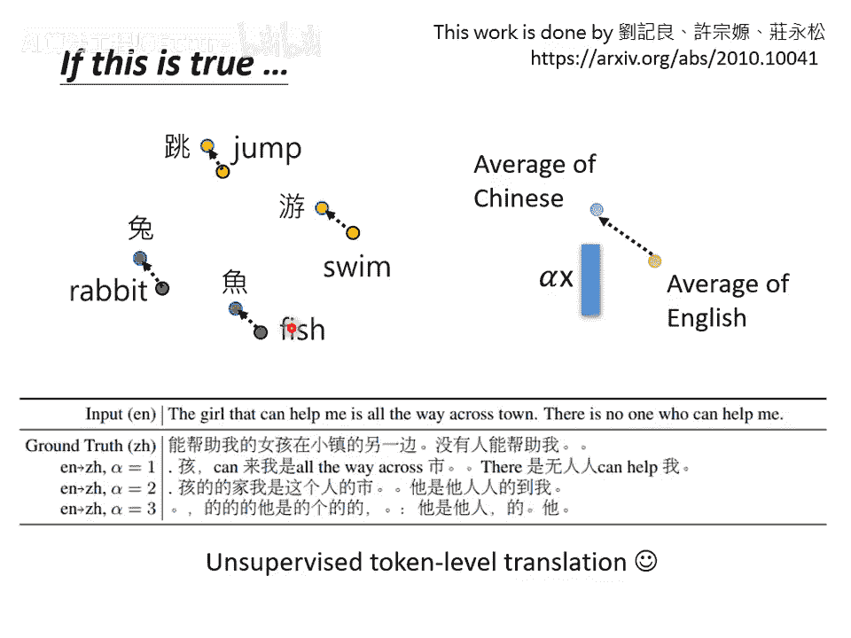

BERT为何如此有效，仍然是一个充满活力、有待深入探索的研究领域。
