# 59：作业七说明 📚

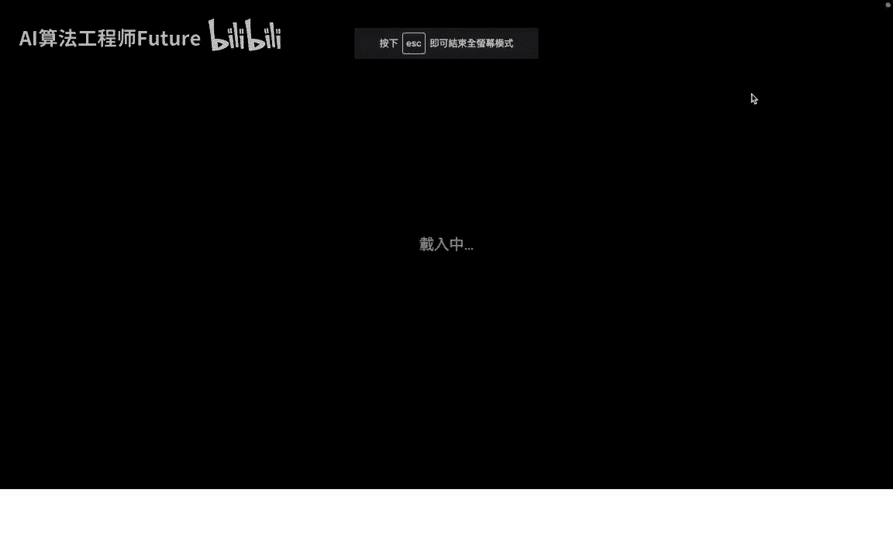

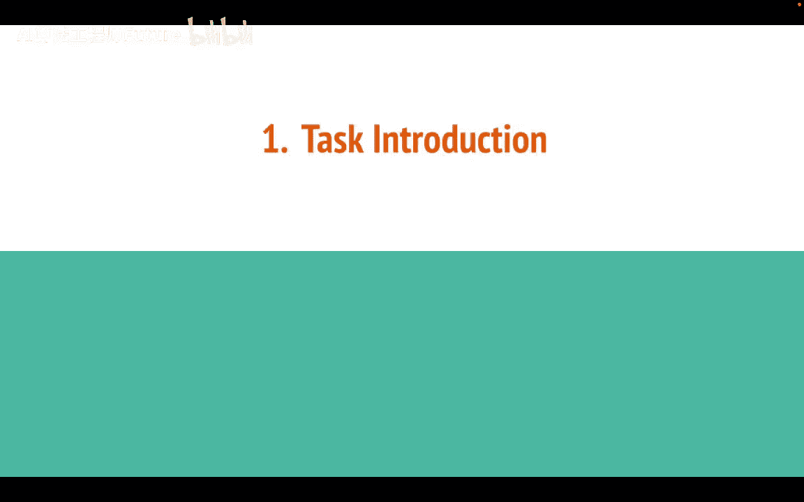

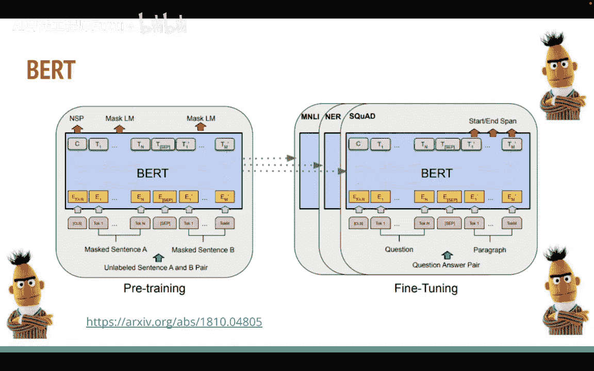

在本节课中，我们将学习如何使用BERT模型来完成抽取式问答任务。我们将详细介绍任务背景、数据处理方法、模型实现细节以及如何通过不同难度的基准线。

---

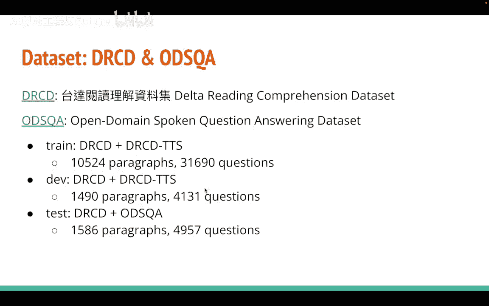

## 任务介绍 🤖

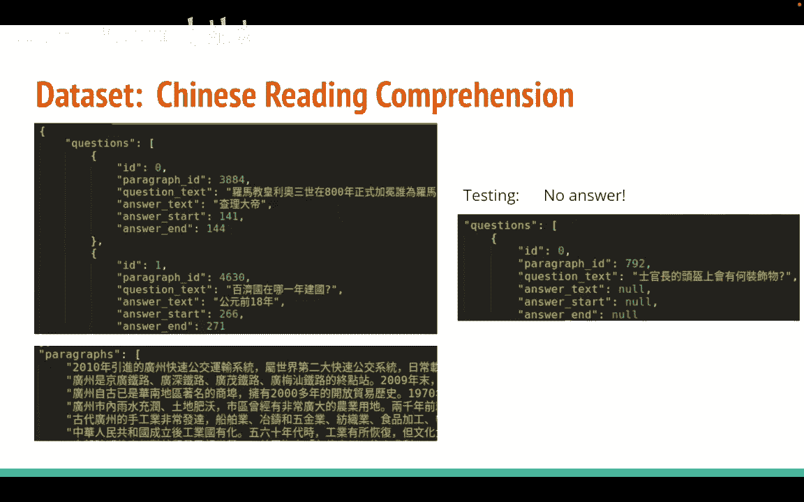

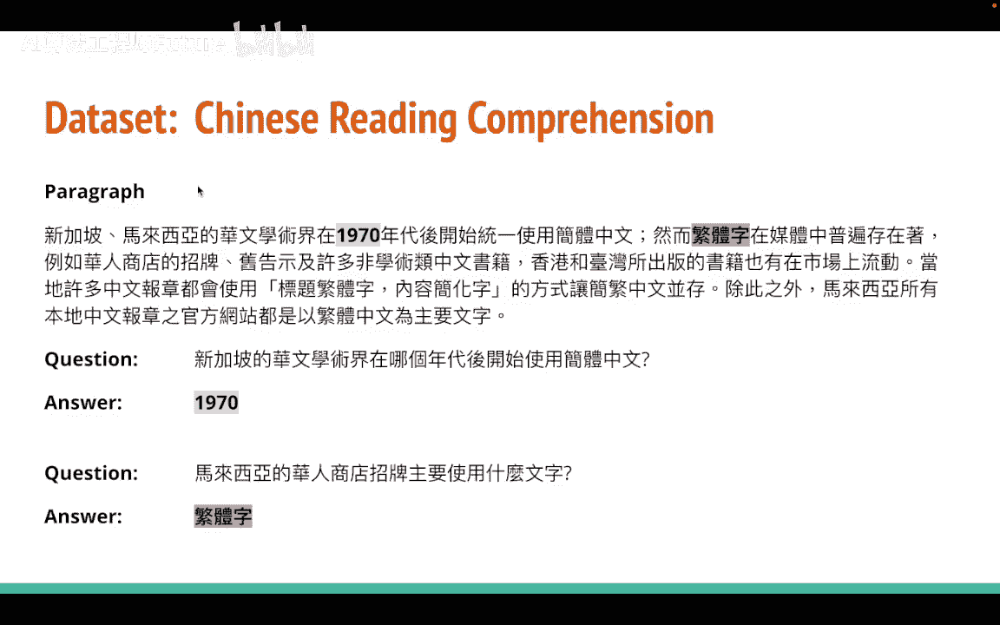

上一节我们介绍了BERT的基本概念，本节中我们来看看本次作业的具体任务。

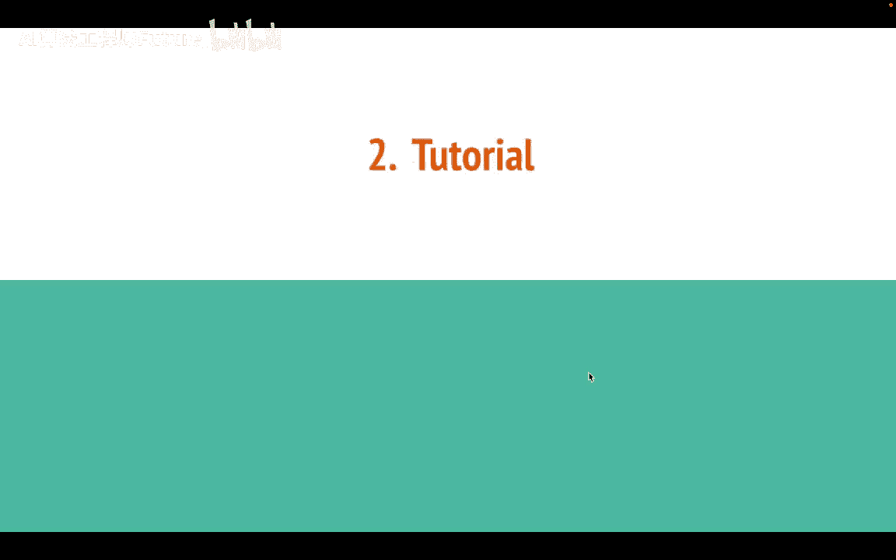

本次作业的目标是使用BERT模型完成一个抽取式问答任务。BERT通过在海量无标注文本上进行预训练，之后可以在不同的下游任务中进行微调。

我们本次要完成的下游任务是抽取式问答。具体流程是，将文章和问题输入到模型中，BERT模型会预测出正确答案在文章中的开始位置和结束位置。由于是抽取式的，所以模型会从文章中截取一段文字作为答案，因此正确答案一定存在于文章中。

以下是本次任务使用的两个数据集：

- **DRCD**：一个中文阅读理解数据集。
- **ODSQA**：通过语音合成生成语音资料，再经语音识别转成文字的数据集，其中可能包含语音噪声，但不影响最终答案选择。

训练集包含1万多个段落和3万多个问题，平均每个段落对应三到四个问题。开发集和测试集各包含约1500个段落和4000多个问题。

数据格式主要分为`questions`和`paragraphs`两部分。`questions`包含问题ID、对应的段落ID、问题文本、答案文本以及答案的开始和结束位置。`paragraphs`是排序好的文章列表。测试集的格式与训练集相同，但不包含答案信息。训练集、开发集和测试集之间的段落和问题内容可能相关，但不会重叠。

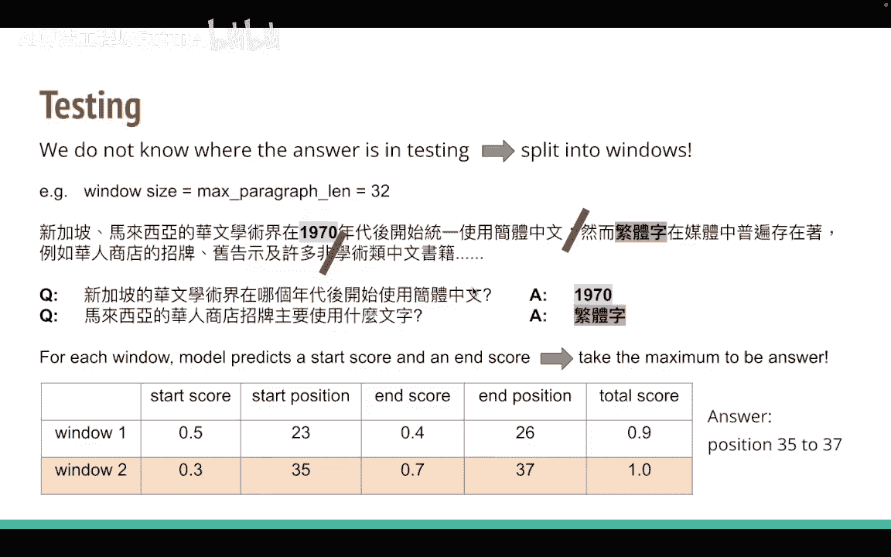

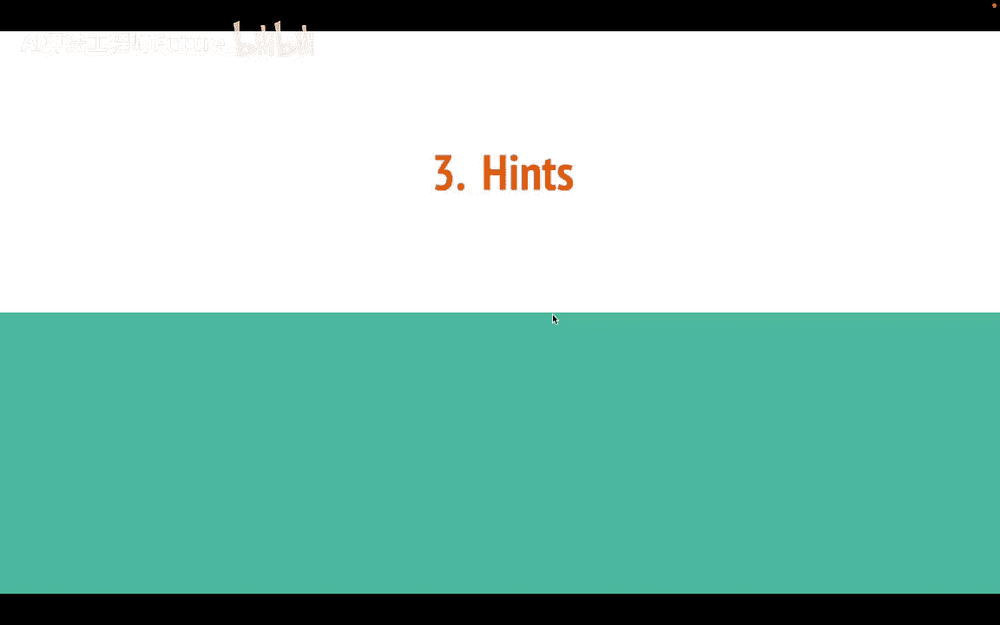

---

## 实现教程 💻

了解了任务背景后，本节我们来看看具体的实现方法。

在将文本传入模型之前，需要进行预处理。首先是对文本进行分词，将一个句子分割成多个词元。分词后，需要进行独热编码，将词元转换为索引向量，才能传入模型进行训练。

除了转换为索引向量，在传入BERT前还需进行额外的预处理，主要包括三个部分：

1. **input_ids**：代表输入的词元索引。首先需要添加一个特殊的起始词元，然后使用一个分隔词元将问题和文章隔开。由于每个输入序列长度可能不同，需要使用填充词元使所有输入保持相同长度。
2. **token_type_ids**：用于区分输入中的两段文本。第一段文本（如问题）用0表示，第二段文本（如文章）用1表示，填充部分也用0表示。
3. **attention_mask**：指示模型应该关注哪些位置。填充部分设为0（不关注），其余部分设为1（关注）。

另一个关键问题是文章长度。大部分文章长度集中在三四百字左右，但有些可能接近1000字。而BERT模型的输入限制为512个词元。因此，对于过长的文章，我们需要解决方法。

以下是针对训练和测试的不同策略：

- **训练阶段**：由于我们知道正确答案的位置，可以采用以答案为中心，向两侧扩展一个固定长度的窗口的方法。因为回答问题所需的信息很可能就在这个窗口内。
- **测试阶段**：由于不知道答案位置，我们将长文章切割成多个短的、可能重叠的窗口。模型会为每个窗口预测答案的起始和结束概率。我们通过比较各窗口的综合得分（如起始概率与结束概率之和）来判断答案最可能位于哪个窗口。

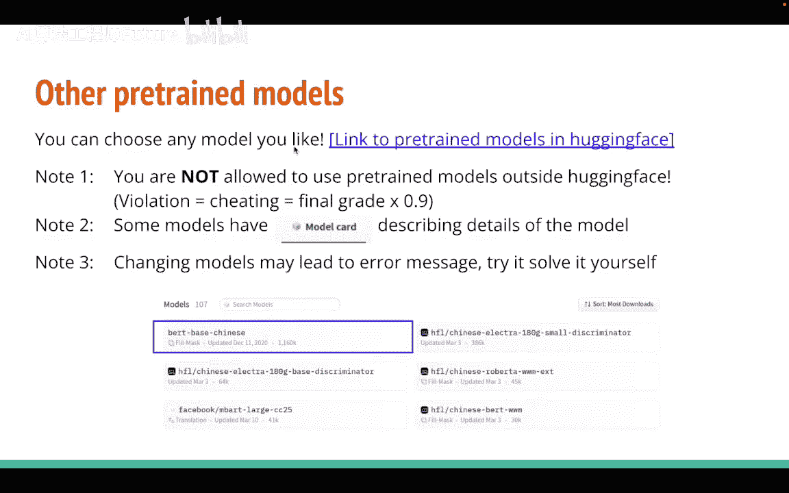

---

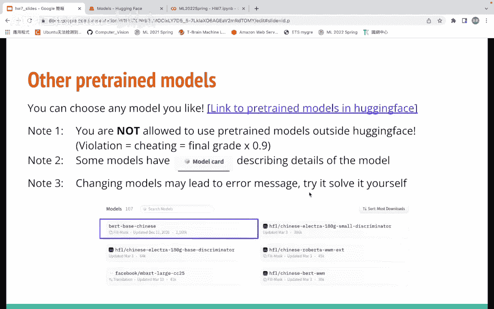

## 通过基准线的提示 🎯

上一节我们介绍了数据处理的核心方法，本节中我们来看看如何通过不同难度的作业基准线。

以下是各个基准线需要实现的内容：

- **Simple Baseline**：成功运行提供的示例代码即可通过。
- **Medium Baseline**：需要实现线性学习率衰减，并修改一个名为 `doc_stride` 的参数。
- **Strong Baseline**：需要修改预处理部分，并尝试使用不同的预训练模型。
- **Boss Baseline**：需要修改后处理部分，并进一步优化前述提示点或调整超参数。

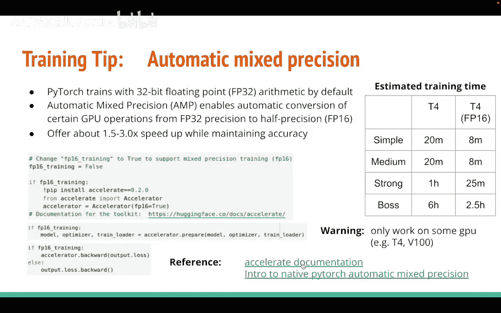

以下是训练相关的实用技巧：

- **自动混合精度训练**：此功能允许GPU在计算时自动在FP32和FP16精度之间切换，以加快训练速度，通常可提速1.5到3倍。示例代码中已实现，只需将变量 `fp16_training` 设为 `True` 即可启用。注意，并非所有GPU都支持此功能。
- **梯度累积**：当希望使用更大的批处理规模或更大的模型，但GPU内存不足时，可以使用梯度累积。其原理是累积多个小批次的梯度后再一次性更新模型参数，从而模拟大批次训练的效果。

---

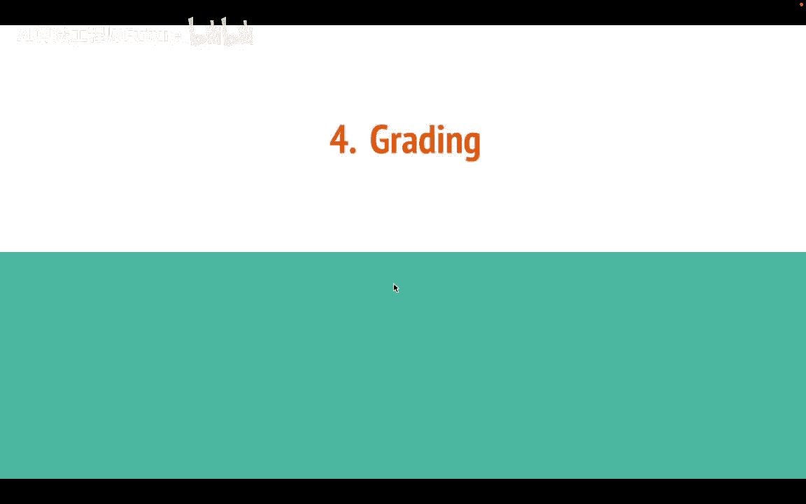

## 评分与报告要求 📝

本节我们将明确本次作业的评分标准和报告要求。

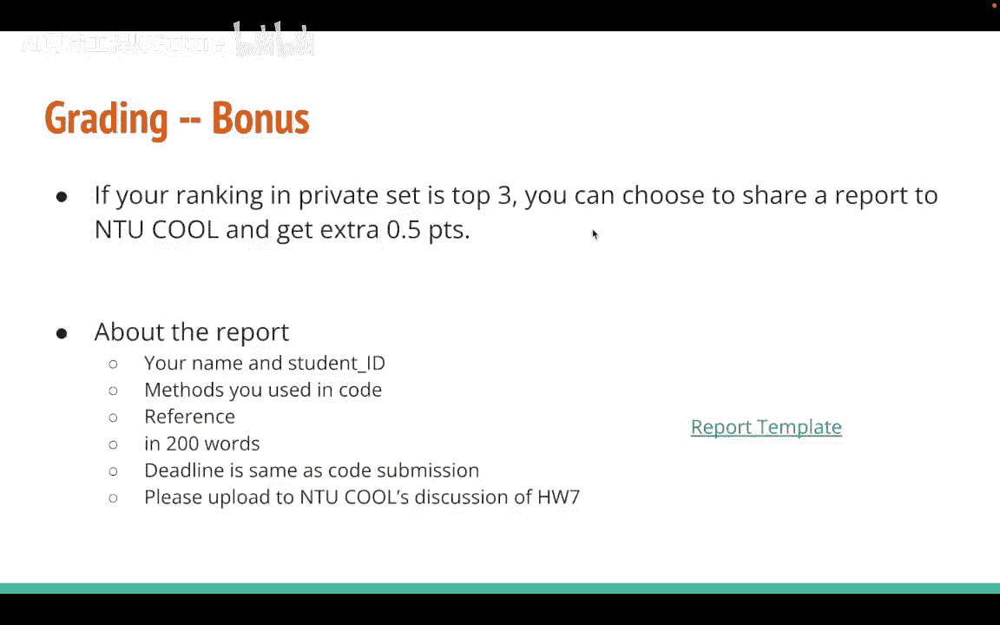

评分标准如下：

- **报告**：占4分。
- **代码提交**：占2分。
- **各基准线**：每通过一个基准线占1分（公开和私有测试集各占0.5分）。

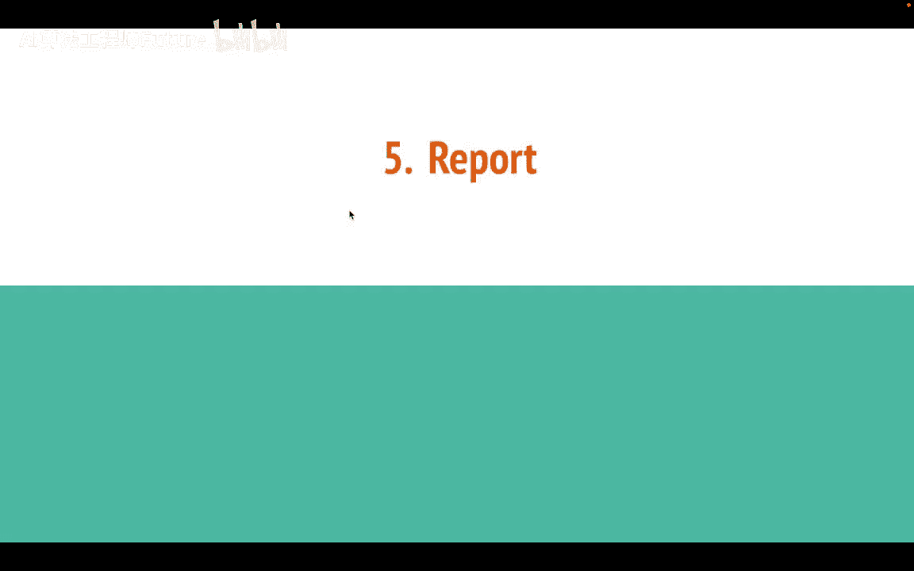

测试集共有4957个问题。评估指标是字符级别的精确匹配准确率，即预测答案的每个字符都必须与标准答案完全一致。

报告需要回答以下两个问题：

1. 当模型预测出答案的开始和结束概率后，你采用了何种决策方式来确定最终答案？不能使用与示例代码相同的方法。
2. 请尝试使用BERT以外的预训练模型（仅限于Hugging Face网站上的模型），并简要描述所选模型、其性能表现以及与BERT的差异（如架构、预训练方法等）。

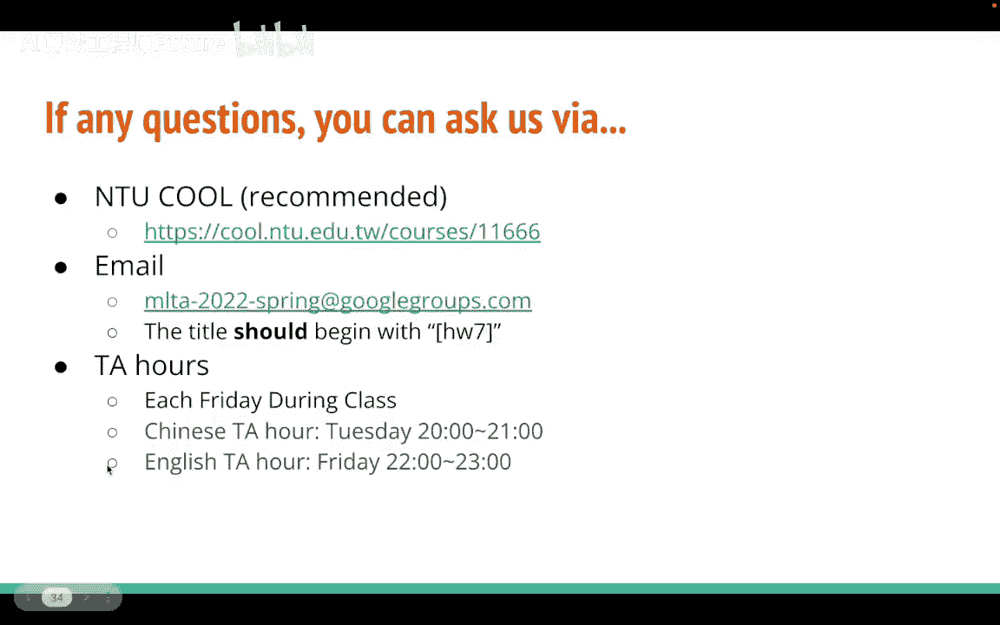

作业规定：禁止使用额外的训练数据，且只能使用Hugging Face网站提供的预训练模型。违反规定将导致本次作业计零分，且总成绩乘以0.9。

---

## 代码结构概述 🖥️

最后，我们来简要浏览一下示例代码的结构。

代码主要包含以下几个部分：

1. **数据下载与加载**：下载数据集并读取到内存中。
2. **环境配置**：安装必要的库（如`transformers`），导入模块，并设置随机种子以保证可复现性。
3. **模型与分词器加载**：从Hugging Face加载预训练的BERT模型和对应的分词器。若要更换模型，只需修改此处的模型名称。
4. **数据预处理**：对问题和文章进行分词，并构建包含`input_ids`、`token_type_ids`和`attention_mask`的模型输入。此处是实现**Strong Baseline**提示（修改预处理）的关键。
5. **数据集与数据加载器**：定义数据集类（`Dataset`）和数据加载器（`DataLoader`）。在`__getitem__`方法中完成主要的数据处理逻辑。
6. **训练循环**：定义训练周期数、优化器（可在此处加入线性学习率衰减以实现**Medium Baseline**）等，并执行模型训练。
7. **评估与预测**：在测试集上进行预测，并生成符合提交格式的`result.csv`文件。此处是实现**Boss Baseline**提示（修改后处理）的关键。

---

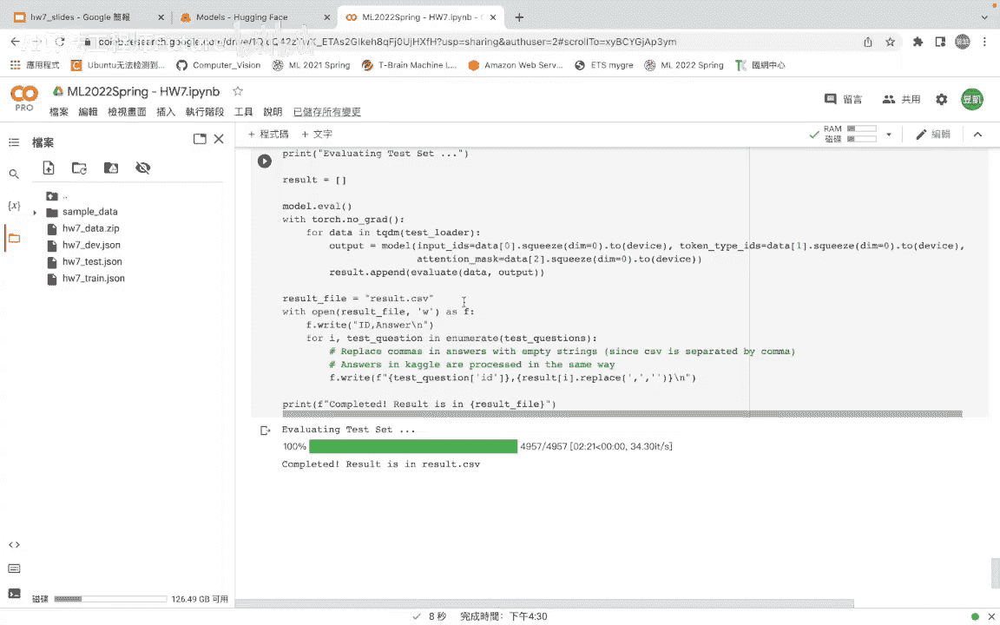

本节课中我们一起学习了如何使用BERT完成抽取式问答任务，涵盖了从任务理解、数据处理、模型实现到优化技巧的完整流程。请仔细阅读说明，并开始你的实践。如有任何问题，请到课程讨论区提问。

# 60 第8讲（上）自编码器 (Auto-encoder) 基本概念 🧠

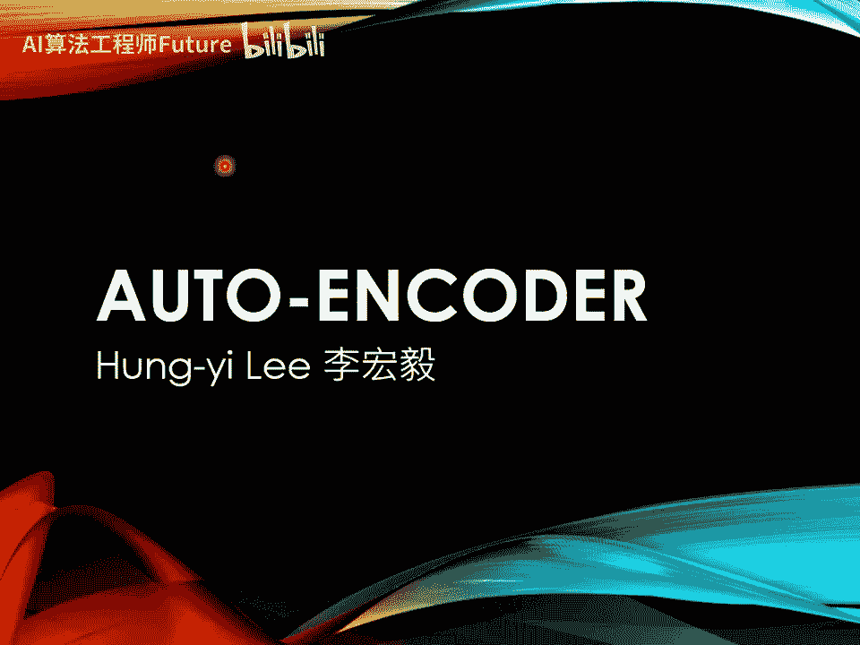

## 概述

在本节课中，我们将要学习自编码器的基本概念。自编码器是一种无监督学习方法，它通过让模型学习重建输入数据来提取有用的特征表示。我们将从自编码器的基本结构和工作原理开始，并探讨它与自监督学习的关系。

---

## 自编码器与自监督学习

上一节我们介绍了自编码器是本节课的主题。在深入细节之前，我们先将其置于一个更广泛的框架中来看。

自编码器可以被视为自监督学习的一环。自监督学习是如何运作的呢？

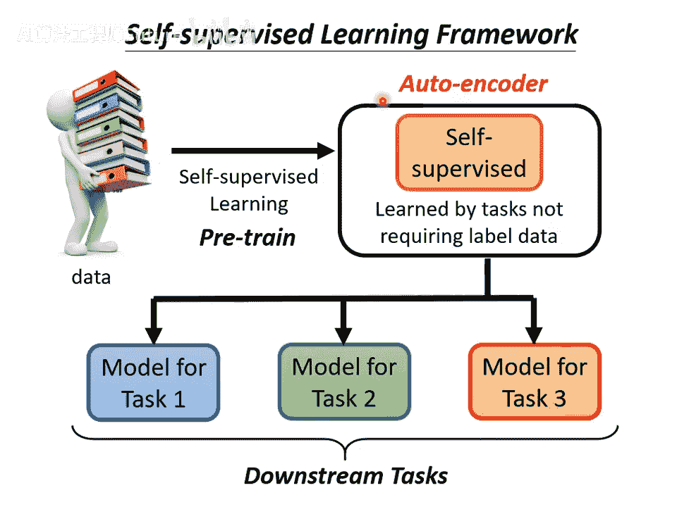

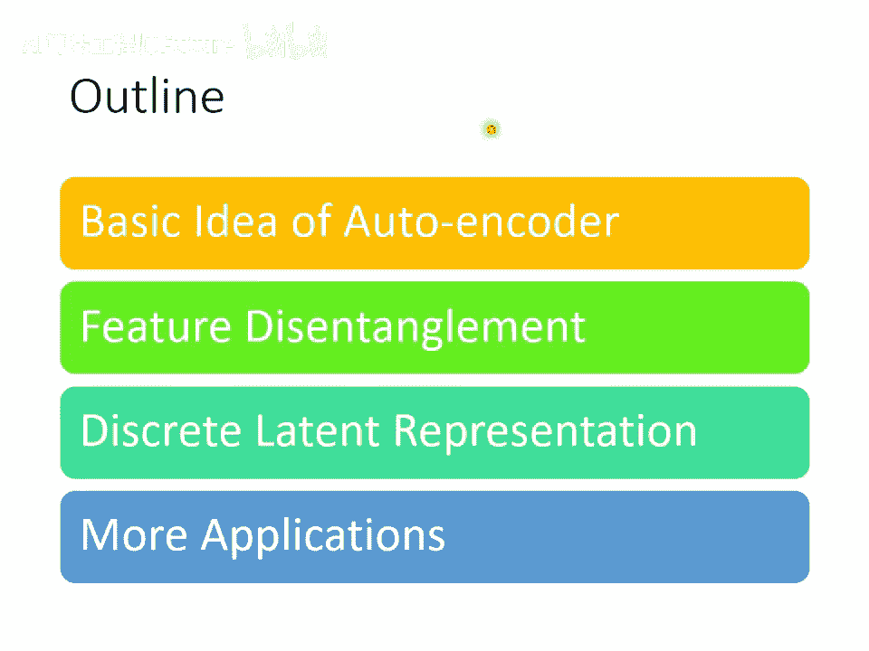

以下是自监督学习的运作框架：

1. 首先，你有大量没有标注的资料。
2. 用这些没有标注的资料，你可以去训练一个模型。你必须发明一些不需要标注资料的任务，例如做填空题或预测下一个词元。
3. 你必须要自己想一些不需要标注资料的任务，给你的模型进行学习。这个不用标注资料的学习叫做自监督学习，也有人称之为预训练。
4. 用这些不用标注资料的任务学完一个模型以后，它本身可能没有直接用处。例如，模型可能只能做填空题。
5. 但是你可以把这个模型用在下游任务里。你可以把自监督学习得到的模型做一点微调，就可以用在下游的任务里面。

在这些自监督学习的任务中，在BERT和GPT出现之前，有一个更古老的不需要标注资料的任务，就叫做自编码器。因此，你也可以把自编码器看作是自监督学习的一种预训练方法。当然，关于名词定义可能存在不同观点，但我们无需纠结于此。从“不需要用标注数据来训练”这一核心观点来看，自编码器可以算是自监督学习的一种方法。

---

## 自编码器的工作原理

上一节我们将自编码器与自监督学习联系起来，本节中我们来看看自编码器具体是如何运作的。

现在，我们以影像数据为例。假设你有非常大量的图片。在自编码器中，你有两个神经网络：一个叫做**编码器**，一个叫做**解码器**。

以下是这两个网络的作用：

- **编码器**：把一张图片读进来，将这张图片转换成一个向量。编码器可能是一个多层的卷积神经网络。
- **解码器**：以上述向量作为输入，产生一张图片。解码器的网络架构可能类似于生成对抗网络中的生成器。

训练的目标是希望编码器的输入（原始图片）与解码器的输出（重建的图片）越接近越好。如果我们把图片看作一个很长的向量，就希望输入向量与输出向量之间的距离越小越好。这个过程也称为**重建**。

这个概念似曾相识。没错，我们在讲循环生成对抗网络时已经接触过类似概念。在循环生成对抗网络中，我们希望输入的图片经过两次转换后，要跟原来的图片越接近越好。自编码器的概念与此一模一样。

这个训练过程完全不需要任何标注资料，只需要收集大量图片即可。因此，它是一种无监督学习方法。

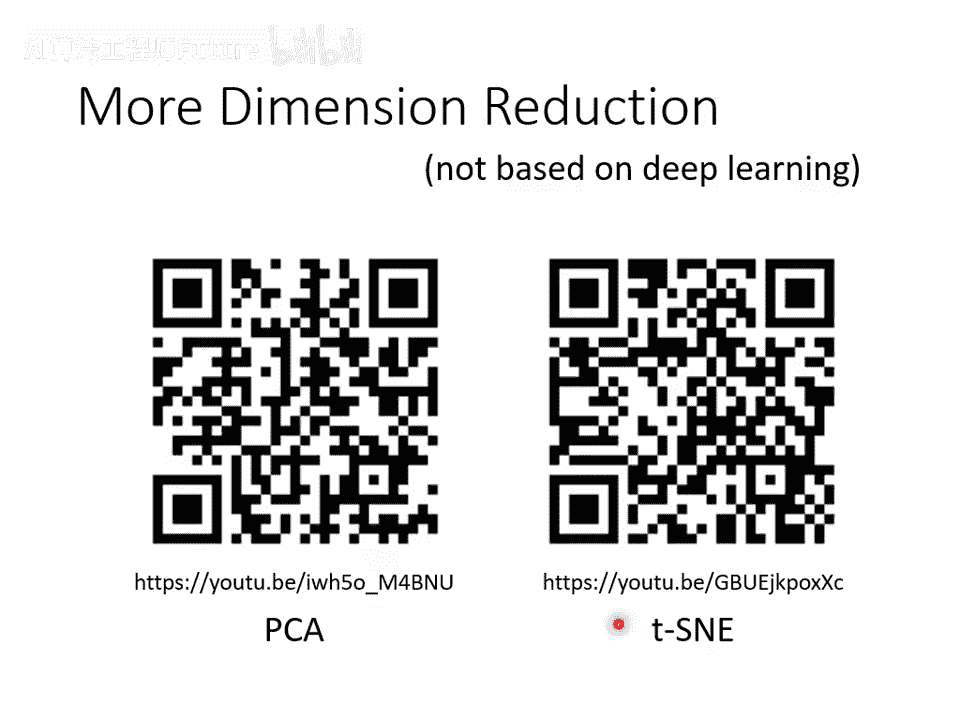

编码器的输出有时被称为**嵌入**、**表示**或**编码**。这些术语指的都是同一个东西。

---

## 自编码器的应用与维度压缩

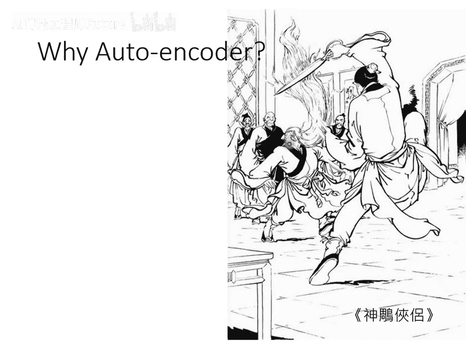

上一节我们了解了自编码器如何工作，本节中我们来看看训练好的自编码器如何应用在下游任务中。

常见的用法是：原始图片可以看作一个很长的向量，但这个向量太长，不好处理。你可以把图片输入编码器，输出一个维度较低的向量（例如只有10维或100维）。然后，你拿这个新的、低维度的向量来进行后续的任务。

因为通常编码器的输入是一个维度非常高的向量，而编码器的输出（即嵌入/表示/编码）是一个非常低维度的向量。输入和输出的维度都很宽，但中间连接的编码器输出部分特别窄，所以这个部分有时又被称为**瓶颈**。

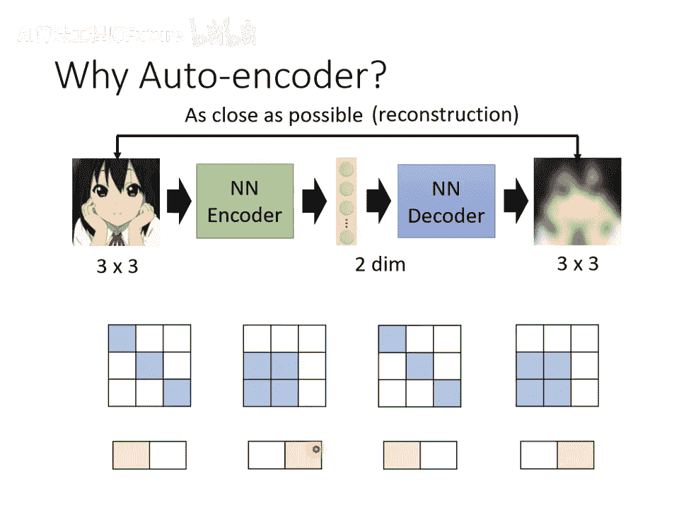

编码器做的事情是把本来很高维度的东西转成低维度的东西，这又叫做**降维**。降维技术在机器学习中应用广泛。你可以把自编码器的编码器当作一个基于深度学习的降维工具。当然，还有其他非基于深度学习的降维技术，例如主成分分析和t-SNE。

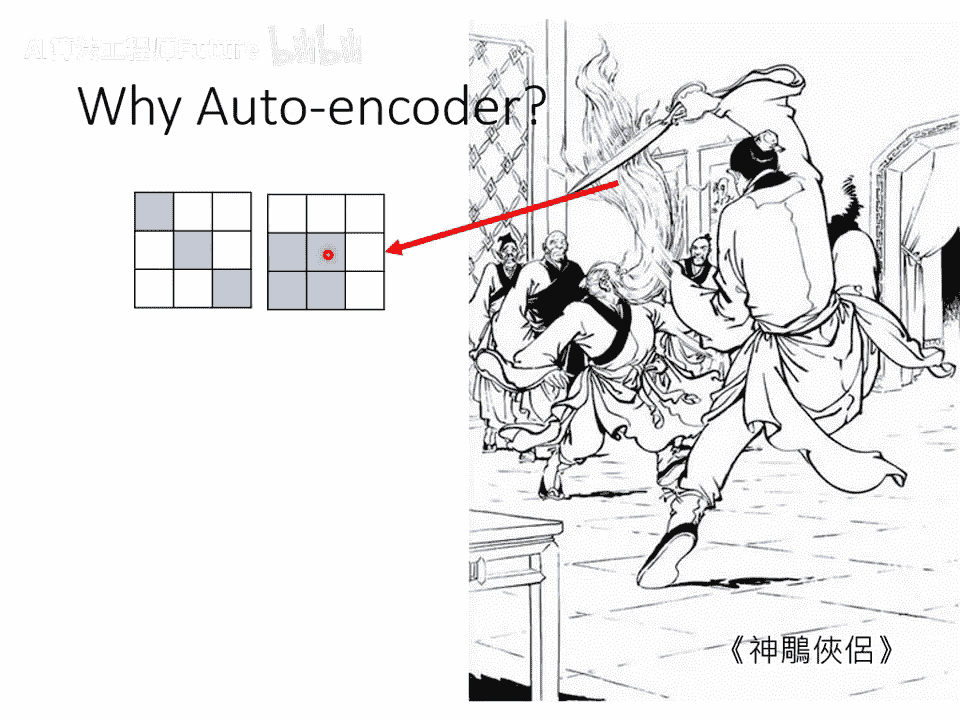

---

## 自编码器为何有效：理解“瓶颈”

上一节我们提到了“瓶颈”和降维，你可能会好奇：为什么自编码器能够成功地将高维数据压缩再还原？本节中我们通过一个比喻来理解其核心思想。

自编码器要把一张图片压缩又还原回来。为什么还原能成功？设想一下，假设图片是3x3大小，需要用9个数值来描述。如果编码器输出一个二维向量，我们怎么可能从两个数值去还原出9个数值呢？

能够做到这一点是因为，对于影像来说，并不是所有3x3的矩阵都是合理的图片。图片的变化其实是有限的。你随机采样一个噪声矩阵，它通常不会是你看到的图片。也许图片的实际变化只有少数几种类型。正是因为图片的变化是有限的，所以编码器可以只用两个维度（例如[1,0]和[0,1]）来描述一张图片。

用一个比喻来说：复杂的图片像素就像长长的胡子，表面上变化多端。但编码器做的事情是“化繁为简”，找出其背后有限的变化模式（就像控制胡子的头），并用简单的方法来表示它。如果我们可以用简单的方法表示复杂图片，在下游任务中就可能只需要较少的训练资料。

---

## 自编码器的历史与变体

自编码器并不是一个新想法，它有着悠久的历史。例如，深度学习之父Hinton在2006年发表于《科学》杂志的论文中就提到了自编码器的概念。当然，当时使用的网络架构和训练理念（如逐层预训练的受限玻尔兹曼机）与今天大不相同。

自编码器还有一个常见的变体，叫做**去噪自编码器**。它的运作方式如下：

1. 我们把原来要输入给编码器的图片加上一些杂讯。
2. 图片通过编码器和解码器，试图还原**加入杂讯之前**的原始图片。

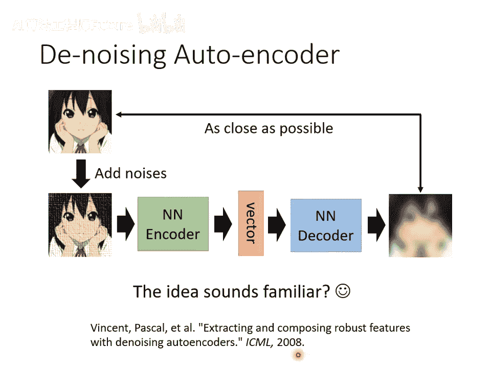

因此，编码器和解码器合起来必须学会把杂讯去掉，才能完成训练。去噪自编码器也不算新技术，相关论文在2008年就已出现。

这个概念其实并不陌生。如果你看今天的BERT模型，也可以把它看作一个去噪自编码器：输入句子会被加上[MASK]（可视为噪声），BERT模型（编码器）输出嵌入表示，然后一个线性层（可视为解码器）的任务就是还原被遮盖的原始词元。因此，BERT本质上就是一个去噪自编码器。

---

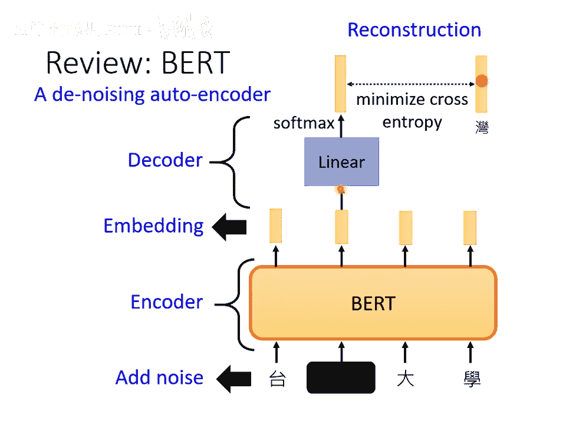

## 总结

本节课中，我们一起学习了自编码器的基本概念。我们了解到自编码器是一种无监督/自监督学习方法，它通过编码器将输入数据压缩为低维表示（瓶颈），再通过解码器进行重建。其有效性源于数据本身变化的有限性。我们还探讨了自编码器的应用（如下游任务的特征提取）、历史背景以及其重要变体——去噪自编码器，并将其与BERT等现代模型联系起来。理解自编码器是掌握许多现代特征学习和表示学习技术的基础。
