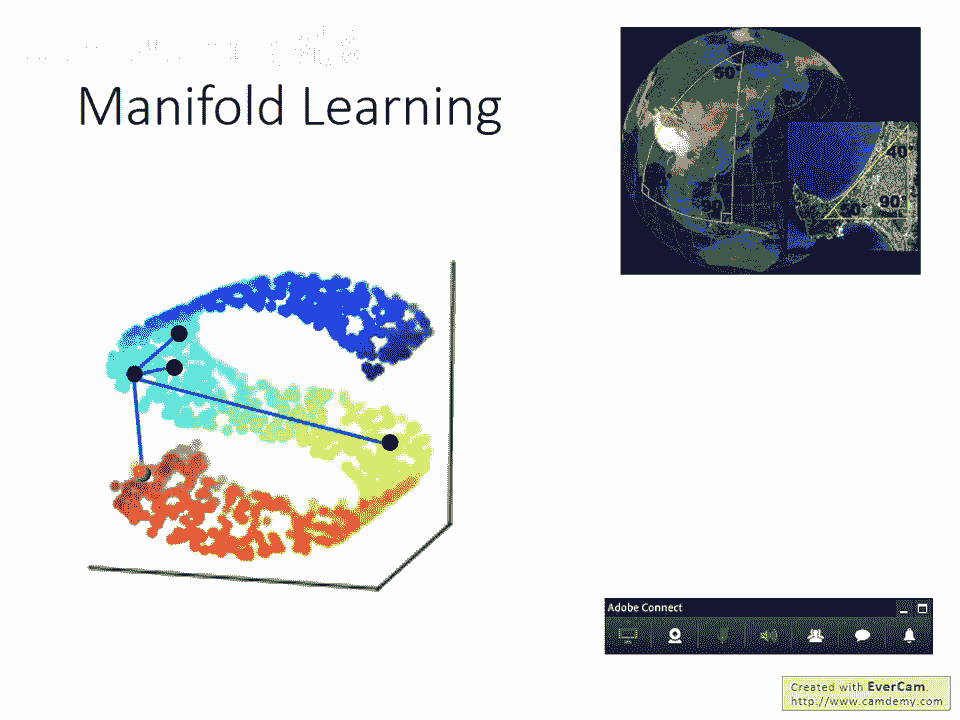
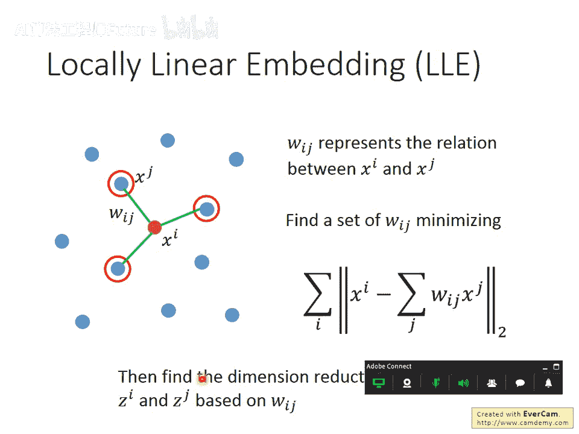
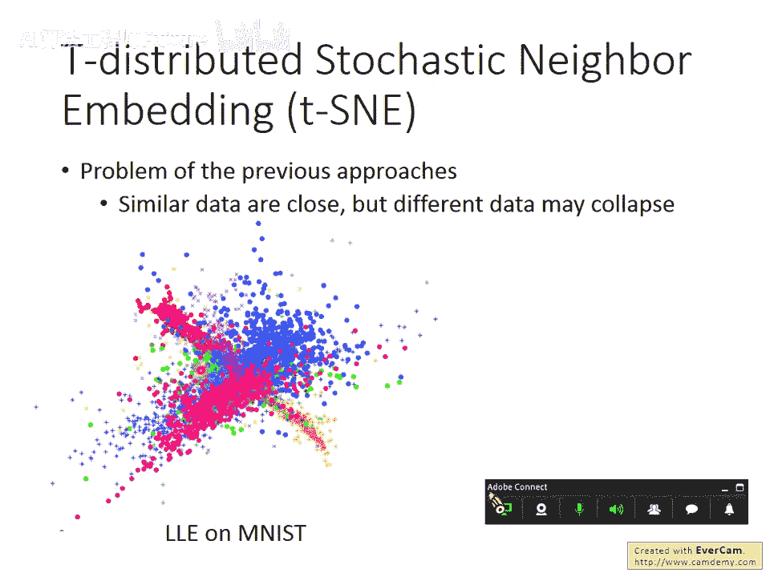
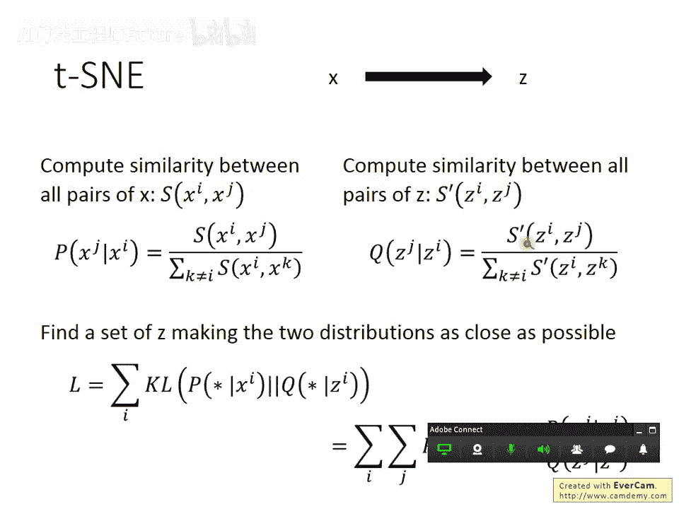
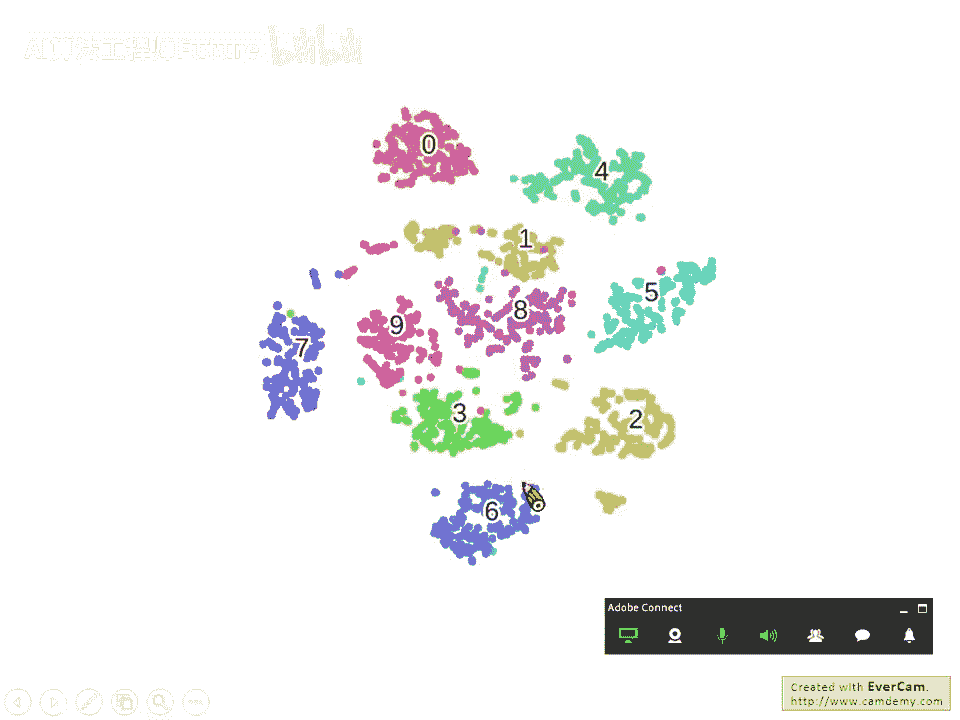

# 63：4-选修-t-SNE介绍 🧠

在本节课中，我们将要学习一种名为t-SNE的非线性降维技术。我们将从降维的基本概念出发，逐步理解为何需要非线性方法，并介绍几种相关的算法，最终详细探讨t-SNE的原理、优势及其应用场景。

## 概述：从线性到非线性降维

上一节我们介绍了线性降维方法。本节中我们来看看非线性降维。我们已知数据点（data point）的分布实际上存在于一个低维空间中，就像地球表面是一个二维平面，但被嵌入在三维空间里。在这种流形（manifold）中，欧氏距离（Euclidean distance）只在很近的距离内成立。当距离较远时，欧氏几何就不一定适用了。

例如，在一个S形的空间中，比较相邻点的距离是合理的，但比较远处两点（如S形两端）的欧氏距离，并不能反映它们在流形上的真实相似度。流形学习（Manifold Learning）的目标就是将这些弯曲的低维空间“展开”或“摊平”。摊平后，我们可以在降维后的平面上使用欧氏距离来计算点与点之间的相似度，这对后续的分类（classification）或其他监督学习任务非常有帮助。

类似的方法有很多，接下来我们将快速介绍几种，最后重点讲解t-SNE。

## 局部线性嵌入（Locally Linear Embedding, LLE）

首先介绍的方法是局部线性嵌入（LLE）。其核心思想是：在原始高维空间中，每个数据点都可以由其邻近点的线性组合来重构。降维后，我们希望在低维空间中保持这种局部线性关系。

以下是LLE的核心步骤：

1. **在原始空间寻找关系**：对于每个数据点 `xi`，找出其K个最近邻点 `xj`。然后寻找一组权重 `Wij`，使得 `xi` 能通过这些近邻的线性组合最佳重构。这通过最小化以下重构误差实现：  
  
  `minimize Σ_i || xi - Σ_j Wij * xj ||^2`  
  
  其中，`Wij` 是点 `xj` 在重构 `xi` 时的权重。
2. **在低维空间保持关系**：将原始数据点 `xi` 和 `xj` 映射为低维向量 `zi` 和 `zj`。映射时，我们固定上一步找到的权重 `Wij` 不变，并在低维空间中寻找一组 `z`，使得同样的线性组合关系依然成立。即最小化：  
  
  `minimize Σ_i || zi - Σ_j Wij * zj ||^2`

这个关系可以形象地比喻为“在天愿作比翼鸟，在地愿为连理枝”——即原始空间的关系（`Wij`）在降维后的空间中得到保持。

需要注意的是，LLE并没有一个明确的函数（如编码器网络）可以直接将新的 `x` 映射为 `z`。它更像是为给定数据集找出一组低维表示。此外，近邻数K的选择需要谨慎，K太小或太大都可能得到不理想的结果。

## 拉普拉斯特征映射（Laplacian Eigenmaps）

另一个方法是拉普拉斯特征映射。其灵感来源于半监督学习中的平滑性假设（Smoothness Assumption）：如果两个点在高密度区域相连，那么它们才是真正接近的。

我们可以用图（Graph）来描述这种关系：将数据点构造成一个图，相似度超过某个阈值的点之间连边。图的拉普拉斯矩阵（Laplacian Matrix） `L`（`L = D - W`，其中 `D` 是度矩阵，`W` 是相似度矩阵）可以近似表达这种平滑性。

在半监督学习中，我们有一个正则化项来鼓励相连的节点具有相似的标签。在无监督降维中，我们可以采用类似的思路：如果 `xi` 和 `xj` 在图上是相近的（`Wij` 大），那么希望降维后的 `zi` 和 `zj` 也接近。因此，一个直观的目标是最小化：  

`Σ_{i,j} Wij * || zi - zj ||^2`

然而，直接最小化这个式子会导致一个平凡解：所有 `z` 都取相同的值（例如全零），结果为零。为了避免这种情况，我们需要给 `z` 加上约束。通常的约束是：如果降维目标维度是M，那么希望找出的 `z` 能张成整个M维空间（例如，强制其协方差矩阵为单位矩阵）。

解这个带约束的优化问题，会发现解 `z` 实际上对应着图拉普拉斯矩阵 `L` 的较小的那些特征值所对应的特征向量。因此该方法得名拉普拉斯**特征**映射。如果先得到这种低维表示 `z` 再做聚类，这种方法有一个很酷的名字：谱聚类（Spectral Clustering）。

## t-分布随机邻域嵌入（t-SNE）🌟

前面介绍的方法（LLE、拉普拉斯特征映射）有一个共同问题：它们只假设**相近的点在降维后应该接近**，但没有强制**不相似的点在降维后要分开**。这可能导致不同类别的点虽然各自聚拢，但所有类别在低维空间中仍重叠在一起，无法区分。

t-SNE就是为了解决这个问题而设计的。它的目标是：在降维后的空间中，不仅要保持局部结构（邻近点依然接近），还要让全局结构显现（不相似的点彼此分离）。

以下是t-SNE的核心步骤：

1. **在原始高维空间构建概率分布**：对于每一对点 `(xi, xj)`，计算其相似度，并将其转化为一个条件概率分布。通常使用以 `xi` 为中心的高斯核（RBF函数）来定义相似度：  
  
  `S(xi, xj) = exp(-||xi - xj||^2 / (2σ_i^2))`  
  
  然后，计算 `xi` 选择 `xj` 作为邻居的条件概率：  
  
  `P(j|i) = S(xi, xj) / Σ_{k≠i} S(xi, xk)`  
  
  这个分布反映了在 `xi` 的视角下，其他所有点的相对相似性。
2. **在低维空间构建概率分布**：在低维空间中，我们用一组待优化的向量 `{zi}` 来表示数据。同样计算点对之间的相似度，但这里t-SNE使用**学生t-分布**（重尾分布）的核函数：  
  
  `T(zi, zj) = 1 / (1 + ||zi - zj||^2)`  
  
  然后构建低维空间的条件概率分布：  
  
  `Q(j|i) = T(zi, zj) / Σ_{k≠i} T(zi, zk)`
3. **最小化分布差异**：t-SNE的目标是找到一组低维表示 `{zi}`，使得高维分布 `P` 和低维分布 `Q` 尽可能相似。衡量两个分布差异的指标是KL散度（Kullback-Leibler Divergence）。因此，损失函数为：  
  
  `Loss = Σ_i KL(P(·|i) || Q(·|i)) = Σ_i Σ_j P(j|i) log( P(j|i) / Q(j|i) )`  
  
  通过梯度下降法最小化这个损失函数，即可得到最终的降维结果 `{zi}`。

**t-SNE的神妙之处**在于低维空间使用了**t-分布**。与高斯核相比，t-分布的尾巴更“重”。这意味着：

- 对于**原本相似**（距离近）的点，t-分布依然给出较高的相似度概率，保证它们降维后依然靠近。
- 对于**原本不相似**（距离中等或较远）的点，t-分布会给出**更低**的相似度概率，从而在低维空间中将它们**推得更远**。

这种效应使得t-SNE的结果图中，相似的点会紧密聚集，而不同类别的点之间会形成明显的“空白”间隙，非常有利于可视化。

## 实践与应用要点

- **计算复杂度**：t-SNE需要计算所有数据点对之间的相似度，计算量较大。对于大数据集，常见的做法是先使用PCA等快速线性方法进行预降维（例如降到50维），然后再使用t-SNE降至2维或3维用于可视化。
- **无法处理新样本**：像t-SNE这类方法属于“批量”算法。给定一组数据，它输出这组数据的低维表示。但如果来了一个新的数据点，无法直接将其映射到已有的低维空间中，需要重新运行整个算法（或使用近似方法）。因此，t-SNE主要用于**探索性数据分析和可视化**，而非训练-测试模式的机器学习流水线。
- **可视化效果**：t-SNE是目前最流行的数据可视化降维工具之一。例如，在MNIST手写数字数据集上，t-SNE能将不同数字清晰地分成不同的簇；在物体旋转图像数据集（如COIL-20）上，它能将同一物体不同角度的图像排列成连续的环状或曲线，直观展示其流形结构。

## 总结

本节课中我们一起学习了非线性降维技术。我们从流形学习的概念出发，理解了为何需要非线性方法来展开数据内在的低维结构。接着，我们介绍了局部线性嵌入（LLE）和拉普拉斯特征映射（Laplacian Eigenmaps）两种方法，它们侧重于保持数据点之间的局部邻近关系。

最后，我们深入探讨了t-分布随机邻域嵌入（t-SNE）。t-SNE通过在高维和低维空间分别构建概率分布（并使用不同的核函数），并最小化其KL散度，不仅保持了局部结构，还通过t-分布的重尾特性有效分离了不同类别的数据，从而产生了极其出色的可视化效果。尽管t-SNE计算成本较高且难以泛化到新样本，但它无疑是探索高维数据结构的强大工具。
