# 65：机器学习的可解释性（第一部分） 🧠

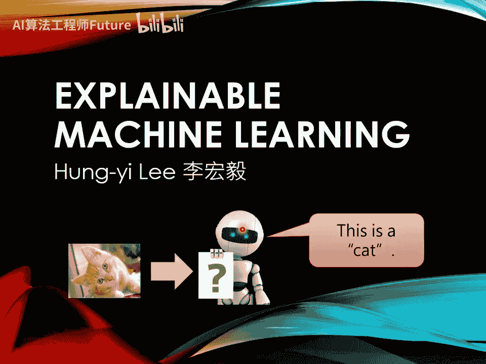

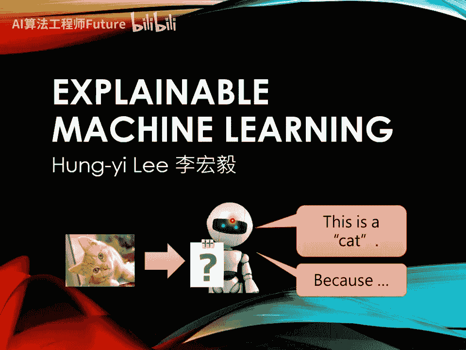

在本节课中，我们将要学习**可解释性机器学习**。我们将探讨为什么需要理解模型的决策过程，并介绍几种分析模型如何做出判断的技术。

---

到目前为止，我们已经训练了许多模型。例如，我们训练过图像分类模型，给它一张图片，它会给出答案。但我们并不满足于此。接下来，我们希望机器能告诉我们它得到答案的理由。这就是**可解释性机器学习**。

在开始介绍具体技术之前，我们需要先讨论一下，为什么可解释性机器学习是一个重要的议题。本质上的原因是，即使机器能得到正确答案，也不代表它一定非常“聪明”。

举一个例子。过去有一匹被认为很聪明的马，名叫“神马汉斯”。这匹马会做数学题。例如，你问它根号九是多少，它会开始计算并给出答案。它通过用马蹄跺地板来告诉你答案：答案是三，它就敲三下然后停下。人们因此欢呼。

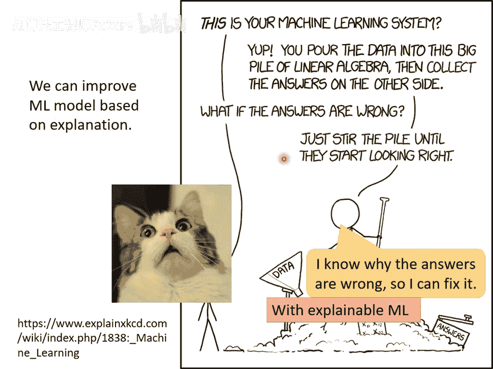

后来有人怀疑，为什么一匹马能解数学题？结果发现，只要没有人在旁边围观，汉斯就答不出问题。它会不停地跺马蹄，不知道何时停下。实际上，它只是侦测到了旁观者微妙的情感变化，知道何时停下能获得胡萝卜奖励。它并非真的学会了数学。

今天我们看到的各种人工智能应用，有没有可能和“神马汉斯”是同样的状况呢？在许多真实应用中，可解释性的模型往往是必须的。

举例来说，银行可能用机器学习模型来判断是否贷款给某个客户。但根据法律规定，银行使用机器学习模型做自动判断时，必须给出理由。因此，我们不仅需要训练模型，还需要模型具有解释力。

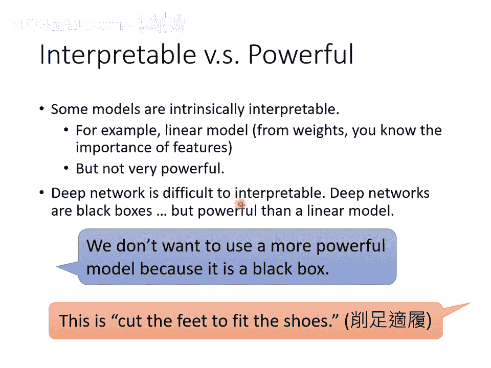

机器学习未来也可能被用于医疗诊断。但医疗诊断人命关天，如果模型只是一个不会给出理由的黑箱，我们又如何相信它的判断是正确的呢？

也有人想把机器学习模型用在法律上，例如帮助法官判案，决定犯人能否被假释。但我们怎么知道机器学习模型是公正的？怎么知道它在做判断时没有种族歧视等问题？因此，我们希望模型不仅能给出答案，还能给出得到答案的理由。

更进一步，未来自动驾驶汽车可能会满街跑。当一辆自动驾驶汽车突然急刹车，甚至导致乘客受伤时，这辆车到底有没有问题？这可能取决于它急刹的理由。如果它是因为看到有老太太过马路而急刹，那也许是正确的。但如果它只是无缘无故突然发狂急刹，那这个模型就有问题了。因此，对于自动驾驶汽车的种种行为和决策，我们希望了解决策背后的理由。

更进一步，如果机器学习模型具有解释力，未来我们或许可以凭借解释的结果去修正模型。今天在使用深度学习技术时，情况往往是这样的：某人说“这就是你的机器学习系统”，然后描述为“把数据丢进去，里面有很多矩阵相乘，接着就会跑出结果”。如果结果不如预期怎么办？现在大家都知道，就是“调一下参数”，改个学习率，调一下网络架构。你根本不知道自己在做什么，只是把一堆数学、一堆线性代数重新打乱，看看结果会不会变好。没做过深度学习的人会大吃一惊，觉得“哇，这样怎么可以？”但实际上，今天要改进深度学习模型，往往就是需要调整一些超参数。我们期待，也许未来当我们知道深度学习模型犯错时，能了解它错在什么地方、为什么犯错，从而有更好、更有效率的方法来改进模型。当然，这是未来的目标。今天，距离用可解释性机器学习实现上述改进模型的想法，还有很长一段距离。

有人可能会想，我们今天之所以如此关注可解释性机器学习的议题，也许是因为深度网络本身就是一个黑箱。那我们能不能用其他更容易解释的机器学习模型呢？如果不用深度学习模型，改用其他比较容易解释的模型，会不会就不需要研究可解释性机器学习了？

举例来说，假设我们都采用线性模型。线性模型的解释能力比较强，我们可以轻易地根据线性模型中每个特征的权重，知道模型在做什么。训练完一个线性模型后，你可以轻易知道它是怎么得到结果的。但线性模型的问题在于它不够强大。我们在第一堂课就告诉过你，线性模型有很大的限制，所以我们才很快进入了深度模型。然而，深度模型的坏处就是它不容易被解释。神经网络大家都知道是一个黑盒子，里面发生了什么我们很难知道。虽然它比线性模型更强大，但它的解释能力远比线性模型差。

因此，很多人会得到一个结论：我们不应该用这种深度模型，不该用这些比较强大的模型，因为它们是黑盒子。但在我看来，这样的想法其实是“削足适履”。我们因为一个模型非常强大但不容易被解释，就扬弃它吗？我们不是应该想办法让它具有可解释的能力吗？

我听过杨立昆讲过一个故事。这个故事是个老梗，谁都听过。有一个醉汉在路灯下找钥匙。大家问他：“你的钥匙掉在路灯下吗？”他说：“不是，因为这边有光。”所以，我们坚持一定要用简单但比较容易解释的模型，其实就好像我们坚持一定要在路灯下面找钥匙一样。我们坚持因为一个模型是比较“可解释的”，虽然它比较不好，但我们还是坚持要使用它，就好像一定要在路灯下面找钥匙一样。真实的、强大的模型也许根本在路灯的照明范围之外。而我们现在要做的事情就是改变路灯的范围，改变照明的方向，看能不能让这些比较强大的模型可以被置于“可解释”的路灯之下。

“可解释的”和“可诠释的”这两个词汇在文献上常常被互相使用，但其实它们有一点点差别。通常，“可解释的”指的是有一个东西本来是个黑箱，我们想办法赋予它解释的能力。而“可诠释的”通常指的是一个东西本来就不是黑箱，我们本来就可以知道它的内容。不过这两者在文献上也常常被混用，所以我们这边不特别强调它们的差异。

讲到既“可诠释”又强大的模型，也许有人会说，那决策树会不会是一个好的选择呢？决策树相较于线性模型是更强大的模型，而它的另一个好处是，相较于深度学习，它非常“可诠释”。你看决策树的结构，就可以知道模型是凭借什么样的规则来做出最终判断的。

决策树不是我们这门课会讲的东西。但就算你没学过决策树，也不难想象它在做什么。它有很多节点，每个节点都会问一个问题，让你决定向左还是向右。最终当你走到叶节点时，就可以做出最终决定。因为在每个节点都有问题，你看那些问题及答案，就可以知道整个模型凭借什么样的特征，是如何做出最终决断的。

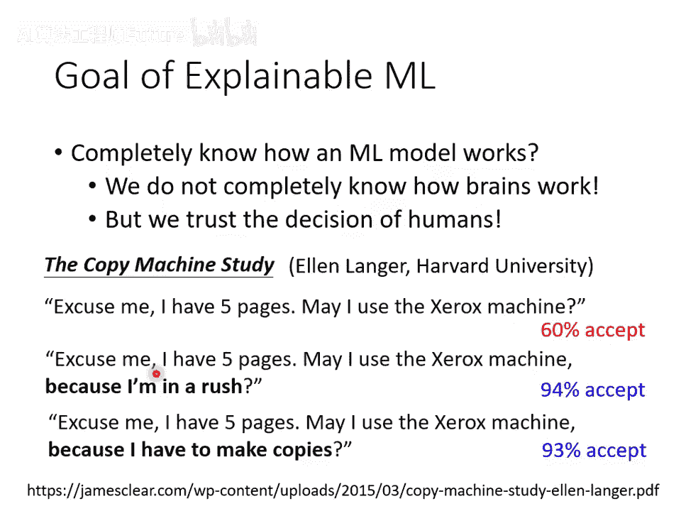

所以从这个角度看来，决策树既强大又可诠释。那么这堂课我们可以就上到这边，说“决策树就是你所需的一切”，然后就结束了，这样吗？

但是，决策树真的就是我们所需要的吗？你再仔细想一下，决策树也有可能是很复杂的。举例来说，我在网络上看到有人问了一个问题。他说有这么一个复杂的决策树，他完全看不懂这个决策树在干嘛。有没有人有什么样的可解释性机器学习的方法，可以把这个决策树变得更简单一点？我看34年过去了，都没有人回答这个问题。如果有人看到的话，也许可以帮忙回答一下。

另一方面，你再仔细想想看，你是怎么实际使用决策树技术的呢？我知道很多同学会说，打Kaggle比赛的时候，深度学习不是最好用的，决策树才是最好用的，那才是Kaggle比赛的常胜军。但你想想看，当你在使用决策树技术的时候，你是只用一颗决策树吗？其实不是。你真正用的技术叫做“随机森林”，对不对？你真正用的技术，其实是好多棵决策树共同决定的结果。一颗决策树，你可以凭借每一个节点的问题跟答案，知道它是怎么做出最终判断的。但当你有一片森林，当你有500棵决策树的时候，你就很难知道这500棵决策树合起来是怎么做出判断的。所以决策树也不是最终的答案，并不是有了决策树，我们就解决了可解释性机器学习的问题。

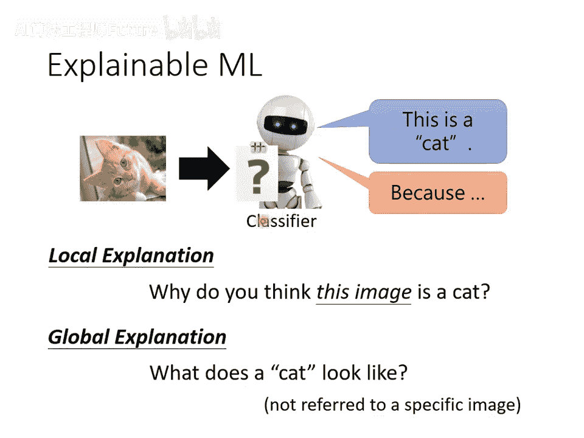

在继续深入讲可解释性机器学习的技术之前，这边还有一个问题：可解释性机器学习的目标是什么？在我们之前的每一个作业里面，我们都有一个“Leaderboard”，也就是我们有一个明确的目标，要么是降低错误率，要么是提升准确率。我们总是有一个明确的目标。但是，可解释性的目标到底是什么呢？什么才是最好的解释结果呢？

可解释性机器学习的目标其实非常不明确。正是因为目标不明确，你才会发现可解释性机器学习的作业就没有Leaderboard了，因为出不了排行榜。我们只能够出选择题，让大家增加一些知识，我们只能够做这样子而已。

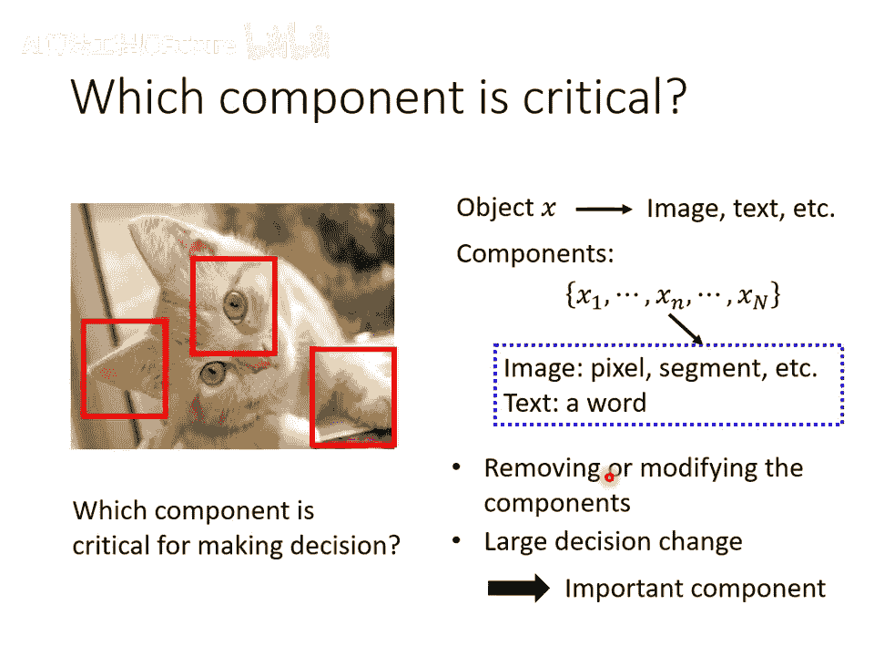

那到底可解释性机器学习的终极目标是什么呢？什么才是最好的解释？以下是我个人的看法，并不代表它是正确的。你可能不认同，我也不会跟你争辩。这只是我个人的看法而已。

很多人对可解释性机器学习会有个误解，他觉得一个好的解释，就是要告诉我们整个模型在做什么事，我们要了解模型的一切，我们要知道它到底是怎么做出一个决断的。但是你想想看，这件事情真的是有必要的吗？我们今天说机器学习模型、深度网络是一个黑盒子，所以我们不能相信它。但你想想看，世界上有很多黑盒子正在你的身边。人脑不也是黑盒子吗？我们其实也并不完全知道人脑的运作原理，但是我们可以相信另外一个人做出的决断。人脑其实也是一个黑盒子，你可以相信人脑做出的决断，为什么深度网络是一个黑盒子，你就没有办法相信深度网络做出来的决断呢？为什么你对深度网络会这么恐惧呢？

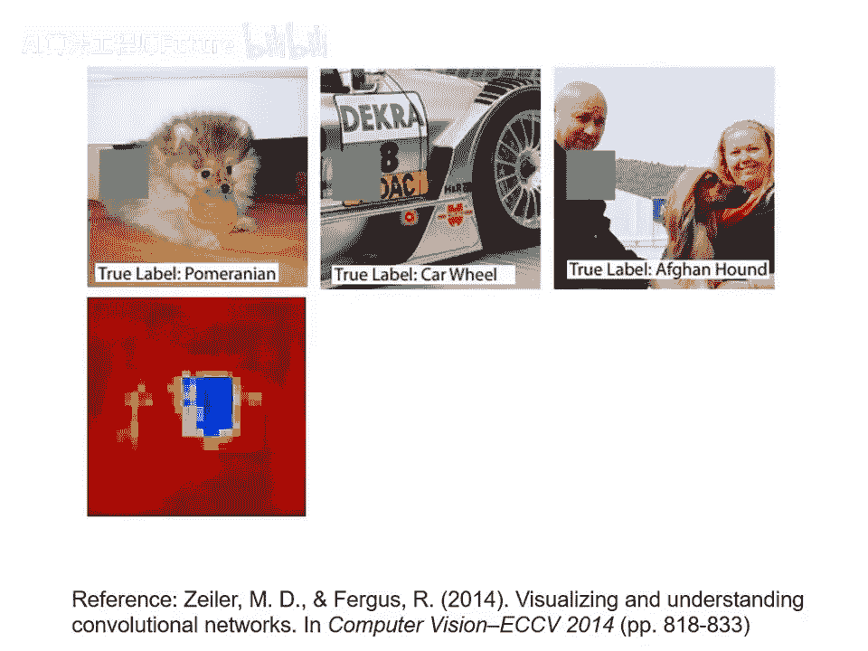

我觉得，对人而言，也许一个东西能不能让我们放心、能不能让我们接受，理由是非常重要的。以下是一个跟机器学习完全无关的心理学实验。这个实验是1970年代做的，由哈佛大学教授艾伦·兰格所做，非常有名。

这个实验是这样：在哈佛大学图书馆，打印机前大排长龙，很多人排队要印东西。这个时候，如果有一个人跟他前面的人说：“拜托请让我先印，我就印五页而已。”一般人会不会接受、会不会让他先印呢？有60%的人会让这个人先印。感觉哈佛大学学生人都还蛮好的，这个接受程度比我预期的要高。

但这个时候，你只要把刚才问话的方法稍微改一下。你本来只说“能不能让我先印”，你现在改成说“能不能让我先印，因为我赶时间”。他是不是真的赶时间，没人知道。但是当你说你有一个理由，所以你要先印的时候，这个时候接受的程度变成94%。

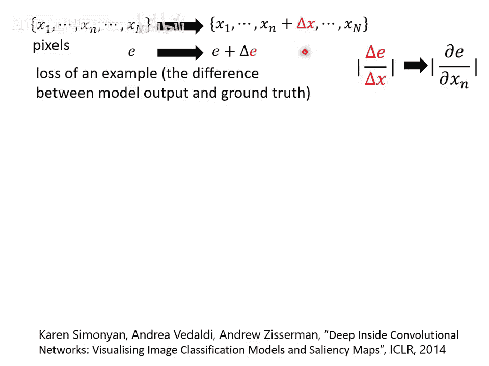

而神奇的事情是，就算你的理由稍微改一下。举例来说，有人说“请让我先印，因为我需要先印”。光是这个样子，接受的程度也变成93%。最神奇的事情是，人就是需要一个理由。你为什么要先印？你只要讲出一个理由，就算你的理由是因为“我需要先印”，大家也会接受。

所以，会不会可解释性机器学习也是同样的道理？所以我们需要可解释性机器学习呢？

所以我觉得，什么叫做好的解释？好的解释就是**人能接受的解释就是好的解释**。人就是需要一个理由让我们觉得高兴。而到底是让谁高兴呢？这个高兴的人，可能是你的客户。因为很多人就是听到深度网络是一个黑盒子，他就不爽。你告诉他说“这个是可以被解释的”，给他一个理由，他就高兴了。他可能是你的老板。老板看了很多“农场文”，他也觉得说“黑盒子就是不好的”。然后你说“这个是可以解释的”，他就高兴。或者，你今天要说服的对象是你自己。你自己觉得有一个黑盒子，深度网络是一个黑盒子，你心里过不去。今天它可以给你一个做出决断的理由，你就高兴。

所以我觉得，什么叫做好的解释？就是**让人高兴的解释就是好的解释**。其实你等一下再看各种研究的发展，才会发现我们在设计这些技术的时候，确实跟我现在讲的“什么叫好的解释？就是让人高兴的解释”这个想法，技术的进展是蛮接近的。

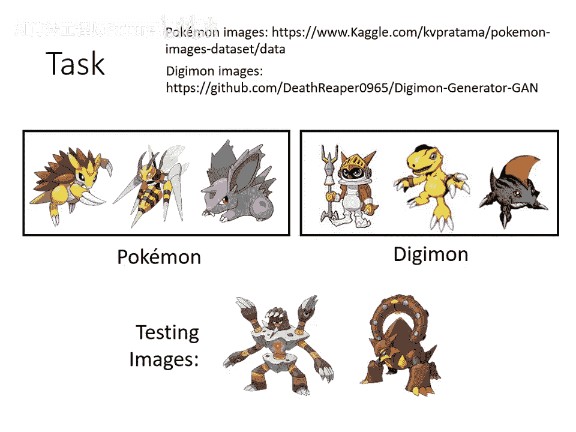

所以，可解释性机器学习的目标就像我刚才讲的，就是要给我们一个理由。那可解释性机器学习又分成两大类：第一大类叫做**局部解释**，第二大类叫做**全局解释**。

- **局部解释**是说，假设我们有一个图像分类器，我们给它一张图片，它判断说这是一只猫。那我们要问的问题是：“为什么你觉得这张图片是一只猫？”根据某一张特定的图片来回答问题，这叫做局部解释。
- **全局解释**意思是说，现在还没有给我们的分类器任何图片，我们要问的是：“对一个分类器而言，什么样的图片叫做猫？”我们并不是针对任何一张特定的图片来进行分析，我们是想要知道，当我们有一个模型，它里面有一堆参数的时候，对这堆参数而言，什么样的东西叫做一只猫。

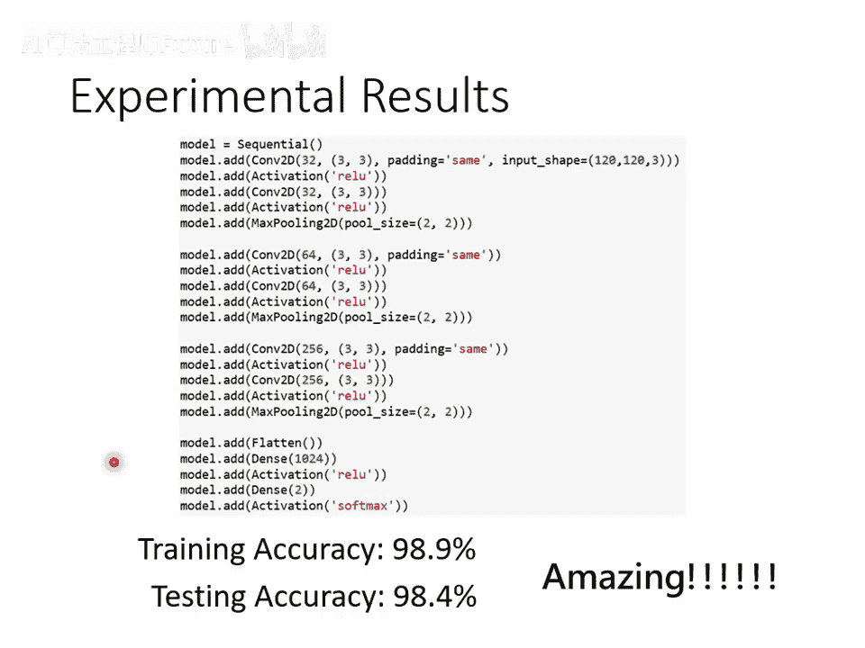

所以，可解释性机器学习有两大类。

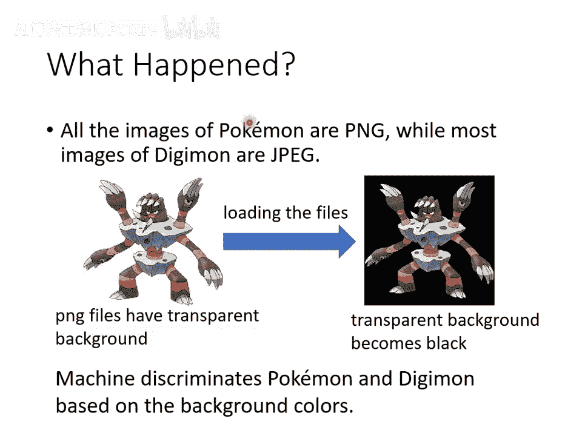

---

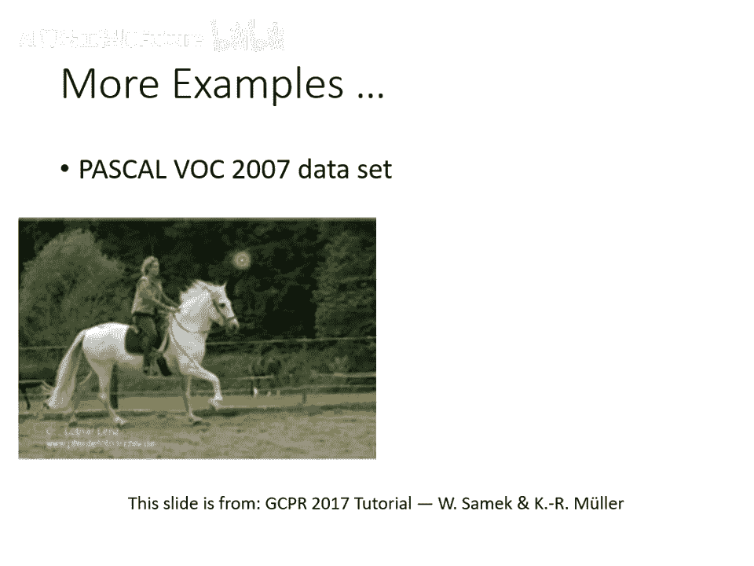

## 局部解释：为什么模型认为这是一只猫？ 🐱

我们先来看第一大类：为什么你觉得一张图片是一只猫？我们可以把这个问题问得更具体一点：给机器一张图片，它知道这是一只猫的时候，到底是这个图片里面的什么东西，让模型觉得它是一只猫？是眼睛吗？是耳朵吗？还是猫的脚让机器觉得它看到了一只猫？

或者讲得更一般化一点：假设现在我们模型的输入叫做 **X**，这个 **X** 可能是一张影像，可能是一段文字。而 **X** 可以拆成多个组成部分 **x1, x2, ..., xn**。如果对于影像而言，可能每一个组成部分就是一个像素；对于文字而言，可能每一个组成部分就是一个词汇或一个词元。我们现在要问的问题就是：这些组成部分里面，哪一个对于机器现在做出最终的决断是最重要的？

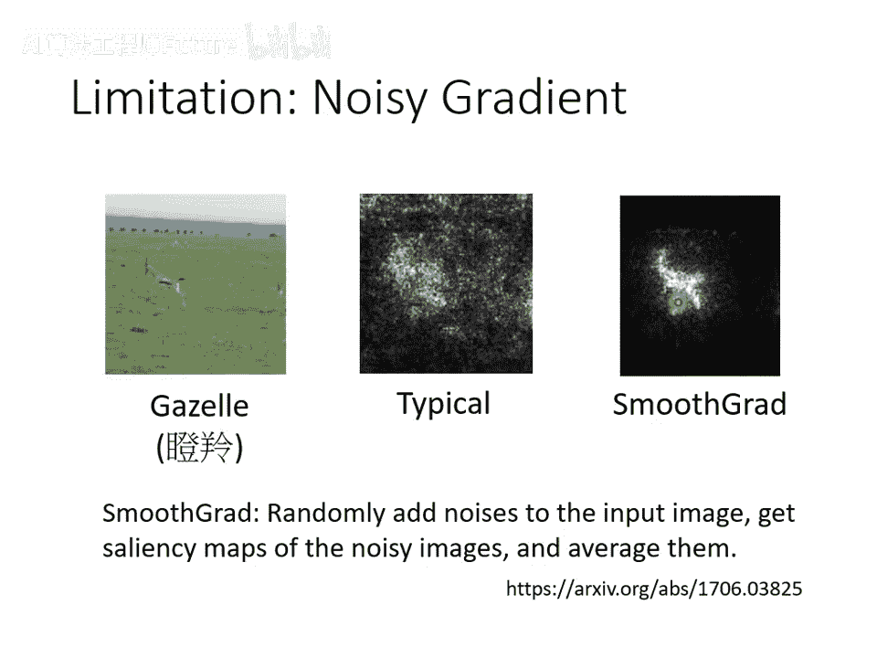

怎么知道一个组成部分的重要性呢？基本原则是这个样子：我们把组成部分都拿出来，然后把每一个组成部分做改造或者删除。如果我们改造或删除某一个组成部分以后，今天网络的输出有了巨大的变化，那我们就知道说这个组成部分没它不行，它很重要。如果某个组成部分被删掉以后，现在网络的输出有了巨大的变化，就代表这个组成部分没它不行，那这个组成部分就是一个重要的组成部分。

讲得更具体一点，你想要知道今天一个影像里面每一个区域的重要性的时候，有一个非常简单的方法。

给一张图片，然后丢到网络里面，它知道这是一只博美狗。接下来，在这张图片里面不同的位置放上灰色的方块。当这个方块放在不同的地方的时候，今天你的网络会输出不同的结果。下面这个图，这些颜色代表今天网络输出“博美狗”的几率。蓝色代表博美狗的几率是低的，红色代表博美狗的几率是高的。而这里的每一个位置，代表了这个灰色方块的位置。

也就是说，当我们把灰色的方块移到博美狗脸上的时候，今天你的图像分类器就不觉得它看到一只博美狗。如果你把灰色的方块放在博美狗的四周，这个时候机器就觉得它看到的仍然是博美狗。所以知道说它不是看到这个球觉得看到博美狗，也不是看到地板，也不是看到墙壁觉得看到博美狗，而是真的看到狗的脸，所以它觉得看到了一只狗。

这边也有一样的例子：把灰色的方块在图片上移动。你会发现，灰色的方块移到轮胎上的时候，机器就不觉得它有看到轮胎了。所以机器知道轮胎长什么样子。它今天看到这个图片，知道答案是轮胎的时候，并不是瞎蒙蒙到的，而是它知道轮胎出现在这个位置。

或者，这边有一张图片，图片里面有两个人，还有一只阿富汗猎犬。但是机器到底是真的看到了阿富汗猎犬，还是把人误认为狗呢？这个时候你就可以把这个灰色的方框在图片上移动。然后你发现，灰色的方框放在这个人的脸上，或放在那个人的脸上的时候，机器仍然觉得它有看到阿富汗猎犬。但是当你把灰色的方框放到狗的位置时，机器就觉得它没有看到阿富汗猎犬。所以它是真的有看到阿富汗猎犬，知道这一只就是阿富汗猎犬，并不是把人误认为阿富汗猎犬。

所以，这是最简单的知道组成部分重要性的方法。

接下来还有一个更进阶的方法是**计算梯度**。

这个方法是这样子的：假设我们有一张图片，我们把它写作 **x1, x2, ..., xn**，这里的每一个 **x** 代表了一个像素。接下来，我们去计算这张图片的损失，我们这边用 **L** 来表示。这个 **L** 是什么呢？这个 **L** 是把这张图片丢到你的模型里面，模型的输出结果跟正确答案的交叉熵。**L** 越大就代表现在辨识的结果越差。

接下来，我们想知道某一个像素对于图像辨识这个问题的重要性。那你就把某一个像素的值做一个小小的变化，加上一个 **Δx**，然后你看一下你的损失会有什么样的变化 **ΔL**。如果今天把某一个像素做小小的变化以后，损失就有巨大的变化，代表说这个像素对图像辨识是重要的。反之，如果加了 **Δx**，这个 **ΔL** 趋近于零，损失完全没有反应，就代表说这个位置的像素对于图像辨识而言可能是不重要的。

我们可以用 **ΔL** 跟 **Δx** 的比值，来代表这一个像素 **xn** 的重要性。而事实上，**ΔL / Δx** 这一项，就是把 **xn** 对你的损失 **L** 做偏微分。如果你不知道偏微分是什么，也没有关系，反正就是 **Δx** 跟 **ΔL** 的比值，就代表了这个 **xn** 的重要性。这个比值越大，就代表 **xn** 越重要。

那你把图片里面每一个像素的这个比值都算出来，你就得到一个图，叫做**显著图**。在我们的作业里面，你会有很多机会画各式各样的显著图。

下面这个图，上面是原始图片，下面黑色背景上有亮白色点的是显著图。在这个显著图上，越偏白色就代表这个比值越大，也就是这个位置的像素是越重要的。

举例来说，给机器看这个水牛的图片，它并不是看到草地觉得看到牛，也不是看到竹子觉得看到牛，而是真的知道牛在这个位置。它觉得判断这张图片是什么类别，对它而言最重要的是出现在这个位置的像素，它真的是看到牛，所以才会输出“牛”这个答案。

继续看到这个图片，它说它看到一只猴子。那猴子在哪里呢？猴子在树梢上面。它并不是把叶子判断成猴子，它知道这个位置出现的东西，就是它判断正确答案的准则。

我给它这个图片，它知道说狗是出现在这个位置。所以这个技术叫做显著图。

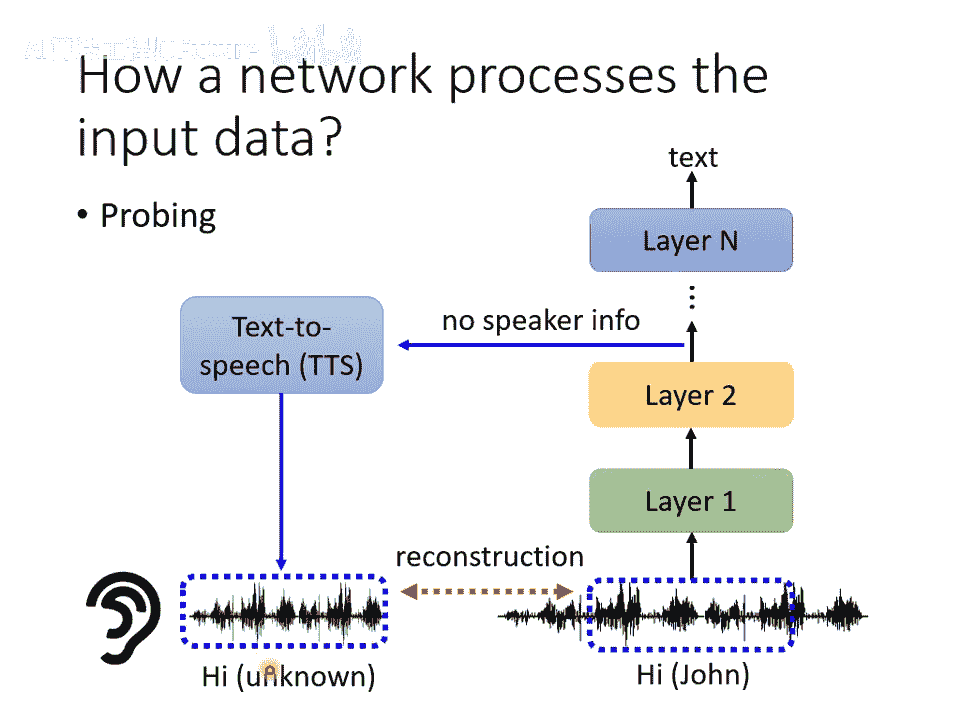

显著图这个技术，我们等一下来举一个实际的应用。这个应用跟宝可梦还有数码宝贝有关。不知道大家知不知道数码宝贝是什么？左边这个是宝可梦，右边这个叫做数码宝贝。不知道的同学，反正就是另外一种动物就对了。

在网络上看到有人说，他训练了一个数码宝贝跟宝可梦的分类器，然后正确率非常高。所以我决定自己也来做这个实验，看看为什么可以得到这么高的正确率。

你可以在网络上找到宝可梦的图库，也可以找到数码宝贝的图库。所以你有一堆宝可梦的图，有一堆数码宝贝的图。这对大家来说一定都不成问题，这就是一个二元分类的问题。胡乱凑一个分类器就结束了，把作业三的代码改一改，把本来分成11类改成分成两类就结束了。

训练完以后，你当然要用机器没有看过的图去测试它。所以你不能够把所有的宝可梦跟所有的数码宝贝都拿去做训练。你要特别留一些宝可梦跟数码宝贝是训练的时候没有看过的，看看机器看到新的宝可梦跟数码宝贝，它能不能够得到正确的结果。

这边我们来看一下人类能不能够正确的判断宝可梦跟数码宝贝。我来问一下大家，你觉得这一只是宝可梦还是数码宝贝呢？所以可见，宝可梦跟数码宝贝是很难分辨的。今天就算是人类，你也很难判断一只动物到底是宝可梦还是数码宝贝。机器的表现如何呢？

这边就是随便搭了一个模型，也没有几层，训练下去，训练准确率98.9%，非常高。但是不要高兴得太早，这也许是过拟合而已，也许机器只是把训练资料
