# 73：领域自适应 (Domain Adaptation) 概述 🎯

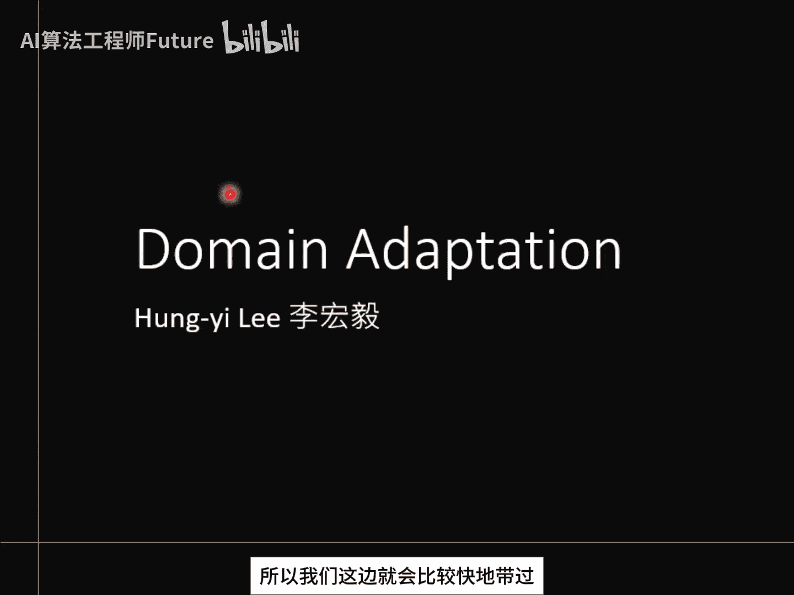

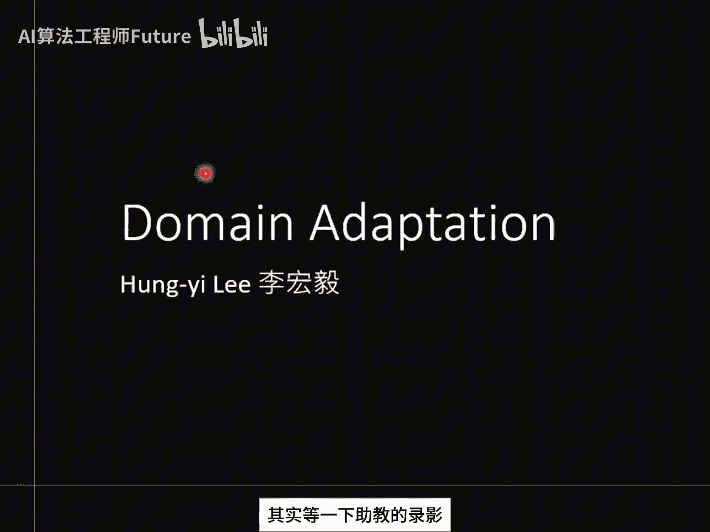

在本节课中，我们将要学习**领域自适应**的核心概念。当机器学习模型的训练数据与测试数据分布不一致时，模型的性能可能会急剧下降。领域自适应技术旨在解决这一问题，帮助我们将在一个领域（源领域）学到的知识，有效地应用到另一个不同但相关的领域（目标领域）上。

---

## 课程背景与问题引入

讲完迁移学习相关内容后，我们进入领域自适应的学习。接下来的课程会播放助教的详细讲解录像，因此本节会快速概述核心概念。如果你有任何不清楚的地方，可以在后续的助教录像中再次学习。

到目前为止，我们已经训练了许多机器学习模型。对于大家来说，训练一个分类器已不是难题。例如，在手写数字识别任务中，只要有标注好的训练数据，训练模型并在测试集上应用即可。在MNIST这样的基准数据集上，达到99.5%的准确率也很常见。

但是，如果测试数据与训练数据的**分布不同**，会发生什么呢？

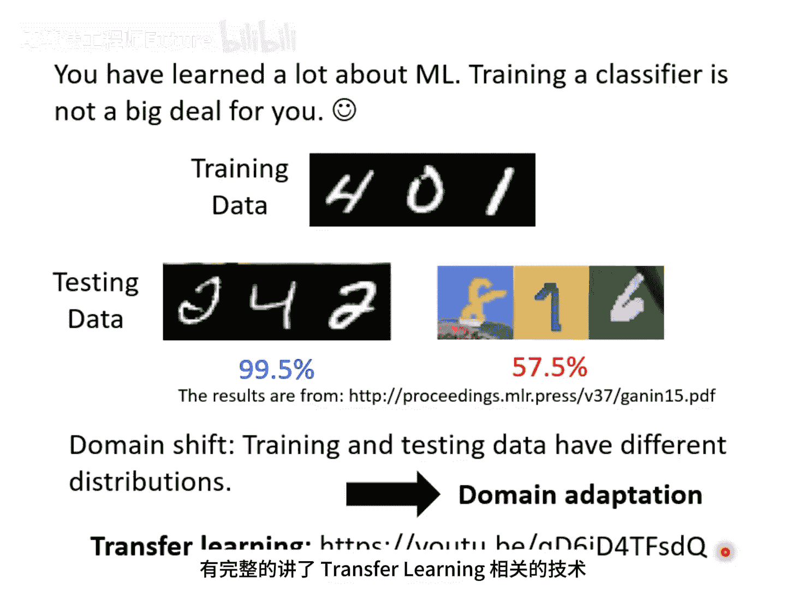

我们举一个简单的例子：假设训练时数字图片是**黑白**的，但测试时数字图片是**彩色**的。你可能会认为，虽然颜色不同，但数字形状一样，模型应该能识别。然而事实并非如此。如果在黑白数字图片上训练一个模型，直接应用到彩色数字图片上，准确率会非常低，可能只有**57%**，这是一个不及格的分数。

因此，当训练数据和测试数据存在分布差异时，训练出的模型在测试数据上可能会失效。这种问题被称为**领域偏移**。在大多数作业或基准数据集中，我们通常假设训练和测试数据分布相同，这给人造成“人工智能非常强大”的错觉。但在实际应用中，一旦存在领域偏移，机器能否表现良好就是一个未知数。

本节课的目标，就是探讨当训练和测试数据存在差异时，有哪些方法可以让我们做得比“什么都不做”更好。这就是**领域自适应**技术。

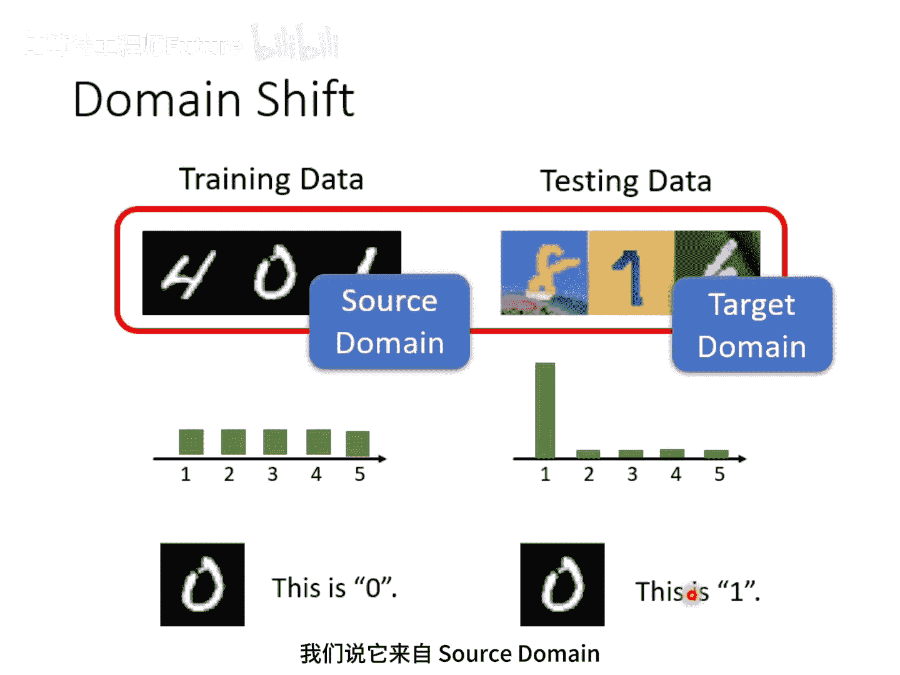

领域自适应也可以看作是**迁移学习**的一种。迁移学习是指将在任务A上学到的技能应用于任务B。对于领域自适应，训练数据来自一个领域（源领域），测试数据来自另一个领域（目标领域）。我们将一个领域学到的知识应用到另一个领域，因此它是迁移学习的一个环节。

> 注：由于时间有限，本节课只聚焦于领域自适应的部分。如果你对完整的迁移学习技术感兴趣，可以回顾之前的课程录像。

---

## 领域偏移的类型

我们刚才看到的（输入数据分布变化）只是领域偏移的一种。实际上，领域偏移有多种类型：

1. **输入分布变化**：这是最常见的一种，即模型输入数据的特征分布发生变化（如黑白图变彩图）。
2. **输出分布变化**：即标签的分布发生变化。例如，训练时每个数字出现概率相同，但测试时某些数字出现概率特别大。
3. **输入-输出关系变化**：这是一种更罕见但可能发生的情况，即相同的输入在训练和测试时对应的输出标签不同。例如，训练数据中某种形状是“0”，但在测试数据中同种形状却是“1”。

在本课程中，我们**只专注于输入数据分布不同**的这种领域偏移。

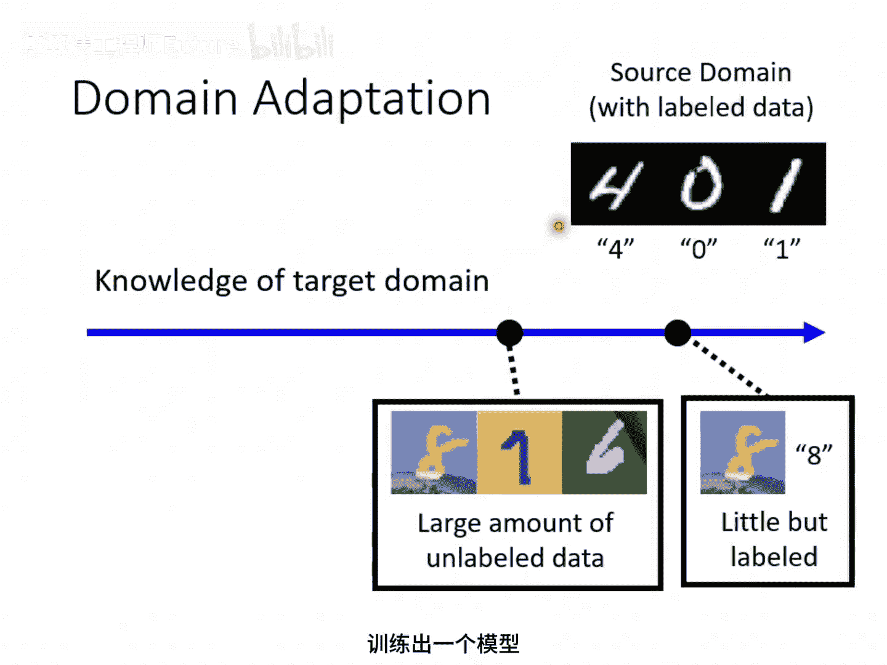

在后续讨论中，我们使用以下术语：

- **源领域**：训练数据所在的领域。
- **目标领域**：测试数据所在的领域。

---

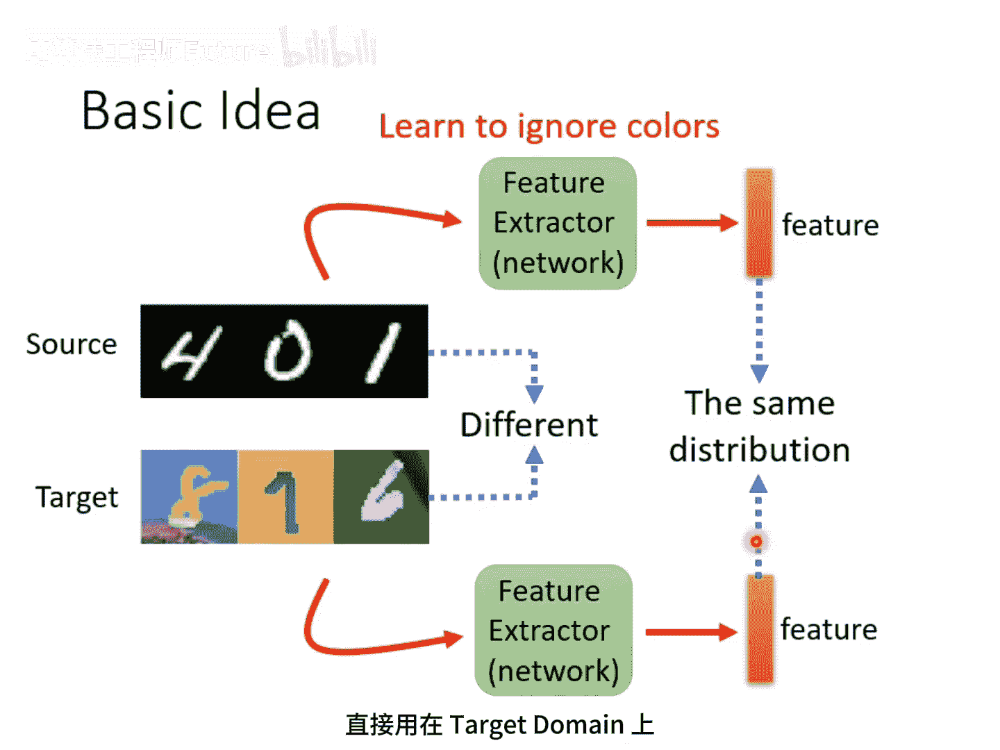

## 领域自适应的不同情境

在领域自适应中，我们的情境通常如下：我们拥有来自源领域的大量**有标注**训练数据。我们希望用这些数据训练一个模型，并将其应用于不同的目标领域。

根据我们对目标领域的了解程度不同，领域自适应的方法也不同。了解程度从高到低可分为以下几种情况：

**1. 目标领域有大量标注数据**  

如果你在目标领域已经拥有大量标注数据，那就不需要做领域自适应，直接使用目标领域数据训练模型即可。

**2. 目标领域有少量标注数据**  

这是相对容易处理的情况。你可以使用这些少量的标注数据，对在源领域上预训练好的模型进行**微调**。这个过程类似于BERT的微调，只需在目标数据上运行少数几个训练周期即可。

- **需要注意**：由于目标领域数据量少，需小心**过拟合**。避免在目标数据上迭代过多轮次。常见的解决方案包括调小学习率、限制微调前后模型参数的变化幅度等。

**3. 目标领域有大量无标注数据（本课及作业重点）**  

这是更符合现实且更具挑战性的情景，也是我们作业要处理的情况。例如，你的模型上线后，可以收集到大量用户产生的无标注数据。

- **核心问题**：如何利用这些无标注数据，帮助我们在源领域上训练出一个能很好应用于目标领域的模型？

---

## 领域自适应的基本思想 🧠

针对“目标领域有大量无标注数据”的情景，最基础的想法是寻找一个**特征提取器**。

这个特征提取器本身也是一个神经网络，它以图片作为输入，输出一个特征向量。虽然源领域和目标领域的图片在表面上看起来不同（例如颜色），但我们希望特征提取器能够**滤除这些差异**，只提取出它们**共同的部分**（例如数字的形状）。

理想情况下，无论是源领域还是目标领域的图片，通过这个特征提取器后，得到的特征向量应该具有**相似的分布**。这样，我们就可以用这些特征在源领域上训练一个分类器，并直接应用于目标领域。

接下来的关键问题是：**如何找到这样一个特征提取器？**

---

## 领域对抗训练 🥊

我们可以将一个普通的分类器分为两部分：**特征提取器** 和 **标签预测器**。

- 例如，一个10层的图像分类器，前5层可作为特征提取器，后5层作为标签预测器。具体如何划分是一个需要调整的超参数。

那么，如何训练这个特征提取器和标签预测器呢？

1. **对于源领域数据**：由于有标注，我们可以像训练普通分类器一样，让数据通过特征提取器和标签预测器，并最小化分类损失（如交叉熵损失）。这确保了模型在源领域上的分类能力。
2. **对于目标领域数据**：这些数据没有标注，因此无法直接用于训练标签预测器。但它们可以用于训练特征提取器，使其输出的特征分布与源领域相似。

具体方法是引入一个**领域分类器**。这是一个二分类器，输入是特征提取器输出的特征向量，任务是判断该特征来自源领域还是目标领域。

而**特征提取器的目标**则是要**欺骗**这个领域分类器，让它无法区分特征的来源。这形成了一个对抗游戏：

- **领域分类器**：努力区分特征是来自源领域还是目标领域（最小化领域分类损失）。
- **特征提取器**：在保证源领域分类准确的前提下，努力让领域分类器判断错误（最大化领域分类损失）。

这种技术被称为**领域对抗训练**，其思想与生成对抗网络非常相似。你可以将特征提取器视为生成器，将领域分类器视为判别器。

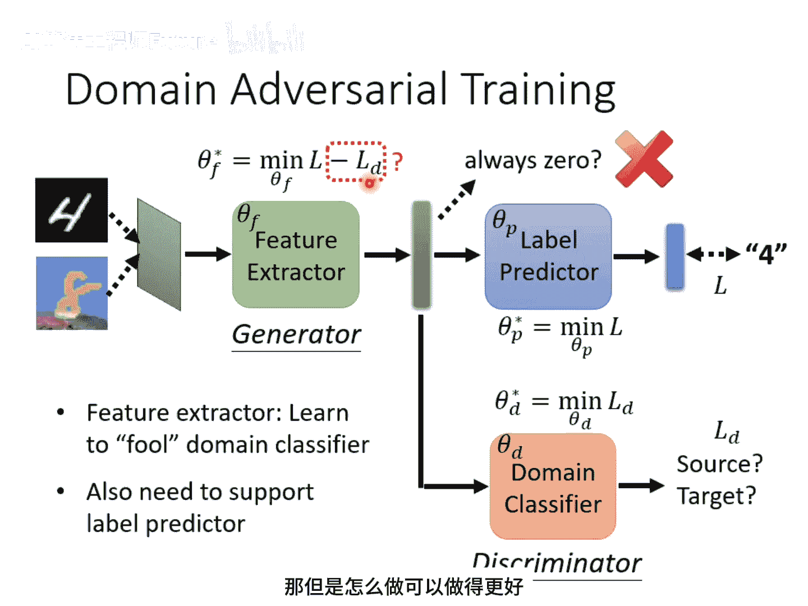

> 注：在训练中，特征提取器不能简单地“摆烂”（例如永远输出零向量），因为它还需要为标签预测器提供有效的特征以完成源领域的分类任务。这迫使它学习有意义的、领域不变的特征。

我们用符号来更清晰地描述这个过程：

- 设标签预测器的参数为 θ_p，其损失（源领域分类损失）为 L。
- 设领域分类器的参数为 θ_d，其损失（领域分类损失）为 L_d。
- 设特征提取器的参数为 θ_f。
- 训练目标：
  
  θ_p：最小化 L（提高源领域分类准确率）。
  θ_d：最小化 L_d（提高领域判别准确率）。
  θ_f：最小化 **L - L_d**（提高源领域分类准确率的同时，降低领域判别准确率，即欺骗领域分类器）。

领域对抗训练的效果非常显著。例如，在黑白数字上训练，直接在彩色数字上测试，准确率可能只有57.5%。但加入领域对抗训练后，准确率可以飙升到81%以上。

---

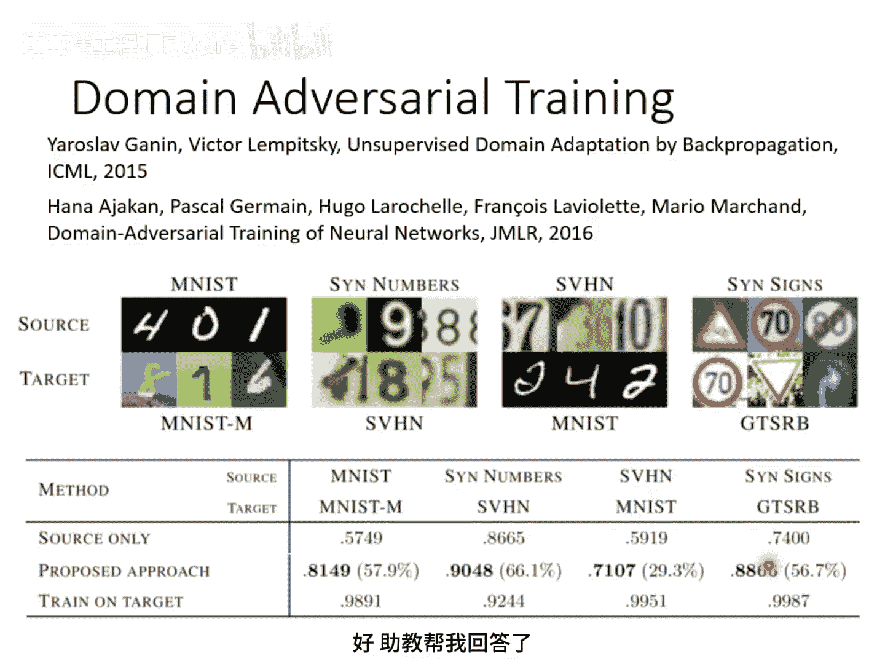

## 领域自适应的高级挑战与改进

上一节我们介绍了领域对抗训练的基本框架，但这种方法仍存在一些局限和挑战。

### 挑战一：类别对齐问题

基础方法只要求两个领域的特征分布整体上接近，但忽略了类别边界。如下图所示，左图和右图中，红点（目标领域）和蓝点（源领域）的总体分布都混合在一起，但右图的情况显然更好，因为目标领域的数据点远离了源领域的分类决策边界。

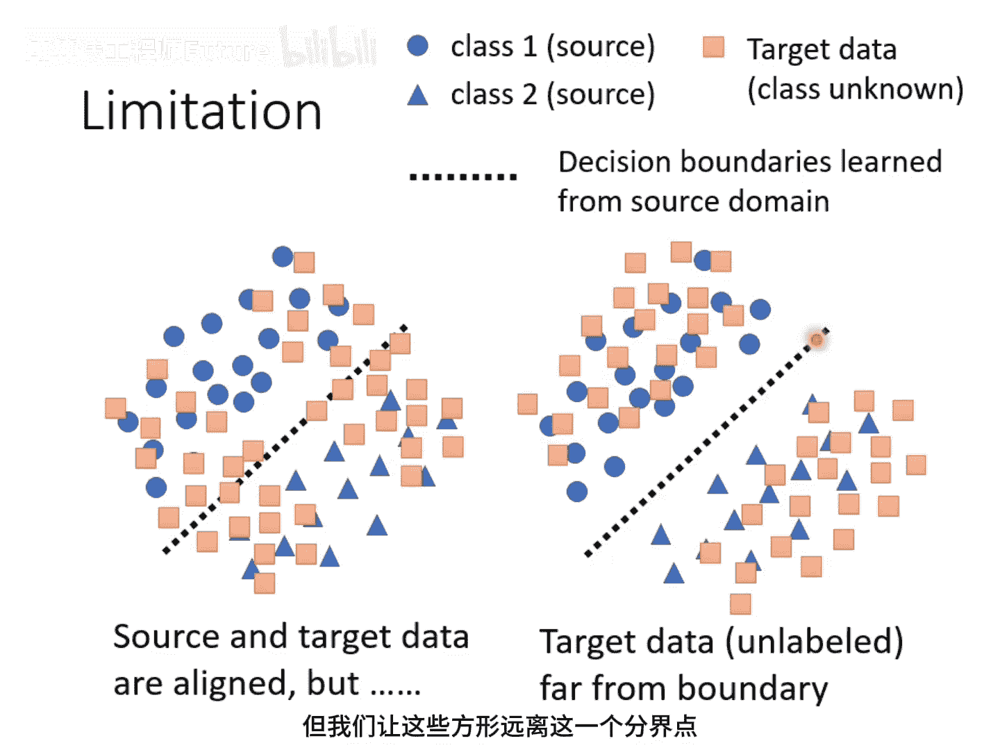

**解决方案**：我们需要让无标注的目标领域数据不仅特征分布与源领域对齐，还要尽可能**远离分类决策边界**。一个简单的思路是，对于目标领域数据通过标签预测器后的输出，我们希望其预测概率分布尽可能“尖锐”（即非常确信地属于某一个类），而不是均匀分布。文献中也有许多高级方法，如 **DANN**、**CDAN**、**MDD** 等，它们通过更精巧的设计来实现更好的类别对齐。

### 挑战二：类别集合不一致问题

我们一直假设源领域和目标领域的类别集合完全相同。但现实中，目标领域无标注，其类别集合可能：

- 是源领域类别的子集。
- 包含源领域没有的新类别。
- 两者有交集但各有独特类别。

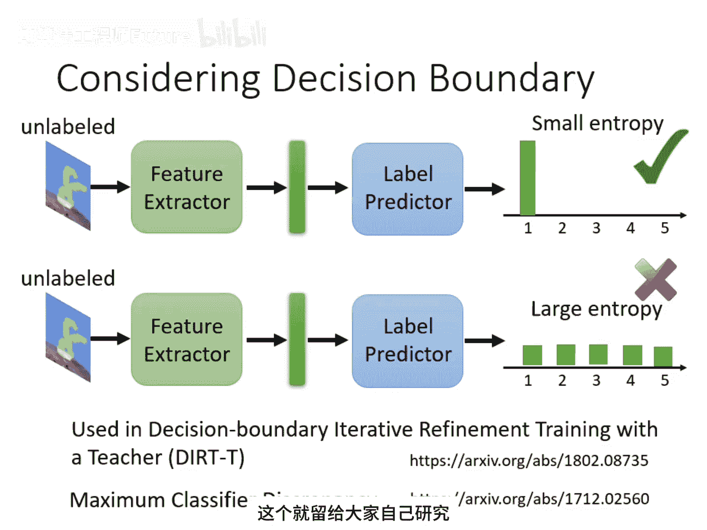

强行将两个领域的特征完全对齐，在这种情况下可能有害（例如，迫使“老虎”的特征变得像“狗”）。

**解决方案**：这属于**开放集领域自适应**或**通用领域自适应**的研究范畴。相关方法（如 **Universal Domain Adaptation**）会尝试识别目标领域中的未知类别，并采取不同的对齐策略。

### 挑战三：目标领域数据极少

如果目标领域不仅无标注，而且数据量极少（例如只有一张图片），传统的对齐方法将失效。

**解决方案**：可以采用 **测试时训练** 等技术。模型在测试时利用这极少量的目标数据，进行快速的在线自适应。

---

## 从领域自适应到领域泛化 🌐

如果我们对目标领域**一无所知**，甚至连数据都没有，该怎么办？这时问题就从“自适应”某个特定领域，变成了“泛化”到任何未知领域。这被称为**领域泛化**。

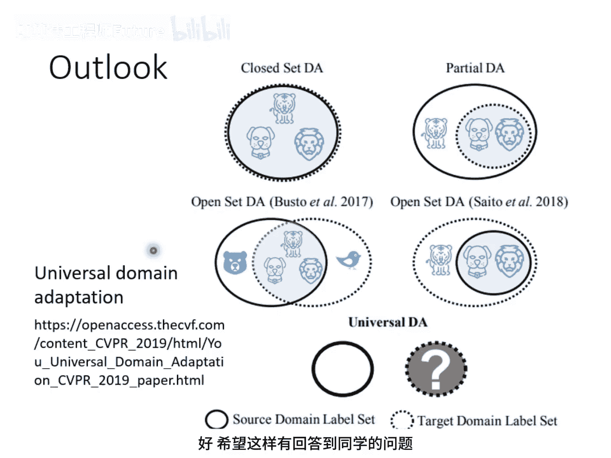

领域泛化主要分为两种情景：

1. **训练时包含多个源领域**：这是相对容易想象的情况。例如，训练数据包含真实照片、素描、水彩画等多种风格的猫狗图片。模型通过接触多个领域，学习到领域不变的特征，从而在面对卡通风格等新领域时也能表现良好。
2. **训练时只有一个源领域**：这是更具挑战性的情况。虽然只有一个领域的训练数据，但可以通过**数据增强**技术，模拟生成多个不同领域的数据，然后套用上一种情景的方法，以期模型能泛化到新的领域。

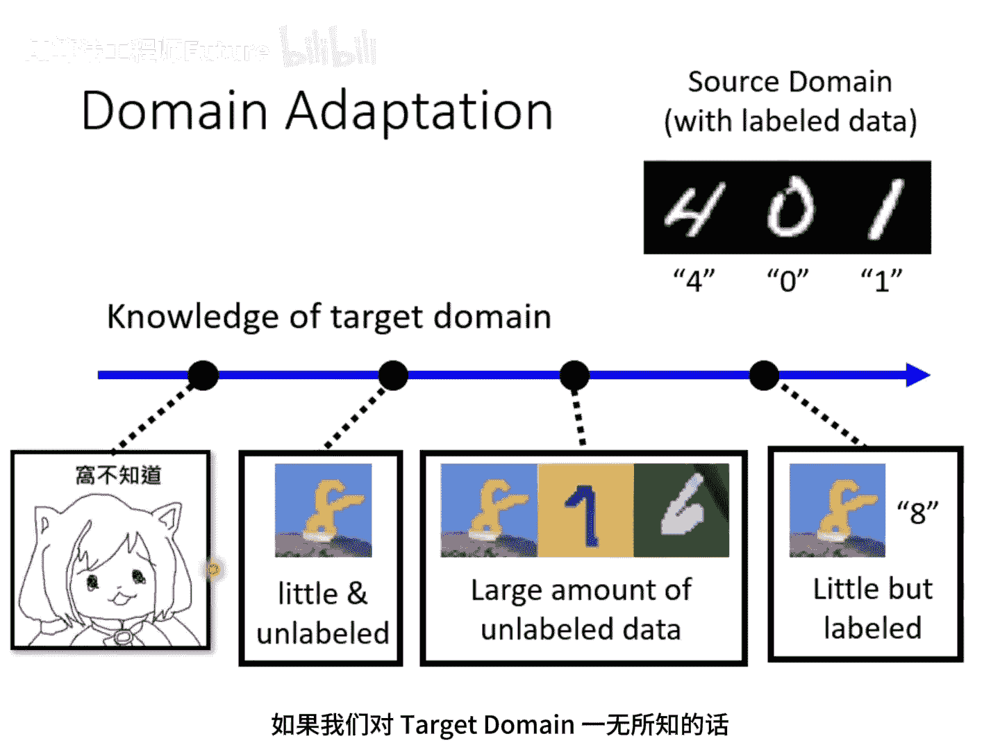

---

## 总结与预告

本节课中，我们一起学习了**领域自适应**的核心概念与技术。我们了解到，当训练与测试数据分布不一致时，模型的性能会下降。领域自适应通过**对齐源领域和目标领域的特征分布**来解决这一问题。

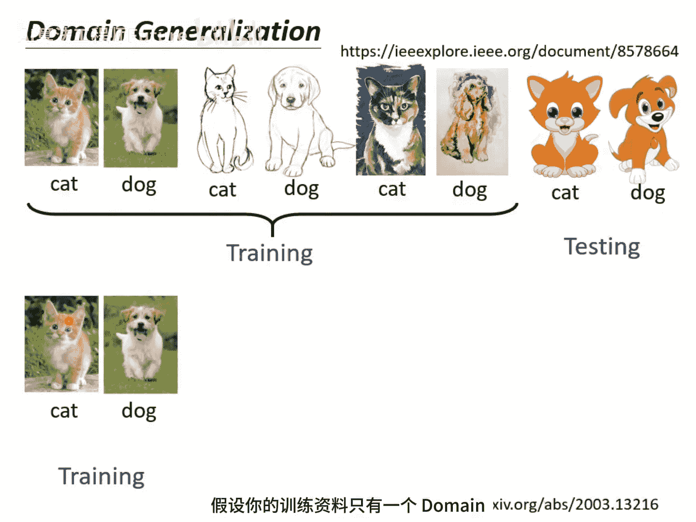

我们重点介绍了**领域对抗训练**这一经典方法，它通过引入一个领域分类器，并与特征提取器进行对抗性训练，来提取领域不变的特征。此外，我们还探讨了类别对齐、类别集合不一致、数据量极少等高级挑战及其解决思路，并简要介绍了更一般的**领域泛化**问题。

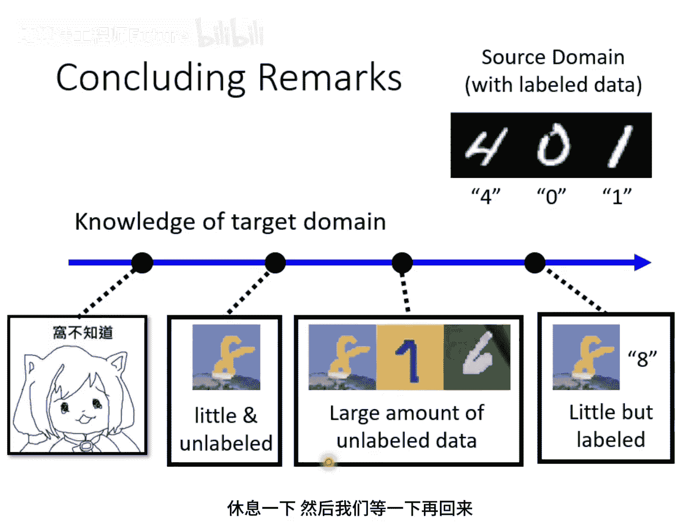

领域自适应是一个实践性很强的主题，其中涉及许多需要调优的细节（如网络划分、损失权重等）。在接下来的助教课程中，将对实现细节进行更深入的讲解。现在，让我们稍作休息。
