# 74：自监督学习模型BERT的三个故事 🧠

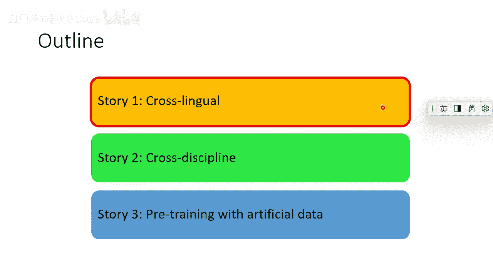

在本节课中，我们将探讨自监督学习模型BERT所展现出的三种令人惊奇的能力。我们将通过三个故事，了解BERT如何超越语言理解，展现出跨语言、跨学科甚至在人造数据上学习的非凡潜力。

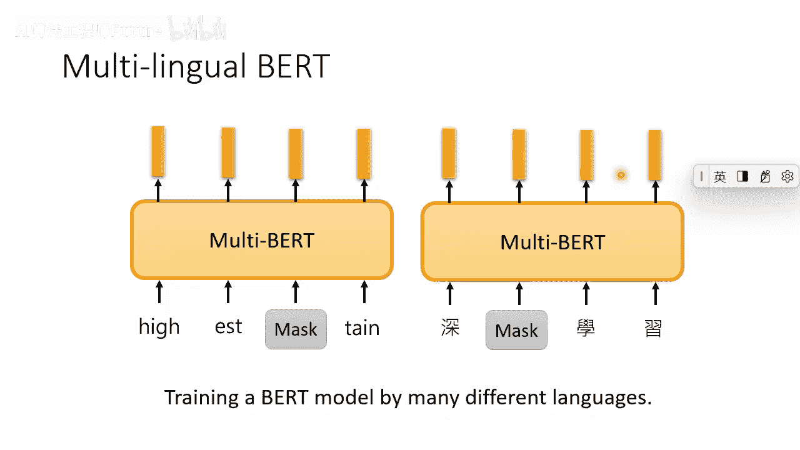

## 故事一：BERT的跨语言能力 🌐

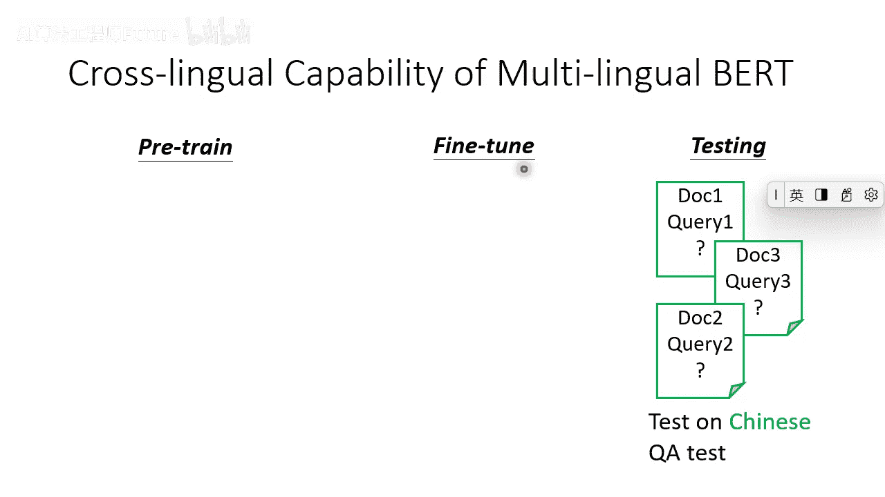

上一节我们介绍了自监督学习的强大，本节中我们来看看BERT如何理解多种语言。

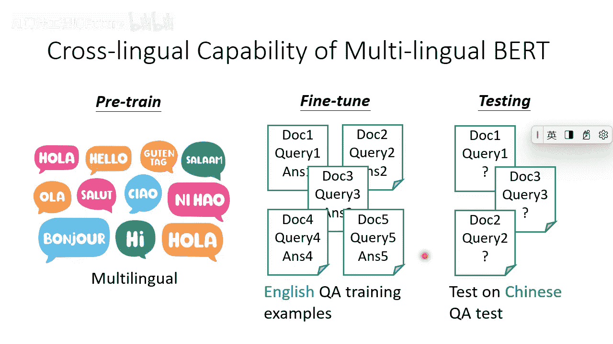

自监督学习模型具备理解多种语言的能力。训练BERT时，并非只能使用单一语言。BERT的训练本质上是做填空题。你可以提供多种语言的句子数据，让模型学习完成这些语言的填空题。

如果BERT模型在多种语言上进行了填空题练习，它会产生不可思议的效果。以下我们就来看看这种多语言BERT具备何种神奇能力。

### 多语言BERT的神奇应用

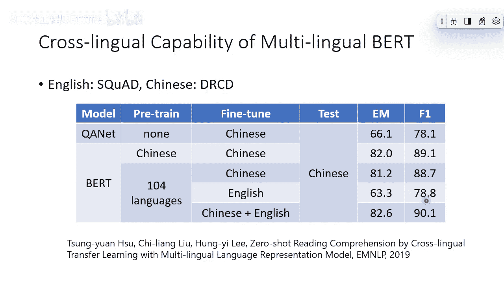

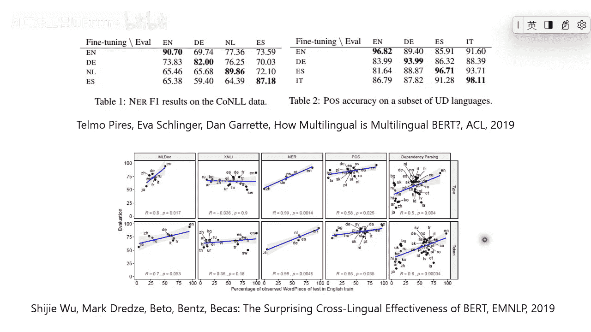

在自监督学习中，我们通常先预训练模型，然后针对特定任务进行微调，最后在感兴趣的任务上测试。假设我们想解决的任务是中文问答，即向机器提出中文问题，让它阅读中文文章并给出中文答案。

通常的想法是，你需要提供中文问答的训练数据来微调预训练的BERT模型。然而，有了这种多语言BERT，情况变得不同。

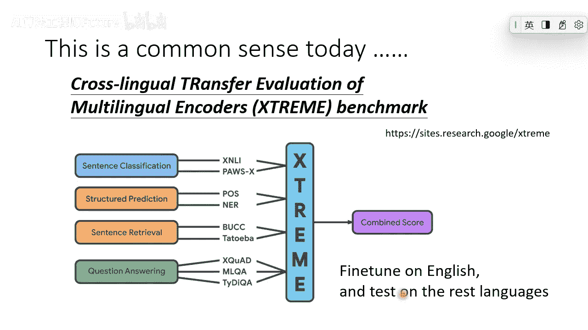

当BERT学习过多种语言后，神奇之处显现：如果你想让机器解决中文问答问题，你**不需要**提供中文问答训练数据。你可以只提供英文问答训练数据——英文文章、英文问题和英文答案。让模型学习这些数据后，它竟然能自动举一反三，处理中文问题。

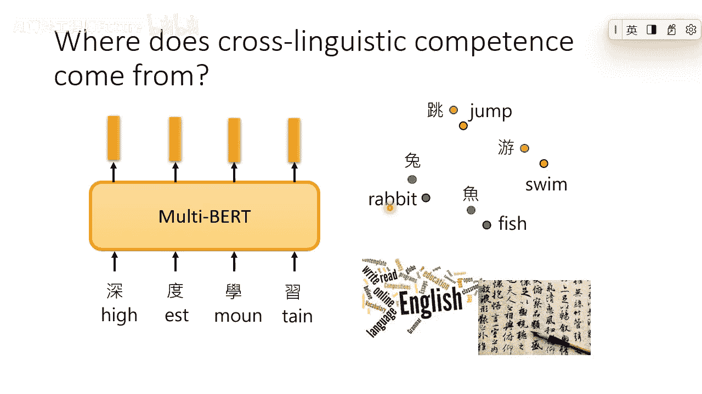

这就像你要参加中文阅读考试，却只做了英文的历年真题，但最终你也能通过中文考试一样神奇。BERT在中文问答上可以“裸考”，完全无需见过中文问答问题，只要学习过英文问答问题即可。

这个发现由许中元同学和刘继良同学在2019年ENNLP上发表。实验测试数据是中文问答数据集DRCD，英文问答数据则使用著名的SQuAD数据集。

以下是实验结果：

- 如果不使用BERT预训练，仅用中文数据微调QA-Net模型，F1分数（可视为正确率）为78.1。
- 如果使用在中文上预训练的BERT，并在中文问答数据上微调，F1分数可达89.0。
- 如果使用在104种语言上预训练的多语言BERT，但**仅用英文问答数据微调**，然后直接测试在中文问答数据上，F1分数竟能达到78.8，与直接用中文数据微调的结果几乎一样好，甚至略优。

这个结果并非巧合。同一年，许多团队在不同任务和语言上都观察到了类似现象，即多语言BERT具备跨语言举一反三的能力。

如今，多语言BERT的跨语言能力已不稀奇，在自然语言处理领域已成为常识。例如，基准数据集XTREME就是专门为了测试多语言BERT的跨语言能力而设计，它包含9个不同任务，要求模型仅使用英文训练数据微调，然后测试在其他30多种语言上的表现。

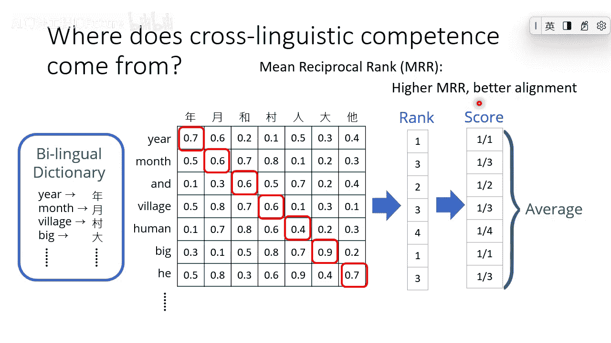

### 跨语言能力的来源探究

虽然大家都知道多语言BERT有跨语言能力，但这种能力从何而来？一个常见的猜想是：多语言BERT可以无视语言差异，对不同语言中意思相同的符号，给出相似的向量表示。

例如，对多语言BERT来说，“鱼”和“fish”，“兔”和“rabbit”看起来是相似的。它可以忽略不同语言符号的差异，只理解符号背后所代表的语义。这解释了为什么多语言BERT具备跨语言能力——因为对它而言，不同语言没有本质差别。

但事实果真如此吗？我们通过一个简单实验来验证，多语言BERT是否真的能将不同语言中意思相同的符号对应起来。

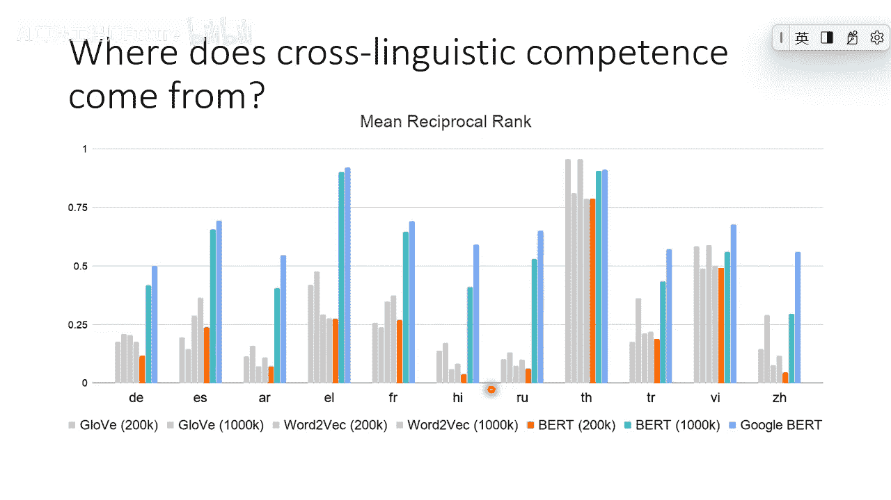

实验步骤如下：

1. 准备一个中英对照词典，其中包含意思对应的英文词汇和中文词汇列表。
2. 为每个英文词汇和中文词汇计算一个“代表向量”。由于BERT是上下文相关的表示模型，同一个词在不同上下文中的向量不同。我们通过将该词在所有语料中出现时的向量取平均，作为其代表向量。
3. 计算每个中文词汇与每个英文词汇之间的向量相似度。
4. 利用已知的词典对应关系，检查每个英文词汇与其正确对应的中文词汇的相似度排名。例如，“year”对应“年”，我们检查“year”与“年”的相似度在所有中文词汇中是否排名第一。排名越靠前（Rank值越小），说明对齐越好。
5. 计算所有词汇排名的倒数平均值，得到一个Mean Reciprocal Rank (MRR)分数。**MRR分数越高，代表该多语言BERT模型将不同语言中相同含义的词汇对应得越好。**

以下是一些实验结果。我们分析了BERT模型在英文与另外十种语言间的对应关系。

- 最右边的蓝色柱状图代表Google使用100多种语言训练的多语言BERT，其MRR分数在不同语言上都相当高。
- 右边第二个柱状图是我们自己用十种语言（每种语言100万个句子）训练的模型，其跨语言对齐效果与Google的模型相差无几。
- 粉红色柱状图是将训练数据量降至每种语言20万个句子的结果，其MRR分数显著下降。
- 剩下四个柱状图是BERT时代之前的词向量模型（如GloVe、Word2Vec）的结果。即使给予它们相同的数据量，其跨语言对齐能力也远不及多语言BERT。

这个实验说明：**数据和模型都至关重要**。拥有足够多的数据和强大的模型，我们才能观察到多语言BERT的跨语言能力。

### 语言信息的隐藏与利用

但是，如果多语言BERT真的完全无视语言差异，那么当它做英文填空题时，怎么会填入英文单词？做中文填空题时，又怎么会填入中文字？在实际训练中，我们确实观察到模型不会混淆输出语言。因此，多语言BERT应该还是能识别输入句子的语言类型，语言间的差异信息并未被完全抹去，而是被隐藏了起来。

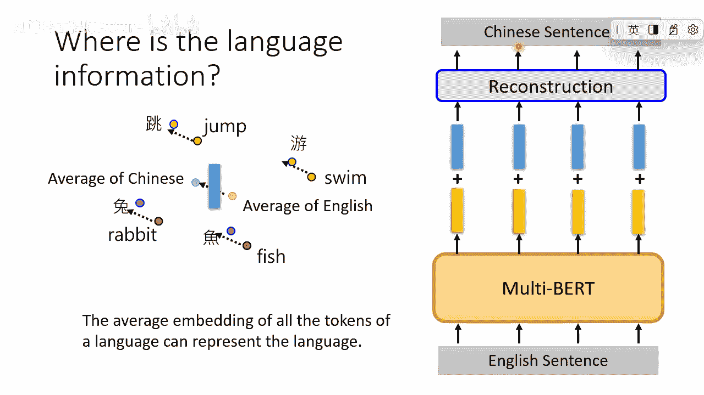

后来我们发现，语言信息可以用简单的方法抽取出来。例如，我们可以计算所有英文词汇向量的平均值，以及所有中文字向量的平均值，然后计算这两个平均向量的差值。

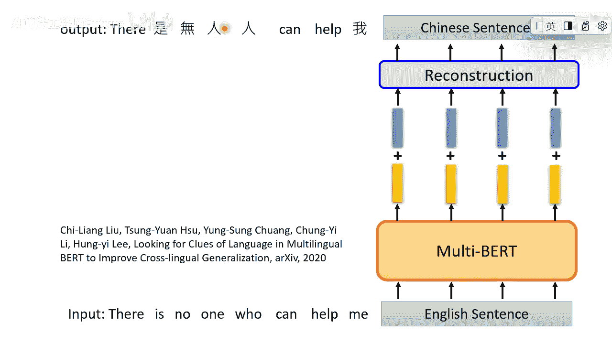

神奇的是，将英文词汇的向量加上这个“英中差异向量”后，得到的新向量会与其中文对应词的向量非常接近。例如，“fish”加上差异向量后，结果与“鱼”的向量接近；“rabbit”加上差异向量后，与“兔”的向量接近。

更神奇的是，你可以将一个英文句子输入多语言BERT，得到每个词的向量表示，然后将所有这些向量都加上“英中差异向量”。对这些“平移”后的向量进行还原（例如通过模型解码），你可能会得到一个中文句子。

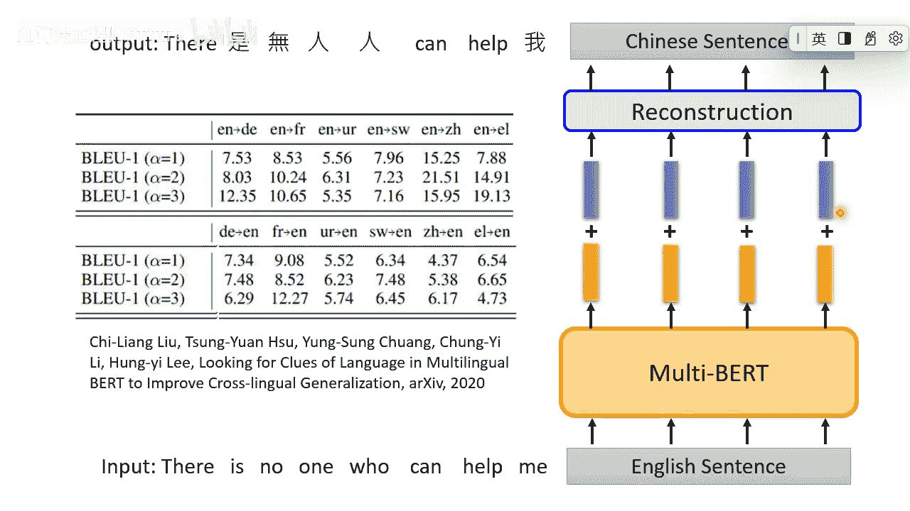

以下是一个真实实验例子：

- 输入英文句子：`There is no one who can help me.`
- 经过上述向量平移和还原后，得到的结果是：`There 是 无 人 人 who can help 我。`
- 这不是一个精确的翻译，但你会发现模型确实将“me”对应到“我”，将“is”对应到“是”，将“no one”对应到“无人”。

我们尝试了将英文转换为其他六种语言，以及反向转换，并计算了生成句子与真实翻译之间的BLEU分数。虽然BLEU分数不高，但确实是非平凡的结果，表明通过添加语言差异向量的方法，可以实现部分翻译效果。

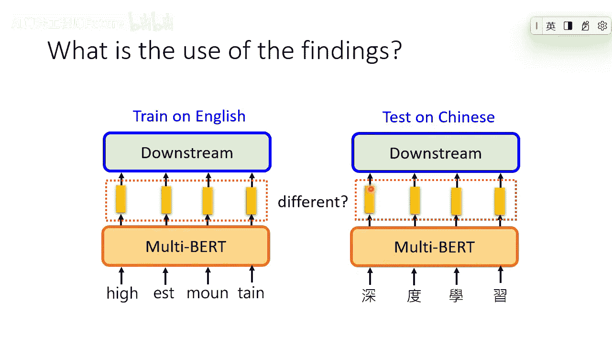

在差不多同一时间，还有其他两篇论文也有类似发现，即多语言BERT不仅对齐了语义，也保留了语言信息。

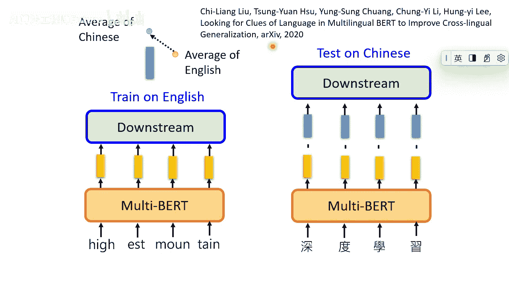

### 跨语言能力的应用与优化

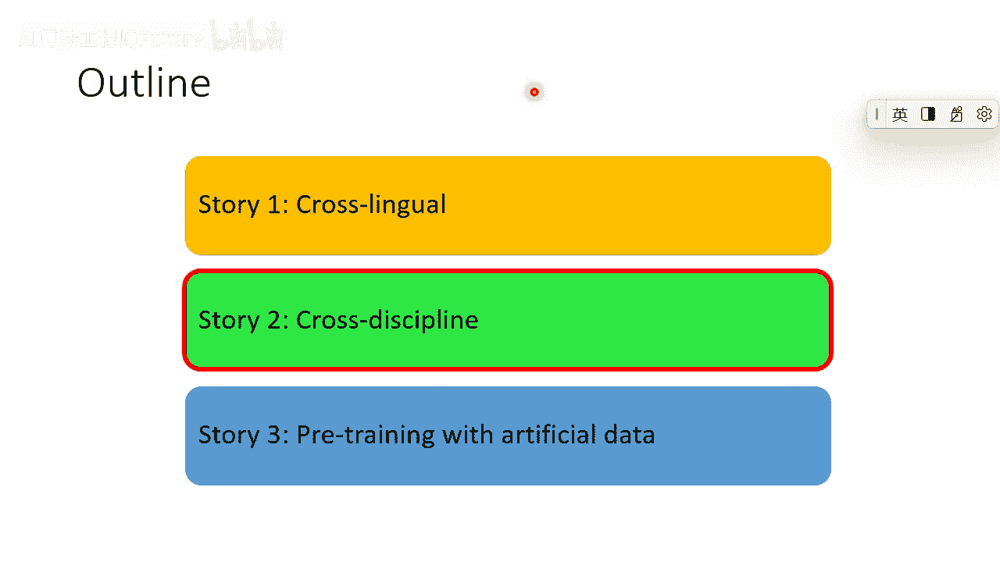

发现多语言BERT存有语言信息有什么用呢？这可以带来实际应用。例如，虽然多语言BERT具备跨语言能力，可以在英文数据上训练，然后在中文数据上测试，但由于中英文向量表示仍有差异，这种跨语言转换的效果通常不如在同种语言上训练和测试。

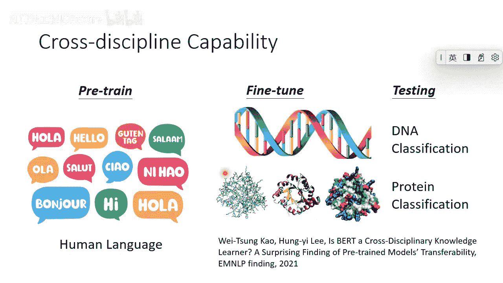

那么如何改进呢？一个方法是修正多语言BERT的输出表示。假设我们在英文数据上微调了一个下游模型，它习惯于理解英文的向量表示。当输入中文句子时，虽然模型似乎能理解，但中文向量与英文向量毕竟有差异。我们可以将中文向量减去“英中差异向量”，使其看起来更像英文向量，这样下游模型就可能表现更好。相关论文结果可以参考右上角引用的文章。

## 故事二：BERT的跨学科能力 🔬

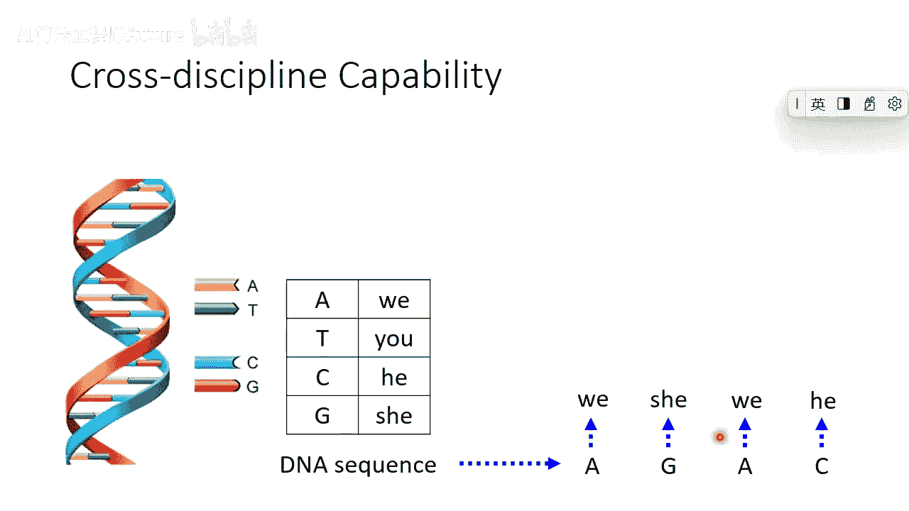

第一个故事讲述了BERT的跨语言能力，接下来要讲一个更离奇的故事：自监督模型不仅具备跨语言能力，还具备跨学科能力。

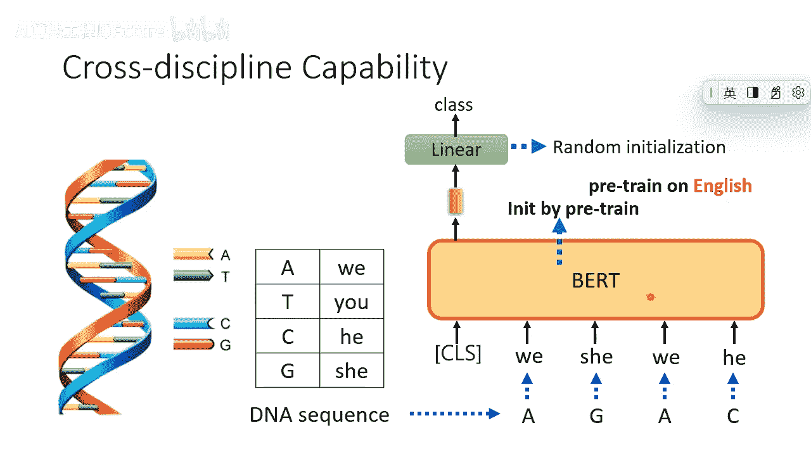

什么是跨学科能力？我们尝试将模型在人类语言上预训练，然后让它去执行与人类语言完全无关的任务，例如DNA分类或蛋白质分类。这样做会有帮助吗？以下要介绍的是高伟聪同学在EMNLP 2021发表的论文中的部分实验结果。

你可能会问，一个在人类语言上预训练的模型，只懂人类语言，如何应用于DNA或蛋白质序列呢？DNA是由A、T、C、G四种脱氧核糖核酸构成的序列。我们可以建立一个简单的映射表，将这四种碱基随机对应到四个英文单词上。实验表明，这种对应关系具体是什么并不重要，随机生成即可。

例如，将A对应到“we”，T对应到“you”，C对应到“he”，G对应到“she”。那么一个DNA序列“AGAC”就被转换成一串英文“we she we he”。我们将这段“英文”输入BERT，然后用这个BERT模型来做DNA分类任务。同样，我们需要在BERT后面添加一个线性分类层，该层需要从头训练，但BERT本体使用预训练好的权重进行初始化。

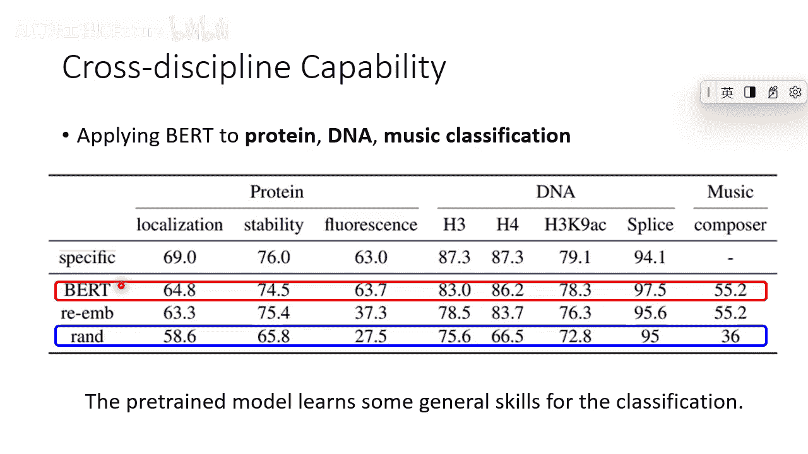

**需要特别强调的是**，这项研究与那些直接在DNA或蛋白质序列上进行预训练的研究完全不同。我们这里研究的是：**在英文上做填空题预训练的BERT，被用于蛋白质或DNA分类任务时，会发生什么？**

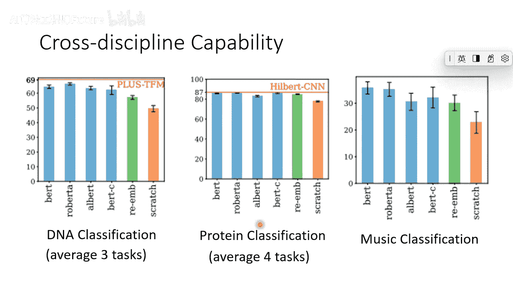

以下是实验结果。我们尝试了三个不同的蛋白质分类任务、四个DNA分类任务，还有一个音乐分类任务（根据音符序列判断歌曲风格）。

- 蓝色框内的结果是没有使用任何预训练模型（即从头训练）所能达到的正确率。
- 红色框内的结果是使用了在英文上预训练的BERT后达到的正确率。

比较两者可以发现，在所有尝试的任务中，使用BERT都带来了正确率的显著提升。最神奇的是，BERT明明是在英文填空题上预训练的，但在这些与人类语言完全无关的任务上居然也有帮助。

这表明，这些预训练模型学到的不仅仅是人类语言的语义。因为它不仅能解决语言相关任务，还能解决与语言无关的任务，这说明它还学到了一些更通用的能力。这些通用能力可以帮助它更好地处理各种分类和机器学习任务。

有人可能会想，是不是只有一个特定的预训练模型有这种效果？我们告诉你，这不是巧合。我们尝试了四种不同的预训练模型：BERT、RoBERTa、ALBERT和BERT-zh（在中文上预训练的BERT）。结果显示，在DNA分类、蛋白质分类和音乐分类任务上，所有在人类语言上预训练的模型（蓝色柱状图）都比从头训练的模型（橙色柱状图）表现更好。

### 跨学科能力的作用机制

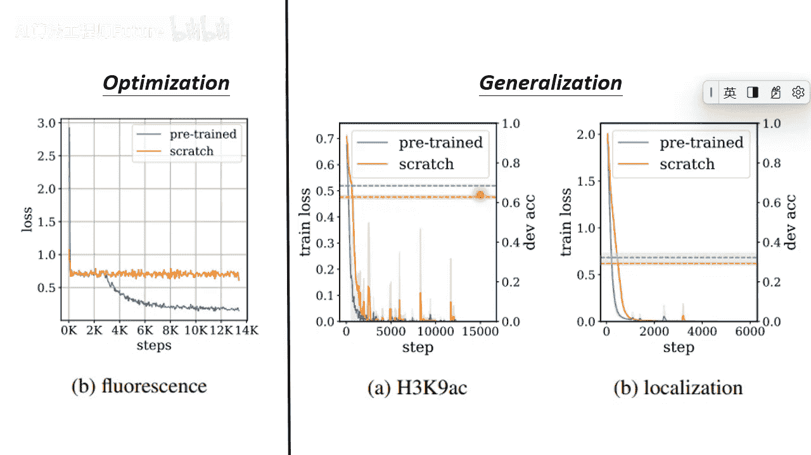

接下来你可能会问，这种帮助具体体现在哪个方面？是让模型在优化时更容易收敛，还是增强了模型的泛化（举一反三）能力？

我们先看优化能力。观察训练过程中损失函数的变化可以了解优化情况。在某个任务上（其他任务结果类似），从头训练的模型（橙色线）损失很快停止下降。而使用了预训练BERT的模型（蓝色线），损失可以下降得更低。这表明预训练模型增强了优化能力。

那么，它是否也增强了泛化能力呢？我们看左边这个图。橙色线和蓝色线分别代表从头训练和使用预训练模型时训练集上的损失变化。我们已经看到预训练模型损失下降更快。但如果我们故意训练更久，让两种方式在训练集上都达到很低的损失（接近零）。然后，我们在开发集上测试它们的泛化能力（纵轴为准确率，越高越好）。你会发现，预训练模型的准确率高于从头训练的模型。

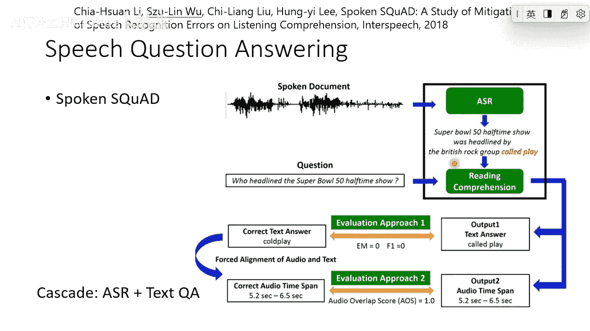

所以，神奇之处在于：**这些预训练模型同时帮助了优化和泛化**，它让优化进行得更好，也让泛化能力变得更强。

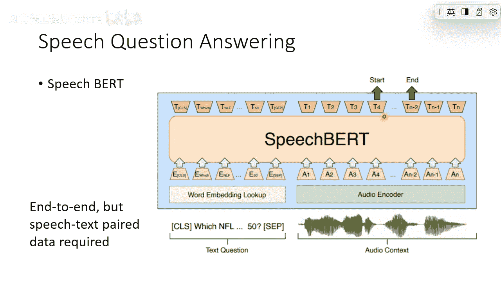

### 跨学科能力的实际应用：语音问答

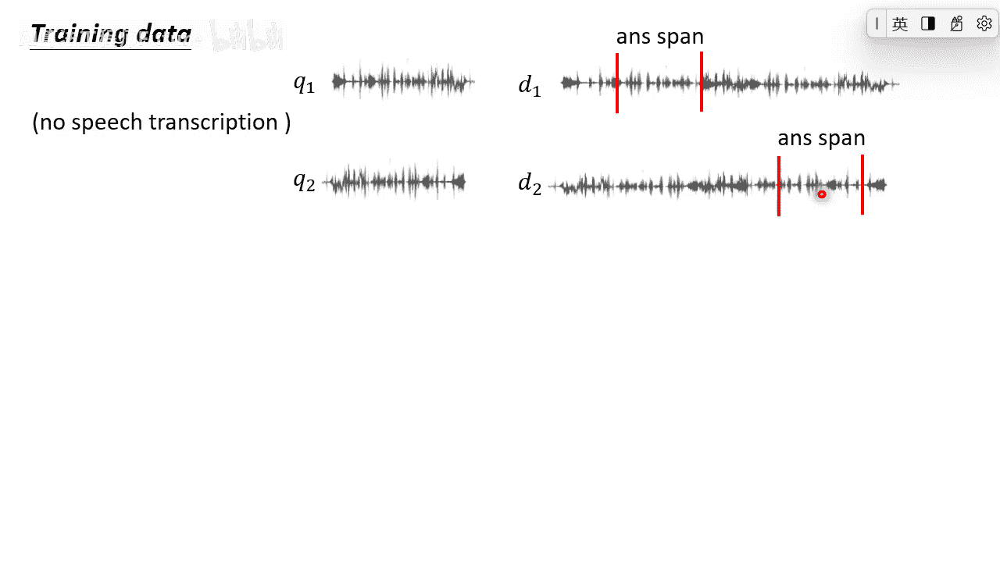

接下来要讲一个跨学科能力的实际应用：将其用于语音问答任务。

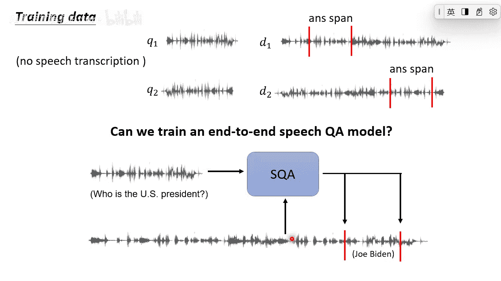

台大语音处理实验室很早便开始研究语音问答。我们曾尝试让机器做托福听力测验（选择题），后来更进一步，尝试真正的语音问答：给定一个语音问题和一个语音文章，让机器找出答案出现在语音文章的哪段时间区间。我们创建了一个名为Spoken SQuAD的基准数据集。

过去解决语音问答问题，通常采用级联模型：先将语音通过语音识别转成文字，然后在文字上应用自然语言处理模型进行理解。

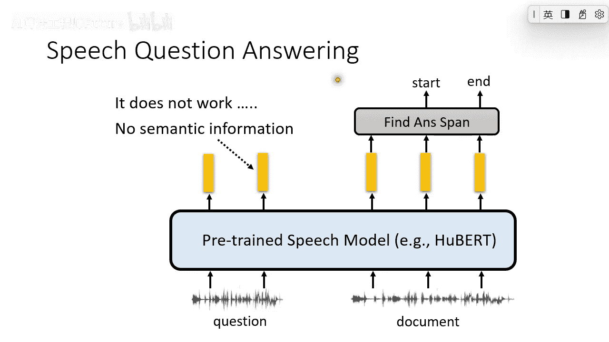

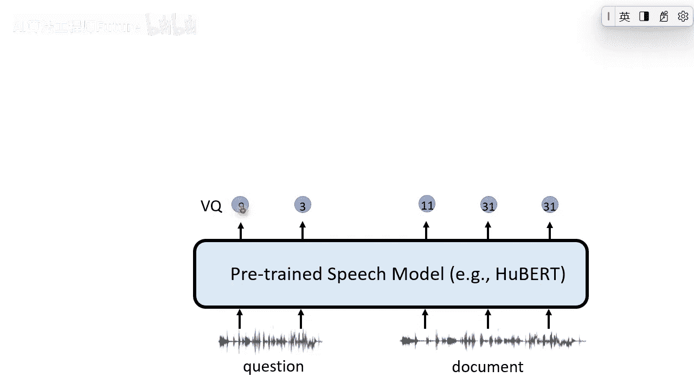

后来出现了强大的模型如Speech BERT，它是一个端到端模型，可以直接输入语音和问题，输出答案位置。但它训练时仍然需要语音和文字成对的资料。

我对于语音问答的终极期待是：**能否在完全没有文字转录的情况下，仅使用语音问题、语音文章和对应的答案区间标注，训练一个端到端的QA模型？** 这个模型不做语音识别，直接听音辨义，找出答案位置。

过去这极具挑战性。但现在我们有了预训练的语音模型（如HuBERT）。我本以为有了这些模型，我们有机会再次挑战端到端语音问答。但用HuBERT初始化模型后，发现语音QA仍然做不起来。仔细想想，这个结果可以预期，因为分析HuBERT的表示可以发现，它并未学到太多语义信息，而语音QA模型不仅需要抽取语音内容，还需要理解内容背后的含义。

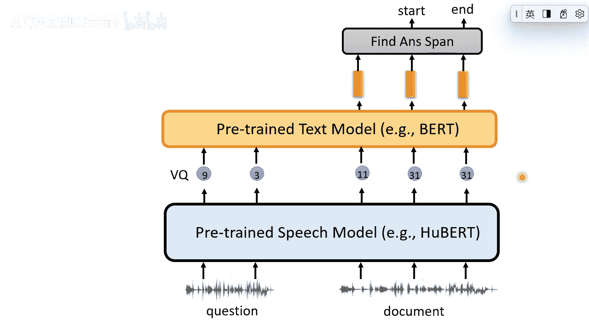

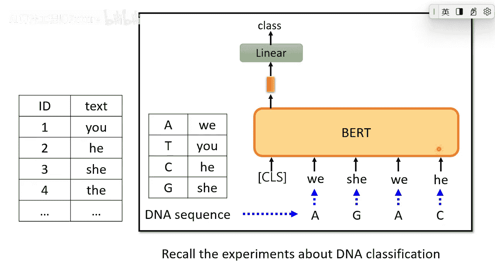

所以，仅用HuBERT可能不够。我们的想法是：将HuBERT的输出进行离散化，变成离散的标记。然后在这些离散标记后面叠加几层自注意力层。我们期望HuBERT负责抽取内容信息，而后面增加的层能赋予模型理解能力。

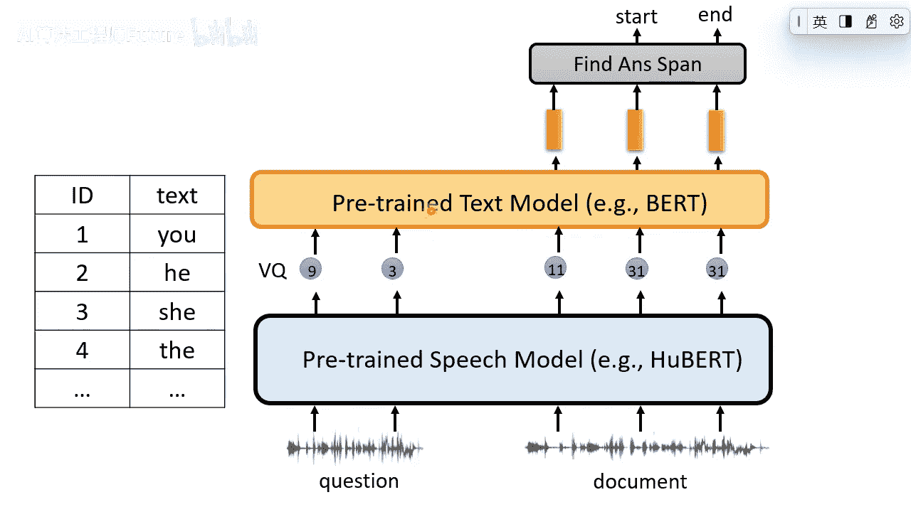

但仅仅增加网络层仍然不行。于是我们突发奇想：**是否也应该用**在文字上预训练的BERT**来初始化后面这些层呢？** 这听起来可能有些奇怪，因为文字BERT的输入是文字，而它如何能理解来自语音模型的离散输出呢？这些离散标记（如ID 9）与任何文字词汇都没有明确对应关系。

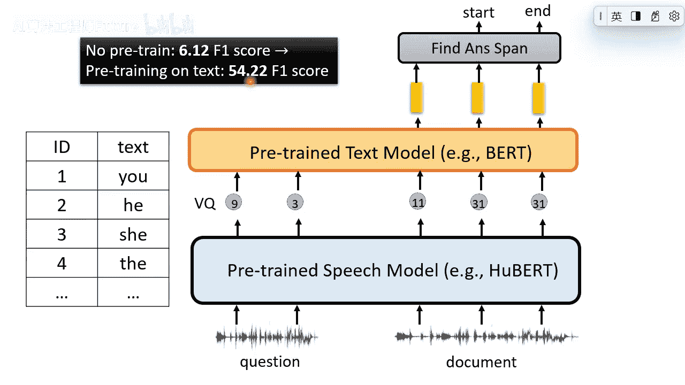

如果没有之前将BERT用于DNA分类的实验，我可能会觉得这个想法是瞎搞。但想想看，我们已经看到训练在文字上的BERT可以用于DNA和蛋白质分类。所以，我们也可以做类似的事情。

我们可以将HuBERT输出的这些ID随机映射到英文单词上（例如ID 1对应“you”，ID 2对应“he”等）。然后，将这些“单词”序列输入文字BERT，让它来进行问答。我们微调这个文字BERT，看看能否把语音问答做起来。

结果如何呢？结果是有预训练后，神奇的事情发生了——模型性能起飞了。

- 如果没有用文字BERT预训练后面的模块，F1分数只有6%，基本上没做起来。
- 如果使用了文字模型来预训练后面的模块，F1分数可以达到54%。这意味着，将语音预训练模型和文字预训练模型结合起来，达到了不可思议的效果，真正实现了端到端的语音问答。

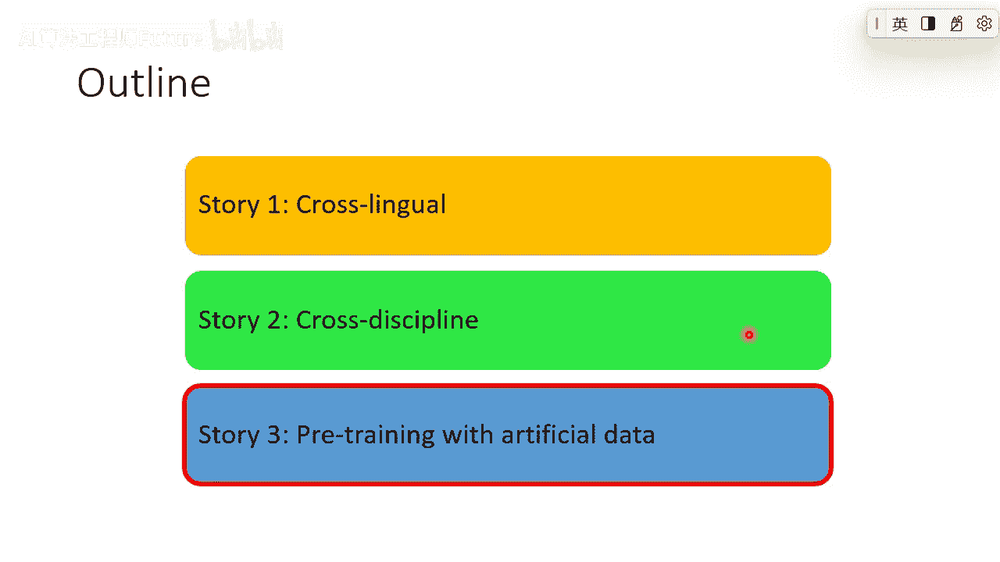

这个54%的F1分数表现如何？我们与级联模型进行比较。

- 图中绿色线代表级联模型的表现（先语音识别，再文字QA）。其性能受语音识别错误率影响很大，错误率越高，QA正确率越低。
- 蓝色线代表我们的端到端模型（语音预训练模型+文字预训练模型）的表现。你会发现，蓝色线基本不受语音识别错误率影响。当语音识别错误率超过约25%时，这个端到端模型的正确率居然可以超过级联模型。

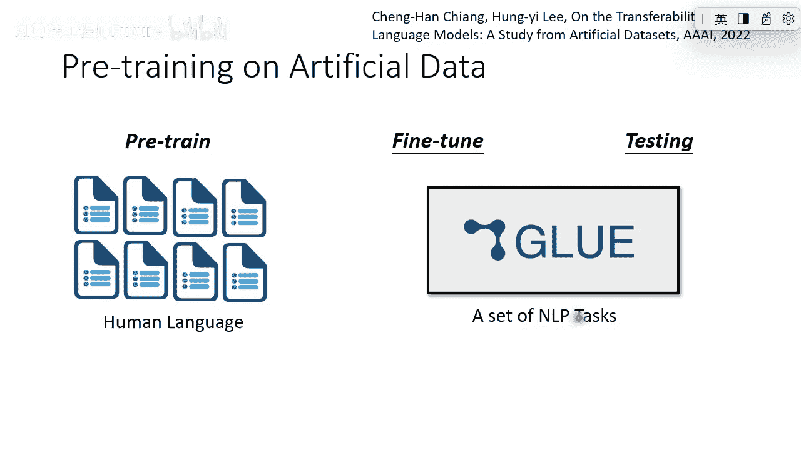

神奇之处在于，结合语音和文字的预训练模型，我们真的有机会训练出端到端的语音问答系统。

## 故事三：在人造数据上训练BERT 🧩

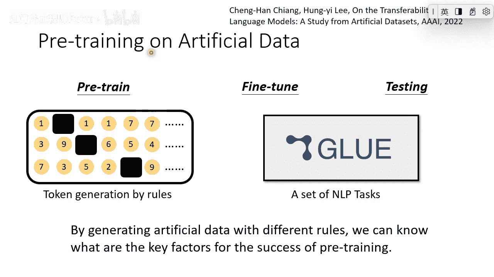

第二个故事讲述了BERT的跨学科能力，第三个故事则想分享：我们甚至可以在人造数据上训练出BERT。

我们知道，BERT通常是在人类语言上预训练，然后在NLP任务上微调和测试。最知名的NLP基准是GLUE数据集。但我们已经看到，预训练模型具备强大的跨语言和跨学科能力。那么，要解决人类语言相关的NLP任务，是否真的必须用人类文字做预训练呢？

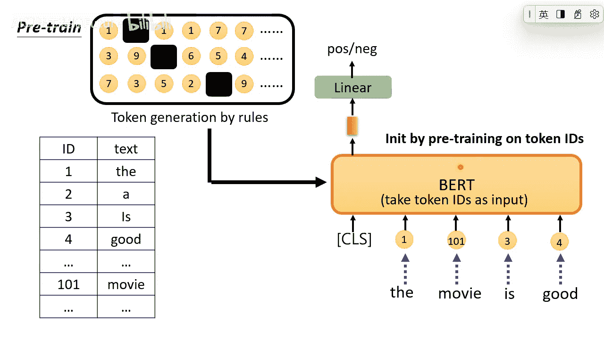

我们做了一个尝试：使用一些简单规则生成假的标记序列，在这些人造数据上预训练BERT（学习做填空题），然后看它在GLUE数据集上有什么表现。

你可能会问，做这个实验有什么意义？意义在于，通过使用不同规则生成不同的人造数据，我们可以让BERT具备不同的能力。通过观察哪种能力能让BERT在GLUE上有好表现，我们可以了解：要让一个预训练模型在人类语言任务上表现良好，**什么样的能力是重要且必需的**。这项研究是江澄汉同学的成果。

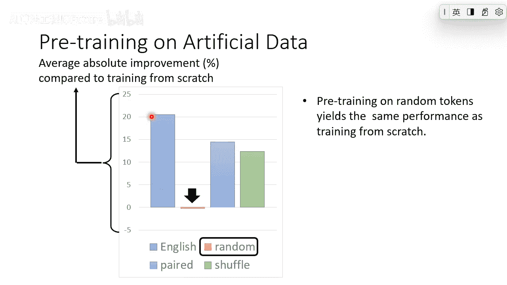

### 实验流程

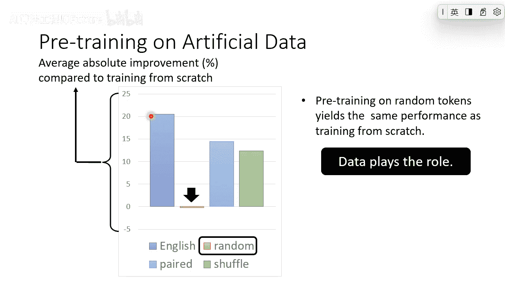

实验流程更具体一些：

1. 我们有人造的数据，用这些人造数据训练一个BERT。这个BERT看不懂人类语言，只能读这些人工生成的ID。
2. 如何用这样的BERT做人类语言任务？我们需要一个映射表，将人类语言的每个词汇随机对应到人造数据中的某个ID。例如，“the”对应ID 1，“movie”对应ID 101，“is”对应ID 3，“good”对应ID 4。这个对应关系随机生成即可。
3. 一个人类句子被转换成ID序列输入BERT。
4. 然后，例如要做情感分类（判断句子正面或负面），我们就训练一个线性分类层。这个BERT是用人造ID预训练的，但也可以被微调。

### 实验结果分析

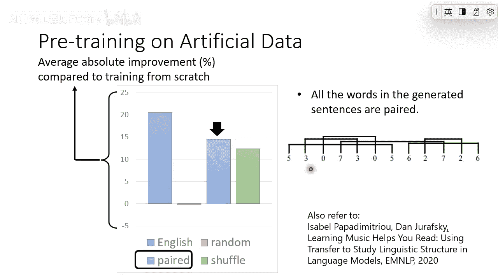

接下来我们看看实验结果。图表纵轴代表：比较有预训练的模型和没有预训练（从头训练）的模型，它们在GLUE任务上平均表现的差异。这个值越大，说明预训练越有效。

- 首先看用真实英文数据预训练的结果（上限）。相较于从头训练，有20%的进步。
- 如果使用完全随机生成的人造数据做预训练，结果发现预训练完全没有帮助。

这告诉我们：**数据本身的内容很重要**。虽然之前我们看到BERT有神奇的跨学科能力，让人怀疑是否只要做了预训练，用什么数据都行。但这个实验推翻了那个假设。如果数据是随机生成、没有规律的，那么用它预训练也没有帮助。

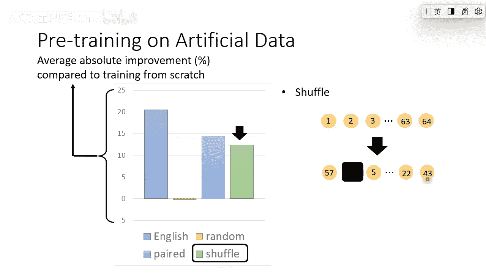

### 有效的人造数据模式

接下来我们发现，有某种特定模式的人造数据非常有用，它能带来接近15%的进步，与用英文预训练的效果相差不远。

- **成对数据**：如果生成的序列是成对出现的（例如出现一个5，后面必须再出现一个5；出现3，后面必须再出现3），用这种数据训练BERT，在人类语言任务上非常有效。这可能是因为人类语言中也存在类似的共现或依赖结构（例如“I”后面更可能接“am”）。
- **打乱序列数据**：更离奇的是，另一种称为“shuffle”的方法也能达到类似效果。具体做法是：先生成一个连续数字序列（如1到64），然后将其顺序随机打乱，在这个打乱的序列上做掩码填空题。训练在这种打乱序列上的模型，对于后续的NLP任务也很有帮助。这就很难用人类语言的特性来解释了。

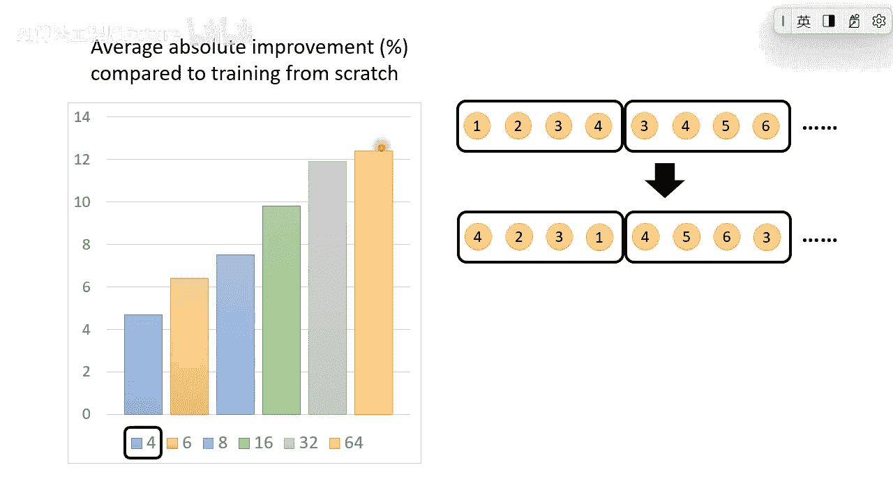

### 关键能力的探索

那么，到底是什么样的能力对解决NLP任务重要呢？我们没有非常精确的答案，但有一个发现可供参考。

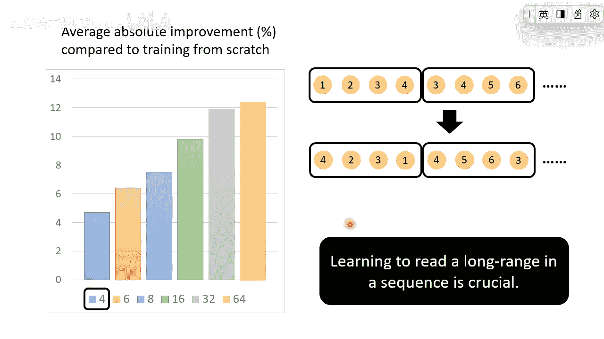

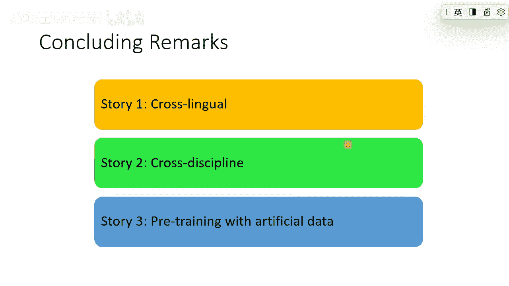

左边这个图的纵轴仍然是预训练与未预训练的绩效差异
