# 81：作业12（Homework12）说明 🚀

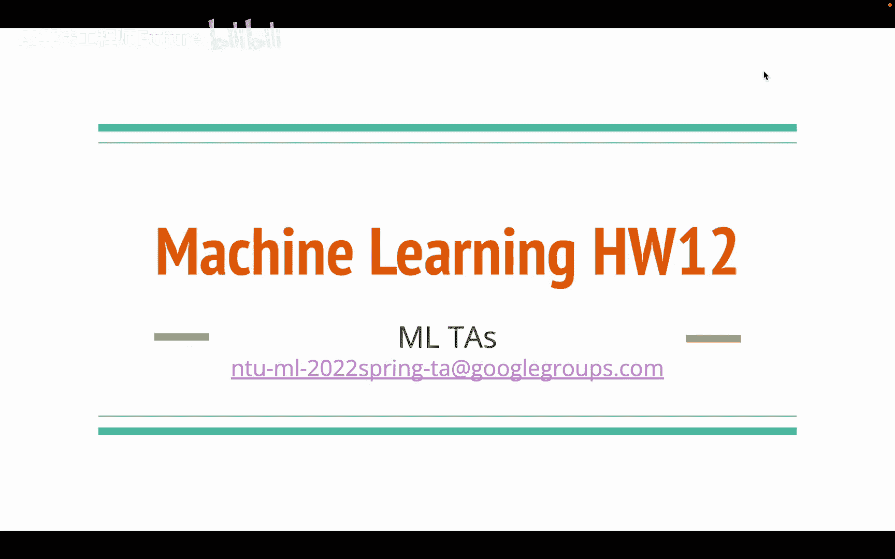

在本节课中，我们将学习李宏毅机器学习课程作业12的具体内容与要求。本次作业的主题是深度强化学习，目标是训练一个智能体在OpenAI的LunarLander环境中成功着陆。

## 概述

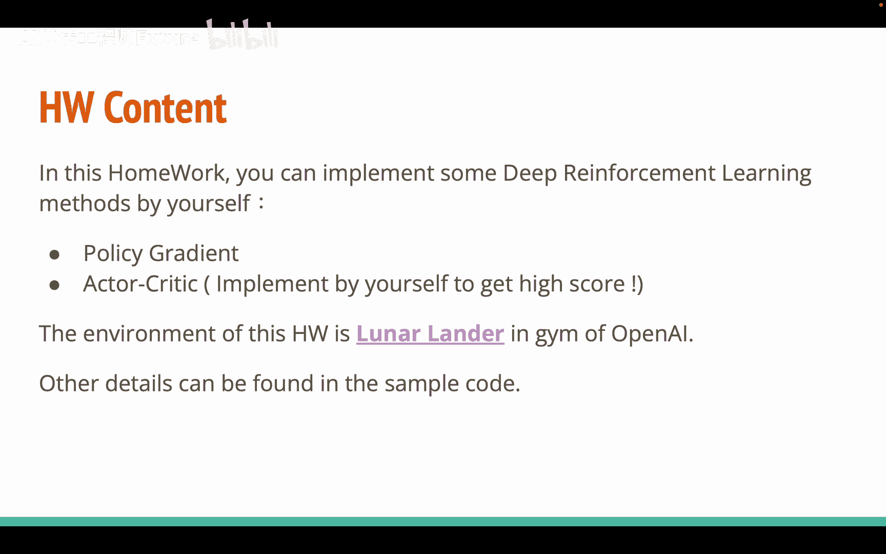

本次作业要求你实现深度强化学习算法，训练一个智能体（紫色飞船）在月球着陆器环境中，成功降落在两个黄色标志之间。你将学习策略梯度（Policy Gradient）和演员-评论家（Actor-Critic）等算法的基本原理与实现，并按要求提交代码、结果和报告。

---

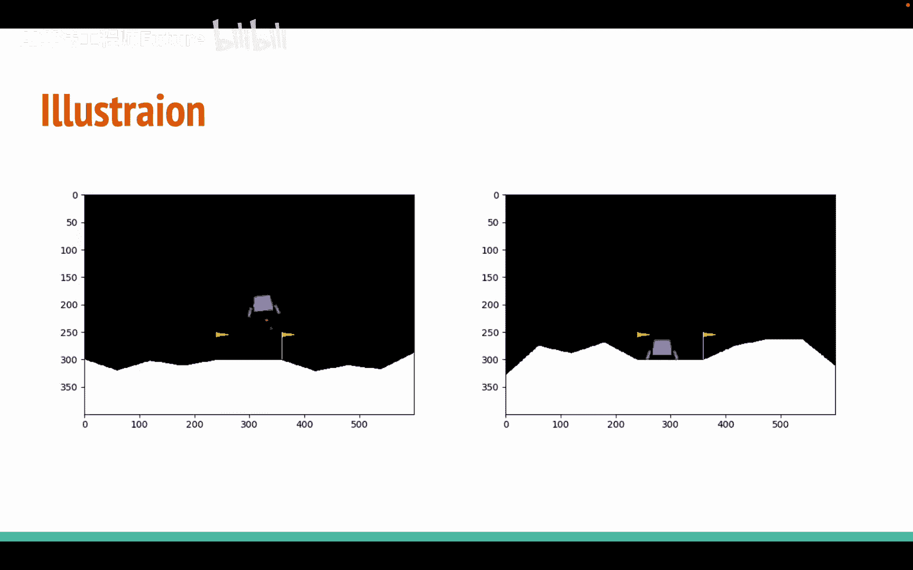

## 作业环境与目标

本次作业采用OpenAI的LunarLander环境。环境中有一个紫色飞船，目标是训练智能体控制飞船，使其成功着陆在地面的两个黄色标志之间。

---

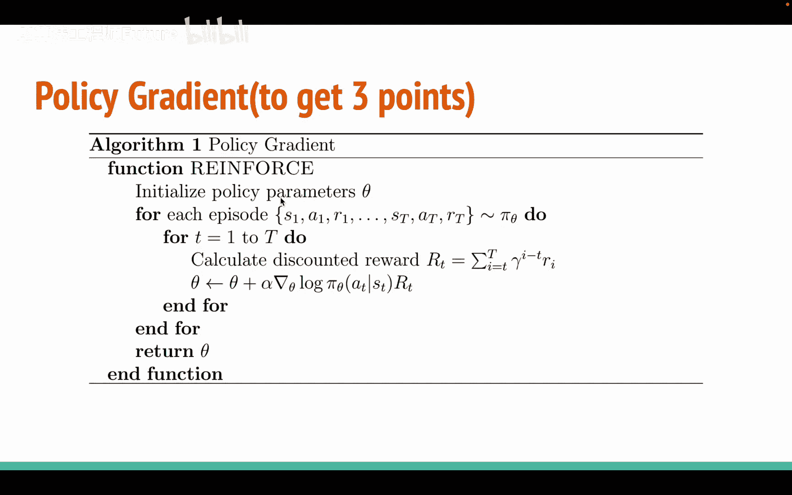

## 核心算法讲解

上一节我们介绍了作业的基本环境与目标，本节中我们来看看需要实现的核心算法。

### 策略梯度（Policy Gradient）

策略梯度是一种直接优化策略的强化学习方法。以下是其伪代码流程：

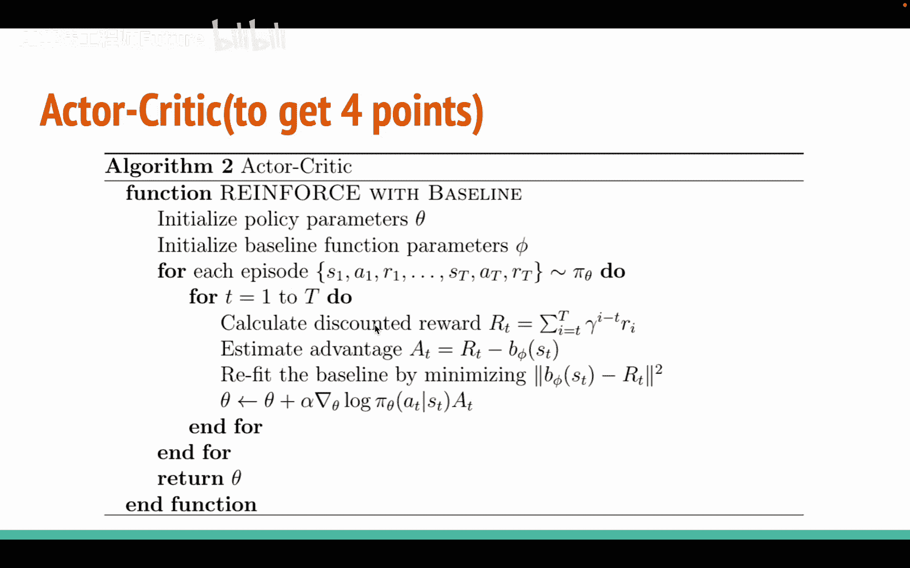

1. 初始化策略参数 **θ**。
2. 对于每一个包含 **T** 个时间步的回合（episode）：
  
  在每一个时间步 **t**，根据当前状态 **s_t**，采样一个动作 **a_t**，并得到奖励 **r_t**。
3. 对于一个回合及其每个时间步，计算折扣奖励（Discounted Reward） **G_t**：
  
  **G_t = ∑_{k=t}^{T} (γ^{k-t} * r_k)**，其中 **γ** 是折扣因子。
4. 使用状态和奖励更新策略参数 **θ**：
  
  **θ ← θ + α * ∇_θ log π_θ(a_t|s_t) * G_t**
  其中，**α** 是学习率，**∇_θ log π_θ(a_t|s_t)** 是动作对数概率的梯度。

### 演员-评论家（Actor-Critic）

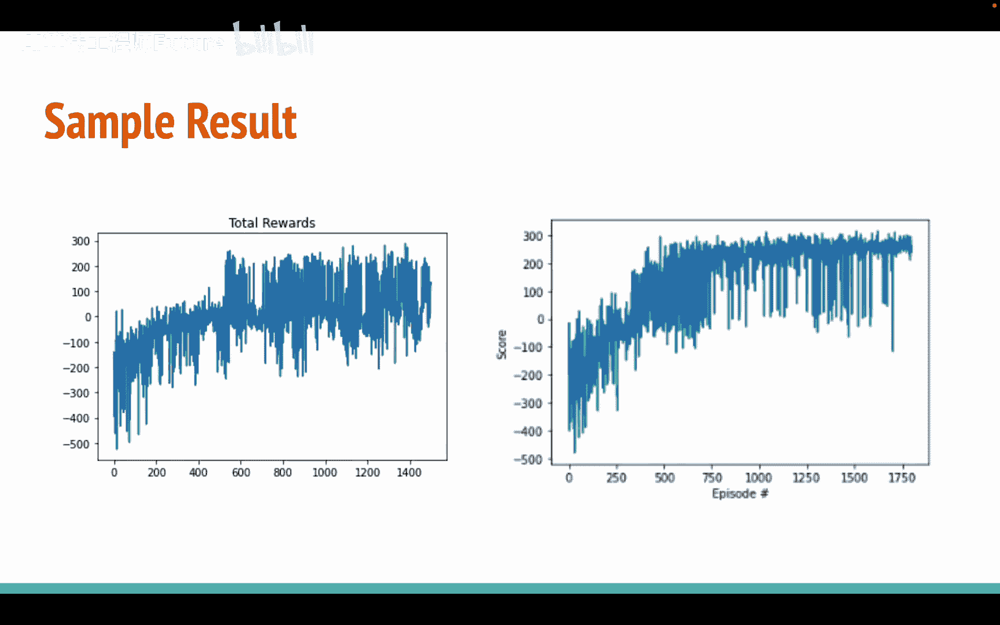

演员-评论家算法在策略梯度的基础上引入了价值函数作为基线（Baseline），以降低方差。它与策略梯度的主要区别在于优势函数（Advantage Function）的计算。

1. 算法框架与策略梯度相似。
2. 我们需要一个基线函数 **V_β(s)**，其中 **β** 是价值网络的参数。
3. 在每个时间步，我们计算优势估计 **A_t**：
  
  **A_t = G_t - V_β(s_t)**
  我们希望 **V_β(s)** 尽可能接近真实的折扣奖励 **G_t**，因此需要通过最小化两者之间的差距（如均方误差）来训练价值网络。
4. 使用计算出的优势 **A_t** 来更新策略模型（演员）：
  
  **θ ← θ + α * ∇_θ log π_θ(a_t|s_t) * A_t**

---

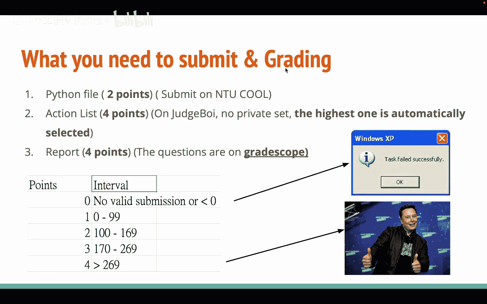

## 训练结果与评估

在训练过程中，系统会自动生成两张图表用于评估性能。

- **左图 - 总奖励（Total Reward）**：显示每个训练回合所获得奖励的总和。
- **右图 - 最终奖励（Final Reward）**：显示从环境中获得的最后一个奖励值，主要反映飞船是否成功着陆。

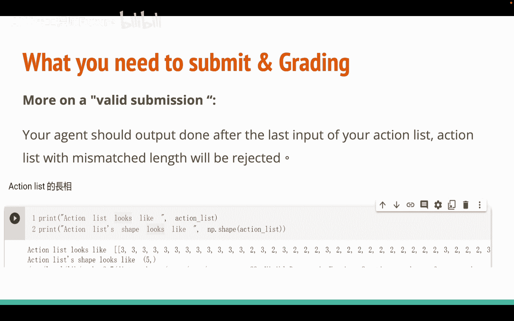

---

## 提交要求

以下是本次作业需要提交的内容清单。

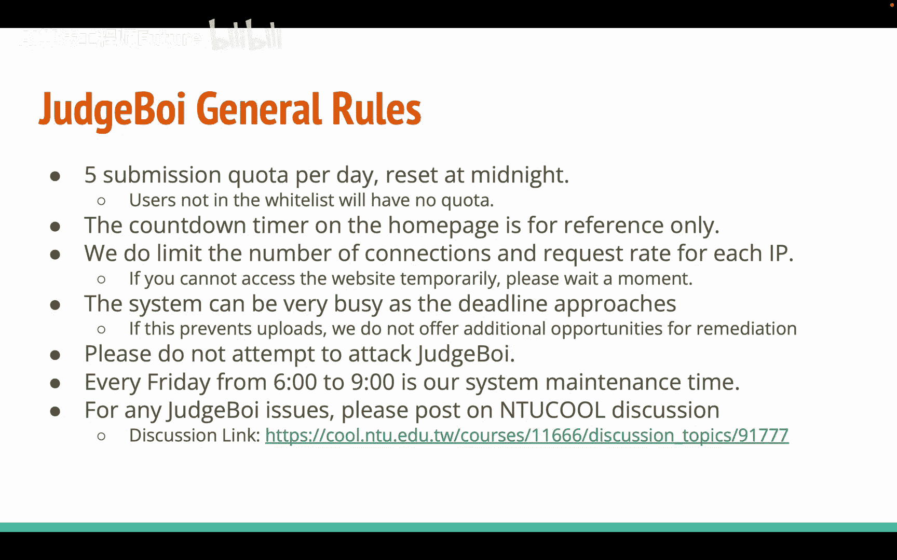

**1. Python代码文件**

- 正确提交至指定调用接口可获得2分。

**2. 动作列表（Action Sequence）**

- 此部分最高可获得4分。
- 动作列表是你的智能体与环境交互所产生的一系列动作序列，将由示例代码自动生成。
- 请注意：禁止手动修改动作列表文件，否则提交将被拒绝。
- 评分基于平均总奖励（Average Total Reward）：
  
  平均总奖励 ≥ 209.69：获得4分。
  平均总奖励为负或未提交有效结果：获得0分。
  在此区间之间：按线性比例给分。

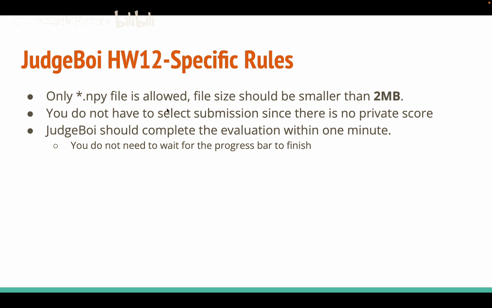

**3. 实验报告**

- 报告需要回答指定问题。

---

## 报告问题详解

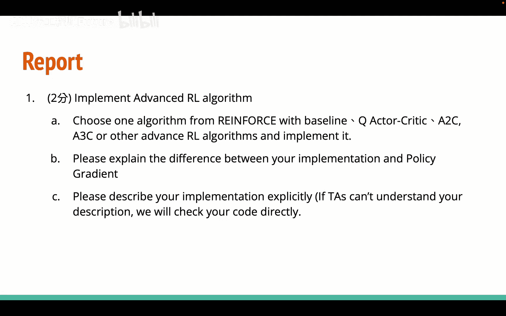

上一节列出了提交内容，本节我们详细看看报告中的问题。

**问题一：高级算法实现**

- 你需要实现一个高级强化学习算法（例如：带基线的策略梯度、演员-评论家、A2C、A3C等）。
- 在报告中需解释你的实现与基础策略梯度算法的区别。
- 请清晰描述你的实现过程。如果描述不清，评分者将直接检查代码，若发现不一致可能会扣分。

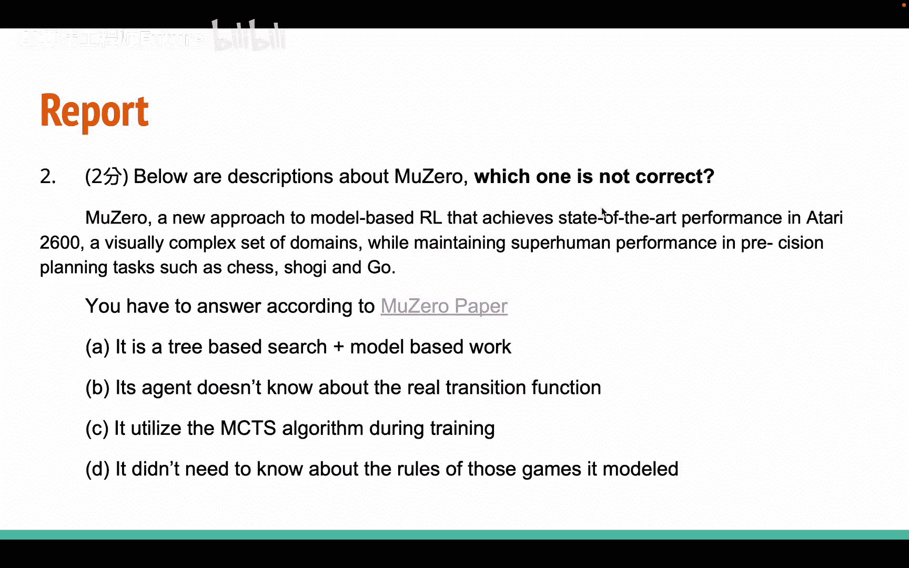

**问题二：关于MuZero的多选题**

- 提供了MuZero论文的链接，要求你阅读后回答问题。
- 请注意，此题要求选出**错误**的描述，请仔细作答。

---

## 重要注意事项

以下是完成作业时需要特别注意的事项列表。

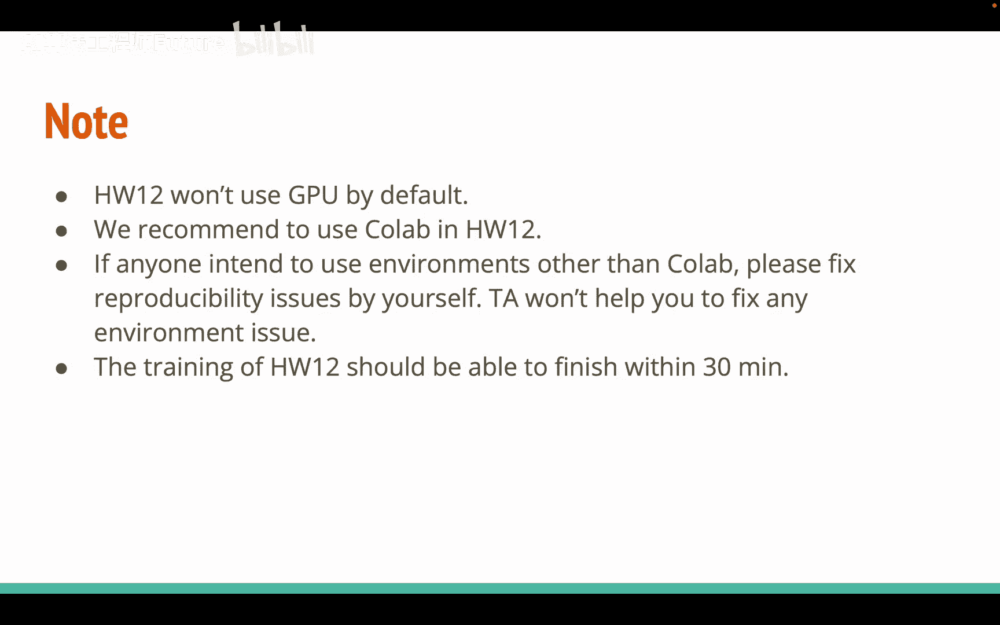

- **运行环境**：作业默认不使用GPU。建议使用Google Colab完成。若使用其他环境，需自行解决可复现性问题。只要能在评测系统上复现结果，使用任何环境均可。
- **训练时间**：作业12的训练时间应控制在30分钟以内。
- **提交格式**：需将代码等文件压缩成单个压缩包提交。请勿提交模型检查点或大型数据集。
- **结果复现**：提交的代码必须在评测系统上能复现出提交的结果，否则成绩可能计为0分。
- **加分项**：本次作业包含加分项，规则与以往作业相同。

---

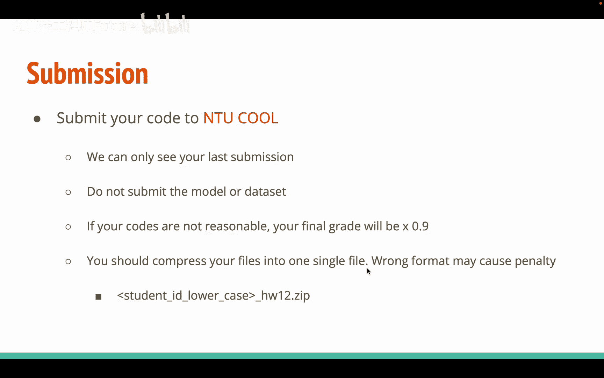

## 联系与公告

如有任何问题，可以通过以下方式联系助教：

- 发送邮件至指定邮箱，邮件标题请注明“Homework Twelve”。
- 或在课程相关在线平台直接提问。

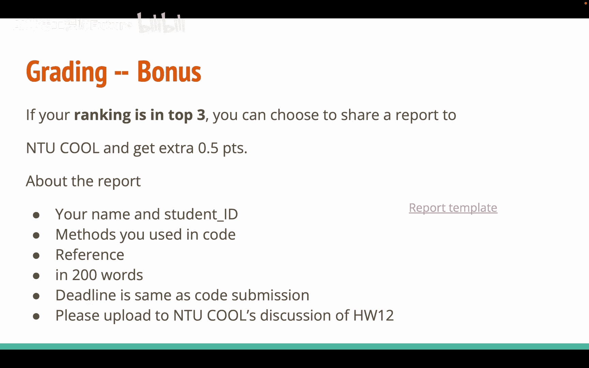

请留意课程页面发布的官方公告，以获取作业的确切起止时间等信息。

---

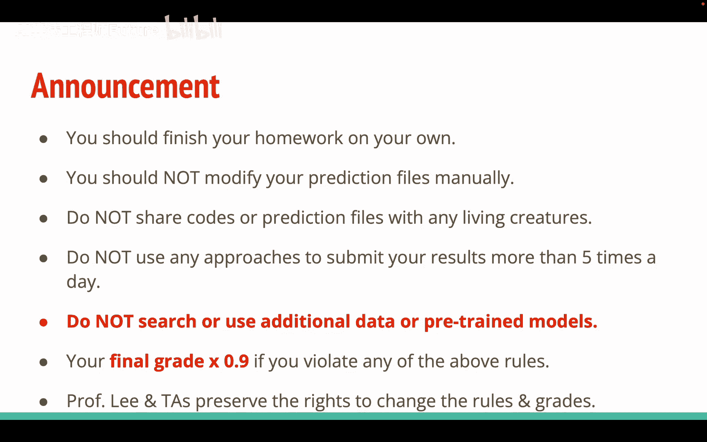

## 总结

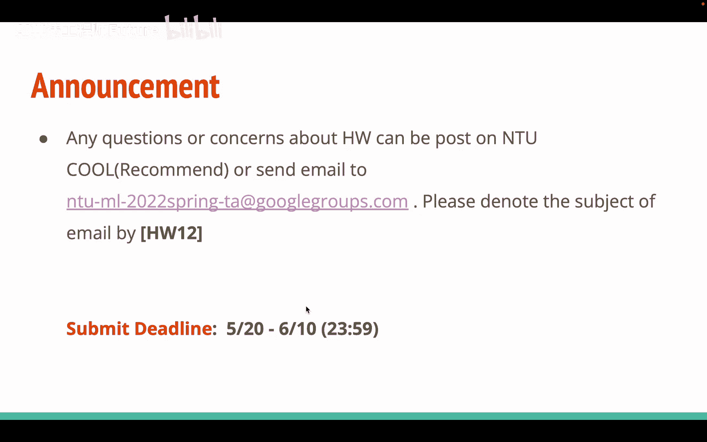

本节课中，我们一起学习了作业12的完整说明。我们了解了在LunarLander环境中应用强化学习的目标，学习了策略梯度和演员-评论家算法的核心思想与更新公式，明确了代码、动作列表和报告三部分的提交要求与评分标准，并注意到了完成作业时的各项重要细节。现在，你可以开始着手实现你的强化学习智能体了。
