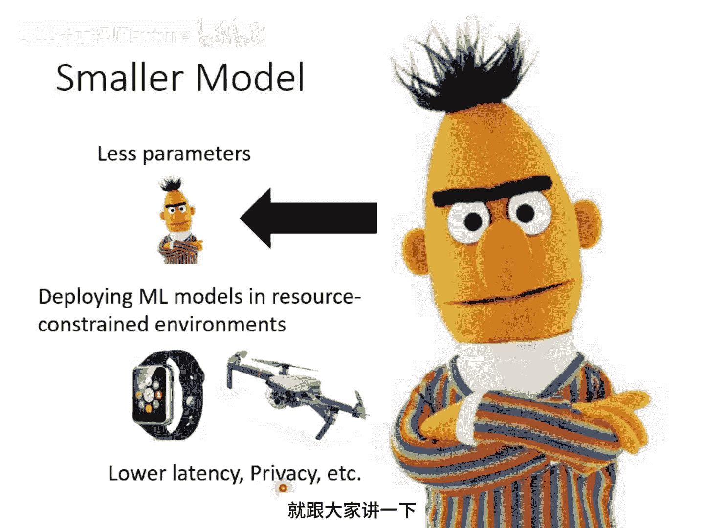
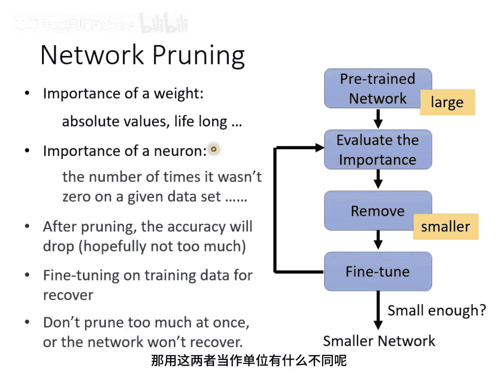
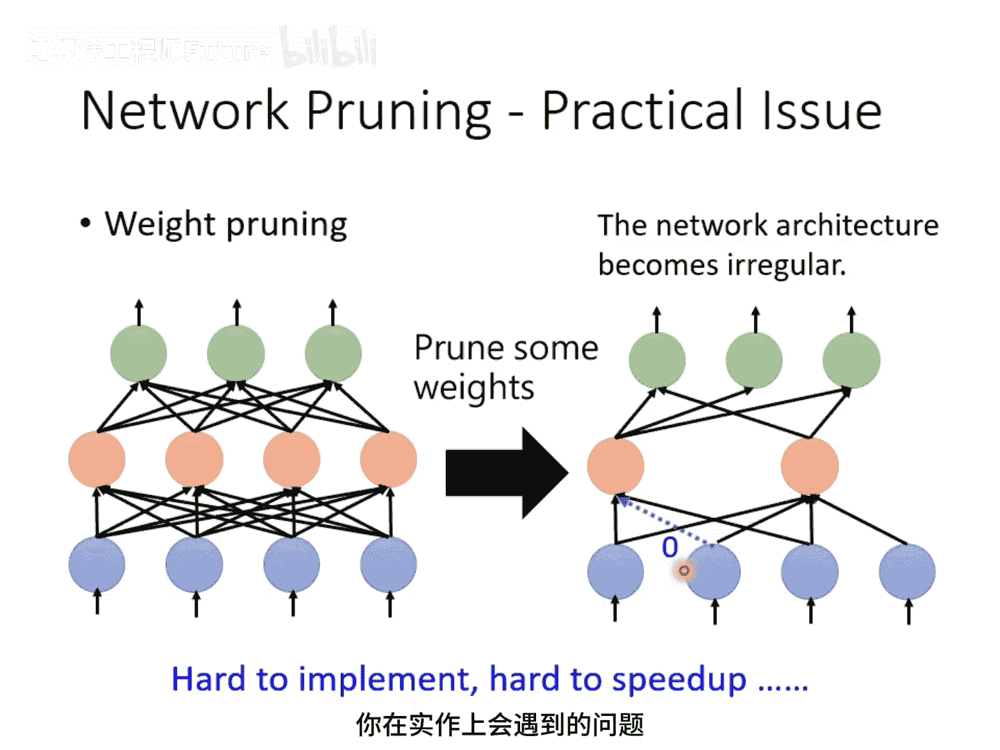
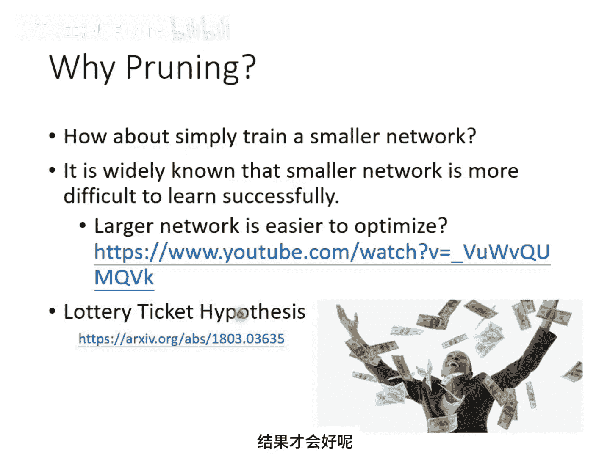
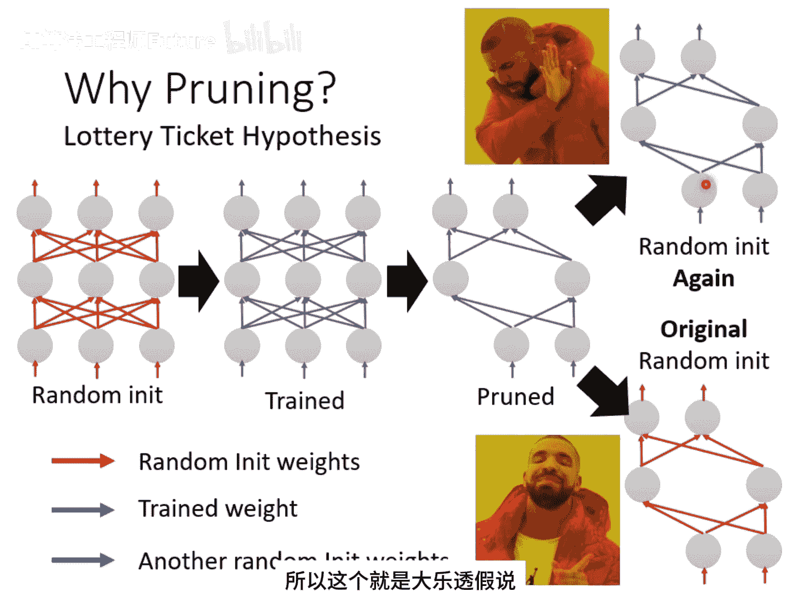
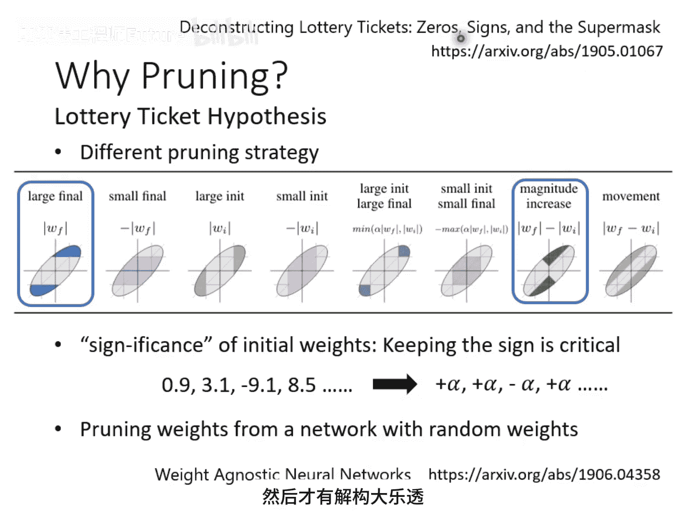
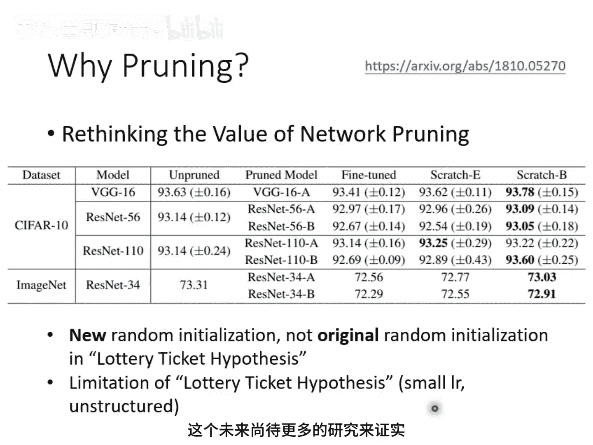

# 82：神经网络压缩（全）—— 神经网络剪枝与大乐透假说 🧠✂️

在本节课中，我们将学习神经网络压缩（Network Compression）技术，特别是神经网络剪枝（Pruning）方法。我们将探讨为何需要压缩模型、剪枝的基本原理与步骤，并分析著名的“大乐透假说”（Lottery Ticket Hypothesis）及其争议。

---

## 概述：为何需要压缩神经网络？

在之前的课程中，我们已经见识了许多庞大的模型，例如BERT或GPT。本节课我们将探讨能否将这些庞大的模型缩小，即用更少的参数达到相近的性能，这就是神经网络压缩的目标。

我们之所以关注模型压缩，是因为很多时候需要在资源受限的环境下部署模型。例如，在智能手表或无人机等物联网设备上，内存和计算能力有限。如果模型过于庞大，这些设备可能无法运行。

有人可能会问，为何不将数据传到云端计算后再传回结果？主要原因有两个：延迟（Latency）和隐私（Privacy）。对于需要实时响应的应用（如自动驾驶传感器），云端计算的延迟可能无法接受。此外，将数据传到云端可能涉及隐私泄露风险。因此，在设备端直接进行运算和决策是更好的选择。

---

## 神经网络剪枝（Pruning）的基本概念

上一节我们介绍了模型压缩的必要性，本节中我们来看看第一种压缩技术：神经网络剪枝。

剪枝，顾名思义，就是修剪掉神经网络中一些不重要的参数。俗话说“树大必有枯枝”，一个庞大的神经网络中有许多参数，但并非所有参数都在发挥作用。许多参数可能只是“划水”，没有实际贡献。这些无效的参数只会占用空间和浪费计算资源，因此可以考虑将它们移除。

神经网络剪枝的基本思想是：从一个大型网络中找出并移除那些无用的参数。这类似于人脑发育的过程：婴儿出生时神经元连接很少，六岁时连接大量增加，但随着年龄增长，一些连接会逐渐消失。神经网络剪枝也有类似的效果。

早在20世纪90年代，就有一篇名为“Optimal Brain Damage”的论文提出了剪枝的概念。它将剪除权重视为一种“脑损伤”，而“最优”意味着要找到对网络损伤最小的剪枝方法。

---

## 剪枝的基本流程

以下是进行神经网络剪枝的基本步骤框架：

1. **训练一个大型网络**：首先，训练一个庞大的神经网络。
2. **评估参数重要性**：评估网络中每个参数或神经元的重要性。判断参数重要性的简单方法是看其绝对值大小，绝对值越大通常影响越大。也可以借鉴终身学习（Lifelong Learning）中计算参数重要性的方法。
3. **移除不重要部分**：将不重要的参数或神经元从模型中移除，得到一个较小的网络。
4. **微调网络**：剪枝后，模型的性能通常会下降。因此，需要对剩余的参数进行微调（Fine-tuning），以恢复部分性能。
5. **迭代过程**：上述评估、剪枝、微调的步骤可以反复进行多次。实验表明，一次性剪除大量参数可能对网络造成不可逆的损伤，因此采用迭代方式效果更好。

---

## 以参数 vs. 神经元为单位的剪枝

上一节我们介绍了剪枝的流程，本节中我们来看看剪枝时选择不同单位（参数或神经元）会有什么差异。

在实践上，选择不同的剪枝单位会有显著区别。

**以参数（Weight）为单位进行剪枝**：

- 剪枝后，网络结构会变得不规则。例如，某个神经元的输入或输出连接数可能与其他神经元不同。
- 这种不规则结构在实现上非常困难。主流框架（如PyTorch）通常要求每一层的输入输出维度是固定的。
- 即使用技巧实现，也不利于GPU加速，因为GPU擅长处理规则的矩阵运算。
- 因此，实践中常将剪掉的权重值设为零，而非真正移除。但这并没有真正减少模型大小，只是“自嗨”式的压缩。

**以神经元（Neuron）为单位进行剪枝**：

- 剪枝后，网络架构仍然是规则的。你只需要调整每一层的神经元数量即可。
- 这种方法易于实现，也便于利用GPU进行加速。

文献中的实验也证实了这一点。实验显示，即使剪除了95%以上的参数（权重剪枝），模型的推理速度也几乎没有提升，甚至可能变慢。这是因为不规则网络无法有效利用硬件加速。因此，**以神经元为单位的剪枝通常是更实用的选择**。

---

## 大乐透假说（Lottery Ticket Hypothesis）

一个自然的问题是：既然先训练大网络再剪枝能得到一个小网络，为什么不直接训练一个小网络呢？普遍的答案是：大网络通常更容易训练成功。直接训练小网络往往无法达到剪枝后小网络的性能。

这引出了一个著名的假说——**大乐透假说**。它试图解释为何大网络更好训练。

**假说核心思想**：  

训练神经网络就像抽乐透，结果具有随机性。初始参数好，结果就好；初始参数差，结果就差。如何提高“中奖率”？就是买更多彩票（即拥有更多参数）。  

一个大网络可以看作是许多小网络（子网络）的集合。训练大网络相当于同时训练许多子网络。只要其中有一个子网络成功“中奖”（即能被成功训练），整个大网络就成功了。网络越大，包含的子网络越多，成功训练的概率就越高。

**实验验证**：  

实验设计如下：

1. 随机初始化并训练一个大网络，得到一组参数（紫色）。
2. 对该网络进行剪枝，得到一个小网络及其参数（红色）。
3. 如果直接创建一个结构相同、但**重新随机初始化**的小网络（绿色）并训练，效果会很差。
4. 但如果创建的小网络，其初始化参数**继承自**剪枝后保留的那些红色参数（即大网络中“幸运”的子网络参数），则能训练出好效果。

这说明，大网络中确实存在一些“幸运”的子网络初始化配置。剪枝过程恰好保留了这些“中奖彩票”。而随机初始化则很难再次抽中同样的好运气。

---

## 对假说的延伸研究与争议

大乐透假说非常知名，但其正确性并非没有争议。

**延伸研究**：  

一篇名为“Deconstructing Lottery Tickets”的论文进一步研究后发现：

1. 参数训练前后的**绝对值变化大小**与剪枝效果相关。
2. 初始化参数的**正负号**比其具体数值更重要。只要保持剪枝后参数的正负号不变，即使将其值替换为固定的常数（如+α/-α），模型也能成功训练。
3. 甚至存在一种极端情况：在一个随机初始化的大网络中，可能已经存在一个无需训练、剪枝后直接就能有效工作的子网络。

**争议与反驳**：  

另一篇同时期（ICLR 2019）的论文“Rethinking the Value of Network Pruning”提出了不同观点。其实验表明：

- 如果**增加训练轮数（Epoch）**，直接训练得到的小网络性能可以媲美甚至超过“训练大网络+剪枝”得到的小网络。
- 大乐透假说观察到的现象，可能只在**学习率较小**和**以权重为单位进行剪枝**的特定设置下才显著。

因此，关于大乐透假说的有效性和普适性，目前仍是一个开放的研究问题。

---

## 总结

本节课我们一起学习了神经网络压缩的重要性及其首个关键技术——**剪枝（Pruning）**。我们了解了剪枝的基本流程、以不同单位（参数/神经元）剪枝的实践差异，并深入探讨了试图解释“大网络优势”的**大乐透假说**及其相关的实验研究与争议。

核心要点总结：

- **压缩目的**：为了在资源受限的边缘设备上部署模型，并兼顾低延迟与隐私保护。
- **剪枝步骤**：训练大网络 → 评估重要性 → 剪枝 → 微调 → 迭代。
- **实践建议**：以**神经元为单位**的剪枝更利于工程实现与加速。
- **大乐透假说**：认为大网络包含许多子网络，其训练成功类似于“抽中彩票”，剪枝保留了“中奖彩票”。但这仍是假说，存在不同学术观点。

通过学习，你应该对如何缩减模型规模有了初步认识，并了解到模型优化不仅是技术问题，也伴随着有趣的理论探索。
