# 88：机器终身学习 (Life Long Learning, LL) (一) - 为什么今日的人工智能无法成为天网？灾难性遗忘 (Catastrophic Forgetting) 🤖🧠

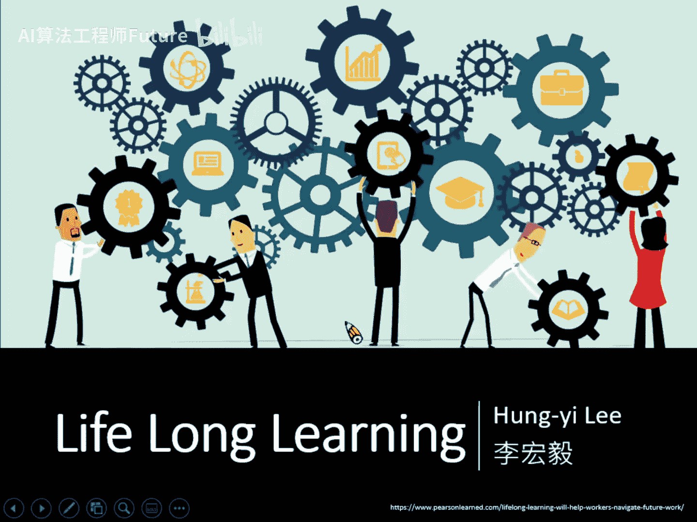

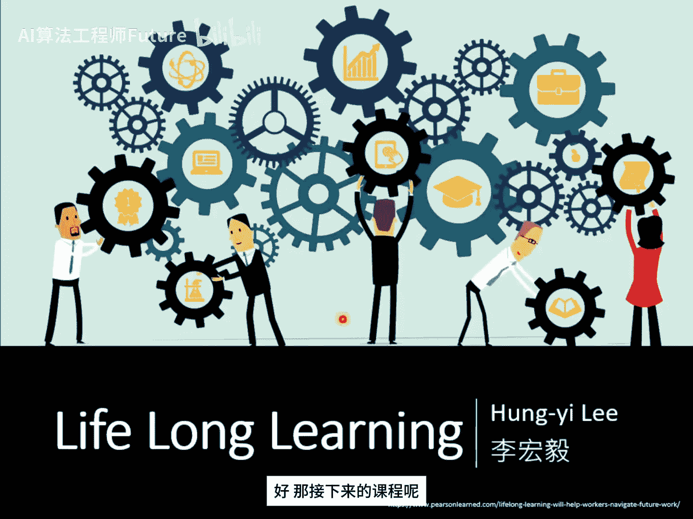

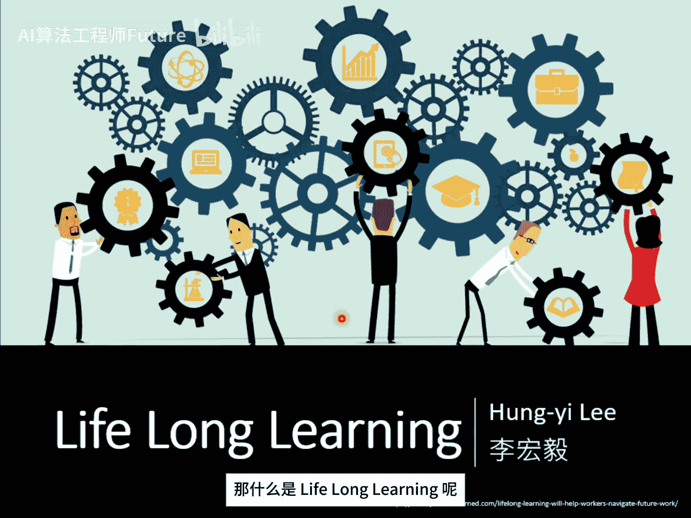

在本节课中，我们将要学习机器终身学习的基本概念，探讨为什么当前的人工智能系统难以像人类一样持续学习新技能而不遗忘旧知识，并深入理解“灾难性遗忘”这一核心挑战。

## 概述

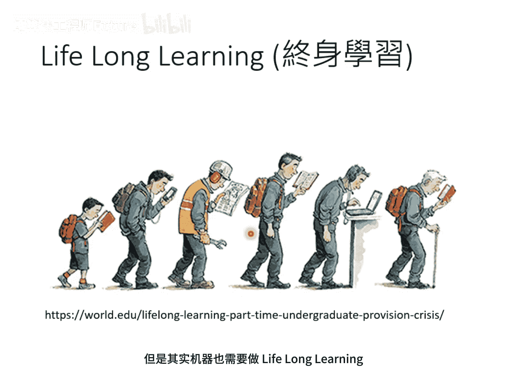

机器终身学习，或称持续学习，指的是让机器学习系统能够像人类一样，在一生中持续学习一系列任务，并且在学习新任务时不会忘记旧任务的知识。这是实现通用人工智能的关键一步。

## 什么是终身学习？

终身学习从字面翻译来看，指的是“活到老，学到老”。如果你用“lifelong learning”作为关键词搜索，通常找到的是关于人类如何终身学习的内容。

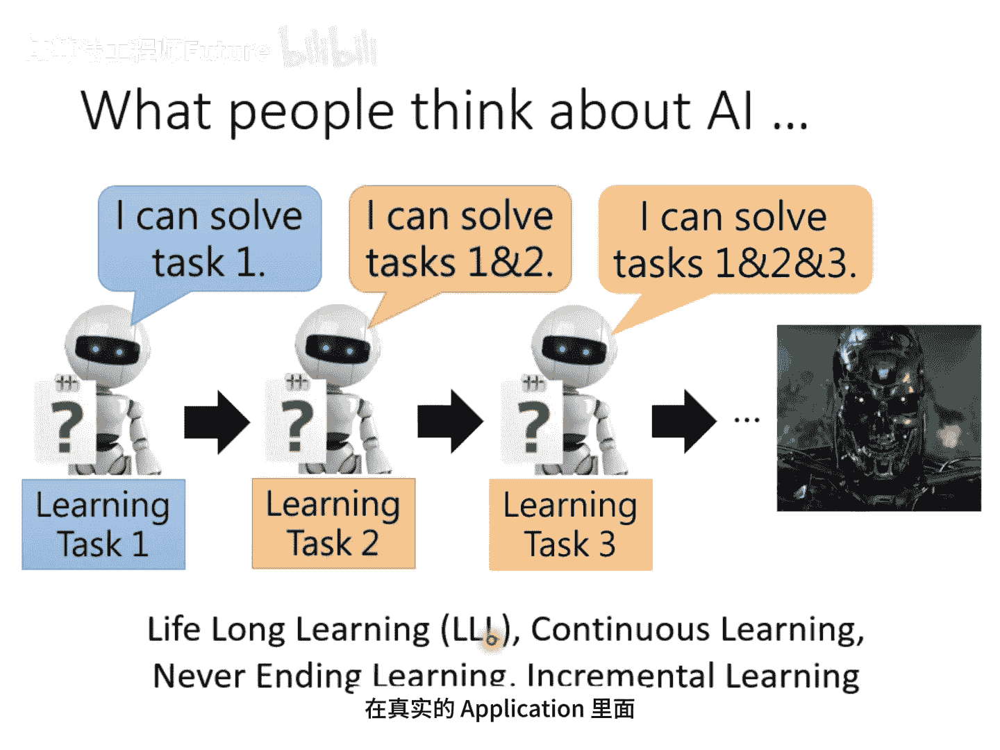

但是，机器也需要进行终身学习。这非常接近人类对人工智能的想象：我们先教机器做一件事，比如语音识别；然后再教它第二件事，比如图像识别；接着教它第三件事，比如翻译。我们不断教它新技能，最终它就能掌握无数技能。

这个构想就是终身学习的目标。终身学习常缩写为LLL。它也有很多其他名称，例如持续学习或永不停止学习。一个不那么时髦的名字是增量学习。

你可能会想，终身学习这个目标太过远大，我又不做天网，它对我有什么意义呢？

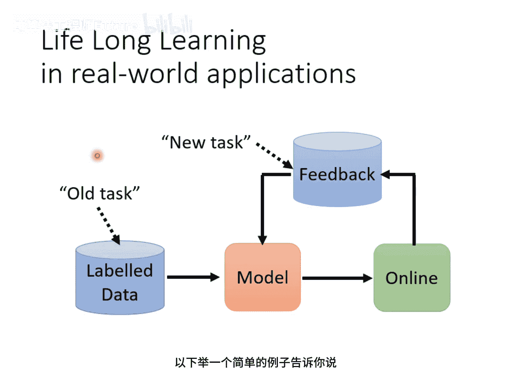

## 终身学习的实际应用

在真实的应用场景中，终身学习也是派得上用场的。举例来说，今天你在实验室里开发出一个模型，用收集的数据训练它。模型上线后，它会获取来自用户的反馈。我们希望收集数据这件事能形成一个循环：模型上线后收集新数据，新数据让我们更新模型参数；参数更新后又能收集更多数据，如此不断循环，最终系统会越来越厉害。

你可以把旧数据看作是过去的任务，把来自用户反馈的新数据看作是新的任务。因此，这种情境也可以看作是一个终身学习问题：机器不断在线收集数据，并用这些数据更新模型。

## 终身学习的难点

终身学习有什么难点呢？不就是让机器不断看新数据，不断更新参数就做到了吗？为什么终身学习会是一个值得研究的问题呢？

以下举一个简单的例子来说明终身学习的难点出在什么地方。

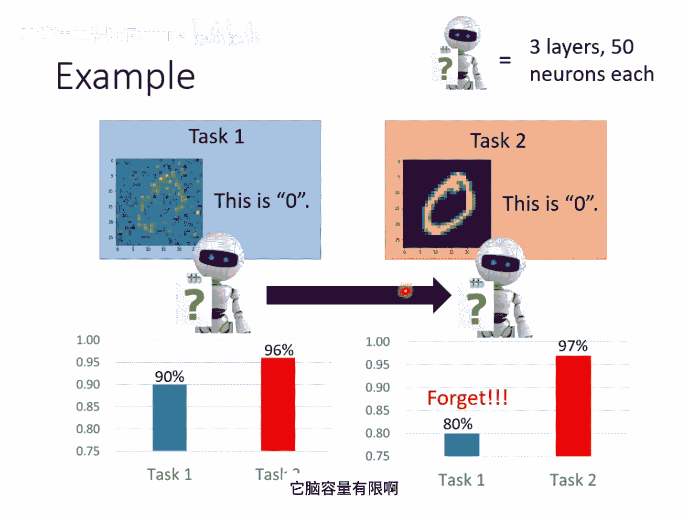

## 灾难性遗忘的实例

假设我们现在有两个任务。第一个任务是做手写数字识别，但输入的图片带有大量噪声。第二个任务也是手写数字识别，但输入的是没有噪声的清晰图片。我们要让机器学会这两个任务。

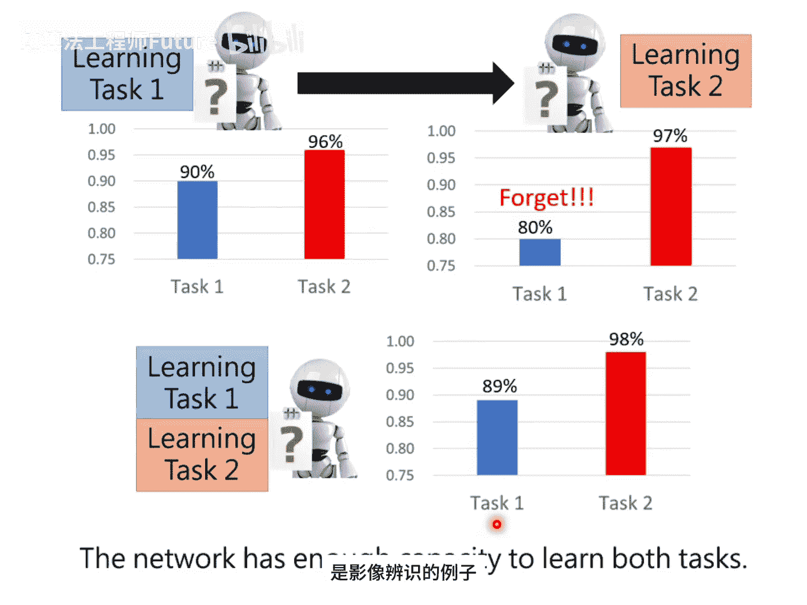

有人可能会说，这不算是两个任务，而是同一个任务的不同领域。这样想也没问题。实际上，在终身学习的文献中，所谓的不同任务通常指的就是这种等级，更像是不同领域，而不是截然不同的任务。

我训练了一个非常简单的神经网络，它只有三层，每层50个神经元。先在任务一上训练。训练完后，任务一的正确率达到90%。即使还没看过任务二的数据，模型在任务二上也达到了96%的正确率，迁移效果非常好。

然后，我们让同一个模型继续去学习任务二。注意，是同一个模型，用任务一更新后的参数作为起点，继续用任务二的数据来更新。

结果如下：任务二的正确率变得更高了，从96%提升到97%。但糟糕的是，机器忘记了怎么做任务一：任务一的正确率从90%暴跌到只有80%。它忘记了之前已经学会的技能。

有人看到这里可能会觉得，这有什么奇怪的呢？这个网络很小，脑容量有限，学完新任务当然就忘了旧任务。

## 对比实验：同时学习

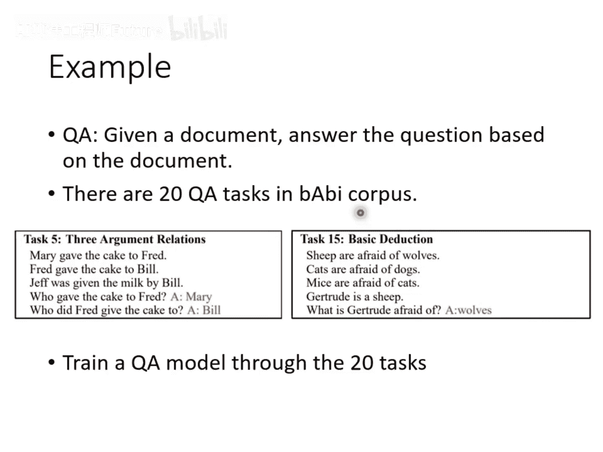

但是，如果我告诉你另一个实验呢？假设我们把任务一和任务二的数据直接混合在一起，同时训练这个网络，会发生什么事？

我们得到的结果是这样的：任务一可以得到89%的正确率，任务二可以得到98%的正确率。也就是说，对这个网络而言，它完全有能力同时学好任务一和任务二。虽然它每层只有50个神经元，但这已经足够了。

然而，如果不是同时学，而是先学任务一再学任务二，它在学任务二的时候，就会忘记任务一学过的东西。它有足够的能力把两个任务都学好，但当你让它依序学习时，它却无法记住旧的任务。

## 另一个例子：问答任务

我刚才举的是图像识别的例子。接下来我再举一个自然语言处理的例子，说明刚才看到的状况不是一个特例，而是一个非常普遍的现象。

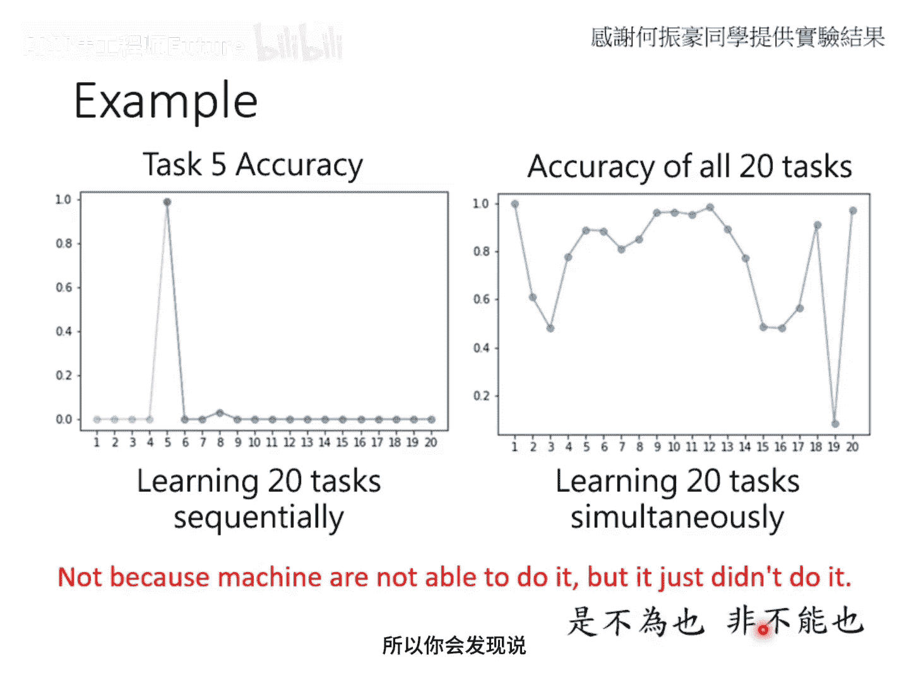

这个例子是问答任务。我们使用一个非常简单的QA数据集，叫做BABI。它包含20个用固定模板生成的简单问答任务。

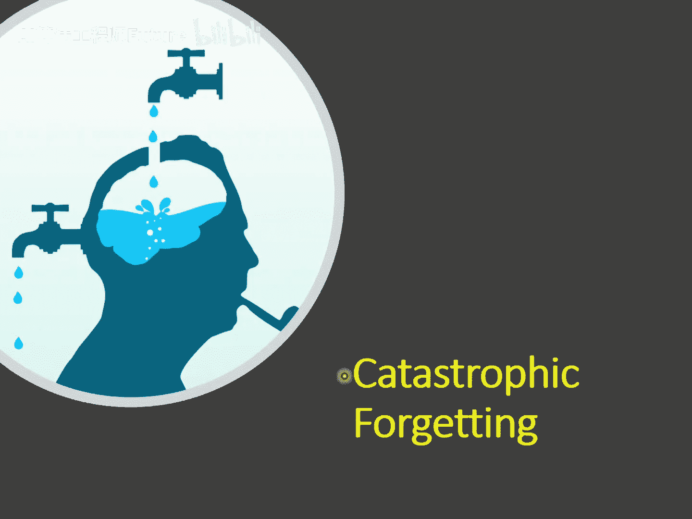

我们让机器依序学习这20个任务，看看它能否都学会。我们观察任务五的正确率变化。

纵轴是任务五的正确率，横轴是依序学习20个任务的过程。先让机器学任务一到四，此时任务五正确率为0（这很正常，因为它还没学）。学完任务五后，正确率直接冲到100%。但是，当我们继续学习任务六、任务七……时，任务五的正确率暴跌至0%。机器只要一学新任务，旧任务马上就忘得精光。

你可能会以为，是不是机器就是没有能力学好多个任务？其实不是的。

如果我们把20个任务的资料全部混合在一起，让机器同时学习，结果会怎样呢？右边这张图显示，机器可以同时学会多个任务，很多任务都能达到很高的正确率。

这个实验告诉我们：机器明明有能力学多个任务，但当你让它依序学一个一个任务时，它就是不肯把多个任务都学会。它是“非不能也，是不为也”。

## 灾难性遗忘

当机器依序学习多个任务时，它就像一个脑袋有洞的人，新的任务进来，旧的东西就掉出去了。它永远学不会多个技能。

这个状况叫做**灾难性遗忘**。在“遗忘”前面特别加上“灾难性”这个形容词，因为机器的遗忘程度太过分了，基本上是学不会新技能，所以这种遗忘是灾难性的。

## 为什么不把所有数据混在一起训练？

讲到这，你可能会有一个问题：刚才不是看到只要把多个任务的资料统统混在一起，机器就可以学会多个任务了吗？这种把所有任务数据混在一起训练的方法叫做**多任务学习**。那终身学习还有什么好研究的？

但是你想一想，假设现在要让机器学习第1000个任务。为了避免遗忘前面999个任务，你必须把前面999个任务的数据全部拿出来，和第1000个任务的数据混在一起进行训练。这在实践上可能有问题：

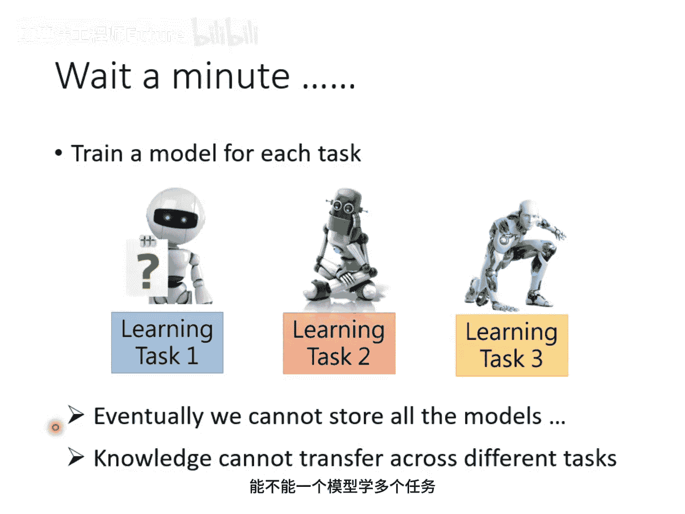

1. **存储问题**：机器需要把它一辈子看过的所有数据都存储下来，你可能没有那么大空间。
2. **计算问题**：把1000个任务的数据全部混在一起，训练数据量太大，训练时间会非常长。

如果机器一定要做多任务学习才能掌握多个技能，那就好比一个人要学一门新课，必须把他这辈子所有学过的教材全部重读一遍才行。这显然非常没有效率。

在文献上，通常把多任务学习看作是终身学习的**性能上限**。虽然当任务多时不切实际，但它给出了机器理论上能达到的最好结果。在研究终身学习时，往往会先跑一个多任务学习的结果作为上限，再比较你的终身学习方法能逼近这个上限多少。

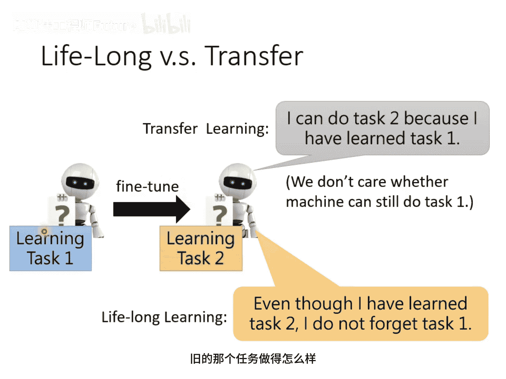

## 为什么不每个任务单独训练一个模型？

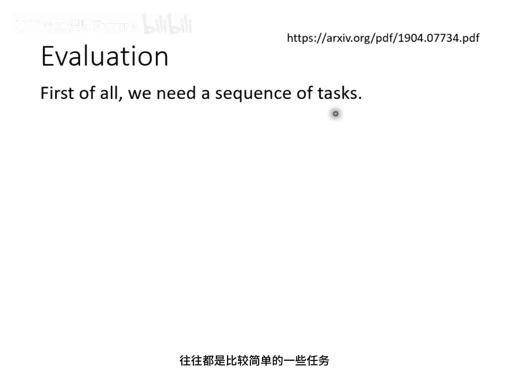

为什么不执着于终身学习，而是每个任务单独训练一个模型呢？这样确实没有灾难性遗忘的问题。

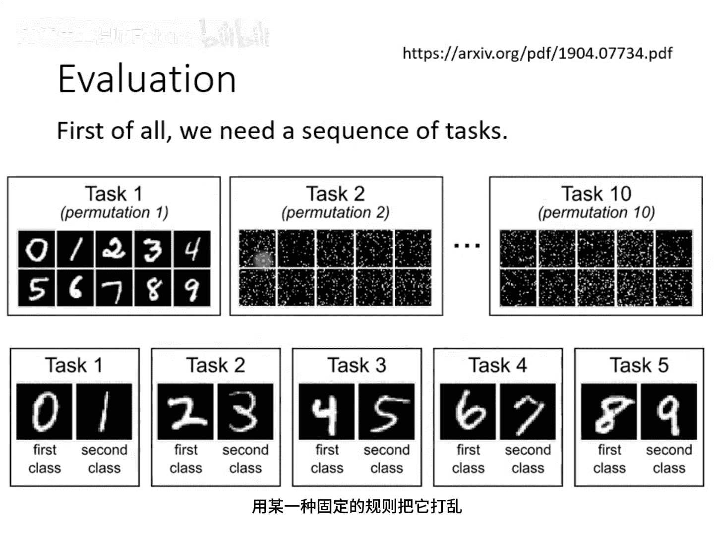

但是，我们会遇到其他问题：

1. **存储开销**：如果要学的技能非常多（比如上亿个），每个技能一个模型，存储开销巨大。
2. **知识无法共享**：不同任务的模型之间知识无法互通，无法从其他任务中汲取单一任务学不到的资讯。
3. **不符合智能本质**：对人类来说，我们只有一个大脑，却可以学会多种任务。为什么机器不能做到同样的事情呢？这就是终身学习想要探讨的问题。

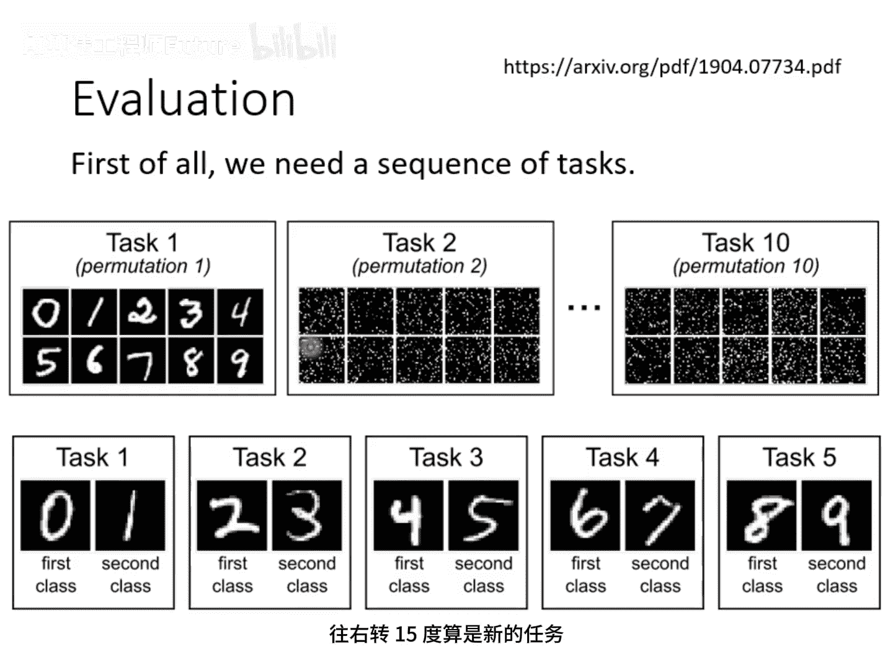

## 终身学习 vs. 迁移学习

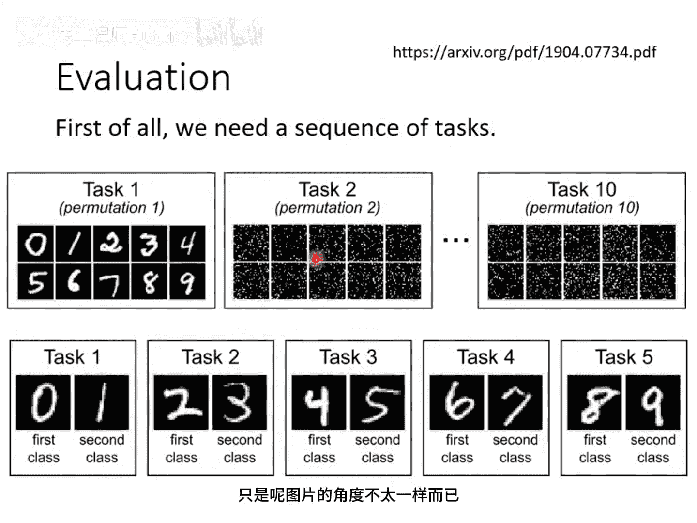

有的同学可能会说，这听起来跟迁移学习挺像的。迁移学习也是让机器在任务一上学习，希望学到的技能能迁移到任务二。

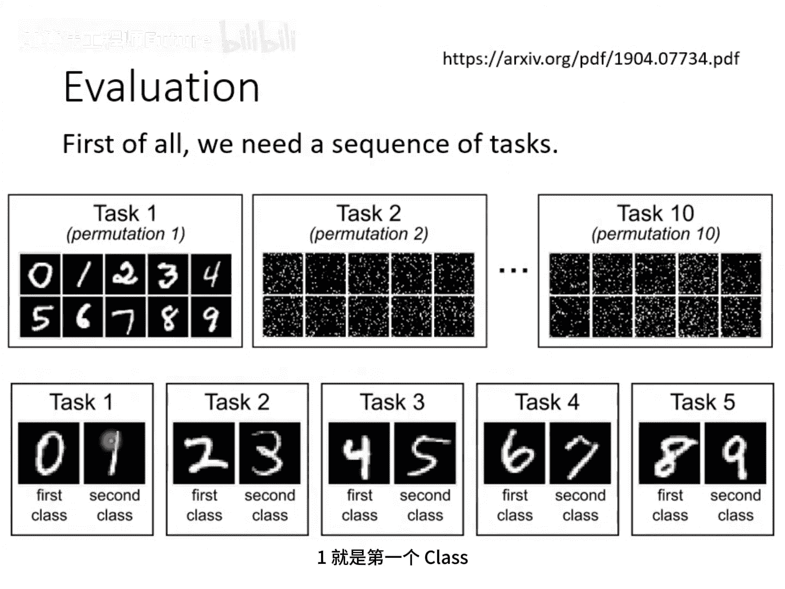

虽然两者都涉及多个任务，但关注点不同：

- **迁移学习**在意的是：机器在第一个任务上学到的技能，对第二个任务有没有帮助。**只关注新任务的表现**。
- **终身学习**在意的是：当机器学完第二个任务时，回过头去**第一个任务还能不能解**。**关注旧任务的表现**。

## 如何评估终身学习系统？

在讲解终身学习的技术之前，我们先了解一下如何评估一个终身学习系统做得好不好。

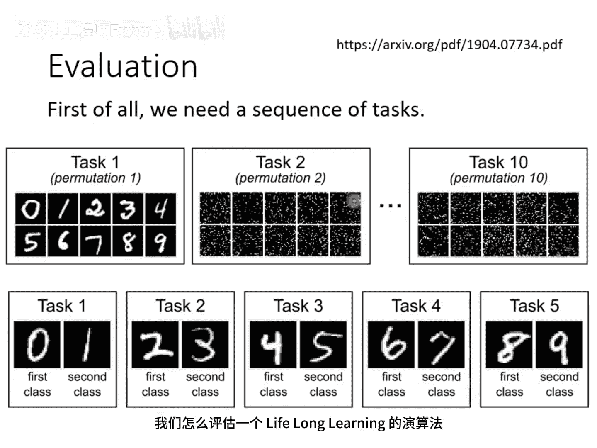

首先，你需要定义一系列任务让机器依序学习。在文献中，这些任务通常比较简单，例如：

- 任务一：识别正常的手写数字。
- 任务二：识别经过特定规则打乱像素后的手写数字。
- 任务三：识别旋转了15度的手写数字。
- 或者，任务一：区分数字0和1；任务二：区分数字2和3；以此类推。

评估方法如下：

你有一系列任务（假设有T个）。你有一个随机初始化的模型，先在所有任务的测试集上测试，得到T个初始正确率。

然后，让模型依序学习：

1. 学完任务一后，在所有T个任务上测试一次正确率。
2. 学完任务二后，再次在所有T个任务上测试。
3. ...
4. 学完最后一个任务T后，最后测试一次。

你会得到一个表格，其中元素 R_ij 表示：**训练完第 i 个任务后，在第 j 个任务测试集上的正确率**。

根据这个表格，有几种常见的评估指标：

1. **最终平均准确率**：最常用的指标。计算模型学完所有任务后（即表格的最后一行），在所有任务上正确率的平均值。这个值综合反映了模型最终保留了多少旧知识。
  
  `Final Average Accuracy = (1/T) * Σ_{j=1 to T} R_Tj`
2. **逆向迁移**：衡量学习新任务对旧任务的影响。通常计算模型在学完所有任务后，在某个旧任务上的表现，相比刚学完该任务时的表现，下降了多少。
  
  `Backward Transfer (对任务j) = R_Tj - R_jj`
  这个值通常是负的（因为会遗忘）。如果一个方法能使其为正，说明学新任务反而让旧任务做得更好了，那就非常厉害。
3. **正向迁移**：衡量在学习某个任务之前，从其他任务中提前学到了多少。计算在还未学习任务j，但学完了其他所有任务时，在任务j上的表现，相比完全没学习任何任务时的提升。
  
  `Forward Transfer (对任务j) = R_{T-1, j} - R_{0, j}`
  这个指标通常不是终身学习的关注重点。

## 总结

本节课中，我们一起学习了机器终身学习的基本概念。我们了解到，理想的AI应该能够像人类一样持续学习新技能而不遗忘旧知识。然而，当前的机器学习模型在依序学习多个任务时，会遭遇“灾难性遗忘”问题：学会新任务的同时，几乎完全忘记了旧任务。

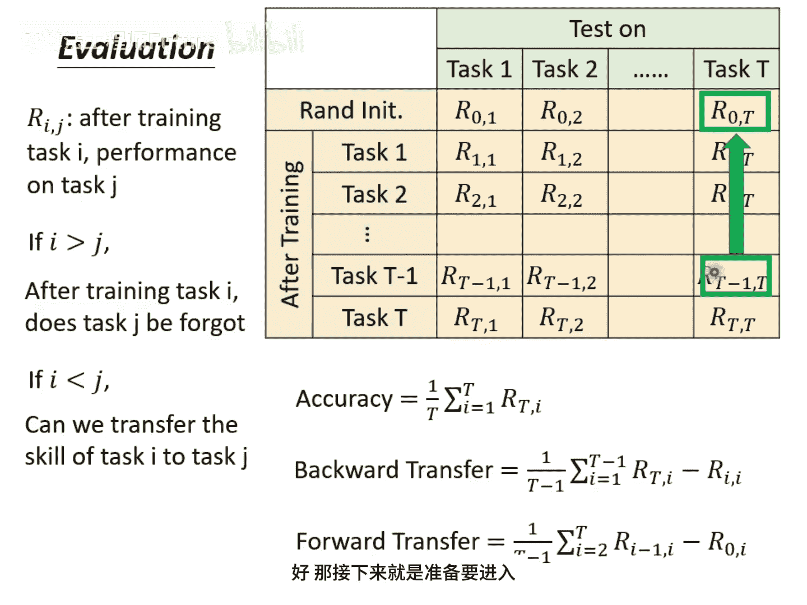

我们探讨了为什么简单的解决方案（如多任务学习或为每个任务单独训练模型）在实践中存在局限。最后，我们介绍了评估终身学习系统的常用方法和指标。理解了这些基础问题和评估方式，下一节课我们将深入探讨解决灾难性遗忘、实现真正终身学习的技术方法。
