# 90：作业14：持续学习 📚

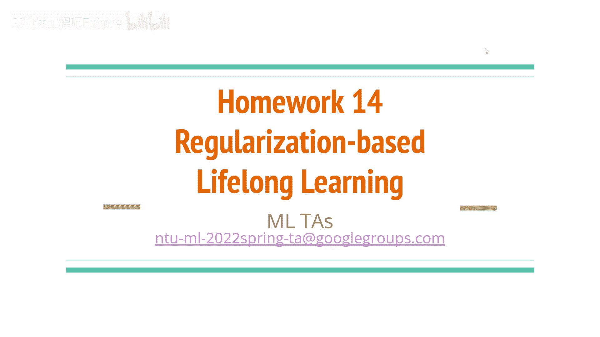

在本节课中，我们将学习持续学习的基本概念，并完成作业14。我们将了解什么是持续学习、它面临的挑战，以及几种主流的解决方法。最后，我们将通过实践代码，在旋转MNIST数据集上应用这些方法。

---

## 概述 🎯

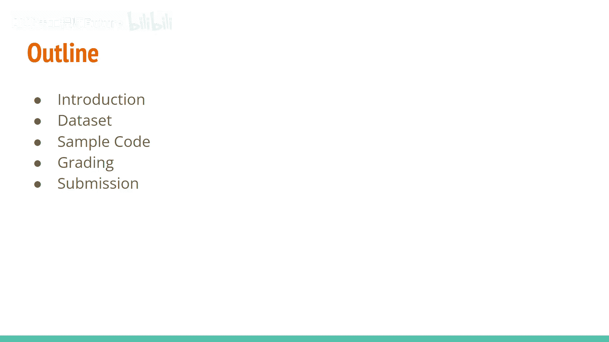

持续学习的终极目标是让模型能够在所有任务上都表现良好，但有一个限制：模型需要连续地在不同任务上进行训练。例如，我们可能在任务一上训练并测试，然后在任务二上训练并测试，依此类推。

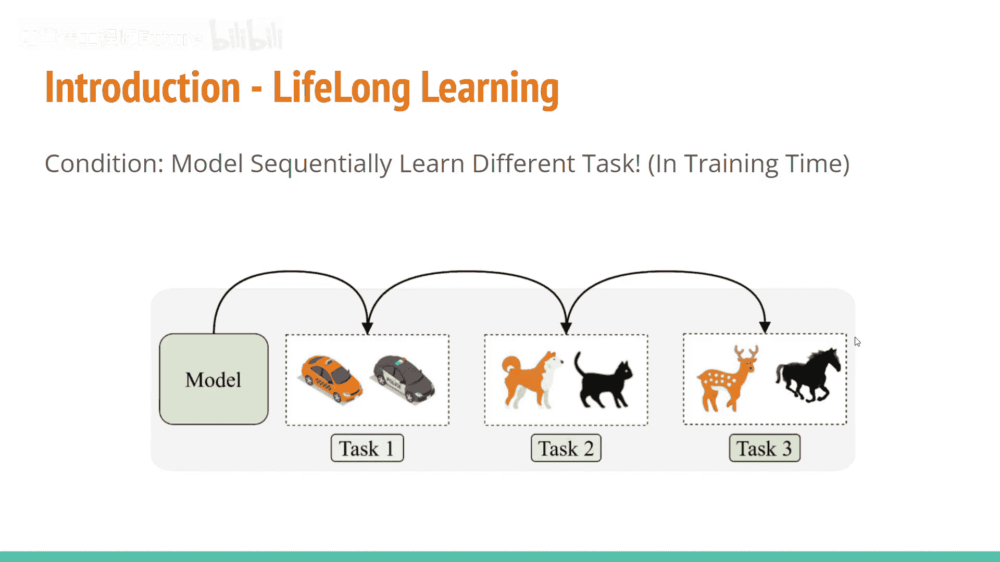

上一节我们介绍了课程目标，本节中我们来看看持续学习面临的核心问题。

## 灾难性遗忘 🧠

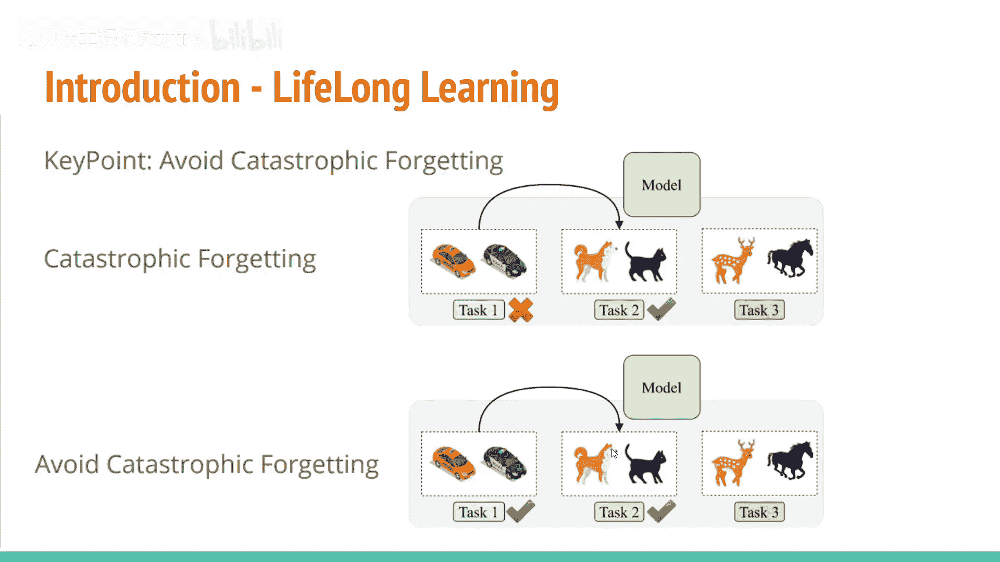

这种方法可能会遇到一个严重问题，即“灾难性遗忘”。具体来说，如果一个模型先在任务一上训练，然后在任务二上训练，之后在任务二上测试可能会有不错的效果。但如果再将该模型在任务一上测试，其效果可能会显著下降。

我们的目标是，当模型在任务一上训练后，再在任务二上训练，之后在任务一、任务二乃至任务三上测试时，都能保持良好的性能。

## 持续学习方法 🔧

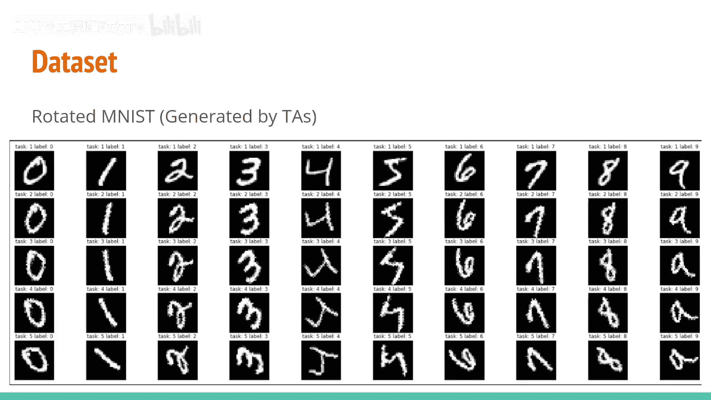

持续学习有多种不同的实现方法。本次作业我们将重点介绍基于正则化的方法。示例代码中包含了以下几种方法：

- **EWC**
- **MAS**
- **SI**
- **RWalk**
- **CP**

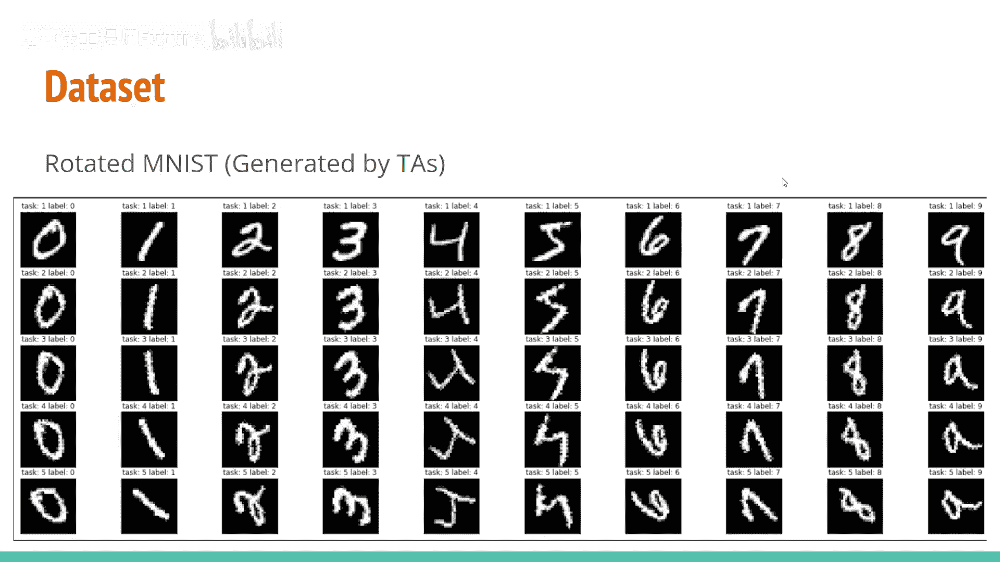

其中，只有CP方法不属于基于正则化的范畴。基于正则化的方法，是指在原始的损失函数后面，额外添加一个正则化项，以此来达到持续学习的效果。

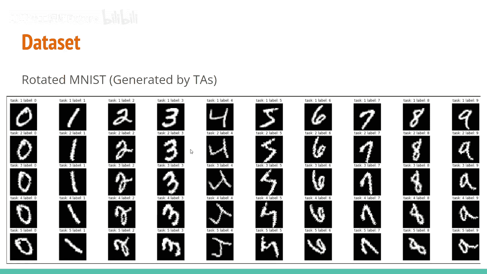

上一节我们了解了方法分类，本节中我们来看看本次作业使用的数据集。

## 数据集：旋转MNIST 🔄

本次作业使用的数据集是旋转MNIST。MNIST是一个手写数字识别数据集。我们将通过旋转图片来创建新的任务。

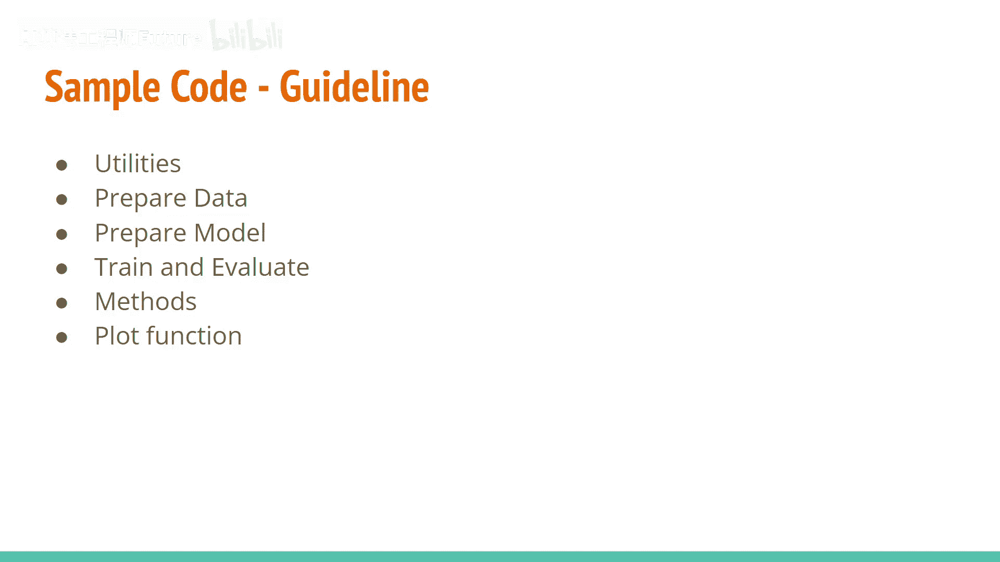

以下是数据集的创建方式：

- 第一个任务是正常的MNIST图片。
- 第二个任务是第一个任务的图片旋转20度。
- 第三个任务是第二个任务的图片再旋转20度。
- 以此类推，共创建五个任务。

关于训练的具体信息如下：本次训练包含五个任务，每个任务训练10个周期。如果你使用Colab的T4 GPU，每个方法的训练大约需要20分钟，总计约2小时。如果使用K80 GPU，每个方法可能需要50到60分钟，总计约5小时。建议尝试获取T4 GPU以节省时间。

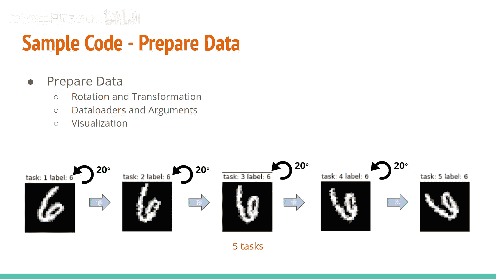

## 示例代码指南 💻

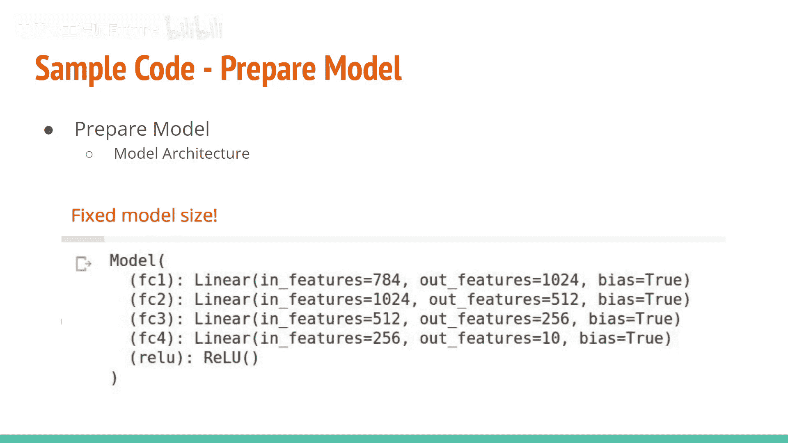

示例代码主要包含以下几个部分：`utilities`、`prepare_data`、`prepare_model`、`train_and_evaluate_methods` 和 `loss_function`。我们将挑选几个关键部分进行讲解。

### 数据准备 (`prepare_data`)

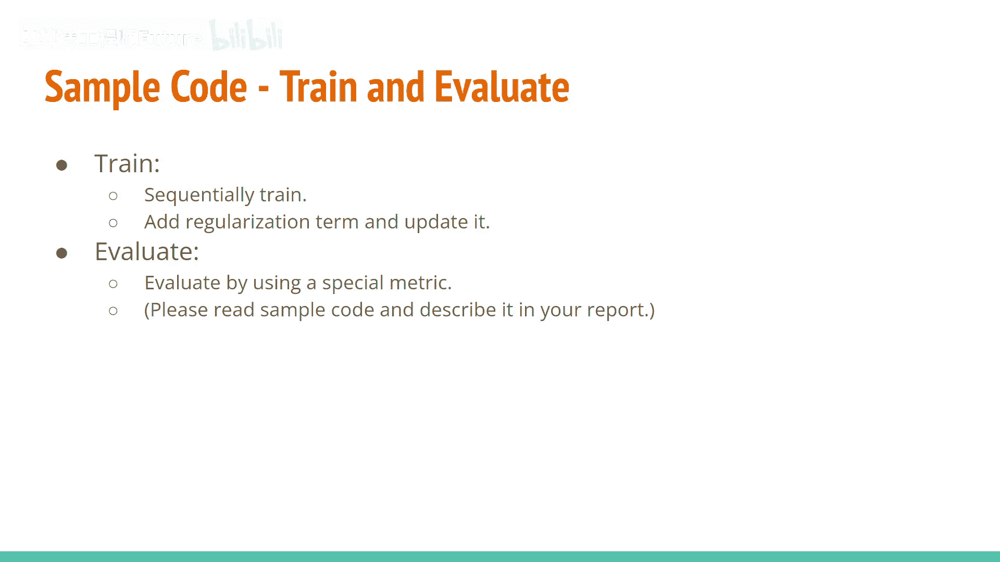

这部分代码负责准备旋转MNIST数据集。它包含图片旋转和变换的方法、数据加载器、数据集定义以及参数设置。此外，还包含可视化功能，方便你查看数据集的样子。

### 模型准备 (`prepare_model`)

这部分定义了模型的架构。本次作业采用一个简单的多层线性层作为模型。

### 训练与评估 (`train_and_evaluate`)

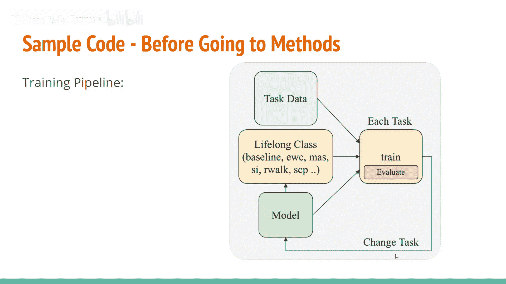

训练部分会依次在五个任务上进行训练和评估。损失函数会加上我们提到的正则化项，然后进行参数更新。评估部分使用了一个特定的评估指标。你需要查看示例代码，描述这个指标是什么，并将其写在报告里。

上一节我们介绍了代码结构，本节中我们来看看整个训练流程。

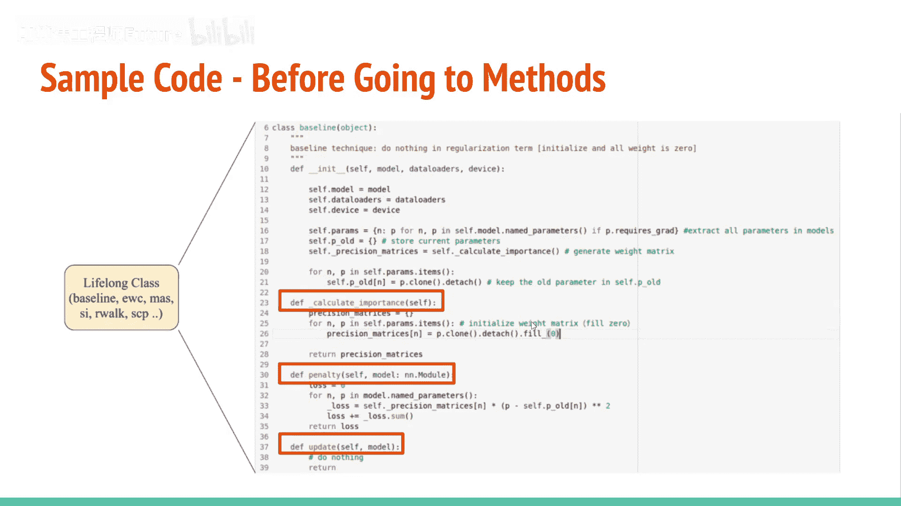

## 训练流程 📈

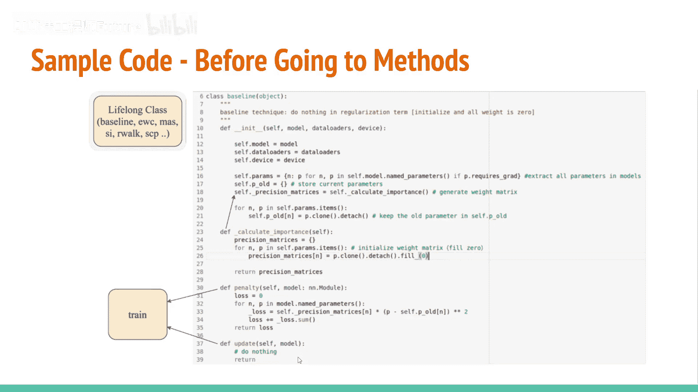

我们实现的不同方法都被封装在 `LifelongClass` 中。不同方法的框架相同，但内部操作不同。

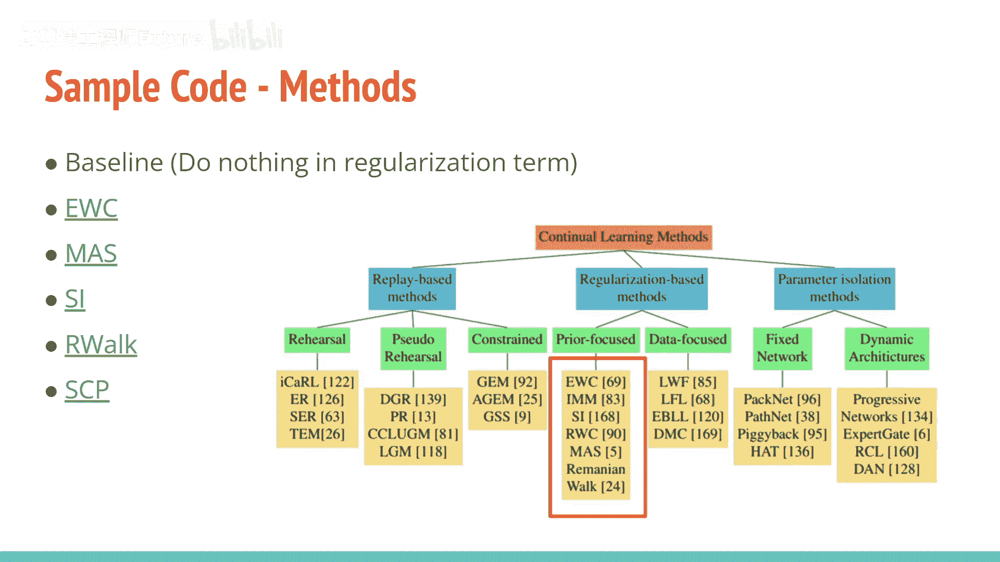

简单来说，流程如下：

1. 初始化模型参数，并将其输入 `LifelongClass`。
2. `LifelongClass` 利用这些参数计算重要性参数（第一个任务不计算）。
3. 将模型、`LifelongClass` 实例和任务数据输入训练函数进行训练，训练指定周期后进行评估。
4. 切换到新任务时，将更新后的模型参数再次输入 `LifelongClass`，计算新的重要性参数矩阵。
5. 重复步骤3和4，直到完成所有五个任务。

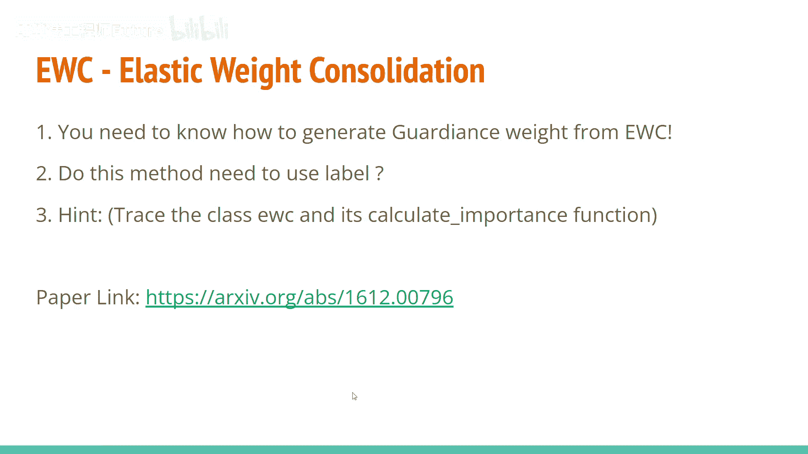

## LifelongClass 详解 🧩

`LifelongClass` 中有几个重要函数：

- `calculate_importance`: 计算重要性参数矩阵。
- `penalty`: 计算要添加到损失函数中的正则化项。
- `update`: 某些方法（如SI和RWalk）会使用此函数进行更新。

在初始化时，会调用 `calculate_importance` 来计算重要性参数矩阵。对于基准方法，这个函数将所有重要性参数设为零。

## 方法详解 📖

我们将依次介绍六个方法：`Baseline`、`EWC`、`MAS`、`SI`、`RWalk` 和 `CP`。

### EWC 方法

以下是关于EWC方法的任务：

- 请阅读论文或示例代码，了解EWC方法及其重要性参数是如何生成的。
- 请了解该方法是否需要使用标签信息。  
  
  你可以通过查看 `EWC` 类和 `calculate_importance` 函数来理解。相关问题只会出现在选择题部分。

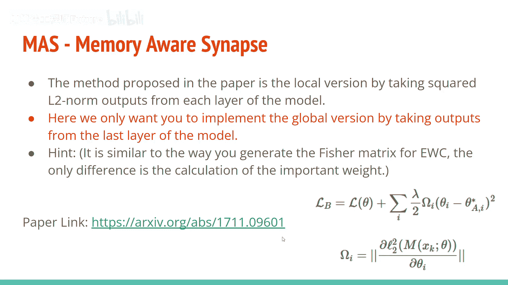

### MAS 方法

以下是关于MAS方法的任务：

- 请阅读论文或示例代码，了解MAS方法及其重要性参数是如何生成的。
- 请了解该方法是否需要使用标签信息。
- **你需要实现重要性参数（即Omega矩阵）的计算部分。** 实现后，请将你的代码贴到报告里。请注意，只修改标记为 `#TODO` 的部分，也只提交 `#TODO` 部分的代码。不要修改 `#TODO` 之外的示例代码。

**实现细节：**  

原始论文提出了局部和全局两个版本。为了简化，我们只要求实现全局版本。全局版本使用模型最后一层的输出来计算重要性参数。

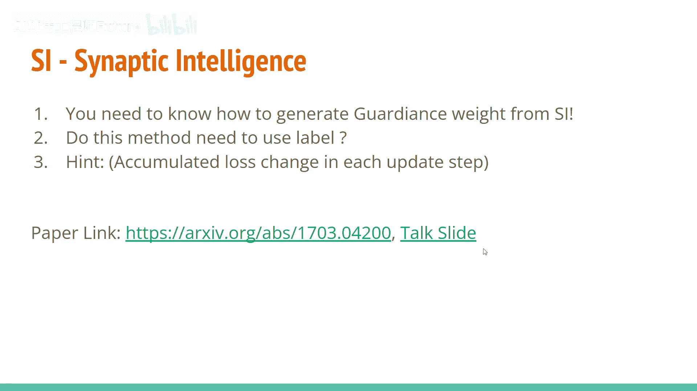

损失函数形式为：`L_total = L_original + λ * Σ (Ω_i * (θ_i - θ*_i)^2)`  

其中，`Ω` 就是我们要求的重要性参数矩阵。它通过以下方式获得：对模型最后一层的输出计算L2范数并平方，然后进行反向传播，再取绝对值。

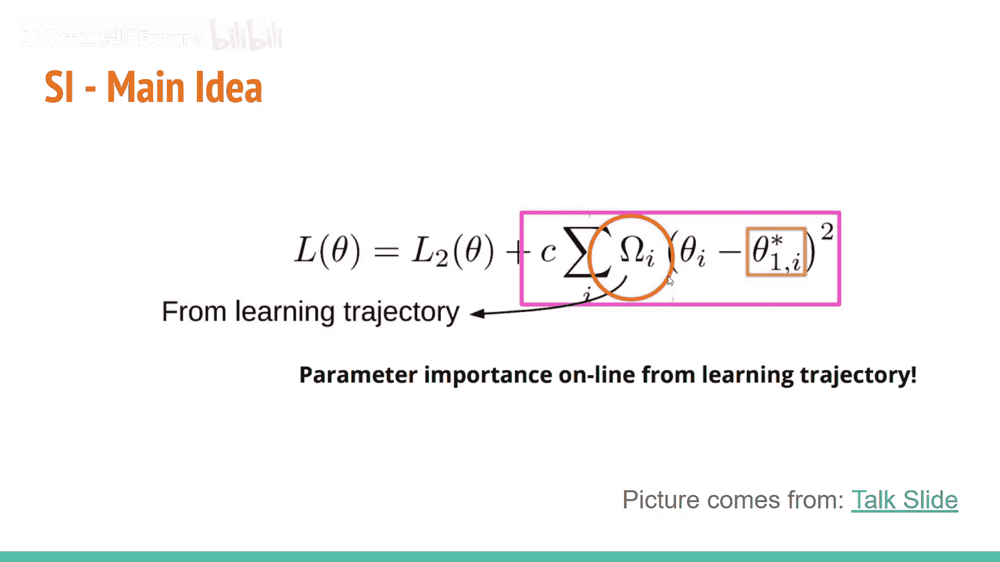

**提示：** 你可以参考 `EWC` 类中 `calculate_importance` 函数计算Fisher矩阵的方式，除了计算具体矩阵的部分，其他流程非常相似。

### SI 方法

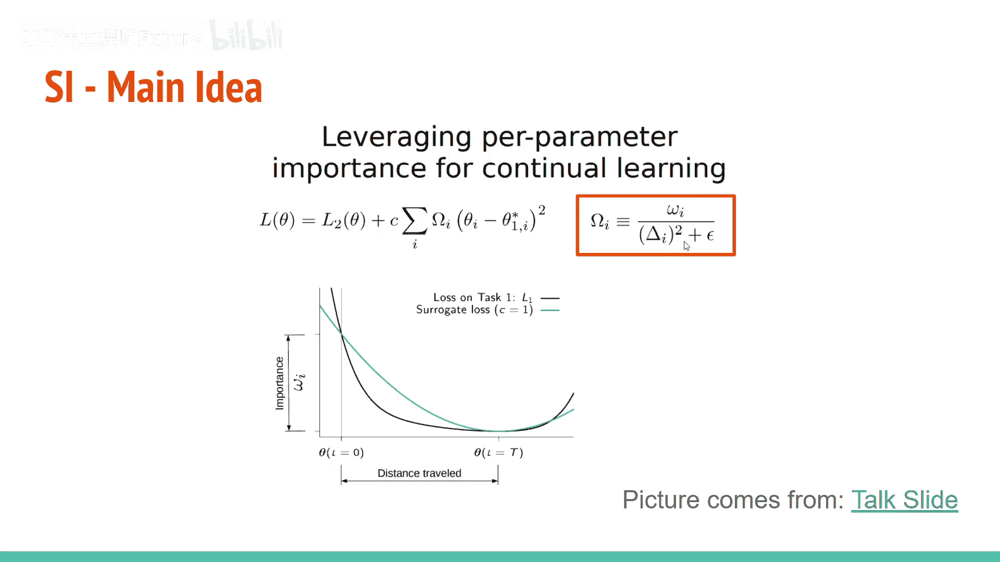

以下是关于SI方法的任务：

- 请阅读论文或示例代码，了解SI方法及其重要性参数是如何生成的。
- 请了解该方法是否需要使用标签信息。  
  
  你可以通过查看 `SI` 类和 `calculate_importance` 函数来理解。相关问题只会出现在选择题部分。

**提示：** SI方法的一个关键步骤是在每次参数更新时，计算损失的变化量并进行累加。

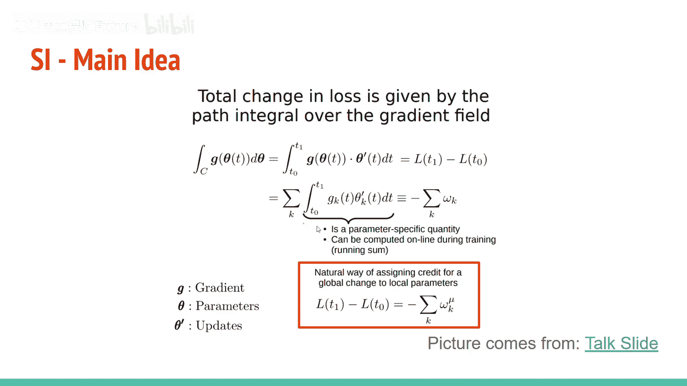

**方法简述：**  

损失函数为：`L_total = L_original + λ * Σ (Ω_i * (θ_i - θ*_i)^2)`  

重要性参数 `Ω_i` 的计算，涉及在参数更新路径上，累计损失变化量与参数变化量平方的比值。

### RWalk 方法

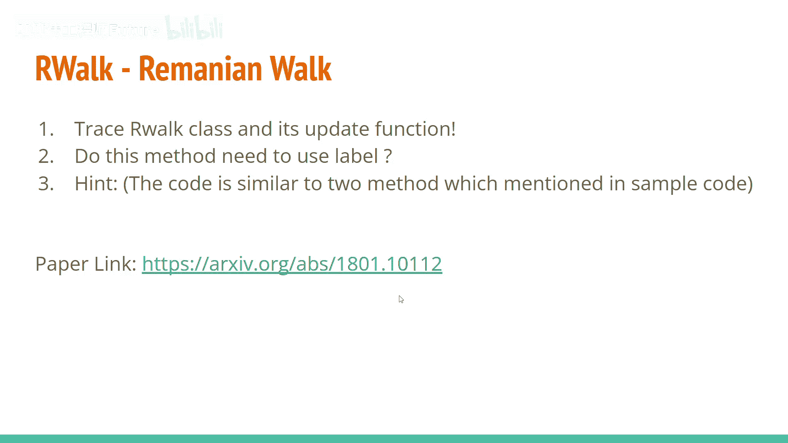

以下是关于RWalk方法的任务：

- 请阅读论文或示例代码，了解RWalk方法。
- 请了解该方法是否需要使用标签信息。
- 请了解该方法大致是哪两种方法的结合。  
  
  你可以通过查看 `RWalk` 类和 `update` 函数来理解。相关问题只会出现在选择题部分。

### CP 方法

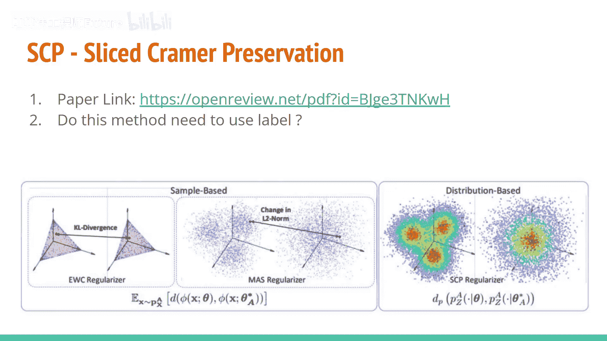

CP方法与其他基于正则化的方法不同。EWC使用KL散度来限制参数移动，MAS使用L2范数计算重要性，而CP属于基于分布的方法。它要求模型在新任务上训练时，其产生的特征分布要与在旧任务上产生的分布接近。基于分布的方法在衡量“距离”时通常更为宽松。

这样做是为了防止“内在固执”，即模型过度维护旧任务而拒绝学习新任务。CP方法为模型学习新任务提供了更多可能性。

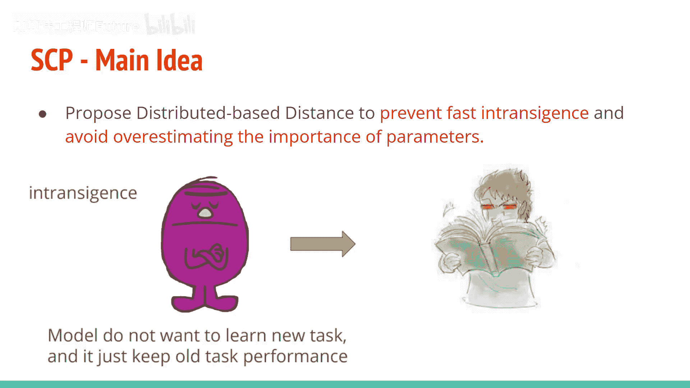

### 其他方法与场景

课程还涉及其他方法和场景，相关问题只会出现在选择题中。请阅读提供的论文来回答，问题不会太深，无需花费过多时间。

## 评分方式 📝

评分分为两部分：

1. **选择题**：共20题，每题0.4分，总计8分。如果是多选题，必须全部选对才得分。
2. **报告**：总计2分。

**报告部分具体要求：**

1. **运行代码并绘图 (0.5分)**：运行所有代码，并绘制前面提到的特殊评估指标的学习曲线。绘图函数已提供。
2. **描述指标 (0.5分)**：描述该特殊评估指标是什么。
3. **实现MAS的Omega矩阵 (1分)**：成功实现MAS方法中重要性参数矩阵的计算。

**再次提醒：** 只需修改和提交标记为 `#TODO` 的代码部分。即使你没有成功实现Omega矩阵，只要画出了所有的学习曲线，依然可以获得对应的0.5分。

## 作业提交 📤

请按以下步骤提交作业：

1. 在Gradescope上回答选择题。
2. 将你的报告提交到Gradescope。
3. 选择题可以多次提交，系统将记录最后一次提交的成绩作为最终成绩。请记得每次都要点击“保存”。
4. **截止日期：6月24日 23:59。逾期不候。**

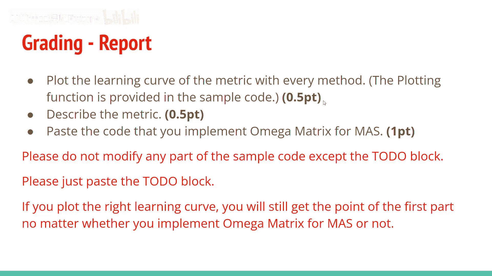

## 总结 🏁

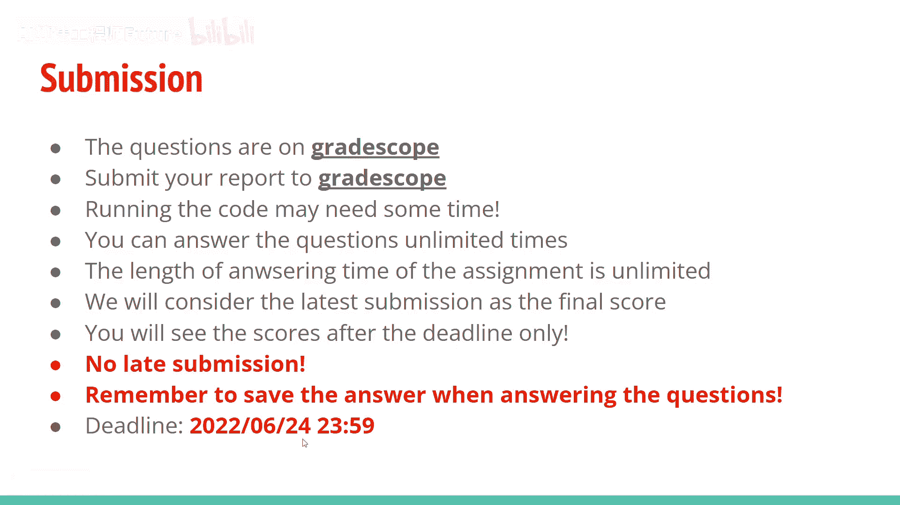

本节课中，我们一起学习了持续学习的基本概念和挑战——灾难性遗忘。我们重点介绍了几种基于正则化的持续学习方法，包括EWC、MAS、SI和RWalk，以及基于分布的方法CP。通过完成本次作业，你将在旋转MNIST数据集上实践这些方法，理解它们如何通过添加正则化项来保护已学知识，从而让模型能够持续学习新任务而不遗忘旧任务。

---

**相关链接与帮助：**

- 如有任何问题，请前往NTU COOL讨论版提问或参加助教答疑时间。
