# 91：元学习（全）—— 元学习与机器学习的三步框架 🧠

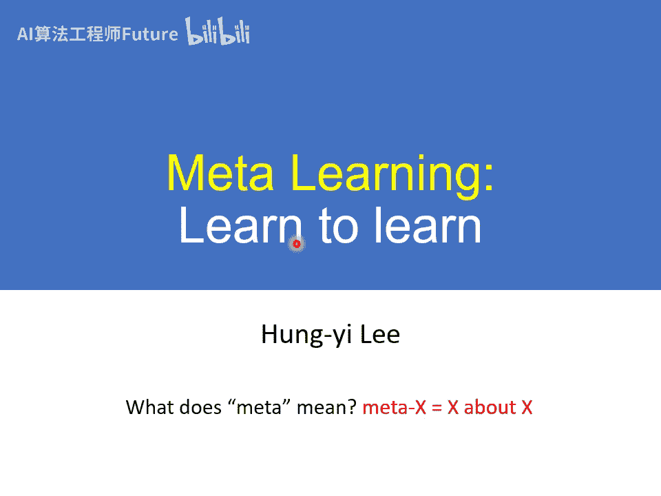

在本节课中，我们将要学习元学习（Meta Learning）的基本概念。元学习，即“学习如何学习”，是机器学习领域一个更高层次的主题。我们将从回顾机器学习的基础框架开始，逐步理解元学习的目标、步骤及其与机器学习的异同。

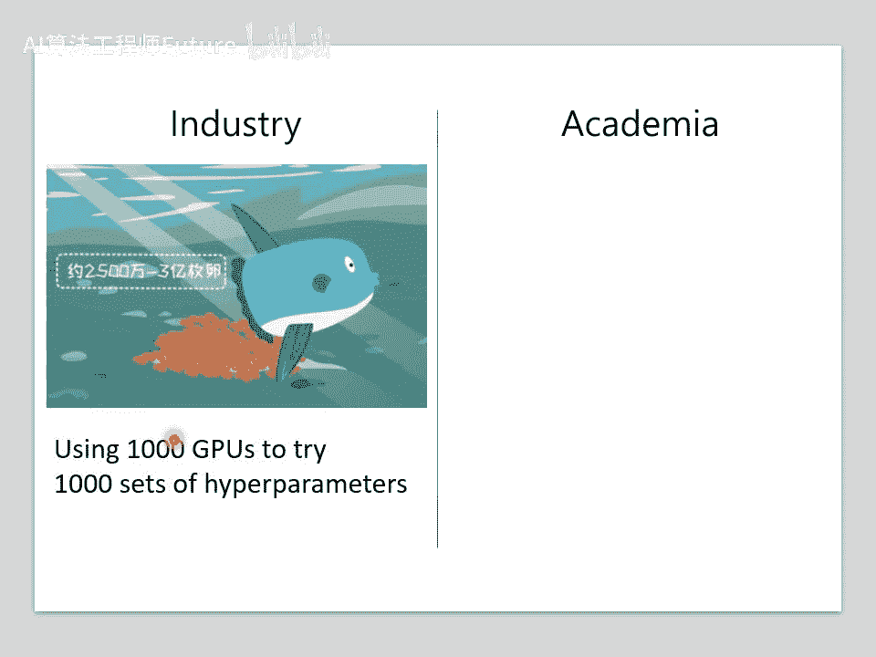

## 概述：什么是元学习？

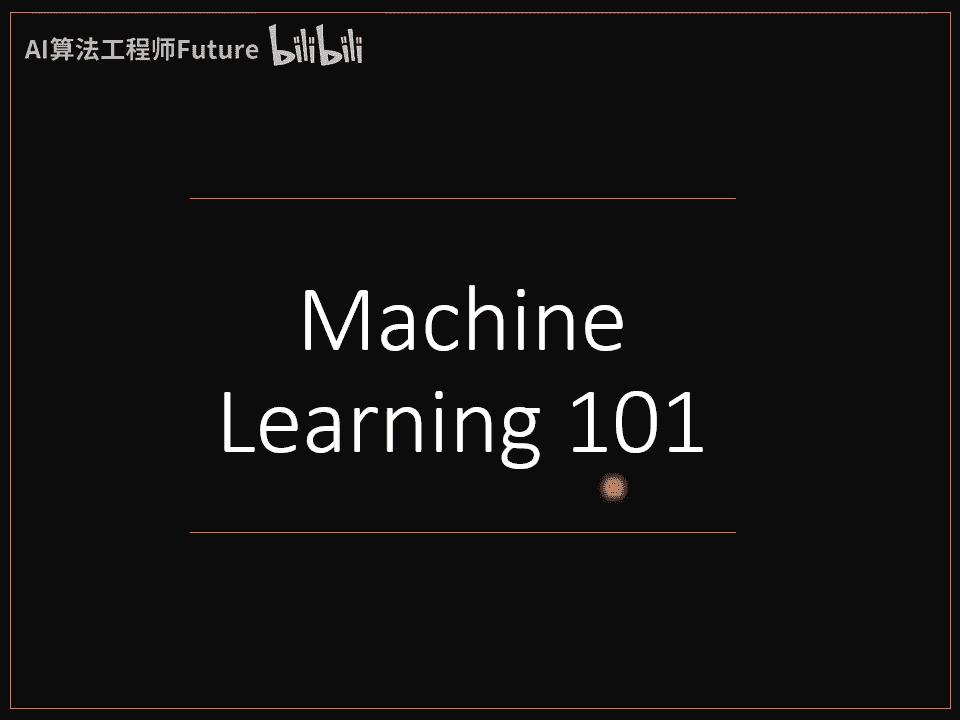

元学习，字面意思是“关于学习的学习”。如果说机器学习是寻找一个能完成特定任务的函数（例如图像分类器），那么元学习就是寻找一个能自动寻找这类函数的“学习算法”。其核心目标是让机器学会如何更高效地学习，例如自动决定神经网络结构、学习率等超参数，从而减少人工调参的繁琐。

## 回顾：机器学习的三步框架

在深入元学习之前，我们先回顾机器学习的基本框架，这将帮助我们理解两者的联系。机器学习通常包含以下三个步骤：

1. **定义带有未知参数的函数**：我们定义一个函数 ( f_{\theta} )，其中 ( \theta ) 代表未知的参数（例如神经网络的权重和偏置）。
2. **定义损失函数**：我们定义一个损失函数 ( L(\theta) )，它根据训练数据和真实标签，衡量参数 ( \theta ) 的好坏。
3. **优化**：我们寻找一组最优参数 ( \theta^* )，使得损失函数 ( L(\theta) ) 最小化。通常使用梯度下降等方法。

最终，我们得到训练好的模型 ( f_{\theta^*} )，可用于执行预测任务。

## 元学习的三步框架

元学习的思路与机器学习一脉相承，其目标不再是找一个分类函数 ( f )，而是找一个能产出分类函数的学习算法 ( F )。这个学习算法 ( F ) 本身也可以通过学习得到。以下是元学习的三个步骤：

### 第一步：定义带有未知元参数的学习算法

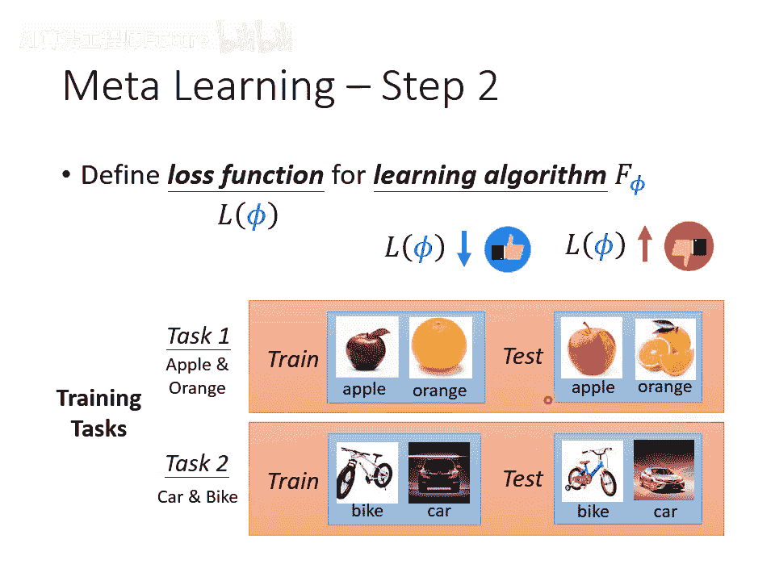

一个学习算法 ( F )（例如梯度下降训练一个分类器的整个过程）内部也有一些可以调整的部分，我们称之为**元参数**，用 ( \phi ) 表示。因此，学习算法可以写作 ( F_{\phi} )。

- **元参数 ( \phi ) 的例子**：神经网络的初始权重、网络架构、优化器的学习率等。不同的元学习方法旨在学习 ( F_{\phi} ) 中不同的组成部分。

### 第二步：定义元损失函数

我们需要一个元损失函数 ( L(\phi) ) 来衡量学习算法 ( F_{\phi} ) 的好坏。( L(\phi) ) 越小，代表算法 ( F_{\phi} ) 越好。

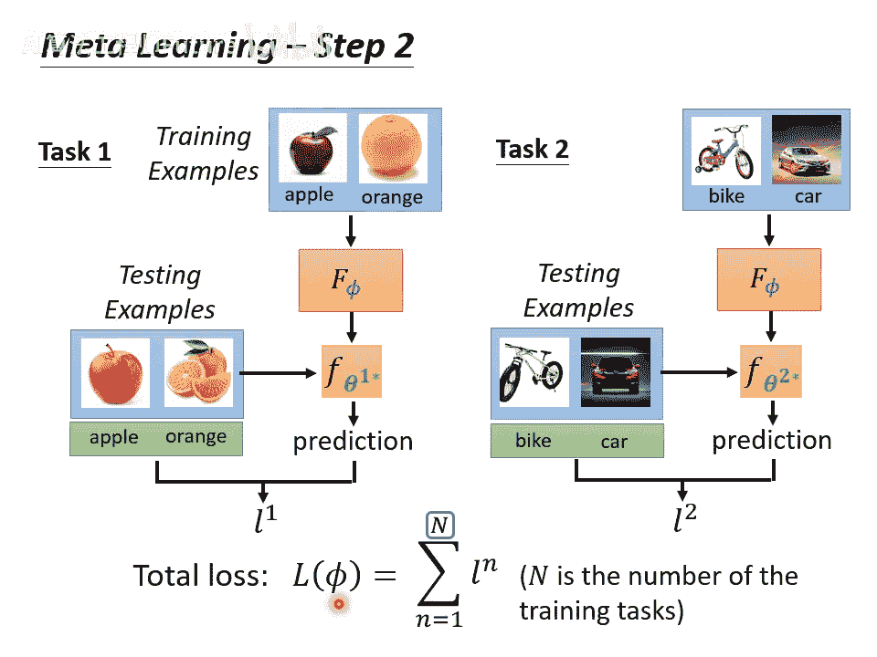

那么，如何计算 ( L(\phi) ) 呢？这需要用到我们为元学习准备的**训练任务集**。

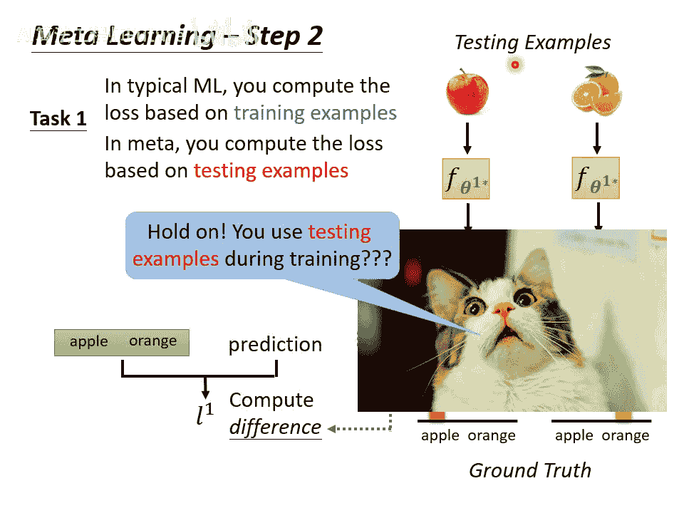

以下是计算元损失函数 ( L(\phi) ) 的过程：

1. **准备多个训练任务**：例如，任务一是区分苹果和橘子，任务二是区分汽车和自行车。每个任务都包含自己的**支持集**（训练数据）和**查询集**（测试数据）。
2. **在单个任务上评估算法**：以任务一为例。我们将任务一的**支持集**输入学习算法 ( F_{\phi} )，算法会输出一个针对该任务训练好的分类器 ( f_{\theta1}* )。
3. **计算任务损失**：我们将任务一的**查询集**输入这个分类器 ( f_{\theta1}* )，得到预测结果，并与真实标签比较，计算出一个损失值 ( l^1 )。
4. **汇总所有任务损失**：对训练任务集中的所有 ( N ) 个任务重复步骤2和3，得到 ( N ) 个损失值 ( l^1, l^2, ..., l^N )。元损失 ( L(\phi) ) 就是这些任务损失的平均值：  
  
  [  
  
  L(\phi) = \frac{1}{N} \sum_{n=1}^{N} l^n  
  
  ]

**重要说明**：在元学习中，计算每个任务的损失 ( l^n ) 时使用的是该任务内部的**查询集**（测试数据）。这与传统机器学习只在训练集上计算损失不同。在元学习框架下，任务内部的查询集是用于“训练”元学习算法 ( F_{\phi} ) 的“训练数据”的一部分。

### 第三步：优化元参数

我们的目标是找到一组最优的元参数 ( \phi^* )，使得元损失函数 ( L(\phi) ) 最小化：  

[  

\phi^* = \arg \min_{\phi} L(\phi)  

]  

求解这个优化问题的方法可以是梯度下降（如果 ( L(\phi) ) 对 ( \phi ) 可微），也可以是强化学习、进化算法等其他优化方法。

最终，我们得到了一个**学出来的学习算法** ( F_{\phi^*} )。

## 元学习的训练与测试流程

理解元学习的流程需要区分两个层面的“训练”和“测试”。

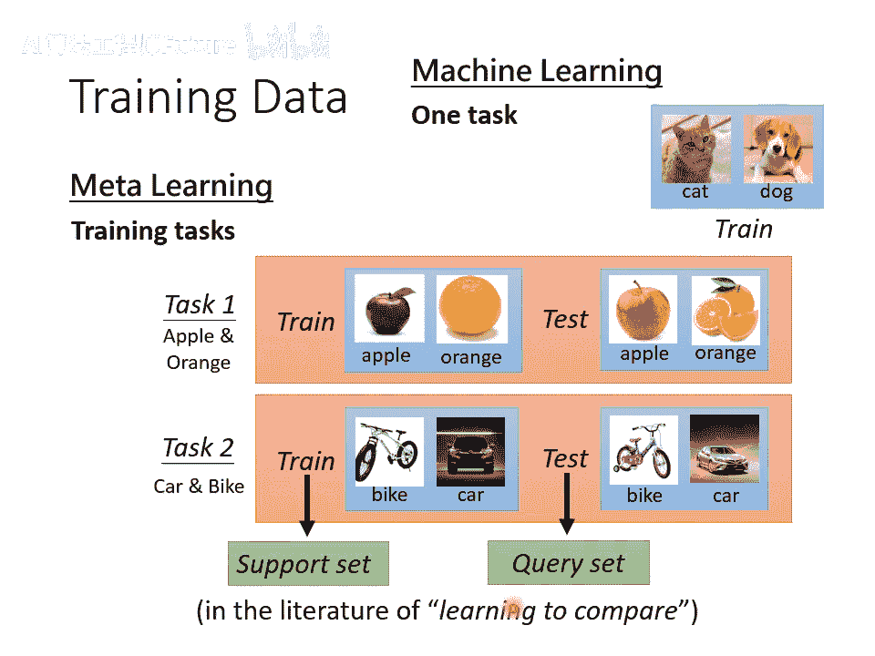

- **跨任务训练**：使用大量**训练任务**来学习元学习算法 ( F_{\phi^*} ) 的过程。这对应上述三个步骤。
- **跨任务测试**：评估学到的算法 ( F_{\phi^*} ) 在全新**测试任务**上的表现。
  
  流程是：将测试任务的**支持集**输入 ( F_{\phi^*} )，得到一个针对该任务训练好的分类器。
  然后将测试任务的**查询集**输入该分类器，评估其性能。

一次“跨任务测试”包含了在一个新任务上的一次完整学习（**任务内训练**）和评估（**任务内测试**），这个完整过程在文献中常被称为一个 **Episode**。

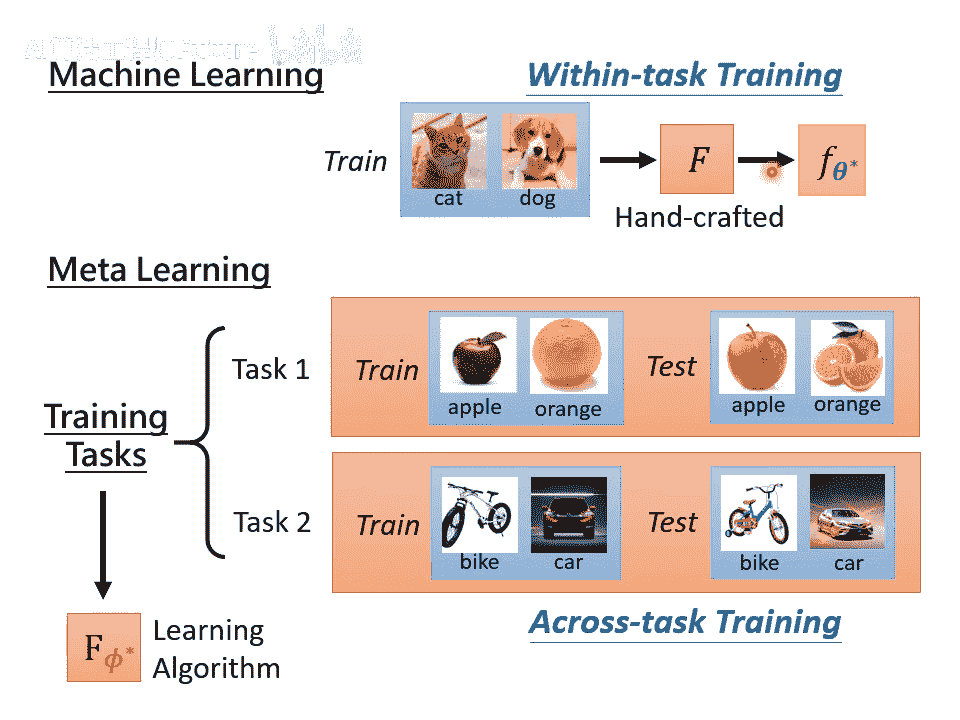

## 元学习 vs. 机器学习：对比与关联

上一节我们介绍了元学习的完整流程，本节我们来系统地比较它与机器学习的异同。

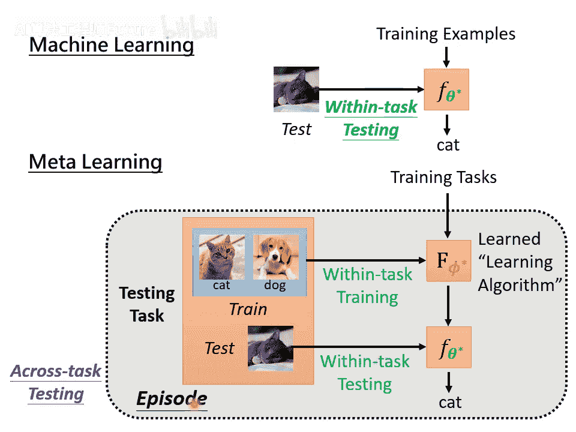

### 核心目标对比

- **机器学习**：寻找一个能解决特定任务的函数 ( f_{\theta} )（如分类器）。
- **元学习**：寻找一个能自动寻找函数 ( f_{\theta} ) 的学习算法 ( F_{\phi} )。

### 训练数据与流程对比

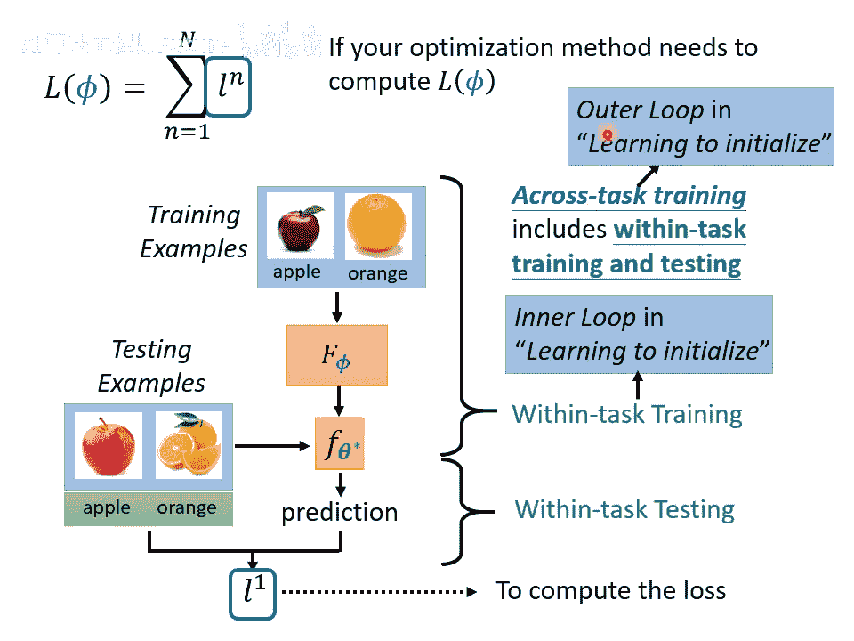

| 方面 | 机器学习 | 元学习 |
| --- | --- | --- |
| **训练单位** | 一个任务内的**数据样本** | 多个**任务** |
| **训练过程** | **任务内训练**：用数据训练模型 ( f_{\theta} ) | **跨任务训练**：用多个任务训练学习算法 ( F_{\phi} ) |
| **测试过程** | **任务内测试**：用测试数据评估 ( f_{\theta} ) | **跨任务测试**：在新任务上运行 ( F_{\phi} )（包含一次任务内训练和测试） |
| **损失计算** | 损失 ( L(\theta) ) 基于一个任务的**训练集** | 元损失 ( L(\phi) ) 基于多个任务的**查询集**（任务内测试集） |

### 共同挑战与概念

许多机器学习中的概念可以直接迁移到元学习：

1. **过拟合**：元学习算法 ( F_{\phi} ) 也可能在训练任务上表现很好，但在未见过的测试任务上表现不佳，即“元过拟合”。
2. **解决方案**：
  
  **收集更多数据**：在机器学习中是收集更多训练样本；在元学习中则是收集更多样化的**训练任务**。
  **数据增强**：在机器学习中对训练样本进行增强；在元学习中可以对任务进行**任务增强**。
3. **超参数调优**：训练元学习算法 ( F_{\phi} ) 本身（如用梯度下降优化 ( \phi )）也需要设置超参数（如元学习率）。因此，元学习并非完全免调参，但其理想是**一劳永逸**：花费精力调优一次得到强大的 ( F_{\phi^*} )，之后将其应用于新任务时无需再调参。
4. **开发集的重要性**：与机器学习需要训练集、开发集、测试集一样，严谨的元学习也应该有**训练任务集**、**开发任务集**和**测试任务集**。开发任务集用于在元训练阶段选择超参数，防止元学习算法过拟合到测试任务上。

## 总结

本节课中，我们一起学习了元学习的基础知识：

- 我们首先明确了**元学习**的目标是“学习如何学习”，即寻找一个能自动产生解决特定任务模型的学习算法 ( F_{\phi} )。
- 我们回顾了**机器学习的三步框架**（定义函数、定义损失、优化），并发现**元学习遵循完全相同的逻辑**，只是操作对象从“函数参数 ( \theta )”提升到了“学习算法的元参数 ( \phi )”。
- 我们详细阐述了元学习的三个步骤：定义 ( F_{\phi} )、基于多个任务定义元损失 ( L(\phi) )、优化 ( \phi ) 以最小化 ( L(\phi) )。
- 我们厘清了元学习中容易混淆的**跨任务训练/测试**与**任务内训练/测试**的概念，并引入了 **Episode** 来描述一次完整的任务内学习与评估。
- 最后，我们系统比较了元学习与机器学习的异同，指出元学习同样面临过拟合等挑战，并且许多机器学习的核心思想（如使用开发集）在元学习领域同样适用且重要。

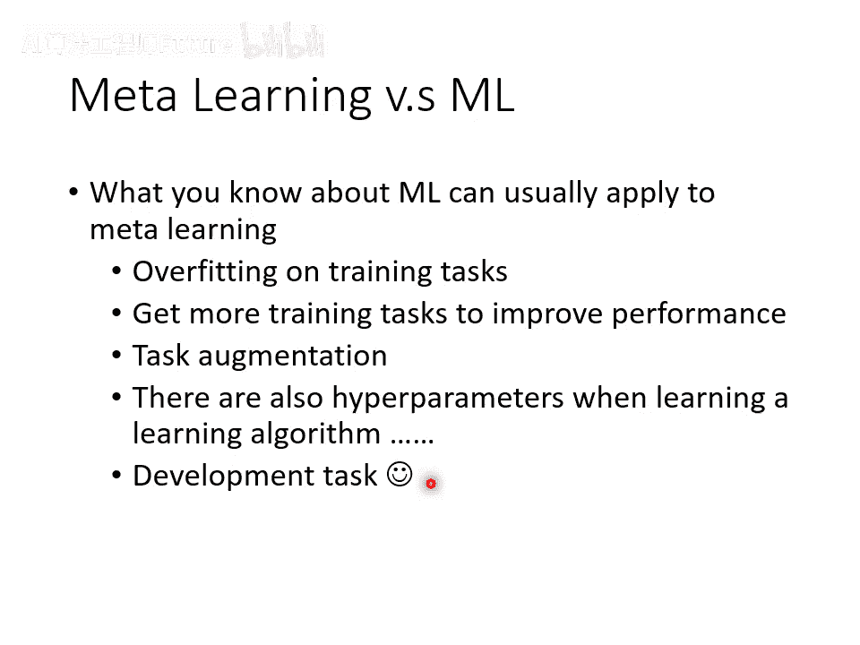

元学习为实现“小样本学习”等目标提供了强大的方法论。在接下来的课程中，我们将深入探讨几种具体的元学习方法。
