# 92：元学习 Meta Learning (二) - 万物皆可 Meta 🧠

在本节课中，我们将学习元学习（Meta Learning）的具体应用实例。我们将探讨在梯度下降等常见学习算法中，哪些组件可以通过元学习进行优化，并了解一系列相关的先进方法。

---

## 概述

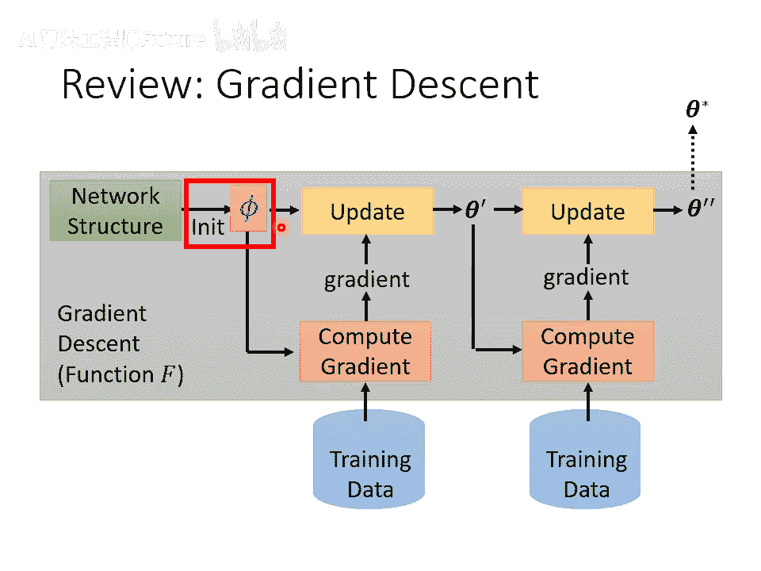

上一节我们介绍了元学习的基本概念。本节中，我们将通过具体实例，说明在元学习框架下，哪些组件可以被学习。我们将从最常见的梯度下降算法开始分析。

## 可学习的组件：梯度下降视角

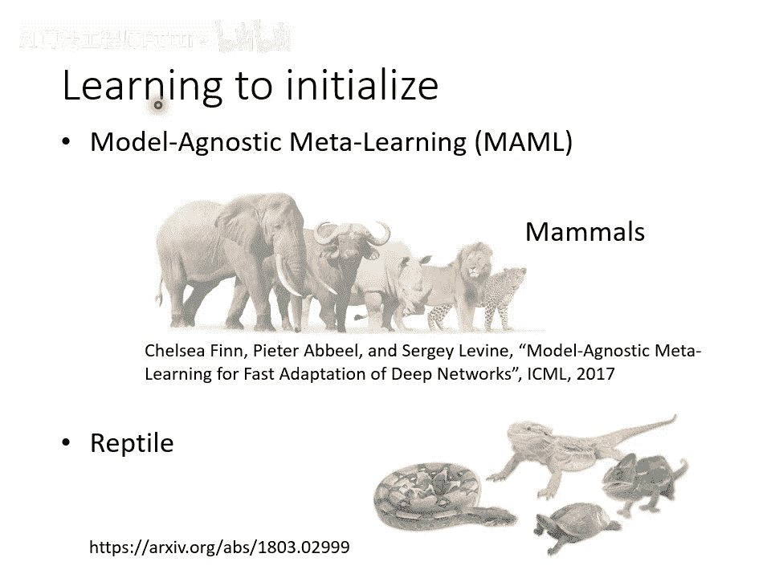

梯度下降是最常用的学习算法。其过程通常包括：定义一个网络架构，初始化参数（记作 **θ₀**），从训练数据中采样批次（batch），计算梯度并更新参数，反复迭代直至满意，最终输出训练好的参数。

在整个过程中，以下组件是可以被学习的。

### 学习初始化参数

首先，初始化的参数是可以学习的。通常，**θ₀** 是随机初始化的，从某个固定分布中采样。然而，初始参数对结果有显著影响。好的初始化与差的初始化可能导致天差地别的结果。我们能否通过一系列训练任务，找到一个对训练特别有帮助的初始参数呢？答案是肯定的。

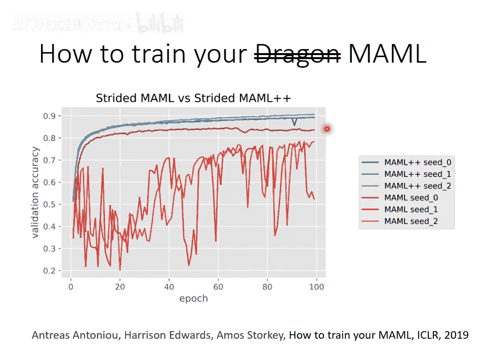

以下是相关方法：

- **MAML (Model-Agnostic Meta-Learning)**：这是元学习领域最知名的方法之一，其目标是学习一个良好的初始化参数。
- **Reptile**：这是MAML的一个变体。

这些方法的细节因时间有限不在此详述，但相关参考文献已列在幻灯片上。作业中会涉及更多与MAML相关的细节问题。

然而，进行元学习时也需要调整超参数。原始版本的MAML并不容易训练。一篇名为《How to Train Your MAML》的论文指出，训练初始化参数本身也需要进行梯度下降和随机种子（random seed）的选择。该论文提出了改进方法 **MAML++**。

### 与自监督学习的联系

讲到寻找好的初始化参数，是否让你联想到课程的另一个主题——自监督学习（Self-Supervised Learning）呢？

在元学习中，我们有一系列训练任务（每个任务包含训练和测试数据），根据这些任务找出一个好的初始化，然后用于测试任务。

在自监督学习中，我们使用大量无标签数据，通过预训练任务（Pretext Task）来训练模型。例如，在BERT中使用填空题，在图像中预测被遮盖的区块（或如今更流行的对比学习Contrastive Learning）。预训练的结果也被视为一种好的**初始化**，可用于下游测试任务。

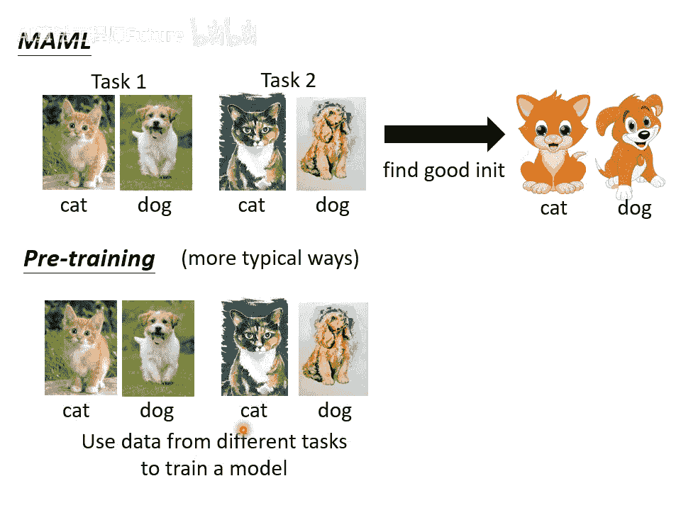

那么，这两者有何不同呢？最明显的区别是：MAML中的任务使用了标注数据，而自监督学习没有使用标注数据。自监督学习为何有效，其原理尚不完全清楚；而MAML的有效性似乎更直观——找到一组好的初始参数，期望它能迁移到测试任务上。

在自监督学习这个概念流行之前，另一种常见的预训练做法是**多任务训练（Multi-task Training）**：将多个任务的数据混合在一起，当作一个任务进行训练，得到一个好的初始化，再用于测试任务。

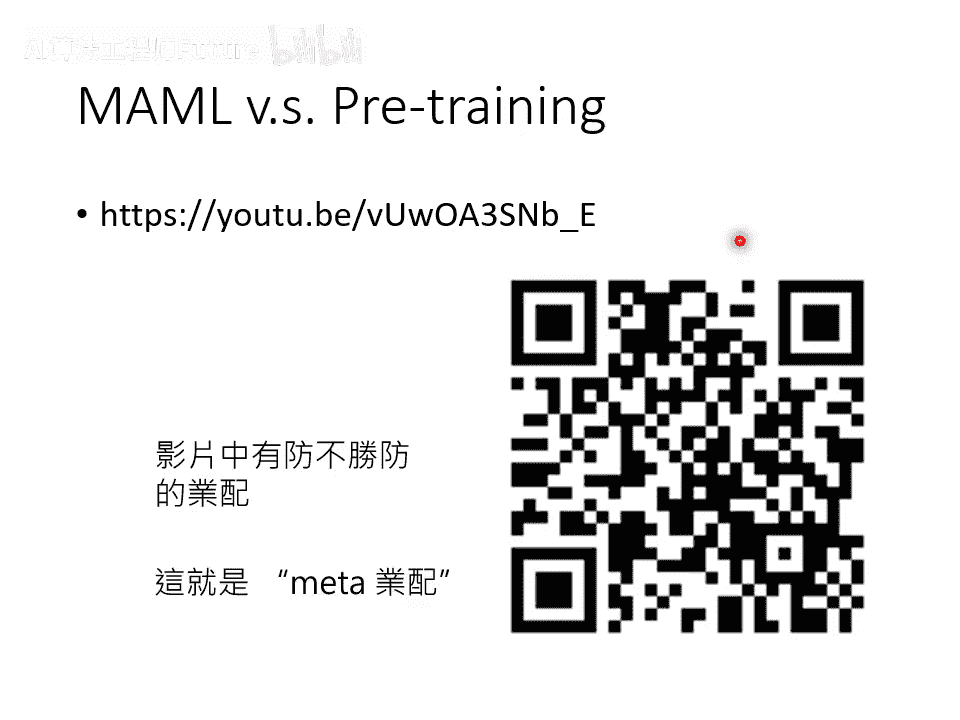

在元学习研究中，常将这种多任务训练方法作为基线（Baseline），因为两者使用的数据相同，只是组织方式不同（元学习分开处理每个任务，多任务训练则合并数据）。

### 任务与领域适应

在之前的例子中，训练和测试任务差异不大（如分类苹果/橘子与分类汽车/自行车）。但在某些设定下，每个训练任务可能都是分类猫和狗，只是图片类型不同（如真实照片、油画、卡通）。这实质上就是**领域适应（Domain Adaptation）**。因此，当元学习中不同任务对应不同领域时，元学习也可被视为一种解决领域适应的方法。

在机器学习领域，术语“任务”和“领域”的界限有时并不明确。重要的是理解这些词汇背后的含义，而非拘泥于名称本身。

### MAML为何有效？

关于MAML为何有效，有两种假设：

1. **快速学习（Rapid Learning）**：MAML找到的初始参数能让梯度下降等算法在每个任务上快速找到好参数。
2. **特征复用（Feature Reuse）**：初始参数已经与每个任务上最终的好参数非常接近，只需轻微调整即可。

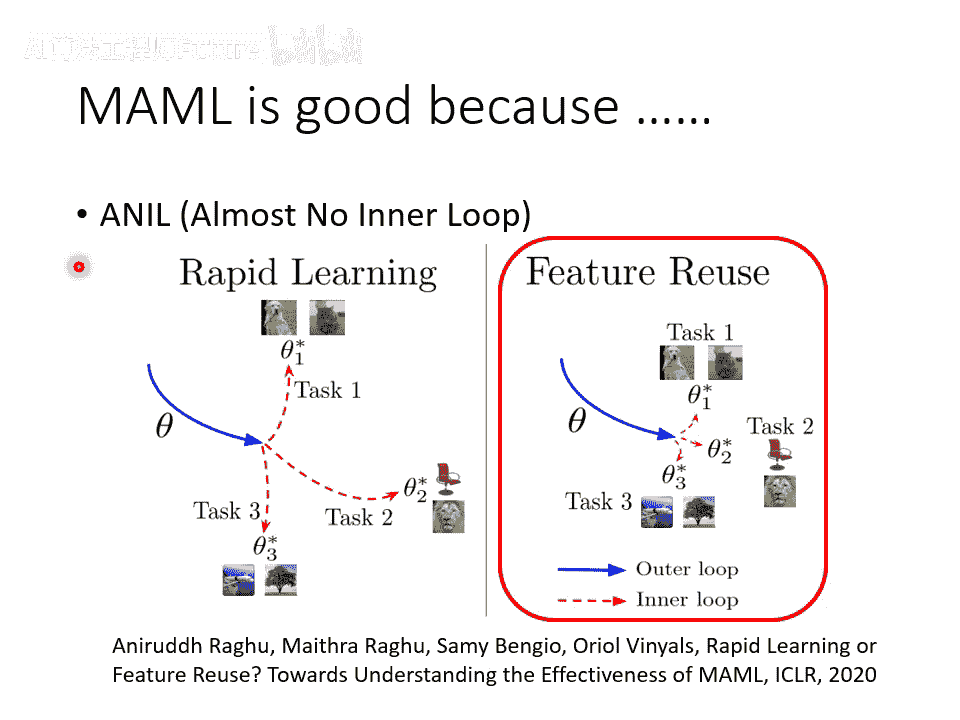

一篇题为《Rapid Learning or Feature Reuse?》的论文通过实验得出结论：**特征复用才是MAML有效的关键**。该论文同时提出了MAML的一个变体 **ANIL (Almost No Inner Loop)**。

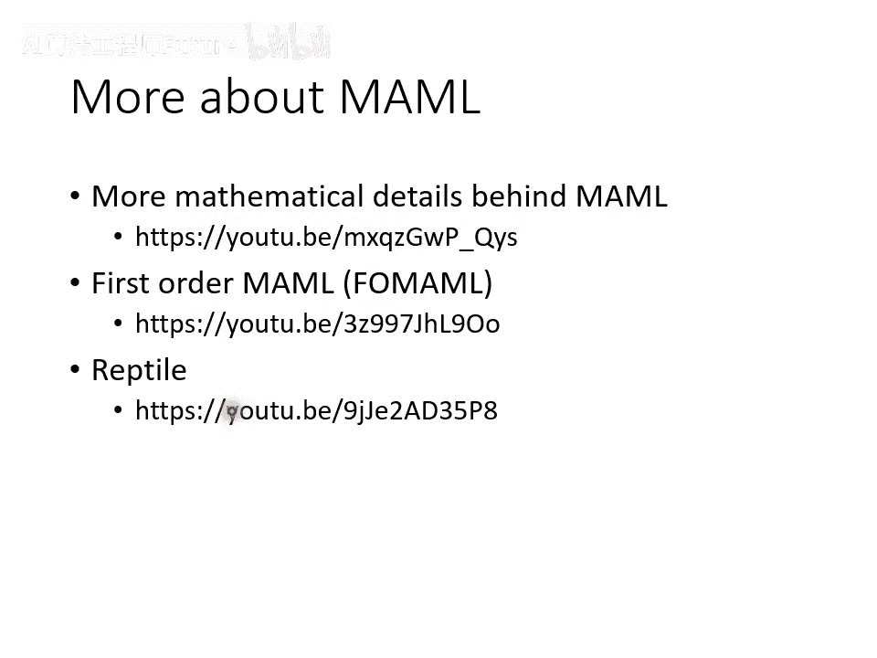

元学习还有很多其他变形。若想了解数学细节、简化运算的 **First-Order MAML** 或 **Reptile** 等方法，可参考课程提供的其他视频资源，相关内容也会在作业中涉及。

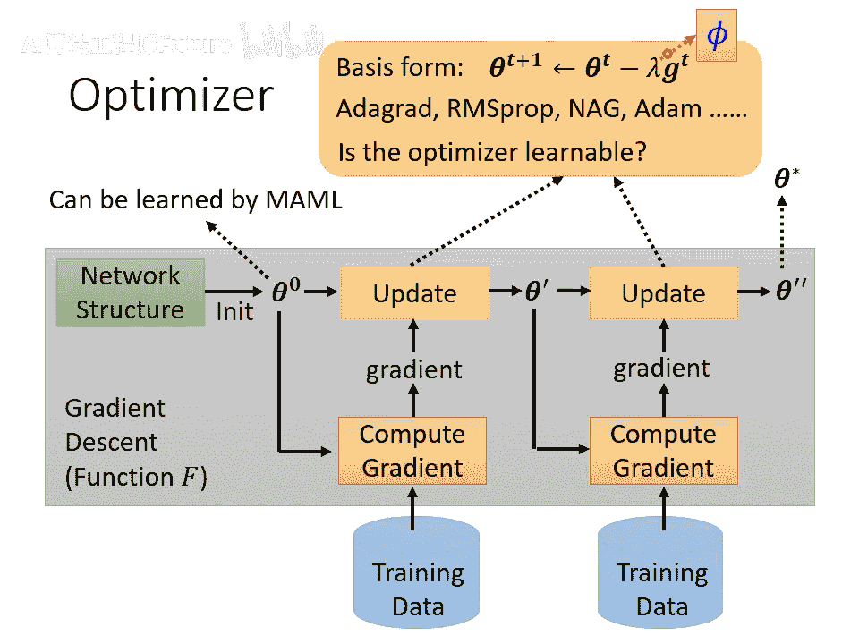

---

## 学习优化器

上一节我们介绍了可以学习初始化参数。那么，还有什么可以学习呢？我们可以学习**优化器（Optimizer）**。

在更新参数时，我们需要决定学习率（learning rate）、动量（momentum）等超参数。这些超参数能否通过元学习来学习呢？答案是肯定的。

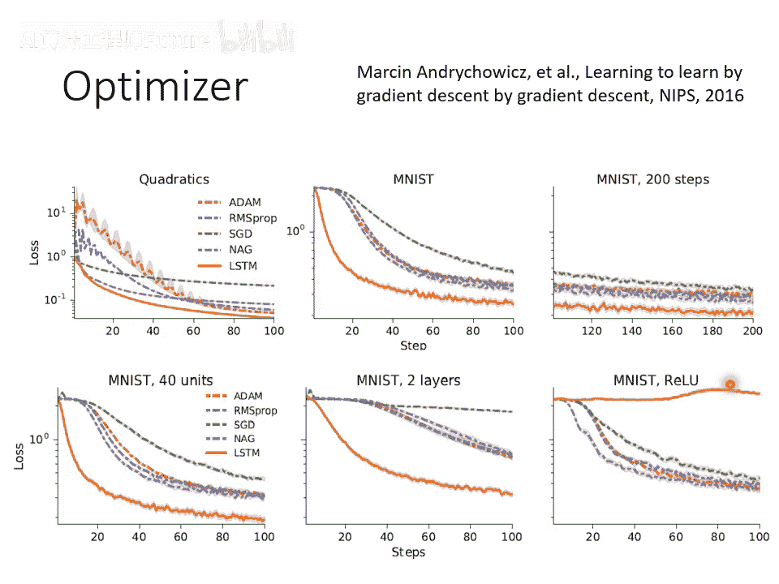

这种想法很早就有。NIPS 2016的一篇论文《Learning to learn by gradient descent by gradient descent》就直接学习了一个优化器。通常的优化器（如Adam、RMSProp）是人设计的，而该论文中优化器的参数是根据训练任务自动学出的。作者将其方法类比为训练一个LSTM，故称为 **LSTM Optimizer**。

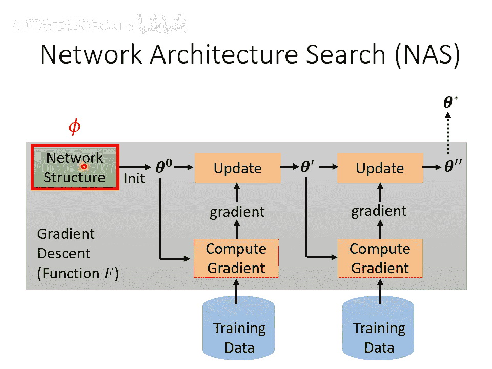

其实验首先在MNIST上训练并测试（网络架构相同），结果不错。但更进一步的测试是：训练时使用单层网络（40个单元），测试时使用两层网络，发现仍然有效；然而，当训练时使用Sigmoid激活函数，测试时改为ReLU激活函数时，学出的优化器就失效了。

---

## 学习网络架构

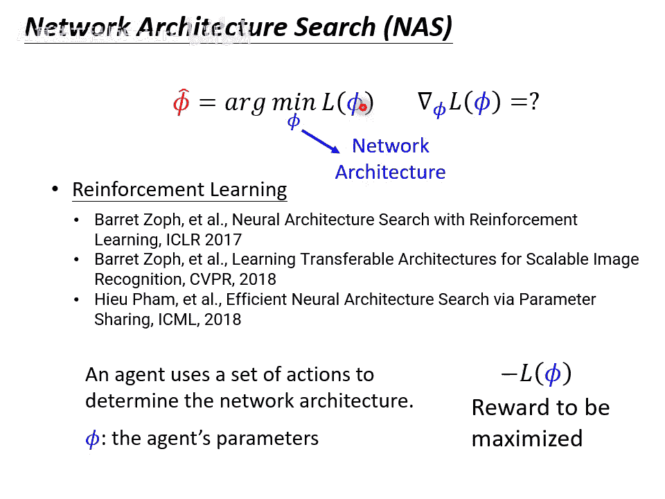

刚才讲了可以训练初始化参数和优化器。那么，能不能训练**网络架构**呢？当然可以。这系列研究就是鼎鼎大名的 **神经网络架构搜索（Neural Architecture Search, NAS）**。

在元学习框架下，如果我们将网络架构 **F** 作为学习目标，就是在做NAS。我们需要找到一个 **F** 来最小化损失 **L(F)**。但网络架构是离散的，无法直接计算梯度。

本课程反复强调：当你遇到无法计算微分的优化问题时，强化学习（Reinforcement Learning）可能是一个解决方案。如何用RL解决呢？将 **F** 视为智能体（agent）的参数，该智能体的输出就是网络架构相关的超参数（如每层滤波器的长、宽、步长、数量等）。然后训练这个智能体去最大化一个奖励（reward）。这里的奖励可以直接设为 **-L(F)**。因此，最大化奖励就等价于最小化损失 **L(F)**。

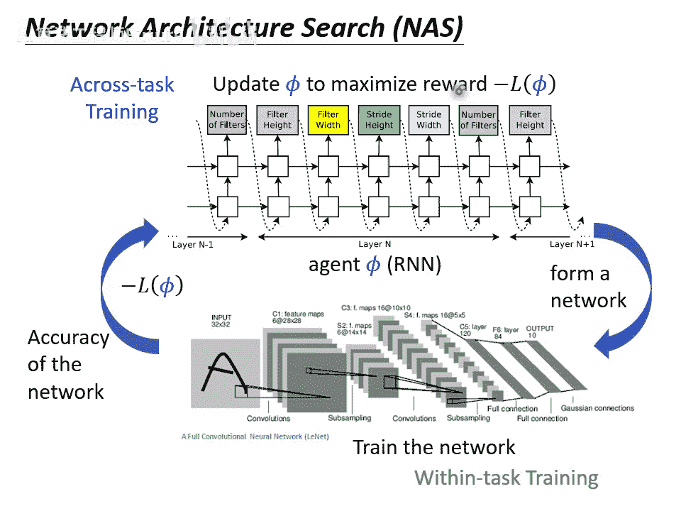

早期工作将智能体设计为循环网络（RNN），依次输出各层的架构参数，根据这些参数构建网络，训练该网络（即任务内训练），然后将网络在测试数据上的准确率作为奖励，来训练智能体（即跨任务训练）。这就是NAS的基本流程。

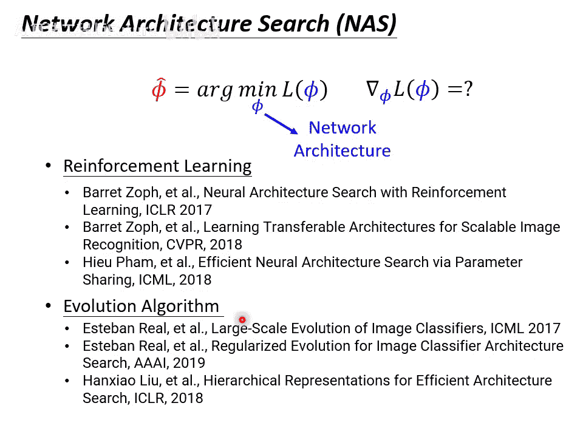

早期的NAS研究，训练和测试任务往往是同一个（例如都在CIFAR-10上）。但近年来，已有研究尝试让训练任务和测试任务不同。

除了强化学习，使用**进化算法（Evolutionary Algorithm）** 也是可行的。此外，还有一种经典方法 **DARTS（Differentiable Architecture Search）**，它通过使架构搜索问题可微分，从而可以直接使用梯度下降来优化。

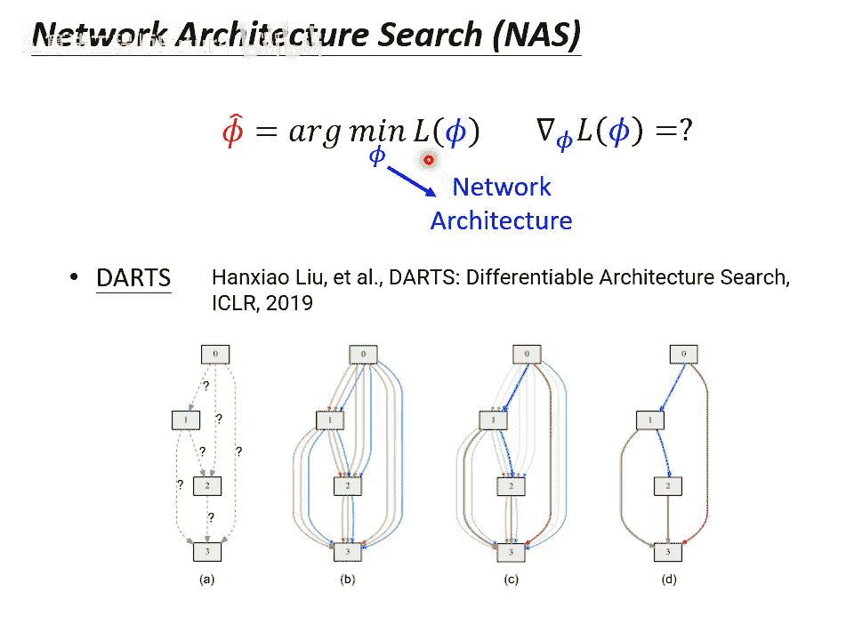

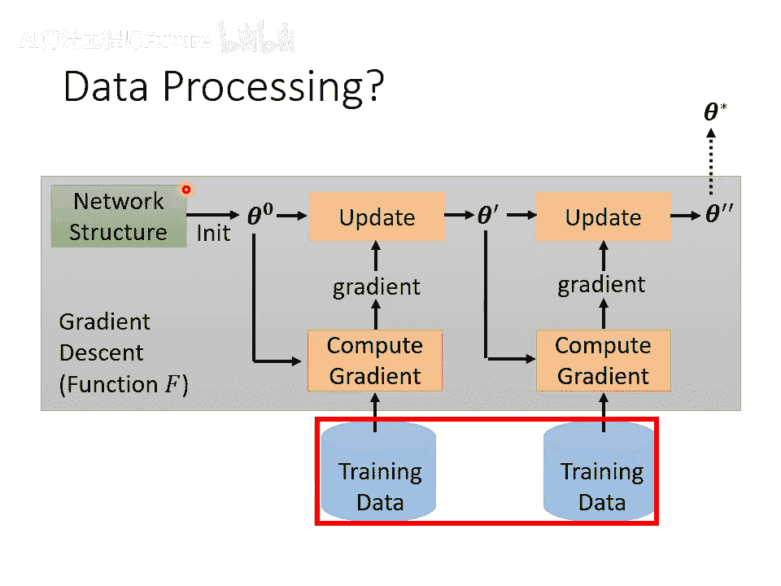

---

## 学习数据处理与样本权重

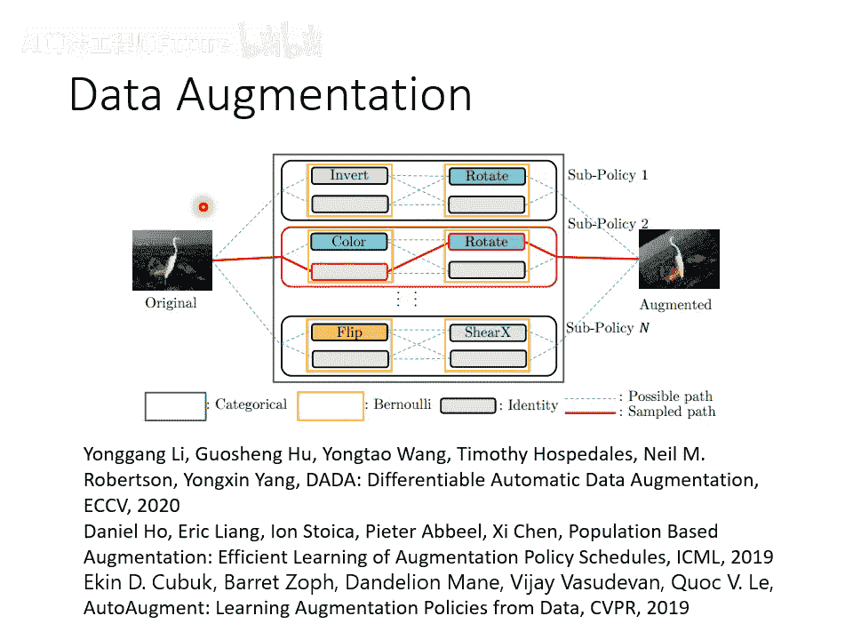

除了网络架构，还有什么可以学呢？**数据处理（Data Processing）** 也有可能被学习。

在训练网络时，我们通常需要进行数据增强（Data Augmentation）。目前的方法是通过试错来选择增强策略。那么，能否让机器自动学习如何寻找数据增强方法呢？是可以的，已有相关论文对此进行探索。

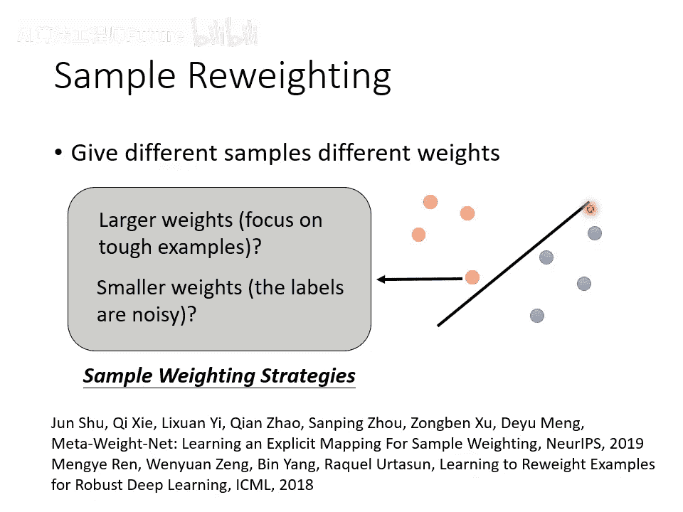

此外，在训练时，有时需要给不同的样本赋予不同的权重。但如何决定这个权重策略呢？例如，有人认为离决策边界近的困难样本应赋予更大权重；也有人认为这些可能是噪声标签，应赋予较小权重。我们可以通过元学习，让模型根据数据特性自动决定样本权重的设计策略。

---

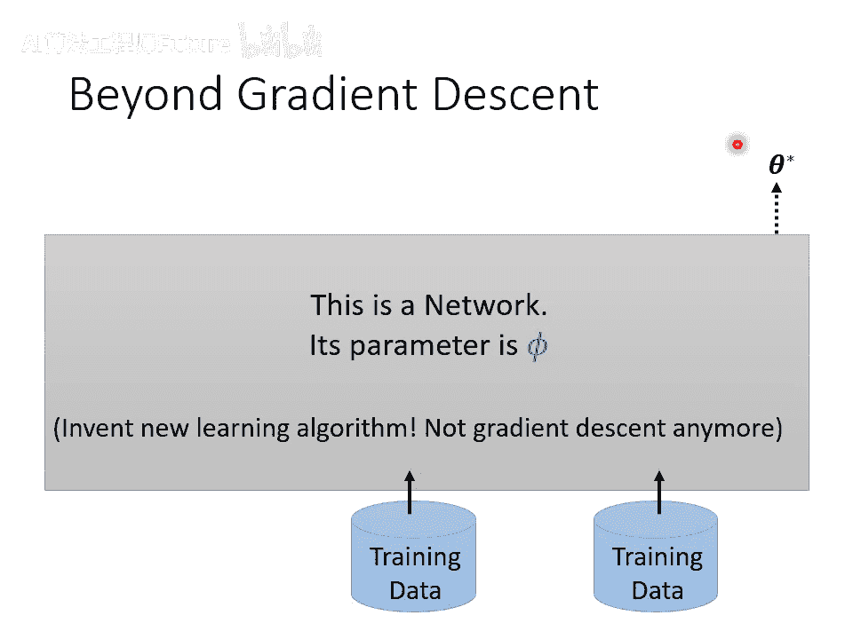

## 超越梯度下降：学习全新算法

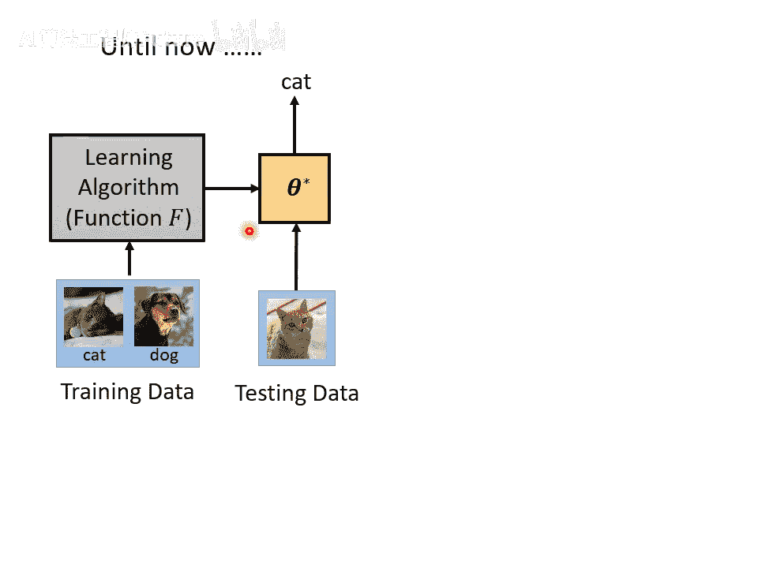

到目前为止，我们看到的方法都是基于梯度下降进行改进。我们学习了梯度下降的各个组件。但我们能否完全舍弃梯度下降呢？能否直接学习一个网络 **F**，它以训练数据作为输入，直接输出训练好的模型参数？如果实现，就意味着机器发明了全新的学习算法。

已有一些论文朝这个方向进展。更进一步，我们能否不再区分训练和测试阶段，而是将整个“情节”（Episode，即一次训练加一次测试）封装在一个网络里？

这是可能的。一个系列的元学习方法叫做 **学习比较（Learning to Compare）** 或 **基于度量的方法（Metric-based Approach）**。这类方法可以看作是将训练和测试数据一并输入网络，网络直接输出测试数据的答案，不再有显式的训练和测试分界。

---

## 元学习的应用与基准测试

最后，你可能会好奇：元学习技术真的有实际应用吗？它听起来非常科幻。

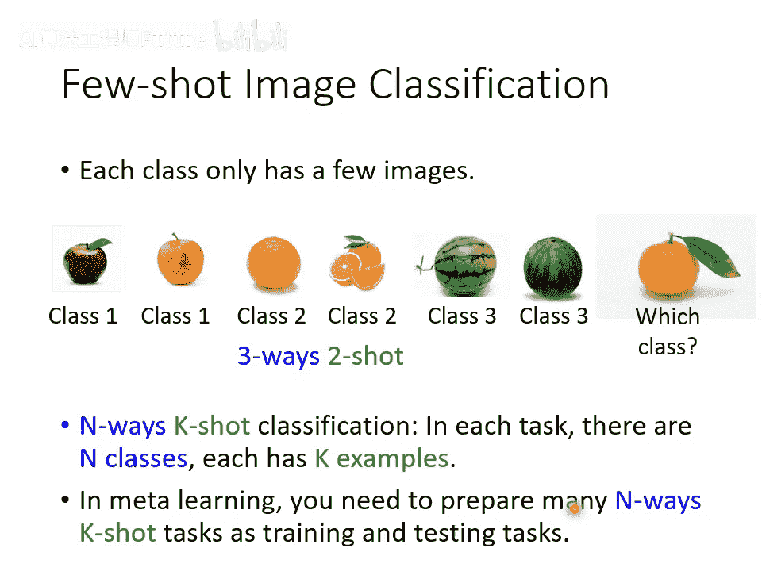

目前，测试元学习技术最常用的任务是 **小样本图像分类（Few-shot Image Classification）**。在这种任务中，每个类别只有很少的几张图片（例如，3个类别，每个类别2张图片），目标是利用这点数据训练模型，使其能对新图片进行分类。

这通常被称为 **N-way K-shot** 分类问题（N个类别，每个类别K个样本）。为了训练一个能处理N-way K-shot分类的元学习模型，我们需要准备大量此类任务作为训练任务。

文献中最常用的基准数据集是 **Omniglot**。它包含1623个不同的字符，每个字符有20个手写样本。研究者通常将字符集分为两部分：一部分用于构造训练任务，另一部分用于构造测试任务。构造任务时，从相应字符集中随机选取N个字符，每个字符采样K个样本，即形成一个N-way K-shot任务。

你可能会问，这种任务有什么用？它本身可能没有直接用途，但元学习并非只能用于Omniglot。

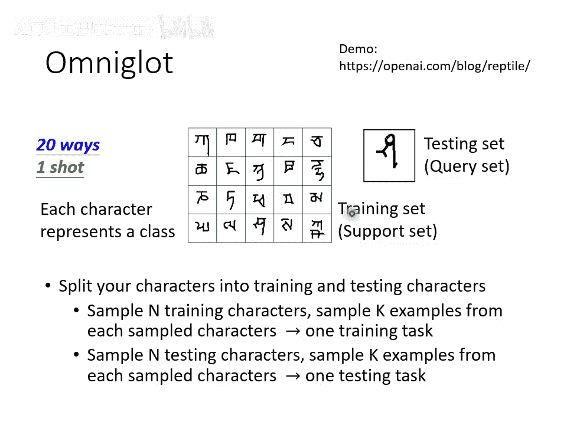

上表列举了元学习在语音和自然语言处理领域的应用，包括语音事件检测、关键词识别、文本分类、语音转换、序列标注、机器翻译、语音合成等。这表明，学界已开始将元学习推向更复杂的任务。我们可以期待元学习技术在未来现实应用中的发展。

---

## 总结

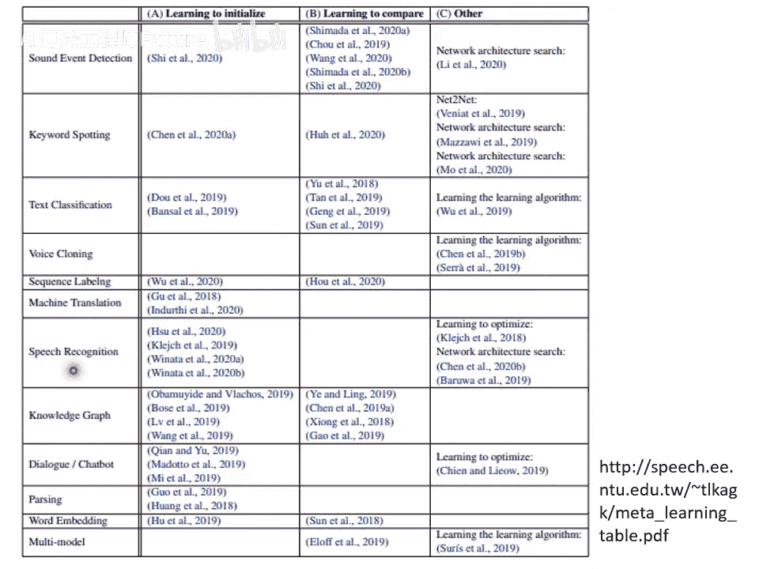

本节课中，我们一起深入探讨了元学习的各种具体应用。我们从梯度下降的组件出发，学习了如何通过元学习来优化**初始化参数**（如MAML）、**优化器**、**网络架构**（NAS）、**数据处理策略**乃至**样本权重**。我们还展望了超越梯度下降、学习全新算法的可能性，并了解了元学习在**小样本学习**等任务上的基准测试与实际应用潜力。元学习展现了“学习如何学习”的强大能力，是机器学习领域一个充满前景的方向。
