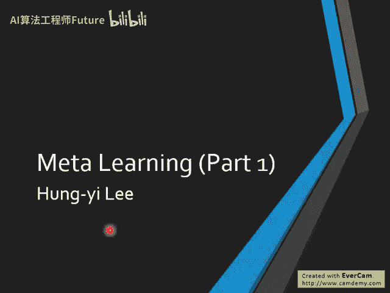
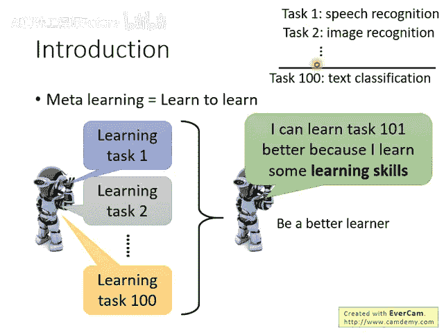
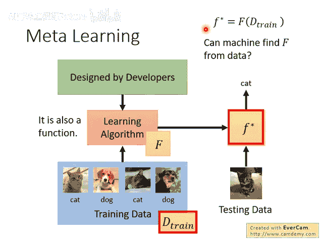
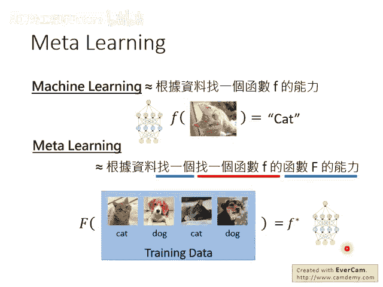
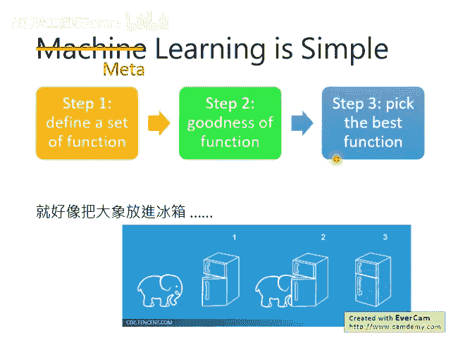

# 94：4-Meta Learning – MAML (1-9) 🧠

在本节课中，我们将要学习元学习（Meta Learning）的基本概念，特别是模型无关元学习（MAML）的核心思想。我们将了解元学习与传统机器学习、少样本学习有何不同，并理解其“学会学习”的本质。

---

## 什么是元学习？

元学习对多数人来说是一个新的概念。

元学习要讲的是“学会学习”（Learn to Learn）。我们今天可以让机器去做学习，而我们下一步要让机器做的事情，不只是它可以做学习这件事，而是它可以学习如何去做学习这件事。

举例来说，我们期待做到的事情是：机器学过一大堆任务以后，它根据在过去的任务上面所汲取的经验，变成了一个更厉害的学习者。往后如果有一个新的任务，它可以学习得更快，因为它从过去的任务里面，学习到了新的学习技巧。

举例来说，过去它看到的任务可能是教机器做语音辨识，教机器做影像辨识。之后，再教它做文字分类的时候，它可能会做得更好。虽然做文字分类这件事，跟影像跟语音可能没有太直接的关系，但是机器在过去的任务里面，它学到了“怎么学习”这件事。它并不是学会了更会做语音辨识或影像辨识，然后因此让文字辨识做得更好。而是它从这些任务里面，不只是学到了怎么做某些特定的任务，而是学习到了“学习”这件事本身。所以未来有新的任务，它就可以学得更快。

---

## 元学习与少样本学习的区别

讲到元学习，有人可能会觉得听起来跟我们之前讲过的少样本学习（Few-shot Learning）有点像。确实没有错。

在讲少样本学习的时候，我们也讲说要让机器先看过一大堆任务，然后希望它在新的任务上仍然可以做得好。少样本学习与元学习不一样的地方是：在少样本学习里面，我们是不断地用同一个模型在做学习，我们期待的是同一个模型可以同时学会很多技能。

元学习的着眼点是不一样的。在元学习里面，不同的任务我们仍然有不同的模型，仍然是每一个任务有一个自己的模型。但我们期待的是，机器可以从过去的学习经验里面学到一些东西，使得它在未来要创建一个新的模型的时候，可以训练得更快更好。这个是元学习的精神。

---

## 元学习的具体目标

实际上元学习要做的是什么呢？我们先来回忆一下机器学习这件事。

机器学习在做什么呢？你可以想成是：我们有一个学习的算法（Learning Algorithm），这个算法是人设计的。这个学习算法把训练资料当做输入。假设你现在要做猫狗辨识器，那就给它一些训练资料（一堆标注了猫或狗的图片），丢给这个学习算法，它就吐出一个函数（Function）。在我们一般的案例里，假设是训练一个CNN，它就是吐出CNN的参数。用梯度下降（Gradient Descent）这个算法，用反向传播（Back Propagation）这个算法跑下去，它就吐出CNN的参数。你有这个参数，你就得到了一个函数，就可以拿来辨识新的影像。这是我们所学到的机器学习。

元学习是要做什么呢？在元学习里面，你把学习的算法也想成是一个函数。我们用大写的 **F** 来表示这一个学习的算法。这个算法，它吃进去的是训练资料，它吐出来的是另外一个函数。在这个例子里面，它就是吐出一个函数，这个函数可以拿来做猫狗的影像辨识。这听起来很神奇：我们的学习算法，其实可以把它想成一个函数，输入资料，输出就是你现在要找的那个可以拿来做影像辨识的函数。

而元学习要做的事情，就是让机器自动地找出这个学习的算法，自动地找出这个以资料（Data）当做输入、可以吐出另外一个函数的函数 **F**。

---

## 用公式理解两者的区别

所以，如果要用一句话来概括机器学习的话：**机器学习就是让机器具备根据资料，找出我们要它找的某一个函数 `f` 的能力**。我们在第一堂课就已经告诉过大家这件事。

那元学习是什么呢？**元学习就是让机器根据资料，找一个能找出函数 `f` 的函数 `F` 的能力**。你可能不知道这句话在讲什么，所以我们把这句话做一下文法剖析。

我们先看一下外面的这个部分：我们现在要机器有能力去找一个函数 `F`（大写的函数）。这个大写的函数 `F` 它具备什么样的能力呢？这个大写的函数 `F`，它的能力是要去找一个小写的函数 `f`。然后这个小写函数 `f` 可以用在机器学习里面，比如说拿来做影像辨识。

我们要找一个大写的 `F`，这是机器现在要做的事。他要找一个大写的 `F`，然后这个大写的 `F`，他的能力是他可以找出小写的 `f`，然后拿来做你想要他做的事情。

讲得更具体一点：元学习就是我们要找一个大写的函数 `F`。这个函数的输入就是你的训练资料，输出就是训练后的模型。举例来说，它就吐出一个神经网络（如果你用神经网络来当做你的模型的话）。如果想更具体一点，输出就是神经网络里面的参数。然后把这个参数拿去做种种你要做的事情。这个就是元学习。

所以，机器学习跟元学习，它们都是要让机器去找一个函数，只是要找的函数，以及这个函数要做的事情是不一样的。

---

## 元学习的三个步骤

所以我们说机器学习就是三个步骤（这也是开学第一周就给大家看过的）：先定义一个函数集合（Function Set），然后定义一个评价函数好坏的指标（也就是损失函数 Loss Function），最后找一个最好的函数（用梯度下降找出最好的函数）。

其实元学习也就是一样的，它也是找一个函数。

你只要把我们这三个步骤里面的“函数”这个词汇，通通替换成“学习算法”（大写的 **F**）。所以大写 **F** 就是一个学习的算法。你把我们这三个步骤里的“函数”都替换成“学习算法”，这个就是元学习。

元学习要做的事情就是：

1. 我们先定义一个学习算法的集合（Set of Learning Algorithms）。
2. 我们定义一个学习算法的损失函数（Loss Function for Learning Algorithm），它告诉你说哪些算法比较好，哪些算法不好。
3. 最后再优化一番，去找出最好的学习算法。

这个就是元学习。

---

## 总结

本节课中，我们一起学习了元学习的基本概念。我们了解到元学习的核心目标是“学会学习”，即让机器从大量任务中学习如何更高效地学习新任务。我们区分了元学习与少样本学习的不同之处：少样本学习关注单一模型的多任务适应，而元学习关注如何获得一个能快速为新任务生成好模型的学习算法。最后，我们通过与传统机器学习三步骤的类比，理解了元学习同样遵循定义集合、定义损失和优化寻找的框架，只是操作的对象从具体的预测函数 `f` 变成了更抽象的学习算法 `F`。
