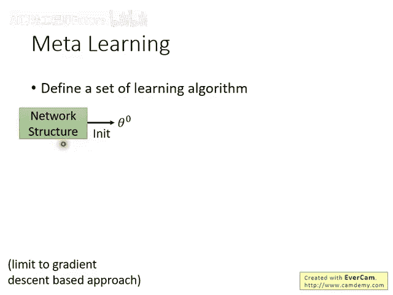
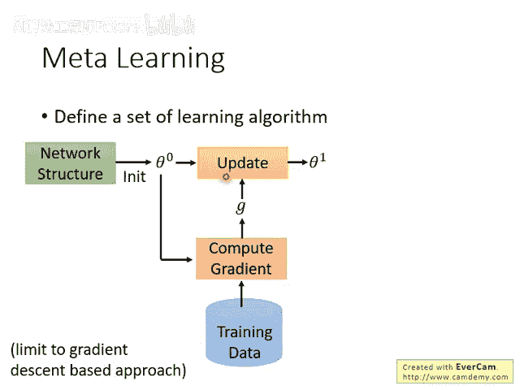
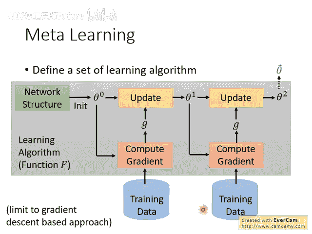
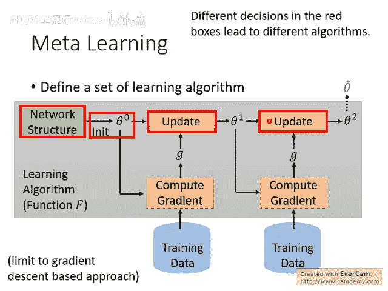
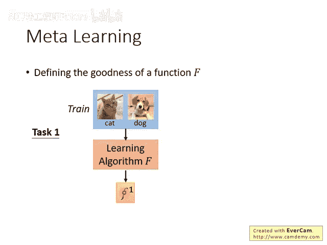
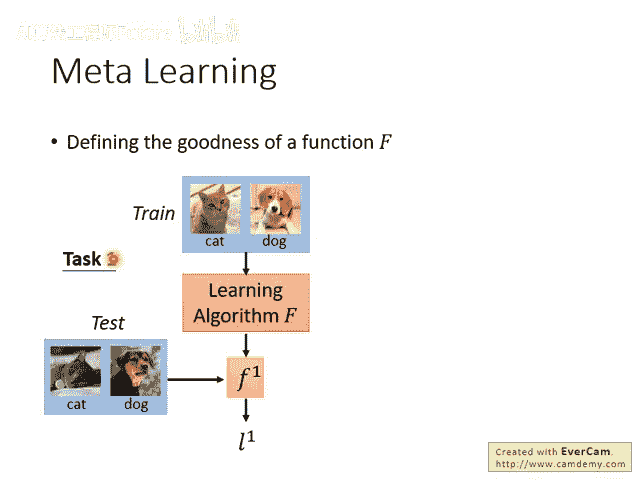
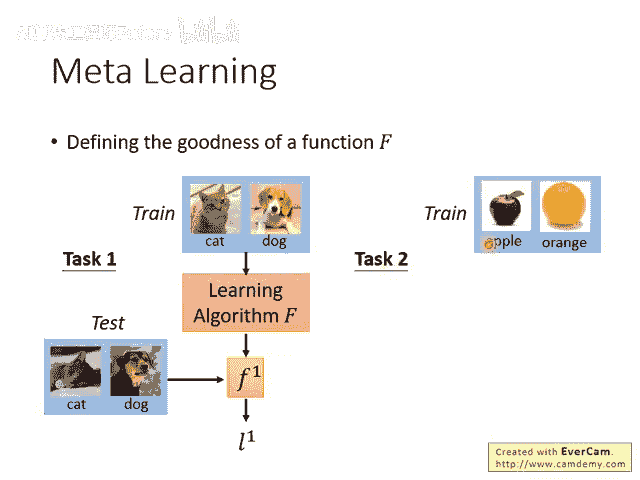
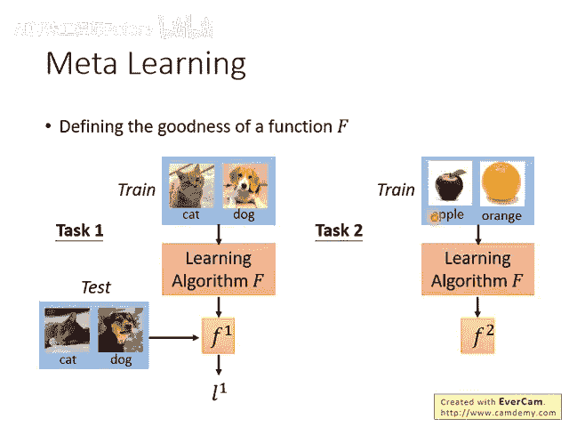
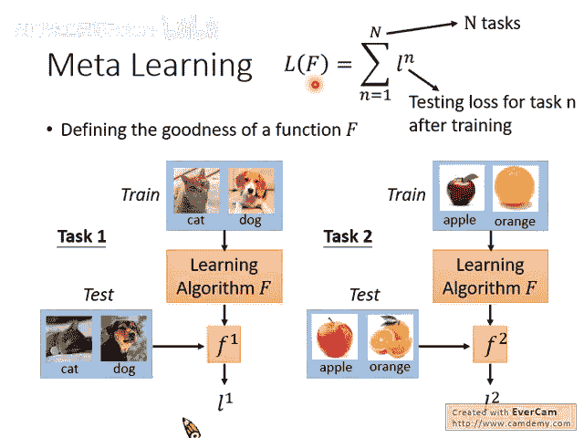

# 95：Meta Learning – MAML (2-9) 📚

## 概述

在本节课中，我们将要学习元学习（Meta Learning）的核心思想，特别是模型无关元学习（MAML）方法的前两步。我们将理解如何定义一组学习算法，以及如何评估这些算法的好坏。

---

## 第一步：准备一组学习算法 🧠



上一节我们介绍了元学习的目标，本节中我们来看看如何具体实现。第一步是准备一组学习算法。

在深度学习中，定义一个函数集意味着确定网络架构。当你确定网络架构时，你就有了一个函数集。那么，什么是一组学习算法呢？



我们先来看一下一般常用的学习算法，例如梯度下降是如何工作的。

梯度下降的步骤如下：

1. 定义一个网络架构，这是人为设定的。
2. 初始化参数，通常是从某个分布中采样数值作为初始参数。
  


1. 根据初始参数和训练数据计算梯度（用 `G` 表示梯度）。
2. 使用梯度更新初始参数。更新方法是将梯度乘以一个小的学习率，然后用初始参数减去这个乘积，得到新的参数。
  



1. 根据新的参数再次计算梯度（注意，此时的梯度 `G` 与之前不同，因为参数变了）。
2. 再次更新参数。
3. 重复多次后，输出最终训练得到的参数，我们称之为 `θ`。
  

整个训练过程可以看作一个函数 `F`。这个学习算法 `F` 的输入是训练数据，输出是最终训练结果。

在这个训练过程中，许多步骤都是人为设计的：

- 网络架构是人设计的。
- 初始参数的产生方式也是设计的，而不是学习出来的。
- 得到梯度 `G` 后如何更新参数 `θ0` 也是人设计的（例如，可以调整学习率，选择 Adam、SGD 等不同的梯度下降变体）。

因此，在我们常用的梯度下降学习算法中，这些红色方块的部分都是人为设计的。




当我们选择不同的设计时，实际上就得到了不同的学习算法。元学习的目标，就是探索这些红色方块中是否有部分可以不由人设计，而让机器自己学习。

例如，我们可以放宽对参数初始化的设计。不同的初始化值会导致不同的学习结果，因此不同的初始化值就可以被视为不同的学习算法。我们能否不让机器使用人为定义的方法来寻找初始参数，而是让机器自己学习出对于训练网络而言最好的初始参数？如果可以做到这一点，就算是实现了元学习的一部分。

我们可以认为，不同的初始参数就等同于不同的学习算法。当我们不预设初始参数应如何产生、不预设它应该是什么样子时，我们实际上就拥有了一个学习算法集合。

---

## 第二步：评估学习算法的好坏 📊

上一节我们定义了学习算法的集合，本节中我们来看看如何从中选出最好的算法。第二步是评估一个学习算法的好坏。

在原来的机器学习中，我们定义一个损失函数来评价一个函数的好坏。在这里，要评价一个学习算法 `F` 的好坏，我们同样可以定义一个损失函数。

如何定义这个损失函数呢？我们怎么知道一个学习算法是好是坏？方法就是实际拿这个学习算法去学习一些任务，看看它解决问题的能力。

具体步骤如下：

1. 首先，选取一个任务（例如，任务一是猫和狗的分类任务），并准备一些训练数据。
2. 使用我们要评估的学习算法 `F`，将训练数据输入，经过学习后得到一个函数（模型），我们用 `f1` 表示这个学习结果。
  


1. 为了衡量这个学习结果的好坏，我们需要测试集。将任务一的测试数据输入函数 `f1`，得到一个结果，我们用 `L1` 表示这个结果（例如，损失值）。

然而，仅用一个任务和测试集是不够的。也许这个算法只是特别擅长解决任务一，而不擅长其他任务。因此，你需要准备一组任务来衡量学习算法的好坏，就像在机器学习中需要用大的训练集来评估一个函数的好坏一样。

以下是评估过程：

- 你需要一个任务集合，包含一大堆任务。
- 假设我们有任务二（例如，分类苹果和橘子）。
  
- 学习算法 `F` 会针对任务二找出另一个函数 `f2`。
  


- 任务二也有测试数据，将其输入 `f2` 可以得到在任务二上的表现，用 `L2` 表示。
  


- 这里，`L1` 和 `L2` 可以理解为函数在各自任务测试集上的损失值。


假设我们总共有 `N` 个任务。我们有一个学习算法 `F`，让它去学习这 `N` 个任务。对于每个任务 `n`，我们都可以计算出一个损失值，用小写 `l^n` 表示。

把我们手上所有的任务，用这个学习算法得到函数后再进行测试，将所有得到的损失值加起来，得到总损失 `L`。

```

```

我们用这个总损失 `L` 来评估一个学习算法的好坏。要知道一个学习算法 `F` 好不好，就把它代入总损失函数 `L(F)` 中计算。`L(F)` 的值越小，就代表这个学习算法 `F` 越好。

这就是第二步：我们能够定义出一个评价学习算法的标准。

---

## 总结

本节课中我们一起学习了元学习MAML方法的前两个关键步骤：

1. **定义学习算法集合**：通过放宽对训练过程中某些环节（如参数初始化）的人为设计，形成一个由不同算法构成的空间。
2. **评估算法好坏**：通过让候选算法在多个任务上进行学习并测试，用其在所有任务上的总损失来量化评估其性能。


通过这两个步骤，我们为后续寻找最优学习算法奠定了基础。
