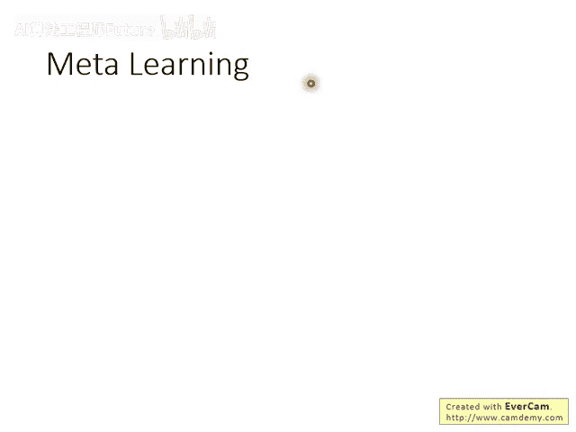
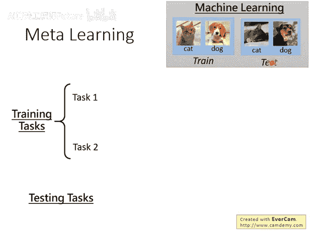
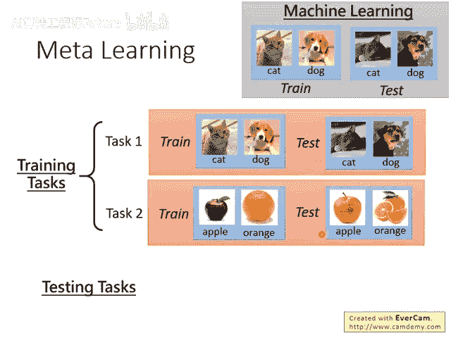
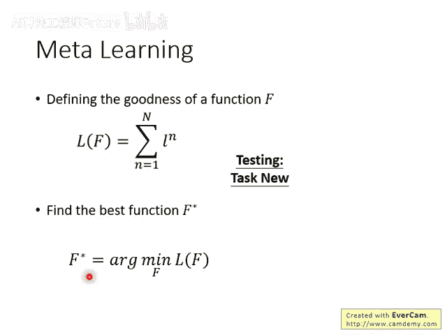
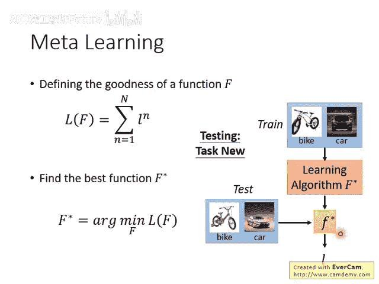

# 96：元学习 – MAML (3-9) 🧠

## 概述

在本节课中，我们将要学习元学习的基本概念，并将其与传统的机器学习进行对比。我们将重点介绍元学习如何通过训练任务来学习一个通用的学习算法，并了解其与少样本学习的紧密联系。最后，我们会引入一个著名的元学习方法——MAML。

---

## 元学习与机器学习的区别

上一节我们介绍了元学习的基本思想，本节中我们来看看它与传统机器学习在训练数据上的根本区别。

在传统机器学习中，假设你要进行猫狗分类，你需要准备大量的训练图像和测试图像。

在元学习中，你准备的不是训练数据和测试数据，而是训练任务和测试任务。每个任务内部都包含自己的训练资料和测试资料。

## 任务集的构成

以下是关于任务集构成的详细说明。

你需要准备大量的训练任务。虽然图中只展示了任务一和任务二，但实际训练可能需要成百上千个训练任务。每个任务都是一个“示例”。

每个任务内部都包含训练资料和测试资料。

除了训练任务，你还需要准备测试任务。测试任务应与训练任务不同。有时我们还需要验证任务或开发任务。

在传统机器学习中，为了避免过拟合，我们会从训练集中切分出验证集来调整参数。在元学习中，如果你有参数需要调整，你需要从训练任务中切分出一些任务作为验证任务，并用这些验证任务来决定如何调整参数。

## 元学习与少样本学习

元学习常与少样本学习一起讨论和使用。少样本学习是指在执行某个任务时，每个类别只提供极少量的数据。

例如，在进行猫狗分类时，只给机器看一张猫的图片和一张狗的图片，就希望它能学会区分。这取决于所使用的元学习算法。

## 学习算法的通用性

接下来，我们探讨元学习算法的通用性限制。

如果使用MAML这类算法，它会限制所有任务的模型结构必须相同。但这并非绝对要求，一些更通用的算法可以学习如何更新参数。

例如，学习如何设置学习率这件事就与模型本身无关。因此，确实有人尝试在训练时全部使用图像分类任务，而在测试时使用语音识别或翻译任务，并取得了一些成果。

这取决于你的元学习算法是什么样子。有的算法要求训练任务和测试任务的模型结构必须相同，而有的则允许不同。

## MAML方法简介

在我们即将讲解的MAML方法中，其学习算法仍然是基于梯度下降的。因此，它的整个流程就是执行梯度下降。

MAML所做的是自动找出一个对所有任务都最好的初始参数值。之后更新这些初始参数的过程，仍然使用与普通梯度下降一模一样的算法。

当然，也存在一些更激进的做法，例如直接使用一个神经网络，输入训练数据，输出模型参数。这个算法本身就是一个网络结构，它直接输出另一个网络的参数。

## 算法细节与灵活性

关于算法的细节，还有几点需要说明。

即使在MAML中，所有不同任务的网络架构都一样，但如果损失函数不同，其实仍然可以运行。虽然在文献中未见有人进行这样的测试，但在MAML算法中，即使不同任务的损失函数定义不同，无论是交叉熵还是回归损失，都没有问题，也是可以运行的。

这取决于你如何定义元学习的目标函数。假设你的目标函数定义为：固定更新参数的次数，然后看损失能下降多少。那么你学习到的可能就是更新参数的策略。

但假设你学习的算法是：更新参数多少次都没关系，而是取决于参数收敛后最终的小损失值是多少。那么你学习到的可能就是一个比梯度下降更厉害的算法，它可能避开局部最小值，从而得到更小的损失值。

## 实际应用与课程安排

我知道讲到这，大家可能觉得听起来非常神奇和抽象。等一下如果我们讲一些实际的例子，会更清楚地说明元学习是如何实际运作的。但元学习的方法真的非常多，所以我们不会只在一堂课中讲完，可能会持续两周以上。

今天只是先介绍一个最知名的方法——MAML，以及它的一个变体——Reptile。其实还有很多其他内容，我们下周再讲。

## 为何常与少样本学习搭配

元学习之所以常与少样本学习搭配使用，原因如下：要检验一个学习算法好不好，你需要跑完整个训练流程才知道。假设每次训练都需要很长时间，那么验证一个想法就会变得非常低效。

因此，在元学习中，往往假设我们处于少样本学习场景。也就是说，每个任务的训练资料都非常少，这样你就可以非常快地完成训练过程。

有人可能注意到，课程网站上有时说是少样本学习，有时说是元学习。这是因为我在犹豫应该以哪个为主轴来讲。我最终决定以元学习为主轴。

## 术语区分：支持集与查询集

在少样本学习中，我们通常不会把一个任务内的训练资料和测试资料简单地称为训练集和测试集，有时会使用其他名字。

在少样本学习文献中，我们往往把训练资料叫做**支持集**，把测试资料叫做**查询集**。为什么需要取别的名字呢？因为每个任务内部的训练集，这些任务合起来又是元学习的训练集。如果都叫训练集，在写文章或讲课时就会混乱。

所以在文献上，很多人会说，我们不要把这些任务内部的训练集叫做训练集，改名为支持集，测试集改名为查询集。我这里的讲法是，每个任务内部仍然有训练集和测试集，但我们不把这些任务整体叫做训练数据，而是说它们是训练任务和测试任务。

## 元学习的优化目标与测试流程

定义了元学习的损失函数后，接下来我们就要寻找最好的学习算法。

最好的学习算法 `F*` 是代入元损失函数 `L` 后，能计算出最小损失值的那个算法。这需要解决一个优化问题：寻找一个 `F`，使得 `L(F)` 的值最小。这个能让 `L(F)` 值最小的 `F` 就是 `F*`。

找到 `F*` 后，训练就完毕了，接下来进行测试。

测试任务中一样有训练资料。你把这些训练资料丢进 `F*`，`F*` 会找出一个具体的函数 `f*`。

接下来，你把测试任务中的测试资料用这个具体的函数 `f*` 来进行测试，看看结果如何。

---

## 总结

本节课中，我们一起学习了元学习的基本框架。我们了解了元学习与传统机器学习在数据组织形式上的核心区别，即通过大量任务进行学习。我们探讨了元学习与少样本学习的紧密联系，以及MAML方法的基本思想。最后，我们明确了元学习的训练目标是找到一个通用的学习算法 `F*`，并将其应用于新任务的流程。
