# 97：元学习 – MAML (4-9) 🧠

在本节课中，我们将学习元学习（Meta Learning）中的一个重要概念：如何评估元学习模型。我们将介绍一个名为Omniglot的基准数据集，并详细解释如何用它来设计和评估小样本学习任务。

---

## 概述：元学习的基准数据集

在机器学习领域，评估模型性能需要标准化的基准数据集。例如，在图像识别领域，MNIST数据集常被用作基准。在元学习领域，一个广泛使用的基准数据集叫做 **Omniglot**。

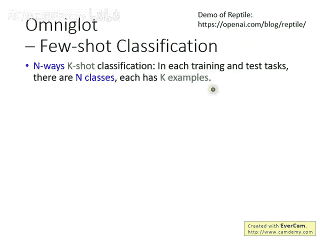

上一节我们介绍了元学习的基本思想，本节中我们来看看如何具体地评估一个元学习算法。

## Omniglot数据集介绍

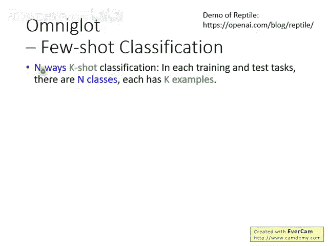

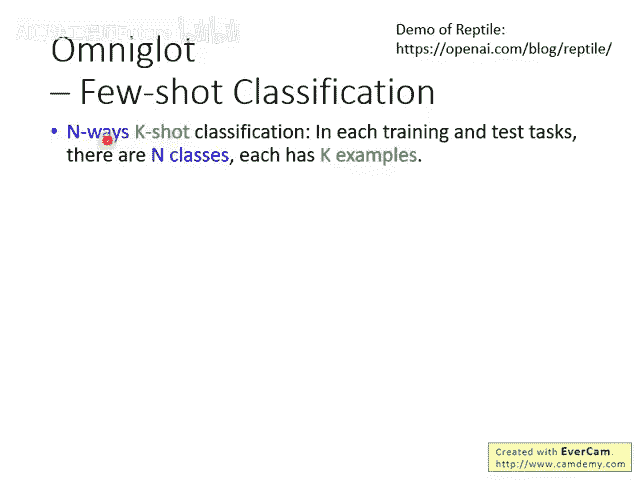

Omniglot数据集包含1623个不同的手写字符（或称“符号”），这些字符来自全球各种不同的书写系统。每个字符都有20个不同的范例，由20个不同的人书写而成。因此，每个字符类别下都有20个样本，这为小样本学习提供了理想的数据基础。

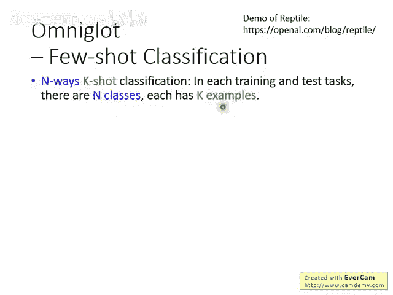

下图展示了数据集中的部分字符以及某个字符的20个不同书写样本：

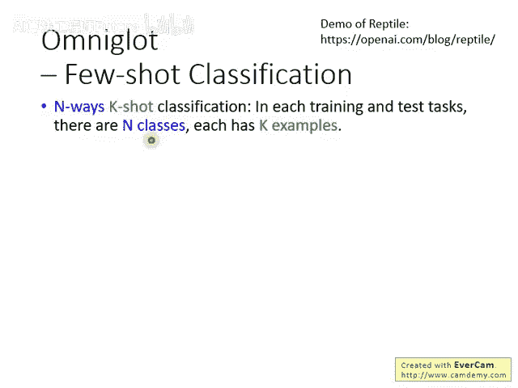

## 小样本学习任务：N-way K-shot

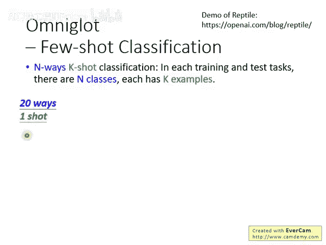

Omniglot数据集通常被设计用于 **小样本分类** 任务的测试。使用前，你需要定义任务的“way”和“shot”。

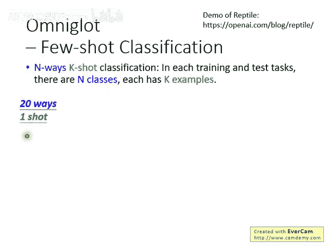

以下是这两个核心概念的定义：

- **Way**：指分类任务中包含多少个不同的类别（Class）。
- **Shot**：指每个类别提供多少个训练样本（Example）。

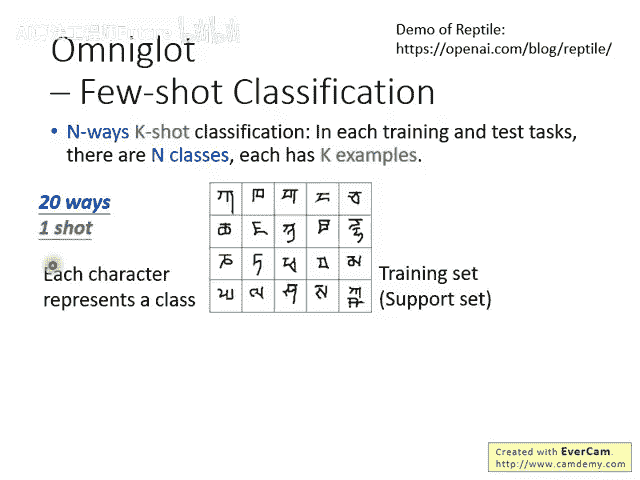

因此，一个 **N-way K-shot** 分类任务，就是指一个包含N个类别、每个类别有K个训练样本的分类问题。

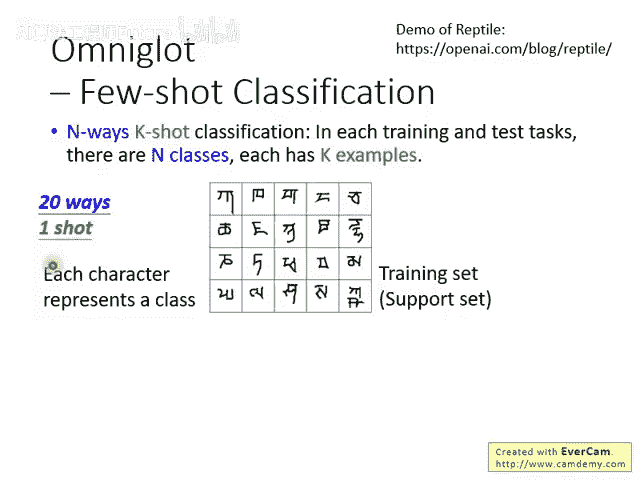

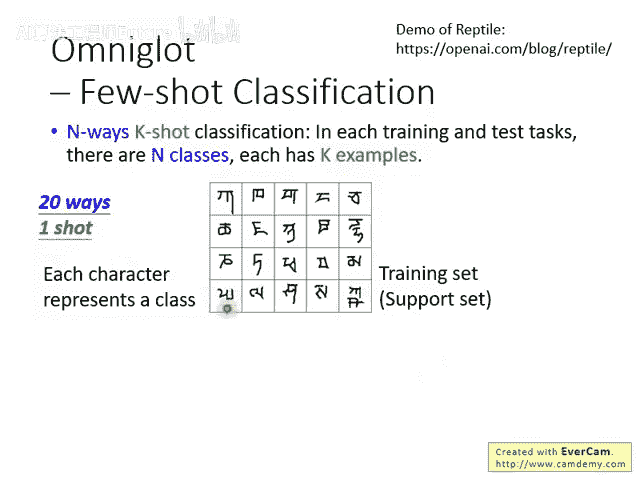

举例来说，一个 **20-way 1-shot** 任务意味着：

- 该分类问题总共有20个不同的类别。
- 每个类别只提供 **1个** 训练样本。

你的训练数据看起来会像这样：总共有20个不同的符号，每个符号（代表一个类别）只提供一个范例。目标就是让机器学习出一个能对这20个类进行分类的系统。

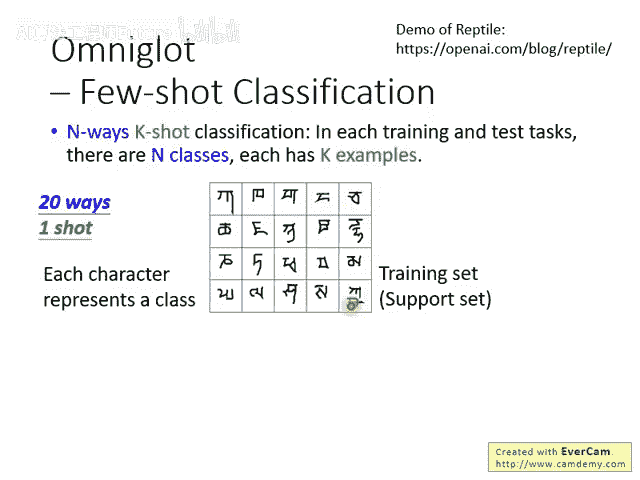

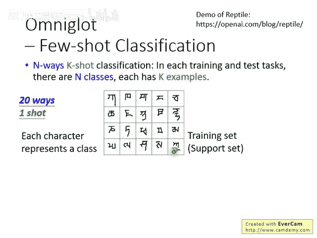

如果直接用这20张图片和普通方法训练，模型很可能会失败。而元学习的目标，就是学习出一个强大的学习算法（Learning Algorithm），这个算法能够做到只看每个类别的一个例子，就能很好地完成新任务。

在测试时，过程与一般分类相同：输入一张新的图片，模型需要判断它属于这20个类别中的哪一个。

## 人类的小样本学习能力

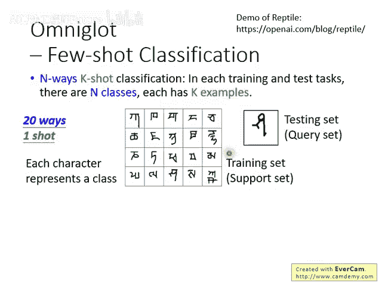

人类在小样本学习上表现非常出色。你可以尝试一下这个1-shot学习任务：根据上面提供的20个类别各1个样本，判断下面这张测试图片属于哪个类别？

（经过思考，人类通常能根据形状相似性，例如像“豌豆射手”，做出合理判断。正确答案是其中一个类别。）

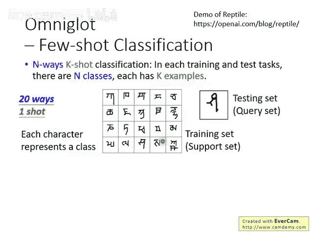

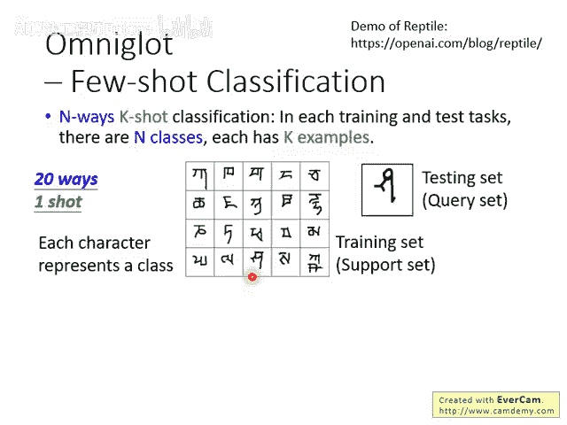

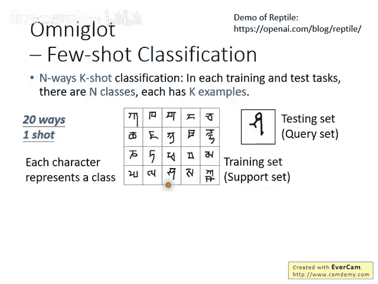

## 数据划分与任务构建

在实际训练元学习模型时，需要将Omniglot的1623个字符划分为不同的集合。

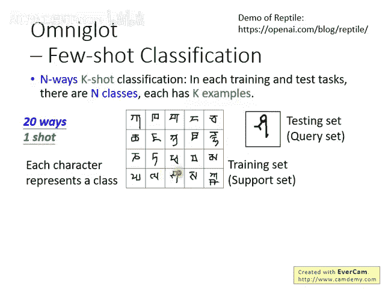

常见的划分方式是：

1. **训练集（Training Set）**：从1623个字符中选取1200个字符。
2. **测试集（Test Set）**：剩下的字符作为测试集。
3. **验证集（Validation Set，可选）**：可以从训练集字符中再划分一部分用于验证。

划分好字符集后，就可以构建用于元学习的训练任务和测试任务了。以下是构建方法：

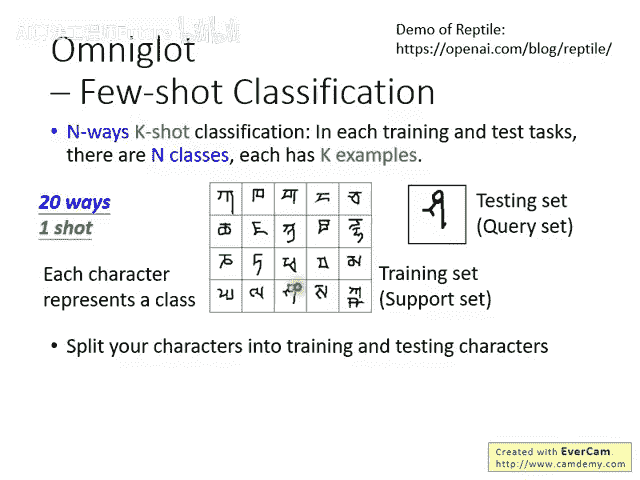

假设你要构建一个 **N-way K-shot** 的训练任务：

1. 从 **训练集字符** 中，随机抽取 **N** 个不同的字符。
2. 对于每个被抽中的字符，从其20个范例中随机抽取 **K** 个样本。
3. 这些样本就构成了一个元学习训练任务。

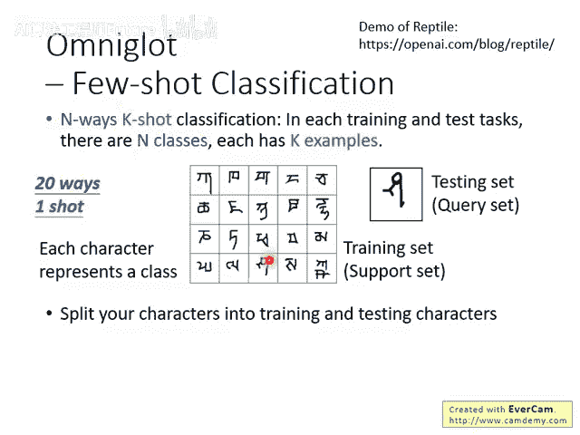

你需要构建大量这样的训练任务来训练元学习模型。测试任务的构建方式完全相同，唯一的关键区别是：**测试任务中的字符必须从测试集字符中抽取**，以确保训练和测试所用的字符没有重叠，这样才能公平评估模型的泛化能力。

为了让概念更具体，网络上可以找到使用Omniglot数据集的演示程序。

---

## 总结

本节课中我们一起学习了元学习的评估方法。我们介绍了Omniglot这一重要的小样本学习基准数据集，详细解释了N-way K-shot任务的定义，并说明了如何划分数据及构建元训练与元测试任务。理解这些内容是应用和评估MAML等元学习算法的基础。
