# 98：Meta Learning – MAML (5-9) 🧠

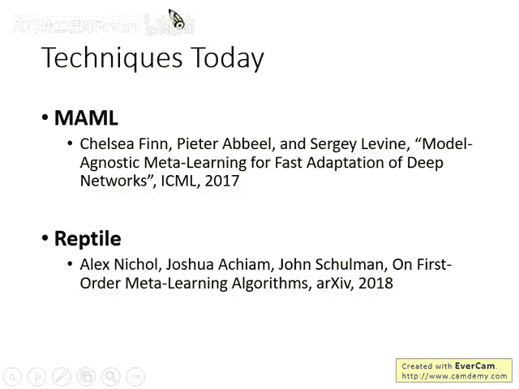

## 概述

在本节课中，我们将学习元学习的两个核心方法：MAML和Reptile。我们将重点理解MAML如何通过学习一个最优的模型初始化参数，来使模型能够快速适应新任务。课程内容将涵盖MAML的基本思想、与模型预训练的区别，以及其在实际应用中的考量。

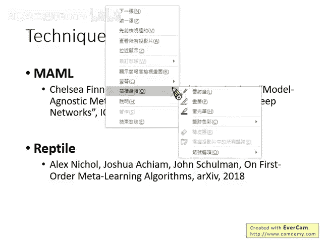

---

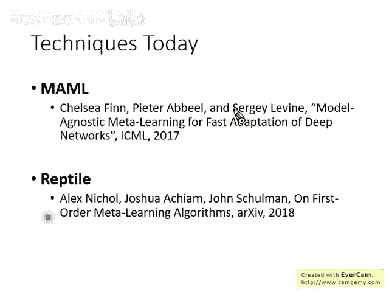

## MAML：模型无关的元学习 🐱

上一节我们介绍了元学习的基本概念。本节中，我们来看看一个具体且强大的方法——MAML。

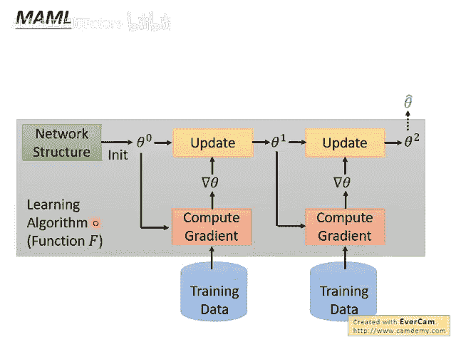

MAML的全称是Model-Agnostic Meta Learning，意为“模型无关的元学习”。其核心目标是学习一个最优的**模型初始化参数**（记作 **φ**）。传统的初始化参数通常是从某个分布中随机采样得到的，而MAML旨在通过元学习过程，自动找到一个最好的初始参数 **φ**。

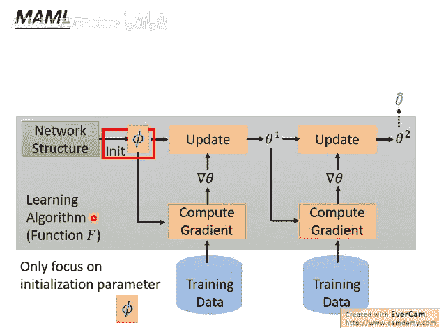

### MAML的目标函数

MAML通过定义一个损失函数 **L(φ)** 来衡量初始化参数 **φ** 的好坏。这个损失函数的计算过程如下：

1. 使用同一个初始化参数 **φ**，在 **N** 个不同的任务上进行训练。
2. 对于第 **n** 个任务，使用其训练数据和特定的学习算法（如梯度下降），从 **φ** 开始更新，得到针对该任务优化后的模型参数 **θ̂ⁿ**。
3. 将优化后的参数 **θ̂ⁿ** 在该任务的测试集上计算损失，记为 **Lⁿ(θ̂ⁿ)**。
4. 将所有 **N** 个任务上的损失相加，得到总损失 **L(φ)**。

其目标是最小化这个总损失 **L(φ)**。公式表示如下：  

**L(φ) = Σₙ Lⁿ(θ̂ⁿ)**  

其中，**θ̂ⁿ** 是通过在任务 **n** 上对 **φ** 进行更新得到的。

### 优化过程

最小化 **L(φ)** 的方法就是使用梯度下降。只要我们能计算出总损失 **L** 对初始化参数 **φ** 的梯度 **∇L(φ)**，就可以按照以下公式更新 **φ**：  

**φ ← φ - η * ∇L(φ)**  

其中 **η** 是元学习率。

需要强调的是，MAML要求所有任务使用相同的模型结构。每个小任务都是一个独立的训练过程，都需要用参数 **φ** 作为起点进行训练。

---

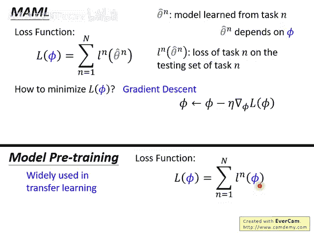

## MAML 与 模型预训练 的区别 🔄

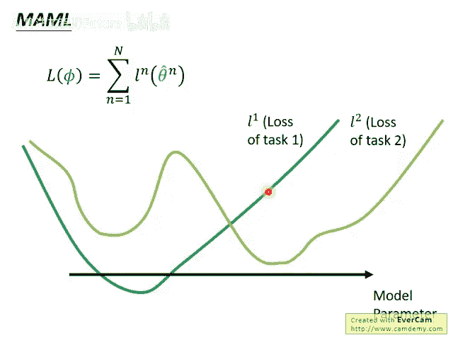

理解了MAML的目标后，你可能会想到另一种常见技术——模型预训练。它们有本质区别。

在迁移学习的模型预训练中，目标是在一个数据丰富的任务上训练模型，使其参数在该任务上表现良好，然后将其作为起点，在数据少的任务上进行微调。其损失函数关注的是**当前参数**在预训练任务上的表现。

而MAML关注的是**参数的潜力**。它不在意初始化参数 **φ** 在当前任务上表现如何，而在意 **φ** 经过少量步骤训练后，在新任务上能达到多好的性能。

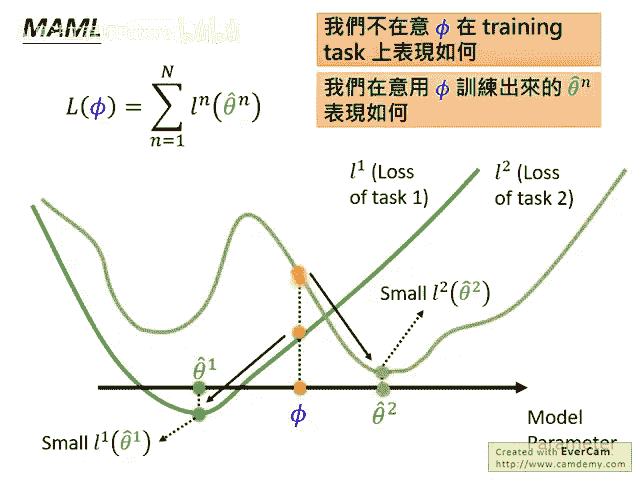

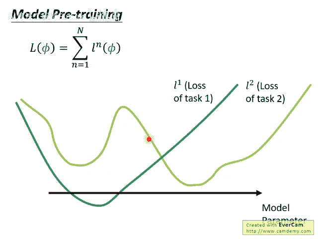

### 直观对比

我们可以用一个比喻来理解：

- **模型预训练** 好比大学毕业后直接工作，看重的是**立即获得回报**（当前参数表现好）。
- **MAML** 则好比选择攻读博士学位，看重的是**未来的发展潜力**（参数经过训练后表现好）。

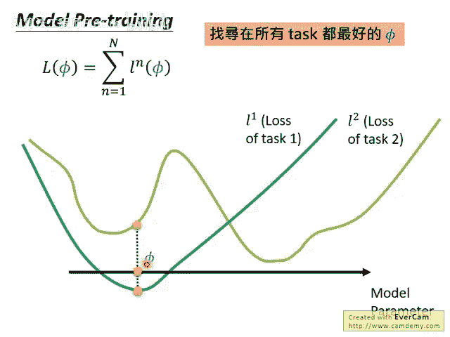

在优化目标上：

- 模型预训练寻找的是一个在多个训练任务上**当前表现**都好的 **φ**。
- MAML寻找的是一个在多个训练任务上**经过训练后表现**会好的 **φ**。这个 **φ** 本身可能表现平平，但它位于一个“易于优化”的位置，沿着各任务的梯度方向稍作更新，就能达到各自的最优点。

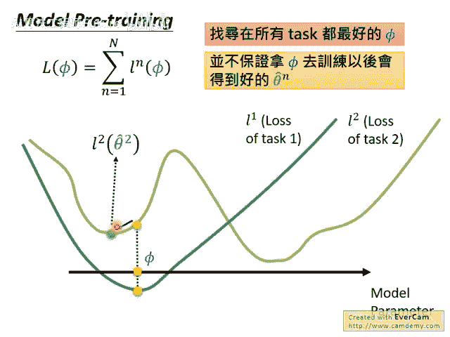

---

## MAML的实践细节 ⚙️

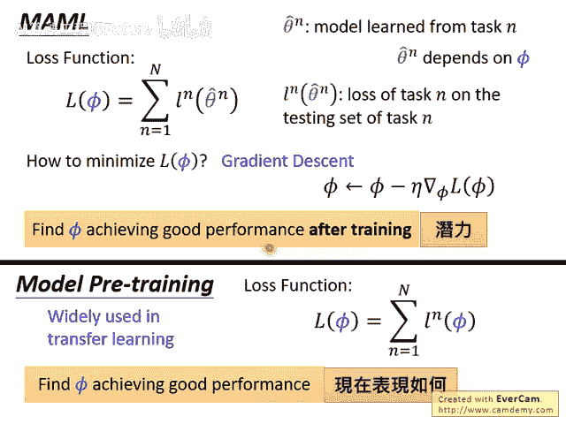

上一节我们厘清了MAML的核心思想。本节中我们来看看它在实现时的一些关键设计。

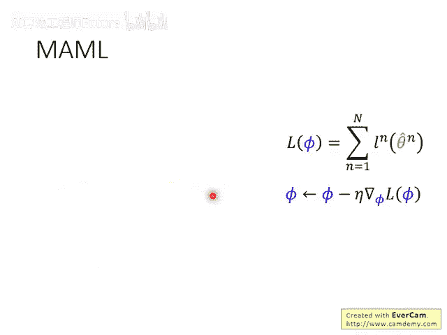

在MAML的原始论文中，有一个重要的简化假设：在元训练过程中，每个任务的内部训练（即从 **φ** 到 **θ̂ⁿ**）**只进行一次参数更新**。

### 更新公式

因此，**φ** 与 **θ̂ⁿ** 的关系可以明确地写出来。对于任务 **n**，其内部更新公式为：  

**θ̂ⁿ = φ - ε * ∇Lⁿ(φ)**  

其中：

- **ε** 是任务内部训练的学习率。
- **∇Lⁿ(φ)** 是任务 **n** 的损失函数在初始点 **φ** 处的梯度。

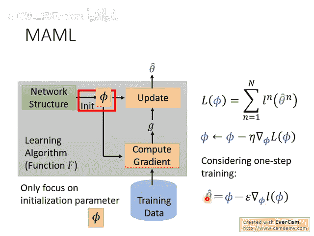

### 为何只更新一次？

以下是几个可能的原因：

以下是几个可能的原因：

1. **计算效率**：元学习的计算开销巨大。如果每个任务都需要成百上千次更新，整体训练将难以承受。
2. **设定高目标**：MAML旨在寻找一个“超级”初始化参数，理想情况下只需一次更新就能获得优秀性能，这代表了强大的快速适应能力。
3. **测试时灵活**：在元训练时，我们假设只更新一次。但在实际测试（解决新任务）时，我们可以根据需要进行更多次更新，以获得更好结果。
4. **防止过拟合**：在少样本学习任务中，数据量极少。限制更新次数有助于防止在少量数据上过拟合。

---

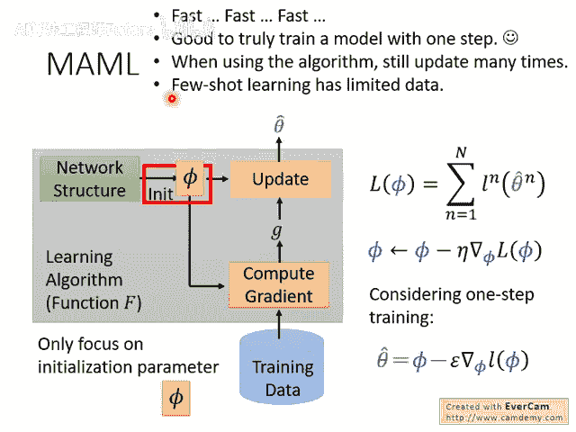

## 总结

本节课中我们一起学习了元学习的两个重要方法。我们深入探讨了**MAML**的原理，它通过学习一个最优的模型初始化参数 **φ**，使得模型能够通过极少的更新步骤快速适应新任务。我们明确了MAML与**模型预训练**的关键区别：前者关注参数的“潜力”，后者关注参数的“现状”。最后，我们了解了MAML在实现中通常假设任务内部只进行一次梯度更新的设计考量及其原因。理解MAML为掌握更广泛的元学习与快速适应算法奠定了坚实基础。
