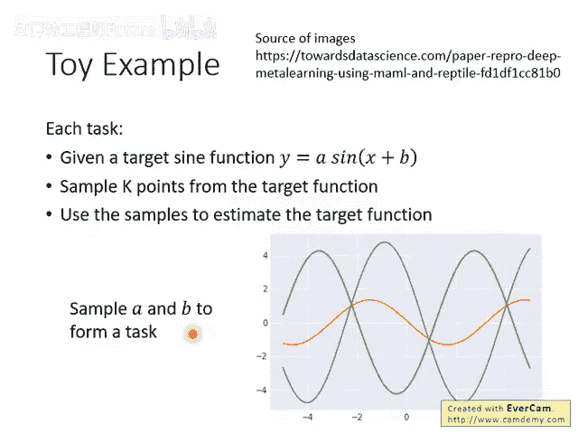
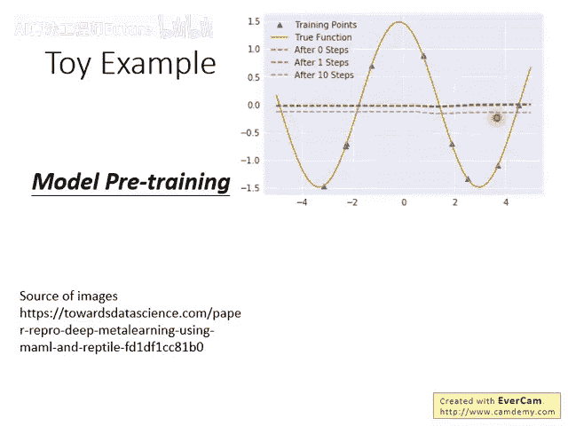

# 99：9-Meta Learning – MAML (6-9) 🤖

在本节课中，我们将学习元学习（Meta Learning）中的经典算法——MAML（Model-Agnostic Meta-Learning）。我们将通过一个具体的玩具示例，直观地对比MAML与传统迁移学习（Transfer Learning）在思想与效果上的核心差异，并了解MAML在Omniglot和Mini-ImageNet数据集上的应用表现。

---

## MAML与迁移学习的直观对比 🧩

上一节我们介绍了MAML的基本思想，本节中我们来看看一个具体的例子，它清晰地展示了MAML与基于模型预训练（Model Pretraining）的迁移学习有何不同。这个示例改编自MAML原始论文，但以下图示和解释使其更加易于理解。

我们的任务设定如下：

- 每个任务都涉及一个正弦函数：**`y = a * sin(x + b)`**。
- 其中，**`a`** 代表振幅（Amplitude），**`b`** 代表相位（Phase）。
- 每个任务中，我们从该正弦函数中随机采样 **`K`** 个数据点，作为该任务的训练数据。
- 目标是根据这 **`K`** 个点，学习一个回归模型，使其预测的曲线尽可能接近真实的 **`y = a * sin(x + b)`** 曲线。

通过采样不同的 **`a`** 和 **`b`** 组合，我们可以制造出大量不同的训练任务和测试任务。




### 模型预训练（迁移学习）的结果

首先，我们观察模型预训练方法在这个任务上的表现。上图中，橙色曲线代表测试任务的真实正弦函数。我们从该曲线采样一些点（如图中数据点），并希望模型能拟合出这条曲线。

- **绿色虚线**：表示模型预训练后得到的**初始参数** `θ` 所对应的函数。它是一条水平线。
- **原因分析**：在预训练阶段，目标是找到一个在所有训练任务上平均表现最好的初始参数。训练任务包含了许多不同振幅和相位的正弦函数。当这些形态各异的正弦波被平均叠加后，其结果就趋近于一条水平线。因此，预训练得到的初始模型就是一个“平均值”模型。
- **局限**：这个初始参数（水平线）对于新任务来说是一个很差的起点。即使我们利用新任务的少量数据（Support Set）对这个初始模型进行几步梯度更新（Fine-tuning），它也很难快速拟合出具有特定波形的新正弦函数，可能只是进行平移，效果不佳。

### MAML的结果

接下来，我们看看MAML算法在相同任务上的表现。



- **绿色虚线**：表示MAML训练完成后得到的**初始参数** `θ`。它并非水平线，已经具备了一定的波形结构。
- **红色实线**：当我们使用测试任务的少量数据，对这个MAML初始化模型**仅进行一次梯度更新**后得到的结果。可以看到，红色曲线已经能够大致捕捉到橙色目标曲线的波峰和波谷位置。
- **紫色实线**：在测试阶段，我们当然可以进行多步梯度更新。上图展示了更新10步后的结果，紫色曲线与目标橙色曲线拟合得更好。

**核心对比**：这个示例生动地说明，MAML学习到的初始参数 `θ` 本身可能不是一个在任何任务上表现都好的“平均模型”，但它是一种**对梯度更新非常敏感、易于快速适应**的表示。而传统的模型预训练得到的则是一个僵化的“平均解”，难以快速调整。


---

## MAML在标准数据集上的应用 📊

在MAML的原始论文中，作者也在Omniglot和Mini-ImageNet这两个少样本学习（Few-Shot Learning）标准数据集上验证了其有效性。

### 在Omniglot上的表现

Omniglot数据集包含来自多种文字的大量字符。少样本分类任务通常定义为“N-way K-shot”问题，即每个任务有N个类别，每个类别提供K个样本。  

以下是MAML与其他元学习方法的对比结果（性能通常以分类准确率衡量）：

```
MAML 在 5-way 1-shot 和 5-way 5-shot 任务上均取得了领先的性能。
```

### 在Mini-ImageNet上的表现

Mini-ImageNet是ImageNet数据集的子集，常用于少样本图像分类研究。其任务设置与Omniglot类似，例如“5-way 1-shot”表示每个任务有5个物体类别，每类提供1张训练图片。  

论文中的实验结果表明：

```
MAML 在 Mini-ImageNet 的少样本分类任务上同样表现最佳。
```

此外，论文中提到了MAML的两种变体：

1. **标准MAML**：计算二阶梯度（涉及Hessian矩阵）。
2. **一阶近似MAML (First-Order MAML)**：在元优化过程中忽略二阶导数，只使用一阶梯度进行近似，从而简化计算。

有趣的是，在许多实验中，一阶近似的MAML与标准MAML取得了**相近的性能**，但计算代价更低，这使其更具实用价值。

---

## 总结 ✨

本节课中，我们一起深入探讨了MAML算法：

1. 我们通过一个**正弦函数拟合的玩具示例**，直观对比了MAML与模型预训练（迁移学习）的本质区别。MAML追求的是**易于快速适应**的初始化，而非表现平均的初始化。
2. 我们了解到MAML在**Omniglot**和**Mini-ImageNet**这两个少样本学习基准数据集上都取得了优异的性能。
3. 我们知道了MAML存在一种实用的**一阶近似变体**，它在保持性能的同时降低了计算复杂度。

通过本讲，你应该对MAML如何实现“学会学习”有了更具体和形象的认识。
