# 100：元学习 – MAML (7-9) 🧠

在本节课中，我们将要学习元学习算法 MAML 中核心的梯度计算过程。我们将深入探讨如何通过梯度下降来优化元学习器的初始参数，并理解其中涉及的数学推导，特别是如何通过一阶近似来简化复杂的二次微分计算。

---

上一节我们介绍了 MAML 的训练目标，本节中我们来看看如何具体计算这个目标函数对初始参数的梯度。

我们的训练过程，即元学习器，通过梯度下降进行训练。我们需要计算初始参数 **φ** 对总损失函数 **L** 的梯度。

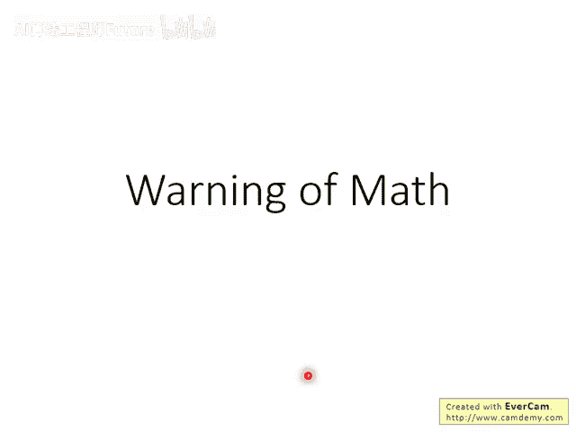

总损失函数 **L** 是所有任务上损失函数 **l** 的求和。这里的 **l** 是使用参数 **θ'** 计算出的损失，而 **θ'** 是将初始参数 **φ** 进行一次梯度更新后得到的模型参数。

接下来，我们实际计算这个梯度。

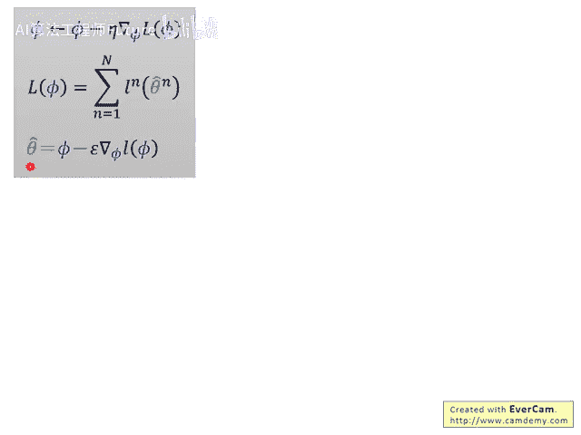

这个梯度应该是什么样子？

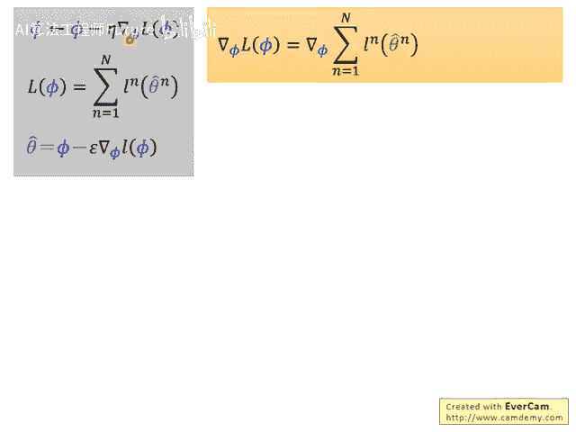

我们先将总损失 **L** 用对所有任务损失 **l** 的求和来替代。

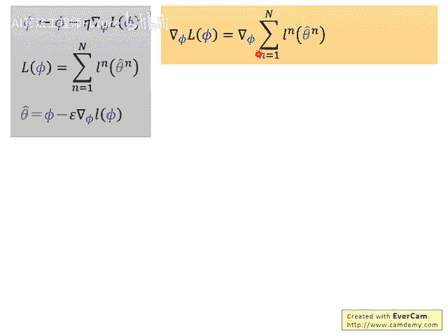

梯度算子可以移到求和符号内部。因此，我们接下来只需要计算对于某个特定任务，其损失函数 **l** 关于参数 **φ** 的梯度值。这个损失函数的值是使用参数 **θ'** 计算出来的。

那么，这个梯度的含义是什么？

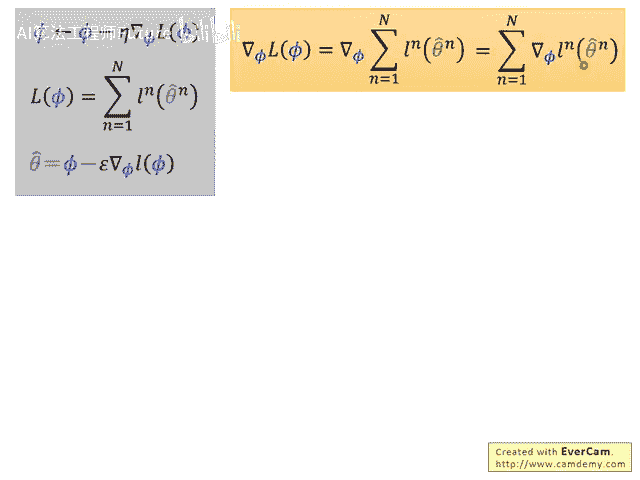

梯度是一个向量，它的每一个维度代表了某个参数对损失函数的偏微分结果。

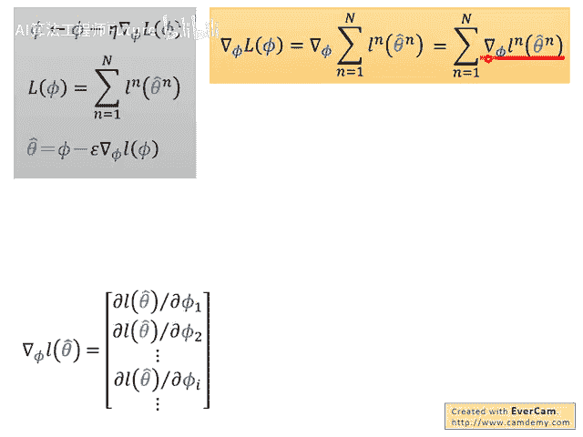

因此，计算 **φ** 对 **l(θ')** 的梯度。

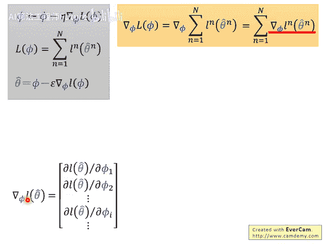

会得到一个向量。这个向量的第一个元素是 **φ₁**。

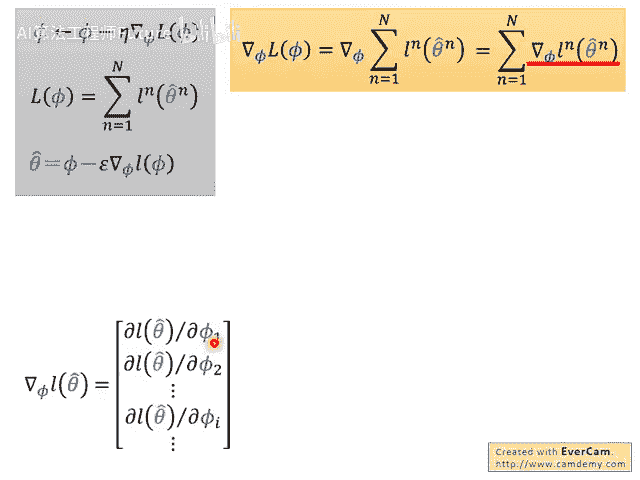

**φ₁** 是模型初始参数 **φ** 的第一个参数。

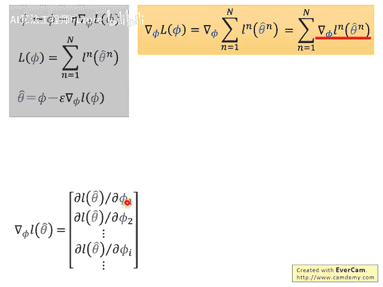

模型的初始参数包含许多权重和偏置值。将它们全部取出并拼接成一个向量。梯度向量的元素依次是：第一个参数对损失的偏微分，第二个参数对损失的偏微分，直到第 i 个参数对损失的偏微分。

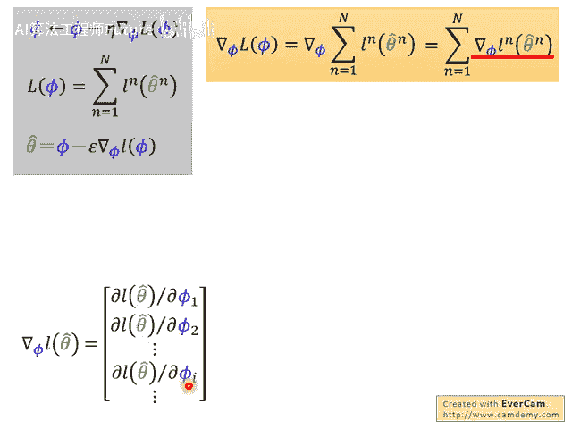

我们取其中一项来计算它应该是什么样子。

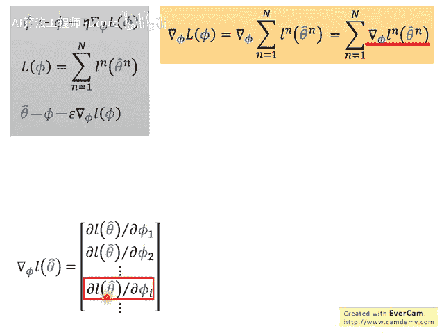

会计算其中一项，也就会计算其他项。

我们来计算 **φᵢ** 对 **l(θ')** 做偏微分的结果。

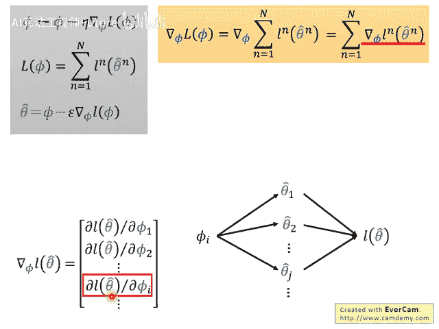

我们来看 **φᵢ** 与 **l(θ')** 的关系是什么。

偏微分的含义是：如果 **φᵢ** 发生微小变化。

**l(θ')** 会产生什么样的变化。

**φᵢ** 是初始参数，是训练开始时的参数。

这个初始参数会影响最终训练出来的结果。

也就是 **θ'**。最终训练出来的这个模型会影响最终计算出的损失。

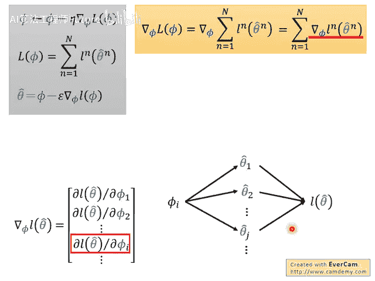

也就是 **l(θ')**。所以 **φᵢ** 是通过 **θ'** 里面的每一个参数。

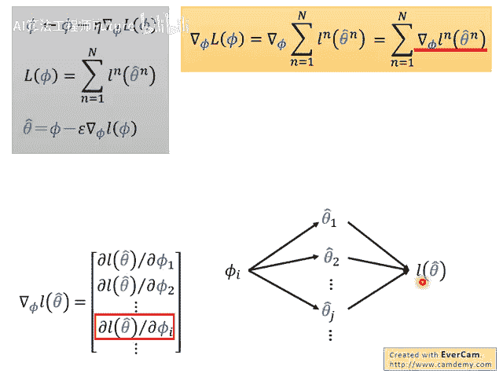

去影响了最终的损失函数值。

根据链式法则，**φᵢ** 对 **l(θ')** 的偏微分。

可以写成这样：对 **θ'** 中每一个参数的偏微分进行求和。

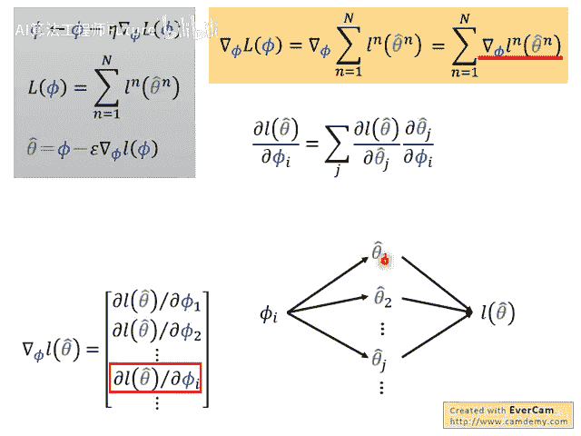

所以，**φᵢ** 对 **l(θ')** 的偏微分。

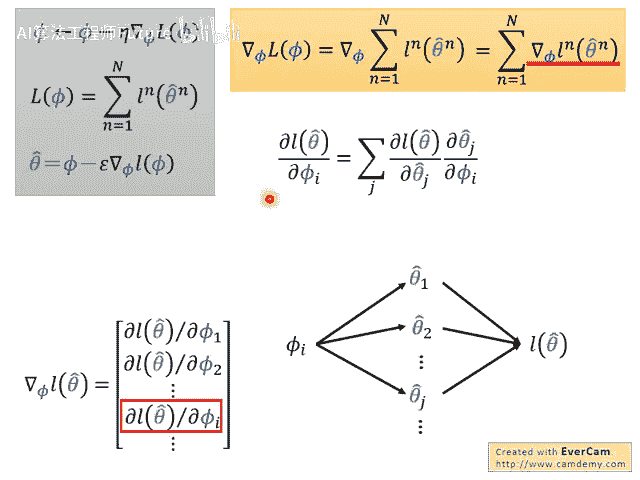

就是对 **θ'** 里面所有的参数 **j** 求和。

将 **θ'** 里面的第 **j** 个参数对 **l(θ')** 做偏微分。

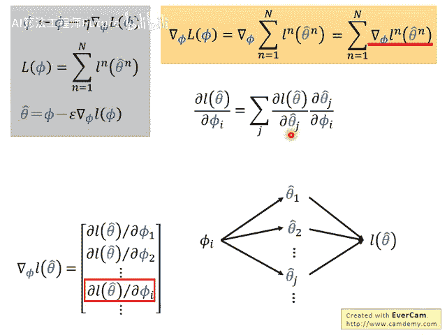

再将 **φᵢ** 对 **θ'ⱼ** 做偏微分，把它们乘起来。

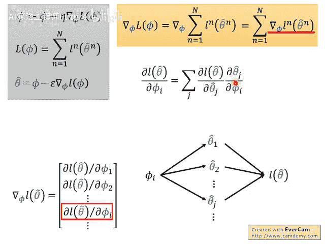

对 **θ'** 中所有的参数 **j** 求和就得到了结果。

**φᵢ** 对 **l(θ')** 的偏微分根据链式法则推导出来就是这个样子。

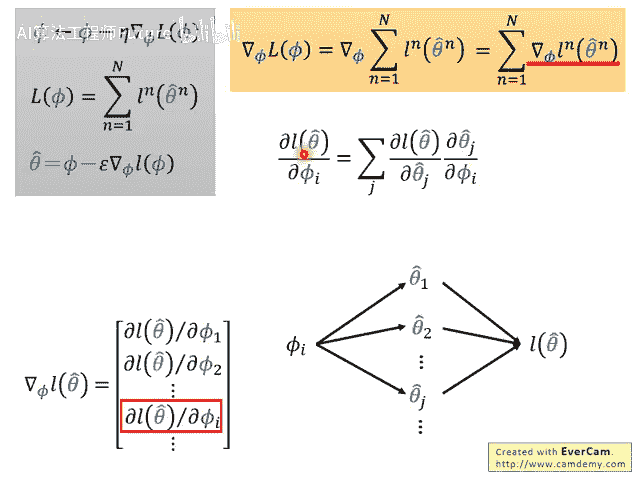

接下来，我们具体计算一下这一项应该是什么样子。

这一项应该长什么样子呢？前面这一项没有问题。

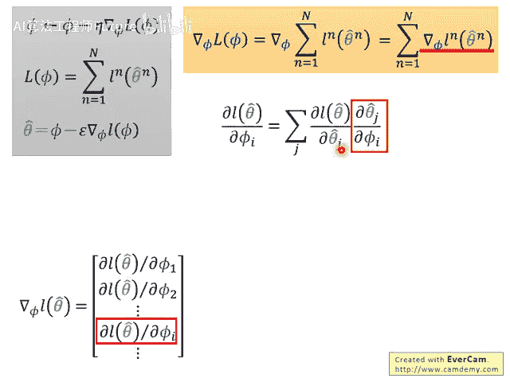

**θ'ⱼ** 对 **l(θ')** 的偏微分，这取决于你的损失函数 **l** 是什么样子，比如是交叉熵还是回归损失。它也取决于你用于测试的数据是什么样子。根据你的测试数据，可以算出 **θ'ⱼ** 对 **l(θ')** 的偏微分。

我们真正需要计算的是 **φᵢ** 对 **θ'ⱼ** 做偏微分以后的结果。

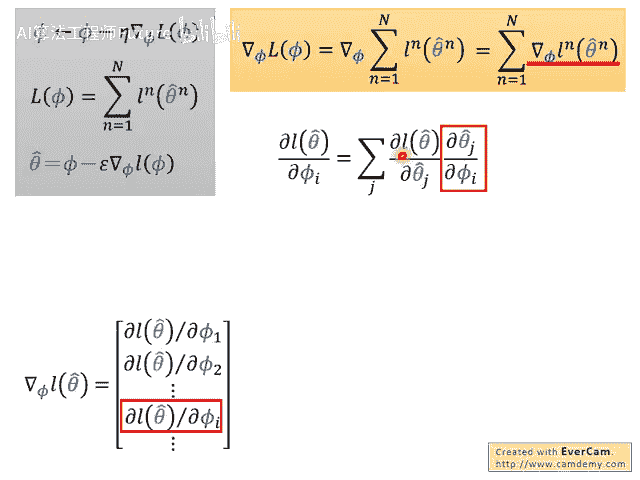

这可以分为两种情况来考虑。我们先将这个式子只考虑其中一维。

**θ'** 是一个向量。

**φ** 是一个向量，梯度也是一个向量。向量减向量得到向量。

我们取这个向量的第 **j** 维来看。

如果取这个向量的第 **j** 维来看。

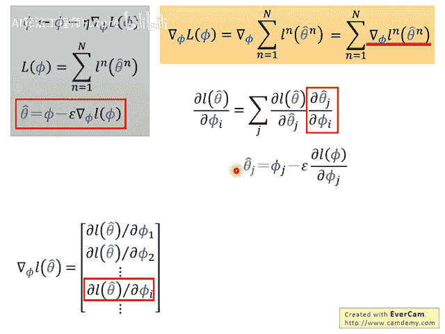

就是 **θ'ⱼ** 等于初始参数 **φ** 的第 **j** 维减去 **α**。

**α** 其实也是一个学习率。在元学习中实际上有两个学习率。

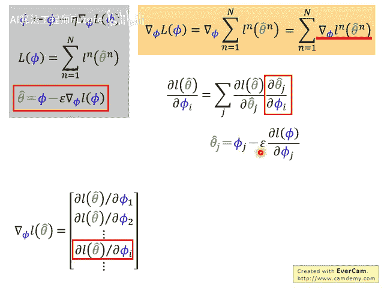

一个是每个任务内部训练时使用的学习率。

另一个是训练元学习器初始参数时使用的学习率。

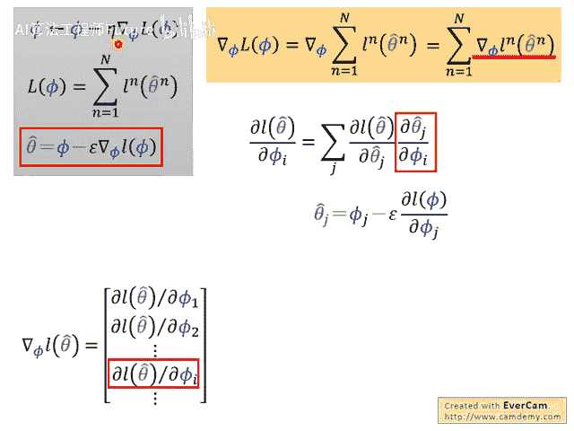

这两个学习率不需要相同，也没有理由必须相同。

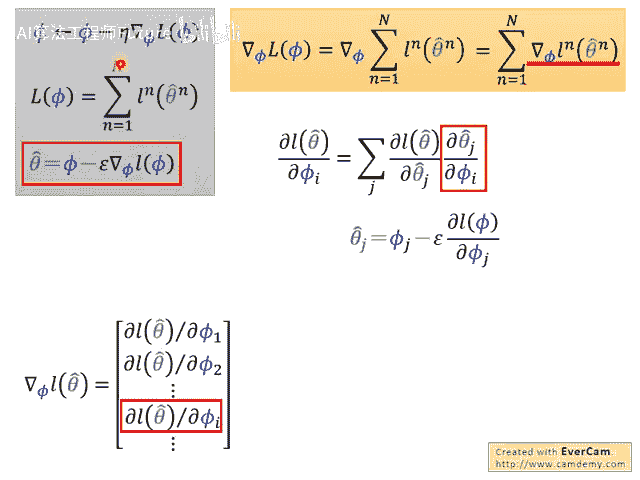

它们实际上也都是需要调整的超参数。

**θ'ⱼ** 等于 **φⱼ** 减去学习率 **α** 乘以 **θ** 对 **l(θ)** 的偏微分结果。

注意，这里不是 **θ'**，而是 **θ** 对 **l(θ)** 的偏微分。

如果 **i** 不等于 **j** 的时候。

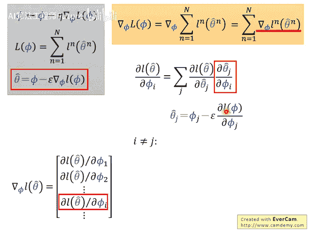

会发生什么事？如果 **i** 不等于 **j**，那你拿 **φᵢ** 对这个式子做偏微分。

会发生什么事？第一项 **φⱼ** 就直接消失掉了。

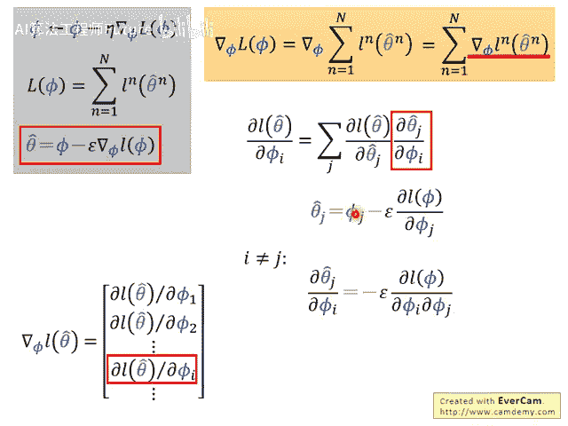

然后 **φᵢ** 对 **φⱼ** 做偏微分，**φᵢ** 和 **φⱼ** 是独立的。

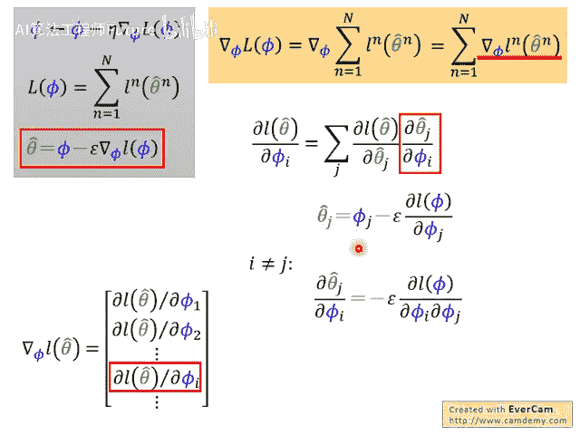

所以它也消失掉了，只剩下后面这一项。后面这一项变成你把本来的这个 **φᵢ** 对 **l(θ)** 的偏微分，再做一次关于 **φᵢ** 的偏微分（即二阶微分）。

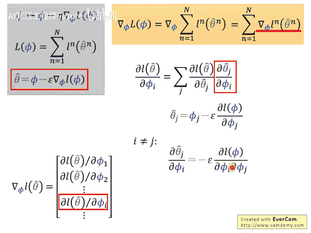

如果是 **i** 等于 **j** 呢？

如果是 **i** 等于 **j** 的话。

那么前面就多了一项 **1**。因为如果 **i** 等于 **j** 的话。

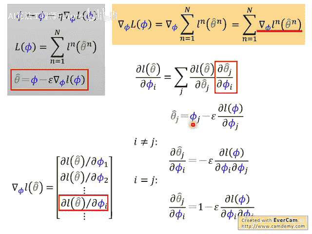

**φⱼ** 对 **φⱼ** 做偏微分等于 **1**。所以前面又多了一项。

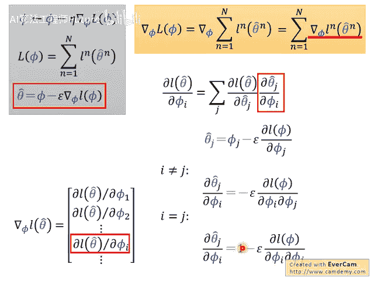

你把所有这些项都带进去，就可以把这个微分的值算出来。

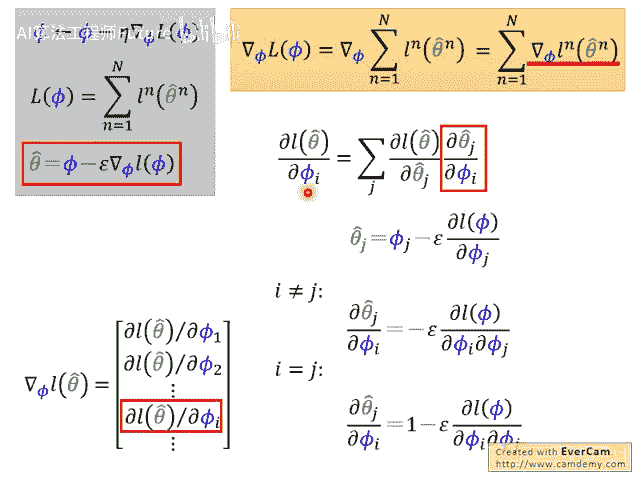

你就可以做 MAML。

但是这样显然需要计算二阶微分，显然是很花时间的。所以在 MAML 的原始论文里。

作者提出了一个想法：可不可以不计算二阶微分项。

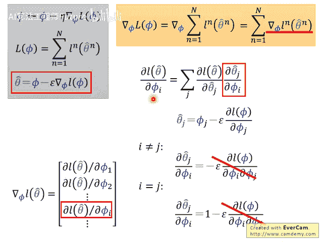

就假装没有看到那个二阶微分项。如果没有看到那个二阶微分项。

你会发现这个式子变得非常简单。当 **i** 不等于 **j** 的时候。

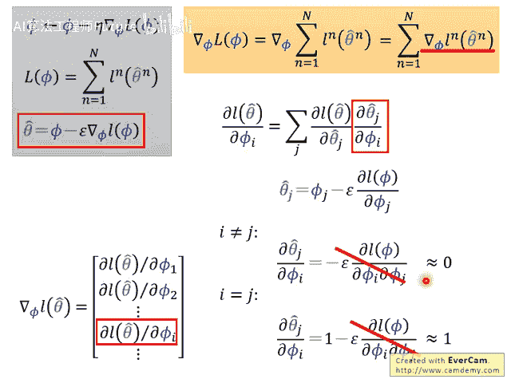

这一项就是 **0**。**i** 等于 **j** 的时候，这一项就是 **1**。那这样会得到什么结果？

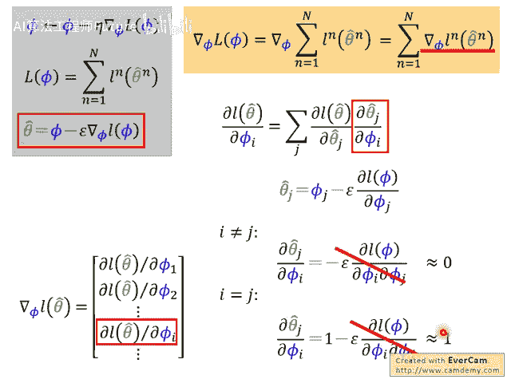

这样就会得到：我们在做求和的时候，不需要对所有的 **j** 求和。

我们只需要考虑 **i** 等于 **j** 的那一项就好。因为当 **i** 不等于 **j** 的时候，红框里面那一项（近似地）是 **0**。

**i** 不等于 **j** 的时候，红框里面那一项被近似为 **0**。所以我们只需要考虑 **i** 等于 **j** 的情况。

所以算出来，我们就可以得到这个近似式子。我们可以说 **φᵢ** 对 **l(θ')** 的偏微分。

可以用 **θ'ᵢ** 对 **l(θ')** 的偏微分来近似。

所以在论文里，作者用一句话概括。

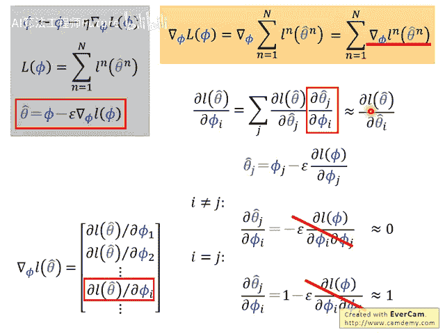

他提了一句，说他用了 **一阶近似**。

刚开始没有详细解释这句话是什么意思，但是根据后人的推测。

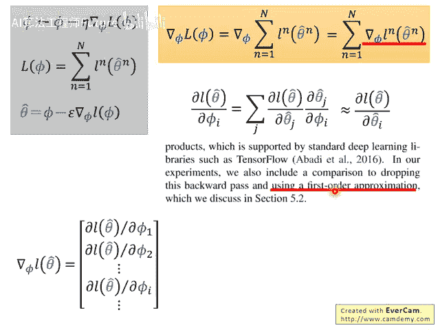

其实就是这个意思。

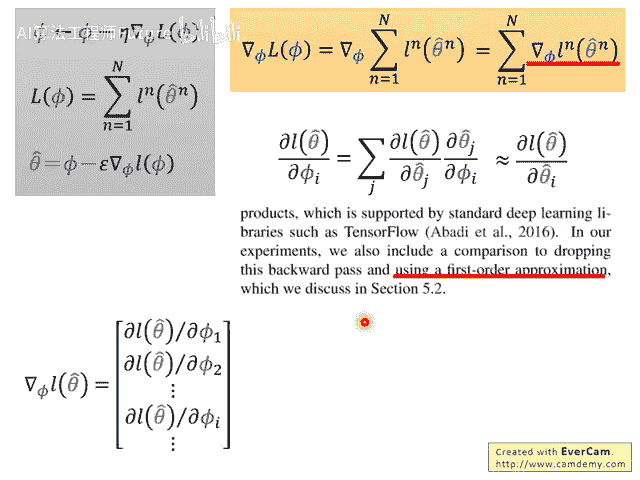

我们现在已经知道，这里的每一项都可以做近似。

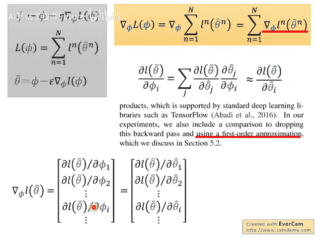

本来我们是算 **φ** 对 **l(θ')** 的偏微分，现在可以改成 **θ'** 对 **l(θ')** 的偏微分。

所以在上面这个式子里面的 **φ**。

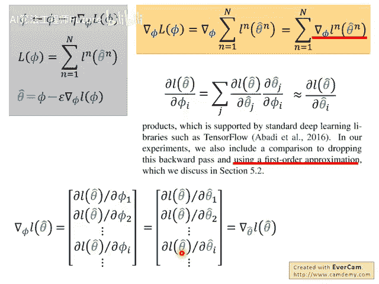

我们就可以把它用 **θ'** 来替代。

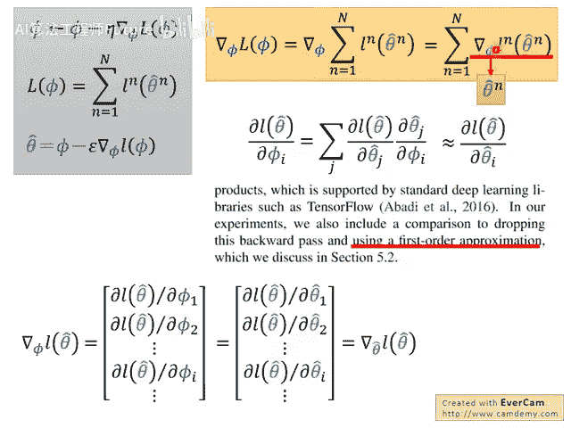

我们就会用 **θ'** 把 **φ** 取代掉。那么实际上在运算的时候。

你就不是拿 **φ** 对 **l(θ')** 做偏微分，这项运算起来有点麻烦。你其实是拿 **θ'** 对 **l(θ')** 直接做偏微分，这个运算起来就简单很多。

---

本节课中我们一起学习了 MAML 算法中核心的梯度计算。我们详细推导了元学习器初始参数 **φ** 的梯度如何通过链式法则依赖于任务更新后的参数 **θ'**，并重点介绍了 MAML 原始论文中提出的 **一阶近似** 技巧。这个技巧通过忽略复杂的二阶微分项，将 **φ** 的梯度近似为 **θ'** 的梯度，从而大大简化了计算，使得 MAML 在实践中变得可行。理解这个近似是掌握 MAML 高效实现的关键。
