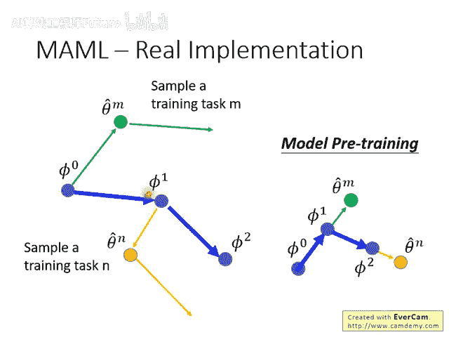
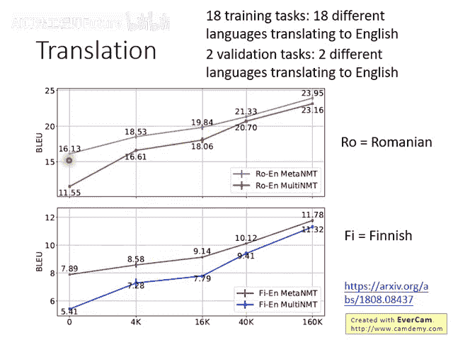

# 101：元学习之MAML 🧠

## 概述

在本节课中，我们将要学习元学习（Meta Learning）中的一种经典方法——MAML（Model-Agnostic Meta-Learning）。我们将重点探讨MAML的具体实现步骤，并将其与模型预训练（Model Pretraining）方法进行对比，以理解其核心思想与优势。

---

## MAML的实现步骤 🔧

上一节我们介绍了MAML的基本概念，本节中我们来看看MAML具体是如何实现的。其核心流程可以概括为以下几个步骤。

以下是MAML算法的一次参数更新循环：

1. 初始化一个模型参数，记为 **φ₀**。
2. 从任务分布中采样一个训练任务，例如任务 **n**。
3. 使用当前参数 **φ₀** 在任务 **n** 上进行一次梯度下降更新，得到适应后的参数 **θₙ**。公式为：**θₙ = φ₀ - α ∇ Lₙ(φ₀)**，其中 **α** 是任务内的学习率。
4. 计算适应后参数 **θₙ** 在任务 **n** 上的损失函数梯度 **∇ Lₙ(θₙ)**。
5. 使用上一步计算出的梯度方向来更新初始参数 **φ₀**。公式为：**φ₁ = φ₀ - β ∇ Lₙ(θₙ)**，其中 **β** 是元学习率。

通过这种方式，MAML优化的目标是找到一个初始参数 **φ**，使得其在任何新任务上仅通过少量（例如一次）梯度更新就能取得良好的性能。

---

## MAML与模型预训练的对比 ⚖️

理解了MAML的实现后，我们来看看它与更常见的模型预训练方法有何不同。虽然两者都旨在获得一个更好的初始模型，但优化目标存在本质区别。

以下是两者在参数更新方向上的核心差异：

- **模型预训练 (Model Pretraining)**：直接计算初始参数 **φ** 在当前任务损失上的梯度 **∇ Lₙ(φ)**，并沿此方向更新 **φ**。其目标是让 **φ** 在所有任务的平均表现上最优。
- **MAML**：先让参数 **φ** 在任务上适应一次得到 **θₙ**，再计算 **θₙ** 的损失梯度 **∇ Lₙ(θₙ)**，并用这个梯度来更新初始的 **φ**。其目标是让 **φ** 在适应（一次更新）后的新参数 **θ** 上表现最优。

简而言之，模型预训练关注“初始模型的即时表现”，而MAML关注“初始模型经过快速适应后的潜在表现”。

---

## MAML的实际应用案例 🌐

之前讨论的MAML似乎应用于一些抽象任务，那么它能否解决实际的工业问题呢？答案是肯定的。文献中已有将MAML应用于机器翻译等实际任务的案例。

一项研究收集了18种不同语言翻译成英语的任务作为训练集，并准备了额外的语言对作为验证集和测试集。

以下是该实验的部分结果图示与分析：

图中横轴代表每个任务可用的训练数据量，纵轴代表翻译性能。紫色线（Meta NMT）代表使用MAML得到的结果，下方线（Multi NMT）代表使用多任务模型预训练的结果。

实验结果表明，在所有数据量设置下，MAML的性能均优于模型预训练。**尤其当每个任务的训练数据非常少时，MAML的优势更为明显**。这验证了元学习在少样本学习场景下的强大能力。

---

## 总结

本节课中我们一起学习了元学习算法MAML的核心内容。我们首先详细拆解了MAML“内循环适应，外循环优化”的两步实现过程。接着，我们通过对比MAML与模型预训练在更新方向上的不同，深刻理解了MAML旨在优化模型“快速适应能力”的本质。最后，我们通过一个机器翻译的实际案例，看到MAML在少样本场景下的显著优势。掌握MAML为处理需要快速学习新任务的问题提供了一个强有力的工具。
