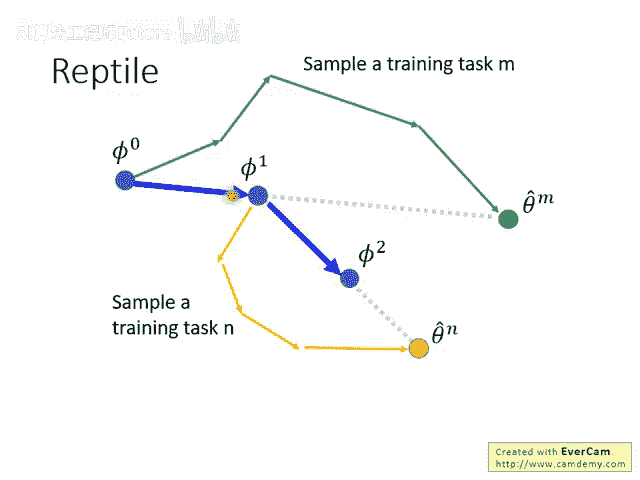
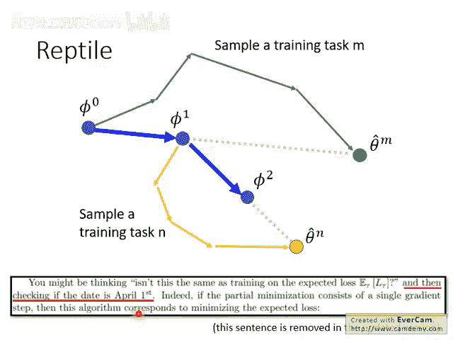
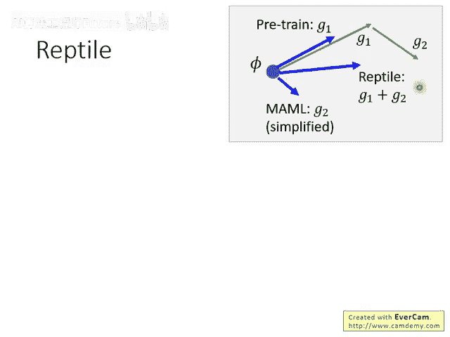
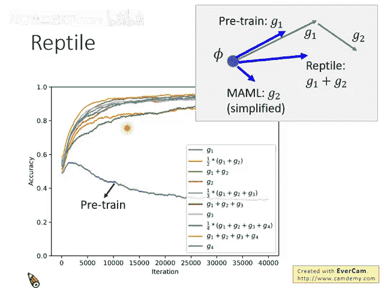
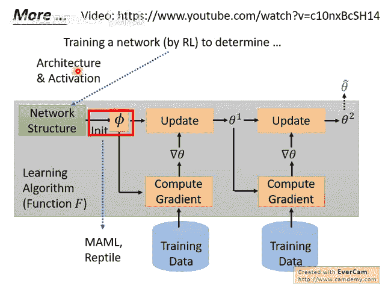
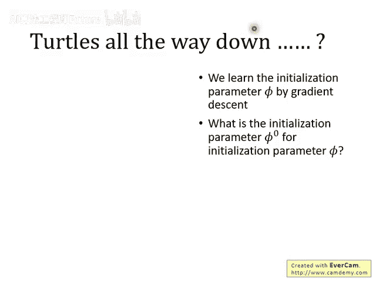
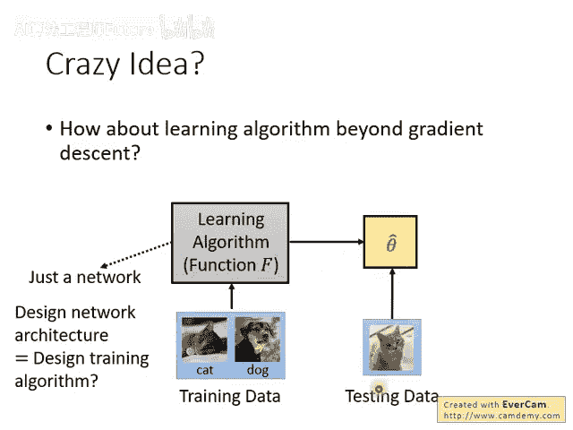
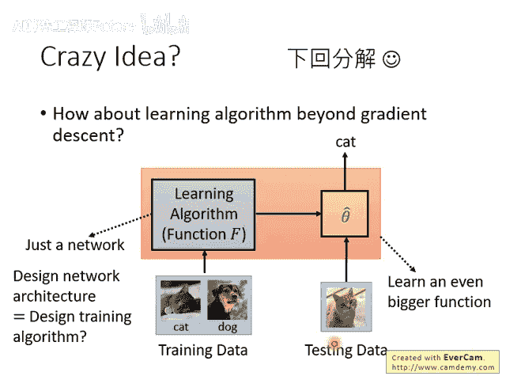

# 102：元学习 – MAML (9-9) 🧠

在本节课中，我们将学习元学习的第二个重要方法——Reptile。我们将详细解释其工作原理，并将其与模型预训练（Pretraining）和MAML方法进行比较，以理解它们之间的核心差异。

## 概述

本节课程将介绍Reptile算法。这是一种比MAML更简单的元学习方法。我们将逐步解析其流程，并通过图示和公式对比它与传统预训练及MAML的区别，最后探讨元学习方法的本质与未来可能的发展方向。

## Reptile 算法详解

Reptile算法的思想非常简单直接。接下来，我们将一步步拆解它的执行过程。

以下是Reptile算法的基本步骤：

1. 首先，我们有一个初始化的模型参数，记为 `θ0`。
2. 随机采样一个任务，例如第 `n` 个任务 `Task_n`。
3. 使用 `θ0` 作为初始参数，在 `Task_n` 上进行训练。Reptile不限制参数更新的次数，可以进行多次梯度下降。
4. 训练完成后，得到针对该任务优化后的参数 `θ_n'`。
5. 计算初始参数 `θ0` 与任务优化参数 `θ_n'` 之间的向量差。这个方向指示了 `θ0` 应向 `θ_n'` 移动的方向。
6. 沿此方向更新初始参数，得到新的参数 `θ1`。
7. 重复上述过程：再采样一个新任务，用 `θ1` 作为起点进行训练，得到新参数后，计算差值并更新 `θ1` 得到 `θ2`。

这个不断采样任务、训练、计算参数差并更新初始参数的过程，就是Reptile。

## Reptile vs. 模型预训练 vs. MAML

你可能会觉得，Reptile 的做法与模型预训练非常相似。模型预训练的目标是寻找一个对所有任务平均表现都最好的初始化参数 `θ`。

Reptile 的作者也意识到了这一点，并在论文初版中幽默地写道：“你可能会想，这难道和直接在期望损失上训练（即预训练）一样吗？” 并附言“然后检查一下今天是不是四月一日”。虽然这句话在后续版本中被移除，但它引出了一个核心问题：它们究竟有何不同？

我们可以通过一个图示来明确展示三者的区别。

假设初始参数为 `θ`，在某个任务上进行两次梯度更新：

- 第一次更新的梯度方向为 `g1`。
- 第二次更新的梯度方向为 `g2`。

那么，不同方法的更新方向如下：

- **模型预训练 (Pretraining)**：其更新方向就是第一次更新的梯度 `g1`。公式为：`θ_new = θ - α * g1`。
- **MAML (使用一阶近似时)**：其更新方向是第二次更新的梯度 `g2`。公式为：`θ_new = θ - β * g2`。
- **Reptile**：其更新方向是两次梯度更新的和 `g1 + g2`。公式为：`θ_new = θ - γ * (g1 + g2)`。

由此可见，Reptile 在某种程度上综合了预训练和 MAML 的更新信息。由于 Reptile 不限制更新步数，如果进行更多步的训练，它可能学到预训练和 MAML 都无法捕获的信息。

## 实验结果对比

以下是 Reptile 在 Omniglot 数据集上的部分实验结果。纵轴性能值越高越好。

从图中可以观察到：

- 蓝色线（代表模型预训练）的性能明显较差。
- MAML（绿色线）和 Reptile（红色线）的性能优于预训练，且两者在此实验中的表现差距不大。

这个结果清晰地表明，元学习方法（MAML/Reptile）在寻找更具适应性的初始化参数方面，显著优于传统的模型预训练方法。

## 元学习的扩展与本质思考

上一节我们介绍了寻找最优初始参数的元学习方法。那么，元学习能否帮助我们找到更多东西呢？答案是肯定的。

存在一系列方法试图用元学习来搜索：

- **网络架构**：一个元网络（`f_meta`）可以输出目标网络的架构。代码示意：`architecture = f_meta(θ_meta)`。
- **激活函数**：元网络可以输出目标网络应使用的激活函数类型。
- **优化器规则**：元网络可以学习如何调整学习率等超参数，甚至自动生成类似 Adam 的优化器更新规则。

由于这些生成过程（如生成网络架构）通常是不可微分的，因此需要借助强化学习或进化算法等工具来训练元网络。

然而，这些元学习方法似乎存在一个本质问题。以 MAML 为例，它为我们学习了一个好的初始化参数 `θ`，但 MAML 自身的训练也需要一个初始参数 `φ`。这就引出了“`φ` 从哪里来”的问题，仿佛陷入了一个“乌龟塔”悖论（世界在乌龟背上，那只乌龟又在更大的乌龟背上，无穷无尽）。我们从“学习”变成了“学习如何学习”，未来可能还需要“学习如何学习如何学习”。

## 总结与展望

本节课中，我们一起学习了以下内容：

1. **Reptile 算法**：一种简单高效的元学习方法，通过在多任务上迭代计算参数更新方向的和来优化初始参数。
2. **方法对比**：明确了 Reptile、模型预训练和 MAML 在更新方向上的核心区别，并通过实验验证了元学习的优势。
3. **元学习扩展**：了解了元学习可应用于自动搜索网络架构、激活函数和优化器规则。
4. **本质思考**：认识到当前元学习方法存在的“无限递归”问题。

最后，我们提到了一个更激进的想法：能否用一个庞大的神经网络 `F` 直接将训练数据和测试数据作为输入，并直接输出测试结果？即 `predictions = F(training_data, test_data)`。这样，我们甚至无需显式获得中间模型参数。这种将训练和测试过程完全内化的方式，可能是元学习的一个未来方向。我们将在后续课程中探讨相关内容。
