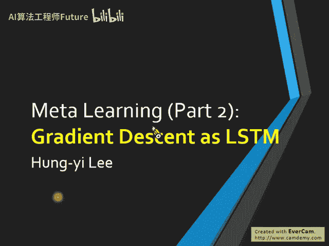
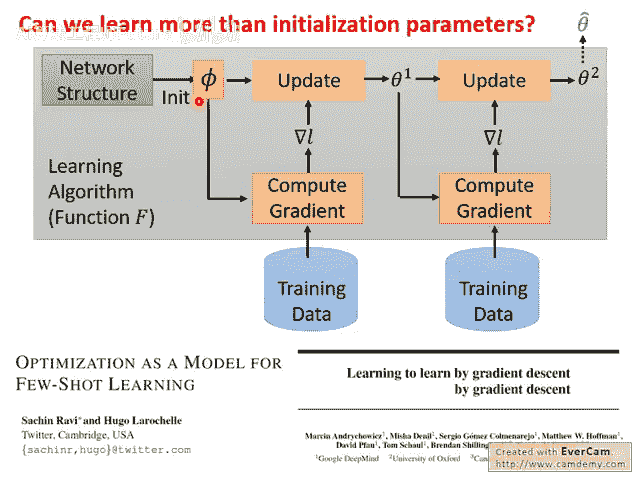
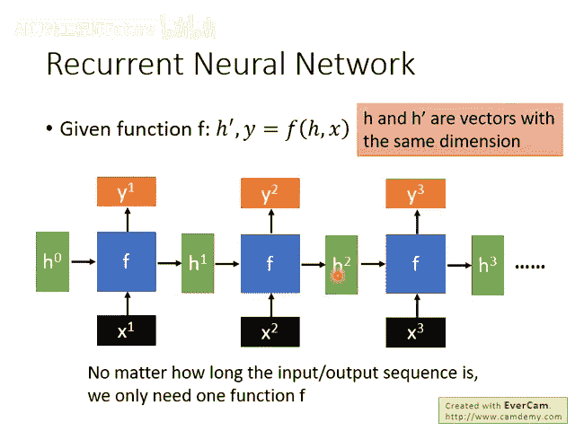
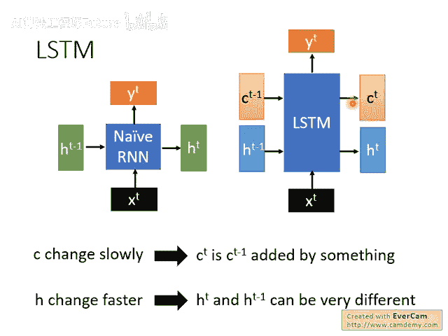
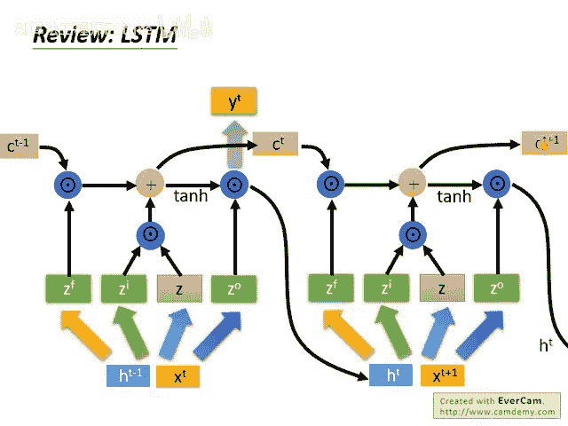

# 103：13-Meta Learning - Gradient Descent as LSTM (1-3) 🧠

在本节课中，我们将要学习如何将我们熟悉的梯度下降算法视为一个长短期记忆网络，并探讨如何通过元学习的方法来学习这个算法本身。



## 概述



上一节我们介绍了元学习中的 MAML 和 Reptile 方法。本节中，我们将更进一步，探讨如何将梯度下降这一学习算法本身，建模为一个 LSTM 网络。通过训练这个 LSTM，我们可以“学习”出梯度下降算法。

## 梯度下降与循环神经网络

我们熟知的梯度下降算法可以表示为以下公式：  

`θ_t = θ_{t-1} - η * ∇L(θ_{t-1})`  

其中，`θ` 是参数，`η` 是学习率，`∇L` 是损失函数的梯度。

上周我们讲到，这个算法中的某些部分，例如**初始参数**，可以通过 MAML 或 Reptile 这类元学习技术来学习。

今天，我们要更进一步。实际上，梯度下降的整个架构可以被视为一个**循环神经网络**。

为什么这么说呢？让我们快速对比一下：

- 在 RNN 中，每个时间步会输入一个数据（如一个词）。
- 在梯度下降中，每个更新步骤会输入一个批量的数据来计算梯度。
- 在 RNN 中，有记忆单元存储过去的信息供后续步骤使用。
- 在梯度下降中，上一步计算出的参数 `θ_{t-1}` 会被传递到下一步继续运算，这类似于 RNN 的记忆功能。

因此，参数 `θ` 可以被看作是 RNN 的记忆状态。将梯度下降视为 LSTM 的技术主要基于两篇论文：

- *Optimization as a Model for Few-Shot Learning*
- *Learning to learn by gradient descent by gradient descent* （题目意为：我们通常通过梯度下降来学习，现在我们要通过梯度下降来学习“如何通过梯度下降来学习”）

## LSTM 快速回顾

为了后续理解，我们先简要回顾一下 LSTM。我们课程录音中有更详细的讲解，这里从一个略微不同的视角进行快速复习。

一个基础的 RNN 单元是一个函数 `f`：  

`(h_t, y_t) = f(h_{t-1}, x_t)`  

它接受上一个隐藏状态 `h_{t-1}` 和当前输入 `x_t`，输出新的隐藏状态 `h_t` 和当前输出 `y_t`。这个函数 `f` 在每个时间步被重复使用，因此能处理任意长度的序列而参数量不变。



然而，如今更常用的是 RNN 的变体——**LSTM**。LSTM 的关键改进在于，它将隐藏状态拆分为两部分：`h`（隐藏状态）和 `c`（细胞状态）。

- **细胞状态 `c`**：变化缓慢，像一条传送带，主要负责长期信息的保留。其更新通常形式为 `c_t = c_{t-1} + something`。
- **隐藏状态 `h`**：变化相对较快，代表短期记忆或当前输出。

这种分离使得 LSTM 能够更好地捕捉长距离依赖关系。

以下是 LSTM 在一个时间步内的具体运算过程，可以用代码逻辑描述：



```python
# 假设 x_t 是当前输入， h_{t-1} 是上一隐藏状态， c_{t-1} 是上一细胞状态
# 将输入和上一隐藏状态连接
concat_input = concatenate([x_t, h_{t-1}])

# 计算候选值、输入门、遗忘门、输出门
z = tanh(W_z * concat_input + b_z)        # 候选记忆值
z_i = sigmoid(W_i * concat_input + b_i)   # 输入门
z_f = sigmoid(W_f * concat_input + b_f)   # 遗忘门
z_o = sigmoid(W_o * concat_input + b_o)   # 输出门

# 更新细胞状态：遗忘旧信息，添加新信息
c_t = z_f * c_{t-1} + z_i * z

# 计算当前隐藏状态
h_t = z_o * tanh(c_t)

# 计算输出（可选，有时 h_t 即作为输出）
y_t = activation(W_y * h_t + b_y)
```

这个过程在每个时间步反复进行，使用同一套参数 `W_*, b_*`。

## 总结



本节课中我们一起学习了将梯度下降算法类比为 LSTM 网络的核心思想。我们回顾了梯度下降的步骤，并将其与 RNN/LSTM 的结构进行了对比，指出了参数 `θ` 类似于网络记忆状态的观点。同时，我们简要回顾了 LSTM 的工作原理，为下一节具体讲解如何将梯度下降形式化为 LSTM 并对其进行元学习打下了基础。下一节我们将深入探讨具体的建模和训练方法。
