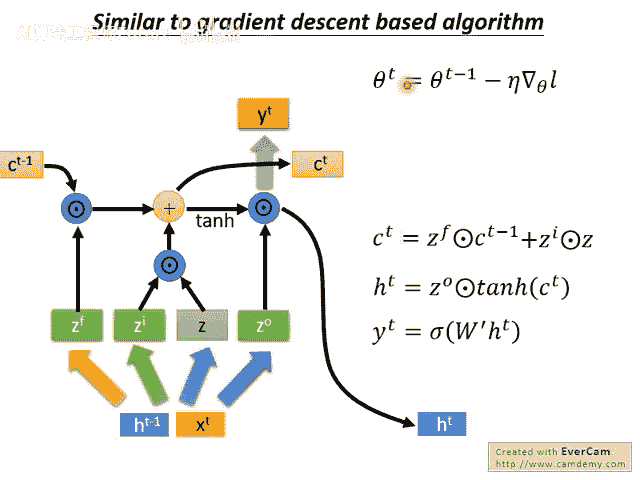
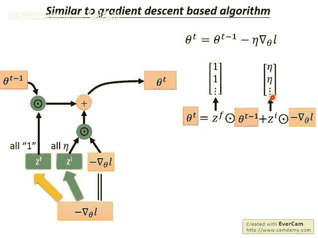
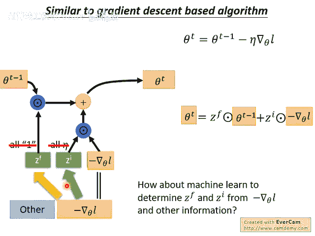
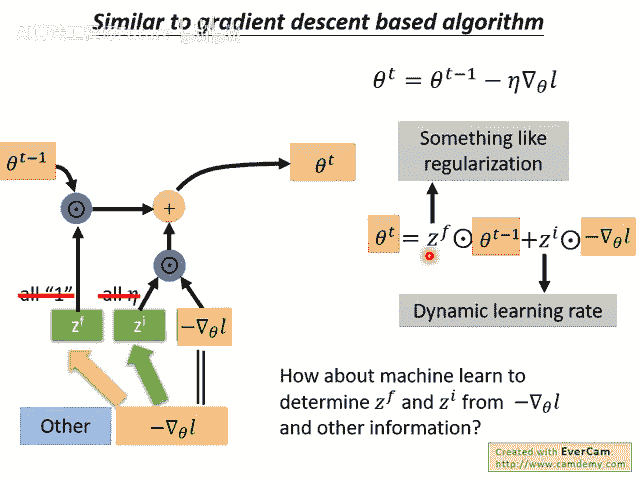
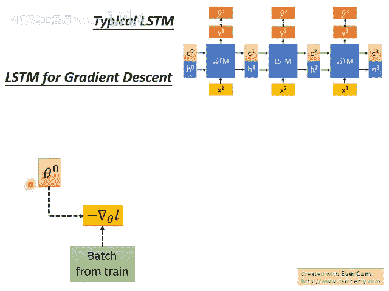
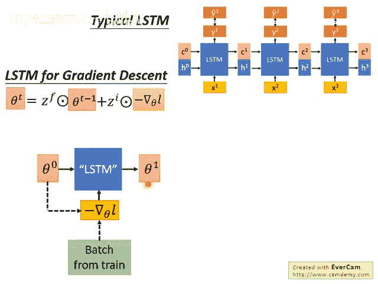
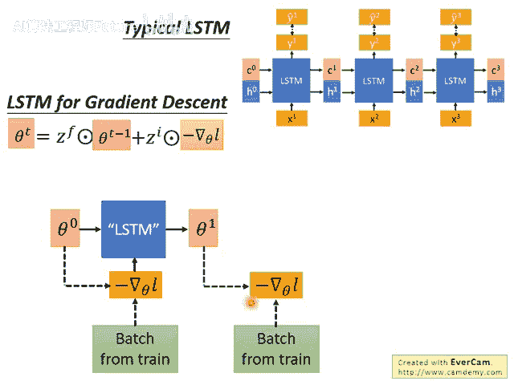
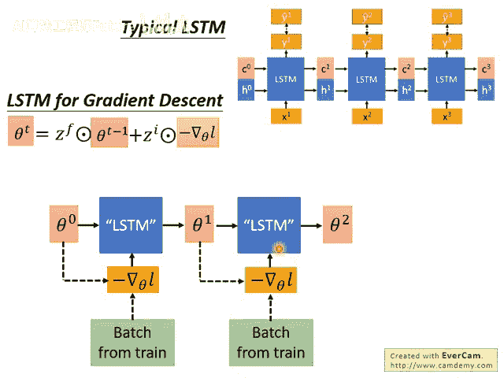
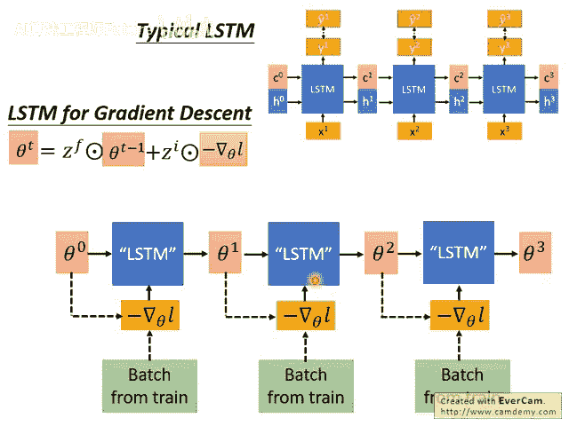

# 104：14-Meta Learning - Gradient Descent as LSTM (2-3) 🧠

在本节课中，我们将学习如何将梯度下降算法视为长短期记忆网络的一个特例。我们将深入探讨两者在数学形式上的联系，并理解如何通过元学习框架，让LSTM自动学习梯度下降中的关键参数。

---

上一节我们介绍了元学习的基本概念，本节中我们来看看梯度下降与LSTM之间的具体对应关系。

梯度下降的更新公式如下：  

`θ_t = θ_{t-1} - η * ∇L(θ_{t-1})`  

其中，`θ_t` 是第 `t` 步的参数，`η` 是学习率，`∇L(θ_{t-1})` 是损失函数在 `θ_{t-1}` 处的梯度。

LSTM中记忆单元 `c_t` 的更新公式为：  

`c_t = f_t ⊙ c_{t-1} + i_t ⊙ z_t`  

其中，`f_t` 是遗忘门，`i_t` 是输入门，`z_t` 是候选值。

通过比较这两个公式，我们可以发现它们结构上的相似性。如果我们进行如下对应：

- 将LSTM中的记忆单元值 `c_{t-1}` 和 `c_t` 视为模型参数 `θ_{t-1}` 和 `θ_t`。
- 将LSTM的输入 `z_t` 设为负梯度 `-∇L(θ_{t-1})`。
- 将遗忘门 `f_t` 固定为1（即永不遗忘）。
- 将输入门 `i_t` 固定为学习率 `η`。

那么，LSTM的更新公式就完全退化为梯度下降的更新公式。因此，**梯度下降可以看作是LSTM的一个简化特例**。在这个特例中，输入门和遗忘门的值是人为预设的，而非学习得到。

---

既然梯度下降是LSTM的简化版，一个自然的想法是：能否让LSTM自动学习这些门控值，而不是人为设定？

以下是这种思路带来的可能性：

- **动态学习率**：让机器自动学习输入门 `i_t`，意味着模型可以为每个参数维度、在每个时间步动态地决定学习率，而非使用一个固定值。
- **自动权重衰减**：遗忘门 `f_t` 的作用是将上一个时间步的参数值进行缩放。这与正则化技术中的权重衰减效果类似。通过让机器自动学习 `f_t`，模型可以自动决定需要进行多少“权重衰减”，而无需手动设置衰减系数。

---

在实现上，这种“梯度下降LSTM”的架构与标准LSTM有所不同。

下图展示了标准LSTM与用于元学习的梯度下降LSTM在数据流上的对比：

在梯度下降LSTM架构中：

1. 我们从一个初始参数 `θ_0` 开始。
2. 采样一个批次的数据，计算损失并得到负梯度 `-∇L`。
3. 将负梯度作为输入，送入一个LSTM单元。此时，LSTM的遗忘门 `f_t` 和输入门 `i_t` 不再是固定值，而是由LSTM自身根据输入（可能还包括当前损失值等额外信息）计算得出。
4. LSTM输出更新后的参数 `θ_1`，该过程本质上执行了 `c_t = f_t ⊙ c_{t-1} + i_t ⊙ z_t`，其中 `c` 对应 `θ`，`z` 对应 `-∇L`。
5. 重复步骤2-4，进行多次参数更新（例如得到 `θ_2`, `θ_3`）。
6. 将最终得到的参数（如 `θ_3`）在测试数据上计算损失 `L(θ_3)`。
7. 我们的目标是**最小化这个最终的测试损失** `L(θ_3)`。因此，我们会通过梯度下降方法，反向传播这个最终损失，来更新**LSTM自身的参数**（即那些控制门控机制的权重），从而让LSTM学会如何更好地更新模型参数 `θ`。

---

这种架构与标准LSTM存在一个关键区别，并带来一个实现上的便利特性。

**关键区别：输入依赖**  

在标准LSTM中，外部输入 `x_t` 与记忆单元 `c_{t-1}` 是独立的。然而在梯度下降LSTM中，当前参数 `θ_{t-1}`（即 `c_{t-1}`）直接影响下一个时间步计算出的梯度 `-∇L(θ_{t-1})`（即输入）。这形成了一个循环依赖。在反向传播时，误差信号理论上会通过两条路径回传：一条通过LSTM内部，另一条通过“参数->梯度”这个计算块。为了简化实现并与标准LSTM框架保持一致，在现有研究中通常**忽略后一条路径**，只沿LSTM内部进行反向传播。

**便利特性：学习初始参数**  

与MAML等元学习方法类似，LSTM中记忆单元的初始值 `c_0`（即模型参数的初始值 `θ_0`）也可以作为可训练的参数。这意味着，元学习过程不仅学会了“如何更新参数”，还可以同时学会“从什么样的参数开始更新”更好。

---

本节课中我们一起学习了梯度下降与LSTM在数学形式上的等价关系。我们了解到，通过将梯度下降视为一个门控值固定的LSTM，可以自然地将其推广为一个更强大的元学习器——让LSTM自动学习动态的学习率和权重衰减策略。我们还分析了这种“梯度下降LSTM”在架构和训练上的特点。这为我们提供了一种通过设计可学习的优化器来进行元学习的清晰视角。
