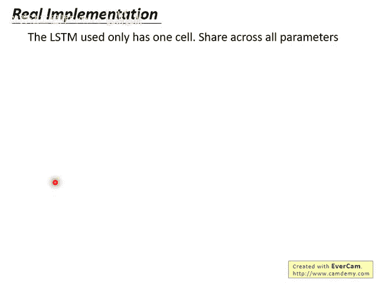
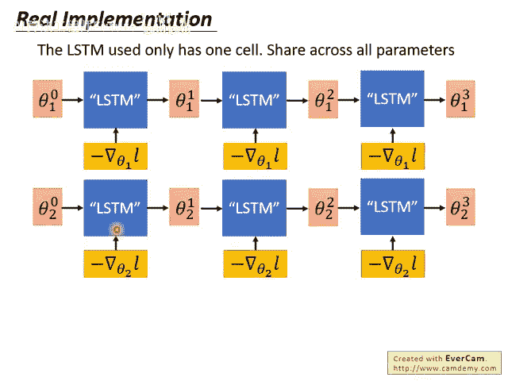
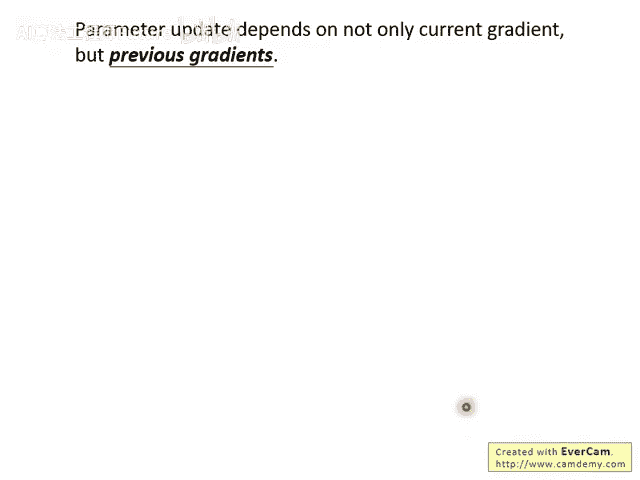
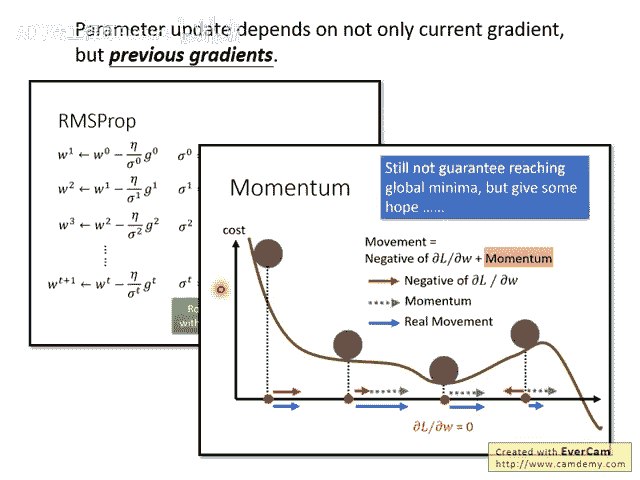
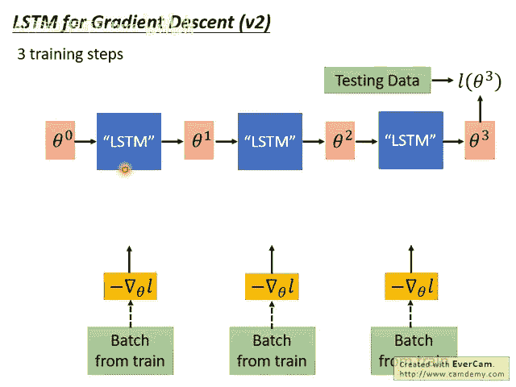
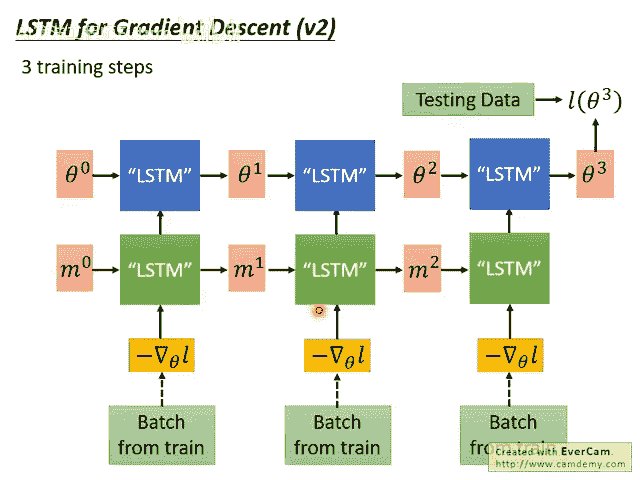
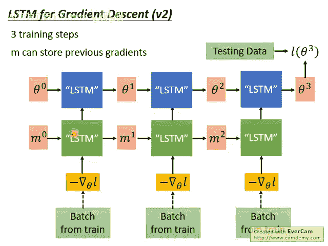

# 105：15-Meta Learning - Gradient Descent as LSTM (3-3) 🧠

在本节课中，我们将学习如何将梯度下降过程本身视为一个长短期记忆网络（LSTM）来优化，并探讨其在实际实现中的关键技巧与优势。

## 概述

上一节我们介绍了将梯度下降类比为LSTM的基本思想。本节中，我们来看看这种思想在实际实现时会遇到哪些挑战，以及研究者们如何通过巧妙的简化来解决这些问题，并最终获得超越传统优化算法的性能。

## 实现中的简化策略

在实现上，一个直接的问题是：LSTM中的记忆单元（memory cell）值对应网络参数，而网络参数动辄十万、百万个。难道要构建一个拥有十万或百万个单元的LSTM吗？这显然是不现实的。

**实现方法**：  

在实际操作中，研究者做了一个非常大的简化：**整个模型只使用一个LSTM单元来处理一个参数**，并且所有参数都**共用同一个LSTM**。

这意味着，无论你有一百万个参数还是一千万个参数，都使用同一个训练好的LSTM来处理。

我们用下标 `i` 来代表模型中的第 `i` 个参数。虽然同一个LSTM依次处理每个参数，但参数 `θ_i` 和参数 `θ_j` 的处理规则是相同的。

你可能会问，使用相同的处理规则，会不会为所有参数计算出相同的更新值呢？**答案是不会**。原因在于：

- 每个参数的初始值 `θ_i^0` 不同。
- 每个参数在每次迭代时计算出的梯度 `g_i^t` 也不同。

在初始参数和梯度都不同的情况下，即使更新参数的LSTM规则（即LSTM的参数）相同，最终计算出的更新值也不会相同。

这就是“用LSTM实现梯度下降”在实际中的实现方法。

## 简化策略的优势

这种简化策略带来了几个显著的好处：

以下是采用此策略的三个主要优势：

1. **可行性**：训练一个拥有十万个单元的LSTM网络几乎不可能。而共用LSTM单元的方法是更可行的方案。
2. **合理性**：这个设计与人类手工设计的优化算法（如RMSProp、Adam）理念一致。这些算法也是对所有参数应用**相同的更新规则**，并不会为不同参数定制不同规则。因此，让模型学习一个通用的更新规则是合理的。
3. **灵活性**：我们之前提到元学习（Meta Learning）的一个限制是，训练任务和测试任务的模型架构必须相同。但在这种实现方式下，由于所有参数共用同一个LSTM更新器，**训练和测试时可以使用不同的模型架构**。

## 文献实验结果分析

接下来，我们看看这种方法在文献中的实验结果。实验通常在少样本学习（Few-Shot Learning）任务上进行。

横轴表示参数更新的次数（每次训练迭代进行10次更新）。左图展示了LSTM中**遗忘门（Forget Gate）** 的值从第1层到第5层的变化。可以看到，在不同任务中（红色线条），遗忘门的值几乎都稳定在接近1的位置。这表明LSTM自动学习到：在一般的梯度下降中，上一时刻的参数状态 `c^{t-1}` 应该几乎完整地保留下来（即乘以1），这与梯度下降中参数缓慢衰减的特性相符。

右图展示了**输入门（Input Gate）** 值的变化，其模式更为复杂。这至少说明LSTM学习到的不是一个固定的学习率，而是一个**动态变化**的学习率策略。

## 架构的进一步扩展

我们还可以进一步改进这个架构。回想一下，人类设计的优化算法（如动量法）在决定当前更新时，不仅考虑当前梯度，还会考虑**过去梯度的历史信息**。

例如，RMSProp需要累积过去梯度的平方；动量法需要记住过去的梯度以计算当前动量。但在之前的架构中，我们并没有让机器显式地记忆历史梯度。

因此，我们可以做进一步的延伸：

我们在原有架构上增加另一个LSTM。现在，梯度先输入到这个新的LSTM（图中下方绿色部分），由其输出一个中间结果，再用于更新参数。

这个绿色LSTM的作用可能是**累积过去的梯度**，从而实现类似动量法的效果。它可以学习如何结合历史梯度信息来辅助当前的参数更新。

需要说明的是，这个“完全体”架构（同时包含上下两个LSTM）是课程的一种合理推想。在原论文《Optimization as a Model for Few-Shot Learning》中，作者使用了下方绿色的LSTM，但上方是一个简单的梯度下降规则。而另一篇相关论文则使用了上方的LSTM。将两者结合是一个很自然的想法。

## 论文核心实验结果

以下是相关论文中的关键实验结果：

以下是论文中的几个重要实验发现：

1. **Toy Example（合成数据实验）**：在构造的大量训练任务上，使用LSTM作为优化器的方法表现非常强大，其下降速度比人为设计的Adam、RMSProp等优化器更快，并能收敛到更低的损失值。
2. **MNIST实验（有瑕疵）**：作者首先在MNIST数据集上测试，但这里的训练和测试任务都是MNIST，这与元学习要求训练与测试任务不同的前提不符。因此这个实验结果虽好，但说服力不强。
3. **真正的元学习实验**：为了进行真正的元学习实验，作者确保训练和测试使用**不同的模型架构**。
  
  **实验A**：训练时使用1层20个神经元的网络，测试时使用1层40个神经元的网络。结果成功，且性能优于手工优化器。
  **实验B**：训练时使用1层网络，测试时使用2层网络。同样成功。
  **实验C**：训练时激活函数为Sigmoid，测试时改为ReLU。**这个方法失败了**。这表明，当训练和测试的激活函数不同时，学习到的LSTM优化器无法很好地跨模型应用。

此外，即使在MNIST实验中使用相同数据集，为了制造任务差异，每次训练和测试时**输入数据的顺序（Sampling的Batch）也会被随机打乱**，这在一定程度上创造了不同的任务分布。

## 总结

本节课我们一起学习了将梯度下降过程视为LSTM来优化的具体实现方法。核心在于**所有参数共享一个LSTM更新器**，这解决了参数量过大的问题，并带来了跨架构应用的潜力。我们还看到了该方法在实验中展现出的强大性能，以及其在模型架构变化（尤其是激活函数变化）时面临的局限性。这为我们理解如何让机器自动学习优化算法提供了重要的视角。
