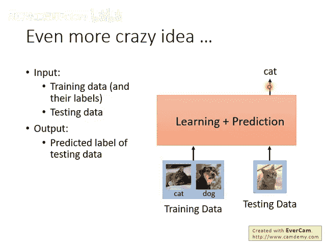
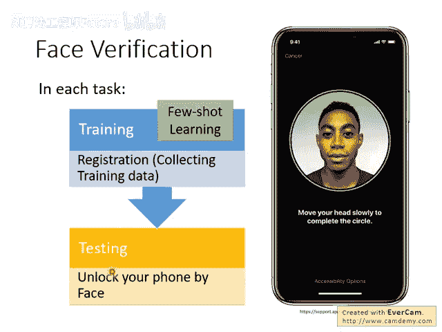
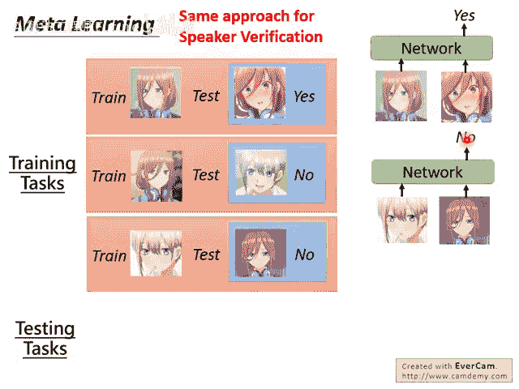
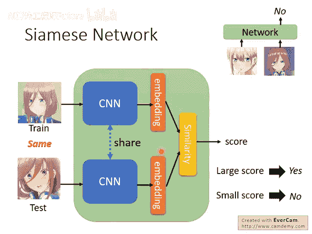

# 106：Meta Learning – Metric-based (1-3) 🧠


## 概述

在本节课中，我们将要学习一种基于度量（Metric-based）的元学习方法。我们将探讨如何设计一个能够同时处理训练和测试阶段的函数，并以人脸验证任务为例，详细介绍其核心思想与具体实现。

---



## 基于度量空间的元学习方法

上一节我们介绍了元学习的基本概念，本节中我们来看看一种具体的实现方法：基于度量空间的方法。

接下来我们要实践上周讲过的想法，即直接学习一个函数。这个函数同时完成了学习和测试两个步骤。你给它训练数据，它在这个函数内部完成学习；然后你给它测试数据，它就直接输出测试数据的答案。这个想法在实际应用中是有效的。


## 应用场景：人脸验证与识别

什么样的应用会用到这样的技术呢？人脸验证（Verification）和人脸识别（Identification）听起来相似，但其实不同。

以下是两者的区别：

- **人脸验证**：这是一个是非题。给定一张人脸图片，判断它是否是某个特定的人。例如，手机的人脸解锁功能就是验证当前人脸是否是手机主人。
- **人脸识别**：这是一个选择题。给定一张人脸图片，判断它是已知一组人中的哪一个。例如，公司的门禁系统需要识别当前员工是哪一位。



本节课主要讨论人脸验证任务。其实，人脸验证是一个少样本学习问题。当你为新手机录入人脸时，收集的几张照片就是训练数据。在使用时，手机根据这些训练数据来判断新看到的脸是否是主人。


## 任务形式化

这个任务也是一个元学习任务。我们以人脸验证为例进行说明，语音验证的做法在框架上是完全一致的，只需更换模型架构和输入数据。

首先，你需要收集一些训练任务。一个训练任务包含一张训练时的人脸（例如，角色A）和一张测试时的人脸（例如，也是角色A）。这个任务的正确答案是“是”（Yes），即测试人脸与训练人脸属于同一个人。这个网络接收训练数据和测试数据，直接输出答案。


你不能只收集一个任务，需要收集更多。例如：

- 训练脸是角色A，测试脸是角色B，正确答案是“否”（No）。
- 训练脸是角色B，测试脸是角色A，正确答案是“否”（No）。



在测试阶段，使用的面孔不应出现在训练任务中。例如，训练时用了角色A和B，测试时则用新角色C。测试任务会提供一张角色C的训练脸和另一张测试脸，模型需要判断它们是否属于同一个人。

## 核心实现：孪生网络

那么，这个同时处理训练和测试的网络具体如何实现呢？实际上，其架构设计并没有那么神奇，最常见的一种设计叫做**孪生网络**。

在孪生网络中，通常有两个卷积神经网络。输入的训练图片和测试图片分别通过这两个CNN，得到两个嵌入向量。

**核心公式/代码描述**：

```python
# 伪代码示意
embedding_train = CNN(train_image)
embedding_test = CNN(test_image)
# 通常这两个CNN共享参数（weight sharing）
```

通常，这两个CNN会共享参数，因为输入都是图像。如果训练和测试数据形态差异很大，也可以使用不同的参数。

接下来，计算这两个嵌入向量的相似度。

**核心公式**：

- 余弦相似度：`similarity = cos(embedding_train, embedding_test)`
- 欧氏距离：`distance = ||embedding_train - embedding_test||`

得到一个数值。这个数值越大，代表网络输出“是”的可能性越高；数值越小，代表输出“否”的可能性越高。




在训练时，你告诉模型：如果输入的训练和测试数据属于同一个人，则输出的分数应越大越好；反之，若属于不同人，则输出的分数应越小越好。然后进行训练即可。

## 为什么称为“孪生”网络？

“Siamese”是暹罗的意思。之所以叫孪生网络，是因为英文中“Siamese”有“连体的、孪生的”含义，源于一对著名的暹罗连体双胞胎。因此，Siamese Network 常被翻译为**孪生网络**。

很多时候，孪生网络被直接介绍，而不一定强调其与元学习的关系。网络上已有大量文章将其作为少样本学习方法介绍。本节课从元学习的框架切入，是为了阐明为什么孪生网络可以被视为一种元学习方法，以及它如何融入这个框架。它看似神奇，能直接吃训练和测试数据并给出答案，但其内部架构设计直观且简洁。


---

## 总结

本节课中，我们一起学习了基于度量的元学习方法。我们了解了如何设计一个能同时处理学习与推理的函数，并以人脸验证任务为例，详细讲解了其应用场景和任务形式。最后，我们深入探讨了实现这一思想的核心架构——孪生网络，包括其共享参数的双分支设计以及通过计算嵌入向量相似度来做出决策的原理。
