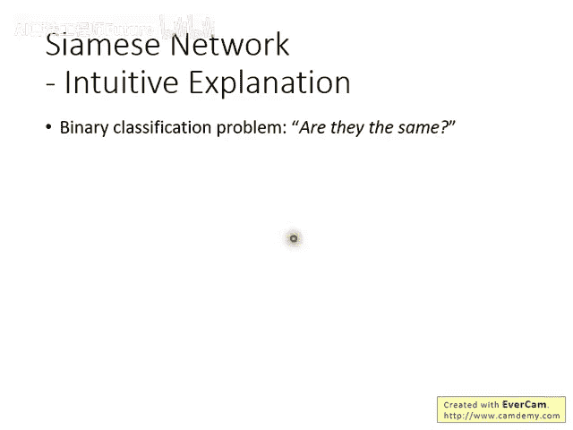
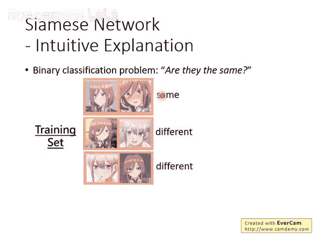
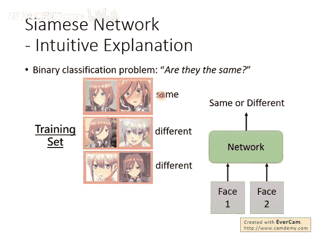
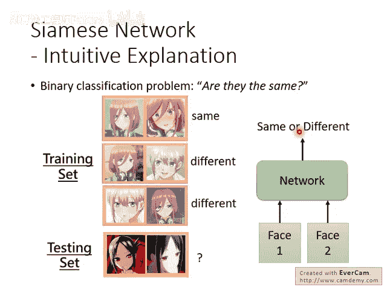
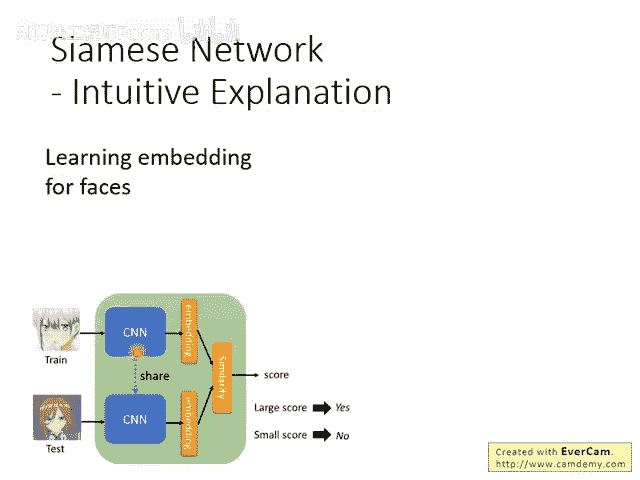
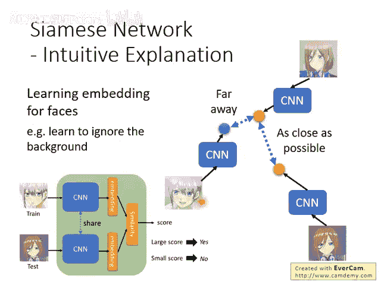
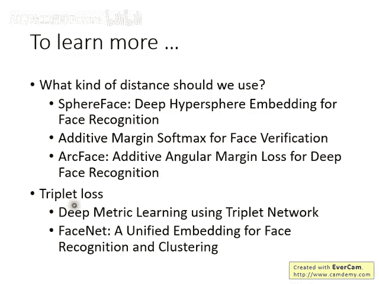

# 107：17-Meta Learning – Metric-based (2-3) 📚

在本节课中，我们将深入探讨基于度量的元学习，特别是**Siamese Network**的工作原理。我们将从一个更直观的视角来理解它，并解释其内部设计的意义，以及它与传统方法的区别。

---

## 直观理解Siamese Network 🔍

上一节我们介绍了Siamese Network的基本概念。本节中，我们来看看如何更直观地理解它的工作。

Siamese Network实际上可以被视为一个单纯的**二元分类**问题。你无需从元学习的复杂框架去看待它，可以简单地认为它就是一个判断两张图片是否相同的分类器。

这个二元分类问题的输入是两张图片，输出是一个判断：这两张图片是相同的（属于同一类）还是不同的（属于不同类）。

在训练时，每一笔训练资料都包含两张图片和一个标签。标签指示这两张图片是否代表同一个人。相同则为一类，不同则为另一类。

因此，它本质上是一个二元分类问题：直接训练一个神经网络，输入两张人脸图片，输出它们是否相同。在测试时，直接应用这个训练好的网络即可。

所以，对于人脸验证问题，从二元分类的角度来解释Siamese Network，比从元学习框架来解释更为直接和容易理解。

---

## Siamese Network的设计意义 🏗️

理解了其基本任务后，我们来看看Siamese Network内部架构的设计目的。

Siamese Network的核心目标是使用一个**卷积神经网络**，将所有人脸图片映射（投影）到一个新的特征空间中。在这个空间中，**同一个人的不同照片会彼此接近，而不同人的照片则会彼此远离**。

这是因为，即使在像素层面上，同一个人向左看和向右看的照片差异也可能很大。CNN的作用就是学习忽略这些无关的像素变化（如姿势、光照），而提取出能够标识身份的本质特征。

在训练过程中，我们的目标是优化这个映射过程：

- 对于同一个人的两张图片，我们希望它们在这个特征空间中的**距离尽可能小**。
- 对于不同人的两张图片，我们希望它们在这个特征空间中的**距离尽可能大**。

---

## 与传统降维方法的对比 ⚖️

你可能会问，我们之前课程中学过的其他降维方法（如PCA、自编码器）与Siamese Network有何不同？

以下是关键区别：

- **自编码器** 的目标是尽可能无损地重建输入数据，它保留所有信息，但**不知道哪些信息对特定任务（如身份识别）是重要的**。例如，它可能认为背景颜色也是重要信息。
- **Siamese Network** 通过“拉近同类、推远异类”的训练目标，**迫使网络学习到对身份判别任务至关重要的特征**（如五官、发型），并自动忽略不重要的特征（如背景颜色、光照）。

因此，Siamese Network学习到的嵌入表示比通用的自编码器表示更具任务针对性。

---

## 距离计算与扩展方法 📏

在特征空间中，如何计算两个点之间的距离呢？这有很多不同的方法，选择不同的距离度量可能会带来不同的结果。

我们在此不深入展开，仅列出一些常见的参考方法：

- 欧氏距离：`distance = sqrt(sum((x_i - y_i)^2))`
- 余弦相似度：`similarity = (x·y) / (||x|| * ||y||)`
- 曼哈顿距离等

此外，基础的Siamese Network使用成对数据训练。还有一种性能往往更好的训练方式叫做 **Triplet Loss**。

在Triplet Loss中，每次输入三张图片：

1. 一张锚点图片（Anchor）
2. 一张与锚点属于同一个人的正样本图片（Positive）
3. 一张与锚点属于不同人的负样本图片（Negative）

网络的学习目标是：**锚点与正样本之间的距离，要小于锚点与负样本之间的距离，并且要至少小于一个边界值（margin）**。这能使同类样本的聚类更紧密，不同类样本的分离更清晰。

---

## 总结 ✨

本节课中，我们一起学习了：

1. Siamese Network可以直观地理解为一个**二元分类器**，用于判断两张图片是否相同。
2. 其核心设计意义在于学习一个**特征映射空间**，使同类样本靠近、异类样本远离。
3. 与自编码器等通用降维方法相比，Siamese Network学习到的特征表示**更专注于特定任务**。
4. 我们简要介绍了特征空间中的**距离计算方法**以及更先进的**Triplet Loss**训练策略。

通过本节内容，你应该对基于度量的元学习，特别是Siamese Network的原理和优势有了更清晰的认识。
